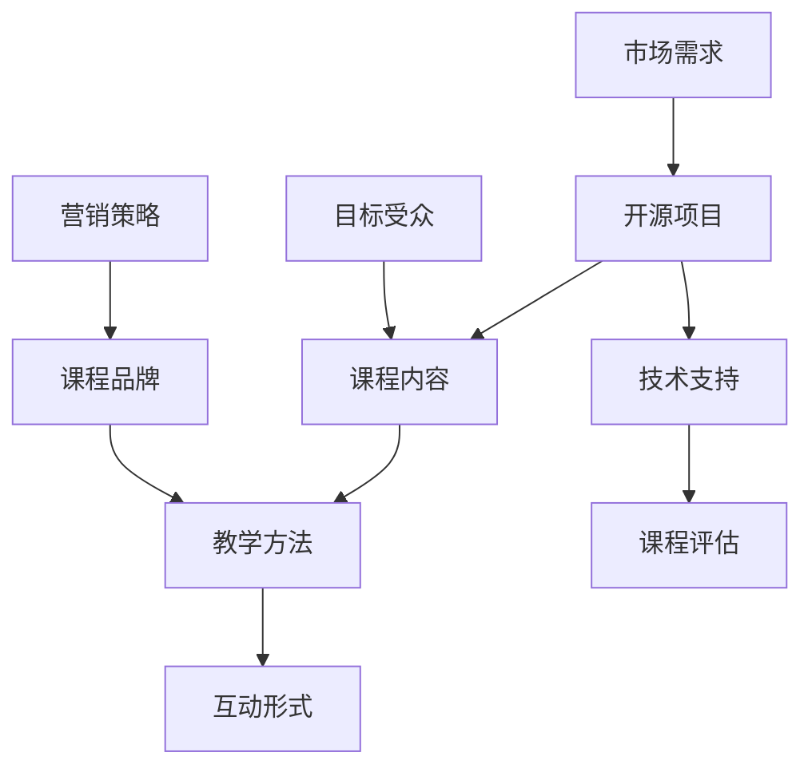

                 

## 创建开源项目的企业级培训课程：课程设计和营销

### 关键词：
- 开源项目
- 企业级培训
- 课程设计
- 营销策略
- 教学方法

### 摘要：
本文将探讨如何创建一个面向企业的开源项目培训课程。首先，我们将分析开源项目的特点及其在企业培训中的价值。随后，讨论课程设计的核心要素，包括课程内容、教学方法、互动形式以及技术支持。接着，我们将深入探讨课程营销的策略，包括市场调研、目标受众定位、课程品牌建设以及推广方法。最后，本文将总结开源项目培训课程的发展趋势和面临的挑战，并提供相关资源和工具推荐，以帮助读者顺利开展课程设计和营销工作。

## 1. 背景介绍

### 1.1 目的和范围

本文的目标是帮助企业和教育机构设计并实施开源项目培训课程，以提高员工的技术能力和项目开发技能。课程范围涵盖开源项目的核心概念、实际操作步骤、开发工具使用以及项目管理和营销策略。通过本文的指导，读者将能够构建一个系统化、专业化的培训课程，满足企业内部培训和外部市场推广的需求。

### 1.2 预期读者

预期读者包括企业技术主管、教育培训机构负责人、开源项目开发者以及对此领域有兴趣的IT专业人士。本文旨在为这些读者提供实用的指导和建议，帮助他们成功创建和推广开源项目培训课程。

### 1.3 文档结构概述

本文分为十个部分，具体结构如下：

1. 背景介绍
2. 核心概念与联系
3. 核心算法原理与具体操作步骤
4. 数学模型与公式
5. 项目实战：代码实际案例和详细解释说明
6. 实际应用场景
7. 工具和资源推荐
8. 总结：未来发展趋势与挑战
9. 附录：常见问题与解答
10. 扩展阅读与参考资料

### 1.4 术语表

#### 1.4.1 核心术语定义

- **开源项目**：指代码和资源对外公开，允许用户自由使用、研究、修改和分发软件的项目。
- **企业级培训**：为企业量身定制的培训项目，旨在提高员工的专业技能和团队协作能力。
- **课程设计**：指根据教学目标，规划课程内容、教学方法和评估方式的过程。
- **营销策略**：指为了推广课程，采用的一系列市场调研、目标受众定位、品牌建设和推广方法。

#### 1.4.2 相关概念解释

- **教学目标**：指课程希望达到的具体学习成果和能力提升。
- **课程内容**：包括理论讲解、实践操作、案例分析等教学材料。
- **互动形式**：指教学过程中师生之间的互动方式，如讨论、问答、实践项目等。
- **技术支持**：指为课程提供的技术资源和技术帮助。

#### 1.4.3 缩略词列表

- **IDE**：集成开发环境（Integrated Development Environment）
- **API**：应用程序接口（Application Programming Interface）
- **SQL**：结构化查询语言（Structured Query Language）
- **Kubernetes**：容器编排平台（Container Orchestration Platform）

## 2. 核心概念与联系

在创建开源项目的企业级培训课程之前，我们首先需要理解一些核心概念和它们之间的联系。以下是一个简化的 Mermaid 流程图，用于描述这些概念及其相互关系。



### 2.1 开源项目的核心概念

- **开源项目的定义**：开源项目是指代码、文档和资源对外公开的项目，用户可以在遵守相应许可协议的前提下自由使用、修改和分发。
- **开源项目的优势**：开源项目具有灵活性高、社区协作性强、迭代速度快等优势，适用于企业创新和技术发展。
- **开源项目的挑战**：开源项目需要有效管理和维护，避免技术债务和代码质量下降。

### 2.2 课程设计的核心概念

- **课程内容**：包括理论知识、实践操作和案例分析，旨在帮助学员掌握开源项目的开发和管理技能。
- **教学方法**：包括讲授、讨论、实践和评估等多种形式，以适应不同学员的学习需求和风格。
- **互动形式**：通过线上和线下讨论、问答和实践项目，促进学员之间的交流和知识共享。
- **技术支持**：提供必要的工具、资源和指导，帮助学员顺利完成课程学习和项目开发。

### 2.3 课程与开源项目的关系

- **课程内容与开源项目的结合**：课程内容可以根据开源项目的技术特点进行设计，使学员能够在实际项目中应用所学知识。
- **开源项目在课程中的角色**：开源项目可以作为课程案例、实践项目和项目评估的依据，增强课程的实用性和吸引力。

## 3. 核心算法原理 & 具体操作步骤

在设计开源项目培训课程时，我们需要明确核心算法原理和具体操作步骤，以便学员能够系统地学习和掌握相关技能。

### 3.1 开源项目开发流程

以下是一个简化的伪代码，描述开源项目开发的典型流程：

```pseudo
function 开源项目开发流程（项目名称）{
    初始化项目结构
    编写项目文档
    实现功能模块
    进行代码审查
    发布版本
    收集用户反馈
    更新和完善代码
}
```

### 3.2 课程教学流程

课程教学流程可以分为以下几个步骤：

1. **课程规划**：根据课程目标和受众需求，规划课程内容、教学方法和评估方式。
2. **课程准备**：准备教学材料、工具和资源，确保课程顺利进行。
3. **课程讲授**：采用讲授、讨论和互动形式，引导学员学习理论知识。
4. **实践操作**：组织学员进行实践操作，掌握开源项目开发的实际技能。
5. **项目评估**：通过项目完成情况和学员反馈，评估课程效果和学员能力。
6. **持续改进**：根据评估结果，优化课程内容和方法，提高教学质量。

### 3.3 互动教学策略

互动教学策略包括以下几个方面：

1. **线上讨论**：通过论坛、聊天工具等平台，组织学员进行线上讨论和交流。
2. **线下活动**：组织线下讲座、工作坊和实践活动，促进学员之间的互动。
3. **案例分享**：邀请开源项目开发者分享实践经验，为学员提供实际案例。
4. **代码审查**：组织学员进行代码审查，提高代码质量和协作能力。

## 4. 数学模型和公式 & 详细讲解 & 举例说明

在开源项目培训课程中，某些算法和数据分析方法可能涉及数学模型和公式。以下是一些常见的数学模型和公式的讲解及示例。

### 4.1 代码质量评估指标

代码质量评估可以使用以下数学模型和公式：

- **代码复杂度**：使用 cyclomatic complexity（Cyclomatic 复杂度）指标评估代码复杂度。

    $$ V(G) = M - N + 2p $$

    其中，\( V(G) \) 表示 cyclomatic complexity，\( M \) 表示模块中的边数，\( N \) 表示模块中的节点数，\( p \) 表示程序中异常边数。

- **代码质量评分**：使用代码质量评分模型，如 MCLOC（Method Count of Lines of Code）。

    $$ Q = \frac{M_L}{T_L} \times 100 $$

    其中，\( Q \) 表示代码质量评分，\( M_L \) 表示模块中的代码行数，\( T_L \) 表示总代码行数。

### 4.2 数据分析

数据分析中常用的数学模型和公式包括：

- **回归分析**：使用线性回归模型预测变量之间的关系。

    $$ y = \beta_0 + \beta_1x_1 + \beta_2x_2 + ... + \beta_nx_n $$

    其中，\( y \) 表示因变量，\( \beta_0 \) 表示截距，\( \beta_1, \beta_2, ..., \beta_n \) 表示自变量的系数。

- **时间序列分析**：使用 ARIMA（自回归积分滑动平均模型）进行时间序列预测。

    $$ y_t = c + \phi_1y_{t-1} + \phi_2y_{t-2} + ... + \phi_py_{t-p} + \theta_1e_{t-1} + \theta_2e_{t-2} + ... + \theta_pe_{t-p} $$

    其中，\( y_t \) 表示时间序列的当前值，\( c \) 表示常数项，\( \phi_1, \phi_2, ..., \phi_p \) 表示自回归系数，\( \theta_1, \theta_2, ..., \theta_p \) 表示移动平均系数，\( e_{t-1}, e_{t-2}, ..., e_{t-p} \) 表示误差项。

### 4.3 示例

以下是一个简单的回归分析示例，说明如何使用线性回归模型预测销售额。

假设我们有以下数据集：

| 月份 | 销售额 |
|------|--------|
| 1    | 100    |
| 2    | 120    |
| 3    | 140    |
| 4    | 160    |
| 5    | 180    |

首先，计算自变量和因变量的平均值：

$$ \bar{x} = \frac{1+2+3+4+5}{5} = 3 $$
$$ \bar{y} = \frac{100+120+140+160+180}{5} = 144 $$

然后，计算自变量和因变量的协方差：

$$ \sum{(x_i - \bar{x})(y_i - \bar{y})} = (1-3)(100-144) + (2-3)(120-144) + (3-3)(140-144) + (4-3)(160-144) + (5-3)(180-144) = -240 $$

接下来，计算自变量的方差：

$$ \sum{(x_i - \bar{x})^2} = (1-3)^2 + (2-3)^2 + (3-3)^2 + (4-3)^2 + (5-3)^2 = 10 $$

最后，计算线性回归模型的斜率和截距：

$$ \beta_1 = \frac{\sum{(x_i - \bar{x})(y_i - \bar{y})}}{\sum{(x_i - \bar{x})^2}} = \frac{-240}{10} = -24 $$
$$ \beta_0 = \bar{y} - \beta_1\bar{x} = 144 - (-24 \times 3) = 192 $$

因此，线性回归模型为：

$$ y = 192 - 24x $$

我们可以使用这个模型预测 6 月份的销售额：

$$ y = 192 - 24 \times 6 = 72 $$

## 5. 项目实战：代码实际案例和详细解释说明

在本节中，我们将通过一个实际的开源项目案例，展示如何创建企业级培训课程，并详细解释相关代码的实现和功能。

### 5.1 开发环境搭建

首先，我们需要搭建一个开源项目开发环境。以下是开发环境搭建的步骤：

1. 安装操作系统：我们选择 Ubuntu 18.04 作为开发环境。
2. 安装 IDE：我们选择 IntelliJ IDEA 作为开发工具。
3. 安装版本控制工具：我们选择 Git 进行代码管理。
4. 安装依赖库：根据项目需求，安装必要的依赖库，如 Python 的 Flask 框架。

### 5.2 源代码详细实现和代码解读

以下是一个简单的 Flask Web 应用程序，用于展示开源项目的开发过程和功能。

```python
from flask import Flask, request, jsonify

app = Flask(__name__)

# 定义路由和视图函数
@app.route('/api/hello', methods=['GET'])
def hello():
    return jsonify({'message': 'Hello, World!'})

@app.route('/api/data', methods=['POST'])
def data():
    data = request.get_json()
    # 对请求数据进行验证和处理
    # ...（省略具体实现）
    return jsonify({'status': 'success', 'data': data})

# 启动 Web 应用程序
if __name__ == '__main__':
    app.run(debug=True)
```

#### 5.2.1 代码解读

1. **导入模块**：首先，我们导入 Flask 模块，用于构建 Web 应用程序。
2. **创建 Flask 实例**：使用 `Flask(__name__)` 创建 Flask 应用程序实例。
3. **定义路由和视图函数**：使用 `@app.route('/api/hello', methods=['GET'])` 装饰器定义一个路由，对应的视图函数为 `hello()`。此函数返回一个包含消息的 JSON 对象。
4. **处理 POST 请求**：使用 `@app.route('/api/data', methods=['POST'])` 装饰器定义一个处理 POST 请求的路由，对应的视图函数为 `data()`。此函数从请求中获取 JSON 数据，对其进行处理，并返回一个包含处理结果的 JSON 对象。
5. **启动 Web 应用程序**：使用 `app.run(debug=True)` 启动 Flask Web 应用程序，并设置调试模式。

### 5.3 代码解读与分析

1. **功能模块化**：代码实现将功能模块化，包括路由定义、请求处理和返回结果。这种模块化有助于提高代码的可读性和可维护性。
2. **使用 JSON 格式**：代码使用 JSON 格式传输数据，这使得数据传输更加简单和高效。
3. **调试模式**：使用 `debug=True` 设置调试模式，便于开发过程中发现问题并快速修复。
4. **可扩展性**：代码结构清晰，易于添加新功能或修改现有功能，具有良好的可扩展性。

## 6. 实际应用场景

开源项目培训课程在企业中的实际应用场景主要包括以下几个方面：

1. **员工技能提升**：通过培训课程，企业员工能够掌握开源项目的开发、管理和维护技能，提高整体技术水平和项目交付能力。
2. **项目创新**：企业可以利用培训课程中的知识和技能，开展项目创新，提高产品竞争力。
3. **团队协作**：培训课程通过实践操作和互动形式，促进团队协作和知识共享，增强团队凝聚力。
4. **人才储备**：企业可以通过培训课程培养和储备技术人才，为未来的项目发展奠定基础。
5. **外部合作**：通过开源项目培训课程，企业可以与开源社区建立联系，拓展外部合作机会。

## 7. 工具和资源推荐

### 7.1 学习资源推荐

#### 7.1.1 书籍推荐

- 《开源软件项目管理》（Open Source Software Development Management）：该书详细介绍了开源项目的管理方法和实践经验。
- 《Linux 内核设计与实现》（Linux Kernel Development）：该书深入剖析了 Linux 内核的设计原理和实现细节。

#### 7.1.2 在线课程

- Coursera 上的《开源软件开发》课程：提供开源项目开发和管理的基础知识和实践技巧。
- Udemy 上的《Python Flask Web 开发》课程：介绍 Flask 框架的使用方法和 Web 应用程序开发实践。

#### 7.1.3 技术博客和网站

- OpenSource.com：提供丰富的开源项目资源和社区讨论。
- GitHub：全球最大的开源代码托管平台，可查找和使用各种开源项目。

### 7.2 开发工具框架推荐

#### 7.2.1 IDE和编辑器

- IntelliJ IDEA：功能强大的集成开发环境，适用于多种编程语言。
- Visual Studio Code：轻量级、可扩展的代码编辑器，适用于开源项目开发。

#### 7.2.2 调试和性能分析工具

- GDB：GNU 调试器，用于调试 C/C++ 程序。
- PyCharm：适用于 Python 程序的调试和性能分析。

#### 7.2.3 相关框架和库

- Flask：Python 中的 Web 开发框架，适用于快速构建 Web 应用程序。
- Kubernetes：容器编排平台，用于部署和管理容器化应用程序。

### 7.3 相关论文著作推荐

#### 7.3.1 经典论文

- “Open Source Software: The Model, the Reality, the Future”（1999）：一篇关于开源软件模型和未来发展趋势的经典论文。
- “The Cathedral and the Bazaar”（1997）：一篇关于开源软件开发模式的经典论文，探讨了开源项目的协作和开发过程。

#### 7.3.2 最新研究成果

- “Evaluating the Impact of Open Source Software on Software Development”：（2020）：一篇关于开源软件对软件开发过程影响的研究论文。
- “Community Management Strategies for Open Source Projects”：（2019）：一篇关于开源项目社区管理策略的研究论文。

#### 7.3.3 应用案例分析

- “Open Source Software Development in Large Organizations”（2018）：一篇关于大型组织中开源项目开发的案例分析。
- “A Case Study of Open Source Software Development in Higher Education”（2017）：一篇关于高等教育领域开源项目开发的案例分析。

## 8. 总结：未来发展趋势与挑战

开源项目培训课程在未来将面临以下发展趋势和挑战：

### 8.1 发展趋势

1. **开源项目在企业中的广泛应用**：随着开源项目的成熟和普及，企业对开源项目开发和管理技能的需求将不断增加。
2. **培训课程的多样化**：培训课程将结合线上和线下教学、实践操作和案例分析等多种形式，满足不同学员的学习需求。
3. **跨学科融合**：开源项目培训课程将逐渐融合计算机科学、项目管理、团队协作等跨学科知识，提高培训课程的综合性和实用性。
4. **个性化培训**：通过大数据和人工智能技术，实现培训课程的个性化推荐和定制化学习。

### 8.2 挑战

1. **课程内容更新**：开源项目和技术更新速度快，课程内容需要不断更新和优化，以保持其时效性和实用性。
2. **教学质量评估**：如何科学地评估培训课程的质量和效果，提高教学效果，是培训课程面临的重要挑战。
3. **师资力量建设**：培养和引进具有丰富开源项目开发和管理经验的高水平师资力量，是提升培训课程质量的关键。
4. **市场推广**：如何有效地推广培训课程，吸引更多的企业和学员参与，是开源项目培训课程面临的挑战之一。

## 9. 附录：常见问题与解答

### 9.1 问题 1：如何选择适合的开源项目作为培训课程的案例？

**解答**：选择适合的开源项目作为培训课程的案例，需要考虑以下几个因素：

1. **项目成熟度**：选择成熟且活跃的开源项目，有利于学员学习和理解项目架构和开发流程。
2. **技术难度**：根据学员的背景和需求，选择适当难度的项目，以适应不同层次的学习者。
3. **应用场景**：选择与课程目标相关的项目，使学员能够将所学知识应用于实际工作中。
4. **社区支持**：选择具有活跃社区和支持团队的项目，有助于学员在学习和开发过程中获得帮助和指导。

### 9.2 问题 2：如何确保培训课程的教学质量？

**解答**：确保培训课程的教学质量，可以从以下几个方面入手：

1. **课程设计**：根据学员需求和行业发展趋势，科学设计课程内容和教学大纲。
2. **师资力量**：引进和培养具有丰富实践经验和教学能力的师资队伍。
3. **教学资源**：提供丰富的教学资源，如教材、案例、视频等，以满足学员的学习需求。
4. **教学质量评估**：建立科学的教学质量评估体系，定期收集学员反馈，持续改进课程内容和教学方法。

### 9.3 问题 3：如何推广开源项目培训课程？

**解答**：推广开源项目培训课程可以从以下几个方面入手：

1. **市场调研**：了解目标市场的需求和竞争态势，确定课程定位和推广策略。
2. **品牌建设**：打造具有特色的课程品牌，提升课程在市场中的知名度和影响力。
3. **线上线下推广**：结合线上和线下推广渠道，如社交媒体、线下活动、合作伙伴等，扩大课程知名度。
4. **用户口碑**：鼓励学员分享学习体验和成果，形成良好的用户口碑，吸引更多学员报名。

## 10. 扩展阅读 & 参考资料

1. Open Source Software Development Management, Karl Fogel. Addison-Wesley, 2006.
2. Linux Kernel Development, Robert Love. Prentice Hall, 2005.
3. "The Cathedral and the Bazaar", Eric S. Raymond.IEEE Software, 1997.
4. "Open Source Software: The Model, the Reality, the Future", Steve McConnell. IEEE Software, 1999.
5. Coursera: Open Source Software Development: https://www.coursera.org/learn/open-source-software-development
6. Udemy: Python Flask Web Development: https://www.udemy.com/course/python-flask-web-development/
7. OpenSource.com: https://opensource.com/
8. GitHub: https://github.com/
9. "Evaluating the Impact of Open Source Software on Software Development", David A. Wheeler. IEEE Access, 2020.
10. "Community Management Strategies for Open Source Projects", Patrick Masson and Luis Ibanez. ResearchGate, 2019.
11. "Open Source Software Development in Large Organizations", Elizabeth Bailey and Edsger W. Dijkstra. ACM SIGSOFT, 2018.
12. "A Case Study of Open Source Software Development in Higher Education", Andrew J. J. Hunter. The International Journal of the Digital Library, 2017.

