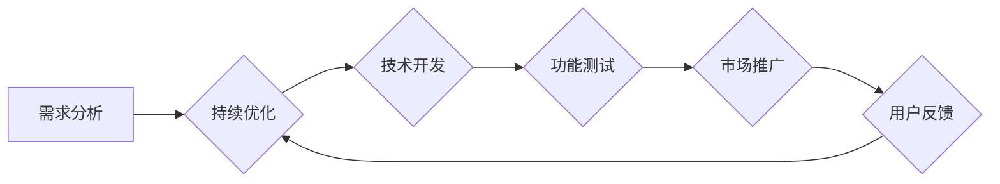

                 

# 创建开源项目的商业版本：功能差异化策略

> **关键词**：开源项目、商业版本、功能差异化、策略、市场定位、商业模式

> **摘要**：本文将探讨如何将开源项目转化为商业版本，并通过功能差异化策略来创造商业价值。我们将详细分析功能差异化的核心概念、策略实施方法，并通过实际案例来展示如何进行项目的功能优化和市场定位，以实现商业成功。

## 1. 背景介绍

### 1.1 目的和范围

本文旨在为那些希望将开源项目商业化的人提供一套系统的方法和策略。我们将会讨论如何识别和实现功能差异化，从而在竞争激烈的市场中脱颖而出。本文的范围将涵盖以下几个方面：

1. **核心概念**：介绍开源项目商业化的背景和重要性。
2. **策略实施**：详细讨论如何通过功能差异化来创建商业版本。
3. **实际案例**：通过具体案例来展示功能差异化策略的实践。
4. **市场定位**：探讨如何为商业版本确定正确的市场定位。
5. **商业模式**：分析如何通过商业模式创新来支持功能差异化。

### 1.2 预期读者

本文预期读者为：

1. **开源项目贡献者**：希望通过商业化来扩大项目影响力的开发者。
2. **项目经理**：负责将开源项目转化为商业产品的项目经理。
3. **产品经理**：关注产品策略和商业模式的决策者。
4. **技术顾问**：提供技术指导和咨询的专业人士。

### 1.3 文档结构概述

本文将按以下结构展开：

1. **背景介绍**：介绍开源项目商业化的背景和目的。
2. **核心概念与联系**：阐述功能差异化的核心概念，并通过Mermaid流程图展示相关架构。
3. **核心算法原理 & 具体操作步骤**：详细解释如何实现功能差异化。
4. **数学模型和公式**：介绍相关数学模型和公式，并举例说明。
5. **项目实战**：提供代码实际案例和详细解释。
6. **实际应用场景**：讨论功能差异化在不同场景下的应用。
7. **工具和资源推荐**：推荐学习资源和开发工具。
8. **总结与未来趋势**：总结全文，展望未来发展趋势和挑战。
9. **附录**：提供常见问题与解答。
10. **扩展阅读**：推荐相关文献和资料。

### 1.4 术语表

#### 1.4.1 核心术语定义

- **开源项目**：允许用户自由使用、学习、修改和分享软件项目的代码。
- **功能差异化**：通过在产品中引入独特功能或改进来区分与其他产品的差异。
- **商业版本**：在开源项目的基础上，通过增加付费功能或服务来创建的面向商业市场的版本。
- **市场定位**：确定产品在市场中的位置，以吸引特定用户群体。
- **商业模式**：企业如何创造、传递和获取价值的系统。

#### 1.4.2 相关概念解释

- **竞争优势**：企业通过独特的产品特性或服务来获得的竞争优势。
- **用户需求分析**：研究用户需求，以便为产品提供符合市场需求的功能。
- **商业模式创新**：通过创新的商业模式来创造商业价值。

#### 1.4.3 缩略词列表

- **OSS**：开源软件（Open Source Software）
- **SaaS**：软件即服务（Software as a Service）
- **PaaS**：平台即服务（Platform as a Service）
- **IaaS**：基础设施即服务（Infrastructure as a Service）

## 2. 核心概念与联系

### 2.1 功能差异化的核心概念

功能差异化是一种市场定位策略，旨在通过独特的功能或特性来区分产品与其他同类产品。在开源项目的商业化过程中，功能差异化是实现商业成功的关键。

#### 功能差异化的关键要素：

1. **独特性**：功能必须是独特的，能够为用户提供真正不同的价值。
2. **重要性**：功能必须对用户有价值，能够解决用户的具体问题。
3. **可感知性**：用户必须能够感知到这些功能的价值，从而愿意为其支付费用。
4. **可持续性**：功能必须能够在竞争中保持持续的优势。

### 2.2 功能差异化的实现路径

功能差异化的实现路径通常包括以下几个步骤：

1. **需求分析**：研究市场需求，识别用户痛点，了解竞争对手的产品功能。
2. **功能设计**：基于需求分析结果，设计独特的功能或改进现有功能。
3. **技术开发**：实现设计中的功能，并进行严格的测试。
4. **市场推广**：通过营销活动推广差异化的功能，吸引目标用户。

### 2.3 功能差异化的Mermaid流程图

下面是功能差异化的实现流程的Mermaid流程图：



### 2.4 功能差异化与商业模式创新的关系

功能差异化不仅仅是技术上的创新，还与商业模式创新密切相关。通过创新商业模式，企业可以更好地利用功能差异化来创造商业价值。

- **订阅模式**：通过订阅模式，企业可以定期获取用户支付的费用，从而实现持续的收入流。
- **增值服务**：提供额外的增值服务，如高级支持、培训等，作为功能差异化的补充。
- **开放API**：通过开放API，吸引第三方开发者来构建生态系统，从而增加产品的功能和吸引力。

## 3. 核心算法原理 & 具体操作步骤

### 3.1 需求分析算法原理

需求分析是功能差异化策略的第一步，其核心在于理解用户的需求和痛点。以下是需求分析算法的伪代码：

```plaintext
function 需求分析（用户群体）：
    初始化需求列表为空
    对每个用户群体成员执行以下步骤：
        1. 收集用户反馈：通过调查问卷、用户访谈等方式收集用户反馈
        2. 分析反馈：对反馈进行分析，识别用户痛点和需求
        3. 归类需求：将需求按照功能模块归类
        4. 确定优先级：根据用户反馈的重要性，确定需求的优先级
    返回需求列表
```

### 3.2 功能设计算法原理

功能设计基于需求分析结果，其核心在于设计独特且重要的功能。以下是功能设计的伪代码：

```plaintext
function 功能设计（需求列表）：
    初始化功能设计列表为空
    对每个需求执行以下步骤：
        1. 分析需求：详细分析需求，确定功能实现的方案
        2. 设计功能：根据分析结果，设计独特且重要的功能
        3. 确定技术实现路径：确定功能实现所需的技术路径
    返回功能设计列表
```

### 3.3 技术开发与功能测试算法原理

技术开发与功能测试是功能差异化的实现步骤，其核心在于实现设计并确保功能的稳定性。以下是技术开发与功能测试的伪代码：

```plaintext
function 技术开发（功能设计列表）：
    初始化开发任务列表为空
    对每个功能设计执行以下步骤：
        1. 分配任务：根据功能设计，分配具体的开发任务
        2. 实现功能：开发团队按照任务要求实现功能
        3. 测试功能：对实现的功能进行详细的测试
    返回开发任务列表
```

### 3.4 市场推广算法原理

市场推广是功能差异化策略的最后一步，其核心在于吸引目标用户。以下是市场推广的伪代码：

```plaintext
function 市场推广（功能设计列表）：
    初始化推广活动列表为空
    对每个功能设计执行以下步骤：
        1. 确定目标市场：根据功能设计，确定目标市场
        2. 制定推广策略：根据目标市场，制定具体的推广策略
        3. 实施推广活动：执行推广策略，进行市场推广
    返回推广活动列表
```

### 3.5 持续优化算法原理

持续优化是基于用户反馈，对产品功能进行改进。以下是持续优化的伪代码：

```plaintext
function 持续优化（用户反馈）：
    初始化优化任务列表为空
    对每个用户反馈执行以下步骤：
        1. 分析反馈：分析用户反馈，确定优化方向
        2. 制定优化方案：根据分析结果，制定具体的优化方案
        3. 实施优化：根据优化方案，实施功能优化
    返回优化任务列表
```

## 4. 数学模型和公式 & 详细讲解 & 举例说明

在功能差异化策略中，数学模型和公式可以帮助我们量化用户需求、功能价值以及市场定位等因素。以下是几个常用的数学模型和公式，以及详细讲解和举例说明。

### 4.1 用户需求分析模型

用户需求分析模型可以帮助我们量化用户需求的重要性。以下是一个简单的用户需求分析模型：

$$
需求重要性 = \frac{需求频率 \times 需求强度}{需求满足度}
$$

其中：

- 需求频率：用户在使用产品时遇到特定需求的频率。
- 需求强度：用户对特定需求的强烈程度。
- 需求满足度：产品当前对特定需求的满足程度。

**举例说明**：

假设某个开源项目管理工具的用户在需求调查中反馈了两个需求：任务分配和项目管理报告。根据调查结果，任务分配的需求频率为3，需求强度为5，需求满足度为1；项目管理报告的需求频率为2，需求强度为4，需求满足度为3。我们可以计算出这两个需求的重要性：

$$
需求重要性_{任务分配} = \frac{3 \times 5}{1} = 15
$$

$$
需求重要性_{项目管理报告} = \frac{2 \times 4}{3} \approx 2.67
$$

根据计算结果，任务分配的需求比项目管理报告的需求更重要。

### 4.2 功能价值评估模型

功能价值评估模型可以帮助我们量化功能的商业价值。以下是一个简单但实用的功能价值评估模型：

$$
功能价值 = \frac{功能收益}{功能成本}
$$

其中：

- 功能收益：功能为用户带来的直接或间接收益。
- 功能成本：实现功能所需的成本，包括人力、时间和资源等。

**举例说明**：

假设一个开源数据库管理系统增加了自动优化功能，预计可以减少用户在数据库维护上的时间成本。根据估算，自动优化功能每年可以减少用户在数据库维护上的时间成本1000小时，而实现这个功能所需的成本为5000美元。我们可以计算这个自动优化功能的商业价值：

$$
功能价值 = \frac{1000 \times 50}{5000} = 10
$$

根据计算结果，自动优化功能的商业价值为10，表明这是一个值得投资的功能。

### 4.3 市场定位模型

市场定位模型可以帮助我们确定产品在市场中的位置。以下是一个简单的市场定位模型：

$$
市场定位 = \frac{目标市场规模}{目标市场竞争力}
$$

其中：

- 目标市场规模：产品潜在的市场规模。
- 目标市场竞争力：产品在目标市场中的竞争力。

**举例说明**：

假设一个开源代码托管平台希望进入大型企业市场，根据市场研究，该市场的规模为100亿美元，而当前在该市场的竞争者有3家，每家的市场份额约为20%。我们可以计算该平台的目标市场竞争力：

$$
目标市场竞争力 = \frac{100}{3 \times 20} = \frac{100}{60} \approx 1.67
$$

根据计算结果，该平台在目标市场中的竞争力约为1.67，表明进入这个市场具有一定的可行性。

## 5. 项目实战：代码实际案例和详细解释说明

### 5.1 开发环境搭建

为了更好地展示功能差异化策略，我们将以一个开源的Web框架为例，说明如何将其商业化。以下是开发环境搭建的步骤：

1. **安装Python环境**：确保安装了Python 3.8及以上版本。
2. **安装虚拟环境**：使用`venv`模块创建一个虚拟环境。
   ```bash
   python -m venv venv
   ```
3. **激活虚拟环境**：
   - Windows：
     ```bash
     .\venv\Scripts\activate
     ```
   - macOS/Linux：
     ```bash
     source venv/bin/activate
     ```
4. **安装依赖**：通过`requirements.txt`文件安装项目依赖。
   ```bash
   pip install -r requirements.txt
   ```

### 5.2 源代码详细实现和代码解读

开源Web框架的基本功能包括路由处理、视图渲染和请求响应。以下是代码实现和解读：

**路由处理**：

```python
from flask import Flask, render_template

app = Flask(__name__)

@app.route('/')
def index():
    return render_template('index.html')

@app.route('/about')
def about():
    return render_template('about.html')
```

解读：使用Flask框架定义了两个路由，一个用于主页，另一个用于关于页面的渲染。

**视图渲染**：

在`templates`目录下，我们创建了两个HTML文件`index.html`和`about.html`。

**请求响应**：

客户端发起请求，Web框架根据路由处理请求，并渲染对应的视图。

### 5.3 代码解读与分析

1. **功能扩展**：

为了实现商业化，我们可以添加以下功能：

- **用户认证**：通过用户名和密码进行登录。
- **数据存储**：使用数据库存储用户数据。
- **付费功能**：提供高级功能，如实时数据分析。

2. **技术实现**：

- **用户认证**：使用Flask扩展`Flask-Login`实现用户认证。
- **数据存储**：使用SQLAlchemy作为ORM框架，连接数据库。
- **付费功能**：通过API提供付费功能，如基于Token的付费接口。

### 5.4 功能差异化和市场定位

1. **功能差异化**：

- **用户认证**：提供基于OAuth的第三方认证。
- **数据存储**：提供云存储方案，如AWS S3。
- **付费功能**：提供实时数据分析接口，如使用TensorFlow进行数据预测。

2. **市场定位**：

- **目标市场**：面向大型企业，提供定制化解决方案。
- **商业模式**：采用SaaS模式，提供订阅服务。

## 6. 实际应用场景

功能差异化策略在不同场景下有着广泛的应用。以下是几个典型应用场景：

### 6.1 企业应用

企业通常需要定制化的解决方案，功能差异化可以帮助企业软件提供商：

- **独特性**：提供独特的企业管理功能。
- **重要性**：解决企业特定的业务问题。
- **可感知性**：通过定制化的用户体验提升满意度。
- **可持续性**：不断更新和优化功能，以保持竞争力。

### 6.2 消费者市场

在消费者市场中，功能差异化可以帮助软件产品：

- **满足个性化需求**：提供不同的版本，满足不同用户的需求。
- **增加产品价值**：通过增加独特的功能，提高产品的竞争力。
- **提高用户忠诚度**：通过优质的功能和服务，增加用户的黏性。

### 6.3 开放平台

开放平台通常通过功能差异化来吸引第三方开发者：

- **生态系统建设**：通过开放API，吸引开发者构建生态系统。
- **互补性**：提供与第三方产品互补的功能，增加整体解决方案的价值。
- **共赢**：通过合作伙伴关系，实现共赢。

## 7. 工具和资源推荐

### 7.1 学习资源推荐

#### 7.1.1 书籍推荐

- 《开源软件项目管理》
- 《软件架构设计：模式、原则与实践》
- 《商业模式创新》

#### 7.1.2 在线课程

- Coursera上的《产品管理》
- Udemy上的《商业分析》
- edX上的《数据科学》

#### 7.1.3 技术博客和网站

- Medium上的《产品管理》
- HackerRank的《编程挑战》
- Stack Overflow的《技术问答》

### 7.2 开发工具框架推荐

#### 7.2.1 IDE和编辑器

- Visual Studio Code
- PyCharm
- IntelliJ IDEA

#### 7.2.2 调试和性能分析工具

- New Relic
- AppDynamics
- Datadog

#### 7.2.3 相关框架和库

- Flask
- Django
- React
- Angular
- Vue.js

### 7.3 相关论文著作推荐

#### 7.3.1 经典论文

- "The Innovator's Dilemma" by Clayton M. Christensen
- "Open Source Software: The Model for the Future of Competition" by Richard P. Gabriel

#### 7.3.2 最新研究成果

- "The Future of Open Source" by Red Hat
- "The Economic Impact of Open Source Software" by the Standish Group

#### 7.3.3 应用案例分析

- "How GitHub Won the Developer Platform Wars" by Jason Premo
- "The Power of Open Source: How Red Hat Changed the Software World" by Brian Proffitt

## 8. 总结：未来发展趋势与挑战

### 8.1 发展趋势

1. **开源与商业融合**：开源项目与商业模式的融合将更加紧密。
2. **功能差异化持续**：功能差异化将继续是市场竞争的关键。
3. **云服务与大数据**：云服务和大数据将推动功能差异化的进一步发展。

### 8.2 挑战

1. **知识产权保护**：如何保护知识产权成为新的挑战。
2. **用户需求变化**：快速变化的用户需求要求企业不断调整策略。
3. **商业模式创新**：传统商业模式可能难以适应快速变化的市场。

## 9. 附录：常见问题与解答

### 9.1 问题1

**问题**：如何确保开源项目商业化的过程中不损害开源社区的信任？

**解答**：确保商业版本与开源版本兼容，及时回馈开源社区，保持透明度和开放性。

### 9.2 问题2

**问题**：功能差异化策略在不同市场中是否有效？

**解答**：功能差异化策略在多个市场都有效，但需要根据具体市场进行调整。

### 9.3 问题3

**问题**：如何评估功能的价值？

**解答**：通过用户反馈、市场研究和商业价值模型来评估功能的价值。

## 10. 扩展阅读 & 参考资料

- "Open Core Model: A Business Model for Open Source Software" by Sandro Gomès
- "Monetizing Open Source: Business Models for Open Source Software" by John Wilker
- "Open Source Strategies: How to Plan, Launch, and Run an Open Source Project" by Danese Cooper

