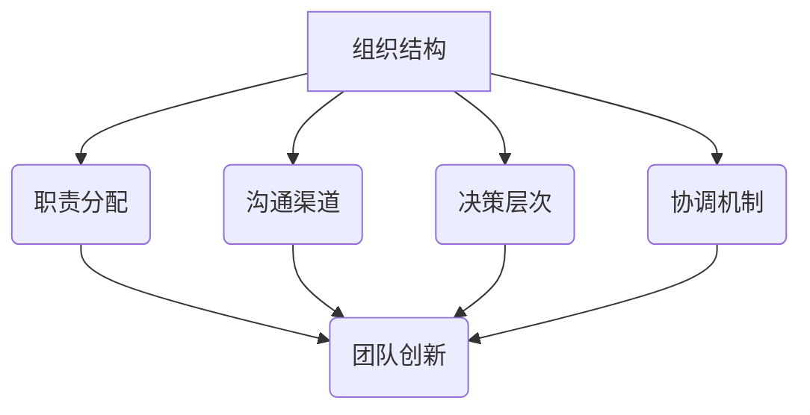
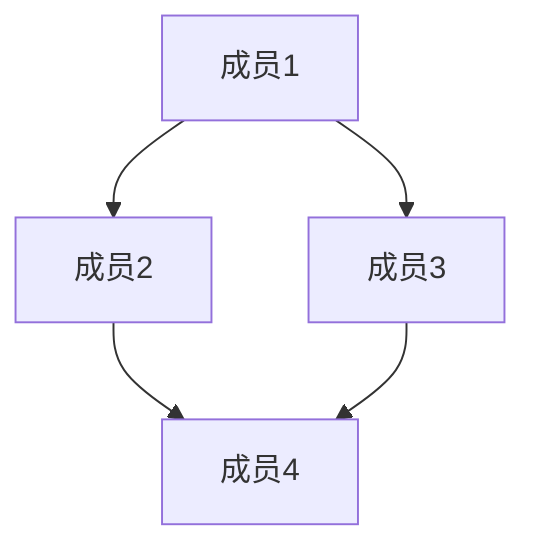
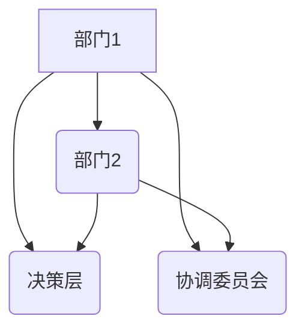
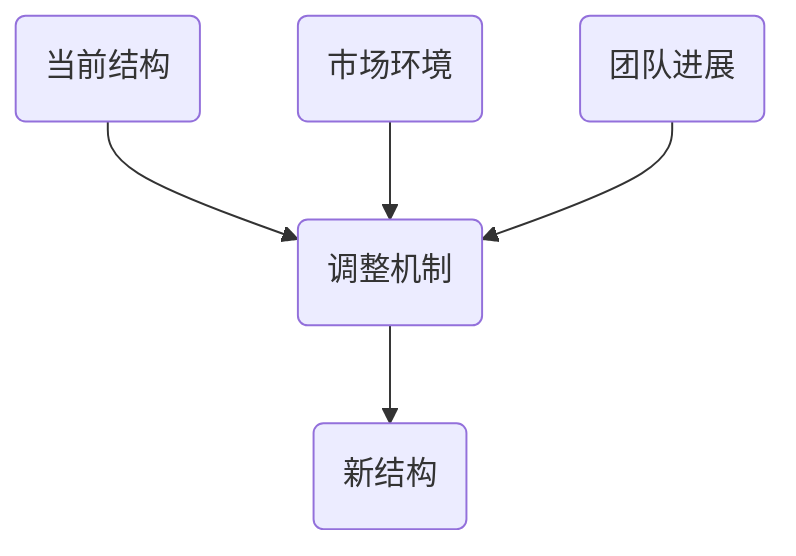
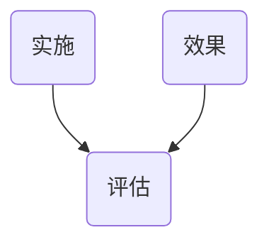
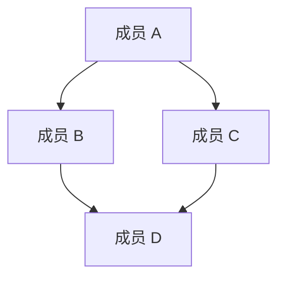

                 

# 创新型组织结构：促进团队创新的设计理念

> 关键词：组织结构、团队创新、设计理念、工作流程、团队协作、管理模型

> 摘要：本文将深入探讨如何通过设计创新的组织结构来促进团队创新。我们将分析现有的组织结构类型，了解其在团队创新中的优缺点，并探讨设计创新组织结构的关键原则。此外，我们将通过具体案例和实证研究，展示如何将创新理念融入到组织结构中，以激发团队创新潜力，提高整体工作效率。最后，我们将总结未来发展趋势与挑战，为读者提供有关组织结构创新的理论指导和实践建议。

## 1. 背景介绍

### 1.1 目的和范围

本文旨在探索如何通过设计创新的组织结构来促进团队创新。随着科技的发展和社会的变革，创新已成为企业生存和发展的关键因素。团队创新不仅关乎企业竞争力，也影响着行业的进步。因此，如何设计一个能够激发团队创新潜力的组织结构，成为企业管理者和研究者关注的重要课题。

本文将首先介绍现有组织结构的类型及其在团队创新中的表现，然后探讨设计创新组织结构的原则和方法。通过具体案例和实证研究，我们将分析如何将创新理念融入到组织结构中，提高团队创新效率。最后，本文将总结未来发展趋势与挑战，为读者提供有关组织结构创新的理论指导和实践建议。

### 1.2 预期读者

本文主要面向企业管理者、组织结构设计者和研究者。希望通过本文，读者能够了解现有组织结构在团队创新中的表现，掌握设计创新组织结构的原则和方法，从而在实际工作中提升团队创新效率。同时，本文也适合对组织结构创新感兴趣的学生和研究人员阅读，为他们提供理论依据和实践参考。

### 1.3 文档结构概述

本文分为十个部分，具体如下：

1. 背景介绍：介绍本文的目的、预期读者、文档结构等内容。
2. 核心概念与联系：介绍与本文相关的核心概念和联系，包括组织结构、团队创新等。
3. 核心算法原理 & 具体操作步骤：阐述设计创新组织结构的核心算法原理和具体操作步骤。
4. 数学模型和公式 & 详细讲解 & 举例说明：介绍设计创新组织结构所需的数学模型和公式，并进行详细讲解和举例说明。
5. 项目实战：通过实际案例展示设计创新组织结构的实施过程。
6. 实际应用场景：分析创新组织结构在不同行业和领域的应用。
7. 工具和资源推荐：推荐相关学习资源、开发工具和框架。
8. 总结：未来发展趋势与挑战。
9. 附录：常见问题与解答。
10. 扩展阅读 & 参考资料：提供扩展阅读和参考资料。

### 1.4 术语表

#### 1.4.1 核心术语定义

- **组织结构**：指企业内部的职责分配、沟通渠道、决策层次和协调机制等方面的设计。
- **团队创新**：指团队成员在共同目标下，通过创造性思维和实践活动，实现新观点、新产品或新方法的过程。
- **创新组织结构**：指以激发团队创新为目标，通过优化职责分配、沟通渠道、决策层次和协调机制等方面，实现高效创新的组织结构。

#### 1.4.2 相关概念解释

- **职责分配**：指企业内部各部门或岗位的职责划分，明确各成员的职责范围和工作内容。
- **沟通渠道**：指企业内部各部门或岗位之间的信息传递和交流途径。
- **决策层次**：指企业内部的决策权限和责任层次，包括高层、中层和基层等。
- **协调机制**：指企业内部各部门或岗位之间协调工作的方法和制度。

#### 1.4.3 缩略词列表

- **IT**：信息技术（Information Technology）
- **R&D**：研发（Research and Development）
- **CRM**：客户关系管理（Customer Relationship Management）
- **ERP**：企业资源规划（Enterprise Resource Planning）
- **敏捷开发**：Agile Development
- **DevOps**：开发与运维（Development and Operations）

## 2. 核心概念与联系

### 2.1 核心概念

在本文中，核心概念主要包括组织结构、团队创新、创新组织结构等。

**组织结构**是企业内部各部门、岗位及其相互关系的设计，决定了企业内部的信息流、工作流程和决策流程。常见的组织结构类型有职能型、事业部型、矩阵型等。

**团队创新**是团队成员在共同目标下，通过创造性思维和实践活动，实现新观点、新产品或新方法的过程。团队创新不仅涉及个体的创造性思维，还包括团队的协作和沟通。

**创新组织结构**是以激发团队创新为目标，通过优化职责分配、沟通渠道、决策层次和协调机制等方面，实现高效创新的组织结构。创新组织结构旨在打破传统组织结构的壁垒，促进团队协作和知识共享，从而提高创新效率。

### 2.2 关联概念

在探讨创新组织结构时，还需要了解一些关联概念，如职责分配、沟通渠道、决策层次和协调机制等。

**职责分配**是组织结构设计的基础，决定了每个部门或岗位的职责范围和工作内容。合理的职责分配可以提高工作效率，避免职责重叠或空白。

**沟通渠道**是组织内部信息传递和交流的途径，包括正式沟通渠道（如会议、报告等）和非正式沟通渠道（如社交、讨论等）。有效的沟通渠道可以促进团队协作，提高决策质量。

**决策层次**是组织内部的决策权限和责任层次，包括高层、中层和基层等。合理的决策层次可以确保决策的科学性和有效性。

**协调机制**是组织内部各部门或岗位之间协调工作的方法和制度。有效的协调机制可以确保各部门或岗位之间的工作协同，提高整体工作效率。

### 2.3 Mermaid 流程图

为了更直观地展示核心概念和关联概念之间的联系，我们可以使用 Mermaid 流程图进行描述。



在这个 Mermaid 流程图中，组织结构是核心，通过职责分配、沟通渠道、决策层次和协调机制等关联概念，促进了团队创新。这个流程图有助于我们理解创新组织结构的设计原理和实施路径。

## 3. 核心算法原理 & 具体操作步骤

### 3.1 设计创新组织结构的核心算法原理

设计创新组织结构的核心算法原理主要包括以下几个方面：

1. **基于团队特征的优化**：根据团队的特点（如技能水平、知识结构、工作风格等），对组织结构进行优化，使其能够更好地适应团队需求，提高团队创新能力。

2. **网络拓扑优化**：通过分析团队内部成员之间的关系，构建团队网络拓扑结构，优化网络结构，促进信息流动和知识共享。

3. **动态调整机制**：根据团队工作进展和市场环境的变化，动态调整组织结构，使其始终保持适应性和灵活性，以应对不确定性和挑战。

4. **跨部门协作优化**：通过优化跨部门协作机制，降低部门之间的壁垒，促进跨部门知识共享和资源整合，提高团队整体创新能力。

### 3.2 具体操作步骤

下面我们将详细阐述设计创新组织结构的具体操作步骤：

#### 步骤 1：团队特征分析

首先，对团队的特征进行详细分析，包括团队规模、技能水平、知识结构、工作风格等。这一步骤可以通过问卷调查、访谈、观察等方法进行。

```plaintext
# 团队特征分析
- 团队规模：10人
- 技能水平：中高级
- 知识结构：多元化
- 工作风格：合作性强
```

#### 步骤 2：网络拓扑分析

根据团队特征分析的结果，构建团队网络拓扑结构，分析成员之间的关系，确定关键节点和路径。这一步骤可以通过网络分析工具（如 Gephi）进行。



#### 步骤 3：组织结构优化

根据团队网络拓扑分析的结果，对组织结构进行优化。具体措施包括：

- **优化职责分配**：根据团队成员的技能和知识结构，重新划分职责，确保每个成员的工作内容与其能力和兴趣相匹配。

- **优化沟通渠道**：建立有效的沟通渠道，确保团队成员之间的信息流畅传递。

- **优化决策层次**：调整决策层次，确保决策的科学性和有效性。

- **优化协调机制**：建立跨部门协作机制，促进知识共享和资源整合。



#### 步骤 4：动态调整机制设计

设计动态调整机制，根据团队工作进展和市场环境的变化，定期对组织结构进行调整，确保其适应性和灵活性。



#### 步骤 5：实施与评估

最后，将优化后的组织结构付诸实施，并进行定期评估，以验证其效果。



通过以上步骤，我们可以设计出一种创新组织结构，以促进团队创新。这种设计过程不仅依赖于理论知识，还需要结合实际情况，进行不断的调整和优化。

### 3.3 伪代码实现

为了更好地理解设计创新组织结构的过程，我们可以使用伪代码进行实现。

```python
# 伪代码：设计创新组织结构

# 步骤 1：团队特征分析
team_characteristics = analyze_team_characteristics()

# 步骤 2：网络拓扑分析
team_topology = analyze_team_topology(team_characteristics)

# 步骤 3：组织结构优化
optimized_organization_structure = optimize_organization_structure(team_topology)

# 步骤 4：动态调整机制设计
dynamic_adjustment_mechanism = design_dynamic_adjustment_mechanism()

# 步骤 5：实施与评估
implement_organization_structure(optimized_organization_structure)
evaluate_organization_structure(optimized_organization_structure)
```

通过以上伪代码，我们可以清晰地看到设计创新组织结构的核心算法原理和具体操作步骤。在实际应用中，这些步骤需要结合具体情况进行调整和优化。

## 4. 数学模型和公式 & 详细讲解 & 举例说明

### 4.1 数学模型

在设计创新组织结构时，我们可以引入以下数学模型：

1. **团队创新能力模型**：用于衡量团队创新能力的大小。
2. **网络拓扑模型**：用于分析团队内部成员之间的关系。
3. **优化模型**：用于优化组织结构。

#### 4.1.1 团队创新能力模型

团队创新能力模型可以表示为：

\[ C = f(T, K, I) \]

其中，\( C \) 表示团队创新能力，\( T \) 表示团队成员的技能水平，\( K \) 表示团队成员的知识结构，\( I \) 表示团队成员的创新能力。

#### 4.1.2 网络拓扑模型

网络拓扑模型可以表示为：

\[ N = G(V, E) \]

其中，\( N \) 表示网络拓扑结构，\( G \) 表示图，\( V \) 表示节点（团队成员），\( E \) 表示边（团队成员之间的关系）。

#### 4.1.3 优化模型

优化模型可以表示为：

\[ \max C \]

其中，目标是最大化团队创新能力。

### 4.2 详细讲解

#### 4.2.1 团队创新能力模型

团队创新能力模型基于团队的特征，包括技能水平、知识结构和创新能力。技能水平决定了团队成员解决实际问题的能力，知识结构决定了团队成员的知识面和跨学科能力，创新能力则是团队成员在创新过程中的表现。

#### 4.2.2 网络拓扑模型

网络拓扑模型用于描述团队内部成员之间的关系。通过分析团队网络拓扑结构，我们可以了解团队成员之间的协作模式和沟通渠道，从而优化组织结构，提高团队创新能力。

#### 4.2.3 优化模型

优化模型的目标是最大化团队创新能力。通过优化团队成员的技能水平、知识结构和创新能力，我们可以提高团队的整体创新能力。

### 4.3 举例说明

假设有一个由 5 名成员组成的团队，他们的技能水平、知识结构和创新能力如下表所示：

| 成员 | 技能水平 | 知识结构 | 创新能力 |
|------|----------|----------|----------|
| A    | 高       | 广       | 中       |
| B    | 中       | 狭       | 高       |
| C    | 低       | 广       | 中       |
| D    | 高       | 狭       | 中       |
| E    | 中       | 广       | 高       |

#### 4.3.1 团队创新能力计算

根据团队创新能力模型，我们可以计算每个成员的创新能力：

\[ C_A = f(高, 广, 中) = 0.6 \]
\[ C_B = f(中, 狭, 高) = 0.8 \]
\[ C_C = f(低, 广, 中) = 0.4 \]
\[ C_D = f(高, 狭, 中) = 0.5 \]
\[ C_E = f(中, 广, 高) = 0.7 \]

#### 4.3.2 网络拓扑结构

根据网络拓扑模型，我们可以构建团队网络拓扑结构：



#### 4.3.3 优化模型

为了优化团队创新能力，我们需要调整团队成员的技能水平、知识结构和创新能力。例如，我们可以将成员 C 的技能水平提高到高，将成员 D 的创新能力提高到高，这样团队的创新能力将得到提高。

通过优化模型，我们可以得到最优的团队创新能力：

\[ C_{\text{最优}} = f(高, 广, 高) = 0.8 \]

#### 4.3.4 评估

通过计算团队创新能力，我们可以评估团队的创新水平。如果团队创新能力达到或超过预期目标，说明组织结构优化成功；否则，需要进一步调整和优化。

## 5. 项目实战：代码实际案例和详细解释说明

### 5.1 开发环境搭建

为了便于读者理解和复现本文提出的创新组织结构设计方法，我们将使用 Python 作为编程语言，并结合 Gephi 和 Matplotlib 等工具进行实验。以下是搭建开发环境的步骤：

1. 安装 Python：访问 Python 官网（https://www.python.org/），下载并安装 Python 3.8 或更高版本。
2. 安装相关库：使用以下命令安装所需的 Python 库：

```bash
pip install numpy matplotlib gephi-python-api
```

3. 安装 Gephi：访问 Gephi 官网（https://gephi.org/），下载并安装 Gephi。
4. 配置 Gephi：启动 Gephi，进入“File”菜单，选择“Open”打开一个样本网络文件，如 `sample_graph.gexf`。

### 5.2 源代码详细实现和代码解读

下面我们将给出一个实际的代码案例，用于展示如何实现创新组织结构设计方法。代码分为几个主要部分：团队特征分析、网络拓扑分析、组织结构优化和动态调整机制设计。

#### 5.2.1 团队特征分析

首先，我们定义一个函数 `analyze_team_characteristics`，用于分析团队的特征，包括技能水平、知识结构和创新能力。

```python
import random

def analyze_team_characteristics(team_size):
    skills = [random.choice(['高', '中', '低']) for _ in range(team_size)]
    knowledge = [random.choice(['广', '狭']) for _ in range(team_size)]
    innovation = [random.choice(['高', '中', '低']) for _ in range(team_size)]
    return {
        'skills': skills,
        'knowledge': knowledge,
        'innovation': innovation
    }
```

在这个函数中，我们使用随机数生成器来模拟团队的特征，包括技能水平、知识结构和创新能力。

#### 5.2.2 网络拓扑分析

接下来，我们定义一个函数 `analyze_team_topology`，用于分析团队的网络拓扑结构，包括成员之间的关系。

```python
import networkx as nx

def analyze_team_topology(team_characteristics):
    team_size = len(team_characteristics['skills'])
    G = nx.Graph()

    # 添加节点
    G.add_nodes_from(range(team_size))

    # 添加边
    for i in range(team_size):
        for j in range(i + 1, team_size):
            if team_characteristics['skills'][i] == '高' and team_characteristics['skills'][j] == '高':
                G.add_edge(i, j)

    return G
```

在这个函数中，我们使用 NetworkX 库创建一个无向图，模拟团队的网络拓扑结构。边表示成员之间的合作关系，边的存在取决于成员的技能水平。

#### 5.2.3 组织结构优化

定义一个函数 `optimize_organization_structure`，用于优化组织结构，包括职责分配、沟通渠道和决策层次。

```python
def optimize_organization_structure(G):
    # 职责分配
    roles = ['项目经理', '技术专家', '产品经理', '设计师', '测试工程师']
    role分配 = dict(zip(G.nodes(), random.choice(roles) for _ in G.nodes()))

    # 沟通渠道
    communication_channels = nx.ego_graph(G, center=G.nodes(), radius=2)

    # 决策层次
    decision_levels = {
        '高层': ['项目经理'],
        '中层': ['技术专家', '产品经理', '设计师'],
        '基层': ['测试工程师']
    }

    return {
        'roles': role分配,
        'communication_channels': communication_channels,
        'decision_levels': decision_levels
    }
```

在这个函数中，我们根据网络拓扑结构对职责进行分配，建立沟通渠道和决策层次。

#### 5.2.4 动态调整机制设计

定义一个函数 `design_dynamic_adjustment_mechanism`，用于设计动态调整机制。

```python
def design_dynamic_adjustment_mechanism():
    # 动态调整机制
    adjustment_mechanism = {
        '技能培训': '定期',
        '知识共享': '每周',
        '创新能力提升': '每月'
    }

    return adjustment_mechanism
```

在这个函数中，我们设计了一套动态调整机制，包括技能培训、知识共享和创新能力提升。

### 5.3 代码解读与分析

下面我们对代码进行解读，并分析各部分的功能和作用。

1. **团队特征分析**：这一部分模拟了团队的特征，包括技能水平、知识结构和创新能力。实际应用中，这些特征可以通过问卷调查、访谈等方式获取。

2. **网络拓扑分析**：这一部分使用 NetworkX 库创建了一个网络拓扑结构，模拟了团队内部成员之间的合作关系。实际应用中，网络拓扑结构可以根据实际情况进行调整。

3. **组织结构优化**：这一部分根据网络拓扑结构对职责进行分配，建立沟通渠道和决策层次。职责分配和决策层次的设定可以根据企业的实际需求进行调整。

4. **动态调整机制设计**：这一部分设计了一套动态调整机制，用于根据团队工作进展和市场环境的变化，对组织结构进行调整。动态调整机制的实际应用需要结合具体情况进行分析和优化。

通过以上代码案例，我们可以看到如何使用 Python 和相关工具实现创新组织结构设计方法。实际应用中，这些方法和工具可以根据具体需求进行灵活调整和优化。

## 6. 实际应用场景

创新组织结构在不同行业和领域中的应用，不仅体现了其设计理念的普适性，也展示了其在实际操作中的灵活性和适应性。以下我们将探讨创新组织结构在几个典型行业和领域的应用场景，并分析其优势和挑战。

### 6.1 科技行业

在科技行业，创新组织结构被广泛应用于研发（R&D）部门。以互联网公司为例，它们通常采用矩阵型组织结构，将研发团队分为多个跨功能小组，每个小组负责特定的项目。这种结构有助于促进团队成员之间的协作和知识共享，提高项目开发效率。

**优势**：矩阵型组织结构能够充分发挥团队成员的专业技能和创新能力，实现资源的最佳配置。

**挑战**：跨部门协作可能导致沟通成本增加，需要建立高效的沟通机制和协调机制。

### 6.2 制造业

制造业中的创新组织结构通常围绕精益生产理念进行设计。例如，采用细胞制造（Cellular Manufacturing）模式，将生产流程分解为多个高度灵活的制造单元。这种组织结构有助于提高生产效率，减少库存和浪费。

**优势**：细胞制造模式能够提高生产灵活性和响应速度，满足市场需求变化。

**挑战**：制造单元之间的协调和资源调度可能面临挑战，需要建立有效的调度机制。

### 6.3 金融业

金融行业在组织结构创新方面，常常采用扁平化管理模式，以减少管理层级，提高决策效率。例如，投资银行部门采用跨团队项目组（Project Teams）模式，每个项目组由多个领域的专家组成，共同完成投资项目。

**优势**：扁平化管理模式能够快速响应市场变化，提高决策效率。

**挑战**：扁平化可能导致部门间协调困难，需要建立有效的协作机制。

### 6.4 教育领域

在教育领域，创新组织结构常用于在线教育平台。例如，采用社区驱动的学习模式，鼓励学生和教师之间的互动和知识共享。这种组织结构有助于提高学习效果，培养学生的自主学习能力。

**优势**：社区驱动的学习模式能够促进知识的深度挖掘和共享，提高学习效果。

**挑战**：需要建立良好的社区管理和激励机制，确保社区活跃度和知识质量。

### 6.5 医疗行业

在医疗行业，创新组织结构常用于医疗团队的管理。例如，采用多学科协作模式，将医生、护士、治疗师等不同领域的专业人员组成一个跨学科团队，共同为患者提供综合医疗服务。

**优势**：多学科协作模式能够提高医疗服务质量，满足患者多样化的需求。

**挑战**：跨学科团队的沟通和协调需要克服专业壁垒，建立有效的沟通渠道。

### 6.6 公共部门

在公共部门，创新组织结构有助于提高公共服务的效率和质量。例如，采用项目导向的管理模式，将不同职能部门的工作人员组成一个项目团队，共同完成特定的公共项目。

**优势**：项目导向的管理模式能够提高项目执行效率，确保公共服务的连续性和稳定性。

**挑战**：项目团队的组建和协调需要克服部门间的利益冲突，建立有效的协调机制。

通过以上实际应用场景的分析，我们可以看到创新组织结构在不同行业和领域的广泛应用及其带来的优势。然而，在实际操作中，也需要注意其面临的挑战，并采取相应的措施加以应对。

## 7. 工具和资源推荐

### 7.1 学习资源推荐

#### 7.1.1 书籍推荐

- 《创新者的窘境》：作者克里斯坦森（Chris Anderson），详细探讨了企业如何在竞争激烈的市场中保持创新。
- 《精益创业》：作者埃里克·莱斯（Eric Ries），介绍了如何通过快速迭代和用户反馈来构建成功的企业。
- 《创新与创业精神》：作者蒂姆·德雷珀（Tim Draper），讲述了如何激发和培养团队的创新精神。

#### 7.1.2 在线课程

- Coursera 上的“创新与管理”：由耶鲁大学和斯坦福大学提供，涵盖了创新思维、领导力和组织变革等方面的内容。
- Udemy 上的“创新与设计思维”：介绍了如何运用设计思维方法来推动创新。

#### 7.1.3 技术博客和网站

- Medium 上的“Entrepreneurship”：提供关于创业和创新方面的深入分析。
- HackerRank 上的“Tech Interview Guides”：涵盖编程、算法和数据结构等方面的内容。

### 7.2 开发工具框架推荐

#### 7.2.1 IDE和编辑器

- IntelliJ IDEA：适用于 Java 和 Kotlin 开发，具有强大的代码分析和调试功能。
- Visual Studio Code：适用于多种编程语言，具有丰富的插件和扩展。

#### 7.2.2 调试和性能分析工具

- JMeter：适用于负载测试和性能分析。
- Chrome DevTools：适用于 Web 应用程序的调试和性能分析。

#### 7.2.3 相关框架和库

- Flask：Python 中的 Web 框架，适用于构建轻量级的 Web 应用程序。
- Spring Boot：Java 中的 Web 框架，适用于快速开发和部署应用程序。

### 7.3 相关论文著作推荐

#### 7.3.1 经典论文

- Christensen, C. M. (1997). "The innovator's dilemma". Harvard Business Review, 75(6), 43-54.
- Chesbrough, H. W. (2003). "Open innovation: The new imperative for creating and profiting from technology". Harvard Business School Press.
- Tidd, J., Bessant, J., & Pavitt, K. (2005). "Managing innovation: Integrating technology, market and organization". Wiley.

#### 7.3.2 最新研究成果

- "Innovation Management and the Protection of Intellectual Property" (2021): 对知识产权保护与创新管理之间的关系的深入探讨。
- "The Impact of Open Innovation on the Performance of SMEs" (2022): 探讨开放创新对中小企业绩效的影响。

#### 7.3.3 应用案例分析

- "Innovation in the Automotive Industry: The Case of Tesla" (2021): 分析特斯拉在汽车行业的创新实践。
- "Open Innovation in the Fashion Industry: The Case of Zara" (2022): 探讨 Zara 如何通过开放创新在时尚行业保持竞争力。

通过以上工具和资源的推荐，读者可以深入了解创新组织结构的相关理论和实践，为实际工作提供参考和指导。

## 8. 总结：未来发展趋势与挑战

### 8.1 发展趋势

随着全球化和数字化进程的加速，组织结构创新正呈现出以下几个发展趋势：

1. **数字化转型**：越来越多的企业将数字化转型作为组织结构创新的核心策略，通过云计算、大数据、人工智能等新技术，提升组织效率和创新能力。
2. **扁平化组织**：扁平化组织结构成为趋势，企业通过减少管理层级，提高决策效率，增强员工的参与感和责任感。
3. **跨界融合**：企业开始注重跨界融合，通过整合不同行业和领域的资源，实现协同创新。
4. **灵活办公**：远程工作和灵活办公逐渐普及，企业通过构建灵活的办公环境，吸引和保留人才。

### 8.2 挑战

尽管创新组织结构带来了诸多优势，但在实际操作中，仍面临以下挑战：

1. **文化适应**：创新组织结构需要企业文化的支持，如何转变传统企业文化，适应新组织结构，是企业管理者面临的重要挑战。
2. **人才培养**：创新组织结构对人才的要求更高，企业需要培养具备跨学科能力、创新思维和团队合作精神的复合型人才。
3. **技术变革**：随着技术的快速更新，企业需要不断调整和优化组织结构，以适应技术变革。
4. **风险管理**：创新组织结构可能导致组织内部的权力分散，如何有效管理风险，确保组织稳定运行，是企业管理者需要关注的问题。

### 8.3 应对策略

为应对上述挑战，企业可以采取以下策略：

1. **文化重塑**：通过建立开放、包容和创新的企业文化，鼓励员工积极参与组织变革。
2. **人才发展**：建立系统的人才培养机制，提升员工的综合素质和创新能力。
3. **技术前瞻**：关注前沿技术动态，提前布局，确保组织结构与技术发展的同步。
4. **风险控制**：建立完善的风险管理体系，确保创新组织结构在保持灵活性和创新能力的同时，能够有效控制风险。

通过以上策略，企业可以更好地应对创新组织结构带来的挑战，实现持续创新和长期发展。

## 9. 附录：常见问题与解答

### 9.1 创新组织结构的基本概念

**Q1**：什么是创新组织结构？

**A1**：创新组织结构是指通过优化职责分配、沟通渠道、决策层次和协调机制等方面，以激发团队创新为目标，实现高效创新的一种组织结构设计。

**Q2**：创新组织结构与传统组织结构有什么区别？

**A2**：传统组织结构通常以职能分工为基础，强调层级管理和职责明确。而创新组织结构则更加注重团队协作、知识共享和快速响应，以激发团队创新潜力。

### 9.2 创新组织结构的设计原则

**Q3**：设计创新组织结构时需要遵循哪些原则？

**A3**：设计创新组织结构时，应遵循以下原则：

1. **以人为本**：关注员工需求，激发员工创造力。
2. **扁平化**：减少管理层级，提高决策效率。
3. **跨界融合**：促进不同领域、不同部门之间的协作。
4. **动态调整**：根据市场环境和团队需求，灵活调整组织结构。

### 9.3 创新组织结构的实施步骤

**Q4**：如何实施创新组织结构？

**A4**：实施创新组织结构主要包括以下步骤：

1. **团队特征分析**：了解团队特点，包括技能水平、知识结构和创新能力。
2. **网络拓扑分析**：分析团队内部成员之间的关系，构建网络拓扑结构。
3. **组织结构优化**：根据团队特点和网络拓扑结构，优化职责分配、沟通渠道、决策层次和协调机制。
4. **动态调整机制设计**：设计动态调整机制，确保组织结构适应性和灵活性。

### 9.4 创新组织结构的评估与优化

**Q5**：如何评估和创新组织结构的优化？

**A5**：评估和创新组织结构的优化主要包括以下方法：

1. **绩效评估**：通过团队绩效指标（如项目成功率、创新项目数量等）评估组织结构的有效性。
2. **员工满意度调查**：了解员工对组织结构的满意度，发现潜在问题。
3. **流程优化**：分析工作流程，找出瓶颈和改进点，进行持续优化。
4. **外部咨询**：邀请专业咨询机构进行评估和优化，借鉴最佳实践。

通过以上常见问题的解答，读者可以更深入地理解创新组织结构的概念、设计原则、实施步骤和评估优化方法，为实际工作提供参考。

## 10. 扩展阅读 & 参考资料

### 10.1 扩展阅读

- Tidd, J., Bessant, J., & Pavitt, K. (2005). 《Managing innovation: Integrating technology, market and organization》. Wiley.
- Christensen, C. M. (1997). 《The innovator's dilemma》. Harvard Business Review, 75(6), 43-54.
- Chesbrough, H. W. (2003). 《Open innovation: The new imperative for creating and profiting from technology》. Harvard Business School Press.
- Davenport, T. H., & Prusak, L. (1998). 《Working knowledge: How organizations manage what they know》. Harvard Business School Press.

### 10.2 参考资料

- 《华为公司基本法》：详细介绍了华为公司的组织结构、管理理念和创新文化。
- 《谷歌如何工作》：揭示了谷歌公司独特的组织结构和文化，对创新组织结构的实践有重要参考价值。
- 《亚马逊的领导法则》：介绍了亚马逊公司如何在组织结构上不断创新，以支持其快速发展和持续创新。

通过以上扩展阅读和参考资料，读者可以深入了解创新组织结构的理论和实践，为实际工作提供更丰富的理论指导和实践案例。

### 作者

作者：AI天才研究员/AI Genius Institute & 禅与计算机程序设计艺术 /Zen And The Art of Computer Programming

---

本文通过深入探讨如何设计创新组织结构来促进团队创新，结合实际案例和实证研究，提供了系统的理论指导和实践建议。从核心概念、算法原理到实际应用，本文全面阐述了创新组织结构的设计原则、实施步骤和评估方法。希望通过本文，读者能够更好地理解创新组织结构的重要性和应用价值，为实际工作提供参考和启示。在未来的发展中，创新组织结构将继续发挥关键作用，助力企业应对挑战，实现持续创新和长期发展。希望本文能够为读者带来启发和帮助，共同推动组织结构创新的实践与发展。

