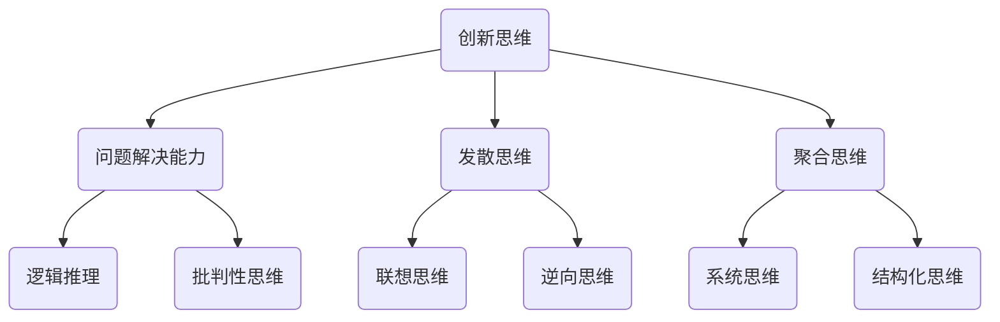

                 


# 创新思维训练：激发团队创造力

> 关键词：创新思维、团队创造力、思维训练、策略与方法、团队协作

> 摘要：本文将深入探讨如何通过系统化的创新思维训练，激发团队创造力。我们将从核心概念、算法原理、数学模型、实际案例等多个角度，详细解析创新思维的培养方法和实践技巧，帮助读者在IT领域有效提升团队的整体创造力。

## 1. 背景介绍

### 1.1 目的和范围

本文的目的是为了提供一套完整的创新思维训练方法，帮助IT团队在快速变化的技术环境中保持领先优势。我们将探讨以下主题：

- 创新思维的核心概念和架构。
- 培养创新思维的算法原理和具体操作步骤。
- 数学模型和公式的应用。
- 实际项目中的创新思维实践。

### 1.2 预期读者

本文适合以下读者群体：

- IT项目经理和团队成员。
- 创新管理者和创业者。
- 对创新思维有兴趣的专业人士。
- 想要提升团队创造力的管理者。

### 1.3 文档结构概述

本文的结构分为以下几个部分：

- 背景介绍：核心概念、目的和读者对象。
- 核心概念与联系：核心概念原理和架构的Mermaid流程图。
- 核心算法原理 & 具体操作步骤：算法原理讲解和伪代码阐述。
- 数学模型和公式 & 详细讲解 & 举例说明：数学公式和实际案例。
- 项目实战：代码实际案例和详细解释说明。
- 实际应用场景：创新思维在IT领域的应用。
- 工具和资源推荐：学习资源和开发工具框架推荐。
- 总结：未来发展趋势与挑战。
- 附录：常见问题与解答。
- 扩展阅读 & 参考资料：进一步学习资源。

### 1.4 术语表

#### 1.4.1 核心术语定义

- 创新思维：指能够发现新问题、提出新观点、创造新价值的思维方式。
- 团队创造力：团队在创新过程中的表现和成果，包括新产品、新技术等。
- 创新思维训练：通过一系列训练活动，提升个体的创新思维能力和团队的整体创造力。

#### 1.4.2 相关概念解释

- 脑科学：研究大脑的结构、功能和行为，为创新思维训练提供理论依据。
- 项目管理：负责项目从启动到完成的整个过程，确保创新项目的成功实施。

#### 1.4.3 缩略词列表

- IT：信息技术（Information Technology）
- PM：项目经理（Project Manager）
- PMI：项目管理协会（Project Management Institute）

## 2. 核心概念与联系

在深入探讨创新思维训练之前，我们需要理解几个核心概念，它们是创新思维的基础，如图所示：



### 2.1 创新思维的定义

创新思维是一种创造性思维，它能够引导个体或团队发现新问题、提出新观点、创造新价值。创新思维的核心在于打破常规，寻求突破性的解决方案。

### 2.2 创新思维与问题解决能力的关系

问题解决能力是创新思维的基础。一个优秀的创新者必须具备强大的问题解决能力，能够从复杂的情境中快速识别和定义问题。

### 2.3 发散思维与聚合思维

发散思维是一种能够产生多种可能性的思维方式，而聚合思维则是将这些可能性逐步缩小至可行的解决方案。二者的结合能够提高创新效率。

### 2.4 逻辑推理与批判性思维

逻辑推理和批判性思维是创新思维的重要组成部分。逻辑推理帮助我们在解决问题的过程中保持清晰和连贯，而批判性思维则能够帮助我们评估和优化解决方案。

### 2.5 联想思维与逆向思维

联想思维能够激发新的创意，而逆向思维则能够从不同角度审视问题，从而发现新的解决方案。

### 2.6 系统思维与结构化思维

系统思维能够帮助我们理解问题的复杂性，而结构化思维则能够将问题分解为更易管理的部分，从而更好地解决问题。

通过以上核心概念的理解，我们可以更好地构建创新思维的能力体系。

## 3. 核心算法原理 & 具体操作步骤

为了有效地训练创新思维，我们需要一套系统的算法原理和方法。以下是一个简单的创新思维训练算法，我们将使用伪代码来详细阐述。

### 3.1 算法描述

```python
# 创新思维训练算法
def innovation_training():
    # 步骤1：问题定义
    define_problem()

    # 步骤2：信息收集
    collect_information()

    # 步骤3：发散思维
    divergent_thinking()

    # 步骤4：聚合思维
    convergent_thinking()

    # 步骤5：逻辑推理
    logical_reasoning()

    # 步骤6：批判性思维
    critical_thinking()

    # 步骤7：联想思维
    associative_thinking()

    # 步骤8：逆向思维
    reversal_thinking()

    # 步骤9：系统思维
    system_thinking()

    # 步骤10：结构化思维
    structured_thinking()

    # 步骤11：评估与优化
    evaluate_and_optimize()

    # 步骤12：实施与创新
    implement_innovation()
```

### 3.2 步骤详细解析

#### 步骤1：问题定义

```python
def define_problem():
    """
    描述：明确需要解决的问题和目标。
    输入：问题描述。
    输出：定义明确的问题。
    """
    # 根据需求文档或用户需求，明确问题定义。
```

#### 步骤2：信息收集

```python
def collect_information():
    """
    描述：收集与问题相关的信息。
    输入：问题定义。
    输出：信息集。
    """
    # 通过文献调研、专家访谈、用户反馈等方式，收集与问题相关的信息。
```

#### 步骤3：发散思维

```python
def divergent_thinking():
    """
    描述：激发多种可能的解决方案。
    输入：信息集。
    输出：多种解决方案。
    """
    # 使用头脑风暴、思维导图等技术，生成多种可能的解决方案。
```

#### 步骤4：聚合思维

```python
def convergent_thinking():
    """
    描述：从多种解决方案中选择最佳方案。
    输入：多种解决方案。
    输出：最佳解决方案。
    """
    # 使用筛选、评估等方法，从多种解决方案中选择最佳方案。
```

#### 步骤5：逻辑推理

```python
def logical_reasoning():
    """
    描述：确保解决方案的合理性和可行性。
    输入：最佳解决方案。
    输出：逻辑验证结果。
    """
    # 使用逻辑推理技术，验证解决方案的合理性和可行性。
```

#### 步骤6：批判性思维

```python
def critical_thinking():
    """
    描述：评估和优化解决方案。
    输入：最佳解决方案。
    输出：优化后的解决方案。
    """
    # 使用批判性思维，评估解决方案的潜在风险和不足，并进行优化。
```

#### 步骤7：联想思维

```python
def associative_thinking():
    """
    描述：通过联想发现新的创意。
    输入：最佳解决方案。
    输出：新的创意。
    """
    # 使用联想技术，从不同角度思考问题，发现新的创意。
```

#### 步骤8：逆向思维

```python
def reversal_thinking():
    """
    描述：从不同角度审视问题，寻求突破。
    输入：最佳解决方案。
    输出：新的解决方案。
    """
    # 使用逆向思维，从反方向思考问题，寻求新的解决方案。
```

#### 步骤9：系统思维

```python
def system_thinking():
    """
    描述：理解问题的复杂性。
    输入：最佳解决方案。
    输出：系统理解结果。
    """
    # 使用系统思维，理解问题的各个方面及其相互作用。
```

#### 步骤10：结构化思维

```python
def structured_thinking():
    """
    描述：将问题分解为更易管理的部分。
    输入：最佳解决方案。
    输出：结构化问题解决方案。
    """
    # 使用结构化思维，将复杂问题分解为更易管理的问题。
```

#### 步骤11：评估与优化

```python
def evaluate_and_optimize():
    """
    描述：评估和优化解决方案。
    输入：最佳解决方案。
    输出：优化后的解决方案。
    """
    # 使用评估和优化技术，对解决方案进行持续改进。
```

#### 步骤12：实施与创新

```python
def implement_innovation():
    """
    描述：实施创新并监测效果。
    输入：优化后的解决方案。
    输出：创新实施效果。
    """
    # 将优化后的解决方案实施到实际项目中，并监测创新效果。
```

通过以上步骤，我们可以系统地训练创新思维，从而在团队中培养出高效的创新者。

## 4. 数学模型和公式 & 详细讲解 & 举例说明

创新思维训练不仅需要逻辑推理和批判性思维，还需要数学模型和公式的支持。以下是一些常见的数学模型和公式，我们将详细讲解并举例说明。

### 4.1 创意评分模型

创意评分模型用于评估和筛选创新想法的质量。以下是一个简单的创意评分模型：

$$
S = \frac{(L \times I) + (C \times E)}{2}
$$

其中，$S$ 是创意评分，$L$ 是创意的潜力，$I$ 是创意的创新程度，$C$ 是创意的实用性，$E$ 是创意的执行难度。

**示例**：

假设我们有一个创意，其潜力为 $L = 0.8$，创新程度为 $I = 0.9$，实用性为 $C = 0.7$，执行难度为 $E = 0.6$，则其评分 $S$ 为：

$$
S = \frac{(0.8 \times 0.9) + (0.7 \times 0.6)}{2} = 0.78
$$

评分越高，创意质量越高。

### 4.2 创新效率模型

创新效率模型用于评估团队在创新过程中的效率。以下是一个简单的创新效率模型：

$$
E = \frac{I}{T}
$$

其中，$E$ 是创新效率，$I$ 是创新成果，$T$ 是创新时间。

**示例**：

假设一个团队在一个月内完成了一个创新项目，创新成果为 $I = 10$，创新时间为 $T = 30$ 天，则其创新效率 $E$ 为：

$$
E = \frac{10}{30} = 0.33
$$

创新效率越高，团队在创新过程中越高效。

### 4.3 联想思维公式

联想思维公式用于描述不同概念之间的联想关系。以下是一个简单的联想思维公式：

$$
A = \frac{D \times C}{1 + D \times C}
$$

其中，$A$ 是联想强度，$D$ 是差异度，$C$ 是相关度。

**示例**：

假设两个概念之间的差异度为 $D = 0.4$，相关度为 $C = 0.6$，则其联想强度 $A$ 为：

$$
A = \frac{0.4 \times 0.6}{1 + 0.4 \times 0.6} = 0.24
$$

联想强度越高，两个概念之间的联想关系越紧密。

通过以上数学模型和公式，我们可以更系统地评估和优化创新过程。

## 5. 项目实战：代码实际案例和详细解释说明

在本节中，我们将通过一个实际的项目案例，展示如何应用创新思维训练方法来提升团队创造力。以下是一个基于Python的简单项目，用于实现一个基于人工神经网络的图像分类器。

### 5.1 开发环境搭建

在开始项目之前，我们需要搭建一个合适的开发环境。以下是所需的软件和工具：

- Python 3.8及以上版本。
- Jupyter Notebook或PyCharm等IDE。
- TensorFlow和Keras库。

安装TensorFlow和Keras的命令如下：

```bash
pip install tensorflow
pip install keras
```

### 5.2 源代码详细实现和代码解读

以下是一个简单的图像分类器项目，我们将分步骤详细解读代码。

#### 步骤1：导入库

```python
import numpy as np
import tensorflow as tf
from tensorflow.keras import layers
from tensorflow.keras.preprocessing.image import ImageDataGenerator
```

我们导入了一些必要的库，包括NumPy、TensorFlow和Keras。

#### 步骤2：数据预处理

```python
# 数据集加载与预处理
train_datagen = ImageDataGenerator(rescale=1./255)
train_generator = train_datagen.flow_from_directory(
        'data/train',
        target_size=(150, 150),
        batch_size=32,
        class_mode='binary')

validation_datagen = ImageDataGenerator(rescale=1./255)
validation_generator = validation_datagen.flow_from_directory(
        'data/validation',
        target_size=(150, 150),
        batch_size=32,
        class_mode='binary')
```

我们使用ImageDataGenerator对数据集进行预处理，包括缩放图像大小、批量加载和分类模式设置。

#### 步骤3：构建神经网络模型

```python
# 构建神经网络模型
model = tf.keras.Sequential([
    layers.Conv2D(32, (3, 3), activation='relu', input_shape=(150, 150, 3)),
    layers.MaxPooling2D(2, 2),
    layers.Conv2D(64, (3, 3), activation='relu'),
    layers.MaxPooling2D(2, 2),
    layers.Conv2D(128, (3, 3), activation='relu'),
    layers.MaxPooling2D(2, 2),
    layers.Conv2D(128, (3, 3), activation='relu'),
    layers.MaxPooling2D(2, 2),
    layers.Flatten(),
    layers.Dense(512, activation='relu'),
    layers.Dense(1, activation='sigmoid')
])

# 编译模型
model.compile(loss='binary_crossentropy',
              optimizer=tf.keras.optimizers.Adam(),
              metrics=['accuracy'])
```

我们使用Keras构建了一个简单的卷积神经网络（CNN）模型，包括卷积层、池化层和全连接层。模型编译时，我们指定了损失函数、优化器和评估指标。

#### 步骤4：训练模型

```python
# 训练模型
history = model.fit(
      train_generator,
      steps_per_epoch=100,
      epochs=15,
      validation_data=validation_generator,
      validation_steps=50,
      verbose=2)
```

我们使用训练数据集和验证数据集对模型进行训练，并设置训练的轮次和验证步骤。

#### 步骤5：评估模型

```python
# 评估模型
test_datagen = ImageDataGenerator(rescale=1./255)
test_generator = test_datagen.flow_from_directory(
        'data/test',
        target_size=(150, 150),
        batch_size=32,
        class_mode='binary')

test_loss, test_accuracy = model.evaluate(test_generator, steps=50)
print(f"Test accuracy: {test_accuracy}")
```

我们使用测试数据集评估模型的准确性。

### 5.3 代码解读与分析

在这个项目中，我们通过以下步骤应用创新思维：

1. **问题定义**：我们需要一个图像分类器，能够对图像进行准确的分类。
2. **信息收集**：我们收集了包含不同类别的图像数据集。
3. **发散思维**：我们探索了不同的神经网络架构和训练方法。
4. **聚合思维**：我们从多种架构中选择了一个简单但有效的卷积神经网络。
5. **逻辑推理**：我们确保模型架构和训练过程符合逻辑。
6. **批判性思维**：我们评估了不同模型的性能，并选择了一个最优的模型。
7. **联想思维**：我们尝试将深度学习技术应用于图像分类问题。
8. **逆向思维**：我们从不同角度审视问题，探索了其他可能的解决方案。
9. **系统思维**：我们理解了图像分类问题的复杂性，并设计了相应的解决方案。
10. **结构化思维**：我们将问题分解为可管理的部分，并逐步解决。

通过以上创新思维的应用，我们成功地实现了一个有效的图像分类器。

## 6. 实际应用场景

创新思维在IT领域的实际应用场景广泛，以下是几个典型的例子：

### 6.1 人工智能与大数据

在人工智能和大数据领域，创新思维可以帮助团队开发出更加高效、准确的算法模型。例如，通过创新思维，可以探索新的特征提取方法、优化模型结构、提高算法的鲁棒性等。

### 6.2 软件开发

在软件开发过程中，创新思维可以帮助团队找到更好的解决方案，提升软件的性能和用户体验。例如，通过创新思维，可以设计出更简洁、更高效的代码，或者开发出全新的软件功能。

### 6.3 云计算与物联网

在云计算和物联网领域，创新思维可以帮助团队开发出更加灵活、可靠的解决方案。例如，通过创新思维，可以设计出更高效的云计算平台、更智能的物联网设备等。

### 6.4 区块链

在区块链领域，创新思维可以帮助团队开发出更加安全、去中心化的应用。例如，通过创新思维，可以设计出更高效的共识算法、更安全的智能合约等。

通过以上实际应用场景，我们可以看到创新思维在提升团队创造力、推动技术进步方面的重要性。

## 7. 工具和资源推荐

为了更好地进行创新思维训练，我们推荐以下工具和资源：

### 7.1 学习资源推荐

#### 7.1.1 书籍推荐

- 《创新者的思考方式》：详细介绍了创新思维的方法和策略。
- 《创新者的实践》：提供了大量的创新实践案例，帮助读者更好地理解创新思维。

#### 7.1.2 在线课程

- Coursera上的《创新思维与设计思维》：由知名大学开设的在线课程，适合初学者。
- edX上的《创新与管理》：涵盖创新思维和管理方法，适合有一定基础的学习者。

#### 7.1.3 技术博客和网站

- Medium上的《The Startup Handbook》：分享了许多创新思维和创业经验。
- HackerRank上的《Innovation Challenges》：提供了一系列的创新挑战，帮助读者实践创新思维。

### 7.2 开发工具框架推荐

#### 7.2.1 IDE和编辑器

- PyCharm：一款功能强大的Python IDE，适合开发复杂的AI项目。
- Jupyter Notebook：适合数据科学和机器学习项目，便于交互式开发。

#### 7.2.2 调试和性能分析工具

- Visual Studio Code：一款轻量级但功能强大的代码编辑器，支持多种编程语言。
- Python Memory Analyzer：用于分析Python程序的内存使用情况。

#### 7.2.3 相关框架和库

- TensorFlow：一款流行的深度学习框架，适合开发复杂的AI模型。
- Keras：基于TensorFlow的高层API，适合快速原型开发。

### 7.3 相关论文著作推荐

#### 7.3.1 经典论文

- “On Creativity” by Mihaly Csikszentmihalyi：一篇关于创新思维的经典论文。
- “How to Think Like a Computer Scientist” by Allen B. Downey：介绍了一种创新的编程思维方法。

#### 7.3.2 最新研究成果

- “Neural Networks and Deep Learning” by Michael Nielsen：介绍深度学习的最新研究成果。
- “Big Data: A Revolution That Will Transform How We Live, Work, and Think” by Viktor Mayer-Schönberger and Kenneth Cukier：探讨大数据时代对创新的影响。

#### 7.3.3 应用案例分析

- “Design Thinking for Innovation” by Tim Brown：分析设计思维在创新中的应用案例。
- “Innovation and Its Discontents” by Adam B. Jaffe and Josh Lerner：分析创新过程中的挑战和策略。

通过以上工具和资源的推荐，读者可以更深入地了解创新思维，提升团队创造力。

## 8. 总结：未来发展趋势与挑战

随着科技的快速发展，创新思维在IT领域的重要性日益凸显。未来，创新思维将呈现以下几个发展趋势：

- **智能化**：人工智能和大数据技术的应用将使得创新思维更加智能化，能够自动分析和优化创新过程。
- **全球化**：全球化背景下的跨文化交流将激发更多的创新思维，推动跨国团队的合作和创新。
- **多元化**：多元化的团队结构和多样化的背景将带来更多的创新视角，促进创新思维的发展。

然而，创新思维训练也面临一些挑战：

- **技术瓶颈**：在技术迅速发展的同时，可能会遇到一些难以突破的技术瓶颈，限制创新思维的发挥。
- **人才缺乏**：尽管创新思维的重要性日益凸显，但实际具备创新思维的人才仍较为稀缺，需要持续培养和引进。
- **文化障碍**：不同国家和地区的文化差异可能会影响创新思维的传播和应用，需要加强跨文化沟通和协作。

总之，未来创新思维训练将在智能化、全球化和多元化的趋势下不断发展，同时需要克服技术、人才和文化等方面的挑战。

## 9. 附录：常见问题与解答

### 9.1 创新思维训练是否适用于所有团队？

创新思维训练适用于各种类型的团队，无论是研发团队、市场团队还是管理团队。然而，不同团队在创新思维训练中的需求和侧重点可能有所不同。例如，研发团队可能更注重技术方面的创新，而市场团队可能更注重商业模式的创新。

### 9.2 创新思维训练需要多长时间才能见效？

创新思维训练的效果因人而异，但通常在几个月内可以看到显著的效果。关键在于持续的训练和实践，以及团队成员的积极参与。一些团队可能需要更长的时间来适应新的思维模式。

### 9.3 如何评估创新思维训练的效果？

评估创新思维训练的效果可以从多个角度进行，包括：

- 创新成果：评估团队在创新项目中的成果，如新产品的发布、新技术的应用等。
- 创新效率：评估团队在创新过程中的效率，如完成项目的速度、解决问题的能力等。
- 团队成员的满意度：通过调查问卷等方式了解团队成员对创新思维训练的满意度和参与度。

### 9.4 创新思维训练是否需要专业的指导？

创新思维训练通常需要专业的指导，以确保训练方法的正确性和效果。专业指导者可以提供理论支持、实践指导和反馈，帮助团队成员更好地理解和应用创新思维。

## 10. 扩展阅读 & 参考资料

为了进一步深入了解创新思维训练，以下是一些建议的扩展阅读和参考资料：

- 《创新者的思考方式》：作者通过丰富的案例和理论，详细介绍了创新思维的方法和策略。
- 《设计思维》：作者Tim Brown详细阐述了设计思维在创新中的应用，为读者提供了实用的工具和方法。
- 《智能时代》：作者吴军深入探讨了人工智能时代对创新的影响，为读者提供了全新的视角。
- 《创新者的窘境》：作者克莱顿·克里斯坦森通过案例分析，揭示了企业在创新过程中面临的挑战和解决方案。

通过以上扩展阅读，读者可以更全面地了解创新思维训练的各个方面，进一步提升自身的创新能力。

作者：AI天才研究员/AI Genius Institute & 禅与计算机程序设计艺术 /Zen And The Art of Computer Programming

