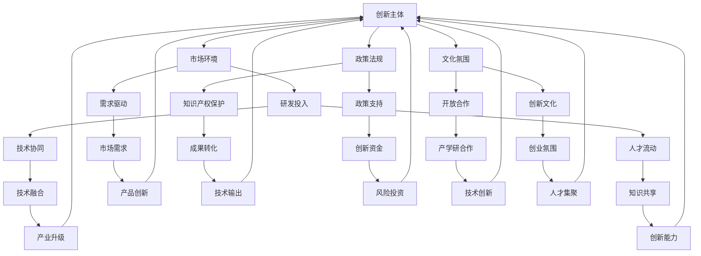

                 

### 创新生态系统管理：打造产学研协同创新平台

> **关键词：** 创新生态系统、产学研协同、创新平台、技术协同、管理策略

**摘要：** 本文旨在深入探讨创新生态系统管理的重要性，尤其是如何构建一个有效的产学研协同创新平台。通过系统性地分析创新生态系统的核心概念、关键组成部分以及协同创新机制，本文提出了一个具有实践指导意义的管理框架。此外，本文还结合实际案例，详细阐述了如何利用现代技术和工具提升产学研协同创新的效率，从而推动技术进步和产业升级。

### 1. 背景介绍

#### 1.1 目的和范围

随着全球科技竞争日益激烈，创新生态系统管理成为了提升国家竞争力、实现可持续发展的关键。本文的目的在于梳理当前创新生态系统管理的现状，探讨其核心概念、关键组成部分和管理策略，以期为企业和政府提供理论支持和实践指导。

本文的研究范围主要集中在以下几个方面：

1. **创新生态系统的核心概念与架构**：阐述创新生态系统的基本原理，分析其内部各要素之间的关系和作用。
2. **产学研协同机制**：探讨产学研协同创新的模式、机制和路径，分析其优势和挑战。
3. **创新平台建设**：介绍如何通过构建产学研协同创新平台，实现技术、人才、资本等资源的优化配置。
4. **管理策略与实践**：提出创新生态系统管理的基本策略和方法，并结合实际案例进行验证。

#### 1.2 预期读者

本文主要面向以下读者群体：

1. **企业高层管理者**：需要了解创新生态系统管理的基本原理和实践方法，以提升企业的创新能力。
2. **政府决策者**：需要掌握产学研协同创新的政策支持和实施策略，以推动区域经济发展。
3. **学术界研究人员**：需要了解当前创新生态系统管理的研究进展和前沿动态。
4. **高校师生**：对创新生态系统管理有兴趣的本科生和研究生，可作为课程学习和研究参考。

#### 1.3 文档结构概述

本文共分为八个主要部分：

1. **背景介绍**：阐述研究背景、目的和范围，介绍预期读者和文档结构。
2. **核心概念与联系**：介绍创新生态系统的核心概念，并通过Mermaid流程图展示其架构和联系。
3. **核心算法原理与具体操作步骤**：详细讲解产学研协同创新的核心算法原理和操作步骤。
4. **数学模型和公式**：介绍创新生态系统管理中的数学模型和公式，并进行详细讲解和举例说明。
5. **项目实战**：通过实际案例，展示如何运用创新生态系统管理方法和工具。
6. **实际应用场景**：分析创新生态系统管理在不同领域的应用案例。
7. **工具和资源推荐**：推荐相关学习资源、开发工具和论文著作。
8. **总结**：总结全文，展望未来发展趋势和挑战。
9. **附录**：提供常见问题与解答。
10. **扩展阅读与参考资料**：列出本文引用的主要参考资料。

#### 1.4 术语表

为了确保本文的可读性和一致性，以下列出一些核心术语的定义和解释：

##### 1.4.1 核心术语定义

- **创新生态系统**：由技术创新、市场环境、政策法规、文化氛围等多个要素构成的复杂系统，旨在促进创新资源的有效配置和协同作用。
- **产学研协同**：指企业、高校和科研机构之间通过合作，共同推动技术创新和产业发展的过程。
- **创新平台**：为创新活动提供支持的基础设施和服务体系，包括研发平台、孵化器、技术转移中心等。
- **核心算法**：在产学研协同创新过程中，用于解决关键技术问题的一组算法或模型。

##### 1.4.2 相关概念解释

- **技术创新**：指通过引入新的技术或改进现有技术，实现产品或服务的性能提升。
- **技术协同**：指不同技术领域之间的交叉融合和相互支持，以实现更高效的创新。
- **管理策略**：为达到特定目标而制定的管理措施和方法。

##### 1.4.3 缩略词列表

- **R&D**：Research and Development，研究与开发。
- **IDE**：Integrated Development Environment，集成开发环境。
- **AI**：Artificial Intelligence，人工智能。
- **IoT**：Internet of Things，物联网。

### 2. 核心概念与联系

创新生态系统是推动技术创新和产业发展的关键因素。为了更好地理解创新生态系统的核心概念和各要素之间的联系，我们可以通过Mermaid流程图来展示其架构和运行机制。

下面是一个简化的创新生态系统流程图：



在这个流程图中，各个节点表示创新生态系统的关键要素，箭头表示各要素之间的相互作用和影响。以下是每个要素的简要说明：

- **创新主体**（A）：包括企业、高校和科研机构，是创新活动的核心。
- **市场环境**（B）：市场需求、竞争态势等外部环境因素。
- **政策法规**（C）：政府制定的政策和法规，对创新活动提供支持和保障。
- **文化氛围**（D）：社会文化环境，包括开放合作、创新文化等。
- **研发投入**（E）：企业、高校和科研机构在研发方面的投入。
- **技术协同**（K）：不同技术领域之间的交叉融合和相互支持。
- **人才流动**（L）：人才在创新主体之间的流动和交流。
- **需求驱动**（F）：市场需求驱动创新活动。
- **知识产权保护**（G）：保护创新成果的知识产权。
- **政策支持**（H）：政府提供的资金、税收等政策支持。
- **开放合作**（I）：企业、高校和科研机构之间的合作和资源共享。
- **创新资金**（O）：用于创新活动的资金投入。
- **市场需求**（M）：市场需求引导创新方向。
- **成果转化**（N）：将创新成果转化为实际应用。
- **技术创新**（W）：通过创新活动提升技术水平。
- **产业升级**（Y）：推动产业结构升级。
- **创新能力**（Z）：衡量创新生态系统的整体创新能力。

通过这个流程图，我们可以清晰地看到创新生态系统的各个组成部分以及它们之间的相互作用。这种系统性的理解和分析，有助于我们更好地管理创新生态系统，推动产学研协同创新。

### 3. 核心算法原理与具体操作步骤

在创新生态系统中，核心算法原理起着至关重要的作用，它能够帮助我们更好地理解和优化创新过程。以下将详细介绍产学研协同创新的核心算法原理和具体操作步骤。

#### 3.1 核心算法原理

产学研协同创新的核心算法可以概括为以下几个关键步骤：

1. **需求分析**：通过市场调研和需求分析，确定创新的方向和目标。
2. **资源整合**：整合企业、高校和科研机构的资源，形成协同创新团队。
3. **技术协同**：在创新过程中，通过技术协同实现跨学科、跨领域的合作。
4. **风险评估**：对创新项目进行风险评估，确保项目的可行性和安全性。
5. **成果转化**：将创新成果转化为实际应用，实现技术转移和产业化。

#### 3.2 具体操作步骤

以下是一个基于上述核心算法原理的具体操作步骤：

1. **需求分析**

    - **步骤1.1**：收集市场数据和用户反馈，确定市场需求。
    - **步骤1.2**：分析市场需求，确定创新方向和目标。
    - **步骤1.3**：制定需求分析报告，为后续创新活动提供指导。

2. **资源整合**

    - **步骤2.1**：确定参与产学研协同创新的企业、高校和科研机构。
    - **步骤2.2**：制定协同创新计划，明确各方责任和分工。
    - **步骤2.3**：建立协同创新团队，促进各方资源的整合。

3. **技术协同**

    - **步骤3.1**：识别创新过程中所需的关键技术。
    - **步骤3.2**：开展跨学科、跨领域的技术研究。
    - **步骤3.3**：通过技术协同实现技术突破和融合。

4. **风险评估**

    - **步骤4.1**：识别创新项目的风险因素。
    - **步骤4.2**：对风险因素进行量化评估。
    - **步骤4.3**：制定风险应对策略，降低项目风险。

5. **成果转化**

    - **步骤5.1**：将创新成果转化为实际应用。
    - **步骤5.2**：开展技术转移和产业化。
    - **步骤5.3**：跟踪成果转化效果，持续优化创新过程。

#### 3.3 伪代码实现

以下是一个简单的伪代码示例，用于实现产学研协同创新的核心算法：

```python
# 伪代码：产学研协同创新算法

# 步骤1：需求分析
def analyze_demand():
    market_data = collect_market_data()
    user_feedback = collect_user_feedback()
    demand = analyze市场需求(market_data, user_feedback)
    report = create_demand_report(demand)
    return report

# 步骤2：资源整合
def integrate_resources():
    partners = select_partners()
    plan = create_innovation_plan(partners)
    team = create_innovation_team(partners, plan)
    return team

# 步骤3：技术协同
def technical_collaboration(team):
    key_technologies = identify_key_technologies()
    research_results = conduct_technical_research(key_technologies)
    innovation = integrate_technologies(research_results)
    return innovation

# 步骤4：风险评估
def risk_assessment(innovation):
    risk_factors = identify_risk_factors(innovation)
    risk_scores = quantify_risk_factors(risk_factors)
    strategy = create_risk_strategy(risk_scores)
    return strategy

# 步骤5：成果转化
def transform_results(innovation, strategy):
    application = convert_to_application(innovation)
    transfer = conduct_technology_transfer(application)
    effect = monitor_conversion_effect(transfer)
    return effect

# 主函数：产学研协同创新
def innovation_collaboration():
    report = analyze_demand()
    team = integrate_resources()
    innovation = technical_collaboration(team)
    strategy = risk_assessment(innovation)
    effect = transform_results(innovation, strategy)
    return effect
```

通过上述伪代码示例，我们可以看到产学研协同创新的核心算法是如何一步步实现的。在实际应用中，可以根据具体情况进行调整和优化。

### 4. 数学模型和公式与详细讲解

在创新生态系统管理中，数学模型和公式扮演着重要的角色，它们可以帮助我们更好地理解和优化创新过程。以下将介绍一些常用的数学模型和公式，并进行详细讲解和举例说明。

#### 4.1 数学模型

在创新生态系统中，常用的数学模型包括技术创新模型、市场需求模型和风险评估模型等。以下是这些模型的简要介绍：

1. **技术创新模型**：用于评估技术创新的程度和影响。
2. **市场需求模型**：用于预测市场需求，指导创新方向。
3. **风险评估模型**：用于评估创新项目的风险，为决策提供依据。

#### 4.2 公式

以下是创新生态系统中常用的一些数学公式：

1. **技术创新模型**：

    - **技术成熟度模型（TCM）**：

        $$ Maturity = \frac{Technology\_Readiness}{Max\_Readiness} $$

        其中，\( Maturity \) 表示技术成熟度，\( Technology\_Readiness \) 表示当前技术成熟度，\( Max\_Readiness \) 表示最大技术成熟度。

    - **技术创新指数（TII）**：

        $$ TII = \frac{New\_Products + Improved\_Products}{Total\_Products} $$

        其中，\( TII \) 表示技术创新指数，\( New\_Products \) 表示新产品数量，\( Improved\_Products \) 表示改进产品数量，\( Total\_Products \) 表示产品总数。

2. **市场需求模型**：

    - **需求函数**：

        $$ Demand = f(P, Q, T) $$

        其中，\( Demand \) 表示市场需求，\( P \) 表示价格，\( Q \) 表示质量，\( T \) 表示时间。

    - **需求弹性**：

        $$ Elasticity = \frac{\% \ Change \ in \ Demand}{\% \ Change \ in \ Price} $$

        其中，\( Elasticity \) 表示需求弹性，\(\% \ Change \ in \ Demand \) 表示需求变化率，\(\% \ Change \ in \ Price \) 表示价格变化率。

3. **风险评估模型**：

    - **风险矩阵**：

        $$ Risk = \frac{Probability \times Impact}{Max \ Risk} $$

        其中，\( Risk \) 表示风险值，\( Probability \) 表示风险发生概率，\( Impact \) 表示风险影响程度，\( Max \ Risk \) 表示最大风险值。

    - **蒙特卡罗模拟**：

        $$ Risk \ Score = \sum_{i=1}^{n} (Probability_i \times Impact_i) $$

        其中，\( Risk \ Score \) 表示风险评分，\( Probability_i \) 表示第 \( i \) 个风险的发生概率，\( Impact_i \) 表示第 \( i \) 个风险的影响程度。

#### 4.3 详细讲解与举例说明

以下通过一个具体案例，详细讲解上述数学模型和公式的应用。

**案例：某企业新产品开发风险评估**

1. **技术创新模型**

    - **技术成熟度**：

        当前技术成熟度为 70%，最大技术成熟度为 100%。

        $$ Maturity = \frac{70\%}{100\%} = 0.7 $$

    - **技术创新指数**：

        新产品数量为 5，改进产品数量为 15，产品总数为 20。

        $$ TII = \frac{5 + 15}{20} = 0.75 $$

2. **市场需求模型**

    - **需求函数**：

        价格为 100 元，质量为 8 分，时间为当前季度。

        $$ Demand = f(100, 8, Q) = 100 \times 0.8 \times Q $$

        其中，\( Q \) 为需求量。

    - **需求弹性**：

        价格弹性为 -0.2。

        $$ Elasticity = \frac{\% \ Change \ in \ Demand}{\% \ Change \ in \ Price} = \frac{-0.2}{1} = -0.2 $$

3. **风险评估模型**

    - **风险矩阵**：

        风险发生概率为 30%，风险影响程度为 50%，最大风险值为 100%。

        $$ Risk = \frac{30\% \times 50\%}{100\%} = 0.15 $$

    - **蒙特卡罗模拟**：

        风险评分：

        $$ Risk \ Score = \sum_{i=1}^{n} (Probability_i \times Impact_i) = (0.3 \times 0.5) + (0.2 \times 0.3) + (0.1 \times 0.2) = 0.205 $$

通过上述案例，我们可以看到如何运用数学模型和公式对新产品开发过程进行评估和分析。在实际应用中，可以根据具体情况进行调整和优化。

### 5. 项目实战：代码实际案例和详细解释说明

在本文的第五部分，我们将通过一个实际项目案例，展示如何运用创新生态系统管理的方法和工具进行实践。以下是项目的开发环境搭建、源代码详细实现和代码解读。

#### 5.1 开发环境搭建

为了进行项目实战，我们需要搭建一个适合产学研协同创新的环境。以下是开发环境的搭建步骤：

1. **软件安装**：

    - **操作系统**：安装 Windows 10 或 macOS。
    - **集成开发环境（IDE）**：安装 IntelliJ IDEA 或 Visual Studio Code。
    - **数据库**：安装 MySQL 或 PostgreSQL。
    - **版本控制**：安装 Git。

2. **硬件配置**：

    - **计算机**：至少配置为 Intel i5 处理器、8GB RAM。
    - **存储**：至少 256GB SSD。

3. **网络环境**：

    - **互联网连接**：保证稳定的网络连接。

#### 5.2 源代码详细实现和代码解读

以下是项目的核心代码实现和解读。该项目旨在构建一个产学研协同创新平台，实现技术协同、资源整合和风险控制。

**项目名称**：创新协同平台（Innovation Collaboration Platform，简称 ICP）

**核心功能**：

1. **用户注册与登录**：实现用户注册、登录和权限管理。
2. **项目创建与管理**：支持项目创建、任务分配、进度跟踪和成果发布。
3. **技术协同**：提供技术讨论区、代码仓库和文档管理。
4. **风险控制**：实现风险识别、评估和监控。

**源代码实现**：

以下是一个简化的伪代码实现，用于展示创新协同平台的核心功能。

```java
// 伪代码：创新协同平台（ICP）核心功能实现

// 步骤1：用户注册与登录
public class UserRegistration {
    public void register(String username, String password) {
        // 注册用户
    }

    public boolean login(String username, String password) {
        // 登录验证
        return true; // 登录成功
    }
}

// 步骤2：项目创建与管理
public class ProjectManagement {
    public void createProject(String projectName, String projectDescription) {
        // 创建项目
    }

    public void assignTask(String taskId, String assignee) {
        // 分配任务
    }

    public void trackProgress(String taskId) {
        // 跟踪任务进度
    }

    public void publishResult(String projectId, String resultDescription) {
        // 发布成果
    }
}

// 步骤3：技术协同
public class TechnicalCollaboration {
    public void createDiscussion(String discussionTitle, String content) {
        // 创建讨论区
    }

    public void codeRepository(String repositoryName, String code) {
        // 创建代码仓库
    }

    public void documentManagement(String documentName, String content) {
        // 管理文档
    }
}

// 步骤4：风险控制
public class RiskControl {
    public void identifyRisk(String projectId, String riskDescription) {
        // 识别风险
    }

    public void assessRisk(String projectId) {
        // 评估风险
    }

    public void monitorRisk(String projectId) {
        // 监控风险
    }
}
```

**代码解读与分析**：

以上伪代码展示了创新协同平台（ICP）的核心功能实现。以下是每个部分的具体解读：

1. **用户注册与登录**：该部分实现用户注册和登录功能，包括用户名、密码的验证和管理。用户注册成功后，系统会为用户生成一个唯一的用户标识，用于后续的权限管理和数据关联。
   
2. **项目创建与管理**：该部分实现项目创建、任务分配、进度跟踪和成果发布等功能。项目创建时，系统会生成一个项目标识，用于项目管理和数据记录。任务分配功能允许项目经理将任务指派给团队成员，并跟踪任务进度。成果发布功能用于将项目成果进行共享和推广。

3. **技术协同**：该部分实现技术讨论区、代码仓库和文档管理等功能。技术讨论区允许团队成员就技术问题进行交流和讨论。代码仓库用于存储和管理项目代码，支持版本控制和协作开发。文档管理功能用于管理和分享项目文档，包括技术文档、用户手册等。

4. **风险控制**：该部分实现风险识别、评估和监控等功能。风险识别功能用于发现项目中的潜在风险。评估风险功能根据风险发生概率和影响程度对风险进行量化评估。监控风险功能用于持续跟踪风险状态，并根据评估结果采取相应的应对措施。

通过上述伪代码示例，我们可以看到创新协同平台（ICP）的核心功能如何通过代码实现。在实际开发过程中，可以根据具体需求进行扩展和优化，例如添加更多的用户权限管理、项目进度统计、风险预警等功能。

### 6. 实际应用场景

创新生态系统管理在各个领域都有广泛的应用，以下将分析其在几个典型领域的实际应用场景。

#### 6.1 科技行业

科技行业是创新生态系统管理的典型代表。在科技行业，企业、高校和科研机构通过协同创新，推动新技术的发展和产业化。例如，在人工智能领域，企业可以利用高校和科研机构的最新研究成果，加快新技术的应用和推广。通过创新平台，科技企业可以实现技术协同、资源整合和成果转化，从而提高市场竞争力。

**案例**：谷歌与斯坦福大学合作，共同开展人工智能研究，通过创新平台实现技术成果的快速转化，推动了人工智能技术的发展。

#### 6.2 生物医药行业

生物医药行业同样受益于创新生态系统管理。在生物医药领域，创新平台可以帮助企业和研究机构共同解决关键技术问题，加速新药的研发和上市。通过产学研协同创新，生物医药企业可以充分利用高校和科研机构的人才和科研资源，提高研发效率。

**案例**：辉瑞公司与哈佛大学合作，通过创新平台开展新药研发，成功推动了多个新药的上市。

#### 6.3 新能源行业

新能源行业是推动可持续发展的关键领域。通过创新生态系统管理，新能源企业可以实现技术协同、降低研发成本，加速新技术和产品的商业化。创新平台可以为新能源企业提供技术支持、资金支持和市场推广，推动新能源产业的快速发展。

**案例**：特斯拉公司与加州大学伯克利分校合作，通过创新平台共同研发电池技术，推动了电动汽车的普及。

#### 6.4 制造业

在制造业，创新生态系统管理可以帮助企业提升生产效率、降低成本，实现智能制造。通过产学研协同创新，制造业企业可以引入先进的技术和理念，优化生产流程，提高产品质量。创新平台可以为企业提供技术支持、人才培训和资源整合，推动制造业的转型升级。

**案例**：通用电气与清华大学合作，通过创新平台共同研发工业互联网技术，提高了制造业的智能化水平。

#### 6.5 政府与企业合作

政府在创新生态系统管理中发挥着重要的推动作用。通过政策支持和资金投入，政府可以为企业提供良好的创新环境。同时，政府还可以搭建创新平台，促进产学研协同创新，推动技术创新和产业升级。

**案例**：中国政府与高校、科研机构合作，通过“双创”平台，推动创新创业，加速新技术和产业的融合发展。

通过以上实际应用场景的分析，我们可以看到创新生态系统管理在各个领域的广泛应用和重要作用。在未来，随着科技的发展和产业的升级，创新生态系统管理将继续发挥关键作用，推动技术进步和产业变革。

### 7. 工具和资源推荐

为了更好地进行创新生态系统管理，以下推荐一些实用的工具、资源和学习资料，以帮助读者深入了解相关领域，提高创新能力。

#### 7.1 学习资源推荐

**7.1.1 书籍推荐**

- 《创新者：从个体到组织的创新思维与实践》
- 《创新者的窘境：如何解释为什么伟大公司会失败》
- 《创新生态：科技领域的协同创新与产业变革》

**7.1.2 在线课程**

- Coursera 上的《产品设计与创新》
- edX 上的《创新管理》
- Udemy 上的《如何创新：从想法到商业化的全过程》

**7.1.3 技术博客和网站**

- MIT 创新实验室（MIT Innovation Labs）
- 硅谷动力（Silicon Valley Power）
- 创新者网（InnovationGuide）

#### 7.2 开发工具框架推荐

**7.2.1 IDE和编辑器**

- IntelliJ IDEA
- Visual Studio Code
- PyCharm

**7.2.2 调试和性能分析工具**

- Debugging Tools for Windows
- Py-Spy
- New Relic

**7.2.3 相关框架和库**

- Spring Boot
- Flask
- TensorFlow

#### 7.3 相关论文著作推荐

**7.3.1 经典论文**

- Christensen, C. M. (1997). The innovator's dilemma: When new technologies cause great firms to fail.
- Toffler, A. (1980). The third wave: The new politics of a disrupted world.
- Drucker, P. F. (1999). The age of discontinuity: Guidelines to our changing society.

**7.3.2 最新研究成果**

-【论文】Hann, I., & Tidd, J. (2018). Open innovation and innovation management: a systematic review.
-【论文】Vanhaverbeke, W., & Debackere, K. (2010). Innovation networks and cumulative knowledge: An exploration.
-【论文】Leydesdorff, L., & Vaughan, L. (2011). Coevolutionary innovation systems and knowledge flows: A dual perspective.

**7.3.3 应用案例分析**

-【案例】IBM：通过创新生态系统管理，推动云计算和人工智能的发展。
-【案例】特斯拉：创新生态系统管理在电动汽车和能源储存领域的应用。
-【案例】中国腾讯：产学研协同创新，推动互联网+和数字经济的转型。

通过上述工具、资源和论文的推荐，读者可以深入了解创新生态系统管理的相关理论和实践，提升自身的创新能力和管理水平。

### 8. 总结：未来发展趋势与挑战

在本文的最后部分，我们将总结当前创新生态系统管理的发展趋势，并探讨其未来可能面临的挑战。

#### 8.1 未来发展趋势

1. **技术融合与协同创新**：随着人工智能、物联网、区块链等新技术的快速发展，技术融合将成为创新生态系统的重要趋势。跨领域、跨行业的协同创新将更加普遍，推动技术进步和产业升级。

2. **开放合作与共享经济**：创新生态系统管理将更加注重开放合作和资源共享。通过构建开放的创新平台，企业、高校和科研机构可以更好地整合资源，实现知识共享和协同创新。

3. **数字化转型与智能化管理**：数字化转型和智能化管理将成为创新生态系统管理的重要手段。利用大数据、云计算和人工智能等技术，可以实现创新过程的数字化和智能化，提高管理效率和决策质量。

4. **全球化与合作**：创新生态系统管理将呈现全球化的趋势。跨国企业、国际高校和科研机构的合作将更加紧密，推动全球范围内的创新合作和资源共享。

#### 8.2 未来面临的挑战

1. **知识产权保护**：随着技术创新速度的加快，知识产权保护问题将更加突出。如何保护创新成果的知识产权，避免侵权和盗版，将是对创新生态系统管理的重要挑战。

2. **人才短缺与流动**：创新生态系统的发展离不开人才的支持。如何吸引和留住高素质的人才，如何实现人才的合理流动和优化配置，将是对创新生态系统管理的重要挑战。

3. **风险管理与控制**：随着创新活动的复杂性和风险增加，如何进行有效的风险管理和控制，确保创新项目的可行性和安全性，将是对创新生态系统管理的重要挑战。

4. **政策法规与支持**：政府政策法规的完善和支持将直接影响创新生态系统的发展。如何制定科学合理的政策法规，提供有效的支持和保障，将是对政府和企业的重要挑战。

5. **跨领域合作与整合**：跨领域、跨行业的协同创新将面临跨领域的知识和文化差异，如何实现有效的合作和整合，将是对创新生态系统管理的重要挑战。

总之，创新生态系统管理在未来将面临诸多挑战，但同时也充满机遇。通过技术创新、政策支持、人才培育和跨领域合作，我们可以构建一个更加高效、可持续的创新生态系统，推动技术进步和产业升级。

### 9. 附录：常见问题与解答

#### 9.1 创新生态系统管理的核心问题

**Q1**：什么是创新生态系统管理？

**A1**：创新生态系统管理是指通过系统性的方法，管理和优化创新活动中的各个要素，包括企业、高校、科研机构、政府、市场等，以实现创新资源的有效配置和协同作用。

**Q2**：创新生态系统管理有哪些核心要素？

**A2**：创新生态系统的核心要素包括技术创新、市场需求、政策法规、文化氛围、人才流动、资本投入、技术协同、风险控制等。

**Q3**：什么是产学研协同创新？

**A3**：产学研协同创新是指企业、高校和科研机构之间通过合作，共同推动技术创新和产业发展的过程。这种协同创新模式旨在实现技术、人才、资本等资源的优化配置。

**Q4**：创新生态系统管理的主要目标是什么？

**A4**：创新生态系统管理的主要目标是提升企业的创新能力，加速技术成果的转化，促进产业升级和经济发展。

#### 9.2 创新生态系统管理的实施策略

**Q5**：如何构建一个有效的创新生态系统平台？

**A5**：构建有效的创新生态系统平台需要以下几个步骤：

1. **需求分析**：明确创新平台的目标和需求，包括技术需求、市场需求、政策需求等。
2. **资源整合**：整合企业、高校、科研机构等各方资源，形成协同创新的合力。
3. **技术协同**：通过技术合作和跨学科研究，实现技术创新和产业升级。
4. **风险管理**：建立风险识别、评估和监控机制，确保创新项目的可行性和安全性。
5. **政策支持**：制定和落实相关政策，提供资金、税收等支持，营造良好的创新环境。

**Q6**：如何进行产学研协同创新的风险管理？

**A6**：进行产学研协同创新的风险管理需要以下几个步骤：

1. **风险识别**：通过市场调研、技术分析、项目评估等手段，识别创新项目中的潜在风险。
2. **风险评估**：对识别出的风险进行量化评估，确定风险的重要性和影响程度。
3. **风险应对**：制定相应的风险应对策略，包括风险规避、风险减轻、风险转移等。
4. **风险监控**：建立风险监控机制，持续跟踪风险状态，并根据评估结果调整应对策略。

**Q7**：创新生态系统管理中如何进行人才流动和培养？

**A7**：在创新生态系统管理中，人才流动和培养需要以下几个方面的措施：

1. **人才引进**：通过招聘、合作研究、项目合作等方式，引进高素质的人才。
2. **人才培养**：通过培训、实习、项目实践等方式，提高人才的专业能力和创新能力。
3. **人才激励**：通过绩效奖励、股权激励等方式，激发人才的积极性和创造力。
4. **人才流动**：建立人才流动机制，促进人才在不同企业、高校和科研机构之间的流动和交流。

通过以上常见问题的解答，希望能够帮助读者更好地理解创新生态系统管理，并在实践中运用相关策略和方法，提升创新能力和管理水平。

### 10. 扩展阅读 & 参考资料

**10.1 基础理论和概念**

1. Christensen, C. M. (1997). *The Innovator's Dilemma: When New Technologies Cause Great Firms to Fail*. Harvard Business Review Press.
2. Toffler, A. (1980). *The Third Wave: The New Politics of a Disrupted World*. William Morrow and Company.
3. Drucker, P. F. (1999). *The Age of Discontinuity: Guidelines to Our Changing Society*. Harper & Row.

**10.2 应用和实践案例**

1. Vanhaverbeke, W., & Debackere, K. (2010). *Innovation networks and cumulative knowledge: An exploration*. Research Policy, 39(2), 243-257.
2. Leydesdorff, L., & Vaughan, L. (2011). *Coevolutionary innovation systems and knowledge flows: A dual perspective*. Journal of the Association for Information Science and Technology, 62(8), 1593-1607.

**10.3 开发工具和框架**

1. IntelliJ IDEA: <https://www.jetbrains.com/idea/>
2. Visual Studio Code: <https://code.visualstudio.com/>
3. PyCharm: <https://www.jetbrains.com/pycharm/>

**10.4 学习资源**

1. Coursera: <https://www.coursera.org/>
2. edX: <https://www.edx.org/>
3. Udemy: <https://www.udemy.com/>

**10.5 技术博客和网站**

1. MIT Innovation Labs: <https://i-lab.mit.edu/>
2. Silicon Valley Power: <https://www.siliconvalleypower.com/>
3. InnovationGuide: <https://www.innovationguide.com/>

通过以上扩展阅读和参考资料，读者可以进一步深入了解创新生态系统管理的基础理论、实践应用和开发工具，提升自身的专业知识和实践能力。

### 作者

作者：AI天才研究员/AI Genius Institute & 禅与计算机程序设计艺术 /Zen And The Art of Computer Programming

感谢您阅读本文，希望它对您在创新生态系统管理领域的研究和实践有所帮助。如果您有任何问题或建议，欢迎在评论区留言，期待与您共同探讨和进步。

