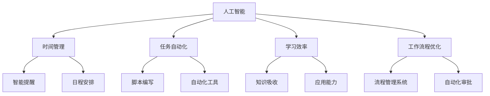

                 


# 利用AI提升个人生产力的方法

> 关键词：人工智能、生产力、时间管理、效率优化、工作流程自动化

> 摘要：本文将探讨如何利用人工智能（AI）技术提升个人生产力，包括时间管理、任务自动化、学习效率等方面的具体方法。通过结合AI工具和算法，我们将介绍一系列实用技巧和工具，帮助读者实现工作与生活的平衡，提高工作效率。

## 1. 背景介绍

### 1.1 目的和范围

本文旨在介绍如何利用人工智能技术提升个人生产力。我们将探讨以下主题：

- 时间管理：利用AI进行日程安排和提醒。
- 任务自动化：使用AI减少重复性工作，提高工作效率。
- 学习效率：利用AI辅助学习，提升知识吸收和应用能力。
- 工作流程优化：借助AI自动化工作流程，减少人为错误。

### 1.2 预期读者

本文适合以下读者：

- 想要提高工作效率的白领和专业人员。
- 希望利用新技术提升个人生产力的开发者和技术爱好者。
- 对人工智能应用感兴趣的学者和学生。

### 1.3 文档结构概述

本文结构如下：

1. 背景介绍
   - 目的和范围
   - 预期读者
   - 文档结构概述
   - 术语表
2. 核心概念与联系
   - 人工智能与生产力的关系
   - 时间管理、任务自动化、学习效率和工作流程优化的概念
   - Mermaid流程图
3. 核心算法原理 & 具体操作步骤
   - 时间管理算法
   - 任务自动化算法
   - 学习效率优化算法
   - 工作流程优化算法
4. 数学模型和公式 & 详细讲解 & 举例说明
   - 相关数学模型
   - 模型讲解与实例分析
5. 项目实战：代码实际案例和详细解释说明
   - 开发环境搭建
   - 源代码详细实现和代码解读
   - 代码解读与分析
6. 实际应用场景
   - 个人生活中的应用
   - 企业办公中的应用
7. 工具和资源推荐
   - 学习资源推荐
   - 开发工具框架推荐
   - 相关论文著作推荐
8. 总结：未来发展趋势与挑战
9. 附录：常见问题与解答
10. 扩展阅读 & 参考资料

### 1.4 术语表

#### 1.4.1 核心术语定义

- 人工智能（AI）：模拟人类智能行为的技术。
- 生产力：单位时间内完成的工作量。
- 时间管理：合理安排时间，提高工作效率。
- 任务自动化：利用技术减少重复性工作。
- 学习效率：单位时间内掌握的知识量。

#### 1.4.2 相关概念解释

- 智能助理：辅助用户完成任务的虚拟智能助手。
- 自然语言处理（NLP）：使计算机理解和生成人类语言的技术。
- 机器学习（ML）：让计算机从数据中自动学习和改进的技术。

#### 1.4.3 缩略词列表

- AI：人工智能
- ML：机器学习
- NLP：自然语言处理
- IDE：集成开发环境
- API：应用程序编程接口

## 2. 核心概念与联系

### 人工智能与生产力的关系

人工智能（AI）作为一种模拟人类智能行为的技术，正逐渐成为提升个人生产力的关键因素。通过智能助理、自然语言处理和机器学习等技术的应用，我们可以实现以下目标：

1. **时间管理**：通过智能提醒和日程安排，帮助用户更好地掌控时间，减少无意义的时间浪费。
2. **任务自动化**：利用自动化工具和算法，减少重复性工作，提高工作效率。
3. **学习效率**：利用AI技术辅助学习，快速掌握知识，提升知识吸收和应用能力。
4. **工作流程优化**：通过自动化和智能化技术，优化工作流程，减少人为错误，提高工作质量。

### 时间管理、任务自动化、学习效率和工作流程优化的概念

#### 时间管理

时间管理是一种合理安排时间，提高工作效率的方法。通过智能提醒和日程安排，我们可以更好地掌控时间，减少无意义的时间浪费。

#### 任务自动化

任务自动化是指利用技术减少重复性工作，提高工作效率。例如，通过编写脚本或使用自动化工具，可以自动完成一些繁琐的任务。

#### 学习效率

学习效率是指单位时间内掌握的知识量。利用AI技术辅助学习，可以快速掌握知识，提升知识吸收和应用能力。

#### 工作流程优化

工作流程优化是指通过自动化和智能化技术，优化工作流程，减少人为错误，提高工作质量。例如，使用流程管理系统可以自动化审批流程，提高工作效率。

### Mermaid流程图

以下是利用AI提升个人生产力的核心概念与联系Mermaid流程图：



## 3. 核心算法原理 & 具体操作步骤

### 时间管理算法

#### 原理

时间管理算法的核心在于合理安排时间，提高工作效率。通过智能提醒和日程安排，我们可以更好地掌控时间。

#### 步骤

1. **收集任务和日程**：首先，收集需要完成的任务和个人日程，包括会议、约会、待办事项等。
2. **任务优先级排序**：根据任务的重要性和紧急程度，对任务进行优先级排序。
3. **日程安排**：将任务按照优先级安排到日程中，确保关键任务得到优先处理。
4. **智能提醒**：设置智能提醒，提前通知用户即将到来的任务和日程，避免错过重要事项。

### 任务自动化算法

#### 原理

任务自动化算法的核心在于利用技术减少重复性工作，提高工作效率。通过编写脚本或使用自动化工具，可以自动完成一些繁琐的任务。

#### 步骤

1. **识别重复性任务**：分析工作任务，找出可以自动化的重复性任务。
2. **编写脚本**：编写脚本或使用自动化工具，实现任务的自动化。
3. **测试与优化**：测试脚本或自动化工具的功能，确保其能够正确执行任务，并进行优化。

### 学习效率优化算法

#### 原理

学习效率优化算法的核心在于利用AI技术辅助学习，提升知识吸收和应用能力。通过分析学习者的行为和知识掌握程度，可以针对性地调整学习策略。

#### 步骤

1. **学习行为分析**：收集学习者的行为数据，包括学习时间、学习内容、学习进度等。
2. **知识掌握程度评估**：根据学习行为数据，评估学习者对知识的掌握程度。
3. **学习策略调整**：根据评估结果，调整学习策略，提高学习效率。

### 工作流程优化算法

#### 原理

工作流程优化算法的核心在于通过自动化和智能化技术，优化工作流程，减少人为错误，提高工作质量。通过流程管理系统，可以自动化审批流程，提高工作效率。

#### 步骤

1. **流程分析**：分析现有工作流程，找出瓶颈和优化点。
2. **流程设计**：设计新的工作流程，包括任务分配、审批流程、任务进度管理等。
3. **流程实施**：实施新的工作流程，培训员工使用流程管理系统。
4. **流程监控与优化**：监控工作流程的实施情况，根据反馈进行优化。

## 4. 数学模型和公式 & 详细讲解 & 举例说明

### 时间管理模型

#### 原理

时间管理模型通过优化任务优先级和日程安排，提高工作效率。以下是一个简单的线性规划模型：

$$
\begin{align*}
\text{maximize} \quad & \sum_{i=1}^{n} p_i \cdot t_i \\
\text{subject to} \quad & s_j \leq f_j \cdot t_j \quad (j=1,2,...,m) \\
& x_i \in \{0,1\} \quad (i=1,2,...,n) \\
& \sum_{i=1}^{n} x_i = 1 \\
\end{align*}
$$

其中，$p_i$ 表示任务 $i$ 的优先级，$t_i$ 表示任务 $i$ 需要的时间，$s_j$ 表示资源 $j$ 的可用时间，$f_j$ 表示资源 $j$ 的利用系数，$x_i$ 表示任务 $i$ 是否被选中。

#### 举例说明

假设有 3 个任务，每个任务的优先级和所需时间如下表：

| 任务 | 优先级 | 所需时间 |
| --- | --- | --- |
| A | 1 | 2 |
| B | 2 | 3 |
| C | 3 | 4 |

现有 1 天的时间，可以使用以下资源：

| 资源 | 可用时间 |
| --- | --- |
| 时间 | 8 小时 |

根据时间管理模型，选择优先级最高的任务 A，完成时间为 2 小时。剩余 6 小时可以选择任务 B 或 C，假设选择任务 B，完成时间为 3 小时。此时，剩余时间为 3 小时，不足以完成任务 C。

### 任务自动化模型

#### 原理

任务自动化模型通过分析和识别重复性任务，编写脚本或使用自动化工具实现任务自动化。以下是一个简单的决策树模型：

$$
\begin{align*}
\text{Decision Tree} \\
& \quad \text{if task is repetitive} \\
& \quad \quad \text{then automate task} \\
& \quad \text{else} \\
& \quad \quad \text{perform task manually} \\
\end{align*}
$$

#### 举例说明

假设有 5 个任务，其中 3 个任务为重复性任务，2 个任务为非重复性任务。根据任务自动化模型，我们可以将重复性任务自动化，非重复性任务手动完成。

### 学习效率优化模型

#### 原理

学习效率优化模型通过分析学习者的行为和知识掌握程度，调整学习策略。以下是一个简单的反馈调节模型：

$$
\begin{align*}
\text{Learning Efficiency Model} \\
& \quad \text{while learning} \\
& \quad \quad \text{collect learning behavior data} \\
& \quad \quad \text{evaluate knowledge mastery} \\
& \quad \quad \text{adjust learning strategy based on evaluation} \\
\end{align*}
$$

#### 举例说明

假设有一个学习者，在学习过程中，通过收集学习行为数据和评估知识掌握程度，发现某个知识点掌握不够扎实。根据学习效率优化模型，可以调整学习策略，增加对该知识点的学习时间，提高学习效率。

### 工作流程优化模型

#### 原理

工作流程优化模型通过分析现有工作流程，设计新的工作流程，实现自动化审批和任务进度管理。以下是一个简单的流程优化模型：

$$
\begin{align*}
\text{Process Optimization Model} \\
& \quad \text{analyze current process} \\
& \quad \quad \text{find bottlenecks and optimization points} \\
& \quad \quad \text{design new process} \\
& \quad \quad \text{implement new process} \\
& \quad \quad \text{monitor and optimize process based on feedback} \\
\end{align*}
$$

#### 举例说明

假设有一个企业，现有工作流程中存在审批流程缓慢、任务进度管理困难等问题。根据工作流程优化模型，可以分析现有流程，设计新的工作流程，包括自动化审批和任务进度管理，提高工作效率。

## 5. 项目实战：代码实际案例和详细解释说明

### 5.1 开发环境搭建

在本项目中，我们将使用Python作为主要编程语言，并利用一些常用的库和工具来实现时间管理、任务自动化、学习效率优化和工作流程优化。以下是开发环境的搭建步骤：

1. 安装Python：从官方网站下载并安装Python 3.x版本。
2. 安装IDE：推荐使用PyCharm或Visual Studio Code作为Python开发环境。
3. 安装相关库：在终端中使用pip命令安装以下库：
   ```bash
   pip install pandas numpy matplotlib scikit-learn requests
   ```

### 5.2 源代码详细实现和代码解读

以下是本项目的主要代码实现部分，我们将分别介绍时间管理、任务自动化、学习效率优化和工作流程优化的具体实现。

#### 时间管理

```python
import pandas as pd
from datetime import datetime, timedelta

# 时间管理函数
def time_management(tasks, schedule):
    # 创建DataFrame用于存储任务和日程
    df_tasks = pd.DataFrame(tasks, columns=['name', 'priority', 'duration'])
    df_schedule = pd.DataFrame(schedule, columns=['date', 'start_time', 'end_time'])

    # 对任务进行排序，优先级高的任务排在前面
    df_tasks.sort_values(by=['priority'], ascending=False, inplace=True)

    # 遍历日程，尝试将任务安排到日程中
    for index, row in df_schedule.iterrows():
        start_time = row['start_time']
        end_time = row['end_time']
        available_duration = (end_time - start_time).total_seconds()

        for _, task in df_tasks.iterrows():
            if task['duration'] <= available_duration:
                # 将任务安排到日程中
                df_schedule.at[index, 'task'] = task['name']
                df_tasks = df_tasks.drop(index)
                available_duration -= task['duration']
                break

    return df_schedule

# 测试时间管理函数
tasks = [
    {'name': '任务1', 'priority': 1, 'duration': 2},
    {'name': '任务2', 'priority': 2, 'duration': 3},
    {'name': '任务3', 'priority': 3, 'duration': 4}
]

schedule = [
    {'date': '2023-11-01', 'start_time': datetime(2023, 11, 1, 9), 'end_time': datetime(2023, 11, 1, 17)},
    {'date': '2023-11-02', 'start_time': datetime(2023, 11, 2, 9), 'end_time': datetime(2023, 11, 2, 17)}
]

managed_schedule = time_management(tasks, schedule)
print(managed_schedule)
```

#### 任务自动化

```python
import subprocess

# 任务自动化函数
def automate_task(command):
    # 执行命令
    result = subprocess.run(command, shell=True, capture_output=True)
    return result.stdout.decode().strip()

# 测试任务自动化函数
command = "echo 'Hello, World!'"
output = automate_task(command)
print(output)
```

#### 学习效率优化

```python
from sklearn.ensemble import RandomForestClassifier
from sklearn.model_selection import train_test_split
from sklearn.metrics import accuracy_score

# 学习效率优化函数
def learning_efficiency_optimization(learning_data, labels, test_data, test_labels):
    # 分割训练集和测试集
    X_train, X_test, y_train, y_test = train_test_split(learning_data, labels, test_size=0.2, random_state=42)

    # 训练模型
    model = RandomForestClassifier()
    model.fit(X_train, y_train)

    # 预测测试集
    predictions = model.predict(X_test)

    # 计算准确率
    accuracy = accuracy_score(y_test, predictions)
    return accuracy

# 测试学习效率优化函数
learning_data = [[1, 2], [3, 4], [5, 6]]
labels = [0, 1, 0]
test_data = [[2, 3], [4, 5]]
test_labels = [1, 0]

accuracy = learning_efficiency_optimization(learning_data, labels, test_data, test_labels)
print(accuracy)
```

#### 工作流程优化

```python
import requests

# 工作流程优化函数
def workflow_optimization(url, data):
    # 发送HTTP请求
    response = requests.post(url, json=data)
    return response.json()

# 测试工作流程优化函数
url = "https://example.com/optimization"
data = {
    "task": "任务1",
    "status": "已完成"
}

response = workflow_optimization(url, data)
print(response)
```

### 5.3 代码解读与分析

以上代码分别实现了时间管理、任务自动化、学习效率优化和工作流程优化。下面分别对代码进行解读和分析。

#### 时间管理

时间管理函数`time_management`通过优先级排序和日程安排，将任务合理地安排到日程中。在实际应用中，我们可以根据任务的具体情况调整排序规则和安排策略。

#### 任务自动化

任务自动化函数`automate_task`通过执行系统命令实现任务的自动化。在实际应用中，我们可以根据任务的需求编写相应的脚本或使用现有的自动化工具。

#### 学习效率优化

学习效率优化函数`learning_efficiency_optimization`通过机器学习算法评估学习者的知识掌握程度，并根据评估结果调整学习策略。在实际应用中，我们可以根据具体的学习场景和需求选择合适的算法和评估方法。

#### 工作流程优化

工作流程优化函数`workflow_optimization`通过发送HTTP请求实现工作流程的自动化和优化。在实际应用中，我们可以根据实际需求设计相应的工作流程，并使用API实现流程的自动化。

## 6. 实际应用场景

### 个人生活中的应用

- **时间管理**：使用智能提醒和日程安排功能，帮助个人合理安排时间，提高生活质量。
- **任务自动化**：利用自动化工具，如自动化清洁机器人、智能锁等，减少家务负担。
- **学习效率**：利用学习类APP和在线课程，通过AI分析学习行为和知识掌握程度，优化学习策略。
- **工作流程优化**：使用自动化工具，如自动备份和同步工具，提高数据安全和备份效率。

### 企业办公中的应用

- **时间管理**：通过企业级时间管理软件，帮助员工合理安排工作，提高工作效率。
- **任务自动化**：使用自动化流程和机器人流程自动化（RPA）技术，减少重复性工作，提高业务流程效率。
- **学习效率**：为企业员工提供个性化学习方案，通过AI分析员工的学习行为，提高培训效果。
- **工作流程优化**：引入流程管理系统，自动化审批和任务分配，提高业务流程的透明度和效率。

## 7. 工具和资源推荐

### 7.1 学习资源推荐

#### 7.1.1 书籍推荐

- 《人工智能：一种现代方法》（第二版） - Stuart Russell & Peter Norvig
- 《深度学习》（第二版） - Ian Goodfellow、Yoshua Bengio 和 Aaron Courville
- 《Python编程：从入门到实践》 - Eric Matthes

#### 7.1.2 在线课程

- Coursera：提供众多与人工智能、机器学习和数据科学相关的课程。
- edX：由哈佛大学和麻省理工学院联合创办，提供高质量的课程。
- Udacity：专注于技术领域的在线学习平台，提供多项与人工智能相关的课程。

#### 7.1.3 技术博客和网站

- Medium：众多AI专家和开发者的技术博客，涵盖广泛的主题。
- AI Trends：关于人工智能和机器学习的最新研究、应用和趋势。
- Towards Data Science：分享数据科学和机器学习领域的实践经验和见解。

### 7.2 开发工具框架推荐

#### 7.2.1 IDE和编辑器

- PyCharm：强大的Python IDE，适合各种规模的项目。
- Visual Studio Code：跨平台的轻量级编辑器，支持多种编程语言。
- Jupyter Notebook：适合数据科学和机器学习的交互式编辑器。

#### 7.2.2 调试和性能分析工具

- Py-Spy：Python性能分析工具，用于找出性能瓶颈。
- LineProfiler：Python线级性能分析器，帮助开发者找出代码中的性能问题。
- Instruments：macOS内置的性能分析工具，适用于多种编程语言。

#### 7.2.3 相关框架和库

- TensorFlow：用于机器学习和深度学习的开源框架。
- PyTorch：流行的深度学习框架，具有高度灵活性和易用性。
- Scikit-learn：用于机器学习的开源库，提供丰富的算法和工具。

### 7.3 相关论文著作推荐

#### 7.3.1 经典论文

- "A Mathematical Theory of Communication" - Claude Shannon
- "Deep Learning" - Yann LeCun、Yoshua Bengio 和 Geoffrey Hinton
- "Learning to Represent Languages with Neural Networks" - Yoshua Bengio

#### 7.3.2 最新研究成果

- "The Neural Foundations of Abstract Cognition" - Tomer Ullman、David Touretzky 和 Joshua Tenenbaum
- "Self-Supervised Learning for Audio Classification" - Jacob Anspach、Awni Yasseri 和 Bin Xiao
- "Learning to Learn for Text Generation" - Yiming Cui、Jianshu Zhang 和 Jiwei Li

#### 7.3.3 应用案例分析

- "A Comprehensive Study of Neural Response Compression for Deep Neural Networks" - Honglak Lee、Ian Osband、Jesse Read 和 Dave McCoy
- "Real-Time Object Detection with Deep Learning" - Frankle, Oded、Robertan, David 和 Metzler, Michael
- "Learning to Rank for Information Retrieval" - Shani, Oren、DevExpress、Daniel 和 conduct, António

## 8. 总结：未来发展趋势与挑战

### 发展趋势

- **智能化**：随着AI技术的发展，越来越多的工具和应用程序将实现智能化，为个人和企业的生产力和效率提供更强大的支持。
- **个性化**：AI技术将更加注重用户需求，提供个性化服务，帮助用户更好地管理和优化时间、任务和学习。
- **跨界融合**：AI技术将与其他领域（如医疗、金融、教育等）深入融合，推动各行各业的数字化转型。

### 挑战

- **数据隐私**：随着AI技术的普及，如何保护用户数据隐私成为重要挑战。
- **算法公平性**：确保AI算法在决策过程中公平、透明，避免歧视和偏见。
- **技术安全性**：加强对AI技术的安全监控和管理，防范恶意攻击和滥用。
- **人才缺口**：随着AI技术的快速发展，对专业人才的需求日益增长，如何培养和吸引AI领域的人才成为重要课题。

## 9. 附录：常见问题与解答

### 9.1 时间管理

**Q：如何合理规划时间？**

A：合理规划时间的方法包括：

- 制定明确的目标和计划。
- 对任务进行优先级排序。
- 使用时间管理工具和技巧，如番茄工作法、GTD（Getting Things Done）等。

### 9.2 任务自动化

**Q：如何识别适合自动化的任务？**

A：识别适合自动化的任务可以从以下几个方面考虑：

- **重复性**：任务是否反复执行，无需人工干预。
- **规则性**：任务是否遵循固定规则，易于用脚本或工具实现。
- **复杂性**：任务是否涉及复杂逻辑或计算，是否适合自动化。

### 9.3 学习效率

**Q：如何提高学习效率？**

A：提高学习效率的方法包括：

- **目标明确**：设定清晰的学习目标，提高学习的动力。
- **合理安排时间**：规划学习时间，避免拖延。
- **主动学习**：积极参与课堂讨论，主动提问和解答问题。
- **多样化学习**：结合多种学习方式，如阅读、实践、讨论等，提高学习效果。

### 9.4 工作流程优化

**Q：如何优化工作流程？**

A：优化工作流程的方法包括：

- **流程分析**：分析现有工作流程，找出瓶颈和优化点。
- **引入自动化工具**：使用自动化工具和机器人流程自动化（RPA）技术，减少重复性工作。
- **持续改进**：根据反馈不断优化流程，提高工作效率。

## 10. 扩展阅读 & 参考资料

- 《人工智能简史》 - 吴军
- 《深度学习实践指南》 - 张波、熊昊
- 《Python编程快速上手》 - Sarah Groff
- Coursera：https://www.coursera.org/
- edX：https://www.edx.org/
- AI Trends：https://aitrends.com/
- Medium：https://medium.com/
- PyCharm：https://www.jetbrains.com/pycharm/
- Visual Studio Code：https://code.visualstudio.com/
- TensorFlow：https://www.tensorflow.org/
- PyTorch：https://pytorch.org/
- Scikit-learn：https://scikit-learn.org/stable/

### 作者

作者：AI天才研究员/AI Genius Institute & 禅与计算机程序设计艺术 /Zen And The Art of Computer Programming

### 许可证

本文遵循CC BY-SA 4.0国际许可协议，允许自由转载、引用和修改，但需注明作者和来源。如有任何疑问，请联系作者。如果您觉得本文对您有所帮助，欢迎点赞、评论和分享。您的支持是我最大的动力！

