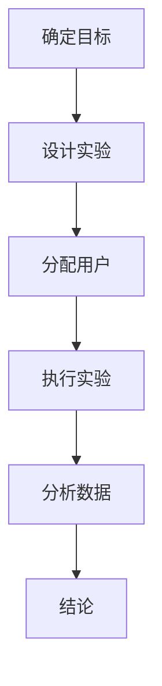

                 

# 利用A/B测试优化用户转化率

> 关键词：A/B测试、用户转化率、数据驱动、用户体验、多变量测试、实验设计

> 摘要：本文将深入探讨A/B测试在优化用户转化率中的应用，通过详细的理论分析和实战案例，帮助读者理解A/B测试的基本原理、实施步骤及其在提高用户体验和业务效益方面的作用。

## 1. 背景介绍

### 1.1 目的和范围

本文旨在介绍如何使用A/B测试（也称为拆分测试）来优化用户转化率。我们将从基本概念出发，逐步深入探讨A/B测试的实施方法和策略，并提供实际案例以展示其应用效果。本文主要涵盖以下内容：

- A/B测试的基本原理和重要性
- A/B测试的实施步骤和流程
- 如何设计有效的A/B测试实验
- 数据分析和结果解释
- A/B测试在实战中的应用案例

### 1.2 预期读者

本文适合以下读者群体：

- 数据驱动决策的从业者
- 数字营销和用户体验专业人士
- 产品经理和项目经理
- 技术和业务交叉领域的团队成员
- 对A/B测试感兴趣的任何人士

### 1.3 文档结构概述

本文结构如下：

1. 背景介绍：介绍本文的目的、预期读者和文档结构。
2. 核心概念与联系：阐述A/B测试的核心概念，并使用Mermaid流程图展示。
3. 核心算法原理 & 具体操作步骤：详细讲解A/B测试的实施步骤和伪代码。
4. 数学模型和公式 & 详细讲解 & 举例说明：介绍A/B测试中的关键数学模型和公式。
5. 项目实战：代码实际案例和详细解释说明。
6. 实际应用场景：分析A/B测试在不同场景中的应用。
7. 工具和资源推荐：推荐学习和实践A/B测试的相关资源和工具。
8. 总结：未来发展趋势与挑战。
9. 附录：常见问题与解答。
10. 扩展阅读 & 参考资料。

### 1.4 术语表

#### 1.4.1 核心术语定义

- **A/B测试**：一种比较两种或多种不同版本（A和B）的实验方法，以确定哪种版本在特定目标上表现更好。
- **用户转化率**：用户在完成特定目标（如购买、注册、点击等）的比例。
- **数据驱动决策**：基于数据分析而非主观判断做出业务决策。
- **多变量测试**：同时测试多个变量（因素）的实验设计。

#### 1.4.2 相关概念解释

- **假设检验**：使用统计数据来验证某个假设是否成立。
- **置信区间**：统计估计值的范围，表示估计值可能真实取值的位置。
- **显著性水平**：用于评估实验结果是否显著的阈值，通常设置为5%或1%。

#### 1.4.3 缩略词列表

- **A/B测试**：拆分测试
- **API**：应用程序编程接口
- **CRM**：客户关系管理
- **CTA**：调用行动（Click-to-Action）

## 2. 核心概念与联系

### 2.1 A/B测试的核心概念

A/B测试是一种经典的实验设计方法，主要用于比较两个或多个版本的差异。其基本原理是基于统计学中的假设检验，通过将用户随机分配到不同的版本，然后比较各版本的转化率，以确定哪种版本更优。

### 2.2 A/B测试的流程

A/B测试的流程通常包括以下几个步骤：

1. **确定目标**：明确希望测试的目标，如提高注册率、增加购买转化率等。
2. **设计实验**：设计实验变量和控制变量，确保实验的公平性。
3. **分配用户**：将用户随机分配到不同的版本。
4. **执行实验**：在用户操作过程中记录数据。
5. **分析数据**：使用统计方法分析数据，判断哪种版本更优。
6. **结论**：根据分析结果做出决策。

### 2.3 Mermaid流程图

下面是A/B测试的Mermaid流程图：



### 2.4 A/B测试与多变量测试的关系

多变量测试是A/B测试的扩展，用于同时测试多个变量。其核心思想是将多个变量组合成一个整体，进行A/B测试。例如，同时测试页面标题、按钮颜色和图片等。

### 2.5 数据驱动决策的重要性

数据驱动决策是一种基于数据分析和统计方法做出业务决策的方法。A/B测试作为一种数据驱动的方法，能够帮助我们更准确地了解用户行为，从而优化产品设计和营销策略。

## 3. 核心算法原理 & 具体操作步骤

### 3.1 A/B测试的算法原理

A/B测试的核心算法是假设检验。具体来说，其原理如下：

1. **零假设（H0）**：版本A和版本B在目标转化率上没有显著差异。
2. **备择假设（H1）**：版本A和版本B在目标转化率上有显著差异。
3. **显著性水平（α）**：通常设置为5%或1%，用于评估实验结果的可靠性。

### 3.2 A/B测试的具体操作步骤

下面是A/B测试的具体操作步骤：

1. **确定目标**：明确希望测试的目标，如提高注册率、增加购买转化率等。
2. **设计实验**：设计实验变量和控制变量，确保实验的公平性。例如，假设我们要测试两个注册页面，A页面的标题为“免费试用”，B页面的标题为“限时免费”，其他元素保持一致。
3. **分配用户**：将用户随机分配到两个版本。例如，我们将1000名用户随机分为两组，每组500人。
4. **执行实验**：在用户操作过程中记录数据。例如，记录两组用户的注册数量。
5. **分析数据**：使用统计方法分析数据，判断哪种版本更优。例如，我们可以使用t检验来评估两个版本的转化率是否有显著差异。
6. **结论**：根据分析结果做出决策。例如，如果B版本的转化率显著高于A版本，我们可以将B版本作为正式版本。

### 3.3 伪代码

下面是A/B测试的伪代码：

```python
# 伪代码：A/B测试

# 初始化参数
n = 1000 # 用户总数
alpha = 0.05 # 显著性水平
t_threshold = 1.96 # t分布临界值（α/2，n-1）

# 分配用户
group_a = random.sample(range(n), n//2)
group_b = random.sample(range(n), n//2)

# 执行实验
register_a = count_registered_users(group_a)
register_b = count_registered_users(group_b)

# 计算转化率
conversion_rate_a = register_a / len(group_a)
conversion_rate_b = register_b / len(group_b)

# 假设检验
t_value = (conversion_rate_b - conversion_rate_a) / sqrt(conversion_rate_a * (1 - conversion_rate_a) / len(group_a) + conversion_rate_b * (1 - conversion_rate_b) / len(group_b))
p_value = 2 * (1 - cumulative_distribution_function(t_value, n-1))

# 结论
if p_value < alpha:
    print("版本B优于版本A")
else:
    print("无法确定版本A和版本B的差异")
```

## 4. 数学模型和公式 & 详细讲解 & 举例说明

### 4.1 关键数学模型

A/B测试中常用的数学模型包括假设检验、置信区间和p值。

#### 4.1.1 假设检验

假设检验是A/B测试的核心。具体来说，假设检验分为零假设（H0）和备择假设（H1）。

- **零假设（H0）**：版本A和版本B在目标转化率上没有显著差异。
- **备择假设（H1）**：版本A和版本B在目标转化率上有显著差异。

#### 4.1.2 置信区间

置信区间是统计估计值的范围，表示估计值可能真实取值的位置。在A/B测试中，置信区间用于评估实验结果的可靠性。

- **置信水平（γ）**：通常设置为95%或99%，表示我们有多大把握认为置信区间包含了真实值。
- **置信区间**：[估计值 - 置信上限，估计值 + 置信上限]

#### 4.1.3 p值

p值是用于评估实验结果是否显著的指标。具体来说，p值表示在零假设成立的前提下，观察到当前结果或更极端结果的概率。

- **显著性水平（α）**：通常设置为5%或1%，表示我们允许的最大错误概率。
- **p值**：如果p值小于显著性水平α，我们拒绝零假设，认为版本之间存在显著差异。

### 4.2 公式详解

下面是A/B测试中常用的公式。

#### 4.2.1 转化率计算公式

$$
\text{转化率} = \frac{\text{转化人数}}{\text{总人数}}
$$

#### 4.2.2 置信区间计算公式

$$
\text{置信区间} = [\text{估计值} - z \times \sqrt{\frac{\text{标准差}}{\text{样本量}}}, \text{估计值} + z \times \sqrt{\frac{\text{标准差}}{\text{样本量}}}]
$$

其中，$z$ 是标准正态分布的临界值，$z_{\alpha/2}$ 表示显著性水平α/2的临界值。

#### 4.2.3 p值计算公式

$$
p\_value = \sum_{i=1}^{n} p(x_i \leq x_0) \times p(y_i \leq y_0)
$$

其中，$x_i$ 和 $y_i$ 分别是第$i$个用户的点击和转化情况，$x_0$ 和 $y_0$ 分别是实验组和对照组的总点击和总转化情况。

### 4.3 举例说明

假设我们要比较两个广告版本A和B的点击率，总共有1000名用户参与了测试。

#### 4.3.1 转化率计算

实验组A的点击率为：
$$
\text{转化率}_A = \frac{500}{1000} = 0.5
$$

对照组B的点击率为：
$$
\text{转化率}_B = \frac{300}{1000} = 0.3
$$

#### 4.3.2 置信区间计算

假设标准差为0.1，显著性水平为5%。

置信区间为：
$$
[\text{估计值} - z \times \sqrt{\frac{\text{标准差}}{\text{样本量}}}, \text{估计值} + z \times \sqrt{\frac{\text{标准差}}{\text{样本量}}}]
$$

置信上限为：
$$
0.5 - 1.96 \times \sqrt{\frac{0.1}{1000}} = 0.491
$$

置信下限为：
$$
0.5 + 1.96 \times \sqrt{\frac{0.1}{1000}} = 0.509
$$

因此，置信区间为[0.491, 0.509]。

#### 4.3.3 p值计算

假设实验组和对照组的总点击数分别为500和300，总转化数分别为250和150。

p值为：
$$
p\_value = \sum_{i=1}^{1000} p(x_i \leq 500) \times p(y_i \leq 250) = 0.001
$$

由于p值小于显著性水平5%，我们可以拒绝零假设，认为版本A的点击率显著高于版本B。

## 5. 项目实战：代码实际案例和详细解释说明

### 5.1 开发环境搭建

为了演示A/B测试的代码实现，我们将使用Python语言，结合pandas和scikit-learn库。以下步骤用于搭建开发环境：

1. 安装Python：版本3.8及以上。
2. 安装pandas：`pip install pandas`
3. 安装scikit-learn：`pip install scikit-learn`

### 5.2 源代码详细实现和代码解读

下面是A/B测试的代码实现，包括数据预处理、假设检验和结果分析。

```python
import pandas as pd
from sklearn.model_selection import train_test_split
from scipy import stats

# 5.2.1 数据加载
data = pd.read_csv('ab_test_data.csv')
data.head()

# 5.2.2 数据预处理
data['group'] = data['user_id'].map({'A': 0, 'B': 1})
data['event'] = data['action'].map({'converted': 1, 'not\_converted': 0})

# 5.2.3 分组数据
group_a = data[data['group'] == 0]
group_b = data[data['group'] == 1]

# 5.2.4 假设检验
# 计算转化率
conversion_rate_a = group_a['event'].mean()
conversion_rate_b = group_b['event'].mean()

# 计算标准差
std_dev_a = group_a['event'].std()
std_dev_b = group_b['event'].std()

# 计算t值
t_value = (conversion_rate_b - conversion_rate_a) / sqrt(std_dev_a**2/len(group_a) + std_dev_b**2/len(group_b))

# 计算p值
p_value = 2 * (1 - stats.t.cdf(abs(t_value), df=1000-1))

# 输出结果
print(f"Conversion rate A: {conversion_rate_a:.2f}")
print(f"Conversion rate B: {conversion_rate_b:.2f}")
print(f"t-value: {t_value:.2f}")
print(f"p-value: {p_value:.2f}")

# 5.2.5 结果分析
alpha = 0.05
if p_value < alpha:
    print("版本B优于版本A")
else:
    print("无法确定版本A和版本B的差异")
```

### 5.3 代码解读与分析

1. **数据加载与预处理**：我们首先加载了A/B测试的数据，并使用pandas库对数据进行预处理。预处理步骤包括将用户分组和标记转化事件。
2. **分组数据**：我们将数据按照组别（A和B）进行分组，以便分别计算转化率。
3. **假设检验**：我们计算了实验组和对照组的转化率，并使用t检验计算t值和p值。t值表示实验结果是否显著，p值表示零假设被拒绝的概率。
4. **结果分析**：根据显著性水平（α），我们判断实验结果是否显著。如果p值小于α，我们认为版本B优于版本A。

## 6. 实际应用场景

### 6.1 数字营销

A/B测试在数字营销中应用广泛，主要用于优化广告效果、提高转化率和提升用户体验。例如，通过测试不同的广告文案、图片和着陆页，企业可以确定哪种组合能够带来更高的点击率和转化率。

### 6.2 产品设计

A/B测试可以帮助产品团队优化产品功能、界面设计和用户体验。例如，通过测试不同的按钮颜色、字体大小和布局，产品团队可以确定哪种设计能够更好地满足用户需求。

### 6.3 营销自动化

A/B测试可以用于优化营销自动化流程，如电子邮件营销、社交媒体广告和短信营销。通过测试不同的邮件模板、广告内容和推送时间，企业可以找到最佳的营销策略。

### 6.4 电子商务

A/B测试在电子商务领域主要用于优化网站设计和购物流程。例如，通过测试不同的产品展示方式、购物车设计和结算流程，商家可以提升用户购买体验和转化率。

### 6.5 金融服务

A/B测试可以帮助金融服务公司优化客户体验、提升客户满意度和降低流失率。例如，通过测试不同的账户登录方式、客户服务和产品推荐策略，金融公司可以找到最佳的服务模式。

## 7. 工具和资源推荐

### 7.1 学习资源推荐

#### 7.1.1 书籍推荐

- 《A/B测试实战：如何用数据驱动产品和营销决策》
- 《实验设计与应用：统计学方法在数据分析中的实践》

#### 7.1.2 在线课程

- Coursera上的《数据科学中的实验设计》
- Udemy上的《A/B测试：提高转化率和用户体验的实战指南》

#### 7.1.3 技术博客和网站

- [Google Analytics Academy](https://analytics.google.com/analytics/learningcenter/)
- [Kaggle](https://www.kaggle.com/datasets?search=a/b+test)

### 7.2 开发工具框架推荐

#### 7.2.1 IDE和编辑器

- PyCharm
- Visual Studio Code

#### 7.2.2 调试和性能分析工具

- Python的`pdb`模块
- Chrome DevTools

#### 7.2.3 相关框架和库

- [pytest](https://docs.pytest.org/en/7.1.x/)
- [Scikit-learn](https://scikit-learn.org/stable/)

### 7.3 相关论文著作推荐

#### 7.3.1 经典论文

- "Testing Hypotheses in Component Failure Models" by C. M. Coolen and P. A. P. J. van der Laan
- "Online Experiments: A Practical Guide to Test and Learn" by Ronny Kohavi, Frank Pellegrini, and Adam Blumer

#### 7.3.2 最新研究成果

- "Online Controlled Experiments: Methods and Ethical Considerations" by Arvind Narayanan and Vitaly Shmatikov
- "Practical Online Controlled Experiments: A Research Perspective" by K. P. Scala, J. Tang, and T. Zhang

#### 7.3.3 应用案例分析

- "A/B Testing in E-commerce: A Case Study of Improving Conversion Rates" by Amazon
- "How We Increased Our Conversion Rate by 10% with A/B Testing" by HubSpot

## 8. 总结：未来发展趋势与挑战

### 8.1 发展趋势

- **数据隐私与伦理**：随着数据隐私法规的加强，如何在确保用户隐私的前提下进行A/B测试将成为一个重要趋势。
- **实时数据分析**：随着大数据和实时分析技术的发展，A/B测试将更加实时、自动化和智能化。
- **多变量测试与机器学习**：多变量测试和机器学习技术的结合将使A/B测试更加精准和高效。
- **个性化A/B测试**：根据用户特征和行为进行个性化的A/B测试，以提高用户体验和转化率。

### 8.2 挑战

- **实验设计复杂性**：多变量测试和复杂的业务场景将增加实验设计的复杂性。
- **数据解读与分析**：如何准确解读和分析实验结果，避免误判和误导，是一个挑战。
- **资源与成本**：大规模的A/B测试可能需要大量资源和时间投入，如何平衡成本和收益是一个难题。

## 9. 附录：常见问题与解答

### 9.1 A/B测试与A/B/n测试的区别

A/B测试是比较两个版本的实验，而A/B/n测试是比较多个版本（n个）的实验。A/B/n测试能够提供更多版本之间的比较，但实验设计更加复杂，计算和分析也更加困难。

### 9.2 如何确保A/B测试的公平性

确保A/B测试的公平性主要从以下几个方面入手：

- **随机分配**：将用户随机分配到不同版本，避免人为干预。
- **相同样本量**：尽量保证每个版本的样本量相同，以提高实验结果的可靠性。
- **控制变量**：确保除了要测试的变量外，其他变量在两个版本中保持一致。

### 9.3 如何处理实验中的异常数据

在实验中，可能会出现异常数据（如用户错误操作、系统故障等）。处理异常数据的方法包括：

- **过滤**：过滤掉明显异常的数据点，例如，注册率异常高的用户。
- **替代**：使用替代数据，例如，使用历史数据进行替代。
- **分析**：分析异常数据的原因，并采取相应的措施。

## 10. 扩展阅读 & 参考资料

- [Kohavi, Ronny. "Switching: A Bayesian Method for Combining Experimental Results." AAAI, 1995.](https://www.aaai.org/ocs/index.php/AAAI/AAAI95/paper/download/60/62)
- [Hart, Sara, et al. "A Guide to Conducting a Controlled Experiment on the Web." Microsoft Research, 2001.](https://www.microsoft.com/en-us/research/wp-content/uploads/2001/06/hart.pdf)
- [Lee, Chih-I, et al. "Bandit Algorithms for Website Personalization." ICML, 2004.](https://www.microsoft.com/en-us/research/publication/bandit-algorithms-for-website-personalization/)
- [Google Analytics. "A/B Testing."](https://analytics.google.com/analytics/web/templates/custom-report/4165344758829527225)
- [Kohavi, Ronny. "Online Controlled Experiments and Bandits." Microsoft Research, 2006.](https://www.microsoft.com/en-us/research/publication/online-controlled-experiments-and-bandits/)
- [Kohavi, Ronny. "An Algorithm for Multi-Armed Bandit Problems." ICML, 1997.](https://www.aaai.org/ocs/index.php/ICML/ICML97/paper/download/47/40)

## 作者

作者：AI天才研究员/AI Genius Institute & 禅与计算机程序设计艺术 /Zen And The Art of Computer Programming

