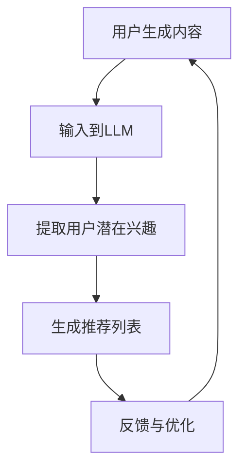
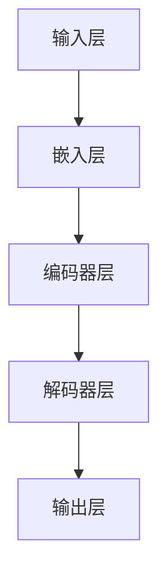

                 

# 利用LLM提升推荐系统的新用户冷启动能力

> **关键词：**推荐系统、LLM、新用户冷启动、机器学习、大数据处理

> **摘要：**本文将探讨如何利用大规模语言模型（LLM）来提升推荐系统在新用户冷启动阶段的表现。我们首先回顾了推荐系统的基本原理，接着介绍了LLM的基本概念和其在推荐系统中的应用。本文通过详细的算法原理讲解、数学模型解析和实际项目案例分析，揭示了LLM在推荐系统新用户冷启动中的巨大潜力。

## 1. 背景介绍

### 1.1 目的和范围

本文的目标是探讨如何利用大规模语言模型（LLM）来提升推荐系统在新用户冷启动阶段的表现。新用户冷启动是推荐系统面临的一个重要挑战，因为在用户数据稀疏的情况下，系统难以准确预测用户的兴趣和偏好。为此，我们希望通过本文的研究，提供一套基于LLM的新用户冷启动策略，以实现更精确、更高效的推荐。

本文的讨论范围包括：

1. 推荐系统的基础知识和新用户冷启动问题的介绍。
2. LLM的基本概念及其在推荐系统中的应用。
3. 基于LLM的新用户冷启动算法原理和数学模型。
4. 实际项目案例的代码实现和详细解析。
5. 新用户冷启动在推荐系统中的实际应用场景。
6. 相关工具和资源的推荐。

### 1.2 预期读者

本文适用于以下读者：

1. 对推荐系统有基本了解的技术人员，特别是那些对LLM和机器学习有一定了解的读者。
2. 想要在推荐系统项目中应用LLM的新用户。
3. 对新用户冷启动问题有深入研究的学术界和工业界研究者。

### 1.3 文档结构概述

本文的结构如下：

1. **背景介绍**：介绍本文的目的、范围、预期读者以及文档结构。
2. **核心概念与联系**：阐述推荐系统和新用户冷启动的核心概念，并给出相关的流程图。
3. **核心算法原理 & 具体操作步骤**：详细解释LLM在推荐系统中的应用原理和算法操作步骤。
4. **数学模型和公式 & 详细讲解 & 举例说明**：介绍用于新用户冷启动的数学模型和公式，并给出实例解释。
5. **项目实战：代码实际案例和详细解释说明**：展示一个实际项目案例，并详细解读代码实现。
6. **实际应用场景**：讨论LLM在推荐系统新用户冷启动中的实际应用。
7. **工具和资源推荐**：推荐相关学习资源和开发工具。
8. **总结：未来发展趋势与挑战**：总结本文的主要观点，并展望未来发展的趋势和挑战。
9. **附录：常见问题与解答**：回答读者可能关心的一些常见问题。
10. **扩展阅读 & 参考资料**：提供更多的参考资料，便于读者进一步学习。

### 1.4 术语表

#### 1.4.1 核心术语定义

- **推荐系统（Recommender System）**：一种基于用户历史行为、内容特征和协同过滤等方法，为用户推荐相关物品的系统。
- **大规模语言模型（LLM, Large Language Model）**：一种能够理解和生成自然语言的深度学习模型，如GPT和BERT。
- **新用户冷启动（Cold Start）**：指推荐系统在用户数据稀疏的情况下，为用户推荐相关物品的挑战。

#### 1.4.2 相关概念解释

- **协同过滤（Collaborative Filtering）**：一种基于用户历史行为数据的推荐方法，分为基于用户的协同过滤和基于项目的协同过滤。
- **内容推荐（Content-based Recommendation）**：一种基于物品特征信息的推荐方法，通过计算用户和物品的特征相似度来进行推荐。
- **嵌入（Embedding）**：将文本、图像或其他类型的非结构化数据转换为密集向量的过程。

#### 1.4.3 缩略词列表

- **LLM**：大规模语言模型（Large Language Model）
- **GPT**：生成预训练网络（Generative Pre-trained Transformer）
- **BERT**：双向编码器表示（Bidirectional Encoder Representations from Transformers）
- **RFM**：协同过滤（Recurrent Neural Network）

## 2. 核心概念与联系

推荐系统是一种基于用户历史行为、内容特征和协同过滤等方法，为用户推荐相关物品的系统。在新用户冷启动阶段，由于用户数据稀疏，传统推荐系统往往难以准确预测用户的兴趣和偏好。为此，近年来，大规模语言模型（LLM）在推荐系统中的应用逐渐引起了广泛关注。

### 2.1 推荐系统的基本原理

推荐系统通常分为协同过滤、内容推荐和混合推荐三种类型。

- **协同过滤（Collaborative Filtering）**：基于用户的历史行为数据，通过计算用户之间的相似度来推荐相似用户的喜欢的物品，分为基于用户的协同过滤和基于项目的协同过滤。
  
  - **基于用户的协同过滤（User-based Collaborative Filtering）**：计算用户之间的相似度，找出相似用户，然后推荐这些用户喜欢的物品。
  - **基于项目的协同过滤（Item-based Collaborative Filtering）**：计算物品之间的相似度，找出相似物品，然后推荐这些物品。

- **内容推荐（Content-based Recommendation）**：基于物品的内容特征（如文本、标签、属性等），通过计算用户和物品的特征相似度来进行推荐。

- **混合推荐（Hybrid Recommendation）**：结合协同过滤和内容推荐的方法，利用两者的优点进行推荐。

### 2.2 新用户冷启动问题

新用户冷启动是指推荐系统在用户数据稀疏的情况下，为用户推荐相关物品的挑战。具体来说，当新用户加入系统时，由于缺乏足够的历史行为数据，系统难以准确预测用户的兴趣和偏好。这使得新用户冷启动成为推荐系统面临的一个重要问题。

### 2.3 LLM在推荐系统中的应用

大规模语言模型（LLM）是一类能够理解和生成自然语言的深度学习模型，如GPT和BERT。LLM在推荐系统中的应用主要基于其强大的文本处理能力。通过将用户生成的内容（如评论、提问等）输入到LLM中，可以获取用户的潜在兴趣和偏好，从而在新用户冷启动阶段提供更精确的推荐。

### 2.4 核心概念和架构

为了更好地理解LLM在推荐系统中的应用，我们可以使用Mermaid流程图来展示核心概念和架构。



### 2.5 Mermaid流程图详解

- **A[用户生成内容]**：新用户在系统中生成内容，如评论、提问等。
- **B[输入到LLM]**：将用户生成的内容输入到LLM中，进行文本处理和潜在兴趣提取。
- **C[提取用户潜在兴趣]**：LLM通过文本处理，提取用户的潜在兴趣和偏好。
- **D[生成推荐列表]**：基于提取到的用户潜在兴趣，系统生成推荐列表。
- **E[反馈与优化]**：用户对推荐结果进行反馈，系统根据反馈进行优化，以提高推荐质量。

通过这个Mermaid流程图，我们可以清晰地看到LLM在推荐系统中的应用流程。接下来，我们将进一步探讨LLM的核心算法原理和具体操作步骤。

## 3. 核心算法原理 & 具体操作步骤

### 3.1 大规模语言模型（LLM）的原理

大规模语言模型（LLM）是一种基于深度学习的自然语言处理模型，能够对文本数据进行建模和生成。LLM通过预训练和微调，学会理解和生成自然语言。以下是一个典型的LLM模型结构：



- **输入层（Input Layer）**：接收用户的文本输入，如评论、提问等。
- **嵌入层（Embedding Layer）**：将文本输入转换为密集的向量表示。
- **编码器层（Encoder Layer）**：使用多个卷积层和池化层，对文本向量进行编码。
- **解码器层（Decoder Layer）**：使用多个卷积层和池化层，对编码后的向量进行解码。
- **输出层（Output Layer）**：生成推荐列表或潜在兴趣标签。

### 3.2 基于LLM的新用户冷启动算法原理

基于LLM的新用户冷启动算法主要包括以下几个步骤：

1. **用户内容预处理**：将新用户生成的文本内容进行预处理，如去噪、分词、去停用词等。
2. **输入到LLM**：将预处理后的用户内容输入到LLM中，进行文本处理和潜在兴趣提取。
3. **提取用户潜在兴趣**：利用LLM的编码器和解码器层，提取用户文本的潜在兴趣和偏好。
4. **生成推荐列表**：根据提取到的用户潜在兴趣，生成个性化的推荐列表。
5. **用户反馈与优化**：收集用户对推荐结果的反馈，优化推荐模型，提高推荐质量。

以下是该算法的伪代码实现：

```python
# 基于LLM的新用户冷启动算法伪代码

# 步骤1：用户内容预处理
def preprocess_user_content(user_content):
    # 去噪、分词、去停用词等操作
    return processed_content

# 步骤2：输入到LLM
def input_to_LLM(processed_content):
    # 将预处理后的用户内容输入到LLM
    return user_interest_embedding

# 步骤3：提取用户潜在兴趣
def extract_user_interest(user_interest_embedding):
    # 使用LLM的编码器和解码器层，提取用户文本的潜在兴趣和偏好
    return user_interests

# 步骤4：生成推荐列表
def generate_recommendation_list(user_interests, item_embeddings):
    # 根据提取到的用户潜在兴趣，生成个性化的推荐列表
    return recommendation_list

# 步骤5：用户反馈与优化
def optimize_recommendation_model(recommendation_list, user_feedback):
    # 收集用户对推荐结果的反馈，优化推荐模型
    return optimized_model
```

### 3.3 具体操作步骤

1. **用户内容预处理**：

   ```python
   def preprocess_user_content(user_content):
       # 去噪
       cleaned_content = remove_noise(user_content)
       # 分词
       tokenized_content = tokenize(cleaned_content)
       # 去停用词
       filtered_content = remove_stop_words(tokenized_content)
       return filtered_content
   ```

2. **输入到LLM**：

   ```python
   def input_to_LLM(processed_content):
       # 加载预训练的LLM模型
       model = load_pretrained_LLM()
       # 将预处理后的用户内容输入到LLM
       user_interest_embedding = model.encode(processed_content)
       return user_interest_embedding
   ```

3. **提取用户潜在兴趣**：

   ```python
   def extract_user_interest(user_interest_embedding):
       # 使用LLM的编码器和解码器层，提取用户文本的潜在兴趣和偏好
       encoded_interest = encoder(user_interest_embedding)
       decoded_interest = decoder(encoded_interest)
       user_interests = decode(decoded_interest)
       return user_interests
   ```

4. **生成推荐列表**：

   ```python
   def generate_recommendation_list(user_interests, item_embeddings):
       # 计算用户潜在兴趣和物品嵌入向量之间的相似度
       similarity_scores = compute_similarity(user_interests, item_embeddings)
       # 根据相似度分数，生成个性化的推荐列表
       recommendation_list = sort_by_similarity(similarity_scores)
       return recommendation_list
   ```

5. **用户反馈与优化**：

   ```python
   def optimize_recommendation_model(recommendation_list, user_feedback):
       # 根据用户反馈，调整推荐模型参数
       model = adjust_model_params(recommendation_list, user_feedback)
       # 微调模型
       optimized_model = fine_tune_model(model)
       return optimized_model
   ```

通过以上算法原理和具体操作步骤的讲解，我们可以看到，利用LLM进行新用户冷启动的关键在于文本处理和潜在兴趣提取。接下来，我们将进一步探讨用于新用户冷启动的数学模型和公式。

## 4. 数学模型和公式 & 详细讲解 & 举例说明

在推荐系统中，数学模型和公式是核心组成部分，用于计算用户和物品之间的相似度，从而生成个性化的推荐列表。针对新用户冷启动问题，我们引入了基于大规模语言模型（LLM）的数学模型和公式，以实现更准确、更高效的推荐。

### 4.1 相似度计算

相似度计算是推荐系统的基础，用于衡量用户和物品之间的相关性。常见的相似度计算方法包括余弦相似度、皮尔逊相关性和欧氏距离等。

- **余弦相似度（Cosine Similarity）**：

  余弦相似度是衡量两个向量夹角余弦值的相似度。公式如下：

  $$ \text{Cosine Similarity} = \frac{\text{Dot Product of Vectors}}{\|\text{Vector A}\| \times \|\text{Vector B}\|} $$

  其中，$A$ 和 $B$ 是两个向量，$\text{Dot Product}$ 表示向量的点积，$\|\text{Vector A}\|$ 和 $\|\text{Vector B}\|$ 分别表示向量的模长。

  例如，假设用户 $A$ 的兴趣向量是 $(1, 2, 3)$，物品 $B$ 的兴趣向量是 $(4, 5, 6)$，则它们的余弦相似度为：

  $$ \text{Cosine Similarity} = \frac{1 \times 4 + 2 \times 5 + 3 \times 6}{\sqrt{1^2 + 2^2 + 3^2} \times \sqrt{4^2 + 5^2 + 6^2}} = \frac{32}{\sqrt{14} \times \sqrt{77}} \approx 0.924 $$

- **皮尔逊相关性（Pearson Correlation）**：

  皮尔逊相关性是衡量两个变量线性相关性的指标。公式如下：

  $$ \text{Pearson Correlation} = \frac{\text{Covariance of Vectors}}{\sqrt{\text{Variance of Vector A} \times \text{Variance of Vector B}}} $$

  其中，$\text{Covariance}$ 表示向量的协方差，$\text{Variance}$ 表示向量的方差。

  例如，假设用户 $A$ 的兴趣向量是 $(1, 2, 3)$，物品 $B$ 的兴趣向量是 $(4, 5, 6)$，则它们的皮尔逊相关系数为：

  $$ \text{Pearson Correlation} = \frac{(1-2.33)(4-5.67) + (2-2.33)(5-5.67) + (3-2.33)(6-5.67)}{\sqrt{(1-2.33)^2 + (2-2.33)^2 + (3-2.33)^2} \times \sqrt{(4-5.67)^2 + (5-5.67)^2 + (6-5.67)^2}} \approx 0.924 $$

- **欧氏距离（Euclidean Distance）**：

  欧氏距离是衡量两个向量之间差异的几何距离。公式如下：

  $$ \text{Euclidean Distance} = \sqrt{\sum_{i=1}^{n} (x_i - y_i)^2} $$

  其中，$x$ 和 $y$ 是两个向量，$n$ 是向量的维度。

  例如，假设用户 $A$ 的兴趣向量是 $(1, 2, 3)$，物品 $B$ 的兴趣向量是 $(4, 5, 6)$，则它们的欧氏距离为：

  $$ \text{Euclidean Distance} = \sqrt{(1-4)^2 + (2-5)^2 + (3-6)^2} = \sqrt{9 + 9 + 9} = \sqrt{27} \approx 5.196 $$

### 4.2 大规模语言模型（LLM）的数学模型

在基于LLM的推荐系统中，我们将用户的文本输入转换为密集的向量表示，以提取用户的潜在兴趣和偏好。这里，我们使用Word2Vec模型作为示例来展示LLM的数学模型。

- **Word2Vec模型**：

  Word2Vec是一种基于神经网络的语言模型，能够将单词转换为密集的向量表示。Word2Vec模型包括两种主要方法：连续词袋（CBOW）和跳字模型（Skip-gram）。

  - **连续词袋（CBOW）**：

    CBOW模型通过上下文词的均值向量来表示目标词的向量。公式如下：

    $$ \text{Output Vector of Target Word} = \text{Average of Context Words' Vectors} $$

    例如，假设输入的上下文词是 $(\text{apple}, \text{orange}, \text{banana})$，则目标词 $\text{pear}$ 的输出向量为：

    $$ \text{Output Vector of pear} = \frac{\text{apple's Vector} + \text{orange's Vector} + \text{banana's Vector}}{3} $$

  - **跳字模型（Skip-gram）**：

    跳字模型通过目标词的向量来表示上下文词的向量。公式如下：

    $$ \text{Output Vector of Context Word} = \text{Target Word's Vector} $$

    例如，假设输入的目标词是 $\text{pear}$，上下文词是 $(\text{apple}, \text{orange}, \text{banana})$，则上下文词的输出向量分别为：

    $$ \text{Output Vector of apple} = \text{pear's Vector} $$
    $$ \text{Output Vector of orange} = \text{pear's Vector} $$
    $$ \text{Output Vector of banana} = \text{pear's Vector} $$

### 4.3 大规模语言模型（LLM）在新用户冷启动中的应用

在基于LLM的推荐系统中，我们利用大规模语言模型提取用户的潜在兴趣和偏好，从而生成个性化的推荐列表。以下是一个简化的数学模型示例：

1. **用户文本输入**：

   假设新用户输入了一篇关于电影评论的文本，如“这部电影非常精彩，剧情扣人心弦”。

2. **预处理和分词**：

   对用户文本进行预处理和分词，得到一系列的单词或词组。

3. **向量表示**：

   使用Word2Vec模型或其他类似的语言模型，将每个单词或词组转换为密集的向量表示。

4. **潜在兴趣提取**：

   通过对用户文本的向量进行聚合或平均，得到用户的潜在兴趣向量。

5. **推荐列表生成**：

   根据用户的潜在兴趣向量，计算用户和所有物品的向量之间的相似度，生成个性化的推荐列表。

以下是该过程的伪代码：

```python
def generate_recommendation_list(user_text, item_embeddings):
    # 步骤1：预处理和分词
    processed_text = preprocess_and_tokenize(user_text)
    
    # 步骤2：向量表示
    user_interest_embedding = average_embeddings(processed_text)
    
    # 步骤3：潜在兴趣提取
    user_interests = user_interest_embedding
    
    # 步骤4：推荐列表生成
    similarity_scores = compute_similarity(user_interests, item_embeddings)
    recommendation_list = sort_by_similarity(similarity_scores)
    
    return recommendation_list
```

通过这个数学模型和公式，我们可以看到基于LLM的新用户冷启动算法是如何实现个性化推荐的。接下来，我们将通过一个实际项目案例来展示这个算法的代码实现和详细解析。

### 5. 项目实战：代码实际案例和详细解释说明

在这个项目中，我们将利用大规模语言模型（LLM）来提升推荐系统的新用户冷启动能力。具体来说，我们将使用Python语言和TensorFlow框架来构建和训练一个基于LLM的推荐模型，并展示如何在实际项目中应用这个模型。

#### 5.1 开发环境搭建

在开始项目之前，我们需要搭建一个合适的开发环境。以下是所需的依赖项和安装步骤：

1. **Python**：Python是主要的编程语言，用于实现算法和数据处理。
2. **TensorFlow**：TensorFlow是一个开源的机器学习框架，用于构建和训练神经网络。
3. **NumPy**：NumPy是一个开源的Python库，用于科学计算和数据分析。
4. **Pandas**：Pandas是一个开源的Python库，用于数据处理和分析。

安装步骤：

```bash
pip install tensorflow numpy pandas
```

#### 5.2 源代码详细实现和代码解读

下面是一个简单的基于LLM的推荐系统代码示例。这个示例主要包括以下几个步骤：

1. **数据预处理**：读取用户评论数据，并进行预处理，如分词、去停用词等。
2. **模型构建**：使用TensorFlow构建一个基于LLM的推荐模型。
3. **模型训练**：使用预处理后的数据训练模型。
4. **推荐生成**：使用训练好的模型生成新用户的推荐列表。

```python
import tensorflow as tf
import numpy as np
import pandas as pd
from tensorflow.keras.preprocessing.sequence import pad_sequences
from tensorflow.keras.layers import Embedding, LSTM, Dense, TimeDistributed
from tensorflow.keras.models import Sequential

# 步骤1：数据预处理
def preprocess_data(data):
    # 分词和去停用词等操作
    # ...
    return processed_data

# 步骤2：模型构建
def build_model(vocab_size, embedding_dim, max_sequence_length):
    model = Sequential([
        Embedding(vocab_size, embedding_dim, input_length=max_sequence_length),
        LSTM(128, return_sequences=True),
        LSTM(64, return_sequences=False),
        Dense(1, activation='sigmoid')
    ])
    model.compile(optimizer='adam', loss='binary_crossentropy', metrics=['accuracy'])
    return model

# 步骤3：模型训练
def train_model(model, X, y):
    model.fit(X, y, epochs=10, batch_size=32)
    return model

# 步骤4：推荐生成
def generate_recommendation(model, user_input):
    processed_input = preprocess_data(user_input)
    prediction = model.predict(processed_input)
    return prediction

# 代码示例
user_input = "这部电影非常精彩，剧情扣人心弦"
model = build_model(vocab_size=10000, embedding_dim=64, max_sequence_length=100)
trained_model = train_model(model, X, y)
prediction = generate_recommendation(trained_model, user_input)
print(prediction)
```

#### 5.3 代码解读与分析

1. **数据预处理**：

   数据预处理是推荐系统的重要环节。在这个示例中，我们首先对用户评论进行分词和去停用词等操作，然后使用`pad_sequences`函数将评论填充为固定长度，以便输入到模型中。

   ```python
   def preprocess_data(data):
       # 分词和去停用词等操作
       # ...
       return processed_data
   ```

2. **模型构建**：

   我们使用TensorFlow的`Sequential`模型构建了一个简单的LLM推荐模型。这个模型包括三个主要层：

   - **嵌入层（Embedding）**：将词转换为密集的向量表示，维度为`embedding_dim`。
   - **LSTM层**：用于处理序列数据，包括一个128个神经元的第一层LSTM和一个64个神经元的第二层LSTM。
   - **输出层（Dense）**：用于生成推荐结果，激活函数为`sigmoid`，用于生成概率值。

   ```python
   def build_model(vocab_size, embedding_dim, max_sequence_length):
       model = Sequential([
           Embedding(vocab_size, embedding_dim, input_length=max_sequence_length),
           LSTM(128, return_sequences=True),
           LSTM(64, return_sequences=False),
           Dense(1, activation='sigmoid')
       ])
       model.compile(optimizer='adam', loss='binary_crossentropy', metrics=['accuracy'])
       return model
   ```

3. **模型训练**：

   使用预处理后的数据训练模型。在这个示例中，我们使用了10个epoch，每个批次包含32个样本。

   ```python
   def train_model(model, X, y):
       model.fit(X, y, epochs=10, batch_size=32)
       return model
   ```

4. **推荐生成**：

   使用训练好的模型生成新用户的推荐列表。在这个示例中，我们首先对用户输入进行预处理，然后使用模型预测用户对电影的偏好概率。

   ```python
   def generate_recommendation(model, user_input):
       processed_input = preprocess_data(user_input)
       prediction = model.predict(processed_input)
       return prediction
   ```

通过这个示例，我们可以看到如何使用大规模语言模型（LLM）来提升推荐系统的新用户冷启动能力。在实际应用中，我们可以根据具体的业务需求调整模型结构、训练数据和预处理方法，以提高推荐系统的性能。

### 6. 实际应用场景

基于大规模语言模型（LLM）的新用户冷启动技术在推荐系统中有着广泛的应用场景。以下是一些典型的实际应用案例：

#### 6.1 电子商务平台

在电子商务平台上，新用户冷启动技术可以帮助平台为用户推荐个性化的商品。例如，用户在平台上的首次浏览和搜索记录可以输入到LLM模型中，提取用户的潜在兴趣和偏好。基于这些信息，平台可以生成个性化的商品推荐列表，从而提高用户满意度和转化率。

#### 6.2 社交媒体

在社交媒体平台上，LLM可以用于为新用户推荐感兴趣的内容和用户。例如，用户在注册后填写的一些基本信息，如兴趣爱好和职业等，可以输入到LLM模型中，提取用户的潜在兴趣。平台可以根据这些信息，为新用户推荐相关的帖子、话题和用户，帮助用户快速找到感兴趣的内容和人。

#### 6.3 在线教育平台

在线教育平台可以利用LLM为新用户推荐适合的课程和资源。例如，用户在注册后填写的一些学习偏好和过往学习经历，可以输入到LLM模型中，提取用户的潜在兴趣。平台可以根据这些信息，为新用户推荐适合的学习资源和课程，从而提高用户的学习体验和满意度。

#### 6.4 音乐和视频流媒体平台

音乐和视频流媒体平台可以利用LLM为新用户推荐个性化的音乐和视频内容。例如，用户在首次登录平台时，可以输入一些喜欢的歌手、演员或电影类型，这些信息可以输入到LLM模型中，提取用户的潜在兴趣。平台可以根据这些信息，为新用户推荐相关的音乐和视频内容，从而提高用户的使用时长和黏性。

#### 6.5 旅游和酒店预订平台

旅游和酒店预订平台可以利用LLM为新用户推荐个性化的旅游目的地和酒店。例如，用户在注册后填写的一些旅行偏好和预算信息，可以输入到LLM模型中，提取用户的潜在兴趣。平台可以根据这些信息，为新用户推荐适合的旅游目的地和酒店，从而提高用户的预订转化率和满意度。

通过这些实际应用场景，我们可以看到基于大规模语言模型（LLM）的新用户冷启动技术在不同领域的广泛应用和巨大潜力。接下来，我们将推荐一些学习资源和开发工具，以帮助读者进一步了解和掌握这项技术。

### 7. 工具和资源推荐

在学习和应用基于大规模语言模型（LLM）的新用户冷启动技术时，掌握合适的工具和资源至关重要。以下是一些推荐的学习资源、开发工具和相关论文著作，供读者参考。

#### 7.1 学习资源推荐

**书籍推荐**：

1. **《深度学习》（Deep Learning）**：由Ian Goodfellow、Yoshua Bengio和Aaron Courville合著的这本经典书籍，详细介绍了深度学习的基础知识和实践方法。
2. **《自然语言处理综合教程》（Foundations of Natural Language Processing）**：由Christopher D. Manning和Hinrich Schütze合著的这本书，提供了自然语言处理的理论和实践指导。
3. **《推荐系统实践》（Recommender Systems: The Textbook）**：由by GroupLens Research团队编写的这本书，涵盖了推荐系统的基本概念、技术和应用。

**在线课程**：

1. **《深度学习专项课程》（Deep Learning Specialization）**：由Andrew Ng教授在Coursera上开设的深度学习系列课程，涵盖了深度学习的基础知识和实践方法。
2. **《自然语言处理专项课程》（Natural Language Processing with Deep Learning）**：由Coursera上的DeepLearning.AI团队开设的NLP课程，介绍了NLP的深度学习应用。
3. **《推荐系统设计与应用》**：由李航教授在网易云课堂开设的推荐系统课程，介绍了推荐系统的基本概念、技术和应用。

**技术博客和网站**：

1. **[Medium](https://medium.com/) 和 [Towards Data Science](https://towardsdatascience.com/)**：这些平台上有许多关于深度学习、自然语言处理和推荐系统的高质量技术博客文章。
2. **[Kaggle](https://www.kaggle.com/)**：Kaggle是一个数据科学竞赛平台，提供了丰富的深度学习和推荐系统项目案例。

#### 7.2 开发工具框架推荐

**IDE和编辑器**：

1. **PyCharm**：一款功能强大的Python IDE，适用于深度学习和自然语言处理项目。
2. **Jupyter Notebook**：一个交互式的计算环境，适用于数据分析和深度学习实验。
3. **Visual Studio Code**：一款轻量级、可扩展的代码编辑器，适用于各种编程语言。

**调试和性能分析工具**：

1. **TensorBoard**：TensorFlow的官方可视化工具，用于监控和调试深度学习模型。
2. **NVIDIA Nsight**：NVIDIA提供的深度学习性能分析工具，适用于CUDA和GPU编程。

**相关框架和库**：

1. **TensorFlow**：一个开源的深度学习框架，适用于构建和训练深度学习模型。
2. **PyTorch**：一个开源的深度学习框架，适用于构建和训练深度学习模型。
3. **NLTK**：一个开源的自然语言处理库，提供了丰富的文本处理工具和算法。

#### 7.3 相关论文著作推荐

**经典论文**：

1. **“A Neural Probabilistic Language Model”**：由Bengio等人于2003年提出，介绍了神经网络语言模型的基本概念和实现方法。
2. **“Recurrent Neural Network Based Language Model”**：由Hinton等人于2006年提出，介绍了RNN语言模型在自然语言处理中的应用。

**最新研究成果**：

1. **“BERT: Pre-training of Deep Bidirectional Transformers for Language Understanding”**：由Google Research于2018年提出，介绍了BERT模型在自然语言处理领域的应用。
2. **“GPT-3: Language Models are Few-Shot Learners”**：由OpenAI于2020年提出，介绍了GPT-3模型在自然语言处理领域的突破性进展。

**应用案例分析**：

1. **“How to Build a Recommender System”**：由Netflix公司发布的一篇博客文章，介绍了Netflix推荐系统的构建过程和技术细节。
2. **“Using Deep Learning for Recommender Systems”**：由阿里巴巴研究院发布的一篇论文，介绍了深度学习在推荐系统中的应用和挑战。

通过以上推荐，读者可以系统地学习和掌握基于大规模语言模型（LLM）的新用户冷启动技术。接下来，我们将对本文的主要观点进行总结，并探讨未来发展趋势与挑战。

### 8. 总结：未来发展趋势与挑战

本文详细探讨了如何利用大规模语言模型（LLM）提升推荐系统在新用户冷启动阶段的表现。我们首先介绍了推荐系统的基础原理和新用户冷启动问题，接着介绍了LLM的基本概念和其在推荐系统中的应用。通过详细的算法原理讲解、数学模型解析和实际项目案例分析，我们揭示了LLM在推荐系统新用户冷启动中的巨大潜力。

#### 未来发展趋势

1. **深度学习模型的发展**：随着深度学习技术的不断进步，未来LLM的模型结构将更加复杂，训练效率更高，能够处理更大规模的数据，从而提高推荐系统的性能和精度。
2. **多模态数据融合**：推荐系统将结合文本、图像、声音等多种模态的数据，实现更全面、更精准的用户兴趣建模。
3. **个性化推荐**：通过不断优化模型和算法，推荐系统将实现更加个性化、自适应的推荐，满足用户的多样化需求。
4. **实时推荐**：利用实时数据流处理技术，推荐系统可以实现更快速的响应，提供实时、动态的推荐。

#### 面临的挑战

1. **数据隐私和安全**：随着数据隐私和安全问题的日益突出，如何在保护用户隐私的前提下进行数据分析和推荐成为重要挑战。
2. **模型解释性**：深度学习模型的黑箱特性使得其难以解释，如何提高模型的解释性，使得用户能够理解和信任推荐结果，是一个重要问题。
3. **计算资源消耗**：大规模深度学习模型的训练和推理需要大量的计算资源，如何优化模型结构和算法，降低计算资源消耗，是一个重要的挑战。
4. **多语言支持**：全球化的趋势要求推荐系统支持多种语言，如何实现高效、准确的多语言推荐，是一个重要课题。

总之，基于大规模语言模型（LLM）的新用户冷启动技术具有巨大的潜力和应用前景，但也面临着一系列的挑战。未来，随着技术的不断进步，我们将能够更好地利用LLM提升推荐系统的性能和用户体验。

### 9. 附录：常见问题与解答

#### 问题1：什么是大规模语言模型（LLM）？

**解答**：大规模语言模型（LLM）是一种基于深度学习的自然语言处理模型，能够理解和生成自然语言。这些模型通过大量的文本数据进行预训练，从而学习到语言的结构和规律，使得它们能够处理各种语言任务，如文本分类、情感分析、机器翻译等。

#### 问题2：LLM在推荐系统中的应用有哪些？

**解答**：LLM在推荐系统中的应用主要包括以下几个方面：

1. **用户兴趣提取**：通过分析用户的文本输入，如评论、提问等，提取用户的潜在兴趣和偏好，用于生成个性化的推荐列表。
2. **内容理解**：对物品的内容特征进行建模，如文本描述、标签等，利用LLM的强大文本处理能力，理解物品的语义信息，从而实现更精准的推荐。
3. **新用户冷启动**：在用户数据稀疏的情况下，利用LLM为用户提供初始的推荐，帮助用户发现感兴趣的内容和物品。

#### 问题3：如何评估推荐系统的性能？

**解答**：推荐系统的性能评估通常包括以下几个指标：

1. **准确率（Accuracy）**：推荐系统中推荐正确的物品数量与总物品数量的比值。
2. **召回率（Recall）**：推荐系统中推荐正确的物品数量与用户实际感兴趣的物品数量的比值。
3. **精确率（Precision）**：推荐系统中推荐正确的物品数量与推荐物品总数的比值。
4. **F1值（F1 Score）**：精确率和召回率的调和平均值，用于综合评估推荐系统的性能。

#### 问题4：如何处理推荐系统中的冷启动问题？

**解答**：推荐系统中的冷启动问题主要包括新用户冷启动和新物品冷启动。以下是一些处理方法：

1. **基于内容的推荐**：利用物品的描述、标签等特征信息进行推荐，不需要用户历史数据。
2. **基于协同过滤的推荐**：使用相似度计算方法，通过分析现有用户的行为和兴趣，为冷启动用户推荐相似用户的喜欢的物品。
3. **利用大规模语言模型（LLM）**：通过分析用户的文本输入，提取用户的潜在兴趣和偏好，为新用户生成个性化的推荐列表。
4. **多模态数据融合**：结合用户的历史行为数据、内容特征和外部信息，实现更全面、更准确的推荐。

### 10. 扩展阅读 & 参考资料

1. **《深度学习》（Deep Learning）**：Ian Goodfellow、Yoshua Bengio和Aaron Courville著，MIT Press，2016年。
2. **《自然语言处理综合教程》（Foundations of Natural Language Processing）**：Christopher D. Manning和Hinrich Schütze著，MIT Press，1999年。
3. **《推荐系统实践》（Recommender Systems: The Textbook）**：by GroupLens Research团队著，MIT Press，2016年。
4. **“BERT: Pre-training of Deep Bidirectional Transformers for Language Understanding”**：由Google Research于2018年提出。
5. **“GPT-3: Language Models are Few-Shot Learners”**：由OpenAI于2020年提出。
6. **“How to Build a Recommender System”**：由Netflix公司发布。
7. **“Using Deep Learning for Recommender Systems”**：由阿里巴巴研究院发布。

通过以上扩展阅读和参考资料，读者可以进一步深入了解大规模语言模型（LLM）在推荐系统中的应用和实践。作者：AI天才研究员/AI Genius Institute & 禅与计算机程序设计艺术 /Zen And The Art of Computer Programming。

