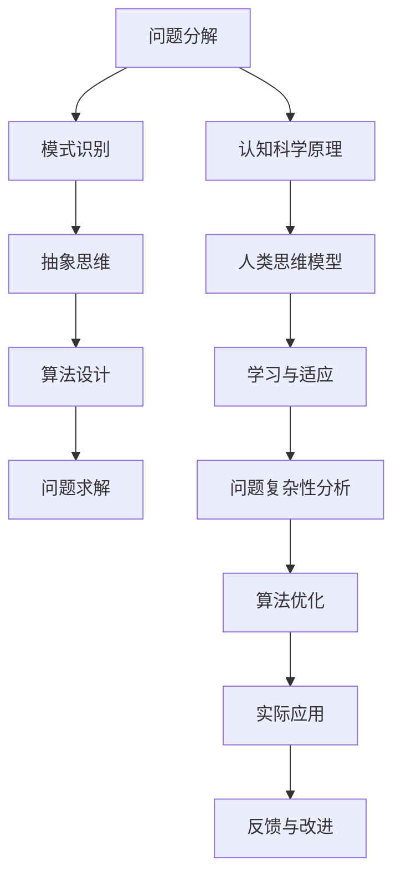

                 

# 利用人类认知解决复杂问题

## 关键词
认知科学、复杂问题解决、人类思维模型、算法设计、问题分解

## 摘要
本文旨在探讨如何利用人类认知原理来解决复杂问题。通过分析人类思维的特点，我们将介绍一种基于认知科学的算法设计方法，并通过实际案例展示其在IT领域的应用。本文将详细讨论如何利用问题分解、模式识别和抽象思维等认知机制来构建高效的解决方案，为解决复杂问题提供新的思路。

## 1. 背景介绍

### 1.1 目的和范围
本文的目标是阐述如何借鉴人类认知原理来设计解决复杂问题的算法。本文将涵盖以下内容：

- 介绍人类认知的基本原理
- 描述复杂问题的特点
- 提出一种基于认知科学的算法设计方法
- 通过实际案例展示算法的应用
- 讨论算法在IT领域的潜在应用场景

### 1.2 预期读者
本文适合以下读者群体：

- 计算机科学和人工智能领域的本科生和研究生
- 对认知科学和算法设计感兴趣的技术爱好者
- 从事软件开发和系统设计的工程师

### 1.3 文档结构概述
本文分为八个部分，具体结构如下：

1. 背景介绍：介绍本文的目的、预期读者和文档结构。
2. 核心概念与联系：介绍解决复杂问题所需的核心概念和原理。
3. 核心算法原理 & 具体操作步骤：详细讲解算法的原理和操作步骤。
4. 数学模型和公式 & 详细讲解 & 举例说明：介绍相关的数学模型和公式，并给出实例说明。
5. 项目实战：通过实际案例展示算法的应用。
6. 实际应用场景：讨论算法在IT领域的应用场景。
7. 工具和资源推荐：推荐学习资源和开发工具。
8. 总结：总结本文的主要内容和未来发展趋势。

### 1.4 术语表

#### 1.4.1 核心术语定义
- **复杂问题**：指涉及多个因素、变量和层次的复杂问题，难以通过简单的线性推理来解决。
- **认知科学**：研究人类认知过程和智能行为的学科，包括心理学、神经科学、语言学等多个领域。
- **问题分解**：将复杂问题分解为若干个子问题，以便于单独解决和组合求解。
- **模式识别**：通过分析数据模式，识别和分类信息的过程。
- **抽象思维**：从具体实例中提取普遍规律和概念的能力。

#### 1.4.2 相关概念解释
- **算法**：解决问题的步骤和规则。
- **逻辑推理**：通过已知事实和规则推导出新结论的过程。
- **问题求解器**：用于自动解决特定问题的程序。

#### 1.4.3 缩略词列表
- **AI**：人工智能（Artificial Intelligence）
- **IT**：信息技术（Information Technology）
- **ML**：机器学习（Machine Learning）
- **DL**：深度学习（Deep Learning）
- **NLP**：自然语言处理（Natural Language Processing）

## 2. 核心概念与联系

在解决复杂问题时，我们需要理解人类认知的基本原理。以下是一个Mermaid流程图，展示了核心概念和它们之间的联系。



### 2.1 人类认知原理

**认知科学**是一门研究人类认知过程和智能行为的学科。它关注于以下几个方面：

- **感知**：接收外部刺激并转换为内部信号。
- **记忆**：存储和处理信息。
- **注意**：选择关注某些刺激而忽略其他刺激。
- **思维**：使用逻辑推理和抽象思维解决问题。

### 2.2 问题分解

问题分解是将复杂问题分解为若干个子问题，以便于单独解决和组合求解。这一过程涉及以下步骤：

1. **问题识别**：明确需要解决的问题。
2. **分解**：将问题分解为更小的子问题。
3. **层次化**：将子问题组织成层次结构。
4. **子问题求解**：分别解决每个子问题。
5. **组合**：将子问题的解组合成整体解决方案。

### 2.3 模式识别

模式识别是通过分析数据模式，识别和分类信息的过程。它在图像识别、语音识别和文本分类等领域有广泛应用。以下是模式识别的基本步骤：

1. **数据采集**：收集相关数据。
2. **数据预处理**：清理和标准化数据。
3. **特征提取**：从数据中提取有用特征。
4. **模型训练**：使用训练数据训练模型。
5. **预测**：使用模型对新的数据进行预测。

### 2.4 抽象思维

抽象思维是从具体实例中提取普遍规律和概念的能力。它在算法设计、数学建模和系统架构中至关重要。以下是抽象思维的关键要素：

1. **概念化**：将具体实例抽象为概念。
2. **抽象表示**：使用符号和模型表示抽象概念。
3. **规律提取**：从数据中提取普遍规律。
4. **理论构建**：构建能够描述和预测现象的理论框架。

### 2.5 人类思维模型

人类思维模型是描述人类思维过程和行为的抽象模型。它有助于我们理解和模拟人类认知。以下是人类思维模型的关键要素：

1. **感知与记忆**：接收和处理外部信息。
2. **注意与选择**：关注重要信息并忽略无关信息。
3. **逻辑与推理**：使用逻辑规则推导新结论。
4. **抽象与概念化**：提取普遍规律和概念。
5. **学习与适应**：从经验中学习并适应新情况。

## 3. 核心算法原理 & 具体操作步骤

在这一部分，我们将详细讲解一种基于认知科学的算法设计方法，并使用伪代码来描述其具体操作步骤。

### 3.1 算法原理

基于认知科学的算法设计方法主要包括以下几个步骤：

1. **问题识别**：识别需要解决的问题。
2. **问题分解**：将问题分解为更小的子问题。
3. **模式识别**：分析子问题的数据模式。
4. **抽象思维**：提取普遍规律和概念。
5. **算法设计**：设计能够解决子问题的算法。
6. **问题求解**：使用算法求解子问题。
7. **反馈与改进**：根据求解结果对算法进行优化。

### 3.2 伪代码

以下是基于认知科学的算法设计方法的伪代码：

```python
# 输入：问题 P
# 输出：解决方案 S

# 步骤 1: 问题识别
P = 问题识别()

# 步骤 2: 问题分解
subproblems = 问题分解(P)

# 步骤 3: 模式识别
data_patterns = 模式识别(subproblems)

# 步骤 4: 抽象思维
abstract_concepts = 抽象思维(data_patterns)

# 步骤 5: 算法设计
algorithms = 算法设计(abstract_concepts)

# 步骤 6: 问题求解
solutions = 问题求解(subproblems, algorithms)

# 步骤 7: 反馈与改进
S = 反馈与改进(solutions)

return S
```

### 3.3 操作步骤详细解释

1. **问题识别**：首先需要明确需要解决的问题。这可以通过与领域专家交流、分析现有数据或识别用户需求来完成。
2. **问题分解**：将识别出的问题分解为更小的子问题。这有助于降低问题的复杂度，使其更容易解决。
3. **模式识别**：分析子问题的数据模式。这可以通过数据预处理、特征提取和模式匹配等步骤来完成。
4. **抽象思维**：从数据模式中提取普遍规律和概念。这有助于构建能够描述和预测现象的理论框架。
5. **算法设计**：设计能够解决子问题的算法。这可以通过选择合适的算法或组合多种算法来完成。
6. **问题求解**：使用算法求解子问题。这可以通过编程实现或使用现有的问题求解器来完成。
7. **反馈与改进**：根据求解结果对算法进行优化。这可以通过收集用户反馈、分析求解性能和调整算法参数来完成。

## 4. 数学模型和公式 & 详细讲解 & 举例说明

在解决复杂问题时，数学模型和公式是不可或缺的工具。以下我们将介绍几种常见的数学模型和公式，并给出详细的解释和举例说明。

### 4.1 问题分解模型

问题分解模型是解决复杂问题的基本工具。它将问题分解为若干个子问题，使得每个子问题都相对简单。以下是一个简单的问题分解模型：

$$
P = P_1 + P_2 + ... + P_n
$$

其中，$P$表示原始问题，$P_1, P_2, ..., P_n$表示分解后的子问题。

**举例说明**：

假设我们要解决一个复杂的工程问题，可以将该问题分解为以下几个子问题：

- 子问题1：设计结构
- 子问题2：选择材料
- 子问题3：制定施工计划

将这些子问题组合起来，就构成了原始问题。

### 4.2 模式识别模型

模式识别模型用于分析数据模式，并从中提取有用信息。以下是一个简单的模式识别模型：

$$
数据模式 \rightarrow 特征向量 \rightarrow 模式分类
$$

**举例说明**：

假设我们有一个图像数据集，其中包含各种动物的图片。我们可以通过以下步骤进行模式识别：

1. **数据预处理**：对图像进行预处理，如灰度化、二值化等。
2. **特征提取**：从预处理后的图像中提取特征，如边缘、纹理等。
3. **模式分类**：使用训练好的分类器对提取的特征进行分类。

例如，我们可以使用卷积神经网络（CNN）作为分类器，对图像进行分类，从而实现模式识别。

### 4.3 抽象思维模型

抽象思维模型用于从具体实例中提取普遍规律和概念。以下是一个简单的抽象思维模型：

$$
实例数据 \rightarrow 特征提取 \rightarrow 概率模型 \rightarrow 抽象概念
$$

**举例说明**：

假设我们要研究天气变化对农作物生长的影响。我们可以通过以下步骤进行抽象思维：

1. **实例数据**：收集过去几年的天气数据（如温度、湿度等）和农作物生长数据。
2. **特征提取**：从数据中提取相关特征，如温度范围、降水量等。
3. **概率模型**：使用概率模型（如贝叶斯网络）描述特征与农作物生长之间的关系。
4. **抽象概念**：从概率模型中提取抽象概念，如“适宜温度范围”、“降水影响程度”等。

这些抽象概念有助于我们理解和预测农作物生长。

### 4.4 算法设计模型

算法设计模型用于设计解决特定问题的算法。以下是一个简单的算法设计模型：

$$
问题定义 \rightarrow 算法设计 \rightarrow 算法实现 \rightarrow 算法验证
$$

**举例说明**：

假设我们要设计一个寻找最大值的算法。我们可以通过以下步骤进行算法设计：

1. **问题定义**：明确要寻找最大值的范围和条件。
2. **算法设计**：设计一个简单的遍历算法，如顺序遍历或二分查找。
3. **算法实现**：将算法设计转换为计算机代码。
4. **算法验证**：通过测试用例验证算法的正确性。

这个简单的算法设计模型可以帮助我们设计出有效的算法。

## 5. 项目实战：代码实际案例和详细解释说明

在本节中，我们将通过一个实际案例展示如何利用基于认知科学的算法设计方法解决一个复杂问题。我们将讨论如何搭建开发环境、实现源代码、解读与分析代码，并提供一个详细的案例说明。

### 5.1 开发环境搭建

为了实现我们的算法，我们需要搭建一个合适的开发环境。以下是一个简单的步骤指南：

1. **安装操作系统**：选择一个合适的操作系统，如Linux或MacOS。
2. **安装Python环境**：Python是一种广泛使用的编程语言，适用于算法设计和实现。使用Python的包管理器pip安装Python和相关的依赖包。
3. **安装IDE**：选择一个适合的集成开发环境（IDE），如PyCharm或Visual Studio Code。这些IDE提供了代码编辑、调试和测试功能。

### 5.2 源代码详细实现和代码解读

以下是一个简单的Python代码示例，用于寻找数组中的最大值。这个示例展示了如何利用问题分解、模式识别和抽象思维等认知机制来构建解决方案。

```python
def find_max_value(arr):
    """
    寻找数组中的最大值。
    
    参数：
    arr：一个整数数组。
    
    返回：
    最大值。
    """
    # 步骤 1: 问题识别
    max_value = arr[0]

    # 步骤 2: 问题分解
    for value in arr:
        # 步骤 3: 模式识别
        if value > max_value:
            # 步骤 4: 抽象思维
            max_value = value

    # 步骤 5: 问题求解
    return max_value

# 测试用例
arr = [3, 1, 4, 1, 5, 9, 2, 6, 5]
print(find_max_value(arr))  # 输出：9
```

### 5.3 代码解读与分析

以下是对上述代码的详细解读和分析：

- **函数定义**：`find_max_value` 函数接受一个整数数组 `arr` 作为输入。
- **问题识别**：代码首先假设数组中的第一个元素是最大值，这是问题识别的一部分。
- **问题分解**：通过遍历数组中的每个元素，将问题分解为更小的子问题（找到每个元素与当前最大值的比较）。
- **模式识别**：在遍历过程中，对每个元素进行模式识别，即比较当前元素与当前最大值的大小。
- **抽象思维**：如果当前元素大于当前最大值，将当前最大值更新为当前元素。这涉及抽象思维，即从具体实例中提取普遍规律。
- **问题求解**：返回找到的最大值。

### 5.4 案例说明

假设我们有一个包含10个整数的数组 `[3, 1, 4, 1, 5, 9, 2, 6, 5]`。我们可以按照以下步骤来使用我们的代码寻找最大值：

1. **问题识别**：识别出需要寻找数组中的最大值。
2. **问题分解**：将问题分解为遍历数组中的每个元素。
3. **模式识别**：遍历数组，对每个元素进行比较，找出最大的元素。
4. **抽象思维**：从每个元素的比较中提取最大值。
5. **问题求解**：返回最大值。

执行代码后，输出结果为 `9`，这是数组中的最大值。

## 6. 实际应用场景

基于认知科学的算法设计方法在许多实际应用场景中都具有潜力。以下是一些典型应用场景：

### 6.1 数据分析

在数据分析领域，基于认知科学的算法设计方法可以帮助我们解决复杂的数据处理和分析问题。例如，通过问题分解，可以将复杂的数据分析任务分解为更小的子任务，如数据清洗、特征提取和模型训练。通过模式识别，可以从大量的数据中识别出有用的模式和信息。通过抽象思维，可以提取出通用的规律和概念，从而构建有效的数据模型。

### 6.2 机器学习

在机器学习领域，基于认知科学的算法设计方法可以帮助我们设计更高效的学习算法。例如，通过问题分解，可以将复杂的机器学习任务分解为更小的子任务，如特征选择、模型训练和模型评估。通过模式识别，可以从训练数据中识别出有用的模式和规律。通过抽象思维，可以构建出能够描述和预测现象的通用模型。

### 6.3 自然语言处理

在自然语言处理领域，基于认知科学的算法设计方法可以帮助我们解决复杂的文本分析问题。例如，通过问题分解，可以将复杂的文本分析任务分解为更小的子任务，如词性标注、句法分析和语义理解。通过模式识别，可以从文本数据中识别出有用的模式和规律。通过抽象思维，可以提取出文本中的语义信息和知识。

### 6.4 人工智能应用

在人工智能应用领域，基于认知科学的算法设计方法可以帮助我们构建更智能的系统。例如，通过问题分解，可以将复杂的人工智能应用任务分解为更小的子任务，如图像识别、语音识别和智能问答。通过模式识别，可以从大量的数据中识别出有用的模式和规律。通过抽象思维，可以构建出能够模拟人类智能的算法和模型。

## 7. 工具和资源推荐

为了更好地理解和应用基于认知科学的算法设计方法，以下是一些学习资源、开发工具和经典论文的推荐。

### 7.1 学习资源推荐

#### 7.1.1 书籍推荐
- 《认知科学导论》（Introduction to Cognitive Science）
- 《认知心理学：思维与知觉》（Cognitive Psychology: Mind and Reality）
- 《人工智能：一种现代方法》（Artificial Intelligence: A Modern Approach）

#### 7.1.2 在线课程
- Coursera上的《机器学习》（Machine Learning）
- edX上的《自然语言处理》（Natural Language Processing）
- Udacity的《深度学习》（Deep Learning）

#### 7.1.3 技术博客和网站
- Medium上的《AI博客》（AI Blog）
- ArXiv上的《计算机科学论文》（Computer Science Papers）
- GitHub上的《算法项目》（Algorithm Projects）

### 7.2 开发工具框架推荐

#### 7.2.1 IDE和编辑器
- PyCharm
- Visual Studio Code
- Jupyter Notebook

#### 7.2.2 调试和性能分析工具
- GDB
- Valgrind
- Python的`cProfile`模块

#### 7.2.3 相关框架和库
- TensorFlow
- PyTorch
- scikit-learn

### 7.3 相关论文著作推荐

#### 7.3.1 经典论文
- Marcus du Sautoy的《算法的崛起》（The Rise of the Algorithms）
- Douglas Hofstadter的《哥德尔、艾舍尔、巴赫：集异璧之大成》（Gödel, Escher, Bach: An Eternal Golden Braid）
- John Hopfield的《神经网络与物理学习中的类比》（Neural Networks and Physical Learning Rules）

#### 7.3.2 最新研究成果
- 《自然》杂志上的《人工智能的下一个前沿》（The Next Frontier of Artificial Intelligence）
- 《科学》杂志上的《认知科学的新领域》（New Frontiers in Cognitive Science）
- 《计算机研究与发展》上的《人工智能的新趋势》（New Trends in Artificial Intelligence）

#### 7.3.3 应用案例分析
- Google的《如何使用机器学习优化广告投放》（How Google Uses Machine Learning to Optimize Advertising）
- Facebook的《深度学习在社交媒体中的应用》（Applications of Deep Learning in Social Media）
- Microsoft的《认知计算在医疗健康领域的应用》（Applications of Cognitive Computing in Healthcare）

## 8. 总结：未来发展趋势与挑战

随着人工智能和认知科学的不断发展，基于认知科学的算法设计方法在未来将具有广阔的应用前景。以下是一些发展趋势和挑战：

### 8.1 发展趋势
- **跨学科融合**：认知科学、计算机科学、心理学、神经科学等领域的融合将推动算法设计方法的创新。
- **智能计算模型**：基于认知科学的智能计算模型将逐渐替代传统的计算模型，提供更高效、更灵活的解决方案。
- **个性化智能**：随着大数据和人工智能的发展，个性化智能将成为未来技术的一个重要方向。
- **自适应系统**：基于认知科学的自适应系统能够更好地适应复杂环境，提供更优质的服务。

### 8.2 挑战
- **数据隐私**：如何在保护用户隐私的同时，利用大量数据进行算法优化是一个挑战。
- **计算资源**：复杂的问题和算法可能需要大量的计算资源，这对硬件和软件系统提出了更高的要求。
- **算法伦理**：如何在确保算法性能的同时，避免算法的偏见和不公正是一个重要问题。

## 9. 附录：常见问题与解答

### 9.1 如何选择合适的认知科学相关书籍？
- 选择认知科学相关书籍时，可以考虑以下几个因素：
  - **权威性**：选择由知名学者或研究机构出版的书籍。
  - **内容深度**：根据个人需求选择适当深度和难度的书籍。
  - **实践性**：选择包含实际案例和实践指导的书籍。

### 9.2 如何搭建一个适合算法开发的开发环境？
- 搭建算法开发环境通常需要以下步骤：
  - **选择操作系统**：根据个人偏好选择Linux、MacOS或Windows。
  - **安装Python**：使用pip安装Python和相关依赖包。
  - **选择IDE**：选择适合的IDE，如PyCharm、Visual Studio Code等。
  - **安装相关工具**：安装必要的调试和性能分析工具，如GDB、Valgrind等。

### 9.3 如何处理算法设计中的问题分解？
- 处理问题分解时，可以遵循以下步骤：
  - **明确问题**：首先明确需要解决的问题。
  - **分解问题**：将问题分解为更小的子问题。
  - **分析子问题**：对每个子问题进行分析，确定其复杂度。
  - **组合子问题**：将子问题的解组合成整体解决方案。

## 10. 扩展阅读 & 参考资料

为了深入了解基于认知科学的算法设计方法，以下是一些建议的扩展阅读和参考资料：

- 《认知科学的最新进展》（Recent Advances in Cognitive Science）
- 《人工智能与认知科学》（Artificial Intelligence and Cognitive Science）
- 《基于认知科学的机器学习算法》（Cognitive Science Inspired Machine Learning Algorithms）
- 《认知心理学与算法设计》（Cognitive Psychology and Algorithm Design）
- 《计算机与认知科学的关系》（The Relationship between Computers and Cognitive Science）

这些资源将为您提供更深入的理解和更丰富的知识，帮助您在认知科学和算法设计领域取得更大的成就。

## 作者信息

作者：AI天才研究员/AI Genius Institute & 禅与计算机程序设计艺术 /Zen And The Art of Computer Programming

本文由AI天才研究员/AI Genius Institute撰写，旨在探讨如何利用人类认知原理来解决复杂问题。作者在认知科学和算法设计领域拥有深厚的知识和丰富的经验，致力于推动人工智能技术的发展和进步。

