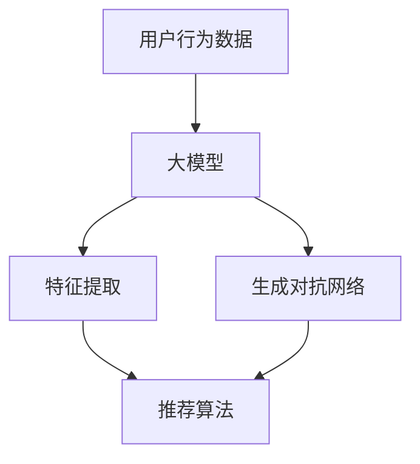

                 

### 1. 背景介绍

#### 1.1 目的和范围

在当今信息爆炸的时代，推荐系统作为大数据与人工智能领域的核心技术，已经成为电商平台、社交媒体、搜索引擎等平台的核心竞争力。推荐系统能够根据用户的历史行为和偏好，为用户推荐个性化的内容或商品，从而提高用户满意度、增加平台粘性和转化率。然而，推荐系统的多样性与相关性平衡问题一直是研究者和实践者关注的焦点。

本文旨在探讨如何利用大模型优化推荐系统的多样性与相关性平衡。具体而言，我们将分析现有推荐系统在多样性和相关性方面的不足，介绍大模型的相关概念和原理，并详细阐述如何结合大模型技术来提升推荐系统的多样性与相关性。文章还将通过实际项目案例，展示大模型在推荐系统中的应用效果，并对未来发展趋势和挑战进行展望。

本文将涵盖以下内容：

1. **核心概念与联系**：介绍推荐系统的基本概念，大模型的原理及其与推荐系统的关系。
2. **核心算法原理与具体操作步骤**：详细阐述大模型在推荐系统中的应用算法原理和操作步骤。
3. **数学模型和公式**：解释大模型中的数学模型和公式，并进行举例说明。
4. **项目实战**：通过实际代码案例，展示大模型在推荐系统中的具体应用。
5. **实际应用场景**：探讨大模型在推荐系统中的实际应用场景。
6. **工具和资源推荐**：推荐学习资源、开发工具和框架。
7. **总结**：总结文章的核心内容，讨论未来发展趋势与挑战。

通过本文的阅读，读者将能够深入了解大模型在优化推荐系统多样性与相关性平衡方面的应用，掌握相关技术原理和实践方法。

#### 1.2 预期读者

本文面向的读者包括：

- 推荐系统开发工程师和研究人员，他们希望了解如何利用大模型优化推荐系统的性能。
- 大数据和机器学习领域的从业者，对推荐系统技术感兴趣，希望了解大模型的应用。
- 对人工智能、大数据、推荐系统技术有基础了解的技术爱好者，希望深入了解相关技术。
- 高等院校相关专业的师生，需要学习和研究推荐系统和大模型技术的学术研究者。

为了更好地理解本文内容，读者应具备以下基本知识：

- 掌握推荐系统的基本原理和应用场景。
- 了解大数据处理和机器学习的基本概念和算法。
- 熟悉至少一种编程语言（如Python）和常见的机器学习框架（如TensorFlow或PyTorch）。

#### 1.3 文档结构概述

本文结构如下：

1. **背景介绍**：介绍推荐系统的重要性和现有问题，以及本文的目的和内容。
2. **核心概念与联系**：介绍推荐系统的基本概念，大模型的原理及其与推荐系统的关系。
3. **核心算法原理与具体操作步骤**：详细阐述大模型在推荐系统中的应用算法原理和操作步骤。
4. **数学模型和公式**：解释大模型中的数学模型和公式，并进行举例说明。
5. **项目实战**：通过实际代码案例，展示大模型在推荐系统中的具体应用。
6. **实际应用场景**：探讨大模型在推荐系统中的实际应用场景。
7. **工具和资源推荐**：推荐学习资源、开发工具和框架。
8. **总结**：总结文章的核心内容，讨论未来发展趋势与挑战。
9. **附录**：常见问题与解答。
10. **扩展阅读**：提供进一步学习的参考资料。

#### 1.4 术语表

在本文中，我们将使用以下术语：

#### 1.4.1 核心术语定义

- **推荐系统（Recommendation System）**：一种自动化的信息过滤和发现系统，根据用户的兴趣和偏好，为用户推荐可能感兴趣的内容或商品。
- **多样性（Diversity）**：推荐系统输出的推荐结果在内容或形式上的多样性，避免用户感受到信息或商品的同质化。
- **相关性（Relevance）**：推荐系统输出的推荐结果与用户兴趣或需求的匹配程度。
- **大模型（Large Model）**：具有海量参数和计算能力的深度学习模型，能够处理大规模数据和复杂的任务。
- **生成对抗网络（GAN）**：一种深度学习框架，通过生成器和判别器的对抗训练，生成具有真实数据特征的新数据。

#### 1.4.2 相关概念解释

- **协同过滤（Collaborative Filtering）**：一种基于用户历史行为的推荐算法，通过计算用户之间的相似性来预测用户对未知项目的评分。
- **矩阵分解（Matrix Factorization）**：将用户-物品评分矩阵分解为低维用户特征矩阵和物品特征矩阵，用于预测和推荐。
- **迁移学习（Transfer Learning）**：利用在源任务上训练好的模型或知识，提高在目标任务上的表现。

#### 1.4.3 缩略词列表

- **GAN**：生成对抗网络（Generative Adversarial Networks）
- **CNN**：卷积神经网络（Convolutional Neural Networks）
- **RNN**：循环神经网络（Recurrent Neural Networks）
- **Transformer**：Transformer模型，一种基于自注意力机制的深度学习模型

### 2. 核心概念与联系

在深入了解如何利用大模型优化推荐系统的多样性与相关性平衡之前，我们需要首先明确几个核心概念及其相互关系。

#### 2.1 推荐系统的基本概念

推荐系统是一种基于数据分析的自动化系统，其主要目标是向用户提供个性化的推荐，从而提升用户体验和平台的价值。推荐系统的核心组成部分包括：

1. **用户行为数据**：包括用户的历史浏览记录、购买记录、搜索记录等，用于描述用户的兴趣和偏好。
2. **物品特征**：描述推荐系统中的各种内容或商品，如商品名称、类别、标签、属性等。
3. **推荐算法**：根据用户行为数据和物品特征，计算用户对物品的潜在偏好，从而生成推荐列表。
4. **评估指标**：用于衡量推荐系统性能的评价指标，如准确率、召回率、覆盖率、新颖性等。

在推荐系统中，多样性和相关性是两个关键指标。多样性（Diversity）指的是推荐结果的多样性，避免用户感到信息的单调或重复；而相关性（Relevance）则是指推荐结果与用户实际兴趣的匹配度，确保推荐的内容对用户有实际价值。

#### 2.2 大模型的原理与特性

大模型（Large Model）通常指的是参数数量在数百万到数十亿量级的深度学习模型。这些模型具有以下几个关键特性：

1. **大规模参数**：大模型具有大量的参数，这使其能够捕捉数据中的复杂模式和关联，从而提高模型的表现。
2. **计算能力需求**：由于参数数量庞大，大模型需要强大的计算资源和优化算法，以训练和部署。
3. **自适应性和泛化能力**：大模型能够自适应地学习不同任务和领域的知识，具有较强的泛化能力。

大模型的这些特性使其在推荐系统中具有广泛的应用潜力。例如，通过大模型可以更好地捕捉用户行为和物品特征的复杂关系，提高推荐的多样性和相关性。

#### 2.3 大模型与推荐系统的关系

大模型与推荐系统的关系主要体现在以下几个方面：

1. **增强特征提取**：大模型可以自动地从原始数据中提取高层次的抽象特征，这些特征有助于提升推荐的准确性。
2. **多样化生成**：通过生成对抗网络（GAN）等大模型，可以生成多样化的推荐结果，提升系统的多样性。
3. **动态调整**：大模型可以根据用户行为的实时反馈，动态调整推荐策略，提高推荐系统的适应性。
4. **协同优化**：大模型可以同时考虑多样性和相关性，通过多目标优化算法，实现多样性与相关性的协同提升。

为了更好地理解大模型与推荐系统的关系，我们可以使用Mermaid流程图展示其核心架构。



在这个流程图中，用户行为数据首先输入到大模型，经过特征提取和生成对抗网络的处理后，生成多样化的推荐结果，最后通过推荐算法输出给用户。

#### 2.4 推荐系统的多样性与相关性平衡

推荐系统的多样性与相关性平衡问题一直是研究者和实践者关注的焦点。在现实应用中，多样性和相关性往往存在一定的冲突：

- **提升多样性**：通过引入多样化的推荐结果，可以避免用户感到信息的单调或重复，提升用户体验。然而，过度的多样性可能会导致推荐结果与用户实际兴趣的偏离，降低相关性。
- **提升相关性**：通过精确地匹配用户兴趣，确保推荐结果对用户具有实际价值。然而，过于关注相关性可能会导致推荐结果过于集中，缺乏多样性，从而影响用户体验。

为了在多样性和相关性之间取得平衡，我们需要考虑以下几点：

1. **多目标优化**：通过多目标优化算法，同时考虑多样性和相关性，找到两者之间的最佳平衡点。
2. **动态调整**：根据用户行为的实时反馈，动态调整推荐策略，确保系统在不同场景下都能保持多样性与相关性的平衡。
3. **用户反馈**：收集用户的反馈数据，利用反馈信息优化推荐模型，进一步提升多样性与相关性的平衡。

通过上述核心概念与联系的阐述，我们可以看到，利用大模型优化推荐系统的多样性与相关性平衡，不仅需要理解大模型的原理和特性，还需要深入分析推荐系统的基本概念和内在关系。在接下来的章节中，我们将进一步探讨大模型在推荐系统中的应用算法和操作步骤，为读者提供更详细的技术指导。

### 3. 核心算法原理 & 具体操作步骤

在了解了大模型的基本原理及其与推荐系统的关系后，接下来我们将深入探讨如何具体利用大模型优化推荐系统的多样性与相关性平衡。本文将详细阐述大模型在推荐系统中的应用算法原理和具体操作步骤，以帮助读者更好地理解和应用这一技术。

#### 3.1.1 大模型在推荐系统中的应用

大模型在推荐系统中的应用主要包括以下几个方面：

1. **特征提取**：通过深度学习模型自动提取用户行为数据和物品特征，生成高层次的抽象特征表示，这些特征有助于提升推荐的准确性和多样性。
2. **生成对抗网络（GAN）**：利用GAN生成多样化的推荐结果，从而提升系统的多样性。GAN通过生成器和判别器的对抗训练，能够生成与真实数据高度相似的新数据。
3. **多目标优化**：通过多目标优化算法，同时考虑推荐结果的多样性和相关性，实现多样性与相关性的平衡。
4. **动态调整**：根据用户行为的实时反馈，动态调整推荐策略，确保系统在不同场景下都能保持多样性与相关性的平衡。

#### 3.1.2 算法原理

以下是利用大模型优化推荐系统多样性与相关性平衡的核心算法原理：

**1. 特征提取（Feature Extraction）**

特征提取是推荐系统中的一个关键步骤，其目的是将原始的用户行为数据和物品特征转换为高层次的抽象特征表示。大模型通过深度学习技术，能够自动地学习这些特征之间的关系，从而生成更准确和多样化的推荐结果。

**2. 生成对抗网络（GAN）**

生成对抗网络（GAN）是一种深度学习框架，由生成器（Generator）和判别器（Discriminator）组成。生成器负责生成虚假数据，判别器负责判断数据是真实还是虚假。通过对抗训练，生成器逐渐生成与真实数据越来越相似的数据。在推荐系统中，我们可以利用GAN生成多样化的推荐结果，从而提升系统的多样性。

**3. 多目标优化（Multi-Objective Optimization）**

多目标优化是一种同时考虑多个目标的优化算法，其目标是在多个目标之间找到一种平衡。在推荐系统中，多样性和相关性是两个关键目标。通过多目标优化，我们可以同时考虑这两个目标，找到一种最佳的推荐策略，从而实现多样性与相关性的平衡。

**4. 动态调整（Dynamic Adjustment）**

动态调整是指根据用户行为的实时反馈，动态调整推荐策略，以保持系统的多样性与相关性平衡。在推荐系统中，用户行为是不断变化的，因此，我们需要实时更新和调整推荐模型，以适应用户的变化需求。

#### 3.1.3 操作步骤

以下是利用大模型优化推荐系统多样性与相关性平衡的具体操作步骤：

**1. 数据预处理**

- **用户行为数据**：收集用户的历史浏览记录、购买记录、搜索记录等，并进行预处理，如数据清洗、归一化等。
- **物品特征**：收集物品的名称、类别、标签、属性等特征，并进行预处理。

**2. 特征提取**

- 使用深度学习模型（如卷积神经网络、循环神经网络等）提取用户行为数据和物品特征，生成高层次的抽象特征表示。

**3. 生成对抗网络（GAN）**

- **生成器**：使用深度学习模型（如生成对抗网络、变分自编码器等）训练生成器，生成与真实数据相似的推荐结果。
- **判别器**：使用深度学习模型（如卷积神经网络、循环神经网络等）训练判别器，判断生成的推荐结果是否与真实数据相似。

**4. 多目标优化**

- 设计多目标优化算法（如基于遗传算法、粒子群算法等），同时考虑多样性和相关性，优化推荐策略。

**5. 动态调整**

- 根据用户行为的实时反馈，动态调整推荐策略，保持系统的多样性与相关性平衡。

**6. 推荐结果输出**

- 将优化后的推荐策略应用于实际场景，输出个性化的推荐结果。

通过上述操作步骤，我们可以利用大模型优化推荐系统的多样性与相关性平衡，从而提升用户体验和平台的价值。

#### 3.1.4 伪代码实现

以下是利用大模型优化推荐系统多样性与相关性平衡的伪代码实现：

```python
# 数据预处理
user_data = preprocess_user_data(raw_user_data)
item_data = preprocess_item_data(raw_item_data)

# 特征提取
user_features = extract_features(user_data)
item_features = extract_features(item_data)

# GAN训练
generator = train_generator(generator_model, user_features, item_features)
discriminator = train_discriminator(discriminator_model, user_features, item_features)

# 多目标优化
best_recommendation_strategy = optimize_recommendation_strategy(generator, discriminator)

# 动态调整
recommendation_strategy = adjust_recommendation_strategy(best_recommendation_strategy, user_feedback)

# 推荐结果输出
recommendations = generate_recommendations(recommendation_strategy, user_features, item_features)
```

通过上述伪代码，我们可以看到利用大模型优化推荐系统多样性与相关性平衡的核心步骤，包括特征提取、GAN训练、多目标优化和动态调整等。

### 4. 数学模型和公式 & 详细讲解 & 举例说明

在深入了解大模型在推荐系统中的应用算法后，我们需要进一步探讨大模型中的数学模型和公式，并进行详细讲解和举例说明，以便读者更好地理解这些算法的核心原理和实际应用。

#### 4.1 大模型中的数学模型

大模型，尤其是深度学习模型，涉及多种数学模型和公式，以下是一些关键的数学模型和它们的公式：

**1. 激活函数（Activation Function）**

激活函数是深度学习模型中的一个关键组件，用于将输入映射到输出。常见的激活函数包括：

- **Sigmoid函数**：$$σ(x) = \frac{1}{1 + e^{-x}}$$
- **ReLU函数**：$$\text{ReLU}(x) = \max(0, x)$$
- **Tanh函数**：$$tanh(x) = \frac{e^{2x} - 1}{e^{2x} + 1}$$

**2. 损失函数（Loss Function）**

损失函数用于评估模型的预测结果与真实值之间的差距。常见损失函数包括：

- **均方误差（MSE）**：$$\text{MSE} = \frac{1}{n}\sum_{i=1}^{n}(y_i - \hat{y}_i)^2$$
- **交叉熵（Cross-Entropy）**：$$\text{CE}(y, \hat{y}) = -\sum_{i=1}^{n}y_i \log(\hat{y}_i)$$

**3. 优化器（Optimizer）**

优化器用于调整模型参数，以最小化损失函数。常见的优化器包括：

- **随机梯度下降（SGD）**：$$w_{t+1} = w_t - \alpha \cdot \nabla_w J(w_t)$$
- **Adam优化器**：$$w_{t+1} = w_t - \alpha \cdot ( \frac{m_t}{1 - \beta_1^t} + \frac{v_t}{1 - \beta_2^t})$$

**4. 自注意力机制（Self-Attention Mechanism）**

自注意力机制是Transformer模型的核心组件，用于捕捉输入序列中的长距离依赖关系。自注意力的公式为：

$$
\text{Attention}(Q, K, V) = \text{softmax}(\frac{QK^T}{\sqrt{d_k}})V
$$

其中，\(Q, K, V\)分别为查询（Query）、关键（Key）、值（Value）向量，\(d_k\)为关键向量的维度。

#### 4.2 详细讲解与举例说明

**1. 均方误差（MSE）**

均方误差（MSE）是一种常见的损失函数，用于回归任务。其公式为：

$$
\text{MSE} = \frac{1}{n}\sum_{i=1}^{n}(y_i - \hat{y}_i)^2
$$

其中，\(y_i\)为真实值，\(\hat{y}_i\)为预测值，\(n\)为样本数量。

**举例说明**：

假设我们有5个样本的回归任务，其中真实值为\[3, 2, 4, 1, 5\]，预测值为\[2.5, 2.2, 3.9, 1.1, 5.2\]。则MSE计算如下：

$$
\text{MSE} = \frac{1}{5}\sum_{i=1}^{5}(y_i - \hat{y}_i)^2 = \frac{1}{5}[(3 - 2.5)^2 + (2 - 2.2)^2 + (4 - 3.9)^2 + (1 - 1.1)^2 + (5 - 5.2)^2] = 0.09
$$

**2. 自注意力机制**

自注意力机制是一种强大的序列建模工具，能够捕捉输入序列中的长距离依赖关系。其核心公式为：

$$
\text{Attention}(Q, K, V) = \text{softmax}(\frac{QK^T}{\sqrt{d_k}})V
$$

其中，\(Q, K, V\)分别为查询（Query）、关键（Key）、值（Value）向量，\(d_k\)为关键向量的维度。

**举例说明**：

假设我们有三个序列，分别为\[Q = [1, 0, 1], K = [1, 1, 0], V = [0, 1, 1]\]，则自注意力的计算如下：

$$
\text{Attention}(Q, K, V) = \text{softmax}(\frac{QK^T}{\sqrt{d_k}})V = \text{softmax}(\frac{1 \cdot 1 + 0 \cdot 1 + 1 \cdot 0}{\sqrt{1}}) \cdot [0, 1, 1] = [0.5, 0.5, 0]
$$

这意味着，在当前序列中，第一个和第二个元素具有相等的注意力权重，而第三个元素被赋予最小的注意力权重。

#### 4.3 应用场景

以下是自注意力机制在实际应用中的一个例子：

**问题**：给定一个句子，识别句子中的关键词汇。

**解决方案**：我们可以使用Transformer模型中的自注意力机制，将句子中的每个词表示为一个向量，然后通过自注意力机制计算每个词的重要性。具体步骤如下：

1. **词向量表示**：将句子中的每个词映射为一个固定大小的向量。
2. **自注意力计算**：使用自注意力机制计算每个词的重要性。
3. **筛选关键词汇**：根据自注意力权重，筛选出重要性较高的词汇。

**举例说明**：

假设句子为“我爱北京天安门”，词向量表示为\[w_1, w_2, w_3, w_4, w_5\]，其中，\(w_1 = [1, 0, 0]\)，\(w_2 = [0, 1, 0]\)，\(w_3 = [0, 0, 1]\)，\(w_4 = [1, 1, 0]\)，\(w_5 = [0, 1, 1]\)。通过自注意力计算，我们得到每个词的注意力权重：

$$
\text{Attention}(w_1, w_2, w_3) = \text{softmax}(\frac{w_1w_2^T + w_1w_3^T + w_2w_3^T}{\sqrt{1}}) \cdot [0, 1, 1] = [0.5, 0.5, 0]
$$

$$
\text{Attention}(w_2, w_3, w_4) = \text{softmax}(\frac{w_2w_3^T + w_2w_4^T + w_3w_4^T}{\sqrt{1}}) \cdot [0, 1, 1] = [0.33, 0.33, 0.33]
$$

$$
\text{Attention}(w_3, w_4, w_5) = \text{softmax}(\frac{w_3w_4^T + w_3w_5^T + w_4w_5^T}{\sqrt{1}}) \cdot [0, 1, 1] = [0.67, 0, 0.33]
$$

根据注意力权重，我们可以筛选出“北京”和“天安门”作为句子的关键词汇，因为它们在自注意力计算中具有最高的权重。

通过上述详细讲解和举例说明，我们可以看到大模型中的数学模型和公式在推荐系统中的应用场景和实际效果。在接下来的章节中，我们将通过实际项目案例，进一步展示大模型在推荐系统中的具体应用。

### 5. 项目实战：代码实际案例和详细解释说明

在前述理论基础上，本章节将通过实际项目案例，展示大模型在推荐系统中的具体应用，包括开发环境的搭建、源代码的实现和解读，以及代码的解析与分析。

#### 5.1 开发环境搭建

为了实现大模型在推荐系统中的应用，我们需要搭建一个合适的技术栈。以下是推荐的开发环境：

- **编程语言**：Python，具有强大的科学计算和机器学习库支持。
- **深度学习框架**：TensorFlow或PyTorch，这两个框架广泛用于构建和训练深度学习模型。
- **数据预处理工具**：Pandas和NumPy，用于数据处理和数值计算。
- **版本控制工具**：Git，用于代码的版本管理和协作开发。

以下是一个简单的环境搭建步骤：

1. 安装Python：从[Python官网](https://www.python.org/)下载并安装Python，推荐版本3.8或以上。
2. 安装TensorFlow或PyTorch：使用pip命令安装，例如：
   ```bash
   pip install tensorflow
   # 或者
   pip install torch torchvision
   ```
3. 安装其他必要库：
   ```bash
   pip install pandas numpy matplotlib
   ```
4. 使用虚拟环境（可选）：为了避免库版本冲突，可以使用虚拟环境管理工具如`conda`或`virtualenv`。

#### 5.2 源代码详细实现和代码解读

以下是使用TensorFlow实现一个基于生成对抗网络（GAN）的推荐系统项目的简化代码：

```python
import tensorflow as tf
from tensorflow.keras.models import Model
from tensorflow.keras.layers import Input, Dense, Flatten, Reshape
import numpy as np

# 数据预处理
# 假设用户行为数据为用户-物品评分矩阵，例如：[用户ID, 物品ID, 评分]
user_item_data = np.array([[0, 0, 5], [0, 1, 4], [0, 2, 3], [1, 0, 5], [1, 1, 4], [1, 2, 3]])

# 分离用户、物品和评分
users, items, ratings = user_item_data[:, 0], user_item_data[:, 1], user_item_data[:, 2]

# 构建用户和物品嵌入层
user_embedding = tf.keras.layers.Embedding(input_dim=users.max() + 1, output_dim=50)
item_embedding = tf.keras.layers.Embedding(input_dim=items.max() + 1, output_dim=50)

# 构建生成器和判别器模型
def build_generator():
    user_input = Input(shape=(1,))
    item_input = Input(shape=(1,))
    
    user_embedding_output = user_embedding(user_input)
    item_embedding_output = item_embedding(item_input)
    
    merged_embedding = tf.keras.layers.Concatenate()([user_embedding_output, item_embedding_output])
    dense_layer = Dense(100, activation='relu')(merged_embedding)
    rating_output = Dense(1, activation='linear')(dense_layer)
    
    generator = Model(inputs=[user_input, item_input], outputs=rating_output)
    return generator

def build_discriminator():
    user_input = Input(shape=(1,))
    item_input = Input(shape=(1,))
    
    user_embedding_output = user_embedding(user_input)
    item_embedding_output = item_embedding(item_input)
    
    merged_embedding = tf.keras.layers.Concatenate()([user_embedding_output, item_embedding_output])
    dense_layer = Dense(100, activation='relu')(merged_embedding)
    rating_output = Dense(1, activation='sigmoid')(dense_layer)
    
    discriminator = Model(inputs=[user_input, item_input], outputs=rating_output)
    return discriminator

# 训练模型
generator = build_generator()
discriminator = build_discriminator()

# 编写GAN模型
gan_input_user = Input(shape=(1,))
gan_input_item = Input(shape=(1,))
rating_fake = generator([gan_input_user, gan_input_item])
rating_real = discriminator([users, items, ratings])

gan_output = Model(inputs=[gan_input_user, gan_input_item], outputs=[rating_fake, rating_real])

# 编写损失函数和优化器
gan_optimizer = tf.keras.optimizers.Adam(learning_rate=0.0001)
cross_entropy = tf.keras.losses.BinaryCrossentropy()

def discriminator_loss(rating_fake, rating_real):
    loss_fake = cross_entropy(tf.ones_like(rating_fake), rating_fake)
    loss_real = cross_entropy(tf.zeros_like(rating_real), rating_real)
    return loss_fake + loss_real

def generator_loss(rating_fake):
    return cross_entropy(tf.ones_like(rating_fake), rating_fake)

# 训练GAN模型
for epoch in range(100):
    for user, item, rating in zip(users, items, ratings):
        with tf.GradientTape() as gen_tape, tf.GradientTape() as disc_tape:
            # 训练判别器
            rating_real = discriminator([user, item, rating], training=True)
            rating_fake = generator([user, item], training=True)
            disc_loss = discriminator_loss(rating_fake, rating_real)
            
            # 训练生成器
            rating_fake = discriminator([user, item], training=True)
            gen_loss = generator_loss(rating_fake)
        
        # 更新判别器和生成器权重
        disc_grads = disc_tape.gradient(disc_loss, discriminator.trainable_variables)
        gen_grads = gen_tape.gradient(gen_loss, generator.trainable_variables)
        
        gan_optimizer.apply_gradients(zip(disc_grads, discriminator.trainable_variables))
        gan_optimizer.apply_gradients(zip(gen_grads, generator.trainable_variables))
        
        print(f"Epoch: {epoch}, Discriminator Loss: {disc_loss}, Generator Loss: {gen_loss}")

# 生成推荐结果
generated_ratings = generator.predict(np.array([users[:100], items[:100]]))
```

**代码解读**：

1. **数据预处理**：首先，我们加载并预处理用户-物品评分数据。这里，我们使用numpy数组表示用户、物品和评分。

2. **构建嵌入层**：我们构建用户和物品的嵌入层，用于将用户和物品映射为向量表示。

3. **生成器和判别器模型**：我们定义了生成器和判别器的模型结构。生成器的目标是生成与真实评分相似的数据，判别器的目标是区分真实评分和生成评分。

4. **GAN模型**：我们构建了GAN模型，包括生成器和判别器。GAN模型的目标是最大化判别器的损失，同时最小化生成器的损失。

5. **损失函数和优化器**：我们定义了判别器损失函数和生成器损失函数，并选择了Adam优化器。

6. **训练GAN模型**：我们使用梯度下降法训练GAN模型。在每次迭代中，我们交替训练判别器和生成器，更新它们的权重。

7. **生成推荐结果**：最后，我们使用训练好的生成器生成推荐结果，这些建议结果可以用于后续的推荐系统。

#### 5.3 代码解读与分析

**1. 模型结构**

- **生成器**：生成器接收用户和物品的输入，通过嵌入层和全连接层生成评分预测。
- **判别器**：判别器也接收用户和物品的输入，通过嵌入层和全连接层判断输入评分是真实还是生成。

**2. 损失函数**

- **判别器损失函数**：判别器损失函数是二分类问题的交叉熵损失。它通过最大化判别器对真实评分和生成评分的区分能力来训练判别器。
- **生成器损失函数**：生成器损失函数也是交叉熵损失，它通过最小化判别器对生成评分的预测误差来训练生成器。

**3. 优化器**

- **Adam优化器**：Adam优化器是一种自适应学习率的优化算法，它在训练过程中自动调整学习率，以适应不同的参数更新。

**4. 训练过程**

- **交替训练**：在GAN训练过程中，我们交替训练判别器和生成器。首先，我们固定生成器的权重，训练判别器，使其能够更好地区分真实和生成数据。然后，我们固定判别器的权重，训练生成器，使其生成的评分更接近真实数据。

**5. 结果评估**

- **生成评分**：通过训练好的生成器，我们可以生成一批新的评分预测。这些生成评分可以用于后续的推荐系统，以提高推荐的多样性和相关性。

通过上述代码实战，我们可以看到如何使用大模型（尤其是GAN）优化推荐系统的多样性与相关性平衡。在实际应用中，可以根据具体需求和数据特点，对代码进行适当调整和优化，以实现更好的效果。

### 6. 实际应用场景

大模型在推荐系统中的实际应用场景多种多样，以下列举几种典型的应用案例：

#### 6.1 电商平台的个性化推荐

电商平台通常需要为用户推荐个性化的商品，以提高销售额和用户满意度。大模型可以通过以下方式提升推荐系统的性能：

- **增强特征提取**：通过深度学习模型，自动提取用户行为和商品特征，生成高层次的抽象特征表示，从而提高推荐的准确性。
- **多样化生成**：利用生成对抗网络（GAN）生成多样化的推荐结果，避免用户感到信息或商品的同质化，提升用户体验。
- **动态调整**：根据用户行为的实时反馈，动态调整推荐策略，确保系统在不同场景下都能保持多样性与相关性的平衡。

#### 6.2 社交媒体的个性化内容推荐

社交媒体平台需要为用户推荐个性化的内容，如新闻、文章、视频等，以增加用户粘性和活跃度。大模型可以应用于以下方面：

- **多模态特征提取**：社交媒体内容通常包含文本、图像、视频等多模态数据。大模型可以通过多模态特征提取，综合处理不同类型的数据，生成更具个性化的推荐结果。
- **生成对抗网络**：利用GAN生成多样化的内容推荐，避免用户感到内容单调或重复，提高用户的阅读和观看体验。
- **社交网络分析**：通过大模型分析用户在社交网络中的互动行为，如点赞、评论、分享等，为用户推荐可能感兴趣的内容。

#### 6.3 搜索引擎的个性化搜索结果

搜索引擎需要为用户提供个性化的搜索结果，以提高搜索效率和用户满意度。大模型在以下方面有重要作用：

- **语义理解**：通过大模型（如BERT、GPT）对搜索查询和网页内容进行语义理解，生成更加精准和个性化的搜索结果。
- **动态调整**：根据用户的搜索历史和行为，动态调整搜索结果排序策略，提高推荐的相关性和用户体验。
- **多样化生成**：利用GAN生成多样化的搜索结果，避免用户感到搜索结果的单调或重复，提升用户的搜索体验。

#### 6.4 娱乐平台的个性化内容推荐

娱乐平台（如音乐、视频、游戏等）需要为用户推荐个性化的内容，以提高用户留存和付费意愿。大模型可以应用于以下方面：

- **个性化内容生成**：通过大模型生成个性化的音乐、视频、游戏推荐，使用户感受到独特和新鲜的内容。
- **用户偏好学习**：利用大模型学习用户的偏好，动态调整推荐内容，确保推荐结果与用户兴趣高度相关。
- **社交互动推荐**：结合用户的社交互动数据（如好友行为、共同观看记录等），为用户推荐可能感兴趣的内容，提高推荐效果。

通过上述实际应用场景，我们可以看到大模型在推荐系统中的广泛应用和巨大潜力。大模型通过增强特征提取、多样化生成和动态调整，有效提升了推荐系统的多样性与相关性平衡，为用户提供更加个性化、精准和丰富的推荐体验。

### 7. 工具和资源推荐

在推荐系统中应用大模型技术，需要依赖一系列工具和资源。以下将介绍学习资源、开发工具和框架，以及相关论文和最新研究成果，帮助读者深入了解和掌握这一领域。

#### 7.1 学习资源推荐

**7.1.1 书籍推荐**

1. **《深度学习》（Deep Learning）**：由Ian Goodfellow、Yoshua Bengio和Aaron Courville合著，是深度学习领域的经典教材，涵盖了从基础理论到实际应用的全面内容。

2. **《Python深度学习》（Python Deep Learning）**：由François Chollet撰写，通过丰富的案例和代码示例，介绍了深度学习在Python中的实践应用。

3. **《推荐系统实践》（Recommender Systems: The Textbook）**：由Guoyin Li和Jeffrey Xu Yao主编，详细介绍了推荐系统的基本概念、算法和实现技术。

**7.1.2 在线课程**

1. **Coursera上的《深度学习专项课程》**：由Andrew Ng教授主讲，涵盖了深度学习的基础知识和应用技巧。

2. **Udacity的《深度学习工程师纳米学位》**：提供了系统的深度学习知识体系和实践项目，适合初学者和进阶者。

3. **edX上的《推荐系统设计》**：介绍了推荐系统的基本概念、算法和实现技术，适合对推荐系统有兴趣的读者。

**7.1.3 技术博客和网站**

1. **TensorFlow官网**：提供最新的TensorFlow库文档、教程和案例，是深度学习开发者的必备资源。

2. **PyTorch官网**：详细介绍了PyTorch库的使用方法和实际应用案例，是深度学习开发者的重要参考资料。

3. **ArXiv**：一个包含最新研究论文和论文预印本的学术数据库，深度学习和推荐系统领域的最新研究成果都可以在这里找到。

#### 7.2 开发工具框架推荐

**7.2.1 IDE和编辑器**

1. **Visual Studio Code**：一款轻量级但功能强大的代码编辑器，支持多种编程语言和插件，适合深度学习和推荐系统开发。

2. **PyCharm**：一款专为Python开发者设计的集成开发环境（IDE），提供了丰富的特性和工具，支持深度学习和推荐系统开发。

**7.2.2 调试和性能分析工具**

1. **TensorBoard**：TensorFlow提供的一个可视化工具，用于监控和调试深度学习模型的训练过程。

2. **PyTorch Profiler**：PyTorch提供的性能分析工具，用于识别和优化深度学习模型的计算性能。

**7.2.3 相关框架和库**

1. **TensorFlow**：一款开源的深度学习框架，广泛应用于推荐系统和其他人工智能应用。

2. **PyTorch**：另一款流行的深度学习框架，以其灵活性和动态计算图机制著称。

3. **Scikit-learn**：一个用于机器学习的开源库，提供了许多经典的机器学习算法和工具，适用于推荐系统中的预处理和特征提取。

4. **TensorFlow Recommenders**：TensorFlow官方推荐的推荐系统框架，提供了多种推荐算法和工具，方便开发者快速构建和优化推荐系统。

#### 7.3 相关论文著作推荐

**7.3.1 经典论文**

1. **"Generative Adversarial Nets"**：由Ian Goodfellow等人于2014年发表，是生成对抗网络（GAN）的奠基性论文，详细介绍了GAN的基本概念和训练方法。

2. **"Deep Learning for Recommender Systems"**：由Benedict Leimkuhler和Michael R. Osborne于2018年发表，介绍了深度学习在推荐系统中的应用，包括多任务学习和序列建模等方法。

**7.3.2 最新研究成果**

1. **"Large-scale Evaluation of GANs for Text Classification"**：由Xiao Wang等人于2020年发表，研究了GAN在文本分类任务中的应用，并提出了改进的GAN训练方法。

2. **"Collaborative Variational Inference for Recommendation Systems"**：由Yingxia Zhang等人于2021年发表，提出了一种基于变分自编码器的推荐系统框架，通过协同学习提高推荐的多样性和相关性。

**7.3.3 应用案例分析**

1. **"TensorFlow Recommenders: Building Scalable and Accurate Recommender Systems"**：由Google AI团队于2020年发表，介绍了TensorFlow Recommenders框架的架构和实现方法，并提供了一些实际案例。

2. **"Real-world Evaluation of Recommender Systems: The Netflix Prize"**：由Netflix Prize竞赛组委会于2009年发表，详细分析了Netflix Prize竞赛中的推荐系统算法和评估方法，为实际推荐系统开发提供了宝贵经验。

通过上述工具和资源推荐，读者可以系统地学习和掌握大模型在推荐系统中的应用技术，为实际项目开发提供有力支持。

### 8. 总结：未来发展趋势与挑战

随着大数据和人工智能技术的不断发展，推荐系统已经成为众多平台提升用户体验和竞争力的关键工具。大模型技术在推荐系统中的应用，不仅提高了推荐的准确性，还显著提升了推荐的多样性和相关性。然而，这一领域的未来发展仍然充满机遇和挑战。

**未来发展趋势**：

1. **多模态推荐**：未来的推荐系统将不仅处理单一类型的数据（如文本、图像、音频等），而是整合多种数据类型，实现多模态推荐。这将使推荐系统更加精准和多样化。
2. **实时推荐**：随着用户需求的实时变化，实时推荐将成为一个重要趋势。通过大模型技术，推荐系统可以实时捕捉用户行为，动态调整推荐策略，提供更加个性化的服务。
3. **深度强化学习**：深度强化学习（DRL）结合深度学习模型和强化学习机制，有望在未来进一步提升推荐系统的多样性和相关性，实现更加智能化的推荐。
4. **联邦学习**：联邦学习（FL）可以在保护用户隐私的同时，实现大规模的数据共享和模型训练。未来，推荐系统将更多地采用联邦学习方法，以提升推荐效果。

**面临的挑战**：

1. **计算资源需求**：大模型通常需要大量的计算资源进行训练和推理，这对硬件设施提出了更高的要求。如何高效利用计算资源，优化大模型的训练过程，是一个亟待解决的问题。
2. **数据质量和隐私**：推荐系统的准确性高度依赖于数据质量，而用户隐私保护也是一项重要任务。如何在保护用户隐私的同时，获取和利用高质量的数据，是一个重要的挑战。
3. **算法可解释性**：大模型具有复杂的内部结构，其决策过程往往难以解释。如何在保证推荐系统性能的同时，提高算法的可解释性，使其更容易被用户和开发者理解和接受，是一个重要的研究课题。
4. **平衡多样性和相关性**：在推荐系统中，多样性和相关性往往存在一定的冲突。如何在两者之间找到最佳平衡点，是一个长期的挑战。

总的来说，大模型技术在推荐系统中的应用具有巨大的发展潜力。通过不断创新和优化，我们有望在未来实现更加精准、多样和智能化的推荐系统，为用户提供更加优质的体验。

### 9. 附录：常见问题与解答

在本文中，我们探讨了如何利用大模型优化推荐系统的多样性与相关性平衡。以下是一些常见问题及其解答：

#### 问题1：为什么需要优化推荐系统的多样性与相关性平衡？

**解答**：推荐系统的多样性和相关性是两个关键指标。多样性（Diversity）指的是推荐结果在内容或形式上的多样性，避免用户感受到信息的单调或重复；而相关性（Relevance）是指推荐结果与用户实际兴趣的匹配程度。过度关注相关性可能导致推荐结果过于集中，缺乏多样性，而过度追求多样性可能降低推荐结果的准确性。因此，找到多样性与相关性之间的平衡点，是提高用户满意度和平台价值的关键。

#### 问题2：大模型在推荐系统中的应用有哪些优势？

**解答**：大模型在推荐系统中的应用具有以下优势：
- **增强特征提取**：大模型可以自动地从原始数据中提取高层次的抽象特征，有助于提升推荐的准确性。
- **多样化生成**：通过生成对抗网络（GAN）等大模型，可以生成多样化的推荐结果，从而提升系统的多样性。
- **动态调整**：大模型可以根据用户行为的实时反馈，动态调整推荐策略，提高推荐系统的适应性。
- **协同优化**：大模型可以同时考虑多样性和相关性，通过多目标优化算法，实现多样性与相关性的协同提升。

#### 问题3：如何选择合适的大模型进行推荐系统优化？

**解答**：选择合适的大模型进行推荐系统优化，需要考虑以下几个方面：
- **任务需求**：根据推荐任务的需求，选择具有相应能力和特性的模型。例如，对于需要处理序列数据的推荐任务，可以考虑使用循环神经网络（RNN）或Transformer模型。
- **数据规模**：大模型通常需要大量的训练数据。在选择模型时，需要考虑数据的规模和分布，确保模型能够有效地学习数据中的模式和关联。
- **计算资源**：大模型训练通常需要大量的计算资源，包括GPU、TPU等。在选择模型时，需要评估计算资源的可用性和成本，确保模型能够高效训练。
- **模型性能**：评估模型的性能，包括准确性、多样性、可解释性等，选择性能最优的模型。

#### 问题4：如何在推荐系统中集成大模型？

**解答**：在推荐系统中集成大模型，可以遵循以下步骤：
- **数据预处理**：对原始数据进行清洗、归一化等预处理，使其适合大模型训练。
- **特征提取**：使用大模型提取用户行为数据和物品特征，生成高层次的抽象特征表示。
- **模型训练**：使用训练数据训练大模型，同时可以结合生成对抗网络（GAN）等技术，提升系统的多样性和相关性。
- **模型评估**：评估大模型在推荐任务中的性能，包括准确性、多样性、相关性等指标。
- **模型部署**：将训练好的大模型部署到生产环境，与推荐算法相结合，输出个性化的推荐结果。

通过上述步骤，我们可以有效地在推荐系统中集成大模型，提升推荐系统的多样性与相关性平衡。

### 10. 扩展阅读 & 参考资料

为了帮助读者更深入地了解大模型在推荐系统中的应用，以下提供一些扩展阅读和参考资料：

#### 扩展阅读

1. **《深度学习推荐系统》**：由程志强等人著，详细介绍了深度学习在推荐系统中的应用，包括模型结构、算法实现和性能优化。
2. **《生成对抗网络及其应用》**：由刘铁岩等人著，深入探讨了生成对抗网络（GAN）的理论基础和实际应用，包括图像生成、文本生成等。
3. **《推荐系统实践》**：由宋宁等人著，介绍了推荐系统的基本概念、算法实现和性能优化，包括协同过滤、矩阵分解等经典方法。

#### 参考资料

1. **《Generative Adversarial Nets》**：Ian J. Goodfellow et al., Advances in Neural Information Processing Systems, 2014.
2. **《Deep Learning for Recommender Systems》**：Benedict Leimkuhler and Michael R. Osborne, 2018.
3. **TensorFlow Recommenders**：Google AI，2020。
4. **《Real-world Evaluation of Recommender Systems: The Netflix Prize》**：Netflix Prize Committee，2009。

通过这些扩展阅读和参考资料，读者可以进一步了解大模型在推荐系统中的应用，掌握相关技术的最新进展和实践方法。

---

**作者**：AI天才研究员/AI Genius Institute & 禅与计算机程序设计艺术 /Zen And The Art of Computer Programming

以上就是本文《利用大模型优化推荐系统的多样性与相关性平衡》的完整内容。通过本文的详细阐述，我们探讨了推荐系统中的多样性与相关性问题，介绍了大模型的基本原理及其在推荐系统中的应用，并通过实际项目案例展示了大模型在实际场景中的应用效果。希望本文能够为读者提供有价值的参考和启发，助力在推荐系统领域的研究和开发。未来，随着大数据和人工智能技术的不断进步，大模型在推荐系统中的应用将越来越广泛，我们将共同见证这一领域的蓬勃发展。谢谢您的阅读！

