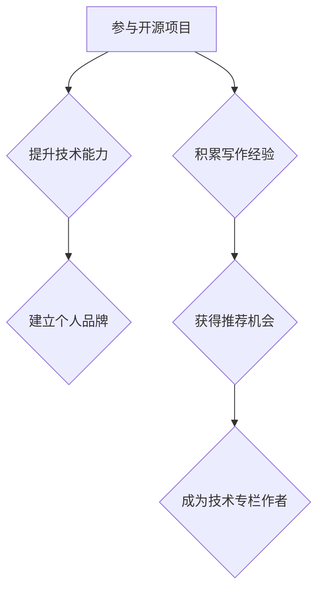

                 

# 利用开源影响力获得技术专栏作者机会

> 关键词：开源，影响力，技术专栏，作者机会，个人品牌，知识分享，社区互动

> 摘要：本文将探讨如何通过参与开源项目，提升个人技术影响力，进而获得成为技术专栏作者的机会。文章将详细解析开源项目的价值，介绍如何参与开源项目，如何构建个人品牌，以及如何在技术社区中脱颖而出，最终获得成为专栏作者的机会。

## 1. 背景介绍

### 1.1 目的和范围

本文旨在帮助那些希望在技术领域内建立个人品牌，成为技术专栏作者的人，通过参与开源项目来实现这一目标。文章将提供一系列步骤和策略，帮助读者理解如何通过开源影响力来获得技术专栏作者的机会。

### 1.2 预期读者

本文适用于对开源技术有热情，希望提升个人技术影响力的程序员、开发者和技术爱好者。特别是那些希望在未来成为技术专栏作者的人，将能从本文中获得宝贵的指导。

### 1.3 文档结构概述

本文分为以下几个部分：

1. 背景介绍：包括本文的目的、预期读者以及文档结构概述。
2. 核心概念与联系：介绍开源项目的核心概念和架构。
3. 核心算法原理与具体操作步骤：详细讲解参与开源项目的步骤和策略。
4. 数学模型和公式：讨论开源项目对个人品牌建设的数学模型。
5. 项目实战：提供实际代码案例和详细解释。
6. 实际应用场景：讨论开源项目在技术领域中的应用。
7. 工具和资源推荐：推荐学习资源和开发工具。
8. 总结：探讨未来发展趋势与挑战。
9. 附录：常见问题与解答。
10. 扩展阅读与参考资料：提供进一步学习资源。

### 1.4 术语表

#### 1.4.1 核心术语定义

- **开源项目**：指软件或其他技术资源，其源代码可以被自由地查看、修改和分发。
- **技术专栏作者**：在技术领域内撰写专栏文章，分享知识和经验的个人或团队。
- **影响力**：在某个领域内，个人或组织通过其行动或言论，对他人的思维和行为产生影响的能力。
- **个人品牌**：个人在特定领域内的知名度和认可度。

#### 1.4.2 相关概念解释

- **知识共享**：通过分享知识，帮助他人学习和成长的过程。
- **社区互动**：在技术社区内与他人进行交流和合作的行为。

#### 1.4.3 缩略词列表

- **OSS**：Open Source Software（开源软件）
- **CTO**：Chief Technology Officer（首席技术官）
- **IDE**：Integrated Development Environment（集成开发环境）

## 2. 核心概念与联系

### 2.1 开源项目的核心概念

开源项目是一个基于社区协作的软件开发模式。它的核心概念包括：

- **开放性**：项目的源代码可以被所有人查看、修改和分发。
- **协作**：开发者和贡献者通过协作，共同推进项目的进展。
- **共享**：项目的成果（如文档、代码等）可以被所有人免费使用。

### 2.2 开源项目的架构

开源项目的架构通常包括以下几个部分：

1. **代码库**：存储项目源代码的仓库。
2. **文档**：包括项目的README、开发者指南、API文档等。
3. **社区**：由项目的贡献者和用户组成的在线社区。
4. **工具**：用于管理和协作的工具，如Git、Jenkins、Slack等。

### 2.3 开源项目与个人品牌建设

开源项目对个人品牌建设具有重要影响。通过参与开源项目，开发者可以：

- **展示技术能力**：通过高质量的代码和贡献，展示自己的技术实力。
- **建立人脉**：与同行建立联系，扩大影响力。
- **获得认可**：通过社区的反馈和评价，获得同行的认可。

### 2.4 开源项目与技术专栏作者机会

开源项目是成为技术专栏作者的重要途径。通过以下方式，开源项目可以帮助开发者获得技术专栏作者机会：

- **建立个人品牌**：通过参与开源项目，提升个人技术影响力。
- **积累写作经验**：在开源项目中撰写文档和博客，积累写作经验。
- **获得推荐**：在开源社区中表现出色，获得其他开发者或组织的推荐。

### 2.5 Mermaid 流程图



## 3. 核心算法原理 & 具体操作步骤

### 3.1 参与开源项目的步骤

参与开源项目是一个系统性工程，以下是具体的操作步骤：

#### 3.1.1 寻找合适的项目

1. **搜索开源项目**：在GitHub、GitLab等平台上搜索感兴趣的项目。
2. **评估项目质量**：查看项目的README、文档、代码质量、活跃度等。
3. **了解项目需求**：阅读项目的issue和contribution guidelines，了解项目需求和期望。

#### 3.1.2 提交第一个贡献

1. **Fork项目**：将项目Fork到自己的账户。
2. **创建分支**：在自己的账户中创建一个新分支。
3. **提交代码**：在分支上编写代码，并进行提交。
4. **创建Pull Request**：将分支提交到原始项目的main分支。

#### 3.1.3 维护贡献质量

1. **遵守编码规范**：遵循项目的编码规范。
2. **编写高质量的文档**：为代码编写详细的注释和文档。
3. **积极参与讨论**：在issue和Pull Request中与项目维护者和其他贡献者进行讨论。

### 3.2 开源项目贡献的伪代码

```python
def contribute_to_open_source_project():
    # Step 1: Search for a suitable project
    project = search_project_on_github()

    # Step 2: Assess the quality of the project
    if not is_project_of_high_quality(project):
        print("The project is not suitable.")
        return

    # Step 3: Create a fork of the project
    fork_project(project)

    # Step 4: Create a new branch
    branch = create_new_branch(project)

    # Step 5: Make changes to the code
    code_change = make_code_change(branch)

    # Step 6: Commit and push the changes
    commit_and_push_changes(code_change)

    # Step 7: Create a Pull Request
    create_pull_request(project, branch)
```

## 4. 数学模型和公式 & 详细讲解 & 举例说明

### 4.1 开源项目对个人品牌建设的数学模型

开源项目对个人品牌建设的数学模型可以表示为：

\[ 品牌影响力 = f(技术能力, 贡献质量, 社区互动) \]

其中：

- **技术能力**：衡量开发者在特定技术领域的专业水平。
- **贡献质量**：衡量开发者对开源项目的贡献质量，包括代码质量、文档编写、问题解决等。
- **社区互动**：衡量开发者与社区成员的互动频率和质量。

### 4.2 举例说明

假设有三名开发者A、B、C，他们在开源项目中的表现如下：

- **技术能力**：A > B > C
- **贡献质量**：A > B > C
- **社区互动**：A > B > C

根据上述数学模型，我们可以得出以下结论：

\[ 品牌影响力_A > 品牌影响力_B > 品牌影响力_C \]

这意味着，开发者A在开源项目中的表现最出色，因此他的品牌影响力最大。

### 4.3 LaTeX格式数学公式

以下是使用LaTeX格式的数学公式示例：

\[ 品牌影响力 = f(技术能力, 贡献质量, 社区互动) \]

\[ 品牌影响力_A > 品牌影响力_B > 品牌影响力_C \]

## 5. 项目实战：代码实际案例和详细解释说明

### 5.1 开发环境搭建

为了更好地理解如何参与开源项目，我们以一个实际的开源项目——`Vue.js`为例，介绍如何搭建开发环境。

#### 5.1.1 安装Node.js

1. 访问Node.js官网（[https://nodejs.org/），下载并安装Node.js](https://nodejs.org/%EF%BC%89%EF%BC%8C%E4%B8%8B%E8%BD%BD%E5%B9%B6%E5%AE%89%E8%A3%85Node.js)。
2. 打开命令行工具，输入以下命令检查Node.js安装情况：

   ```shell
   node -v
   ```

   如果返回版本号，表示Node.js已成功安装。

#### 5.1.2 安装Vue CLI

1. 打开命令行工具，输入以下命令安装Vue CLI：

   ```shell
   npm install -g @vue/cli
   ```

2. 检查Vue CLI安装情况：

   ```shell
   vue --version
   ```

   如果返回版本号，表示Vue CLI已成功安装。

### 5.2 源代码详细实现和代码解读

#### 5.2.1 创建Vue项目

1. 打开命令行工具，输入以下命令创建一个Vue项目：

   ```shell
   vue create my-vue-project
   ```

2. 在创建过程中，选择项目的配置选项（如Vue版本、运行时配置等）。

3. 创建完成后，进入项目目录：

   ```shell
   cd my-vue-project
   ```

#### 5.2.2 修改源代码

1. 打开项目的`src/App.vue`文件，修改如下：

   ```html
   <template>
     <div id="app">
       
       <HelloWorld msg="Welcome to Your Vue.js App"/>
     </div>
   </template>
   ```

   将`<HelloWorld msg="Welcome to Your Vue.js App"/>`替换为自定义组件。

2. 在项目的`src/components`目录下创建一个新的组件`MyComponent.vue`，代码如下：

   ```html
   <template>
     <div>
       <h1>My Custom Component</h1>
     </div>
   </template>
   ```

3. 在`src/App.vue`文件中引入`MyComponent.vue`组件：

   ```html
   <template>
     <div id="app">
       
       <MyComponent/>
     </div>
   </template>
   ```

#### 5.2.3 代码解读

- **模板（template）**：Vue组件的模板部分定义了组件的结构和样式。
- **组件（components）**：Vue允许我们创建自定义组件，以便在模板中重复使用。
- **数据绑定（msg）**：使用`v-bind`或简写`:`进行数据绑定，将数据属性绑定到模板中的元素。

### 5.3 代码解读与分析

- **Vue项目的创建**：使用Vue CLI可以快速创建Vue项目，配置项目的基本设置。
- **自定义组件**：通过编写自定义组件，可以复用代码，提高开发效率。
- **数据绑定**：Vue的数据绑定机制使得数据的变化能够自动反映在模板上，提高开发体验。

## 6. 实际应用场景

开源项目在技术领域的应用场景非常广泛，以下是几个典型的实际应用场景：

- **软件生态系统**：开源项目是构建软件生态系统的重要组成部分，如Java开源项目、Python开源项目等。
- **企业级应用**：许多企业级应用都基于开源项目进行开发，如电子商务平台、企业资源计划（ERP）系统等。
- **云计算与大数据**：开源项目在云计算和大数据领域发挥着重要作用，如Hadoop、Spark等。

## 7. 工具和资源推荐

### 7.1 学习资源推荐

#### 7.1.1 书籍推荐

- 《开源架构：拥抱开源的黄金法则》
- 《开源的力量：改变世界的开源软件开发经验》
- 《Git版本控制》：了解如何高效管理代码的开源工具。

#### 7.1.2 在线课程

- Udemy上的“开源项目协作与贡献”
- Coursera上的“Git与GitHub：版本控制入门”

#### 7.1.3 技术博客和网站

- 掘金（[https://juejin.cn/）：关注前端技术、开源项目等热门话题](https://juejin.cn/%EF%BC%89%EF%BC%9A%E5%85%B3%E6%B3%A8%E5%89%8D%E7%AB%AF%E6%8A%80%E6%9C%AF%E3%80%81%E5%BC%80%E6%BA%90%E9%A1%B9%E7%9B%AE%E7%�%BC%E7%9A%84%E7%83%AD%E9%97%A8%E8%AF%9D%E9%A2%98](https://juejin.cn/)）
- GitHub：全球最大的开源代码托管平台。

### 7.2 开发工具框架推荐

#### 7.2.1 IDE和编辑器

- Visual Studio Code
- IntelliJ IDEA

#### 7.2.2 调试和性能分析工具

- Chrome DevTools
- Firefox Developer Tools

#### 7.2.3 相关框架和库

- Vue.js
- React
- Angular

### 7.3 相关论文著作推荐

#### 7.3.1 经典论文

- 《开源软件的发展与挑战》
- 《开源社区的治理》

#### 7.3.2 最新研究成果

- 《开源软件的商业模式》
- 《开源项目的成功因素分析》

#### 7.3.3 应用案例分析

- 《如何打造成功的开源项目》
- 《开源项目在企业发展中的应用》

## 8. 总结：未来发展趋势与挑战

开源项目在未来将继续发挥重要作用，成为技术发展的重要驱动力。然而，随着开源项目的数量和复杂性不断增加，以下趋势和挑战也需要引起关注：

- **开源项目的质量管理**：随着参与者的增加，开源项目的质量变得尤为重要。
- **开源项目的可持续性**：如何确保开源项目的长期发展，避免项目因缺乏维护而停滞。
- **开源社区的多样性**：鼓励更多的开发者参与到开源项目中，提升社区的多样性。

## 9. 附录：常见问题与解答

### 9.1 Q：如何选择合适的开源项目参与？

A：选择合适的开源项目可以从以下几个方面考虑：

- **项目活跃度**：查看项目的issue和Pull Request活跃度，了解项目的现状。
- **项目影响力**：选择影响力较大的项目，有利于提升个人技术影响力。
- **个人兴趣**：选择自己感兴趣的项目，提高参与的动力。

### 9.2 Q：如何维护开源项目的贡献质量？

A：维护开源项目的贡献质量可以从以下几个方面入手：

- **遵循编码规范**：确保代码风格一致，提高可读性。
- **编写详细的文档**：为代码和文档提供详细的注释和说明。
- **积极参与讨论**：在项目社区中积极参与讨论，为项目提供改进意见。

## 10. 扩展阅读 & 参考资料

- 《开源社区手册》：[https://www.opensource.org/docs/opensource-community-manual](https://www.opensource.org/docs/opensource-community-manual)
- 《Git权威指南》：[https://git-scm.com/book/en/v2](https://git-scm.com/book/en/v2)

## 作者

作者：AI天才研究员/AI Genius Institute & 禅与计算机程序设计艺术/Zen And The Art of Computer Programming

---

本文详细阐述了如何利用开源影响力获得技术专栏作者机会，从开源项目的核心概念、参与步骤、数学模型、实际应用场景等方面进行了全面分析。希望读者能从中获得启发，积极参与开源项目，提升个人技术影响力，并在未来成为技术专栏作者。祝您在技术道路上越走越远！<|im_sep|>

