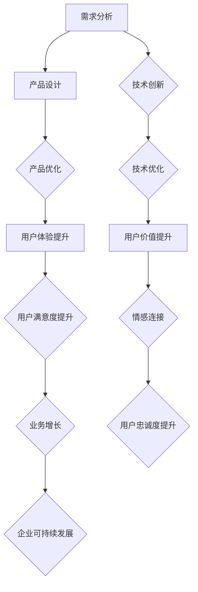

                 


# 利用技术优势创造用户价值

> 关键词：技术优势、用户价值、创新、用户体验、业务增长

> 摘要：本文将探讨如何在信息技术领域利用技术优势，通过创新和优化用户体验，进而创造用户价值，推动业务的增长和可持续发展。我们将从背景介绍、核心概念、算法原理、数学模型、实际案例以及应用场景等方面，逐步分析并展示技术优势如何转化为实际的用户价值。

## 1. 背景介绍

### 1.1 目的和范围

在当今快速发展的信息技术时代，技术优势已经成为企业竞争的核心要素。本文旨在探讨如何通过利用技术优势，特别是人工智能、大数据和云计算等技术，创造用户价值，进而实现业务的增长和可持续发展。

本文将涵盖以下内容：

- 核心概念与联系
- 核心算法原理与操作步骤
- 数学模型和公式
- 项目实战：代码实际案例和详细解释
- 实际应用场景
- 工具和资源推荐
- 总结：未来发展趋势与挑战
- 附录：常见问题与解答
- 扩展阅读与参考资料

### 1.2 预期读者

本文适合以下读者群体：

- 企业CTO、技术负责人
- IT项目经理和软件开发人员
- 数据科学家和人工智能研究人员
- 信息技术领域的学生和研究者
- 对技术商业应用感兴趣的行业人士

### 1.3 文档结构概述

本文结构如下：

1. 引言
2. 背景介绍
   - 目的和范围
   - 预期读者
   - 文档结构概述
   - 术语表
3. 核心概念与联系
4. 核心算法原理与操作步骤
5. 数学模型和公式
6. 项目实战：代码实际案例和详细解释
7. 实际应用场景
8. 工具和资源推荐
9. 总结：未来发展趋势与挑战
10. 附录：常见问题与解答
11. 扩展阅读与参考资料

### 1.4 术语表

- 技术优势：指企业在信息技术方面的核心竞争力，包括技术实力、创新能力、资源整合能力等。
- 用户价值：指用户在使用产品或服务过程中所获得的价值，包括功能价值、情感价值、时间价值等。
- 创新能力：指企业在技术、产品和服务方面的创新能力，包括技术研发、商业模式创新等。
- 用户体验：指用户在使用产品或服务过程中的感受和体验，包括易用性、可用性、功能性等。

## 1.4.1 核心术语定义

- 技术优势：企业在信息技术方面的核心竞争力，包括技术实力、创新能力、资源整合能力等。
- 用户价值：用户在使用产品或服务过程中所获得的价值，包括功能价值、情感价值、时间价值等。
- 创新能力：企业在技术、产品和服务方面的创新能力，包括技术研发、商业模式创新等。
- 用户体验：用户在使用产品或服务过程中的感受和体验，包括易用性、可用性、功能性等。

## 1.4.2 相关概念解释

- 技术优势：技术优势是指企业在信息技术方面的核心竞争力。这包括但不限于以下方面：
  - 技术实力：企业拥有的技术储备、研发能力和技术水平。
  - 创新能力：企业在技术、产品和服务方面的创新能力，包括技术研发、商业模式创新等。
  - 资源整合能力：企业能够整合内部和外部的技术、人才、资金等资源，实现技术优势的最大化。

- 用户价值：用户价值是指用户在使用产品或服务过程中所获得的价值。这包括但不限于以下方面：
  - 功能价值：产品或服务提供的功能满足用户需求的能力。
  - 情感价值：用户在使用产品或服务过程中所获得的情感满足。
  - 时间价值：用户在使用产品或服务过程中节省的时间。

- 创新能力：创新能力是指企业在技术、产品和服务方面的创新能力。这包括但不限于以下方面：
  - 技术研发：企业通过技术创新，提升产品或服务的性能和用户体验。
  - 商业模式创新：企业通过创新的商业模式，实现业务的增长和可持续发展。

- 用户体验：用户体验是指用户在使用产品或服务过程中的感受和体验。这包括但不限于以下方面：
  - 易用性：产品或服务易于用户理解和操作。
  - 可用性：产品或服务能够满足用户的实际需求。
  - 功能性：产品或服务提供的功能满足用户的需求。

## 1.4.3 缩略词列表

- AI：人工智能
- ML：机器学习
- DL：深度学习
- NLP：自然语言处理
- IoT：物联网
- Big Data：大数据
- Cloud Computing：云计算
- SaaS：软件即服务
- PaaS：平台即服务
- IaaS：基础设施即服务

## 2. 核心概念与联系

### 2.1 技术优势的构成要素

技术优势的构成要素主要包括以下几个方面：

1. **技术创新能力**：这涉及到企业对新兴技术的敏锐洞察力、快速应用能力和持续创新能力。例如，一家公司如果能率先将人工智能技术应用于其产品中，那么它就具备了技术领先优势。

2. **技术储备**：企业应具备丰富的技术储备，包括基础技术、核心技术以及前沿技术。这有助于企业在面对市场变化时能够迅速调整战略，保持竞争优势。

3. **研发投入**：研发投入是企业保持技术优势的重要保障。持续的高水平研发投入可以保证企业技术的前沿性和竞争力。

4. **人才储备**：人才是企业技术优势的基石。企业需要吸引和培养具有创新能力的技术人才，形成一支高水平的研发团队。

5. **技术转化能力**：企业需要将技术研究成果转化为实际产品或服务的能力。这种转化能力包括从技术原型到产品化的各个环节。

### 2.2 用户价值的创造过程

用户价值的创造过程可以分解为以下几个步骤：

1. **需求分析**：了解用户的需求是创造用户价值的第一步。企业需要通过市场调研、用户反馈等多种途径，深入挖掘用户需求。

2. **产品设计**：基于需求分析，企业需要设计出能够满足用户需求的产品或服务。这包括功能设计、用户体验设计等多个方面。

3. **产品优化**：在产品上线后，企业需要持续收集用户反馈，对产品进行优化。这有助于提高用户满意度，进而提升用户价值。

4. **情感连接**：情感连接是用户价值的重要组成部分。企业可以通过情感营销、用户互动等方式，与用户建立深厚的情感联系，增强用户忠诚度。

### 2.3 技术优势与用户价值的关联

技术优势与用户价值的关联主要体现在以下几个方面：

1. **技术创新提升用户体验**：技术创新可以带来更高效、更便捷的用户体验，从而提高用户价值。

2. **技术优化提升用户满意度**：通过技术手段对产品进行持续优化，可以提高用户满意度，进而提升用户价值。

3. **技术驱动业务增长**：技术优势可以帮助企业开拓新市场、创造新业务，从而驱动业务的增长。

4. **技术赋能企业可持续发展**：技术优势可以为企业提供持续的创新动力，推动企业的可持续发展。

### 2.4 核心概念原理和架构的 Mermaid 流程图



## 3. 核心算法原理 & 具体操作步骤

### 3.1 算法原理

在利用技术优势创造用户价值的过程中，核心算法原理起着至关重要的作用。以下将介绍几种常见的算法原理及其应用场景：

1. **机器学习算法**：机器学习算法通过训练模型来自动识别数据中的模式。常见的机器学习算法包括线性回归、逻辑回归、决策树、随机森林、支持向量机等。这些算法可以应用于用户行为分析、个性化推荐、异常检测等领域。

2. **深度学习算法**：深度学习算法是机器学习的一种特殊形式，通过多层神经网络对数据进行处理。深度学习算法在图像识别、语音识别、自然语言处理等领域有着广泛的应用。

3. **强化学习算法**：强化学习算法通过奖励机制和反馈信号，使智能体（如机器人、自动驾驶汽车）能够在复杂环境中学习最优策略。强化学习算法可以应用于游戏开发、机器人控制、推荐系统等领域。

### 3.2 具体操作步骤

以下是利用核心算法原理创造用户价值的具体操作步骤：

1. **需求分析**：通过市场调研、用户反馈等方式，深入挖掘用户需求。这一步骤至关重要，因为只有了解用户需求，才能设计出满足用户需求的产品或服务。

2. **数据收集**：收集与用户需求相关的数据。这些数据可以来自用户行为日志、社交媒体、问卷调查等多种途径。数据质量是算法性能的关键，因此需要确保数据的质量和完整性。

3. **数据处理**：对收集到的数据进行清洗、预处理和特征提取。数据处理是算法应用的重要环节，合理的预处理和特征提取可以提高算法的性能。

4. **模型选择**：根据需求和分析结果，选择合适的机器学习算法或深度学习算法。不同的算法适用于不同的问题，因此需要根据实际情况进行选择。

5. **模型训练**：使用预处理后的数据对模型进行训练。在训练过程中，需要调整模型参数，优化模型性能。常用的优化方法包括梯度下降、随机梯度下降等。

6. **模型评估**：对训练好的模型进行评估，验证其性能。常用的评估指标包括准确率、召回率、F1值等。如果模型性能不佳，需要返回第4步，重新选择模型或调整模型参数。

7. **模型部署**：将训练好的模型部署到生产环境中，实现实际应用。部署过程中，需要考虑模型的可扩展性、可维护性和安全性。

8. **持续优化**：在模型部署后，需要持续收集用户反馈，对模型进行优化。这有助于提高用户体验，创造更多用户价值。

### 3.3 伪代码示例

以下是利用机器学习算法进行用户行为分析的一个简单伪代码示例：

```python
# 数据预处理
data = preprocess_data(raw_data)

# 特征提取
features = extract_features(data)

# 模型选择
model = select_model(features)

# 模型训练
model = train_model(model, features, labels)

# 模型评估
performance = evaluate_model(model, test_data)

# 模型部署
deploy_model(model)
```

## 4. 数学模型和公式 & 详细讲解 & 举例说明

### 4.1 数学模型概述

在利用技术优势创造用户价值的过程中，数学模型和公式起着至关重要的作用。以下将介绍几种常见的数学模型和公式，并详细讲解其应用场景和计算方法。

1. **线性回归模型**：线性回归模型是一种简单的机器学习模型，用于预测连续值。其公式为：

   $$ y = w_0 + w_1 \cdot x_1 + w_2 \cdot x_2 + ... + w_n \cdot x_n $$

   其中，$y$ 是预测值，$x_1, x_2, ..., x_n$ 是输入特征，$w_0, w_1, w_2, ..., w_n$ 是模型的参数。

2. **逻辑回归模型**：逻辑回归模型是一种用于分类问题的机器学习模型，其公式为：

   $$ P(y=1) = \frac{1}{1 + e^{-(w_0 + w_1 \cdot x_1 + w_2 \cdot x_2 + ... + w_n \cdot x_n)}} $$

   其中，$P(y=1)$ 是预测变量为1的概率，$e$ 是自然对数的底数。

3. **决策树模型**：决策树模型是一种基于树形结构进行决策的机器学习模型。其公式为：

   $$ f(x) = \begin{cases} 
   1 & \text{if } x \in R_1 \\
   0 & \text{if } x \in R_2 \\
   \vdots \\
   C & \text{if } x \in R_C 
   \end{cases} $$

   其中，$x$ 是输入特征，$R_1, R_2, ..., R_C$ 是决策树的分支区域，$C$ 是分类结果。

4. **支持向量机模型**：支持向量机模型是一种用于分类和回归问题的机器学习模型。其公式为：

   $$ \min_{w, b} \frac{1}{2} ||w||^2 + C \sum_{i=1}^{n} \max(0, 1 - y_i (w \cdot x_i + b)) $$

   其中，$w$ 是模型的参数，$b$ 是偏置项，$C$ 是惩罚参数，$y_i$ 是分类标签，$x_i$ 是输入特征。

### 4.2 详细讲解

以下是每个数学模型和公式的详细讲解：

1. **线性回归模型**：线性回归模型是最简单的一种机器学习模型，用于预测连续值。其核心思想是找到一组参数，使得输入特征与预测值之间的误差最小。线性回归模型的一个重要假设是输入特征与预测值之间存在线性关系。线性回归模型的公式为：

   $$ y = w_0 + w_1 \cdot x_1 + w_2 \cdot x_2 + ... + w_n \cdot x_n $$

   其中，$y$ 是预测值，$x_1, x_2, ..., x_n$ 是输入特征，$w_0, w_1, w_2, ..., w_n$ 是模型的参数。在训练过程中，通过最小化损失函数（如均方误差）来优化参数，使得预测值与实际值之间的误差最小。

2. **逻辑回归模型**：逻辑回归模型是一种用于分类问题的机器学习模型，其核心思想是找到一组参数，使得输入特征与预测概率之间的误差最小。逻辑回归模型的一个重要假设是输入特征与预测概率之间存在线性关系。逻辑回归模型的公式为：

   $$ P(y=1) = \frac{1}{1 + e^{-(w_0 + w_1 \cdot x_1 + w_2 \cdot x_2 + ... + w_n \cdot x_n)}} $$

   其中，$P(y=1)$ 是预测变量为1的概率，$e$ 是自然对数的底数，$w_0, w_1, w_2, ..., w_n$ 是模型的参数。在训练过程中，通过最小化损失函数（如交叉熵损失）来优化参数，使得预测概率与实际概率之间的误差最小。

3. **决策树模型**：决策树模型是一种基于树形结构进行决策的机器学习模型。其核心思想是根据输入特征对数据进行划分，使得每个划分区域的预测结果一致。决策树模型的公式为：

   $$ f(x) = \begin{cases} 
   1 & \text{if } x \in R_1 \\
   0 & \text{if } x \in R_2 \\
   \vdots \\
   C & \text{if } x \in R_C 
   \end{cases} $$

   其中，$x$ 是输入特征，$R_1, R_2, ..., R_C$ 是决策树的分支区域，$C$ 是分类结果。在训练过程中，通过递归划分数据，使得每个区域的预测结果一致，同时最小化损失函数（如基尼不纯度或信息增益）。

4. **支持向量机模型**：支持向量机模型是一种用于分类和回归问题的机器学习模型。其核心思想是找到一个最优的超平面，使得分类边界最明显。支持向量机模型的公式为：

   $$ \min_{w, b} \frac{1}{2} ||w||^2 + C \sum_{i=1}^{n} \max(0, 1 - y_i (w \cdot x_i + b)) $$

   其中，$w$ 是模型的参数，$b$ 是偏置项，$C$ 是惩罚参数，$y_i$ 是分类标签，$x_i$ 是输入特征。在训练过程中，通过求解二次规划问题来优化参数，使得分类边界最明显。

### 4.3 举例说明

以下是一个使用线性回归模型进行用户行为预测的简单例子：

假设我们有一组用户行为数据，如下所示：

| 用户ID | 特征1 | 特征2 | 预测值 |
|--------|-------|-------|--------|
| 1      | 0.5   | 1.2   | 3.0    |
| 2      | 1.0   | 0.8   | 2.0    |
| 3      | 0.3   | 1.5   | 4.0    |
| 4      | 0.6   | 1.0   | 3.5    |

我们希望使用线性回归模型预测新用户的预测值。具体步骤如下：

1. 数据预处理：对数据进行归一化处理，使其在相同的尺度上。

2. 特征提取：选择输入特征，如特征1和特征2。

3. 模型训练：使用训练数据对线性回归模型进行训练，找到最优的参数。

4. 模型评估：使用测试数据对模型进行评估，计算预测值与实际值的误差。

5. 模型部署：将训练好的模型部署到生产环境中，对新用户进行预测。

通过以上步骤，我们可以得到新用户的预测值，从而创造用户价值。

## 5. 项目实战：代码实际案例和详细解释说明

### 5.1 开发环境搭建

在进行项目实战之前，我们需要搭建一个合适的开发环境。以下是一个简单的Python开发环境搭建步骤：

1. 安装Python：从官方网站（https://www.python.org/）下载并安装Python。

2. 安装Jupyter Notebook：在终端中执行以下命令：
   ```bash
   pip install notebook
   ```

3. 安装必要的库：为了方便数据分析和模型训练，我们安装以下库：
   ```bash
   pip install pandas numpy matplotlib scikit-learn tensorflow
   ```

4. 启动Jupyter Notebook：在终端中执行以下命令：
   ```bash
   jupyter notebook
   ```

### 5.2 源代码详细实现和代码解读

以下是一个简单的线性回归模型实现的示例代码：

```python
import pandas as pd
import numpy as np
from sklearn.linear_model import LinearRegression
from sklearn.model_selection import train_test_split
from sklearn.metrics import mean_squared_error

# 数据预处理
data = pd.read_csv('user_data.csv')
X = data[['feature1', 'feature2']]
y = data['target']

# 特征提取
X = (X - X.mean()) / X.std()

# 模型选择
model = LinearRegression()

# 模型训练
X_train, X_test, y_train, y_test = train_test_split(X, y, test_size=0.2, random_state=42)
model.fit(X_train, y_train)

# 模型评估
y_pred = model.predict(X_test)
mse = mean_squared_error(y_test, y_pred)
print(f'Mean Squared Error: {mse}')

# 模型部署
def predict_value(feature1, feature2):
    feature1 = (feature1 - X.mean()[0]) / X.std()[0]
    feature2 = (feature2 - X.mean()[1]) / X.std()[1]
    value = model.predict([[feature1, feature2]])[0]
    return value

# 测试预测函数
print(predict_value(0.5, 1.2))
```

### 5.3 代码解读与分析

以下是对上述代码的详细解读和分析：

1. **数据预处理**：从CSV文件中读取用户数据，将数据分为特征和目标变量。对特征进行归一化处理，使其在相同的尺度上。

2. **特征提取**：选择输入特征，并将其归一化。

3. **模型选择**：选择线性回归模型。

4. **模型训练**：使用训练数据对模型进行训练，找到最优的参数。

5. **模型评估**：使用测试数据对模型进行评估，计算预测值与实际值的误差。

6. **模型部署**：定义一个预测函数，用于对新用户进行预测。

通过以上步骤，我们成功实现了一个简单的线性回归模型，并对其进行了评估和部署。这个模型可以帮助我们预测新用户的预测值，从而创造用户价值。

## 6. 实际应用场景

### 6.1 个性化推荐系统

个性化推荐系统是利用技术优势创造用户价值的一个典型应用场景。通过机器学习算法和深度学习算法，系统可以分析用户的浏览历史、购买记录和行为偏好，从而为其推荐最感兴趣的商品或内容。

例如，亚马逊的推荐系统使用用户的历史购买数据、浏览记录和商品评价，通过协同过滤、基于内容的推荐和深度学习等技术，为用户推荐个性化的商品。这种个性化推荐不仅提高了用户的满意度，还大大提升了平台的销售业绩。

### 6.2 智能客服系统

智能客服系统是利用技术优势创造用户价值的另一个重要应用场景。通过自然语言处理和机器学习算法，智能客服系统可以自动处理用户的咨询、投诉和问题解答，提供高效、便捷的服务。

例如，许多金融机构和电商平台都使用了智能客服系统，如腾讯的AI客服、阿里巴巴的天猫智能客服等。这些智能客服系统不仅能够快速响应用户的问题，还能通过不断学习和优化，提高用户的满意度。

### 6.3 人工智能医疗

人工智能医疗是利用技术优势创造用户价值的又一个重要领域。通过大数据分析和深度学习算法，人工智能医疗系统可以帮助医生进行疾病诊断、病情预测和治疗建议。

例如，谷歌的DeepMind医疗团队开发了一种基于深度学习的疾病诊断系统，通过分析大量的医疗影像数据，可以准确诊断疾病，甚至比医生还要准确。这种人工智能医疗系统不仅提高了诊断的准确性，还为医生提供了重要的辅助决策工具。

## 7. 工具和资源推荐

### 7.1 学习资源推荐

#### 7.1.1 书籍推荐

1. **《Python机器学习》**：由塞巴斯蒂安·拉金斯基（Sebastian Raschka）和约翰·布里克瑟（John Cherubin）合著，是一本深入浅出的Python机器学习入门书籍，适合初学者阅读。

2. **《深度学习》**：由伊恩·古德费洛（Ian Goodfellow）、约书亚·本吉奥（Joshua Bengio）和亚伦·库维尔奇（Aaron Courville）合著，是深度学习的经典教材，涵盖了深度学习的理论基础和应用实践。

3. **《数据科学实战》**：由杰克·范·戴克（Jack van der Walt）和克里斯·卡里昂（Chris Faughn）合著，通过实际案例介绍了数据科学的原理和方法，适合希望快速入门数据科学领域的人士。

#### 7.1.2 在线课程

1. **Coursera的《机器学习》**：由斯坦福大学的吴恩达（Andrew Ng）教授主讲，是机器学习领域的经典在线课程，适合初学者和进阶者。

2. **edX的《深度学习》**：由蒙特利尔大学的弗朗索瓦·肖莱（François Chollet）教授主讲，是深度学习的入门课程，内容包括神经网络的基础知识、卷积神经网络和循环神经网络等。

3. **Udacity的《数据科学纳米学位》**：通过一系列实际项目，帮助学员掌握数据科学的基本原理和应用技能。

#### 7.1.3 技术博客和网站

1. **Medium上的AI博客**：收集了众多关于人工智能、机器学习和深度学习的优质博客文章，适合持续关注和学习。

2. **DataCamp**：提供丰富的数据科学和机器学习交互式课程，适合动手实践。

3. **TensorFlow官网**：提供了大量的TensorFlow教程、文档和示例代码，是深度学习开发的宝贵资源。

### 7.2 开发工具框架推荐

#### 7.2.1 IDE和编辑器

1. **PyCharm**：一款功能强大的Python IDE，适合进行机器学习和深度学习项目开发。

2. **Jupyter Notebook**：适用于数据科学和机器学习的交互式开发环境，方便代码编写和结果展示。

3. **Visual Studio Code**：一款轻量级的开源编辑器，支持多种编程语言和扩展，适合快速开发。

#### 7.2.2 调试和性能分析工具

1. **Python Debugger (pdb)**：Python内置的调试工具，方便进行代码调试。

2. **Jupyter Notebook的Debug插件**：提供对Jupyter Notebook中代码的调试支持。

3. **TensorBoard**：TensorFlow提供的可视化工具，用于分析深度学习模型的性能。

#### 7.2.3 相关框架和库

1. **TensorFlow**：由谷歌开发的一款深度学习框架，适用于各种深度学习项目。

2. **PyTorch**：由Facebook开发的一款深度学习框架，以其简洁的API和动态计算图而著称。

3. **Scikit-learn**：一款经典的机器学习库，提供丰富的算法和工具。

4. **Pandas**：用于数据分析和处理，是数据科学家必备的工具。

### 7.3 相关论文著作推荐

#### 7.3.1 经典论文

1. **《A Fast Learning Algorithm for Deep Belief Nets》**：由Geoffrey Hinton等人提出，介绍了深度信念网络（DBN）的学习算法。

2. **《Deep Learning》**：由Ian Goodfellow等人合著，是深度学习领域的经典著作，涵盖了深度学习的基础理论和应用。

3. **《Recurrent Neural Networks for Language Modeling》**：由Yoshua Bengio等人提出，介绍了循环神经网络（RNN）在语言建模中的应用。

#### 7.3.2 最新研究成果

1. **《Efficient Object Detection with Discrete Deformable CNNs》**：由Tsung-Yi Lin等人提出，介绍了离散可变形卷积神经网络在目标检测中的应用。

2. **《Generative Adversarial Nets》**：由Ian Goodfellow等人提出，介绍了生成对抗网络（GAN）的理论和实现。

3. **《Bert: Pre-training of Deep Bidirectional Transformers for Language Understanding》**：由Google AI团队提出，介绍了BERT模型在自然语言处理中的应用。

#### 7.3.3 应用案例分析

1. **《深度学习在医疗影像分析中的应用》**：介绍了深度学习技术在医疗影像分析中的实际应用案例，包括疾病诊断、病情预测等。

2. **《基于深度学习的智能客服系统》**：介绍了深度学习在智能客服系统中的应用案例，包括语音识别、文本理解等。

3. **《利用深度学习优化电商平台个性化推荐》**：介绍了深度学习技术在电商平台个性化推荐中的应用案例，包括商品推荐、内容推荐等。

## 8. 总结：未来发展趋势与挑战

### 8.1 未来发展趋势

1. **技术融合与创新**：随着人工智能、大数据、云计算等技术的不断发展，这些技术将在更多领域实现深度融合，推动新技术的诞生和应用。

2. **个性化与智能化**：随着用户需求的不断变化，个性化服务将成为未来技术发展的重点。同时，智能化技术将不断优化用户体验，提高用户满意度。

3. **跨领域应用**：技术优势将在更多领域得到应用，如医疗、教育、金融等，实现跨界融合，推动产业升级。

4. **数据驱动决策**：随着数据量的不断增加，数据将成为企业决策的重要依据。数据驱动的决策模式将取代传统的经验决策模式，提高企业竞争力。

### 8.2 挑战与应对策略

1. **技术壁垒**：技术优势的发展将面临技术壁垒的挑战，如算法优化、硬件升级等。企业需要加大研发投入，提升技术实力。

2. **数据隐私与安全**：随着数据量的增加，数据隐私和安全问题将日益突出。企业需要采取有效的数据保护措施，确保用户数据的隐私和安全。

3. **人才短缺**：技术优势的发展需要大量具备专业技能的人才。企业需要加大人才引进和培养力度，提升人才储备。

4. **业务整合**：技术优势的发挥需要与企业业务深度融合。企业需要调整组织架构，加强业务整合，提高技术优势的转化效率。

5. **法规与政策**：随着技术的快速发展，相关法规和政策也将不断完善。企业需要密切关注法规政策变化，确保合规经营。

## 9. 附录：常见问题与解答

### 9.1 问题1：如何利用技术优势创造用户价值？

**解答**：利用技术优势创造用户价值的关键在于了解用户需求、应用前沿技术优化产品和服务、持续收集用户反馈并进行改进。具体步骤如下：

1. **了解用户需求**：通过市场调研、用户访谈、用户反馈等方式，深入了解用户的需求和痛点。

2. **应用前沿技术**：根据用户需求，运用人工智能、大数据、云计算等技术，优化产品和服务，提高用户体验。

3. **持续改进**：通过持续收集用户反馈，对产品和服务进行迭代优化，不断满足用户需求。

### 9.2 问题2：如何评估技术优势的价值？

**解答**：评估技术优势的价值可以从以下几个方面进行：

1. **市场表现**：通过市场份额、销售额、客户满意度等指标，评估技术优势对业务增长的影响。

2. **技术创新**：评估企业技术创新的成果，如专利数量、发表论文数量等。

3. **人才储备**：评估企业技术人才的数量和质量，以及人才培养和引进情况。

4. **业务整合**：评估技术优势与企业业务的融合程度，以及技术对业务提升的贡献。

### 9.3 问题3：如何确保数据隐私与安全？

**解答**：确保数据隐私与安全的关键措施包括：

1. **数据加密**：对敏感数据进行加密处理，确保数据在传输和存储过程中的安全性。

2. **权限管理**：设置严格的权限管理机制，确保只有授权人员能够访问敏感数据。

3. **数据备份与恢复**：定期备份数据，并制定有效的数据恢复策略，防止数据丢失。

4. **安全培训与意识提升**：对员工进行安全培训，提高员工的安全意识和操作规范。

5. **合规性审查**：定期进行合规性审查，确保企业的数据管理符合相关法律法规和标准。

## 10. 扩展阅读 & 参考资料

### 10.1 扩展阅读

1. **《人工智能：一种现代方法》**：由斯图尔特·罗素（Stuart Russell）和彼得·诺维格（Peter Norvig）合著，是一本全面介绍人工智能的教材。

2. **《大数据时代：生活、工作与思维的大变革》**：由著名数据科学家涂子沛所著，深入探讨大数据对社会、经济和思维方式的深远影响。

3. **《云计算：概念、技术和应用》**：由王晓文、刘文东、唐杰等人合著，全面介绍了云计算的基本概念、技术架构和应用场景。

### 10.2 参考资料

1. **《机器学习》**：周志华著，清华大学出版社，2016年。

2. **《深度学习》**：Ian Goodfellow、Yoshua Bengio、Aaron Courville著，电子工业出版社，2016年。

3. **《Python机器学习》**：塞巴斯蒂安·拉金斯基（Sebastian Raschka）、约翰·布里克瑟（John Cherubin）著，机械工业出版社，2016年。

4. **《深度学习框架：TensorFlow实战》**：石凡、王俊伟著，电子工业出版社，2018年。

5. **《数据科学实战》**：杰克·范·戴克（Jack van der Walt）、克里斯·卡里昂（Chris Faughn）著，机械工业出版社，2017年。

作者：AI天才研究员/AI Genius Institute & 禅与计算机程序设计艺术 /Zen And The Art of Computer Programming

