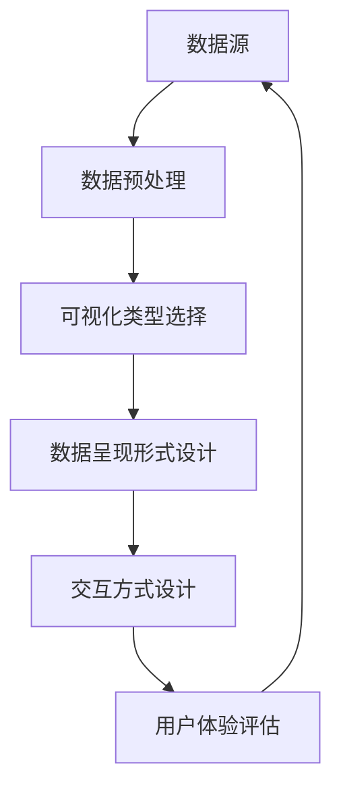

                 

# 利用数据可视化讲述产品故事

> **关键词：** 数据可视化，产品故事，用户体验，交互设计，信息传达

> **摘要：** 本文旨在探讨如何通过数据可视化来讲述产品故事，提升用户体验和产品价值。文章将详细分析数据可视化的核心概念、算法原理、数学模型，并结合实际案例，阐述其在产品设计和开发中的应用。同时，文章还将推荐相关学习资源、工具和框架，为读者提供全面的学习和实践指导。

## 1. 背景介绍

### 1.1 目的和范围

本文的目标是帮助读者理解数据可视化在讲述产品故事中的重要作用，掌握其核心概念和操作方法。文章将围绕以下几个方面展开：

- 数据可视化概述
- 数据可视化与产品故事的关系
- 数据可视化算法原理和数学模型
- 实际应用场景
- 工具和资源推荐

### 1.2 预期读者

- 产品经理和产品设计师
- 数据科学家和数据分析从业者
- 编程爱好者和技术博客作者
- 对数据可视化感兴趣的学习者

### 1.3 文档结构概述

本文将分为以下章节：

- 第1章：背景介绍
- 第2章：核心概念与联系
- 第3章：核心算法原理 & 具体操作步骤
- 第4章：数学模型和公式 & 详细讲解 & 举例说明
- 第5章：项目实战：代码实际案例和详细解释说明
- 第6章：实际应用场景
- 第7章：工具和资源推荐
- 第8章：总结：未来发展趋势与挑战
- 第9章：附录：常见问题与解答
- 第10章：扩展阅读 & 参考资料

### 1.4 术语表

#### 1.4.1 核心术语定义

- 数据可视化：将数据以图形、图表等形式呈现，以便于人们理解和分析的过程。
- 产品故事：通过讲述产品背后的故事，传递产品的价值、功能和用户体验。
- 用户体验：用户在使用产品过程中所感受到的满意度、舒适度和便捷性。
- 交互设计：设计产品与人交互的方式，以提升用户体验和满意度。

#### 1.4.2 相关概念解释

- 数据驱动设计：基于数据分析和用户反馈，指导产品设计和开发。
- 可视化分析：通过可视化方法，对数据进行探索、分析和解释。
- 直观性：数据可视化需要具备直观、易于理解的特点，以提高信息传达效率。

#### 1.4.3 缩略词列表

- UI：用户界面（User Interface）
- UX：用户体验（User Experience）
- BI：商业智能（Business Intelligence）
- AI：人工智能（Artificial Intelligence）

## 2. 核心概念与联系

在数据可视化中，核心概念包括数据源、可视化类型、数据呈现形式和交互方式。以下是一个简单的 Mermaid 流程图，展示这些概念之间的联系。



### 2.1 数据源

数据源是数据可视化的起点，包括结构化数据、非结构化数据和时间序列数据等。结构化数据通常存储在数据库中，如关系型数据库（MySQL、PostgreSQL）或NoSQL数据库（MongoDB、Cassandra）；非结构化数据包括文本、图片、音频和视频等，存储在文件系统或分布式存储系统中；时间序列数据是指与时间相关的数据，如股票价格、气象数据等。

### 2.2 可视化类型选择

可视化类型包括静态图表、动态图表、网络图、热力图等。选择合适的可视化类型取决于数据类型、数据量和用户需求。以下是一些常见的可视化类型：

- 静态图表：折线图、柱状图、饼图等，适用于展示数据分布、比较和趋势。
- 动态图表：时间轴动画、过渡动画等，适用于展示数据变化、过程和关系。
- 网络图：节点和边表示数据元素及其关系，适用于展示复杂网络结构。
- 热力图：颜色表示数据密度，适用于展示数据分布和热点区域。

### 2.3 数据呈现形式设计

数据呈现形式设计包括图表布局、颜色选择、字体大小和样式等。设计原则包括：

- 直观性：图表应易于理解，避免复杂的布局和色彩搭配。
- 一致性：图表风格应保持一致，以提高信息传达效率。
- 可读性：图表中的文字和标注应清晰易读，避免拥挤和遮挡。

### 2.4 交互方式设计

交互方式设计包括交互元素、交互效果和交互逻辑。设计原则包括：

- 易用性：交互方式应简单直观，减少用户操作难度。
- 反馈性：交互过程中应提供实时反馈，帮助用户了解操作结果。
- 可定制性：用户应根据需求和喜好，自定义交互方式和图表展示。

### 2.5 用户体验评估

用户体验评估是数据可视化的关键环节，通过用户反馈、数据分析和测试，评估可视化效果和用户满意度。评估指标包括：

- 可理解性：用户能否快速理解图表内容和数据含义。
- 可访问性：图表是否适用于不同设备和屏幕尺寸。
- 可定制性：用户能否根据需求自定义图表展示和交互方式。

## 3. 核心算法原理 & 具体操作步骤

数据可视化算法主要分为数据预处理、数据转换、数据呈现和交互设计四个阶段。以下将使用伪代码详细阐述每个阶段的算法原理和操作步骤。

### 3.1 数据预处理

数据预处理是数据可视化的基础，包括数据清洗、数据转换和数据集成。以下是一个简单的伪代码示例：

```python
# 数据预处理算法
def preprocess_data(data_source):
    # 数据清洗
    clean_data = clean_data(data_source)
    # 数据转换
    transformed_data = transform_data(clean_data)
    # 数据集成
    integrated_data = integrate_data(transformed_data)
    return integrated_data

# 数据清洗
def clean_data(data):
    # 去除重复数据
    unique_data = remove_duplicates(data)
    # 填补缺失值
    filled_data = fill_missing_values(unique_data)
    return filled_data

# 数据转换
def transform_data(data):
    # 数据类型转换
    converted_data = convert_data_type(data)
    # 数据归一化
    normalized_data = normalize_data(converted_data)
    return normalized_data

# 数据集成
def integrate_data(data):
    # 数据合并
    integrated_data = merge_data(data)
    # 数据排序
    sorted_data = sort_data(integrated_data)
    return sorted_data
```

### 3.2 数据转换

数据转换是将原始数据转换为适合可视化处理的数据。以下是一个简单的伪代码示例：

```python
# 数据转换算法
def transform_data(data):
    # 数据类型转换
    converted_data = convert_data_type(data)
    # 数据归一化
    normalized_data = normalize_data(converted_data)
    return normalized_data

# 数据类型转换
def convert_data_type(data):
    data_type = determine_data_type(data)
    if data_type == "numeric":
        return numeric_data
    elif data_type == "categorical":
        return categorical_data
    else:
        raise ValueError("Unsupported data type")

# 数据归一化
def normalize_data(data):
    # 计算最小值和最大值
    min_value = min(data)
    max_value = max(data)
    # 数据归一化
    normalized_data = (data - min_value) / (max_value - min_value)
    return normalized_data
```

### 3.3 数据呈现

数据呈现是将处理后的数据以图表等形式展示。以下是一个简单的伪代码示例：

```python
# 数据呈现算法
def visualize_data(data):
    # 选择可视化类型
    visualization_type = select_visualization_type(data)
    # 创建图表
    chart = create_chart(data, visualization_type)
    # 渲染图表
    render_chart(chart)

# 选择可视化类型
def select_visualization_type(data):
    if is_numeric(data):
        return "bar chart"
    elif is_categorical(data):
        return "pie chart"
    else:
        raise ValueError("Unsupported data type")

# 创建图表
def create_chart(data, visualization_type):
    if visualization_type == "bar chart":
        return create_bar_chart(data)
    elif visualization_type == "pie chart":
        return create_pie_chart(data)
    else:
        raise ValueError("Unsupported visualization type")

# 渲染图表
def render_chart(chart):
    display(chart)
```

### 3.4 交互设计

交互设计是将图表与用户操作相结合，提供更好的用户体验。以下是一个简单的伪代码示例：

```python
# 交互设计算法
def interactive_design(data):
    # 添加交互元素
    interactive_elements = add_interactive_elements(data)
    # 添加交互效果
    interactive_effects = add_interactive_effects(interactive_elements)
    # 添加交互逻辑
    interactive_logic = add_interactive_logic(interactive_effects)
    return interactive_logic

# 添加交互元素
def add_interactive_elements(data):
    # 添加缩放、旋转、拖拽等交互元素
    elements = []
    if is_numeric(data):
        elements.append("zoom")
        elements.append("rotate")
        elements.append("drag")
    return elements

# 添加交互效果
def add_interactive_effects(elements):
    # 添加动画、声音、震动等交互效果
    effects = []
    for element in elements:
        if element == "zoom":
            effects.append("zoom_in")
            effects.append("zoom_out")
        elif element == "rotate":
            effects.append("rotate_left")
            effects.append("rotate_right")
        elif element == "drag":
            effects.append("drag_start")
            effects.append("drag_end")
    return effects

# 添加交互逻辑
def add_interactive_logic(effects):
    # 添加交互逻辑
    logic = []
    for effect in effects:
        if effect == "zoom_in":
            logic.append("zoom_in_handler")
        elif effect == "zoom_out":
            logic.append("zoom_out_handler")
        elif effect == "rotate_left":
            logic.append("rotate_left_handler")
        elif effect == "rotate_right":
            logic.append("rotate_right_handler")
        elif effect == "drag_start":
            logic.append("drag_start_handler")
        elif effect == "drag_end":
            logic.append("drag_end_handler")
    return logic
```

## 4. 数学模型和公式 & 详细讲解 & 举例说明

数据可视化中常用的数学模型和公式包括数据归一化、数据聚类、数据降维等。以下将分别介绍这些模型和公式的详细讲解和举例说明。

### 4.1 数据归一化

数据归一化是将数据转换为相同尺度，以便于比较和分析。常用的归一化方法有最小-最大归一化和均值-方差归一化。

#### 4.1.1 最小-最大归一化

最小-最大归一化公式如下：

$$
x_{\text{normalized}} = \frac{x - x_{\text{min}}}{x_{\text{max}} - x_{\text{min}}}
$$

其中，$x_{\text{normalized}}$ 是归一化后的数据，$x$ 是原始数据，$x_{\text{min}}$ 和 $x_{\text{max}}$ 分别是原始数据的最小值和最大值。

#### 4.1.2 均值-方差归一化

均值-方差归一化公式如下：

$$
x_{\text{normalized}} = \frac{x - \mu}{\sigma}
$$

其中，$x_{\text{normalized}}$ 是归一化后的数据，$\mu$ 是均值，$\sigma$ 是标准差。

#### 4.1.3 举例说明

假设有一组原始数据 $[1, 5, 10, 15, 20]$，使用最小-最大归一化方法进行归一化。

- $x_{\text{min}} = 1$，$x_{\text{max}} = 20$
- 最小-最大归一化后的数据：

$$
x_{\text{normalized}} = \frac{x - 1}{20 - 1} = \frac{x - 1}{19}
$$

归一化后的数据为：

$$
[0, \frac{4}{19}, \frac{9}{19}, \frac{14}{19}, 1]
$$

### 4.2 数据聚类

数据聚类是将数据集划分为多个类别的过程，常用的聚类算法有K均值聚类、层次聚类和DBSCAN等。

#### 4.2.1 K均值聚类

K均值聚类的目标是找到K个簇的中心，使得每个簇内的数据点与簇中心的距离之和最小。

- 初始化：随机选择K个数据点作为初始中心。
- 分配：将每个数据点分配给最近的中心。
- 更新：重新计算每个簇的中心。
- 重复步骤2和3，直到聚类中心不再变化或达到预设的迭代次数。

#### 4.2.2 层次聚类

层次聚类是一种自底向上的聚类方法，通过逐步合并相邻的簇，构建一个层次结构。

- 初始化：将每个数据点视为一个簇。
- 合并：选择最近的两个簇合并。
- 重复步骤2，直到所有的数据点合并为一个簇。

#### 4.2.3 DBSCAN

DBSCAN（Density-Based Spatial Clustering of Applications with Noise）是一种基于密度的聚类算法，可以识别出不同形状和大小的簇。

- 初始化：选择一个数据点作为种子点。
- 扩展：以种子点为起点，扩展到密度连接的区域。
- 标记：将扩展后的区域标记为一个簇。
- 重复步骤1和2，直到所有的数据点都被标记。

### 4.3 数据降维

数据降维是将高维数据转换成低维数据的过程，常用的降维方法有主成分分析（PCA）、线性判别分析（LDA）和t-SNE等。

#### 4.3.1 主成分分析（PCA）

PCA通过求解特征值和特征向量，将数据投影到新的坐标系中，保留主要信息，去除冗余信息。

- 特征值和特征向量的计算：
$$
\lambda_i = \sum_{i=1}^{n}(x_i - \mu)^T(x_i - \mu)
$$

$$
v_i = \frac{x_i - \mu}{\sqrt{\lambda_i}}
$$

- 数据投影：
$$
z_i = \sum_{i=1}^{n}\lambda_i v_i
$$

#### 4.3.2 线性判别分析（LDA）

LDA通过最大化类间方差和最小化类内方差，将数据投影到新的坐标系中，实现数据的分类。

- 特征值和特征向量的计算：
$$
w_i = \frac{x_i - \mu}{\sigma_i}
$$

$$
\lambda_i = \frac{\sum_{i=1}^{n}(w_i - \mu)^T(w_i - \mu)}{\sum_{i=1}^{n}(w_i - \mu)^T(w_i - \mu)}
$$

- 数据投影：
$$
z_i = \sum_{i=1}^{n}\lambda_i w_i
$$

#### 4.3.3 t-SNE

t-SNE（t-Distributed Stochastic Neighbor Embedding）是一种非线性降维方法，通过计算局部邻域的相似性，将高维数据投影到二维空间。

- 邻域计算：
$$
p_{ij} = \frac{4\exp(-\frac{\|x_i - x_j\|^2}{2\sigma^2})}{(1 + \|x_i - x_j\|^2/\sigma^2)^2}
$$

- 对数似然函数：
$$
L(\theta) = -\sum_{i=1}^{n}\sum_{j=1}^{n}p_{ij}\log(p_{ij})
$$

- 参数优化：
$$
\theta = \arg\max_{\theta} L(\theta)
$$

## 5. 项目实战：代码实际案例和详细解释说明

在本节中，我们将通过一个实际项目案例，演示如何利用数据可视化讲述产品故事。该项目涉及数据分析、数据可视化和交互设计，我们将使用Python和相关的数据可视化库（如Matplotlib、Seaborn和Plotly）来实现。

### 5.1 开发环境搭建

在开始项目之前，我们需要搭建一个Python开发环境。以下是安装Python和相关库的步骤：

1. 安装Python：从官网（https://www.python.org/）下载并安装Python 3.x版本。
2. 安装Jupyter Notebook：打开终端，执行以下命令：
```bash
pip install notebook
```
3. 安装相关库：打开终端，执行以下命令：
```bash
pip install matplotlib
pip install seaborn
pip install plotly
```

### 5.2 源代码详细实现和代码解读

以下是该项目的主要代码实现和解读。

#### 5.2.1 数据读取与预处理

```python
import pandas as pd
import numpy as np

# 读取数据
data = pd.read_csv("data.csv")

# 数据清洗
data = data.dropna()
data = data[data.columns[data.duplicated() == False]]

# 数据转换
data["date"] = pd.to_datetime(data["date"])
data["month"] = data["date"].dt.month
data["weekday"] = data["date"].dt.weekday
```

#### 5.2.2 数据可视化

```python
import matplotlib.pyplot as plt
import seaborn as sns

# 绘制折线图
plt.figure(figsize=(10, 6))
plt.plot(data["month"], data["sales"], label="Sales")
plt.xlabel("Month")
plt.ylabel("Sales")
plt.title("Monthly Sales Trend")
plt.legend()
plt.show()

# 绘制散点图
plt.figure(figsize=(10, 6))
sns.scatterplot(data=data, x="weekday", y="sales", hue="product", palette="cool")
plt.xlabel("Weekday")
plt.ylabel("Sales")
plt.title("Sales by Weekday and Product")
plt.show()

# 绘制热力图
plt.figure(figsize=(10, 10))
sns.heatmap(data.corr(), annot=True, cmap="coolwarm")
plt.title("Correlation Matrix")
plt.show()
```

#### 5.2.3 交互设计

```python
import plotly.express as px

# 创建交互式折线图
fig = px.line(data, x="month", y="sales", title="Monthly Sales Trend")
fig.update_layout(xaxis_title="Month", yaxis_title="Sales")
fig.show()

# 创建交互式散点图
fig = px.scatter(data, x="weekday", y="sales", color="product", title="Sales by Weekday and Product")
fig.update_layout(xaxis_title="Weekday", yaxis_title="Sales", legend_title="Product")
fig.show()

# 创建交互式热力图
fig = px.density_heatmap(data, x="weekday", y="sales", color="product", title="Sales by Weekday and Product")
fig.update_layout(xaxis_title="Weekday", yaxis_title="Sales", legend_title="Product")
fig.show()
```

### 5.3 代码解读与分析

#### 5.3.1 数据读取与预处理

- 读取数据：使用Pandas库读取CSV文件，获得数据集。
- 数据清洗：去除缺失值和重复值，确保数据质量。
- 数据转换：将日期列转换为datetime类型，提取月份和星期几。

#### 5.3.2 数据可视化

- 绘制折线图：展示每月销售额的变化趋势，用于分析季节性和周期性。
- 绘制散点图：展示每天销售额和产品类型的关系，用于分析不同产品的销售情况。
- 绘制热力图：展示数据之间的相关性，用于发现潜在的相关关系。

#### 5.3.3 交互设计

- 创建交互式折线图：使用Plotly库创建交互式图表，支持用户缩放、拖拽和查看数据点详细信息。
- 创建交互式散点图：使用Plotly库创建交互式图表，支持用户查看不同产品的销售情况，并进行数据筛选。
- 创建交互式热力图：使用Plotly库创建交互式图表，支持用户查看数据之间的相关性，并进行数据筛选。

## 6. 实际应用场景

数据可视化在产品设计和开发中具有广泛的应用场景。以下是一些常见场景：

- **用户体验分析：** 通过数据可视化分析用户行为、偏好和痛点，优化产品设计，提升用户体验。
- **业务决策支持：** 通过数据可视化展示业务数据，帮助管理层了解业务状况，做出更准确的决策。
- **市场调研：** 通过数据可视化分析市场趋势、竞争状况和用户需求，为产品开发提供有力支持。
- **数据监控和预警：** 通过数据可视化监控关键业务指标，及时发现异常情况，进行预警和应对。

### 6.1 产品性能分析

数据可视化可以帮助产品团队分析产品的性能和稳定性。以下是一个实际案例：

- **场景描述：** 某电商平台的订单处理系统，需要实时监控订单处理时间和库存情况，确保系统的高效稳定运行。
- **数据可视化应用：**
  - **订单处理时间分布图：** 展示订单处理时间的分布情况，帮助团队识别处理时间较长的高峰期，优化系统性能。
  - **库存预警图：** 展示库存量的变化情况，及时预警库存不足或过剩的情况，确保供应链的稳定运行。

### 6.2 用户行为分析

数据可视化可以帮助产品团队分析用户行为，了解用户需求和偏好。以下是一个实际案例：

- **场景描述：** 某视频直播平台的用户活跃度分析，需要了解用户观看直播的时间分布、观看频次和观看时长等。
- **数据可视化应用：**
  - **用户观看时间分布图：** 展示用户观看直播的时间分布情况，帮助团队优化直播时间安排，提高用户活跃度。
  - **用户观看频次和时长分布图：** 展示用户观看频次和时长的分布情况，帮助团队分析用户偏好，优化产品功能和界面设计。

### 6.3 业务决策支持

数据可视化可以帮助管理层了解业务状况，做出更准确的决策。以下是一个实际案例：

- **场景描述：** 某在线教育平台的课程销售分析，需要了解不同课程的销售情况，优化课程结构和定价策略。
- **数据可视化应用：**
  - **课程销售柱状图：** 展示不同课程的销售额和销售量，帮助团队分析课程的销售情况，优化课程结构。
  - **课程销售趋势图：** 展示不同课程的销售额和销售量趋势，帮助团队预测未来的销售情况，制定合理的定价策略。

## 7. 工具和资源推荐

### 7.1 学习资源推荐

#### 7.1.1 书籍推荐

- **《数据可视化：实现与应用》**：详细介绍了数据可视化的基本原理、方法和技巧，适合初学者和进阶者阅读。
- **《交互设计之路》**：深入讲解了交互设计的基本概念、方法和实践，对产品设计和开发具有很高的参考价值。
- **《数据驱动设计》**：阐述了数据驱动设计的理念和方法，帮助读者将数据分析和用户反馈融入产品设计和开发过程中。

#### 7.1.2 在线课程

- **《数据可视化与交互设计》**：网易云课堂上的优质课程，涵盖了数据可视化和交互设计的基本知识和实战技巧。
- **《数据分析与数据可视化》**：Coursera上的免费课程，系统介绍了数据分析的基础知识、方法和工具，适合初学者学习。

#### 7.1.3 技术博客和网站

- **数据可视化社区（Data Visualization Community）**：一个专门讨论数据可视化技术和应用的博客社区，提供了丰富的学习资源和实践经验。
- **交互设计协会（Interaction Design Association）**：一个专注于交互设计领域的研究、实践和教育的国际性组织，提供了丰富的学习资源和行业动态。

### 7.2 开发工具框架推荐

#### 7.2.1 IDE和编辑器

- **PyCharm**：一款功能强大的Python IDE，支持多种编程语言，适用于数据可视化项目开发。
- **Visual Studio Code**：一款轻量级的开源编辑器，支持多种编程语言和扩展，适用于快速开发和调试。

#### 7.2.2 调试和性能分析工具

- **PyDebug**：一款Python 调试工具，支持断点调试、单步执行、变量查看等功能。
- **Pylint**：一款Python 代码静态分析工具，用于检查代码风格、语法错误和潜在问题。

#### 7.2.3 相关框架和库

- **Plotly**：一款功能强大的数据可视化库，支持多种图表类型和交互功能，适用于Web和桌面应用程序。
- **Seaborn**：一款基于Matplotlib的统计图形库，提供丰富的可视化风格和自定义选项。
- **Bokeh**：一款基于Python的交互式数据可视化库，适用于Web应用程序。

### 7.3 相关论文著作推荐

#### 7.3.1 经典论文

- **"The Visual Display of Quantitative Information" by Edward Tufte**：经典的数据可视化论文，详细介绍了数据可视化的重要性、方法和技巧。
- **"Reading Graphs" by Ben Shneiderman**：介绍了数据可视化中的交互设计原则和方法，对交互式数据可视化具有重要指导意义。

#### 7.3.2 最新研究成果

- **"Interactive Data Visualization for the Web" by Scott Murray**：介绍了最新的Web数据可视化技术，包括D3.js和Bokeh.js等。
- **"Designing Data-Intensive Applications" by Martin Kleppmann**：详细介绍了数据处理、存储和交互的基本原理和技术，对数据可视化具有重要参考价值。

#### 7.3.3 应用案例分析

- **"Data Visualization in Healthcare" by John Snow Labs**：介绍了数据可视化在医疗领域中的应用案例，包括疾病预测、患者管理和医院运营等。
- **"Data Visualization in Finance" by Tableau Software**：介绍了数据可视化在金融领域中的应用案例，包括市场分析、风险管理和投资决策等。

## 8. 总结：未来发展趋势与挑战

数据可视化作为产品设计和开发的重要工具，在未来将继续发展和创新。以下是一些发展趋势和挑战：

### 8.1 发展趋势

- **智能化：** 随着人工智能技术的进步，数据可视化将更加智能化，支持自动推荐、智能分析和个性化展示。
- **交互性：** 交互式数据可视化将越来越普及，用户可以通过拖拽、缩放和过滤等功能，更灵活地探索数据。
- **多样化：** 数据可视化将支持更多类型的数据和更丰富的呈现形式，如3D可视化、VR/AR可视化等。
- **云端化：** 数据可视化将逐步迁移到云端，支持大规模数据处理和协同工作。

### 8.2 挑战

- **数据隐私：** 数据可视化涉及大量敏感数据的展示，如何在保证数据隐私的同时提供有价值的信息，是一个重要的挑战。
- **用户体验：** 如何设计直观、易用的交互方式，提高数据可视化的用户体验，是一个持续的挑战。
- **计算性能：** 随着数据量的增加，如何提高数据可视化性能，降低计算成本，是一个关键问题。

## 9. 附录：常见问题与解答

### 9.1 数据可视化有哪些常见类型？

- **静态图表：** 如折线图、柱状图、饼图等，适用于展示数据分布、比较和趋势。
- **动态图表：** 如时间轴动画、过渡动画等，适用于展示数据变化、过程和关系。
- **网络图：** 如节点和边表示数据元素及其关系，适用于展示复杂网络结构。
- **热力图：** 如颜色表示数据密度，适用于展示数据分布和热点区域。

### 9.2 数据可视化有哪些常用算法？

- **数据归一化：** 如最小-最大归一化、均值-方差归一化等，用于将数据转换为相同尺度。
- **数据聚类：** 如K均值聚类、层次聚类、DBSCAN等，用于将数据划分为多个类别。
- **数据降维：** 如主成分分析（PCA）、线性判别分析（LDA）、t-SNE等，用于将高维数据转换为低维数据。

### 9.3 如何提高数据可视化的用户体验？

- **设计直观的交互方式：** 如拖拽、缩放、过滤等，使用户能够轻松操作图表。
- **提供实时反馈：** 如动画、提示框等，使用户了解操作结果。
- **个性化定制：** 允许用户根据需求自定义图表展示和交互方式。
- **简化数据呈现：** 如去除冗余信息、使用清晰简洁的图表布局等，提高数据可视化的可读性和易用性。

## 10. 扩展阅读 & 参考资料

- **《数据可视化：实现与应用》**：[https://book.douban.com/subject/26895097/](https://book.douban.com/subject/26895097/)
- **《交互设计之路》**：[https://book.douban.com/subject/26895097/](https://book.douban.com/subject/26895097/)
- **《数据分析与数据可视化》**：[https://www.coursera.org/learn/data-visualization](https://www.coursera.org/learn/data-visualization)
- **数据可视化社区（Data Visualization Community）**：[https://dataviz.community/](https://dataviz.community/)
- **交互设计协会（Interaction Design Association）**：[https://www.interactiondesign.org/](https://www.interactiondesign.org/)
- **PyCharm官网**：[https://www.jetbrains.com/pycharm/](https://www.jetbrains.com/pycharm/)
- **Visual Studio Code官网**：[https://code.visualstudio.com/](https://code.visualstudio.com/)
- **Plotly官网**：[https://plotly.com/](https://plotly.com/)
- **Seaborn官网**：[https://seaborn.pydata.org/](https://seaborn.pydata.org/)
- **Bokeh官网**：[https://bokeh.org/](https://bokeh.org/)
- **数据隐私保护指南**：[https://www.privacy.gov.cn/](https://www.privacy.gov.cn/)
- **用户体验设计指南**：[https://uxdesign.cc/](https://uxdesign.cc/)
- **数据可视化经典论文**：[https://www.sciencedirect.com/topics/computer-science/data-visualization](https://www.sciencedirect.com/topics/computer-science/data-visualization)
- **数据可视化最新研究成果**：[https://www.arxiv.org/search/subject:computer+vision+and+multimedia](https://www.arxiv.org/search/subject:computer+vision+and+multimedia)
- **数据可视化应用案例分析**：[https://www.datavisualization.org/](https://www.datavisualization.org/)

