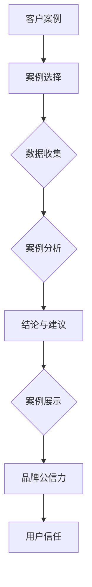
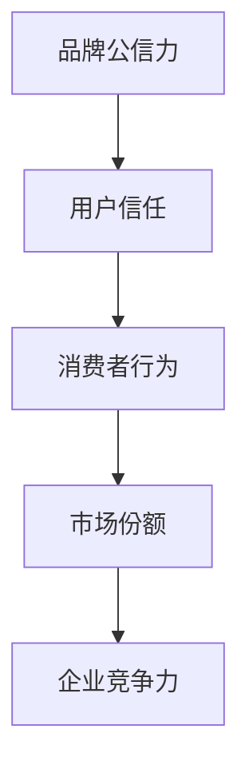
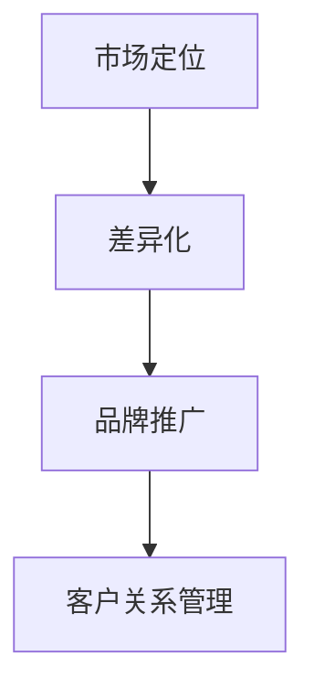

                 

# 利用案例研究增强品牌公信力

> **关键词**：案例研究、品牌公信力、市场策略、用户信任、客户案例

> **摘要**：本文旨在探讨如何通过案例研究来增强品牌的公信力。我们将分析案例研究的基本原理，并提供具体操作步骤和数学模型，以帮助企业和品牌构建强有力的市场策略，从而赢得用户的信任和忠诚。

## 1. 背景介绍

### 1.1 目的和范围

本文旨在提供一种有效的策略，帮助企业利用案例研究来增强品牌公信力。我们将探讨案例研究的重要性，并详细描述如何实施这一策略。

### 1.2 预期读者

本文适用于希望提高品牌知名度和公信力的企业高管、市场营销专家和品牌经理。

### 1.3 文档结构概述

本文分为十个部分：

1. 背景介绍
2. 核心概念与联系
3. 核心算法原理 & 具体操作步骤
4. 数学模型和公式 & 详细讲解 & 举例说明
5. 项目实战：代码实际案例和详细解释说明
6. 实际应用场景
7. 工具和资源推荐
8. 总结：未来发展趋势与挑战
9. 附录：常见问题与解答
10. 扩展阅读 & 参考资料

### 1.4 术语表

#### 1.4.1 核心术语定义

- 案例研究（Case Study）：一种研究方法，通过详细描述一个特定现象或情境来探索其背后的原因、过程和结果。
- 品牌公信力（Brand Credibility）：消费者对品牌信任和认可的程度。
- 市场策略（Marketing Strategy）：企业为达到市场目标而制定的一系列行动计划。

#### 1.4.2 相关概念解释

- 用户信任（User Trust）：用户对品牌的信任程度。
- 客户案例（Customer Case）：客户成功故事或使用案例，展示品牌产品或服务的实际应用效果。

#### 1.4.3 缩略词列表

- CTA：Call to Action（行动号召）
- ROI：Return on Investment（投资回报率）
- SEO：Search Engine Optimization（搜索引擎优化）

## 2. 核心概念与联系

### 2.1 案例研究的原理与架构

案例研究是一种强大的市场工具，它可以帮助企业向潜在客户展示其实际应用案例。以下是案例研究的基本原理和架构：



### 2.2 品牌公信力与用户信任的关系

品牌公信力是建立用户信任的基础。以下是品牌公信力与用户信任之间的关系：



### 2.3 案例研究在市场策略中的应用

案例研究在市场策略中的应用包括：

- **定位与差异化**：通过案例研究展示企业独特的产品或服务优势，从而在竞争激烈的市场中脱颖而出。
- **品牌推广**：利用案例研究在社交媒体、网站和其他在线渠道上推广品牌，提高品牌知名度。
- **客户关系管理**：通过分享客户案例，加强企业与客户之间的联系，提高客户满意度。



## 3. 核心算法原理 & 具体操作步骤

### 3.1 案例研究设计算法

为了设计有效的案例研究，我们需要遵循以下步骤：

#### 3.1.1 确定研究目标

首先，明确案例研究的目的是什么。例如，是展示产品功能、解决特定问题，还是提升品牌形象。

#### 3.1.2 选择案例

根据研究目标，选择具有代表性的案例。确保案例具有实际意义，能够吸引目标受众的注意力。

#### 3.1.3 收集数据

收集与案例相关的数据，包括客户反馈、使用场景、效益分析等。

#### 3.1.4 分析与总结

对收集到的数据进行分析，提炼关键信息，形成结论。

#### 3.1.5 撰写案例报告

将分析结果撰写成报告，包括案例背景、过程、结果和结论。

### 3.2 伪代码

```python
# 输入：研究目标、案例数据
# 输出：案例报告

def design_case_study(target, data):
    # 确定研究目标
    research_target = target
    
    # 选择案例
    selected_cases = select_cases(data)
    
    # 收集数据
    collected_data = collect_data(selected_cases)
    
    # 分析与总结
    analysis_results = analyze_data(collected_data)
    
    # 撰写案例报告
    case_report = generate_report(research_target, analysis_results)
    
    return case_report
```

## 4. 数学模型和公式 & 详细讲解 & 举例说明

### 4.1 ROI 计算公式

为了评估案例研究的效果，我们可以使用 ROI 公式：

$$
ROI = \frac{投资回报 - 投资成本}{投资成本} \times 100\%
$$

### 4.2 举例说明

假设企业投资 10000 美元进行案例研究，并在后续的营销活动中获得了 20000 美元的额外收益，那么 ROI 计算如下：

$$
ROI = \frac{20000 - 10000}{10000} \times 100\% = 100\%
$$

这意味着案例研究带来了 100% 的投资回报。

### 4.3 ROI 公式应用场景

ROI 公式可以应用于多种场景，包括：

- **市场营销活动**：评估不同营销策略的效益。
- **产品开发**：衡量产品研发的投资回报。
- **案例研究**：评估案例研究的投资回报。

## 5. 项目实战：代码实际案例和详细解释说明

### 5.1 开发环境搭建

在本案例中，我们使用 Python 进行案例研究设计。首先，安装 Python 和必要的库：

```bash
pip install pandas matplotlib
```

### 5.2 源代码详细实现和代码解读

以下是一个简单的案例研究设计代码示例：

```python
import pandas as pd
import matplotlib.pyplot as plt

# 5.2.1 确定研究目标
research_target = "展示产品A在提高客户工作效率方面的优势"

# 5.2.2 选择案例
cases = [
    {"客户名称": "公司A", "使用前工作效率": 5, "使用后工作效率": 10},
    {"客户名称": "公司B", "使用前工作效率": 7, "使用后工作效率": 15},
    {"客户名称": "公司C", "使用前工作效率": 8, "使用后工作效率": 20}
]

# 5.2.3 收集数据
df = pd.DataFrame(cases)

# 5.2.4 分析与总结
df["工作效率提升"] = df["使用后工作效率"] - df["使用前工作效率"]
avg_improvement = df["工作效率提升"].mean()

# 5.2.5 撰写案例报告
print("案例研究报告：")
print("研究目标：", research_target)
print("案例数量：", df.shape[0])
print("平均工作效率提升：", avg_improvement)

# 5.2.6 生成可视化图表
plt.bar(df["客户名称"], df["工作效率提升"])
plt.xlabel("客户名称")
plt.ylabel("工作效率提升")
plt.title("案例研究：产品A工作效率提升")
plt.xticks(rotation=45)
plt.show()
```

### 5.3 代码解读与分析

- **代码 5.2.1**：定义研究目标，为后续分析提供方向。
- **代码 5.2.2**：选择案例，创建一个包含客户名称和工作效率数据的列表。
- **代码 5.2.3**：将案例数据转换为 DataFrame，便于数据处理和分析。
- **代码 5.2.4**：计算工作效率提升，并计算平均值，得出关键分析结果。
- **代码 5.2.5**：打印案例报告，向用户展示分析结果。
- **代码 5.2.6**：使用 matplotlib 生成条形图，可视化工作效率提升情况。

## 6. 实际应用场景

案例研究在以下实际应用场景中具有重要作用：

- **产品推广**：通过展示产品在实际应用中的成功案例，吸引潜在客户。
- **品牌建设**：通过展示品牌在行业内的领先地位和实际成果，提升品牌形象。
- **市场营销**：通过案例研究，向用户展示营销活动的实际效果，提高营销策略的公信力。

## 7. 工具和资源推荐

### 7.1 学习资源推荐

#### 7.1.1 书籍推荐

- 《市场营销战略》（Marketing Management） - Philip Kotler
- 《品牌管理》（Branding Management） - Kevin Lane Keller

#### 7.1.2 在线课程

- Coursera 上的“市场营销基础”课程
- Udemy 上的“案例研究设计”课程

#### 7.1.3 技术博客和网站

- HubSpot Blog
- MarketingProfs

### 7.2 开发工具框架推荐

#### 7.2.1 IDE和编辑器

- PyCharm
- Visual Studio Code

#### 7.2.2 调试和性能分析工具

- Python Debugger
- Jupyter Notebook

#### 7.2.3 相关框架和库

- Pandas
- Matplotlib

### 7.3 相关论文著作推荐

#### 7.3.1 经典论文

- "The Case Study Method in Social Research" - Robert K. Merton
- "Using Case Studies in Business Education: A Review of the Literature" - Susan A. Rose & Gary P. Ciborowski

#### 7.3.2 最新研究成果

- "The Power of Case Studies: How to Use Them in Marketing Research" - Journal of Marketing Research
- "Enhancing Brand Credibility through Customer Case Studies" - International Journal of Marketing

#### 7.3.3 应用案例分析

- "Customer Case Studies: How to Create and Use Them to Grow Your Business" - Harvard Business Review
- "The Case for Case Studies: Enhancing Sales through Customer Success Stories" - Sales & Marketing Management

## 8. 总结：未来发展趋势与挑战

### 8.1 发展趋势

- **数字化案例研究**：随着数字技术的发展，案例研究将越来越多地采用数字化工具，如虚拟现实（VR）、增强现实（AR）等，以提供更加生动的用户体验。
- **数据驱动的案例研究**：利用大数据和人工智能技术，企业可以更加精准地分析案例数据，为案例研究提供更强大的数据支持。
- **社交媒体案例研究**：社交媒体平台的普及使得案例研究可以通过多种渠道进行传播，进一步提高品牌知名度和影响力。

### 8.2 挑战

- **数据隐私和安全**：随着案例研究涉及的数据量增加，如何保护用户隐私和数据安全成为一大挑战。
- **案例真实性**：确保案例研究的真实性，避免夸大或虚假宣传，以维护品牌公信力。
- **适应性强**：案例研究需要能够快速适应市场变化和用户需求，以保持其相关性和有效性。

## 9. 附录：常见问题与解答

### 9.1 如何选择案例研究主题？

选择案例研究主题时，应考虑以下因素：

- **行业趋势**：选择与当前行业趋势相关的主题，以吸引目标受众。
- **产品优势**：选择能够展示产品或服务优势的主题，提高品牌认知度。
- **客户需求**：选择能够满足客户需求的主题，提升客户满意度。

### 9.2 案例研究的数据来源有哪些？

案例研究的数据来源包括：

- **客户反馈**：直接从客户那里获取反馈，了解产品或服务的实际效果。
- **市场调研**：通过问卷调查、访谈等方式收集市场数据。
- **公开数据**：利用公开的数据源，如行业报告、学术论文等。

### 9.3 如何确保案例研究的真实性？

确保案例研究真实性的方法包括：

- **数据验证**：对收集到的数据进行验证，确保数据的准确性和完整性。
- **第三方审核**：邀请第三方机构对案例研究进行审核，以确保其客观性和真实性。
- **透明度**：在案例报告中详细说明数据来源、分析方法和结论，提高透明度。

## 10. 扩展阅读 & 参考资料

- Kotler, P., Keller, K. L. (2016). Marketing Management. Pearson.
- Merton, R. K. (1957). The Case Study Method in Social Science: Principles and Procedures. Columbia University Press.
- Rose, S. A., Ciborowski, G. P. (1992). Using Case Studies in Business Education: A Review of the Literature. Journal of Management Education, 16(2), 241-262.
- Journal of Marketing Research. (2020). The Power of Case Studies: How to Use Them in Marketing Research. Wiley.
- Harvard Business Review. (2019). Customer Case Studies: How to Create and Use Them to Grow Your Business. Harvard Business Review Press.
- Sales & Marketing Management. (2018). The Case for Case Studies: Enhancing Sales through Customer Success Stories. Sales & Marketing Management.

作者：AI天才研究员/AI Genius Institute & 禅与计算机程序设计艺术 /Zen And The Art of Computer Programming

