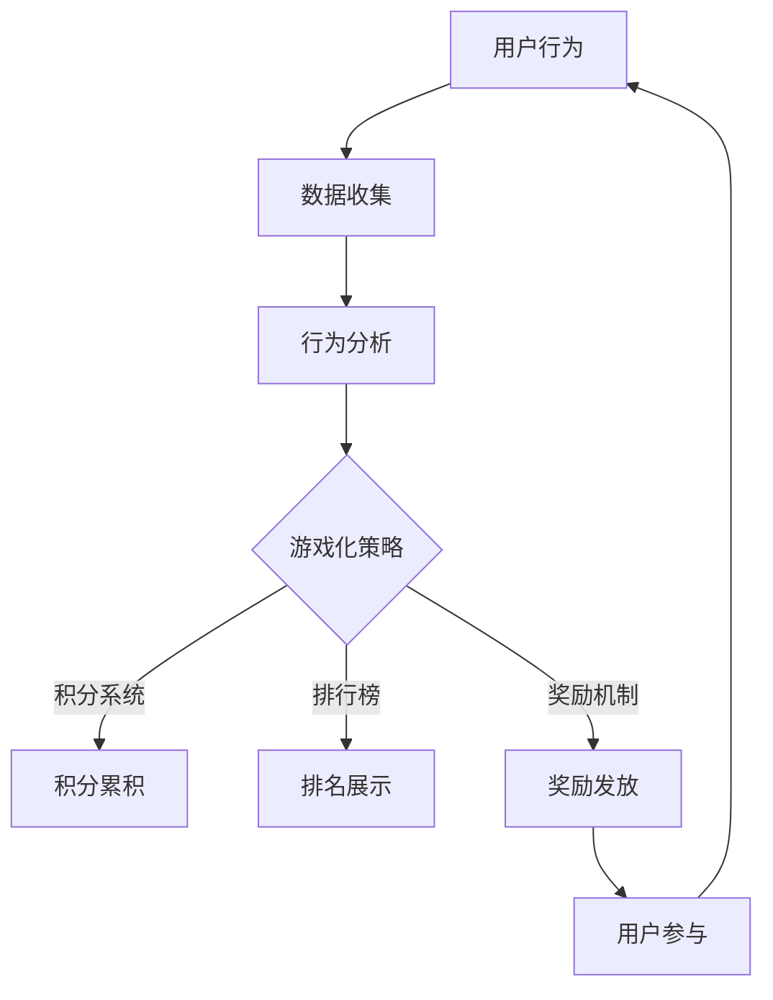

                 

# 利用游戏化机制提升产品使用频率

## 关键词
游戏化、产品使用频率、用户参与度、激励机制、用户行为分析、用户体验优化

## 摘要
本文将探讨如何通过游戏化机制提高产品的使用频率和用户参与度。首先，我们将介绍游戏化的基本概念和原理，接着分析用户行为及其对产品使用频率的影响。在此基础上，本文将详细阐述几种常见的游戏化策略，包括积分系统、排行榜、奖励机制等，并通过实际案例展示如何将这些策略应用于产品开发中。最后，本文还将讨论游戏化机制在实际应用中可能遇到的问题和挑战，并展望其未来发展趋势。

## 1. 背景介绍

### 1.1 目的和范围
随着互联网的普及，市场竞争日益激烈，产品如何吸引并留住用户成为各大企业关注的焦点。游戏化机制作为一种创新的用户激励手段，已被广泛应用于各类软件和平台上。本文旨在探讨游戏化机制在提升产品使用频率方面的作用，通过分析游戏化的原理和策略，为开发者提供实用的参考。

### 1.2 预期读者
本文面向的产品经理、软件开发者以及对用户体验和用户行为分析感兴趣的技术爱好者。希望读者能够通过本文了解到游戏化机制的基本概念和应用策略，从而在实际工作中运用这些知识，提升产品的用户参与度和使用频率。

### 1.3 文档结构概述
本文分为十个部分：背景介绍、核心概念与联系、核心算法原理与具体操作步骤、数学模型和公式、项目实战、实际应用场景、工具和资源推荐、总结、常见问题与解答、扩展阅读与参考资料。读者可以根据自己的需求选择阅读。

### 1.4 术语表

#### 1.4.1 核心术语定义
- **游戏化**：将游戏中的元素和机制应用到非游戏场景中，以提高用户的参与度和满意度。
- **用户参与度**：用户在产品上的活跃程度和投入程度，通常通过用户的活跃度、留存率和转化率等指标来衡量。
- **积分系统**：为用户在产品上的行为或成就分配积分，用户可以用来兑换奖励或提高等级。
- **排行榜**：展示用户在产品上的排名，通常以积分、成就或活跃度为依据。
- **奖励机制**：为用户提供物质或虚拟奖励，以激励其继续使用产品。

#### 1.4.2 相关概念解释
- **用户体验**：用户在使用产品过程中的整体感受，包括产品的易用性、美观性、互动性等方面。
- **用户行为分析**：通过对用户在产品上的行为数据进行分析，了解用户需求和行为模式，以优化产品设计和功能。

#### 1.4.3 缩略词列表
- **UI**：用户界面（User Interface）
- **UX**：用户体验（User Experience）
- **CRM**：客户关系管理（Customer Relationship Management）
- **A/B测试**：对照试验，通过比较不同版本的页面或功能，分析哪种版本更受用户欢迎。

## 2. 核心概念与联系

### 2.1 游戏化机制的基本原理
游戏化机制源于游戏设计，其核心在于利用游戏中的激励机制，如积分、等级、奖励等，来引导和激励用户参与非游戏场景。游戏化机制的关键在于：
1. **目标明确**：设定清晰的用户目标，让用户知道他们正在做什么，以及如何达成目标。
2. **反馈及时**：通过即时反馈，让用户了解自己的进步和成就，增加用户的参与感和满足感。
3. **挑战与奖励**：设置合理的挑战，让用户感受到成长和进步，同时通过奖励来激励用户持续参与。

### 2.2 用户行为分析
用户行为分析是游戏化机制的核心环节，通过对用户在产品上的行为数据进行分析，可以了解用户的需求和行为模式，从而设计出更有效的游戏化策略。用户行为分析主要包括以下几个方面：
- **活跃度分析**：分析用户在产品上的活跃程度，包括登录次数、使用时长、页面访问量等。
- **留存率分析**：分析用户在一定时间内的留存情况，了解产品的用户生命周期。
- **转化率分析**：分析用户在产品上的转化行为，如注册、购买、参与活动等。

### 2.3 游戏化与用户体验的关系
游戏化机制对用户体验有着深远的影响。一方面，游戏化机制可以增加用户的参与度和满意度，提高产品的使用频率；另一方面，不当的游戏化设计可能导致用户反感，甚至损害用户体验。因此，在设计游戏化机制时，需要充分考虑用户体验，确保游戏化元素与产品整体风格和目标一致。

### 2.4 Mermaid 流程图

该流程图展示了用户行为数据通过游戏化策略转化为用户参与度，形成了一个闭环。

## 3. 核心算法原理 & 具体操作步骤

### 3.1 积分系统算法原理
积分系统是游戏化机制中最常见的策略之一。其基本原理为：
1. **积分分配**：根据用户在产品上的行为（如登录、分享、购买等）分配相应积分。
2. **积分累积**：用户积累的积分可以用来兑换奖励或提升等级。
3. **积分消耗**：用户在使用积分兑换奖励或提升等级时，积分会被消耗。

### 3.2 积分系统操作步骤
1. **设定积分规则**：明确每个行为的积分分配，确保规则简单易懂，鼓励用户积极参与。
2. **积分累积**：用户每次完成任务或行为，系统自动为其分配相应积分。
3. **积分兑换**：用户可以查看积分余额，并选择兑换相应的奖励或提升等级。
4. **积分消耗**：用户在使用积分时，系统会自动扣除相应积分。

### 3.3 伪代码实现
```python
# 积分系统伪代码

# 设定积分规则
积分规则 = {
    "登录": 10,
    "分享": 20,
    "购买": 50
}

# 积分累积
def 累积积分(用户行为):
    积分 += 积分规则[用户行为]

# 积分兑换
def 兑换积分(用户积分，兑换项目):
    如果 用户积分 >= 兑换项目所需积分:
        用户积分 -= 兑换项目所需积分
        发放奖励(兑换项目)
    否则:
        提示用户积分不足

# 积分消耗
def 消耗积分(用户积分，消耗积分):
    用户积分 -= 消耗积分
```

## 4. 数学模型和公式 & 详细讲解 & 举例说明

### 4.1 数学模型和公式

#### 4.1.1 积分累积模型
积分累积模型可以用以下公式表示：
$$
I = \sum_{i=1}^{n} c_i \cdot x_i
$$
其中，$I$为总积分，$c_i$为行为$i$的积分系数，$x_i$为行为$i$的次数。

#### 4.1.2 积分兑换模型
积分兑换模型可以用以下公式表示：
$$
R = \sum_{i=1}^{m} r_i \cdot y_i
$$
其中，$R$为兑换的奖励，$r_i$为奖励$i$的积分系数，$y_i$为用户选择的奖励$i$的个数。

### 4.2 详细讲解和举例说明

#### 4.2.1 积分累积模型
假设一个产品设定了以下积分规则：
- 登录：每次登录获得10积分
- 分享：每次分享获得20积分
- 购买：每次购买获得50积分

用户A在一天内登录了3次，分享了一次，购买了1件商品，那么他的总积分为：
$$
I = 3 \cdot 10 + 1 \cdot 20 + 1 \cdot 50 = 130
$$

#### 4.2.2 积分兑换模型
假设一个产品提供了以下奖励：
- 50积分兑换1张优惠券
- 100积分兑换1张礼品卡

用户A有130积分，他想要兑换优惠券和礼品卡，那么他可以选择：
- 兑换2张优惠券，消耗100积分，剩余30积分
- 兑换1张礼品卡，消耗100积分

用户A选择兑换2张优惠券，那么他的积分余额为30积分。

## 5. 项目实战：代码实际案例和详细解释说明

### 5.1 开发环境搭建
在本案例中，我们将使用Python语言开发一个简单的积分系统。为了便于理解和运行，我们使用虚拟环境来搭建开发环境。

1. 安装Python（建议使用Python 3.8或以上版本）
2. 安装虚拟环境工具（如virtualenv或conda）
3. 创建虚拟环境
    ```bash
    python -m venv venv
    ```
4. 激活虚拟环境
    ```bash
    source venv/bin/activate  # 对于Linux和Mac
    venv\Scripts\activate     # 对于Windows
    ```
5. 安装必需的Python库（如requests、json等）

### 5.2 源代码详细实现和代码解读
#### 5.2.1 源代码实现
```python
# 积分系统源代码

# 导入必需的库
import json

# 设定积分规则
积分规则 = {
    "登录": 10,
    "分享": 20,
    "购买": 50
}

# 用户积分记录
用户积分 = {}

# 累积积分
def 累积积分(用户ID, 用户行为):
    如果 用户积分[用户ID] is not None:
        用户积分[用户ID] += 积分规则[用户行为]
    否则:
        用户积分[用户ID] = 积分规则[用户行为]

# 获取用户积分
def 获取积分(用户ID):
    如果 用户积分[用户ID] is not None:
        return 用户积分[用户ID]
    否则:
        return 0

# 积分兑换
def 兑换积分(用户ID, 兑换项目):
    用户当前积分 = 获取积分(用户ID)
    如果 用户当前积分 >= 兑换项目所需积分:
        用户积分[用户ID] -= 兑换项目所需积分
        return "兑换成功"
    否则:
        return "积分不足"

# 主函数
def 主程序():
    用户行为 = input("请输入用户行为（登录、分享、购买）：")
    用户ID = input("请输入用户ID：")
    累积积分(用户ID, 用户行为)
    用户当前积分 = 获取积分(用户ID)
    print(f"{用户ID}的当前积分为：{用户当前积分}")

    兑换项目 = input("请输入兑换项目（优惠券、礼品卡）：")
    兑换积分所需积分 = 50 if 兑换项目 == "优惠券" else 100
    兑换结果 = 兑换积分(用户ID, 兑换项目)
    print(f"{用户ID}的兑换结果：{兑换结果}")

# 运行主程序
主程序()
```

#### 5.2.2 代码解读
- **导入库**：导入必需的库，如json用于处理JSON数据。
- **设定积分规则**：定义一个字典，存储每个行为的积分值。
- **用户积分记录**：定义一个字典，存储每个用户的积分记录。
- **累积积分**：根据用户行为累积积分，更新用户积分记录。
- **获取用户积分**：根据用户ID获取用户的当前积分。
- **积分兑换**：判断用户积分是否足够兑换指定项目，并更新用户积分记录。
- **主程序**：通过用户输入，模拟用户行为和积分兑换过程。

### 5.3 代码解读与分析
本案例中的积分系统实现了一个简单的积分累积和兑换功能。在实际应用中，可以扩展功能，如添加排行榜、积分过期机制等。以下是对代码的进一步分析：
- **可扩展性**：积分规则和用户积分记录可以通过配置文件或数据库进行管理，提高系统的可扩展性。
- **安全性**：对于用户的积分操作，建议加入权限验证机制，确保只有授权用户才能执行积分累积和兑换操作。
- **用户体验**：可以通过界面展示用户积分和兑换结果，提高用户的参与感和满意度。

## 6. 实际应用场景

### 6.1 社交媒体平台
社交媒体平台如Facebook、Instagram等通过游戏化机制鼓励用户发布内容、评论、点赞等。这些平台通常会设置积分系统、排行榜和奖励机制，以激励用户增加互动和活跃度。

- **积分系统**：用户每进行一项互动（如点赞、评论、分享）都可以获得一定积分，积分可以用来兑换虚拟礼物或特权。
- **排行榜**：根据用户的互动积分或活跃度，平台会设立排行榜，激励用户争取更高的排名。
- **奖励机制**：平台会定期举行活动，奖励积分排名靠前的用户，如免费会员、VIP特权等。

### 6.2 电子商务平台
电子商务平台如Amazon、淘宝等通过游戏化机制提高用户购买率和留存率。这些平台会采用积分系统、优惠券、会员等级等策略。

- **积分系统**：用户每完成一次购买或参与活动都可以获得积分，积分可以兑换优惠券或礼品卡。
- **优惠券**：平台会定期发放优惠券，鼓励用户购买更多商品。
- **会员等级**：用户根据消费金额或积分可以提升会员等级，享受更多优惠和特权。

### 6.3 健康管理应用
健康管理应用如MyFitnessPal、Nike Training Club等通过游戏化机制激励用户保持健康习惯。这些应用会采用积分系统、挑战、排行榜等策略。

- **积分系统**：用户每天记录健康数据（如步数、饮食）都可以获得积分，积分可以兑换虚拟奖励或实物奖励。
- **挑战**：用户可以参与平台设定的健康挑战，如一周内走满10000步，挑战成功可以获得额外积分。
- **排行榜**：用户可以在平台内与其他用户比拼健康数据，激励用户保持积极状态。

### 6.4 教育学习平台
教育学习平台如Khan Academy、Coursera等通过游戏化机制提高学生的学习积极性和参与度。

- **积分系统**：学生每完成一个课程或练习都可以获得积分，积分可以用来解锁更多课程或特权。
- **排行榜**：学生可以根据课程进度、考试成绩等排名，激励学生争取更好的成绩。
- **奖励机制**：平台会定期举办活动，奖励学习积极的学生，如奖学金、证书等。

## 7. 工具和资源推荐

### 7.1 学习资源推荐

#### 7.1.1 书籍推荐
- **《游戏化革命》**：作者Gabe Zichermann，详细介绍了游戏化机制在各个领域的应用。
- **《用户体验要素》**：作者Jesse James Garrett，阐述了用户体验设计的基本要素。

#### 7.1.2 在线课程
- **Coursera**：《游戏化设计》：介绍游戏化在学习和工作中的应用。
- **Udemy**：《游戏化与行为设计》：深入讲解游戏化机制的设计和实践。

#### 7.1.3 技术博客和网站
- **Smashing Magazine**：提供关于用户体验和游戏化的高质量文章。
- **UX Collective**：专注于用户体验设计的博客，也有许多关于游戏化的文章。

### 7.2 开发工具框架推荐

#### 7.2.1 IDE和编辑器
- **Visual Studio Code**：一款功能强大、高度可定制化的代码编辑器。
- **PyCharm**：一款专业的Python IDE，支持多种开发语言。

#### 7.2.2 调试和性能分析工具
- **Postman**：用于API调试和性能测试。
- **JMeter**：一款开源的性能测试工具，适用于各种类型的Web应用。

#### 7.2.3 相关框架和库
- **Flask**：一款轻量级的Python Web框架，适用于快速开发Web应用。
- **Django**：一款全栈Web开发框架，具有强大的后台管理系统。

### 7.3 相关论文著作推荐

#### 7.3.1 经典论文
- **"Gamification in Education: A Systematic Review"**：对游戏化在教育领域的应用进行了全面回顾。
- **"The Game of Power: A Research Report on Social Power in Games"**：探讨了游戏化中的社会影响力。

#### 7.3.2 最新研究成果
- **"Gamification in Healthcare: A Review of Current Applications and Future Opportunities"**：总结了游戏化在医疗健康领域的最新应用。
- **"Gamification in Marketing: A Systematic Review of Research and Applications"**：分析了游戏化在市场营销中的研究成果。

#### 7.3.3 应用案例分析
- **"Case Study: Nike+ Run Club"**：分析Nike如何通过游戏化机制提升用户参与度和满意度。
- **"Case Study: Duolingo Language Learning App"**：探讨Duolingo如何利用游戏化提高语言学习效果。

## 8. 总结：未来发展趋势与挑战

### 8.1 发展趋势
1. **个性化游戏化**：随着用户数据的积累和分析技术的进步，游戏化机制将更加个性化，针对不同用户的特点和需求进行定制。
2. **跨平台整合**：游戏化机制将不再局限于单一平台，而是实现跨平台整合，为用户提供一致的游戏化体验。
3. **增强现实（AR）与游戏化**：随着AR技术的发展，游戏化将结合AR技术，提供更加沉浸式和互动的用户体验。
4. **游戏化与健康**：游戏化与健康管理的结合将成为趋势，通过游戏化机制激励用户保持健康生活方式。

### 8.2 挑战
1. **用户体验平衡**：设计游戏化机制时，需要平衡用户的参与感和用户体验，避免过度游戏化导致用户反感。
2. **数据隐私与安全**：游戏化机制通常需要收集用户行为数据，如何在确保用户隐私和安全的同时，有效利用这些数据，是面临的一大挑战。
3. **持续创新**：游戏化机制需要不断更新和创新，以适应用户需求和市场变化，这对开发者和企业来说是一个持续的挑战。

## 9. 附录：常见问题与解答

### 9.1 问题1：游戏化机制是否适用于所有产品？
**解答**：游戏化机制并非适用于所有产品。它主要适用于那些需要用户持续参与和互动的产品，如社交媒体、电子商务、健康管理等。对于一些功能单一、用户互动较少的产品，游戏化机制可能并不适用。

### 9.2 问题2：如何设计有效的积分系统？
**解答**：设计有效的积分系统需要考虑以下几个方面：
- **明确积分规则**：确保积分规则简单易懂，鼓励用户积极参与。
- **合理分配积分**：根据用户行为的重要性和频率，合理分配积分。
- **积分用途多样化**：提供多种积分兑换选择，提高用户参与度。
- **持续优化**：根据用户反馈和数据分析，不断优化积分系统。

### 9.3 问题3：游戏化机制会损害用户体验吗？
**解答**：设计不当的游戏化机制确实可能损害用户体验。因此，在设计游戏化机制时，需要充分考虑用户体验，确保游戏化元素与产品整体风格和目标一致，避免过度游戏化。

## 10. 扩展阅读 & 参考资料

### 10.1 扩展阅读
- **《游戏化设计实战》**：作者Eric V. Delano，详细介绍了游戏化设计的方法和实践。
- **《用户体验要素》**：作者Jesse James Garrett，深入讲解了用户体验设计的基本原理。

### 10.2 参考资料
- **Gabe Zichermann**：[游戏化革命](https://www.gabezichermann.com/)
- **Smashing Magazine**：[游戏化文章](https://www.smashingmagazine.com/category/user-experience-gamification/)
- **UX Collective**：[游戏化文章](https://uxdesign.cc/topics/gamification)

## 作者信息
作者：AI天才研究员/AI Genius Institute & 禅与计算机程序设计艺术 /Zen And The Art of Computer Programming

