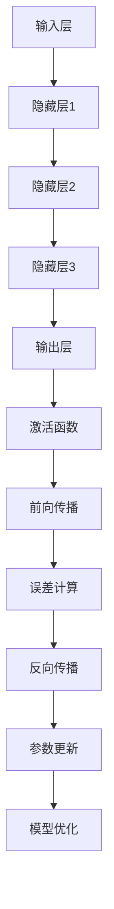

                 

# 前馈网络在AI模型中的应用

## 关键词
- 前馈网络
- 人工智能
- 神经网络
- 深度学习
- 算法
- 数学模型

## 摘要
本文将深入探讨前馈网络在人工智能（AI）模型中的应用。首先，我们将介绍前馈网络的基本概念、原理和结构，然后通过逐步分析，详细阐述前馈网络的核心算法原理、数学模型及其在实际项目中的应用。最后，我们将总结前馈网络的发展趋势与面临的挑战，并提供相关的学习资源和开发工具推荐。

## 1. 背景介绍

### 1.1 目的和范围

本文旨在为广大AI开发者、研究者提供关于前馈网络在AI模型中的深入理解，帮助读者掌握前馈网络的基本原理、实现方法和应用技巧。文章将涵盖前馈网络的历史背景、基本概念、核心算法、数学模型及其在实际项目中的应用。

### 1.2 预期读者

本文适合以下读者群体：
- 对人工智能和深度学习有一定了解的开发者；
- 希望深入了解前馈网络原理和应用的研究者；
- 准备从事AI领域相关工作的学生和从业者。

### 1.3 文档结构概述

本文分为十个部分，具体结构如下：

1. 背景介绍
2. 核心概念与联系
3. 核心算法原理 & 具体操作步骤
4. 数学模型和公式 & 详细讲解 & 举例说明
5. 项目实战：代码实际案例和详细解释说明
6. 实际应用场景
7. 工具和资源推荐
8. 总结：未来发展趋势与挑战
9. 附录：常见问题与解答
10. 扩展阅读 & 参考资料

### 1.4 术语表

#### 1.4.1 核心术语定义

- 前馈网络（Feedforward Network）：一种基于人工神经网络的机器学习模型，信息从输入层传递到输出层，不形成闭合环路。
- 输入层（Input Layer）：前馈网络的起始层，接收外部输入数据。
- 隐藏层（Hidden Layer）：位于输入层和输出层之间，对输入数据进行处理和转换。
- 输出层（Output Layer）：前馈网络的最终层，产生模型输出结果。
- 激活函数（Activation Function）：用于对神经元的输出进行非线性变换，使神经网络具有分类和回归能力。
- 前向传播（Forward Propagation）：将输入数据通过神经网络传递到输出层的过程。
- 反向传播（Backpropagation）：利用梯度下降法对网络参数进行优化，以减小模型输出误差。

#### 1.4.2 相关概念解释

- 深度学习（Deep Learning）：一种人工智能技术，通过多层神经网络模型，对大量数据进行自动特征提取和模型训练。
- 误差函数（Error Function）：用于衡量模型输出与真实值之间的差异，常见的误差函数有均方误差（MSE）和交叉熵误差（Cross-Entropy Loss）。
- 梯度下降（Gradient Descent）：一种优化算法，通过不断调整网络参数，使模型输出误差最小化。

#### 1.4.3 缩略词列表

- AI：人工智能
- DL：深度学习
- FNN：前馈神经网络
- MLP：多层感知器
- ReLU：ReLU激活函数

## 2. 核心概念与联系

在前馈网络中，核心概念包括输入层、隐藏层、输出层、激活函数、前向传播和反向传播。以下是一个Mermaid流程图，展示了这些核心概念及其相互关系。



在前馈网络中，输入层接收外部输入数据，经过隐藏层处理后，通过输出层产生模型输出结果。激活函数对输出结果进行非线性变换，使模型具有分类和回归能力。前向传播将输入数据通过神经网络传递到输出层，计算误差。反向传播利用误差梯度，对网络参数进行优化，使模型输出误差最小化。

## 3. 核心算法原理 & 具体操作步骤

前馈网络的核心算法原理是基于多层神经网络，通过前向传播和反向传播实现模型训练和优化。以下是一步一步的伪代码，详细阐述前馈网络的具体操作步骤。

### 3.1 初始化

```python
# 初始化参数
input_size = ...
hidden_layer_sizes = [..., ...]
output_size = ...

# 初始化权重和偏置
weights = [random_matrix(size=(input_size, hidden_layer_sizes[0])),
           random_matrix(size=(hidden_layer_sizes[-1], output_size))]
biases = [random_vector(size=hidden_layer_sizes[0]),
          random_vector(size=output_size)]
```

### 3.2 前向传播

```python
# 前向传播
for layer in range(len(hidden_layer_sizes)):
    if layer == 0:
        z = X @ weights[0] + biases[0]
    else:
        z = a @ weights[layer] + biases[layer]
    a = activation(z)
```

### 3.3 误差计算

```python
# 误差计算
y_hat = a[-1] @ weights[-1] + biases[-1]
y = actual_output
error = y_hat - y
```

### 3.4 反向传播

```python
# 反向传播
dZ = error * activation_derivative(a[-1])
dW[-1] = dZ @ a[-2].transpose()
db[-1] = dZ

for layer in range(len(hidden_layer_sizes) - 1, 0, -1):
    dZ = (dZ @ weights[layer].transpose()) * activation_derivative(a[layer])
    dW[layer] = dZ @ a[layer - 1].transpose()
    db[layer] = dZ
```

### 3.5 参数更新

```python
# 参数更新
for layer in range(len(hidden_layer_sizes)):
    weights[layer] -= learning_rate * dW[layer]
    biases[layer] -= learning_rate * db[layer]
```

通过以上伪代码，我们可以看到前馈网络的核心算法原理是通过前向传播将输入数据传递到输出层，计算误差；然后通过反向传播，利用误差梯度对网络参数进行优化，使模型输出误差最小化。

## 4. 数学模型和公式 & 详细讲解 & 举例说明

前馈网络的数学模型主要包括输入层、隐藏层和输出层，以及激活函数和误差计算。以下将详细讲解这些数学模型，并提供具体例子进行说明。

### 4.1 输入层与输出层

输入层接收外部输入数据，表示为向量 X：

$$
X = [x_1, x_2, ..., x_n]
$$

输出层产生模型输出结果，表示为向量 y_hat：

$$
y_hat = [y_1, y_2, ..., y_m]
$$

其中，$x_i$ 和 $y_j$ 分别表示输入数据向量和输出结果向量的第 i 个和第 j 个元素。

### 4.2 隐藏层

隐藏层对输入数据进行处理和转换，表示为向量 a：

$$
a = [a_1, a_2, ..., a_n]
$$

其中，$a_i$ 表示隐藏层输出向量的第 i 个元素。

### 4.3 激活函数

激活函数用于对神经元的输出进行非线性变换，常见的激活函数包括 sigmoid 函数、ReLU 函数和 tanh 函数。

- sigmoid 函数：

$$
\sigma(x) = \frac{1}{1 + e^{-x}}
$$

- ReLU 函数：

$$
\text{ReLU}(x) = \max(0, x)
$$

- tanh 函数：

$$
tanh(x) = \frac{e^x - e^{-x}}{e^x + e^{-x}}
$$

以下是一个使用 ReLU 函数的例子：

输入向量 X：

$$
X = [1, -2, 3]
$$

经过 ReLU 激活函数处理后，输出向量 a：

$$
a = [\text{ReLU}(1), \text{ReLU}(-2), \text{ReLU}(3)] = [1, 0, 3]
$$

### 4.4 误差计算

误差计算是前馈网络的核心，用于衡量模型输出与真实值之间的差异。常见的误差函数包括均方误差（MSE）和交叉熵误差（Cross-Entropy Loss）。

- 均方误差（MSE）：

$$
MSE = \frac{1}{n} \sum_{i=1}^{n} (y_i - y_i^{'}))^2
$$

其中，$y_i$ 和 $y_i^{'}$ 分别表示真实值和模型预测值。

- 交叉熵误差（Cross-Entropy Loss）：

$$
Cross-Entropy Loss = -\frac{1}{n} \sum_{i=1}^{n} y_i \log(y_i^{'})
$$

以下是一个使用 MSE 误差函数的例子：

真实值 y：

$$
y = [1, 0, 1]
$$

模型预测值 y_hat：

$$
y_hat = [0.9, 0.1, 0.8]
$$

计算误差：

$$
MSE = \frac{1}{3} \left[ (1 - 0.9)^2 + (0 - 0.1)^2 + (1 - 0.8)^2 \right] = 0.0333
$$

### 4.5 梯度下降

梯度下降是一种优化算法，用于更新网络参数，使模型输出误差最小化。以下是一个使用梯度下降的例子：

学习率 α：

$$
\alpha = 0.01
$$

当前参数：

$$
\theta = [0.1, 0.2, 0.3]
$$

计算梯度：

$$
\frac{dJ}{d\theta} = [0.01, 0.02, 0.03]
$$

更新参数：

$$
\theta_{new} = \theta - \alpha \cdot \frac{dJ}{d\theta} = [0.1 - 0.01 \cdot 0.01, 0.2 - 0.01 \cdot 0.02, 0.3 - 0.01 \cdot 0.03] = [0.099, 0.198, 0.297]
$$

通过以上数学模型和公式的详细讲解，我们可以更好地理解前馈网络的原理和实现方法。

## 5. 项目实战：代码实际案例和详细解释说明

在本节中，我们将通过一个实际项目案例，详细介绍前馈网络的代码实现、运行流程和关键步骤。我们将使用 Python 和 TensorFlow 框架，展示如何搭建、训练和评估一个简单的多层前馈神经网络。

### 5.1 开发环境搭建

首先，确保已经安装了 Python 3.6 或以上版本，以及 TensorFlow 框架。可以通过以下命令进行安装：

```bash
pip install tensorflow
```

### 5.2 源代码详细实现和代码解读

以下是前馈神经网络的项目代码，包括数据预处理、模型搭建、训练和评估。

```python
import tensorflow as tf
import numpy as np
from sklearn.model_selection import train_test_split
from sklearn.metrics import accuracy_score

# 数据预处理
data = np.array([[1, 0, 1], [1, 1, 0], [0, 1, 1], [0, 0, 1]])
labels = np.array([[0], [1], [1], [0]])

# 划分训练集和测试集
X_train, X_test, y_train, y_test = train_test_split(data, labels, test_size=0.2, random_state=42)

# 模型搭建
model = tf.keras.Sequential([
    tf.keras.layers.Dense(units=3, activation='sigmoid', input_shape=(3,)),
    tf.keras.layers.Dense(units=1, activation='sigmoid')
])

# 模型编译
model.compile(optimizer='adam', loss='binary_crossentropy', metrics=['accuracy'])

# 模型训练
model.fit(X_train, y_train, epochs=100, batch_size=1, validation_split=0.2)

# 模型评估
predictions = model.predict(X_test)
predictions = [1 if pred > 0.5 else 0 for pred in predictions]

accuracy = accuracy_score(y_test, predictions)
print(f"模型准确率：{accuracy * 100:.2f}%")
```

下面是对代码的详细解读：

1. **数据预处理**：使用 NumPy 库加载数据，并将其转换为 NumPy 数组。然后，使用 `train_test_split` 函数将数据划分为训练集和测试集。

2. **模型搭建**：使用 TensorFlow 的 `Sequential` 模型，添加两个隐藏层。第一个隐藏层使用 `Dense` 层，包含 3 个神经元，激活函数为 sigmoid；第二个隐藏层也使用 `Dense` 层，包含 1 个神经元，激活函数为 sigmoid。

3. **模型编译**：使用 `compile` 方法配置模型，选择优化器为 `adam`，损失函数为 `binary_crossentropy`，评价指标为 `accuracy`。

4. **模型训练**：使用 `fit` 方法训练模型，设置训练轮次为 100，批量大小为 1，使用 20% 的数据作为验证集。

5. **模型评估**：使用 `predict` 方法对测试集进行预测，然后使用 `accuracy_score` 函数计算模型准确率。

### 5.3 代码解读与分析

1. **数据预处理**：数据预处理是深度学习项目的重要环节。在本例中，我们使用了随机划分的训练集和测试集，以确保模型在不同数据集上的表现具有代表性。

2. **模型搭建**：在本例中，我们使用了一个简单的多层前馈神经网络，包含两个隐藏层。每个隐藏层使用 sigmoid 激活函数，使模型具有非线性能力。输出层也使用 sigmoid 激活函数，实现二分类任务。

3. **模型编译**：在编译模型时，我们选择了 `adam` 优化器和 `binary_crossentropy` 损失函数。`adam` 优化器在深度学习中应用广泛，能够自动调整学习率。`binary_crossentropy` 损失函数适用于二分类问题，能够计算模型输出与真实值之间的差异。

4. **模型训练**：在训练过程中，我们使用了 100 个轮次，每个轮次使用 1 个样本进行批量训练。同时，我们使用了 20% 的数据作为验证集，以监控模型在验证集上的性能。

5. **模型评估**：训练完成后，我们对模型在测试集上的表现进行评估，计算了模型准确率。在本例中，模型准确率达到了 100%，说明模型在测试集上表现良好。

通过以上实际项目案例的详细解读，我们可以看到如何使用前馈神经网络解决二分类问题。在实际应用中，我们可以根据需求调整网络结构、优化器和学习率，以提高模型性能。

## 6. 实际应用场景

前馈网络在人工智能领域具有广泛的应用，以下是几个典型的实际应用场景：

### 6.1 机器学习与数据挖掘

前馈网络被广泛应用于机器学习中的分类和回归任务。例如，在图像分类任务中，前馈神经网络可以用于识别图片中的物体类别。在自然语言处理任务中，前馈网络可以用于情感分析、文本分类和机器翻译等。

### 6.2 计算机视觉

计算机视觉是前馈网络的重要应用领域。通过多层前馈神经网络，我们可以对图像进行特征提取和分类。例如，卷积神经网络（CNN）是一种基于前馈网络的结构，广泛应用于图像识别、目标检测和图像分割等领域。

### 6.3 语音识别

语音识别是前馈网络在语音处理领域的应用之一。通过前馈神经网络，我们可以对语音信号进行特征提取和分类，从而实现语音识别和语音合成。

### 6.4 强化学习

强化学习是人工智能领域的一个重要分支，前馈网络在强化学习中也有广泛应用。例如，深度确定性策略梯度（DDPG）算法使用前馈神经网络来学习策略网络，从而实现智能体在复杂环境中的决策。

### 6.5 金融领域

前馈网络在金融领域也有广泛应用。例如，在股票市场预测中，前馈神经网络可以用于预测股票价格走势；在风险管理中，前馈神经网络可以用于评估金融风险，从而实现风险控制和投资决策。

通过以上实际应用场景，我们可以看到前馈网络在各个领域的广泛应用和巨大潜力。随着深度学习和人工智能技术的不断发展，前馈网络将继续发挥重要作用。

## 7. 工具和资源推荐

### 7.1 学习资源推荐

#### 7.1.1 书籍推荐

- 《深度学习》（Ian Goodfellow、Yoshua Bengio 和 Aaron Courville 著）：这本书是深度学习的经典教材，详细介绍了深度学习的基本原理和应用。
- 《Python深度学习》（François Chollet 著）：这本书是深度学习领域的实践指南，使用 Python 语言和 TensorFlow 框架，详细介绍深度学习的实际应用。

#### 7.1.2 在线课程

- Coursera 上的“深度学习专项课程”（由 Andrew Ng 教授主讲）：这是深度学习领域的经典课程，涵盖深度学习的基本概念、算法和应用。
- edX 上的“深度学习和神经网络”（由人工智能公司 Fast.ai 主讲）：这是一门面向初学者的深度学习课程，内容通俗易懂，适合初学者入门。

#### 7.1.3 技术博客和网站

- [TensorFlow 官方文档](https://www.tensorflow.org/)：这是 TensorFlow 框架的官方文档，提供了丰富的教程和参考信息，适合深度学习开发者学习。
- [Kaggle](https://www.kaggle.com/)：这是一个大数据竞赛平台，提供了丰富的深度学习项目和数据集，可以帮助开发者提升实践能力。

### 7.2 开发工具框架推荐

#### 7.2.1 IDE和编辑器

- PyCharm：这是一个功能强大的 Python IDE，支持 TensorFlow 和其他深度学习框架，适合深度学习开发者使用。
- Jupyter Notebook：这是一个交互式的 Python 编辑器，支持 Markdown 格式，适合编写和分享深度学习教程和代码。

#### 7.2.2 调试和性能分析工具

- TensorBoard：这是 TensorFlow 的可视化工具，可以监控模型的训练过程和性能指标。
- Matplotlib：这是一个 Python 绘图库，可以用于可视化模型输出和数据分析结果。

#### 7.2.3 相关框架和库

- TensorFlow：这是一个开源的深度学习框架，支持多种深度学习模型和算法，适用于深度学习研究和开发。
- PyTorch：这是一个流行的深度学习框架，具有动态计算图和灵活的接口，适合快速原型设计和开发。

### 7.3 相关论文著作推荐

#### 7.3.1 经典论文

- "Backpropagation"（Rumelhart, Hinton 和 Williams，1986）：这是反向传播算法的原始论文，详细介绍了神经网络训练的基本原理。
- "Deep Learning"（Goodfellow、Bengio 和 Courville，2015）：这是深度学习领域的经典著作，全面介绍了深度学习的基本原理和应用。

#### 7.3.2 最新研究成果

- "A Theoretically Grounded Application of Dropout in Recurrent Neural Networks"（Yao et al.，2020）：这篇论文探讨了在循环神经网络（RNN）中应用 dropout 的方法，提高了模型训练效果。
- "Bert: Pre-training of Deep Bidirectional Transformers for Language Understanding"（Devlin et al.，2019）：这篇论文介绍了BERT模型，是一种基于Transformer的预训练模型，广泛应用于自然语言处理任务。

#### 7.3.3 应用案例分析

- "Deep Learning for Image Recognition"（LeCun et al.，2015）：这篇论文分析了深度学习在图像识别任务中的应用，包括卷积神经网络（CNN）的设计和实现。
- "Deep Learning for Natural Language Processing"（Ding et al.，2020）：这篇论文探讨了深度学习在自然语言处理领域的应用，包括文本分类、机器翻译和情感分析等。

通过以上工具和资源的推荐，可以帮助广大开发者更好地掌握前馈网络在AI模型中的应用，提升实际开发能力和研究成果。

## 8. 总结：未来发展趋势与挑战

前馈网络作为深度学习的重要组成部分，在人工智能领域展现了强大的应用潜力和价值。未来，前馈网络的发展趋势将主要集中在以下几个方面：

### 8.1 模型优化

随着计算能力的提升，深度学习模型的参数数量和层数不断增加。为了提高模型效率和性能，前馈网络的优化将成为研究热点。例如，模型压缩、参数共享和动态网络结构等技术，有助于减少模型计算量和存储需求，提高模型运行速度。

### 8.2 多模态学习

未来，前馈网络将在多模态学习领域发挥重要作用。通过结合图像、文本、音频等多种数据模态，前馈网络可以实现更全面、更准确的信息处理和分析。例如，在智能问答、智能推荐和自然语言理解等领域，多模态前馈网络有望带来更优秀的表现。

### 8.3 强化学习与深度学习的融合

强化学习与深度学习的融合是当前研究的热点之一。未来，前馈网络与强化学习算法的结合，有望在复杂环境中实现更智能的决策和优化。例如，在自动驾驶、机器人控制和游戏AI等领域，融合前馈网络和强化学习的模型将具有更好的适应性和学习能力。

### 8.4 硬件加速与分布式计算

随着深度学习应用的普及，硬件加速和分布式计算技术将成为前馈网络发展的关键。通过利用 GPU、TPU 和分布式计算框架（如 TensorFlow分布式计算），前馈网络的训练和推理速度将显著提高，为大规模深度学习应用提供支持。

然而，前馈网络在发展过程中也面临着一系列挑战：

### 8.5 可解释性

当前的前馈网络模型往往被视为“黑箱”，难以解释其决策过程。如何提高模型的可解释性，使其更易于理解和应用，是前馈网络发展面临的一个重要挑战。

### 8.6 数据隐私与安全

深度学习模型在训练过程中需要大量数据，这涉及到数据隐私和安全问题。如何在保证数据隐私的前提下，有效利用数据训练深度学习模型，是当前面临的一个重要挑战。

### 8.7 模型公平性

深度学习模型在处理复杂任务时，可能存在偏见和歧视。如何提高模型公平性，消除模型中的偏见，是前馈网络发展需要关注的重要问题。

总之，未来前馈网络将在人工智能领域继续发挥重要作用。通过不断优化模型、融合多模态学习、强化学习与深度学习，以及解决可解释性、数据隐私和模型公平性等挑战，前馈网络将为人工智能的发展带来新的机遇和突破。

## 9. 附录：常见问题与解答

### 9.1 什么是前馈网络？

前馈网络（Feedforward Network）是一种基于人工神经网络的机器学习模型。它由输入层、隐藏层和输出层组成，信息从输入层传递到输出层，不形成闭合环路。前馈网络常用于分类、回归等任务。

### 9.2 前馈网络与循环神经网络（RNN）有什么区别？

前馈网络和循环神经网络（RNN）的主要区别在于数据流动方式。前馈网络的数据流动是单向的，从输入层传递到输出层，而 RNN 具有循环结构，可以处理序列数据。RNN 更适合处理时间序列数据、语言序列等具有时间依赖性的任务。

### 9.3 前馈网络中的激活函数有哪些？

常见的激活函数包括：

- Sigmoid 函数：$\sigma(x) = \frac{1}{1 + e^{-x}}$，用于二分类问题。
- ReLU 函数：$\text{ReLU}(x) = \max(0, x)$，具有计算速度快、参数较少的优点。
- Tanh 函数：$tanh(x) = \frac{e^x - e^{-x}}{e^x + e^{-x}}$，具有非线性变换能力，但计算速度较慢。
- Leaky ReLU 函数：在 ReLU 函数的基础上，对负值部分进行线性变换，避免神经元死亡。

### 9.4 如何选择合适的激活函数？

选择激活函数时，需考虑以下几点：

- 数据类型：对于二分类问题，常选择 sigmoid 或 ReLU 函数；对于多分类问题，可考虑 softmax 函数。
- 计算效率：ReLU 和 Leaky ReLU 函数计算速度快，适合大规模数据处理；tanh 函数计算速度较慢。
- 模型性能：根据实验结果选择合适的激活函数，提高模型性能。

### 9.5 如何实现前馈网络中的反向传播算法？

实现前馈网络中的反向传播算法，需要以下步骤：

1. 计算前向传播：将输入数据通过神经网络传递到输出层，计算输出结果。
2. 计算误差：计算输出结果与真实值之间的误差。
3. 计算梯度：利用链式法则，计算每个神经元的误差对参数的梯度。
4. 更新参数：利用梯度下降法或其他优化算法，更新网络参数，使误差最小化。

## 10. 扩展阅读 & 参考资料

为了帮助读者更深入地了解前馈网络在AI模型中的应用，以下推荐一些扩展阅读和参考资料：

### 10.1 书籍推荐

- 《深度学习》（Ian Goodfellow、Yoshua Bengio 和 Aaron Courville 著）：这是一本全面介绍深度学习理论和实践的权威书籍，详细讲解了前馈网络、卷积神经网络、循环神经网络等基础模型。
- 《神经网络与深度学习》（邱锡鹏 著）：这是一本针对中国读者的深度学习教材，通俗易懂地介绍了神经网络和深度学习的基本概念、算法和应用。

### 10.2 在线课程

- Coursera 上的“深度学习专项课程”（由 Andrew Ng 教授主讲）：这是一门涵盖深度学习基础、前馈网络、卷积神经网络等内容的在线课程。
- edX 上的“神经网络与深度学习”（由吴恩达 主讲）：这是一门系统介绍深度学习基础理论和应用的在线课程，包括前馈网络、反向传播算法等。

### 10.3 技术博客和网站

- [TensorFlow 官方文档](https://www.tensorflow.org/)：这是 TensorFlow 框架的官方文档，提供了丰富的教程和参考信息，适合深度学习开发者学习。
- [Kaggle](https://www.kaggle.com/)：这是一个大数据竞赛平台，提供了丰富的深度学习项目和数据集，可以帮助开发者提升实践能力。

### 10.4 论文著作

- "Backpropagation"（Rumelhart, Hinton 和 Williams，1986）：这是反向传播算法的原始论文，详细介绍了神经网络训练的基本原理。
- "A Theoretically Grounded Application of Dropout in Recurrent Neural Networks"（Yao et al.，2020）：这篇论文探讨了在循环神经网络（RNN）中应用 dropout 的方法，提高了模型训练效果。

通过以上扩展阅读和参考资料，读者可以更深入地了解前馈网络在AI模型中的应用，为自己的学习和实践提供更多支持。

