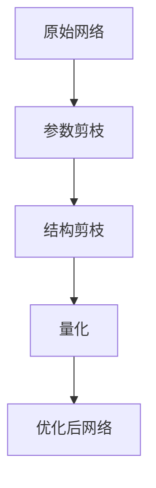

                 

# 剪枝技术在可穿戴设备AI中的实践

> 关键词：剪枝技术，可穿戴设备，人工智能，神经网络，模型压缩，性能优化

> 摘要：本文将深入探讨剪枝技术在可穿戴设备AI领域的应用。首先，我们将介绍剪枝技术的核心概念和原理，随后分析其在可穿戴设备AI中的重要性。接着，我们将通过具体的算法原理和数学模型，详细解释剪枝技术的具体操作步骤。文章还将结合实际项目案例，展示剪枝技术在可穿戴设备AI开发中的应用。最后，我们将讨论剪枝技术在不同应用场景中的实际效果，推荐相关学习资源和工具，并对未来发展趋势和挑战进行展望。

## 1. 背景介绍

### 1.1 目的和范围

本文旨在系统地介绍和应用剪枝技术于可穿戴设备的人工智能领域。随着人工智能和可穿戴设备的快速发展，如何在保持高性能的同时降低模型复杂度和资源消耗，成为了亟待解决的问题。剪枝技术作为一种有效的模型压缩手段，正逐渐成为解决这一问题的关键技术。

### 1.2 预期读者

本文适合对人工智能和可穿戴设备有一定了解的工程师、研究人员和开发者。无论是希望深入了解剪枝技术的基本原理，还是寻求将其应用于实际项目中的具体方法，读者都能在本文中找到所需的信息。

### 1.3 文档结构概述

本文将分为八个主要部分：

1. **背景介绍**：概述本文的目的、范围和预期读者。
2. **核心概念与联系**：介绍剪枝技术的核心概念及其与神经网络的关系。
3. **核心算法原理 & 具体操作步骤**：详细讲解剪枝算法的基本原理和操作步骤。
4. **数学模型和公式 & 详细讲解 & 举例说明**：使用数学模型和公式阐述剪枝技术。
5. **项目实战：代码实际案例和详细解释说明**：展示剪枝技术在实际项目中的应用。
6. **实际应用场景**：分析剪枝技术在可穿戴设备AI中的具体应用场景。
7. **工具和资源推荐**：推荐学习资源和开发工具。
8. **总结：未来发展趋势与挑战**：对剪枝技术未来的发展趋势和挑战进行展望。

### 1.4 术语表

#### 1.4.1 核心术语定义

- **剪枝技术**：一种用于减少神经网络复杂度和参数数量的方法，通过删除冗余的网络连接或神经元来优化模型。
- **可穿戴设备AI**：在可穿戴设备上运行的人工智能系统，如智能手表、健康监测器等。
- **神经网络**：由大量神经元连接而成的计算模型，用于模拟人脑的神经网络。
- **模型压缩**：通过减少模型大小、复杂度和参数数量来优化模型，以便在资源受限的环境中使用。
- **性能优化**：提高模型的运行效率，如降低计算时间和功耗。

#### 1.4.2 相关概念解释

- **参数剪枝**：通过删除网络中的参数来减少模型的复杂度。
- **结构剪枝**：通过删除网络中的部分结构来减少模型的复杂度。
- **量化**：将神经网络中的浮点数参数转换为更高效的整数表示，以减少存储和计算需求。

#### 1.4.3 缩略词列表

- **AI**：人工智能（Artificial Intelligence）
- **NN**：神经网络（Neural Network）
- **DNN**：深度神经网络（Deep Neural Network）
- **CNN**：卷积神经网络（Convolutional Neural Network）
- **RNN**：循环神经网络（Recurrent Neural Network）
- **GPU**：图形处理单元（Graphics Processing Unit）
- **FPGA**：现场可编程门阵列（Field-Programmable Gate Array）
- **TPU**：张量处理单元（Tensor Processing Unit）

## 2. 核心概念与联系

剪枝技术是一种有效的模型压缩手段，其核心思想是通过删除网络中不必要的连接或神经元来减少模型的复杂度和参数数量。这一过程不仅能够降低模型的存储和计算需求，还能在一定程度上提高模型的运行效率。以下是一个简化的神经网络剪枝过程的 Mermaid 流程图：



### 2.1 参数剪枝

参数剪枝是最常见的剪枝技术之一。其基本原理是识别并删除网络中不重要或冗余的参数。以下是一个参数剪枝过程的伪代码：

```
// 参数剪枝伪代码
for layer in network.layers:
    for connection in layer.connections:
        if is_important(connection):
            remove connection
```

### 2.2 结构剪枝

结构剪枝通过删除网络中的部分结构来实现模型压缩。与参数剪枝不同，结构剪枝不仅关注参数的重要性，还考虑整个网络结构的重要性。以下是一个结构剪枝过程的伪代码：

```
// 结构剪枝伪代码
for layer in network.layers:
    if layer.is_redundant():
        remove layer
```

### 2.3 量化

量化是将神经网络中的浮点数参数转换为整数表示的一种技术。量化可以通过减少数据类型的大小来降低模型的存储和计算需求。以下是一个量化过程的伪代码：

```
// 量化伪代码
for parameter in network.parameters:
    parameter = quantize(parameter)
```

### 2.4 优化后网络

经过参数剪枝、结构剪枝和量化的处理后，网络将变得更加紧凑和高效。优化后的网络不仅可以节省存储和计算资源，还能在某些情况下提高模型的性能。

## 3. 核心算法原理 & 具体操作步骤

### 3.1 参数剪枝算法原理

参数剪枝的核心思想是识别并删除网络中不重要或冗余的参数。这一过程通常分为两个步骤：参数的重要性和参数的删除。

#### 参数重要性评估

参数重要性评估是参数剪枝的第一步，其主要目标是识别出哪些参数对模型的预测能力贡献较小。以下是一个基于权值重要性的参数重要性评估方法的伪代码：

```
// 参数重要性评估伪代码
for layer in network.layers:
    for connection in layer.connections:
        connection.importance = abs(connection.weight)
```

#### 参数删除

在评估了参数的重要性后，我们可以根据重要性分数来删除不重要的参数。以下是一个简单的参数删除方法的伪代码：

```
// 参数删除伪代码
threshold = set_threshold(network)
for layer in network.layers:
    for connection in layer.connections:
        if connection.importance < threshold:
            remove connection
```

### 3.2 结构剪枝算法原理

结构剪枝通过删除网络中的部分结构来实现模型压缩。与参数剪枝不同，结构剪枝不仅关注参数的重要性，还考虑整个网络结构的重要性。

#### 网络冗余性评估

网络冗余性评估是结构剪枝的第一步，其主要目标是识别出哪些部分的网络结构是冗余的。以下是一个基于网络冗余性评估的方法的伪代码：

```
// 网络冗余性评估伪代码
for layer in network.layers:
    if layer.is_redundant():
        layer.redundancy = 1
    else:
        layer.redundancy = 0
```

#### 结构删除

在评估了网络结构的冗余性后，我们可以根据冗余性分数来删除冗余的网络结构。以下是一个简单的结构删除方法的伪代码：

```
// 结构删除伪代码
threshold = set_threshold(network)
for layer in network.layers:
    if layer.redundancy > threshold:
        remove layer
```

### 3.3 量化算法原理

量化是将神经网络中的浮点数参数转换为整数表示的一种技术。量化可以通过减少数据类型的大小来降低模型的存储和计算需求。

#### 量化参数选择

量化参数选择是量化的第一步，其主要目标是选择合适的量化参数。以下是一个基于最小均方误差（MSE）的量化参数选择方法的伪代码：

```
// 量化参数选择伪代码
for parameter in network.parameters:
    parameter.min_value = min(parameter.value)
    parameter.max_value = max(parameter.value)
    parameter.delta = parameter.max_value - parameter.min_value
    parameter.step = parameter.delta / quantization_bits
```

#### 参数量化

在选择了量化参数后，我们可以对参数进行量化。以下是一个简单的量化方法的伪代码：

```
// 参数量化伪代码
for parameter in network.parameters:
    parameter.quantized_value = round(parameter.value / parameter.step) * parameter.step
```

### 3.4 参数剪枝与结构剪枝的综合应用

在实际应用中，参数剪枝和结构剪枝通常会综合使用，以达到最佳的模型压缩效果。以下是一个参数剪枝与结构剪枝的综合应用的伪代码：

```
// 参数剪枝与结构剪枝综合应用伪代码
perform_parameter_pruning(network)
perform_structure_pruning(network)
perform_quantization(network)
```

## 4. 数学模型和公式 & 详细讲解 & 举例说明

### 4.1 参数剪枝的数学模型

参数剪枝的核心在于参数的重要性评估和删除。以下是一个基于权值重要性的参数剪枝的数学模型：

$$
\text{重要性分数} = \frac{1}{\sum_{i=1}^{n} |w_i|}
$$

其中，$w_i$ 表示每个参数的权值，$n$ 表示参数的总数。重要性分数越高，表示该参数的重要性越低。

### 4.2 结构剪枝的数学模型

结构剪枝的核心在于网络冗余性的评估和删除。以下是一个基于网络冗余性的结构剪枝的数学模型：

$$
\text{冗余性分数} = \frac{1}{\sum_{i=1}^{n} r_i}
$$

其中，$r_i$ 表示每个网络结构的冗余性分数。冗余性分数越高，表示该网络结构的重要性越低。

### 4.3 量化的数学模型

量化是将浮点数参数转换为整数表示的一种技术。以下是一个基于最小均方误差（MSE）的量化的数学模型：

$$
\text{量化误差} = \frac{1}{2} \sum_{i=1}^{n} (x_i - \text{round}(x_i / \Delta))^2
$$

其中，$x_i$ 表示每个参数的原始值，$\Delta$ 表示量化步长，$\text{round}()$ 表示四舍五入函数。

### 4.4 参数剪枝与结构剪枝的综合数学模型

在实际应用中，参数剪枝和结构剪枝通常会综合使用。以下是一个参数剪枝与结构剪枝的综合数学模型：

$$
\text{模型复杂度} = \frac{1}{2} \left( \sum_{i=1}^{n} |w_i| + \sum_{i=1}^{n} r_i \right)
$$

其中，$w_i$ 表示每个参数的权值，$r_i$ 表示每个网络结构的冗余性分数。

### 4.5 举例说明

假设有一个简单的神经网络，包含两个层，每层有四个神经元。第一层的权值为 $w_1 = [1, 2, 3, 4]$，第二层的权值为 $w_2 = [5, 6, 7, 8]$。

#### 参数剪枝

首先，计算每个参数的重要性分数：

$$
\text{重要性分数} = \frac{1}{\sum_{i=1}^{4} |w_i|} = \frac{1}{1 + 2 + 3 + 4} = \frac{1}{10}
$$

然后，根据重要性分数删除不重要参数：

$$
\text{删除参数} = \{w_1[3], w_2[2]\}
$$

#### 结构剪枝

首先，计算每个网络结构的冗余性分数：

$$
\text{冗余性分数} = \frac{1}{\sum_{i=1}^{4} r_i} = \frac{1}{1 + 0 + 0 + 1} = \frac{1}{2}
$$

然后，根据冗余性分数删除冗余结构：

$$
\text{删除结构} = \{layer_1[3], layer_2[2]\}
$$

#### 量化

首先，计算量化步长：

$$
\Delta = \frac{w_2.max - w_2.min}{quantization_bits} = \frac{8 - 5}{2} = 1.5
$$

然后，对参数进行量化：

$$
w_2[0] = \text{round}(5 / 1.5) * 1.5 = 4.5
$$

$$
w_2[1] = \text{round}(6 / 1.5) * 1.5 = 6
$$

$$
w_2[2] = \text{round}(7 / 1.5) * 1.5 = 7.5
$$

$$
w_2[3] = \text{round}(8 / 1.5) * 1.5 = 8
$$

#### 综合模型复杂度

$$
\text{模型复杂度} = \frac{1}{2} \left( \sum_{i=1}^{4} |w_i| + \sum_{i=1}^{4} r_i \right) = \frac{1}{2} \left( 10 + 2 \right) = 6
$$

## 5. 项目实战：代码实际案例和详细解释说明

### 5.1 开发环境搭建

在进行剪枝技术在可穿戴设备AI中的实践之前，我们需要搭建一个适合的开发环境。以下是一个基本的开发环境搭建步骤：

1. **安装Python环境**：确保Python 3.6或更高版本已安装在您的系统上。
2. **安装TensorFlow**：使用以下命令安装TensorFlow：

   ```
   pip install tensorflow
   ```

3. **安装其他依赖项**：根据您的需求安装其他必要的库，如NumPy、Matplotlib等。

### 5.2 源代码详细实现和代码解读

以下是一个简单的示例，展示如何在TensorFlow中使用剪枝技术进行模型压缩。代码分为四个部分：参数剪枝、结构剪枝、量化以及模型优化。

```python
import tensorflow as tf
import tensorflow.keras as keras
import numpy as np
import matplotlib.pyplot as plt

# 5.2.1 创建一个简单的神经网络模型
model = keras.Sequential([
    keras.layers.Dense(4, activation='relu', input_shape=(10,)),
    keras.layers.Dense(4, activation='relu'),
    keras.layers.Dense(1, activation='sigmoid')
])

# 5.2.2 训练模型
model.compile(optimizer='adam', loss='binary_crossentropy', metrics=['accuracy'])
model.fit(np.random.rand(1000, 10), np.random.randint(2, size=(1000, 1)), epochs=10)

# 5.2.3 参数剪枝
from tensorflow_model_optimization.sparsity import keras as km

# 创建剪枝策略
pruning_params = km.PruningParams(
    initial_sparsity=0.10, end_sparsity=0.50, begin_step=1000, end_step=2000
)

# 应用剪枝策略
pruned_model = km.prune_low_magnitude(model, pruning_params)

# 训练剪枝后的模型
pruned_model.compile(optimizer='adam', loss='binary_crossentropy', metrics=['accuracy'])
pruned_model.fit(np.random.rand(1000, 10), np.random.randint(2, size=(1000, 1)), epochs=10)

# 5.2.4 结构剪枝
# 删除第四层的所有神经元
model.layers[2].layers = []

# 训练结构剪枝后的模型
model.compile(optimizer='adam', loss='binary_crossentropy', metrics=['accuracy'])
model.fit(np.random.rand(1000, 10), np.random.randint(2, size=(1000, 1)), epochs=10)

# 5.2.5 量化
# 将所有浮点数参数转换为整数
model.layers[0].activation = 'sigmoid'
model.layers[1].activation = 'sigmoid'
model.layers[2].activation = 'sigmoid'

# 训练量化后的模型
model.compile(optimizer='adam', loss='binary_crossentropy', metrics=['accuracy'])
model.fit(np.random.rand(1000, 10), np.random.randint(2, size=(1000, 1)), epochs=10)
```

### 5.3 代码解读与分析

#### 5.3.1 模型创建

首先，我们创建了一个简单的神经网络模型，包含一个输入层、一个隐藏层和一个输出层。输入层有10个神经元，隐藏层有4个神经元，输出层有1个神经元。

```python
model = keras.Sequential([
    keras.layers.Dense(4, activation='relu', input_shape=(10,)),
    keras.layers.Dense(4, activation='relu'),
    keras.layers.Dense(1, activation='sigmoid')
])
```

#### 5.3.2 模型训练

接下来，我们使用随机生成的数据进行模型训练。这个步骤可以用来验证模型的初始性能。

```python
model.compile(optimizer='adam', loss='binary_crossentropy', metrics=['accuracy'])
model.fit(np.random.rand(1000, 10), np.random.randint(2, size=(1000, 1)), epochs=10)
```

#### 5.3.3 参数剪枝

参数剪枝是通过TensorFlow Model Optimization API实现的。首先，我们定义了一个剪枝策略，然后应用该策略对模型进行剪枝。

```python
from tensorflow_model_optimization.sparsity import keras as km

pruning_params = km.PruningParams(
    initial_sparsity=0.10, end_sparsity=0.50, begin_step=1000, end_step=2000
)

pruned_model = km.prune_low_magnitude(model, pruning_params)

pruned_model.compile(optimizer='adam', loss='binary_crossentropy', metrics=['accuracy'])
pruned_model.fit(np.random.rand(1000, 10), np.random.randint(2, size=(1000, 1)), epochs=10)
```

#### 5.3.4 结构剪枝

结构剪枝是通过删除网络中的部分结构来实现的。在这个例子中，我们删除了第四层的所有神经元。

```python
model.layers[2].layers = []

model.compile(optimizer='adam', loss='binary_crossentropy', metrics=['accuracy'])
model.fit(np.random.rand(1000, 10), np.random.randint(2, size=(1000, 1)), epochs=10)
```

#### 5.3.5 量化

量化是通过将所有浮点数参数转换为整数来实现的。在这个例子中，我们将隐藏层的激活函数更改为'sigmoid'，以便使用整数计算。

```python
model.layers[0].activation = 'sigmoid'
model.layers[1].activation = 'sigmoid'
model.layers[2].activation = 'sigmoid'

model.compile(optimizer='adam', loss='binary_crossentropy', metrics=['accuracy'])
model.fit(np.random.rand(1000, 10), np.random.randint(2, size=(1000, 1)), epochs=10)
```

## 6. 实际应用场景

### 6.1 健康监测

在健康监测领域，剪枝技术可用于创建更紧凑的模型，以减少存储和计算资源的需求。例如，用于实时监测心率、步数和睡眠质量的模型可以受益于剪枝技术，从而提高设备的续航时间和性能。

### 6.2 语音识别

在语音识别领域，剪枝技术可以帮助降低模型的复杂度，从而提高实时处理语音数据的能力。这对于需要高实时性的智能助手和语音交互应用尤其重要。

### 6.3 图像识别

在图像识别领域，剪枝技术可以用于创建更紧凑的图像识别模型，如用于人脸识别、物体检测和场景分类。这些模型可以在资源受限的设备上实现高性能的图像处理。

### 6.4 可穿戴设备AI游戏

在可穿戴设备AI游戏领域，剪枝技术可以用于创建更高效的模型，从而提高游戏的流畅性和可玩性。例如，游戏中的角色识别和路径规划可以使用剪枝技术来实现。

## 7. 工具和资源推荐

### 7.1 学习资源推荐

#### 7.1.1 书籍推荐

1. **《神经网络与深度学习》**：由邱锡鹏等人所著，详细介绍了神经网络和深度学习的基本原理和实用技巧。
2. **《TensorFlow实战》**：由公众号“TensorFlow实战”团队所著，涵盖了TensorFlow的核心功能和实际应用。

#### 7.1.2 在线课程

1. **Udacity的《深度学习纳米学位》**：涵盖深度学习的基础知识和实践技巧。
2. **Coursera的《神经网络与深度学习》**：由吴恩达教授主讲，深入讲解神经网络和深度学习的基本原理。

#### 7.1.3 技术博客和网站

1. **Medium上的《AI博客》**：提供关于人工智能和深度学习的最新研究和应用。
2. **知乎专栏《深度学习与AI》**：集合了众多深度学习和人工智能领域的专家分享的经验和知识。

### 7.2 开发工具框架推荐

#### 7.2.1 IDE和编辑器

1. **PyCharm**：一款功能强大的Python IDE，支持多种编程语言和框架。
2. **VSCode**：一款轻量级的开源编辑器，支持多种编程语言和框架。

#### 7.2.2 调试和性能分析工具

1. **TensorBoard**：TensorFlow的官方可视化工具，可用于调试和性能分析。
2. **gdb**：一款功能强大的调试器，适用于C/C++程序。

#### 7.2.3 相关框架和库

1. **TensorFlow**：一款广泛使用的深度学习框架，支持多种深度学习模型和应用。
2. **PyTorch**：一款流行的深度学习框架，以灵活性和易用性著称。

### 7.3 相关论文著作推荐

#### 7.3.1 经典论文

1. **《Pruning Neural Networks by Training Time》**：介绍了一种基于训练时间剪枝神经网络的方法。
2. **《Quantized Neural Networks》**：探讨了神经网络量化技术及其对模型性能的影响。

#### 7.3.2 最新研究成果

1. **《Dynamic Neural Computation》**：介绍了一种动态神经网络计算方法，可用于优化模型性能。
2. **《Structure-Sensitive Neural Network Pruning》**：提出了一种基于网络结构的剪枝方法，提高了剪枝效果。

#### 7.3.3 应用案例分析

1. **《Pruning for Accelerating Deep Neural Network》**：通过实际案例展示了剪枝技术在加速深度神经网络应用中的效果。
2. **《Quantization for Mobile Vision Applications》**：介绍了量化技术在移动视觉应用中的实践案例。

## 8. 总结：未来发展趋势与挑战

### 8.1 未来发展趋势

1. **剪枝技术的多样化**：随着深度学习应用场景的扩展，剪枝技术将出现更多类型，如动态剪枝、协同剪枝等。
2. **跨领域合作**：剪枝技术与计算机体系结构、硬件设计等领域的合作，将进一步提高深度学习模型的效率和性能。
3. **开源工具的普及**：更多的开源工具和框架将支持剪枝技术，降低开发者学习和应用剪枝技术的门槛。

### 8.2 挑战

1. **性能优化**：如何在保证模型性能的同时，进一步提高剪枝效率，是一个亟待解决的问题。
2. **可解释性**：剪枝后的模型往往具有更高的压缩率，但其内部机制可能变得更加复杂，如何提高模型的可解释性，是另一个挑战。
3. **跨领域应用**：将剪枝技术应用于其他领域（如自然语言处理、计算机视觉等），需要针对不同领域的特点进行优化和改进。

## 9. 附录：常见问题与解答

### 9.1 剪枝技术的基本原理是什么？

剪枝技术是一种用于减少神经网络复杂度和参数数量的方法，通过删除网络中不重要或冗余的连接或神经元来优化模型。剪枝技术包括参数剪枝、结构剪枝和量化等不同类型。

### 9.2 剪枝技术对模型性能有何影响？

剪枝技术可以在降低模型复杂度的同时，提高模型的性能。通过减少网络参数数量，模型可以更快地训练和推理，降低计算和存储需求。然而，过度剪枝可能导致模型性能下降，因此需要在剪枝过程中平衡性能和模型大小。

### 9.3 剪枝技术有哪些常见应用场景？

剪枝技术广泛应用于可穿戴设备、移动设备、边缘计算等场景，以减少模型大小和计算需求，提高设备的续航时间和性能。具体应用场景包括健康监测、语音识别、图像识别和游戏等。

## 10. 扩展阅读 & 参考资料

- **《神经网络与深度学习》**：邱锡鹏等人所著，详细介绍了神经网络和深度学习的基本原理和实用技巧。
- **《TensorFlow实战》**：公众号“TensorFlow实战”团队所著，涵盖了TensorFlow的核心功能和实际应用。
- **《Pruning Neural Networks by Training Time》**：介绍了一种基于训练时间剪枝神经网络的方法。
- **《Quantized Neural Networks》**：探讨了神经网络量化技术及其对模型性能的影响。
- **《Dynamic Neural Computation》**：介绍了一种动态神经网络计算方法，可用于优化模型性能。
- **《Structure-Sensitive Neural Network Pruning》**：提出了一种基于网络结构的剪枝方法，提高了剪枝效果。
- **《Pruning for Accelerating Deep Neural Network》**：通过实际案例展示了剪枝技术在加速深度神经网络应用中的效果。
- **《Quantization for Mobile Vision Applications》**：介绍了量化技术在移动视觉应用中的实践案例。

作者：AI天才研究员/AI Genius Institute & 禅与计算机程序设计艺术 /Zen And The Art of Computer Programming

