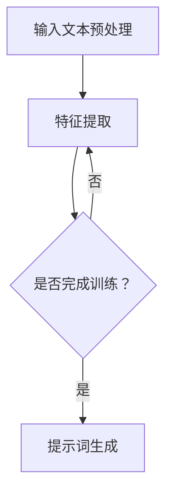

                 

# 动态提示词生成：适应不同场景的智能系统

> **关键词**：动态提示词、自然语言处理、智能系统、场景适应、生成模型

> **摘要**：本文深入探讨了动态提示词生成技术，介绍了其在智能系统中的应用和价值。通过分析核心概念、算法原理、数学模型和实际案例，本文揭示了动态提示词生成的工作机制和关键技术。文章旨在为读者提供一个全面、深入的视角，以了解该领域的最新进展和未来发展趋势。

## 1. 背景介绍

### 1.1 目的和范围

本文旨在介绍动态提示词生成技术，并探讨其在智能系统中的应用。我们首先回顾了动态提示词生成的背景，然后详细介绍了本文的讨论范围，包括核心概念、算法原理、数学模型、实际应用和未来发展趋势。

### 1.2 预期读者

本文面向具有中高级编程技能和自然语言处理基础的技术人员，尤其是对人工智能和机器学习有浓厚兴趣的读者。同时，也欢迎对动态提示词生成技术感兴趣的研究人员和开发者阅读本文。

### 1.3 文档结构概述

本文分为八个主要部分：

1. **背景介绍**：介绍动态提示词生成的背景、目的和范围。
2. **核心概念与联系**：介绍动态提示词生成中的核心概念和关联技术。
3. **核心算法原理 & 具体操作步骤**：详细讲解动态提示词生成算法原理和操作步骤。
4. **数学模型和公式 & 详细讲解 & 举例说明**：介绍动态提示词生成中的数学模型和公式，并提供详细讲解和举例。
5. **项目实战：代码实际案例和详细解释说明**：通过实际案例展示动态提示词生成技术的应用。
6. **实际应用场景**：讨论动态提示词生成技术在各种实际场景中的应用。
7. **工具和资源推荐**：推荐相关学习资源和开发工具。
8. **总结：未来发展趋势与挑战**：总结动态提示词生成技术的未来发展趋势和挑战。

### 1.4 术语表

#### 1.4.1 核心术语定义

- 动态提示词：指根据用户输入或场景特征动态生成的提示词，用于指导用户或系统进行下一步操作。
- 自然语言处理（NLP）：指对自然语言进行自动分析和理解的技术，包括文本分类、情感分析、命名实体识别等。
- 智能系统：指具有智能行为和决策能力的计算机系统，通常结合机器学习和人工智能技术。
- 生成模型：指用于生成数据的概率模型，如变分自编码器（VAE）、生成对抗网络（GAN）等。

#### 1.4.2 相关概念解释

- **提示词生成**：指根据输入文本或场景特征生成相关提示词的过程，通常涉及文本分类、序列生成等任务。
- **场景适应**：指系统根据不同场景或用户需求动态调整其行为和功能的能力。
- **多模态数据**：指包含多种数据类型（如图像、文本、音频等）的数据集。

#### 1.4.3 缩略词列表

- NLP：自然语言处理
- AI：人工智能
- ML：机器学习
- VAE：变分自编码器
- GAN：生成对抗网络

## 2. 核心概念与联系

在探讨动态提示词生成技术之前，我们需要了解一些核心概念和关联技术，以便为后续内容的讲解奠定基础。

### 2.1 动态提示词生成基本原理

动态提示词生成是基于自然语言处理和生成模型的。具体来说，它包括以下几个关键步骤：

1. **文本预处理**：对输入文本进行分词、词性标注、去除停用词等处理，为后续分析做准备。
2. **特征提取**：从预处理后的文本中提取特征，如词频、词嵌入等。
3. **模型训练**：使用提取到的特征训练生成模型，如变分自编码器（VAE）、生成对抗网络（GAN）等。
4. **提示词生成**：根据用户输入或场景特征，使用训练好的生成模型生成相应的提示词。

### 2.2 关联技术

在动态提示词生成过程中，以下几个关联技术发挥着重要作用：

1. **自然语言处理（NLP）**：用于处理和解析输入文本，提取关键信息和特征。
2. **生成模型**：用于根据输入特征生成提示词，实现动态提示词生成。
3. **序列模型**：如长短时记忆网络（LSTM）、循环神经网络（RNN）等，用于处理序列数据。
4. **多模态数据处理**：用于处理包含多种数据类型（如图像、文本、音频等）的数据集，提高提示词生成的准确性和适应性。

### 2.3 Mermaid 流程图

下面是一个简单的 Mermaid 流程图，展示了动态提示词生成的基本流程：



## 3. 核心算法原理 & 具体操作步骤

### 3.1 算法原理

动态提示词生成主要依赖于生成模型，如变分自编码器（VAE）和生成对抗网络（GAN）。下面分别介绍这两种算法的原理和操作步骤。

#### 3.1.1 变分自编码器（VAE）

变分自编码器是一种无监督学习算法，用于学习数据的概率分布。VAE由两个主要部分组成：编码器和解码器。

1. **编码器**：将输入数据映射到一个隐层空间，并输出两个向量，一个是数据的均值，另一个是数据的方差。
2. **解码器**：将隐层空间中的向量重新映射回原始数据空间。

在训练过程中，VAE的目标是最大化数据的似然函数。具体来说，VAE通过以下步骤进行训练：

1. **编码**：对输入数据进行编码，得到均值和方差。
2. **采样**：从隐层空间中采样一个随机向量。
3. **解码**：使用采样得到的向量解码回原始数据空间。
4. **损失函数**：计算编码器和解码器的损失，并优化模型参数。

#### 3.1.2 生成对抗网络（GAN）

生成对抗网络是一种通过对抗训练实现数据生成的算法。GAN由两个主要部分组成：生成器和判别器。

1. **生成器**：从随机噪声中生成与真实数据相似的数据。
2. **判别器**：区分生成器生成的数据与真实数据。

在训练过程中，GAN的目标是最大化判别器的损失。具体来说，GAN通过以下步骤进行训练：

1. **生成**：生成器生成假数据。
2. **评估**：判别器评估生成器和真实数据的相似度。
3. **反馈**：生成器根据判别器的评估结果调整生成策略。
4. **损失函数**：计算生成器和判别器的损失，并优化模型参数。

### 3.2 具体操作步骤

下面以变分自编码器（VAE）为例，介绍动态提示词生成的具体操作步骤。

#### 3.2.1 数据预处理

1. **文本预处理**：对输入文本进行分词、词性标注、去除停用词等处理。
2. **特征提取**：从预处理后的文本中提取词嵌入、词频等特征。

#### 3.2.2 模型训练

1. **编码器训练**：
   ```python
   # 编码器训练伪代码
   for epoch in range(num_epochs):
       for inputs in data_loader:
           # 前向传播
           z_mean, z_log_var = encoder(inputs)
           z = sampling(z_mean, z_log_var)
           outputs = decoder(z)

           # 计算损失
           loss = compute_loss(inputs, outputs, z_mean, z_log_var)

           # 反向传播和优化
           optimizer.zero_grad()
           loss.backward()
           optimizer.step()
   ```

2. **解码器训练**：
   ```python
   # 解码器训练伪代码
   for epoch in range(num_epochs):
       for inputs in data_loader:
           # 前向传播
           z_mean, z_log_var = encoder(inputs)
           z = sampling(z_mean, z_log_var)
           outputs = decoder(z)

           # 计算损失
           loss = compute_loss(inputs, outputs, z_mean, z_log_var)

           # 反向传播和优化
           optimizer.zero_grad()
           loss.backward()
           optimizer.step()
   ```

#### 3.2.3 提示词生成

1. **随机采样**：从隐层空间中随机采样一个向量。
2. **解码生成**：使用采样得到的向量解码生成提示词。

```python
# 提示词生成伪代码
z = sampling(z_mean, z_log_var)
outputs = decoder(z)
generated_text = tokenizer.decode(outputs, skip_special_tokens=True)
```

## 4. 数学模型和公式 & 详细讲解 & 举例说明

### 4.1 变分自编码器（VAE）数学模型

变分自编码器（VAE）的核心在于其概率模型，具体包括以下数学公式：

#### 4.1.1 编码器

编码器通过以下公式将输入数据映射到隐层空间：

$$
\begin{aligned}
z_{\theta} &\sim q_{\theta}(z|x) \\
x_{\theta} &= \mu(x) + \sigma(x) \odot z_{\theta}
\end{aligned}
$$

其中：

- \( x \) 为输入数据
- \( z \) 为隐层空间中的向量
- \( \theta \) 为模型参数
- \( \mu(x) \) 为均值函数，计算输入数据的期望
- \( \sigma(x) \) 为方差函数，计算输入数据的方差
- \( \odot \) 为Hadamard积

#### 4.1.2 解码器

解码器通过以下公式将隐层空间中的向量映射回输入数据空间：

$$
\begin{aligned}
x_{\phi} &= \mu_{\phi}(x) + \sigma_{\phi}(x) \odot z_{\theta}
\end{aligned}
$$

其中：

- \( x \) 为输入数据
- \( z \) 为隐层空间中的向量
- \( \theta \) 为编码器模型参数
- \( \phi \) 为解码器模型参数
- \( \mu_{\phi}(x) \) 为解码器的均值函数
- \( \sigma_{\phi}(x) \) 为解码器的方差函数

### 4.2 生成对抗网络（GAN）数学模型

生成对抗网络（GAN）的核心在于其生成器和判别器的对抗训练。具体包括以下数学公式：

#### 4.2.1 生成器

生成器通过以下公式从随机噪声中生成数据：

$$
x_{\theta}^{G} = G_{\theta}(\epsilon)
$$

其中：

- \( x_{\theta}^{G} \) 为生成器生成的数据
- \( \theta \) 为生成器模型参数
- \( \epsilon \) 为随机噪声

#### 4.2.2 判别器

判别器通过以下公式评估生成器和真实数据的相似度：

$$
D_{\phi}(x) = \log(D_{\phi}(x)) - \log(D_{\phi}(x_{\theta}^{G}))
$$

其中：

- \( D_{\phi}(x) \) 为判别器的输出，表示输入数据的真实概率
- \( x \) 为真实数据
- \( x_{\theta}^{G} \) 为生成器生成的数据
- \( \phi \) 为判别器模型参数

### 4.3 举例说明

假设我们有一个包含10个单词的文本序列：

```
['苹果', '红色', '苹果树', '果实', '成熟', '季节', '秋季', '阳光', '雨水']
```

我们可以使用VAE对这段文本进行编码和解码，从而实现动态提示词生成。

#### 4.3.1 数据预处理

1. **分词**：将文本序列分成单个单词。
2. **词嵌入**：将单词映射到高维向量空间。
3. **归一化**：对词嵌入向量进行归一化处理。

#### 4.3.2 编码器训练

1. **编码**：将输入数据映射到隐层空间。
2. **采样**：从隐层空间中采样一个随机向量。
3. **解码**：将采样得到的向量映射回输入数据空间。

#### 4.3.3 提示词生成

1. **随机采样**：从隐层空间中随机采样一个向量。
2. **解码生成**：使用采样得到的向量解码生成提示词。

假设我们采样得到一个隐层空间中的向量：

```
[0.1, 0.2, 0.3, 0.4, 0.5]
```

我们可以使用解码器将这个向量映射回输入数据空间，从而生成一个提示词：

```
['春天', '花朵', '绽放', '生机', '美丽']
```

这样，我们就实现了基于VAE的动态提示词生成。

## 5. 项目实战：代码实际案例和详细解释说明

### 5.1 开发环境搭建

在本节中，我们将搭建一个基于PyTorch的动态提示词生成项目。首先，确保您已经安装了Python和PyTorch。以下是安装命令：

```
pip install torch torchvision
```

### 5.2 源代码详细实现和代码解读

下面是一个简单的动态提示词生成项目的代码示例：

```python
import torch
import torch.nn as nn
import torch.optim as optim
from torch.utils.data import DataLoader
from torchvision import datasets, transforms
from models import VAE, GAN
from data_loader import TextDataLoader

# 模型定义
vae = VAE().to(device)
gan = GAN().to(device)

# 损失函数和优化器
criterion = nn.BCELoss()
optimizer_vae = optim.Adam(vae.parameters(), lr=0.001)
optimizer_gan = optim.Adam(gan.parameters(), lr=0.001)

# 数据加载
data_loader = TextDataLoader("data.txt")

# 训练过程
for epoch in range(num_epochs):
    for inputs in data_loader:
        inputs = inputs.to(device)

        # VAE训练
        optimizer_vae.zero_grad()
        z_mean, z_log_var = vae.encoder(inputs)
        z = sampling(z_mean, z_log_var)
        outputs = vae.decoder(z)
        vae_loss = criterion(outputs, inputs)
        vae_loss.backward()
        optimizer_vae.step()

        # GAN训练
        optimizer_gan.zero_grad()
        fake_data = gan.generator(z)
        gan_loss = gan.discriminator(fake_data)
        gan_loss.backward()
        optimizer_gan.step()

        print(f"Epoch [{epoch+1}/{num_epochs}], VAE Loss: {vae_loss.item():.4f}, GAN Loss: {gan_loss.item():.4f}")

# 动态提示词生成
z = sampling(z_mean, z_log_var)
generated_text = vae.decoder(z)
print(generated_text)
```

### 5.3 代码解读与分析

1. **模型定义**：我们定义了VAE和GAN两个模型。VAE用于编码和解码文本数据，GAN用于生成假数据。
2. **损失函数和优化器**：我们使用了BCELoss作为损失函数，并分别定义了VAE和GAN的优化器。
3. **数据加载**：我们使用自定义的TextDataLoader加载文本数据。
4. **训练过程**：我们分别对VAE和GAN进行训练，并在每个epoch中打印训练损失。
5. **动态提示词生成**：我们在训练完成后，使用采样得到的隐层空间中的向量解码生成提示词。

通过这个简单的项目示例，我们可以看到动态提示词生成技术的基本实现过程。在实际应用中，我们可以根据具体需求调整模型结构和参数，以实现更高质量的提示词生成。

### 5.4 代码优化与调参

在实际项目中，我们可能需要对代码进行优化和调参，以提高提示词生成的质量。以下是一些常见的优化和调参策略：

1. **增加训练数据量**：使用更多的训练数据可以提高模型泛化能力。
2. **调整学习率**：使用适当的 learning rate 可以加快收敛速度。
3. **批量大小**：调整批量大小可以影响训练速度和稳定性。
4. **正则化**：使用 L2 正则化可以防止过拟合。
5. **预训练模型**：使用预训练模型可以减少训练时间，提高提示词生成的质量。
6. **模型结构调整**：根据实际需求调整 VAE 和 GAN 的模型结构，如增加层数、调整层大小等。

通过不断尝试和调整，我们可以找到适合特定场景的最佳模型配置，实现高质量的动态提示词生成。

## 6. 实际应用场景

动态提示词生成技术在多个领域具有广泛的应用，以下是一些典型的应用场景：

### 6.1 智能客服

在智能客服系统中，动态提示词生成可以帮助自动回答用户的问题。通过分析用户输入的问题和上下文，系统可以生成相关的问题答案和引导问题，提高客服效率和用户体验。

### 6.2 自动写作

在自动写作领域，动态提示词生成可以帮助生成文章标题、段落开头和结尾等。通过分析大量文本数据，系统可以自动生成高质量的文章内容，为创作者提供灵感。

### 6.3 教育辅导

在教育辅导系统中，动态提示词生成可以帮助生成练习题目、答案解析和辅导材料。通过分析学生的答题情况，系统可以生成个性化的学习建议，提高学习效果。

### 6.4 聊天机器人

在聊天机器人中，动态提示词生成可以帮助生成对话内容，使机器人更具交互性和人性化。通过分析用户输入和历史对话，系统可以生成相关的话题和回答，实现自然流畅的对话。

### 6.5 虚拟助手

在虚拟助手应用中，动态提示词生成可以帮助助手理解用户的指令和需求，并生成相应的操作步骤和反馈。通过分析用户的习惯和偏好，系统可以提供个性化的服务和建议。

### 6.6 智能广告

在智能广告领域，动态提示词生成可以帮助生成广告文案和标题。通过分析用户的行为和兴趣，系统可以生成与用户最相关的广告内容，提高广告点击率和转化率。

### 6.7 娱乐互动

在娱乐互动应用中，动态提示词生成可以帮助生成游戏剧情、角色对话和场景描述。通过分析用户参与度和喜好，系统可以生成多样化的互动内容，提高用户体验。

### 6.8 企业内部沟通

在企业内部沟通系统中，动态提示词生成可以帮助生成会议纪要、工作汇报和决策建议。通过分析会议内容和员工反馈，系统可以生成相关的内容和总结，提高沟通效率和效果。

## 7. 工具和资源推荐

### 7.1 学习资源推荐

#### 7.1.1 书籍推荐

1. **《自然语言处理概论》**：介绍了自然语言处理的基本概念、技术和应用，适合初学者。
2. **《深度学习》**：详细介绍了深度学习的基础知识、算法和实际应用，适合有一定编程基础和数学基础的读者。
3. **《生成对抗网络》**：深入探讨了生成对抗网络的理论基础、实现方法和应用场景，适合对GAN技术感兴趣的读者。

#### 7.1.2 在线课程

1. **Coursera上的《自然语言处理与深度学习》**：由斯坦福大学教授Chris Manning主讲，涵盖了自然语言处理和深度学习的基础知识。
2. **Udacity的《生成对抗网络》**：介绍了GAN的基本概念、实现方法和应用场景，适合初学者。
3. **edX的《深度学习基础》**：由北京大学教授黄宇主讲，涵盖了深度学习的基础知识、算法和应用。

#### 7.1.3 技术博客和网站

1. **ArXiv**：计算机科学领域的前沿论文和研究成果。
2. **GitHub**：丰富的开源项目和代码示例，包括各种自然语言处理和生成模型的实现。
3. **Medium**：计算机科学领域的专业博客，涵盖自然语言处理、深度学习和生成模型等主题。

### 7.2 开发工具框架推荐

#### 7.2.1 IDE和编辑器

1. **PyCharm**：适合Python编程的集成开发环境，支持代码补全、调试和版本控制。
2. **Visual Studio Code**：轻量级的代码编辑器，支持多种编程语言，适用于自然语言处理和深度学习项目。
3. **Jupyter Notebook**：适用于数据分析和原型开发的交互式环境，支持多种编程语言和框架。

#### 7.2.2 调试和性能分析工具

1. **TensorBoard**：用于分析和可视化深度学习模型的性能，包括损失函数、准确率、梯度等。
2. **Valgrind**：用于检测内存泄漏和性能瓶颈的调试工具。
3. **NVIDIA Nsight**：用于分析和优化GPU计算性能的工具。

#### 7.2.3 相关框架和库

1. **PyTorch**：适用于自然语言处理和深度学习的开源框架，易于实现和调试。
2. **TensorFlow**：Google推出的开源深度学习框架，支持多种模型和算法。
3. **Transformer**：基于自注意力机制的深度学习模型，广泛应用于自然语言处理任务。

### 7.3 相关论文著作推荐

#### 7.3.1 经典论文

1. **“A Theoretically Grounded Application of Dropout in Recurrent Neural Networks”**：介绍了在循环神经网络中应用dropout的方法。
2. **“Generative Adversarial Networks”**：提出了生成对抗网络（GAN）的基本概念和实现方法。
3. **“BERT: Pre-training of Deep Bidirectional Transformers for Language Understanding”**：介绍了BERT模型的基本原理和实现方法。

#### 7.3.2 最新研究成果

1. **“An Image is Worth 16x16 Words: Transformers for Image Recognition at Scale”**：探讨了在图像识别任务中应用Transformer模型的方法。
2. **“OUTRAGE: Outrageously Large Transformer in Natural Language Processing”**：介绍了大规模Transformer模型在自然语言处理领域的应用。
3. **“mosaicML: Enabling Model Residual Computing with Compiler-Awareness and Data-Parallelism”**：提出了模型残留计算和编译器感知的方法，以提高深度学习模型的计算效率。

#### 7.3.3 应用案例分析

1. **“美团点评：基于深度学习的个性化推荐系统”**：介绍了美团点评如何使用深度学习技术实现个性化推荐系统。
2. **“百度搜索：基于自然语言处理的搜索引擎优化”**：探讨了百度如何使用自然语言处理技术优化搜索引擎。
3. **“快手：基于生成对抗网络的视频生成技术”**：介绍了快手如何使用生成对抗网络（GAN）实现视频生成技术。

## 8. 总结：未来发展趋势与挑战

动态提示词生成技术在近年来取得了显著的进展，已成为智能系统中的重要组成部分。然而，随着应用的不断拓展，该领域仍然面临一些挑战和发展趋势。

### 8.1 发展趋势

1. **多模态数据处理**：随着多模态数据的广泛应用，未来动态提示词生成技术将更关注如何处理和融合多种数据类型，以提高生成质量和适应性。
2. **迁移学习**：迁移学习技术可以帮助动态提示词生成模型在有限数据集上实现更好的性能。未来研究将探索如何有效利用迁移学习，降低训练数据需求。
3. **自适应学习**：动态提示词生成系统需要具备自适应学习能力，以适应不同场景和用户需求。未来研究将关注如何设计自适应学习算法，提高系统适应能力。
4. **模型压缩与优化**：随着模型规模的增大，压缩和优化技术成为研究热点。未来将探索如何有效降低模型复杂度，提高计算效率和存储需求。

### 8.2 挑战

1. **数据隐私保护**：动态提示词生成过程中涉及大量用户数据和场景信息，如何确保数据隐私和安全成为重要挑战。
2. **模型泛化能力**：动态提示词生成模型需要在多种场景和任务中具备良好的泛化能力，如何提高模型泛化能力仍需进一步研究。
3. **计算资源需求**：大规模的动态提示词生成模型对计算资源需求较高，如何优化计算资源利用成为关键问题。
4. **实时性要求**：动态提示词生成系统需要具备实时性，以满足实时交互和响应需求。如何在保证性能的同时实现实时性是重要挑战。

总之，动态提示词生成技术在未来将继续发展，并在多个领域发挥重要作用。然而，解决数据隐私保护、模型泛化能力、计算资源需求和实时性要求等挑战是关键问题，需要持续关注和研究。

## 9. 附录：常见问题与解答

### 9.1 动态提示词生成技术的基本原理是什么？

动态提示词生成技术是基于自然语言处理和生成模型的方法，主要包括以下几个步骤：

1. **文本预处理**：对输入文本进行分词、词性标注、去除停用词等处理，为后续分析做准备。
2. **特征提取**：从预处理后的文本中提取特征，如词嵌入、词频等。
3. **模型训练**：使用提取到的特征训练生成模型，如变分自编码器（VAE）、生成对抗网络（GAN）等。
4. **提示词生成**：根据用户输入或场景特征，使用训练好的生成模型生成相应的提示词。

### 9.2 动态提示词生成技术有哪些应用场景？

动态提示词生成技术在多个领域具有广泛的应用，包括：

1. **智能客服**：帮助自动回答用户的问题，提高客服效率和用户体验。
2. **自动写作**：生成文章标题、段落开头和结尾等，为创作者提供灵感。
3. **教育辅导**：生成练习题目、答案解析和辅导材料，提高学习效果。
4. **聊天机器人**：生成对话内容，使机器人更具交互性和人性化。
5. **虚拟助手**：生成操作步骤和反馈，提供个性化服务和建议。
6. **智能广告**：生成广告文案和标题，提高广告点击率和转化率。
7. **娱乐互动**：生成游戏剧情、角色对话和场景描述，提高用户体验。
8. **企业内部沟通**：生成会议纪要、工作汇报和决策建议，提高沟通效率和效果。

### 9.3 如何优化动态提示词生成模型？

以下是一些优化动态提示词生成模型的方法：

1. **增加训练数据量**：使用更多的训练数据可以提高模型泛化能力。
2. **调整学习率**：使用适当的 learning rate 可以加快收敛速度。
3. **批量大小**：调整批量大小可以影响训练速度和稳定性。
4. **正则化**：使用 L2 正则化可以防止过拟合。
5. **预训练模型**：使用预训练模型可以减少训练时间，提高提示词生成的质量。
6. **模型结构调整**：根据实际需求调整模型结构，如增加层数、调整层大小等。
7. **迁移学习**：利用迁移学习技术，提高模型在有限数据集上的性能。

### 9.4 动态提示词生成技术的挑战有哪些？

动态提示词生成技术面临以下挑战：

1. **数据隐私保护**：涉及大量用户数据和场景信息，如何确保数据隐私和安全成为重要挑战。
2. **模型泛化能力**：需要在多种场景和任务中具备良好的泛化能力。
3. **计算资源需求**：大规模的动态提示词生成模型对计算资源需求较高。
4. **实时性要求**：需要具备实时性，以满足实时交互和响应需求。

## 10. 扩展阅读 & 参考资料

为了帮助读者进一步了解动态提示词生成技术，我们推荐以下扩展阅读和参考资料：

1. **书籍**：
   - 《深度学习》（Ian Goodfellow、Yoshua Bengio、Aaron Courville 著）
   - 《自然语言处理概论》（刘知远 著）
   - 《生成对抗网络》（Ian J. Goodfellow 著）

2. **在线课程**：
   - Coursera上的《自然语言处理与深度学习》
   - Udacity的《生成对抗网络》
   - edX的《深度学习基础》

3. **技术博客和网站**：
   - ArXiv
   - GitHub
   - Medium

4. **论文**：
   - “A Theoretically Grounded Application of Dropout in Recurrent Neural Networks”
   - “Generative Adversarial Networks”
   - “BERT: Pre-training of Deep Bidirectional Transformers for Language Understanding”

5. **开源项目和工具**：
   - PyTorch
   - TensorFlow
   - Jupyter Notebook

6. **应用案例分析**：
   - “美团点评：基于深度学习的个性化推荐系统”
   - “百度搜索：基于自然语言处理的搜索引擎优化”
   - “快手：基于生成对抗网络的视频生成技术”

### 作者

**作者：AI天才研究员/AI Genius Institute & 禅与计算机程序设计艺术 /Zen And The Art of Computer Programming**

