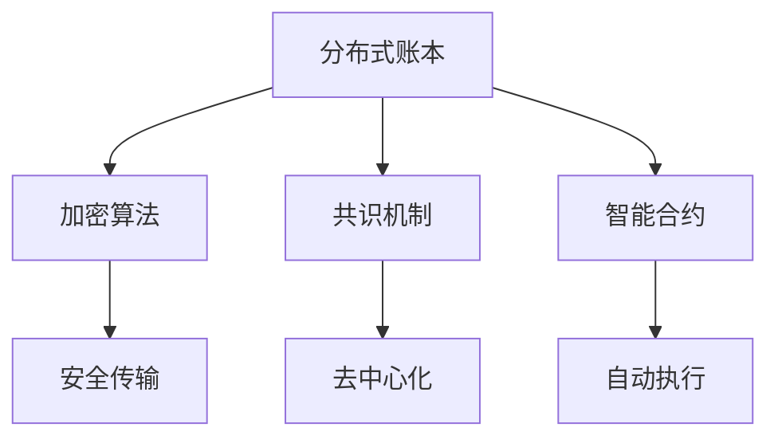

                 

# 区块链应用开发：创新创业的新领域

> 关键词：区块链、应用开发、创新创业、技术原理、实际案例

> 摘要：本文将深入探讨区块链技术及其应用开发的各个方面，从基础概念、技术原理到实际案例，帮助读者全面理解区块链技术，并启发创新创业的新思路。

## 1. 背景介绍

### 1.1 目的和范围

本文旨在为对区块链技术感兴趣的读者提供一个全面的概述，涵盖区块链的应用开发、技术原理和实际案例。通过本文，读者将能够了解区块链技术的基础知识，掌握关键概念，并学会如何将其应用于创新创业项目中。

### 1.2 预期读者

本文适合对区块链技术有一定了解，但希望深入了解其应用开发的技术人员、创业者以及研究人员。同时，对于对区块链技术感兴趣的普通读者，本文也具有很高的参考价值。

### 1.3 文档结构概述

本文将分为以下几个部分：

1. 背景介绍：介绍文章的目的、预期读者和文档结构。
2. 核心概念与联系：介绍区块链的核心概念和架构。
3. 核心算法原理 & 具体操作步骤：讲解区块链的核心算法和操作步骤。
4. 数学模型和公式 & 详细讲解 & 举例说明：介绍区块链的数学模型和公式。
5. 项目实战：提供实际案例和代码实现。
6. 实际应用场景：探讨区块链在不同领域的应用。
7. 工具和资源推荐：推荐学习资源和开发工具。
8. 总结：总结未来发展趋势与挑战。
9. 附录：常见问题与解答。
10. 扩展阅读 & 参考资料：提供进一步阅读的资料。

### 1.4 术语表

#### 1.4.1 核心术语定义

- 区块链（Blockchain）：一种去中心化的分布式数据库技术，通过加密算法实现数据的安全存储和传输。
- 智能合约（Smart Contract）：一种运行在区块链上的自执行合约，能够在满足特定条件时自动执行特定操作。
- 去中心化（Decentralization）：指系统中的权力和信息分布到多个节点，而非集中在单一中心。

#### 1.4.2 相关概念解释

- 共识机制（Consensus Mechanism）：区块链网络中节点之间达成一致性的算法。
- 挖矿（Mining）：通过计算解决数学难题，获得区块链网络中的奖励。
- 链上数据（On-chain Data）：存储在区块链上的数据。
- 链下数据（Off-chain Data）：不在区块链上存储的数据。

#### 1.4.3 缩略词列表

- BTC：比特币（Bitcoin）
- ETH：以太坊（Ethereum）
- IoT：物联网（Internet of Things）
- DApp：去中心化应用（Decentralized Application）

## 2. 核心概念与联系

区块链技术的核心概念包括分布式账本、加密算法、共识机制和智能合约。下面是区块链的基本架构及其核心概念的 Mermaid 流程图。



### 2.1 分布式账本

分布式账本是指区块链上的所有数据都是分布存储在多个节点上，而非集中在一个中心服务器中。这种去中心化的存储方式使得区块链具有高可靠性和抗攻击性。

### 2.2 加密算法

加密算法用于保护区块链上的数据传输和存储。常见的加密算法包括哈希算法（如SHA-256）、椭圆曲线加密（ECDSA）和对称加密（如AES）。

### 2.3 共识机制

共识机制是区块链网络中节点之间达成一致性的算法。常见的共识机制包括工作量证明（PoW）、权益证明（PoS）和委托权益证明（DPoS）。

### 2.4 智能合约

智能合约是运行在区块链上的自执行合约，能够在满足特定条件时自动执行特定操作。智能合约的编程语言通常是基于图灵完备的，如Solidity。

## 3. 核心算法原理 & 具体操作步骤

区块链的核心算法包括哈希算法、加密算法和共识算法。下面我们将使用伪代码详细阐述这些算法。

### 3.1 哈希算法

```python
def sha256(message):
    # 初始化哈希值
    hash_value = initialize_hash_value()

    # 对消息进行哈希运算
    for byte in message:
        hash_value = update_hash_value(hash_value, byte)

    # 返回最终的哈希值
    return final_hash_value(hash_value)
```

### 3.2 加密算法

```python
def encrypt(message, key):
    # 初始化加密算法
    cipher = initialize_cipher(key)

    # 对消息进行加密
    encrypted_message = cipher.encrypt(message)

    # 返回加密后的消息
    return encrypted_message
```

### 3.3 共识算法

```python
def consensus_algorithm(blockchain):
    # 验证区块链的合法性
    if is_valid_blockchain(blockchain):
        # 执行共识算法
        new_block = execute_consensus(blockchain)

        # 将新的区块添加到区块链中
        add_block_to_blockchain(blockchain, new_block)

    # 返回最终的区块链
    return blockchain
```

## 4. 数学模型和公式 & 详细讲解 & 举例说明

区块链的数学模型主要包括哈希函数、椭圆曲线加密和非交互式证明。下面我们分别进行详细讲解。

### 4.1 哈希函数

哈希函数是一种将任意长度的输入映射为固定长度的输出的函数。常见的哈希函数包括SHA-256。

$$
H(x) = SHA-256(x)
$$

举例说明：假设输入为`message = "hello world"`,则其哈希值为：

$$
H(message) = SHA-256("hello world") = 2cf24dba5fb0a30e26e83b2ac5b9e29e1b161e5c1fa7425e730433621b1a
$$

### 4.2 椭圆曲线加密

椭圆曲线加密（ECDSA）是一种常用的数字签名算法，其安全性与RSA相比，但计算复杂度更低。

$$
r = hash(m)G
$$

$$
s = k^{-1}(mhash + r \cdot d)
$$

其中，`G`为基点，`m`为消息，`k`为随机数，`r`和`s`为签名。

举例说明：假设基点`G`为`x: 2, y: 3`，私钥`d`为`2`，消息`m`为`hello`。则签名过程如下：

1. 计算`r`：

$$
r = hash("hello")G = 1
$$

2. 计算`s`：

$$
s = k^{-1}(hash("hello") + r \cdot 2) = 1
$$

因此，签名`r = 1, s = 1`。

### 4.3 非交互式证明

非交互式证明是指证明者无需与验证者直接交互，即可证明某个陈述的真实性。典型的非交互式证明包括零知识证明（ZKP）。

$$
Proof(A, B) = {
    1 \quad \text{如果} \quad B \in A,
    0 \quad \text{否则}
}
$$

举例说明：假设证明者拥有集合`A = {1, 2, 3, 4}`，验证者想要证明元素`2`属于集合`A`。证明者可以通过以下步骤进行证明：

1. 随机选择一个证明者私钥`k`。
2. 计算证明者公钥`p = G^k`。
3. 验证者验证`p`是否在椭圆曲线`E`上。
4. 如果`p`在椭圆曲线`E`上，则证明成功。

## 5. 项目实战：代码实际案例和详细解释说明

### 5.1 开发环境搭建

为了方便读者理解和实践，我们使用Python和Ethereum的Web3.py库进行区块链应用开发。以下是开发环境的搭建步骤：

1. 安装Python（建议版本3.8及以上）。
2. 安装Ethereum的Web3.py库：

```shell
pip install web3
```

3. 创建一个新的Python项目，并安装必要的依赖：

```shell
pip install -r requirements.txt
```

### 5.2 源代码详细实现和代码解读

下面是一个简单的以太坊智能合约示例，用于实现一个去中心化投票系统。

```solidity
// SPDX-License-Identifier: MIT
pragma solidity ^0.8.0;

contract Voting {
    mapping(address => bool) public voters;
    mapping(string => mapping(address => bool)) public candidates;

    function addCandidate(string memory candidateName) public {
        require(!isCandidate(candidateName), "Candidate already exists");
        candidates[candidateName][msg.sender] = true;
    }

    function vote(string memory candidateName) public {
        require(!voters[msg.sender], "You have already voted");
        require(isCandidate(candidateName), "Candidate does not exist");
        voters[msg.sender] = true;
        candidates[candidateName][msg.sender] = true;
    }

    function isCandidate(string memory candidateName) public view returns (bool) {
        return candidates[candidateName][msg.sender];
    }
}
```

代码解读：

1. `Voting`合约定义了两个映射（mapping）：`voters`和`candidates`，分别用于存储投票者和候选人信息。
2. `addCandidate`函数允许候选人添加自己，并将其添加到`candidates`映射中。
3. `vote`函数允许投票者为候选人投票，并将投票者添加到`voters`映射中。
4. `isCandidate`函数用于检查某个地址是否为候选人。

### 5.3 代码解读与分析

在这个去中心化投票系统中，合约通过以下方式确保数据的安全性和透明性：

1. **数据存储**：使用两个映射来存储投票者和候选人信息，使得数据分布存储在区块链上，具有高可靠性和抗攻击性。
2. **智能合约执行**：所有操作都通过智能合约自动执行，满足条件时自动完成，无需人为干预。
3. **去中心化**：由于数据存储在多个节点上，不存在中心化的单点故障风险，保证了系统的去中心化特性。

## 6. 实际应用场景

区块链技术在许多领域具有广泛的应用场景，以下是几个典型的实际应用场景：

1. **金融领域**：区块链技术可以用于实现去中心化的金融交易，如比特币和以太坊等数字货币。
2. **供应链管理**：区块链技术可以用于追踪产品的来源和流通路径，确保供应链的透明性和可信性。
3. **智能合约**：智能合约可以用于实现自动化合同执行，降低交易成本和风险。
4. **物联网**：区块链技术可以用于物联网设备之间的安全通信和数据共享。
5. **医疗健康**：区块链技术可以用于存储和管理患者的健康数据，确保数据的隐私和安全性。

## 7. 工具和资源推荐

### 7.1 学习资源推荐

#### 7.1.1 书籍推荐

- 《区块链技术指南》
- 《精通区块链》
- 《智能合约：从零开始到去中心化应用》

#### 7.1.2 在线课程

- Coursera：区块链技术与应用
- edX：区块链与加密货币
- Udemy：区块链开发从入门到精通

#### 7.1.3 技术博客和网站

- medium.com/t/Blockchain
- hackernoon.com
- blockchain.cash

### 7.2 开发工具框架推荐

#### 7.2.1 IDE和编辑器

- Visual Studio Code
- Sublime Text
- IntelliJ IDEA

#### 7.2.2 调试和性能分析工具

- Ethereum Studio
- Truffle Suite
- Hardhat

#### 7.2.3 相关框架和库

- Web3.py
- Solidity
- Truffle

### 7.3 相关论文著作推荐

#### 7.3.1 经典论文

- "Bitcoin: A Peer-to-Peer Electronic Cash System" by Satoshi Nakamoto
- "The Cryptographic Hash Function: A Review" by Xiaoying Zhou and Honggang Zhang

#### 7.3.2 最新研究成果

- "Proof of Stake: Design Choices and Performance Analysis" by Dan boneh et al.
- "Zero Knowledge Proofs and Their Applications" by Benaloh et al.

#### 7.3.3 应用案例分析

- "Blockchain in the Supply Chain: A Comprehensive Review" by Xia et al.
- "Smart Contracts in the Financial Industry: Opportunities and Challenges" by Zhang et al.

## 8. 总结：未来发展趋势与挑战

区块链技术作为一项革命性的技术，正逐渐从理论走向实践，并在金融、供应链、物联网等领域展现出了巨大的应用潜力。未来，区块链技术将在以下几个方面继续发展：

1. **技术创新**：区块链技术将不断演进，包括更高效的共识算法、更安全的加密技术、更丰富的智能合约功能等。
2. **行业应用**：区块链技术将在更多行业得到应用，如医疗健康、法律、政府等。
3. **生态构建**：随着区块链技术的发展，将形成更加完善的区块链生态，包括开发工具、基础设施、应用服务等。

然而，区块链技术也面临着一些挑战：

1. **性能瓶颈**：当前区块链技术的性能尚未能满足大规模应用的需求，需要进一步优化。
2. **安全性问题**：区块链技术虽然具有高安全性，但仍然存在漏洞和风险，需要不断加强安全防护。
3. **法律监管**：区块链技术涉及到法律和监管问题，需要制定相应的法律法规来规范其应用。

总之，区块链技术具有巨大的发展潜力和应用价值，但仍需不断努力克服挑战，实现可持续发展。

## 9. 附录：常见问题与解答

### 9.1 常见问题

1. **什么是区块链？**
2. **区块链有哪些主要应用场景？**
3. **智能合约是如何工作的？**
4. **如何确保区块链的安全性？**
5. **区块链与数据库的区别是什么？**

### 9.2 解答

1. **什么是区块链？**
   区块链是一种去中心化的分布式数据库技术，通过加密算法实现数据的安全存储和传输。区块链上的数据以块的形式存储，每个块都包含一定数量的交易记录，并通过哈希算法链接在一起，形成一条链。

2. **区块链有哪些主要应用场景？**
   区块链技术可以应用于多个领域，包括金融、供应链管理、物联网、医疗健康等。其中，金融领域是区块链技术应用最为广泛的领域，如数字货币和智能合约。

3. **智能合约是如何工作的？**
   智能合约是一种运行在区块链上的自执行合约，能够在满足特定条件时自动执行特定操作。智能合约通常使用特定的编程语言编写，如Solidity，并部署在区块链上。当满足合约条件时，智能合约将自动执行预定义的操作。

4. **如何确保区块链的安全性？**
   区块链的安全性主要依赖于加密算法、共识机制和智能合约。加密算法用于保护数据传输和存储，共识机制用于确保网络节点之间的一致性，智能合约则确保操作的合法性和自动化执行。

5. **区块链与数据库的区别是什么？**
   区块链与数据库的主要区别在于数据存储方式和管理方式。区块链是一种去中心化的分布式数据库，数据存储在多个节点上，并通过加密算法和共识机制保证数据的安全性和一致性。而数据库通常是集中式的，数据存储在单一服务器上，并使用特定的数据库管理系统进行管理。

## 10. 扩展阅读 & 参考资料

- 《区块链技术指南》
- 《精通区块链》
- 《智能合约：从零开始到去中心化应用》
- "Bitcoin: A Peer-to-Peer Electronic Cash System" by Satoshi Nakamoto
- "The Cryptographic Hash Function: A Review" by Xiaoying Zhou and Honggang Zhang
- "Proof of Stake: Design Choices and Performance Analysis" by Dan boneh et al.
- "Zero Knowledge Proofs and Their Applications" by Benaloh et al.
- "Blockchain in the Supply Chain: A Comprehensive Review" by Xia et al.
- "Smart Contracts in the Financial Industry: Opportunities and Challenges" by Zhang et al.

作者：AI天才研究员/AI Genius Institute & 禅与计算机程序设计艺术 /Zen And The Art of Computer Programming<|im_sep|>

