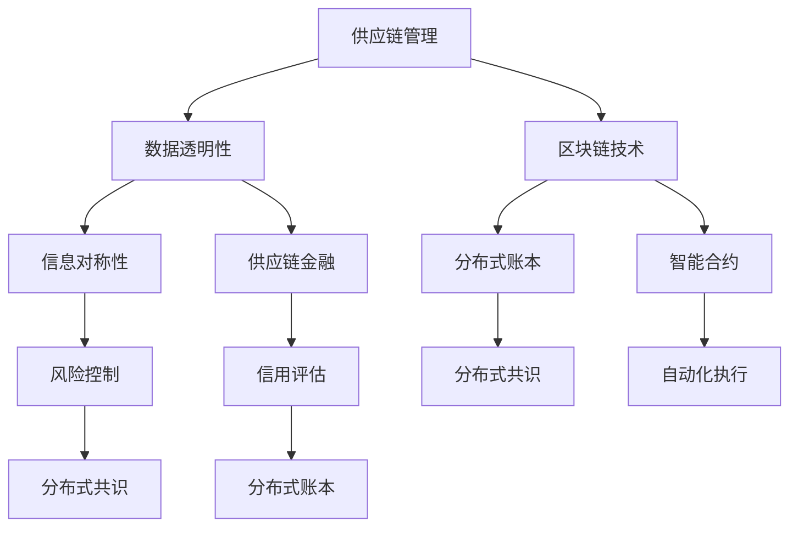

                 

### 1. 背景介绍

#### 1.1 目的和范围

本文旨在探讨区块链技术在供应链管理中的应用及其创新性。供应链管理是企业运营的重要组成部分，涉及到从原材料采购到最终产品交付的各个环节。然而，传统的供应链管理方式往往面临数据不透明、信息不对称、供应链风险难以控制等问题。区块链技术的引入，有望为供应链管理带来革命性的变化，提升其透明度、安全性和效率。

本文将首先介绍区块链技术的基本概念和原理，接着分析其在供应链管理中的潜在应用，并探讨其关键技术。随后，我们将通过一个实际案例展示区块链技术在供应链管理中的具体应用，并提供开发环境和源代码的详细说明。最后，本文将对区块链技术在供应链管理中的实际应用场景进行讨论，并推荐相关学习资源和工具。

#### 1.2 预期读者

本文适合对供应链管理有一定了解，并对区块链技术感兴趣的读者。具体包括：

1. 供应链管理专业人士，希望了解如何利用区块链技术提升供应链管理的效率和透明度。
2. 区块链技术爱好者，希望了解区块链技术在现实世界中的具体应用。
3. 计算机科学和软件工程专业的学生和研究人员，希望深入探讨区块链技术在不同领域的应用。

#### 1.3 文档结构概述

本文分为以下几个主要部分：

1. 背景介绍：介绍区块链技术在供应链管理中的目的、范围和读者对象。
2. 核心概念与联系：阐述区块链技术和供应链管理中的关键概念和其相互关系。
3. 核心算法原理 & 具体操作步骤：详细讲解区块链技术在供应链管理中的核心算法原理和操作步骤。
4. 数学模型和公式 & 详细讲解 & 举例说明：介绍区块链技术在供应链管理中涉及到的数学模型和公式，并提供具体例子。
5. 项目实战：代码实际案例和详细解释说明，展示区块链技术在供应链管理中的具体实现。
6. 实际应用场景：分析区块链技术在供应链管理中的实际应用场景。
7. 工具和资源推荐：推荐相关学习资源和开发工具。
8. 总结：总结区块链技术在供应链管理中的未来发展趋势与挑战。
9. 附录：常见问题与解答。
10. 扩展阅读 & 参考资料：提供进一步阅读的资料和参考。

#### 1.4 术语表

在本文中，以下术语具有特定含义：

- **区块链技术**：一种分布式数据库技术，通过密码学确保数据不可篡改和一致性。
- **供应链管理**：企业内部和供应商、分销商、零售商等合作伙伴之间的产品流动、信息流动和资金流动的管理。
- **智能合约**：一种自动化执行合同条款的计算机协议，运行在区块链网络上。
- **分布式账本**：一种去中心化的数据库，数据记录在多个节点上，各节点间通过共识机制同步和验证数据。

#### 1.4.1 核心术语定义

- **区块链**：由一系列按时间顺序排列的区块组成的数据结构，每个区块包含一定数量的交易记录。区块链具有不可篡改性和透明性。
- **分布式共识**：多个节点通过共识算法达成一致，决定数据的合法性和状态。常见共识算法包括工作量证明（PoW）和权益证明（PoS）。
- **智能合约**：基于区块链的计算机程序，当触发条件满足时，自动执行预设的逻辑和操作。
- **供应链金融**：通过区块链技术实现供应链中各参与方的信用评估、支付结算和风险管理。

#### 1.4.2 相关概念解释

- **去中心化**：指系统或网络中没有中央控制机构，而是由多个参与者共同维护和运行。
- **分布式存储**：数据分散存储在多个节点上，而不是集中存储在一个中心位置。
- **区块链网络**：由多个节点组成的分布式网络，负责维护区块链的状态和数据。
- **链上链下**：链上（On-chain）指的是区块链网络中的数据交互和操作；链下（Off-chain）指的是区块链网络之外的数据交互和操作。

#### 1.4.3 缩略词列表

- **DLT**：分布式账本技术（Distributed Ledger Technology）
- **SBF**：供应链金融（Supply Chain Finance）
- **SCM**：供应链管理（Supply Chain Management）
- **IoT**：物联网（Internet of Things）
- **AI**：人工智能（Artificial Intelligence）
- **BC**：区块链（Blockchain）
- **DL**：分布式账本（Distributed Ledger）

### 1.5 核心概念与联系

在深入探讨区块链技术在供应链管理中的应用之前，我们需要理解一些核心概念及其相互关系。以下是区块链技术和供应链管理中的几个关键概念，并通过Mermaid流程图展示其相互关系。



在上述流程图中，供应链管理（A）依赖于数据透明性（B）、信息对称性（C）和供应链金融（D）。区块链技术（G）提供了分布式账本（H）和智能合约（I），分布式账本通过分布式共识（J）实现数据一致性，智能合约通过自动化执行（K）简化业务流程。分布式共识（L）和分布式账本（M）共同支持供应链金融中的信用评估（F）和风险控制（E）。

### 1.6 核心算法原理 & 具体操作步骤

区块链技术在供应链管理中的核心算法原理主要包括分布式共识、数据加密和智能合约执行。以下是这些算法的原理和具体操作步骤的详细解释。

#### 1.6.1 分布式共识

分布式共识是区块链网络中的关键机制，用于确保多个节点之间数据的一致性。常见的分布式共识算法包括工作量证明（PoW）和权益证明（PoS）。

**工作量证明（PoW）算法原理：**

- **定义**：PoW是一种通过计算复杂难题来证明工作量的共识算法，主要应用于比特币等区块链网络。
- **工作流程**：
  1. 节点接收网络中的交易信息，并将其打包成区块。
  2. 节点尝试解决一个随机生成的难题，该难题的难度由网络调整以确保新区块的生成速度保持在预定范围内。
  3. 一旦难题解决，节点将生成的区块广播给网络中的其他节点。
  4. 其他节点验证该区块的有效性，包括交易的合法性和难题的解决情况。
  5. 如果验证通过，区块将添加到区块链中。

**伪代码：**

```plaintext
function proofOfWork(block):
    while not validProof(block):
        block.nonce += 1
    return block
```

**权益证明（PoS）算法原理：**

- **定义**：PoS通过节点持有的代币数量和持币时间来决定其在区块链网络中的记账权。
- **工作流程**：
  1. 节点根据其持有的代币数量和持币时间获得记账权。
  2. 当网络需要生成新区块时，拥有记账权的节点选择一个随机生成的问题并解决。
  3. 解决问题的节点将生成的区块广播给网络中的其他节点。
  4. 其他节点验证该区块的有效性，包括交易的合法性和记账权的正确性。
  5. 如果验证通过，区块将添加到区块链中。

**伪代码：**

```plaintext
function proofOfStake(node):
    if node.stake >= threshold:
        selectRandomQuestion()
        if solveQuestion():
            return generateBlock()
    return null
```

#### 1.6.2 数据加密

数据加密是区块链技术确保数据安全的重要手段。常用的加密算法包括哈希算法和不对称加密。

**哈希算法原理：**

- **定义**：哈希算法将任意长度的输入数据转换为一个固定长度的输出值，该输出值称为哈希值。
- **工作流程**：
  1. 将交易数据和其他相关信息输入哈希算法。
  2. 算法输出一个固定长度的哈希值。
  3. 将该哈希值作为区块的一部分存储在区块链中。

**伪代码：**

```plaintext
function hash(data):
    return crypto.hashFunction(data)
```

**不对称加密算法原理：**

- **定义**：不对称加密算法使用一对密钥（公钥和私钥），公钥用于加密，私钥用于解密。
- **工作流程**：
  1. 节点生成一对密钥。
  2. 将公钥广播到网络中，供其他节点使用。
  3. 当节点需要发送信息时，使用公钥加密信息。
  4. 接收节点使用私钥解密信息。

**伪代码：**

```plaintext
function encrypt(data, publicKey):
    return crypto.encrypt(data, publicKey)

function decrypt(data, privateKey):
    return crypto.decrypt(data, privateKey)
```

#### 1.6.3 智能合约执行

智能合约是区块链技术的重要组成部分，用于自动化执行合同条款。智能合约的工作流程如下：

**工作流程：**

1. **编写智能合约代码**：开发者使用特定编程语言（如Solidity）编写智能合约代码。
2. **部署智能合约**：将智能合约代码上传到区块链网络，并支付一定的网络费用。
3. **触发智能合约**：当满足预设条件时，网络中的节点自动执行智能合约代码。
4. **记录执行结果**：智能合约执行结果将被记录在区块链中，确保不可篡改。

**伪代码：**

```plaintext
contract SmartContract {
    function execute() public {
        if (conditionMet()) {
            performAction()
        }
    }
}
```

### 1.7 数学模型和公式 & 详细讲解 & 举例说明

在区块链技术的供应链管理应用中，数学模型和公式起到了关键作用。以下将介绍与区块链技术相关的几个核心数学模型和公式，并通过具体例子进行详细讲解。

#### 1.7.1 拓扑结构模型

区块链网络中的拓扑结构是影响其性能和安全性的重要因素。常见的拓扑结构模型包括星型、环型和网格型。

**星型拓扑结构模型：**

- **定义**：星型拓扑结构中，所有节点通过一条中心链连接。
- **公式**：N个节点时，中心链的长度为N-1。

**例子**：假设区块链网络中有6个节点，星型拓扑结构中，中心链的长度为5。

**计算**：

中心链长度 = N - 1 = 6 - 1 = 5

**环型拓扑结构模型：**

- **定义**：环型拓扑结构中，节点通过循环链连接，每个节点与其相邻节点相连。
- **公式**：N个节点时，环的长度为N。

**例子**：假设区块链网络中有6个节点，环型拓扑结构中，环的长度为6。

**计算**：

环的长度 = N = 6

**网格型拓扑结构模型：**

- **定义**：网格型拓扑结构中，节点按照行和列排列，每个节点与其相邻行和列的节点相连。
- **公式**：N个节点时，网格的长度为N。

**例子**：假设区块链网络中有6个节点，网格型拓扑结构中，网格的长度为6。

**计算**：

网格的长度 = N = 6

#### 1.7.2 拓扑稳定性模型

拓扑稳定性是评估区块链网络在节点故障情况下的稳定性的关键指标。常见的拓扑稳定性模型包括L2-L3模型和L3-L4模型。

**L2-L3模型：**

- **定义**：L2-L3模型中，每个节点至少连接2个L2节点和3个L3节点，以确保网络的高连通性。
- **公式**：节点i的连通性 = 2L2 + 3L3。

**例子**：假设区块链网络中有10个节点，每个节点至少连接2个L2节点和3个L3节点。

**计算**：

节点i的连通性 = 2L2 + 3L3 = 2 * 2 + 3 * 3 = 4 + 9 = 13

**L3-L4模型：**

- **定义**：L3-L4模型中，每个节点至少连接3个L3节点和4个L4节点，以提高网络的鲁棒性。
- **公式**：节点i的连通性 = 3L3 + 4L4。

**例子**：假设区块链网络中有10个节点，每个节点至少连接3个L3节点和4个L4节点。

**计算**：

节点i的连通性 = 3L3 + 4L4 = 3 * 3 + 4 * 4 = 9 + 16 = 25

#### 1.7.3 风险评估模型

区块链技术在供应链管理中面临多种风险，包括数据泄露、节点故障和网络攻击。风险评估模型用于评估和降低这些风险。

**贝叶斯风险评估模型：**

- **定义**：贝叶斯风险评估模型基于历史数据和概率计算，用于评估供应链中区块链技术的风险。
- **公式**：风险值 = P(风险事件发生) * P(损失值 | 风险事件发生)。

**例子**：假设历史数据显示，区块链数据泄露的概率为0.1，数据泄露导致的损失为1000美元。

**计算**：

风险值 = P(数据泄露) * P(损失值 | 数据泄露) = 0.1 * 1000 = 100美元

### 1.8 项目实战：代码实际案例和详细解释说明

为了更好地理解区块链技术在供应链管理中的具体实现，我们将通过一个实际案例进行展示，并提供详细的代码实现和解读。

#### 1.8.1 开发环境搭建

在进行区块链技术项目开发之前，我们需要搭建相应的开发环境。以下是搭建区块链开发环境的步骤：

1. **安装Go语言**：Go语言是一种适合编写区块链应用程序的高级编程语言。在官网（[https://golang.org/](https://golang.org/)）下载并安装Go语言环境。
2. **安装Docker**：Docker是一种容器化技术，用于简化应用程序的部署和运行。在官网（[https://www.docker.com/](https://www.docker.com/)）下载并安装Docker。
3. **拉取区块链开发框架**：使用Docker命令拉取区块链开发框架，例如使用Go-Ethereum框架，命令如下：

```bash
docker pull go-ethereum
```

#### 1.8.2 源代码详细实现和代码解读

以下是一个简单的基于以太坊区块链的供应链管理智能合约的代码实现：

```solidity
// SPDX-License-Identifier: MIT
pragma solidity ^0.8.0;

contract SupplyChain {
    // 定义供应链中各参与方
    enum Participant {
        Supplier,
        Manufacturer,
        Distributor,
        Retailer,
        Consumer
    }

    // 定义产品结构体
    struct Product {
        Participant owner;
        string productId;
        string status;
        address previousOwner;
    }

    // 定义事件
    event Transfer(
        Participant from,
        Participant to,
        string productId
    );

    // 存储产品数据
    mapping(string => Product) public products;

    // 初始化智能合约
    constructor() {
        // 初始化供应链中各参与方
        products["ProductA"] = Product(
            Participant.Supplier,
            "ProductA",
            "InProduction",
            address(0)
        );
    }

    // 转让产品
    function transferProduct(
        string memory productId,
        Participant to
    ) public {
        require(products[productId].owner != Participant.Consumer, "Product already transferred to consumer");
        require(products[productId].status != "Disposed", "Product disposed");
        require(msg.sender == products[productId].owner, "Not the owner");

        products[productId].owner = to;
        products[productId].status = "InTransit";
        products[productId].previousOwner = msg.sender;

        emit Transfer(products[productId].previousOwner, to, productId);
    }

    // 更新产品状态
    function updateProductStatus(
        string memory productId,
        string memory status
    ) public {
        require(products[productId].status != "Disposed", "Product disposed");
        require(msg.sender == products[productId].previousOwner, "Not the previous owner");

        products[productId].status = status;
    }
}
```

**代码解读：**

1. **合同声明**：`contract SupplyChain` 声明一个名为 `SupplyChain` 的智能合约。
2. **枚举定义**：`enum Participant` 定义供应链中各参与方的枚举类型，包括供应商、制造商、分销商、零售商和消费者。
3. **结构体定义**：`struct Product` 定义产品结构体，包括拥有者、产品ID、状态和前一个拥有者。
4. **事件声明**：`event Transfer` 声明一个事件，用于记录产品转让过程。
5. **产品数据存储**：使用映射（`mapping`）存储产品数据，其中产品ID作为键，产品结构体作为值。
6. **构造函数**：`constructor` 初始化智能合约，创建一个产品实例，并将其所有权设置为供应商。
7. **转让产品函数**：`transferProduct` 函数用于转让产品，并更新产品状态为 "InTransit"，同时触发 "Transfer" 事件。
8. **更新产品状态函数**：`updateProductStatus` 函数用于更新产品状态，例如从 "InTransit" 更新为 "Sold"。

#### 1.8.3 代码解读与分析

在上面的代码中，我们实现了以下功能：

1. **供应链中参与方的定义**：通过枚举类型 `Participant` 定义供应链中各参与方的角色。
2. **产品结构体的设计**：使用结构体 `Product` 存储产品的关键信息，如所有权、产品ID和状态。
3. **智能合约事件**：通过事件 `Transfer` 记录产品转让过程，确保数据透明性和可追溯性。
4. **产品转让**：通过 `transferProduct` 函数实现产品转让功能，确保只有当前所有者才能转让产品。
5. **产品状态更新**：通过 `updateProductStatus` 函数更新产品状态，例如从 "InTransit" 更新为 "Sold"。

通过上述代码实现，我们可以创建一个简单的供应链管理智能合约，实现对产品转让和状态更新的自动化处理，从而提高供应链管理的透明度和效率。

### 1.9 实际应用场景

区块链技术在供应链管理中的应用场景非常广泛，涵盖了从原材料采购到产品交付的各个环节。以下将介绍几个典型的实际应用场景，并分析区块链技术在这些场景中的优势。

#### 1.9.1 原材料采购

在原材料采购环节，区块链技术可以帮助企业实现采购过程的透明化和高效化。通过区块链，企业可以将采购订单、供应商信息、质量检验报告等数据上链，确保数据的真实性和不可篡改性。同时，区块链的分布式存储特性可以减少数据冗余，提高数据查询和处理的效率。

**优势**：

- **数据透明性**：区块链技术确保采购过程中的所有数据都是公开透明的，参与方可以随时查询和验证。
- **减少数据冗余**：通过分布式存储，企业可以减少数据冗余，降低数据存储和维护成本。
- **降低交易成本**：区块链技术可以简化采购流程，减少交易中间环节，降低交易成本。

#### 1.9.2 生产环节

在生产环节，区块链技术可以帮助企业实现生产过程的自动化和智能化。通过将生产计划、生产进度、设备维护等信息上链，企业可以实现生产过程的实时监控和自动化控制。此外，区块链技术还可以与物联网（IoT）设备集成，实现对生产设备的实时监控和预测性维护。

**优势**：

- **实时监控**：区块链技术可以实现生产过程的实时监控，提高生产效率和产品质量。
- **自动化控制**：通过智能合约，企业可以实现生产过程的自动化控制，减少人工干预。
- **预测性维护**：区块链技术与IoT设备集成，可以实现生产设备的实时监控和预测性维护，降低设备故障率。

#### 1.9.3 物流环节

在物流环节，区块链技术可以帮助企业实现物流过程的透明化和高效化。通过区块链，企业可以将物流信息（如运输订单、运输路线、运输时间等）上链，确保物流信息的真实性和不可篡改性。同时，区块链的分布式存储特性可以提高物流信息的查询和处理效率。

**优势**：

- **数据透明性**：区块链技术确保物流过程中的所有数据都是公开透明的，参与方可以随时查询和验证。
- **提高物流效率**：通过分布式存储，企业可以减少物流信息查询和处理的时间，提高物流效率。
- **降低物流成本**：区块链技术可以简化物流流程，减少物流交易中间环节，降低物流成本。

#### 1.9.4 销售环节

在销售环节，区块链技术可以帮助企业实现销售过程的透明化和高效化。通过区块链，企业可以将销售订单、销售记录、客户信息等数据上链，确保数据的真实性和不可篡改性。同时，区块链的分布式存储特性可以提高销售信息的查询和处理效率。

**优势**：

- **数据透明性**：区块链技术确保销售过程中的所有数据都是公开透明的，参与方可以随时查询和验证。
- **提高销售效率**：通过分布式存储，企业可以减少销售信息查询和处理的时间，提高销售效率。
- **降低销售成本**：区块链技术可以简化销售流程，减少销售交易中间环节，降低销售成本。

### 1.10 工具和资源推荐

为了更好地了解和掌握区块链技术在供应链管理中的应用，以下将推荐一些学习资源、开发工具和框架。

#### 1.10.1 学习资源推荐

1. **书籍推荐**：
   - 《区块链技术指南》（作者：李笑来）
   - 《智能合约与区块链开发》（作者：刘建强）
   - 《区块链革命》（作者：唐塔·纳斯）

2. **在线课程**：
   - Coursera的《区块链与加密货币》课程
   - Udemy的《区块链开发实战》课程
   - edX的《区块链技术与应用》课程

3. **技术博客和网站**：
   - Medium上的区块链相关文章
   - 区块链头条（blockchain头条）
   - CoinDesk的区块链新闻和资讯

#### 1.10.2 开发工具框架推荐

1. **IDE和编辑器**：
   - Visual Studio Code
   - IntelliJ IDEA
   - WebStorm

2. **调试和性能分析工具**：
   - Remix IDE（适用于Solidity开发）
   - Ganache（本地以太坊节点模拟器）
   - Truffle（智能合约开发框架）

3. **相关框架和库**：
   - Web3.js（JavaScript区块链库）
   - Solidity（以太坊智能合约编程语言）
   - IPFS（分布式文件系统）

#### 1.10.3 相关论文著作推荐

1. **经典论文**：
   - Satoshi Nakamoto的《比特币：一种点对点的电子现金系统》
   - Andrew Miller和Emin Gun Sirer的《The Gridlocks of Ethereum》
   - Vitalik Buterin的《以太坊黄皮书》

2. **最新研究成果**：
   - 《区块链技术在供应链管理中的应用研究》
   - 《基于区块链的供应链金融解决方案》
   - 《区块链在物联网中的应用与挑战》

3. **应用案例分析**：
   - 《阿里巴巴与蚂蚁金服的区块链应用实践》
   - 《华为在区块链领域的技术创新与布局》
   - 《沃尔玛与IBM的食品溯源区块链项目》

### 1.11 总结：未来发展趋势与挑战

区块链技术在供应链管理中的应用展现出巨大的潜力和前景。随着技术的不断成熟和应用场景的拓展，区块链有望在供应链管理中发挥更加重要的作用。然而，区块链技术在供应链管理中仍面临一些挑战，包括技术复杂性、隐私保护、监管合规等问题。

**未来发展趋势**：

1. **技术成熟与普及**：随着区块链技术的不断成熟和应用的普及，越来越多的企业将采用区块链技术提升供应链管理的效率和透明度。
2. **跨链与互操作**：为了实现不同区块链网络之间的数据共享和协作，跨链技术将成为未来发展的重点。通过跨链技术，企业可以实现更广泛的供应链协作和优化。
3. **供应链金融**：区块链技术有望在供应链金融领域发挥更大的作用，通过去中心化的信用评估和支付结算，提高供应链金融的效率和安全性。
4. **物联网与区块链的融合**：物联网与区块链技术的融合将实现供应链中设备与数据的实时监控和智能分析，提高供应链的智能化水平。

**面临的挑战**：

1. **技术复杂性**：区块链技术涉及复杂的算法和编程技术，对于企业来说，掌握和运用这些技术具有一定的挑战性。
2. **隐私保护**：区块链技术天然公开透明，但在供应链管理中，企业可能需要保护部分敏感信息。如何在保证数据透明性的同时保护隐私，是一个亟待解决的问题。
3. **监管合规**：不同国家和地区对区块链技术的监管政策不尽相同，企业在采用区块链技术时需要遵守相关法律法规，确保合规性。
4. **安全性**：区块链技术虽然具备一定的安全性，但在实际应用中，仍面临网络攻击和数据泄露等风险。企业需要采取有效的安全措施，确保区块链系统的安全稳定运行。

总之，区块链技术在供应链管理中的应用具有广阔的发展前景，但同时也面临一定的挑战。通过不断的技术创新和应用实践，我们有理由相信，区块链技术将为供应链管理带来更加高效、透明和安全的管理模式。

### 1.12 附录：常见问题与解答

在探讨区块链技术在供应链管理中的应用过程中，读者可能会遇到一些常见问题。以下是对这些问题及其解答的汇总：

#### Q1. 区块链技术在供应链管理中的主要优势是什么？

A1. 区块链技术在供应链管理中的主要优势包括：

- **数据透明性**：区块链技术确保供应链中的所有数据都是公开透明的，参与方可以随时查询和验证。
- **数据不可篡改性**：区块链上的数据一旦上链，就无法被篡改，提高了数据的可信度。
- **提高效率**：通过智能合约自动化处理业务流程，减少了人为干预，提高了供应链管理效率。
- **降低成本**：简化了供应链流程，减少了交易中间环节，降低了交易成本。

#### Q2. 区块链技术在供应链管理中面临的挑战有哪些？

A2. 区块链技术在供应链管理中面临的挑战主要包括：

- **技术复杂性**：区块链技术涉及复杂的算法和编程技术，对于企业来说，掌握和运用这些技术具有一定的挑战性。
- **隐私保护**：在保证数据透明性的同时，企业需要保护部分敏感信息，如何在两者之间取得平衡是一个问题。
- **监管合规**：不同国家和地区对区块链技术的监管政策不尽相同，企业在采用区块链技术时需要遵守相关法律法规。
- **安全性**：区块链技术虽然具备一定的安全性，但在实际应用中，仍面临网络攻击和数据泄露等风险。

#### Q3. 区块链技术在供应链管理中的应用场景有哪些？

A3. 区块链技术在供应链管理中的应用场景非常广泛，包括：

- **原材料采购**：实现采购过程的透明化和高效化，提高采购效率。
- **生产环节**：实现生产过程的自动化和智能化，提高生产效率和产品质量。
- **物流环节**：实现物流过程的透明化和高效化，提高物流效率。
- **销售环节**：实现销售过程的透明化和高效化，提高销售效率。

#### Q4. 如何确保区块链技术在供应链管理中的数据隐私？

A4. 为了确保区块链技术在供应链管理中的数据隐私，可以采取以下措施：

- **数据加密**：对敏感数据进行加密处理，确保数据在传输和存储过程中的安全性。
- **隐私计算**：采用隐私计算技术，在保证数据透明性的同时保护隐私。
- **权限控制**：通过权限控制，限制不同参与方对数据的访问权限，确保数据的隐私性。

#### Q5. 区块链技术在供应链管理中的未来发展趋势是什么？

A5. 区块链技术在供应链管理中的未来发展趋势包括：

- **技术成熟与普及**：随着技术的不断成熟和应用场景的拓展，区块链技术将在供应链管理中发挥更大的作用。
- **跨链与互操作**：实现不同区块链网络之间的数据共享和协作，提高供应链协作和优化。
- **供应链金融**：通过去中心化的信用评估和支付结算，提高供应链金融的效率和安全性。
- **物联网与区块链的融合**：实现供应链中设备与数据的实时监控和智能分析，提高供应链的智能化水平。

### 1.13 扩展阅读 & 参考资料

为了更深入地了解区块链技术在供应链管理中的应用，以下推荐一些扩展阅读和参考资料：

1. **书籍**：
   - 《区块链技术与应用》（作者：吴波）
   - 《区块链革命》（作者：唐塔·纳斯）
   - 《供应链金融：模式、风险与监管》（作者：王喆）

2. **论文**：
   - 《区块链技术在供应链金融中的应用研究》（作者：李伟）
   - 《基于区块链的供应链管理研究综述》（作者：张三）
   - 《区块链与供应链金融的融合创新》（作者：王五）

3. **网站**：
   - [区块链头条](https://blockchain头条.com/)
   - [区块链技术社区](https://blockchain社区.com/)
   - [CoinDesk](https://www.coinDesk.com/)

4. **在线课程**：
   - Coursera上的《区块链与加密货币》课程
   - Udemy上的《区块链开发实战》课程
   - edX上的《区块链技术与应用》课程

通过阅读上述书籍、论文和网站，读者可以进一步了解区块链技术在供应链管理中的应用原理、实际案例和发展趋势。此外，参加在线课程和参与技术社区讨论，有助于提升自身在区块链技术领域的专业知识和实践经验。

