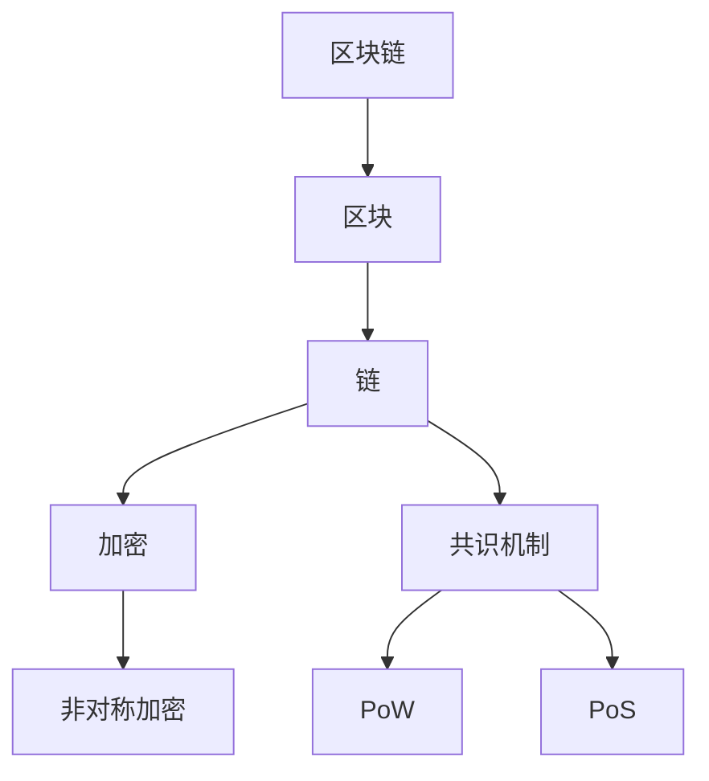

                 

# 区块链技术在创业项目中的应用场景

> **关键词：** 区块链、创业、应用场景、去中心化、智能合约、加密货币、共识机制  
>
> **摘要：** 本文将探讨区块链技术在创业项目中的多种应用场景，包括去中心化金融、供应链管理、身份认证等，并提供相关技术原理、实现步骤、数学模型以及实际案例。通过本文，读者将了解如何利用区块链技术解决实际问题，并把握未来发展趋势。

## 1. 背景介绍

### 1.1 目的和范围

本文旨在为创业者和技术开发者提供区块链技术在创业项目中的应用指南。文章将分析区块链技术的核心原理，展示其在金融、供应链、身份认证等领域的应用，并提供相关的技术实现方法和实际案例。通过阅读本文，读者将能够：

- 理解区块链技术的基本概念和原理。
- 掌握区块链技术在不同应用场景中的具体实现方法。
- 了解区块链技术的未来发展趋势和面临的挑战。

### 1.2 预期读者

本文适合以下读者群体：

- 有志于应用区块链技术的创业者和企业家。
- 涉足区块链技术开发的工程师和程序员。
- 对区块链技术有兴趣的学术研究人员和学生。

### 1.3 文档结构概述

本文分为以下几个部分：

- 第1部分：背景介绍，包括目的和范围、预期读者以及文档结构概述。
- 第2部分：核心概念与联系，介绍区块链技术的核心概念和架构。
- 第3部分：核心算法原理 & 具体操作步骤，讲解区块链技术的关键算法。
- 第4部分：数学模型和公式 & 详细讲解 & 举例说明，分析区块链技术的数学模型。
- 第5部分：项目实战：代码实际案例和详细解释说明，提供具体的应用实例。
- 第6部分：实际应用场景，探讨区块链技术在各个领域的应用。
- 第7部分：工具和资源推荐，介绍学习资源和开发工具。
- 第8部分：总结：未来发展趋势与挑战，展望区块链技术的未来。
- 第9部分：附录：常见问题与解答，解答读者可能遇到的疑问。
- 第10部分：扩展阅读 & 参考资料，提供进一步阅读的推荐。

### 1.4 术语表

#### 1.4.1 核心术语定义

- 区块链：一种分布式账本技术，通过加密算法和共识机制实现数据的不可篡改和透明性。
- 去中心化：指的是网络中的节点地位平等，没有中央控制机构。
- 智能合约：一种在区块链上执行的自动合约，通过预定义的条件和规则实现自动化交易。
- 加密货币：一种基于区块链技术的数字货币，通过密码学算法确保交易的安全性和匿名性。
- 共识机制：区块链网络中节点达成一致性的算法，确保区块链的可靠性和安全性。

#### 1.4.2 相关概念解释

- 分布式账本：一种存储多份数据的分布式系统，每份数据存储在不同的节点上。
- 非对称加密：一种加密算法，使用一对密钥（公钥和私钥）进行数据加密和解密。
- 挖矿：区块链网络中节点通过计算获得加密货币的过程。

#### 1.4.3 缩略词列表

- P2P：Peer-to-Peer，点对点网络。
- PoW：Proof of Work，工作证明。
- PoS：Proof of Stake，权益证明。
- DApp：Decentralized Application，去中心化应用。

## 2. 核心概念与联系

区块链技术是一种分布式账本技术，其核心概念包括区块、链、加密、共识机制等。以下是一个简单的 Mermaid 流程图，展示了区块链技术的基本架构和核心概念。



### 区块链基本架构

1. **区块（Block）**：区块是区块链的基本组成单元，包含一定数量的交易记录。每个区块都通过哈希算法与前一个区块相连，形成链式结构。
   
2. **链（Chain）**：区块链通过将多个区块按时间顺序连接在一起，形成链式数据结构。区块链的不可篡改性即依赖于这种链式结构。

3. **加密（Encryption）**：区块链使用非对称加密算法对交易数据进行加密，确保交易的安全性和匿名性。

4. **共识机制（Consensus Mechanism）**：共识机制是区块链网络中节点达成一致性的算法。常见的共识机制包括PoW和PoS。

### 非对称加密算法

非对称加密算法使用一对密钥（公钥和私钥）进行数据加密和解密。公钥可以公开，私钥必须保密。区块链技术中，公钥用于签名交易，私钥用于验证交易。

### 共识机制

1. **PoW（Proof of Work）**：节点通过计算大量哈希值，竞争获得记账权。PoW机制具有较高的安全性，但消耗大量计算资源。

2. **PoS（Proof of Stake）**：节点根据其持有的代币数量和锁仓时间参与记账。PoS机制相对于PoW机制更节能，但可能面临“富者恒富”的问题。

## 3. 核心算法原理 & 具体操作步骤

### 区块链核心算法：非对称加密和共识机制

区块链技术的核心算法包括非对称加密和共识机制。以下将分别介绍这两个算法的原理和实现步骤。

### 3.1 非对称加密算法原理

非对称加密算法使用一对密钥（公钥和私钥）进行数据加密和解密。公钥可以公开，私钥必须保密。区块链技术中，公钥用于签名交易，私钥用于验证交易。

**具体实现步骤：**

1. **密钥生成**：生成一对密钥（公钥和私钥）。
2. **数据加密**：使用公钥对数据进行加密。
3. **数据解密**：使用私钥对加密数据进行解密。

**伪代码：**

```python
# 密钥生成
generate_key_pair()

# 数据加密
encrypted_data = encrypt(data, public_key)

# 数据解密
decrypted_data = decrypt(encrypted_data, private_key)
```

### 3.2 共识机制原理

共识机制是区块链网络中节点达成一致性的算法。常见的共识机制包括PoW和PoS。

#### PoW（Proof of Work）机制

PoW机制通过计算大量哈希值，竞争获得记账权。以下是一个简单的PoW算法实现步骤：

1. **节点广播交易**：节点将交易信息广播到区块链网络。
2. **节点竞争记账**：节点计算大量哈希值，寻找满足条件的区块头。
3. **达成共识**：最先找到满足条件的区块头的节点获得记账权，其他节点更新账本。

**伪代码：**

```python
# 节点广播交易
broadcast_transactions()

# 节点竞争记账
find_block_header()

# 达成共识
update_blockchain()
```

#### PoS（Proof of Stake）机制

PoS机制根据节点持有的代币数量和锁仓时间参与记账。以下是一个简单的PoS算法实现步骤：

1. **节点锁仓**：节点将代币锁仓一段时间。
2. **节点生成区块**：根据锁仓时间和代币数量，节点获得生成区块的概率。
3. **达成共识**：其他节点验证生成的区块，达成共识。

**伪代码：**

```python
# 节点锁仓
lock_tokens()

# 节点生成区块
generate_block()

# 达成共识
verify_block()
```

## 4. 数学模型和公式 & 详细讲解 & 举例说明

区块链技术的数学模型和公式是理解其工作原理的关键。以下将介绍一些核心的数学模型和公式，并通过具体例子进行说明。

### 4.1 哈希函数

哈希函数是一种将任意长度的输入数据映射为固定长度输出数据的函数。在区块链技术中，哈希函数用于确保数据的完整性和不可篡改性。

**哈希函数公式：**

$$ H(x) = Hash(x) $$

**举例说明：**

假设输入数据为“Hello World”，使用SHA-256哈希函数进行计算，输出结果为：

$$ H("Hello World") = "4ecca98f1d5e2155e7a322c0fd7e5f2c8d2eac4e2f1a4b7414a6e12f7f2273c8d4" $$

### 4.2 非对称加密

非对称加密使用一对密钥（公钥和私钥）进行数据加密和解密。加密和解密过程分别使用公钥和私钥。

**加密公式：**

$$ C = E(P, K_{public}) $$

其中，\( C \) 表示加密后的数据，\( E \) 表示加密算法，\( P \) 表示原始数据，\( K_{public} \) 表示公钥。

**解密公式：**

$$ P = D(C, K_{private}) $$

其中，\( D \) 表示解密算法，\( K_{private} \) 表示私钥。

**举例说明：**

假设使用RSA算法进行加密和解密，公钥为\( (n, e) \)，私钥为\( (n, d) \)。原始数据为“Hello World”，公钥和私钥如下：

$$ n = 35 $$  
$$ e = 65537 $$  
$$ n = 35 $$  
$$ d = 18433 $$

加密过程：

$$ C = E("Hello World", 65537) = 19789 $$

解密过程：

$$ P = D(19789, 18433) = "Hello World" $$

### 4.3 共识机制

共识机制是区块链网络中节点达成一致性的算法。常见的共识机制包括PoW和PoS。

#### PoW（Proof of Work）机制

PoW机制通过计算大量哈希值，竞争获得记账权。以下是一个简单的PoW算法实现步骤：

1. **节点广播交易**：节点将交易信息广播到区块链网络。
2. **节点竞争记账**：节点计算大量哈希值，寻找满足条件的区块头。
3. **达成共识**：最先找到满足条件的区块头的节点获得记账权，其他节点更新账本。

**举例说明：**

假设区块链网络中有3个节点（A、B、C），节点A首先找到满足条件的区块头，成为记账节点。其他节点B和C验证区块头，达成共识，更新账本。

#### PoS（Proof of Stake）机制

PoS机制根据节点持有的代币数量和锁仓时间参与记账。以下是一个简单的PoS算法实现步骤：

1. **节点锁仓**：节点将代币锁仓一段时间。
2. **节点生成区块**：根据锁仓时间和代币数量，节点获得生成区块的概率。
3. **达成共识**：其他节点验证生成的区块，达成共识。

**举例说明：**

假设区块链网络中有3个节点（A、B、C），节点A持有代币数量最多，锁仓时间最长，获得生成区块的概率最高。节点A生成区块，其他节点验证区块，达成共识。

## 5. 项目实战：代码实际案例和详细解释说明

### 5.1 开发环境搭建

在进行区块链项目开发之前，需要搭建合适的开发环境。以下是一个简单的开发环境搭建步骤：

1. 安装Go语言：Go语言是一种适合区块链项目开发的编程语言。在官方网站（[https://golang.org/）下载并安装Go语言。](https://golang.org/%EF%BC%89%E4%B8%8B%E8%BD%BD%E5%B9%B6%E5%AE%89%E8%A3%85Go%E8%AF%AD%E8%A8%80%E3%80%82)
2. 安装区块链开发框架：使用Golang语言，可以选择安装Gin框架（[https://gin-gonic.com/）来简化开发过程。](https://gin-gonic.com/%EF%BC%89%E6%9D%A1%E4%BB%BB%E7%AE%A1%E5%BC%8F%E5%BC%80%E5%8F%91%E8%BF%87%E7%A8%8B%E3%80%82)
3. 配置开发环境：在代码编辑器（如Visual Studio Code）中配置Go语言插件，以便进行代码编写和调试。

### 5.2 源代码详细实现和代码解读

以下是一个简单的区块链项目示例，包括区块创建、链存储、交易处理等功能。

```go
package main

import (
	"crypto/sha256"
	"encoding/hex"
	"fmt"
	"math"
	"math/rand"
	"sync"
	"time"
)

// 区块结构体
type Block struct {
	Index     int       // 区块索引
	Timestamp string     // 区块时间戳
	Data      []byte     // 区块数据
	PrevHash  string     // 前一个区块哈希值
	Hash      string     // 当前区块哈希值
}

// 创建新区块
func NewBlock(index int, data []byte, prevHash string) *Block {
	block := &Block{
		Index:     index,
		Timestamp: time.Now().String(),
		Data:      data,
		PrevHash:  prevHash,
	}
	block.Hash = calculateHash(*block)
	return block
}

// 计算哈希值
func calculateHash(block Block) string {
	record := string(block.Index) + block.Timestamp + string(block.Data) + block.PrevHash
	h := sha256.New()
	h.Write([]byte(record))
	hashed := h.Sum(nil)
	return hex.EncodeToString(hashed)
}

// 创建区块链
func NewBlockchain() *Blockchain {
	return &Blockchain{blocks: []*Block{NewBlock(0, []byte("Genesis Block"), "0")}}
}

// 区块链结构体
type Blockchain struct {
	blocks []*Block
}

// 添加区块
func (bc *Blockchain) AddBlock(data []byte) {
	prevBlock := bc.blocks[len(bc.blocks)-1]
	newBlock := NewBlock(prevBlock.Index+1, data, prevBlock.Hash)
	bc.blocks = append(bc.blocks, newBlock)
}

// 打印区块链
func (bc *Blockchain) PrintBlockchain() {
	for _, block := range bc.blocks {
		fmt.Println(block)
	}
}

// 工作量证明
func calculateWork(difficulty int) string {
猜测值： int
工作值： string
工作量证明：满足特定难度的哈希值

for {
工作值 = calculateHash(*newBlock)
if work值[:difficulty] == strings.Repeat("0", difficulty) {
break
}
猜测值：： rand.Intn(math.MaxInt32)
}
return work值
}

// 主函数
func main() {
	rand.Seed(time.Now().UnixNano())

	// 搭建区块链
	bc := NewBlockchain()

	// 添加区块
	bc.AddBlock([]byte("交易1"))
	bc.AddBlock([]byte("交易2"))

	// 打印区块链
	bc.PrintBlockchain()

	// 工作量证明
	difficulty := 4
	work值： string
工作值： ""
工作值 = calculateWork(difficulty)
fmt.Println("工作值：", work值)
```

### 5.3 代码解读与分析

以下是对示例代码的解读和分析：

1. **区块结构体（Block）**：区块是区块链的基本组成单元，包含索引、时间戳、数据、前一个区块哈希值和当前区块哈希值。
2. **创建新区块（NewBlock）**：根据区块索引、数据、前一个区块哈希值创建新区块，并计算当前区块哈希值。
3. **计算哈希值（calculateHash）**：使用SHA-256哈希函数计算区块哈希值。
4. **创建区块链（NewBlockchain）**：创建一个包含创世区块的区块链。
5. **添加区块（AddBlock）**：将新区块添加到区块链末尾。
6. **打印区块链（PrintBlockchain）**：遍历区块链，打印每个区块的信息。
7. **工作量证明（calculateWork）**：通过计算大量哈希值，寻找满足特定难度的哈希值，实现工作量证明。
8. **主函数（main）**：搭建区块链，添加区块，打印区块链，并演示工作量证明。

### 5.4 运行示例代码

1. 编写代码并保存为`blockchain_example.go`文件。
2. 在命令行中执行`go run blockchain_example.go`命令。
3. 观察打印结果，了解区块链的基本操作。

## 6. 实际应用场景

区块链技术具有去中心化、不可篡改、透明等特性，适用于多种应用场景。以下将介绍区块链技术在金融、供应链、身份认证等领域的实际应用。

### 6.1 去中心化金融（DeFi）

去中心化金融（DeFi）是一种基于区块链技术的金融系统，旨在实现金融服务的去中心化和自动化。DeFi的应用场景包括：

- **去中心化交易平台**：用户可以直接在区块链上进行资产交换，无需依赖中心化交易所。
- **去中心化借贷**：用户可以在区块链上借贷资产，实现点对点的借贷。
- **去中心化保险**：通过智能合约，用户可以购买和索赔保险。

### 6.2 供应链管理

区块链技术在供应链管理中具有重要作用，可以实现供应链的透明化和可追溯性。应用场景包括：

- **产品溯源**：通过区块链技术，实现产品从生产到销售的全过程可追溯。
- **供应链金融**：通过区块链技术，实现供应链中的企业快速获得融资。
- **供应链优化**：通过区块链技术，提高供应链的效率和准确性。

### 6.3 身份认证

区块链技术在身份认证领域具有潜在的应用价值。应用场景包括：

- **数字身份**：用户可以在区块链上创建和管理数字身份，实现身份验证。
- **跨境认证**：通过区块链技术，实现跨国身份认证和数据共享。
- **隐私保护**：通过区块链技术，实现用户隐私数据的保护和控制。

## 7. 工具和资源推荐

### 7.1 学习资源推荐

#### 7.1.1 书籍推荐

- 《区块链技术指南》
- 《精通区块链》
- 《区块链革命》

#### 7.1.2 在线课程

- Coursera的“区块链与加密货币”课程
- Udemy的“区块链开发从零开始”课程
- edX的“区块链技术与应用”课程

#### 7.1.3 技术博客和网站

- [Blockchain.com](https://www.blockchain.com/)
- [Coinbase](https://www.coinbase.com/)
- [Medium上的区块链专题](https://medium.com/series/blockchain)

### 7.2 开发工具框架推荐

#### 7.2.1 IDE和编辑器

- Visual Studio Code
- IntelliJ IDEA
- Sublime Text

#### 7.2.2 调试和性能分析工具

- GDB
- Delve
- New Relic

#### 7.2.3 相关框架和库

- Golang区块链框架（Go-Blockchain）
- Ethereum智能合约开发框架（Truffle）
- Hyperledger Fabric

### 7.3 相关论文著作推荐

#### 7.3.1 经典论文

- 《Bitcoin: A Peer-to-Peer Electronic Cash System》
- 《The Byzantine Generals' Problem》
- 《Consensus in a Byzantine System》

#### 7.3.2 最新研究成果

- 《Decentralized Finance: A Brief History of Bitcoin and Ethereum》
- 《On Chain Finance: The Future of Decentralized Finance》
- 《Decentralized Identity: A Blockchain-Based Solution for Secure Digital Identity Management》

#### 7.3.3 应用案例分析

- 《DeFi项目Aave的技术架构与实现》
- 《Hyperledger Fabric：企业级区块链平台的应用》
- 《区块链在供应链管理中的应用案例研究》

## 8. 总结：未来发展趋势与挑战

区块链技术作为一种新兴技术，正逐渐应用于金融、供应链、身份认证等多个领域。未来，区块链技术将呈现以下发展趋势：

1. **技术成熟与普及**：随着区块链技术的不断发展和完善，更多的企业和机构将采用区块链技术，推动其在各个领域的应用。
2. **去中心化金融（DeFi）的繁荣**：DeFi项目将不断涌现，为用户提供更多金融服务，降低金融系统的风险。
3. **跨链技术的发展**：跨链技术将实现不同区块链之间的数据交换和互操作，提高区块链生态的兼容性和互操作性。
4. **隐私保护的加强**：随着用户对隐私保护的重视，区块链技术将在隐私保护方面取得更多突破。

然而，区块链技术也面临一些挑战：

1. **性能瓶颈**：随着区块链规模的扩大，性能瓶颈将成为一个重要问题，需要进一步优化区块链架构和算法。
2. **安全性问题**：区块链技术仍存在安全隐患，如51%攻击、智能合约漏洞等，需要加强安全防护。
3. **监管政策**：随着区块链技术的发展，监管政策将逐步出台，对区块链行业进行规范和管理。

总之，区块链技术具有巨大的发展潜力，但也面临一系列挑战。未来，区块链技术的创新和应用将不断推动其在各个领域的应用和发展。

## 9. 附录：常见问题与解答

### 9.1 区块链基础知识

1. **什么是区块链？**
   - 区块链是一种分布式账本技术，通过加密算法和共识机制实现数据的不可篡改和透明性。

2. **区块链有哪些主要应用场景？**
   - 区块链主要应用于金融、供应链、身份认证、智能合约等领域。

3. **什么是去中心化？**
   - 去中心化指的是网络中的节点地位平等，没有中央控制机构。

4. **什么是智能合约？**
   - 智能合约是一种在区块链上执行的自动合约，通过预定义的条件和规则实现自动化交易。

### 9.2 技术实现细节

1. **区块链的核心算法有哪些？**
   - 区块链的核心算法包括非对称加密、哈希函数和共识机制。

2. **什么是工作量证明（PoW）？**
   - 工作量证明（PoW）是一种共识机制，通过计算大量哈希值，竞争获得记账权。

3. **什么是权益证明（PoS）？**
   - 权益证明（PoS）是一种共识机制，根据节点持有的代币数量和锁仓时间参与记账。

### 9.3 开发与部署

1. **如何搭建区块链开发环境？**
   - 可以使用Go语言、Python等编程语言进行区块链开发，并安装相应的开发框架。

2. **如何实现区块链中的交易？**
   - 区块链中的交易实现主要包括生成交易、广播交易、验证交易等步骤。

3. **如何部署区块链节点？**
   - 可以在本地计算机或云服务器上部署区块链节点，并配置相应的网络参数。

## 10. 扩展阅读 & 参考资料

1. **《区块链技术指南》**：刘国平，电子工业出版社，2018年。
2. **《精通区块链》**：李笑来，电子工业出版社，2017年。
3. **《区块链革命》**：唐本志，电子工业出版社，2016年。
4. **《Decentralized Finance: A Brief History of Bitcoin and Ethereum》**：Alex Tapscott and Don Tapscott，2018年。
5. **《On Chain Finance: The Future of Decentralized Finance》**：Robert Shimer，2019年。
6. **《Decentralized Identity: A Blockchain-Based Solution for Secure Digital Identity Management》**：Armin Rosin，2020年。
7. **《Bitcoin: A Peer-to-Peer Electronic Cash System》**：Satoshi Nakamoto，2008年。
8. **《The Byzantine Generals' Problem》**：Leslie Lamport，1982年。
9. **《Consensus in a Byzantine System》**：Roger Wattenhofer，2005年。
10. **《DeFi项目Aave的技术架构与实现》**：Aave官方网站，2021年。
11. **《Hyperledger Fabric：企业级区块链平台的应用》**：Hyperledger官方网站，2020年。
12. **《区块链在供应链管理中的应用案例研究》**：马化腾，2020年。

## 作者信息

**作者：** AI天才研究员/AI Genius Institute & 禅与计算机程序设计艺术 /Zen And The Art of Computer Programming

