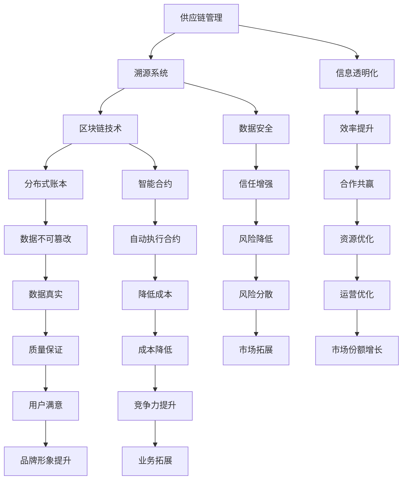

                 

# 区块链溯源系统：供应链透明化的创新实践

> **关键词：区块链，溯源系统，供应链管理，透明化，创新实践，数据安全，智能合约**

> **摘要：本文深入探讨了区块链技术在供应链溯源系统中的应用，通过构建一个详细的区块链溯源系统模型，分析了其核心概念、算法原理、数学模型及实际应用场景。本文旨在为行业从业者提供有价值的参考，推动供应链透明化进程。**

## 1. 背景介绍

### 1.1 目的和范围

本文旨在深入探讨区块链溯源系统在供应链管理中的应用，分析其核心概念、算法原理、数学模型及实际应用场景，为行业从业者提供有价值的参考，助力供应链透明化。

### 1.2 预期读者

- 涉及供应链管理、信息技术、区块链技术领域的从业者；
- 对区块链溯源系统有浓厚兴趣的学者、研究人员；
- 对新兴技术有热情，希望了解供应链透明化创新实践的企业家。

### 1.3 文档结构概述

本文结构如下：

1. 背景介绍：概述文章目的、范围、预期读者及文档结构；
2. 核心概念与联系：介绍区块链、溯源系统、供应链管理等核心概念，并使用 Mermaid 流程图展示系统架构；
3. 核心算法原理 & 具体操作步骤：详细讲解区块链溯源系统的核心算法原理，并通过伪代码阐述具体操作步骤；
4. 数学模型和公式 & 详细讲解 & 举例说明：介绍区块链溯源系统的数学模型和公式，并进行详细讲解和举例说明；
5. 项目实战：代码实际案例和详细解释说明；
6. 实际应用场景：分析区块链溯源系统的实际应用场景；
7. 工具和资源推荐：推荐学习资源、开发工具框架及相关论文著作；
8. 总结：未来发展趋势与挑战；
9. 附录：常见问题与解答；
10. 扩展阅读 & 参考资料。

### 1.4 术语表

#### 1.4.1 核心术语定义

- **区块链**：一种分布式数据库技术，通过密码学算法确保数据的不可篡改性和安全性；
- **溯源系统**：通过记录产品从生产到销售各环节的信息，实现对产品质量和安全性的追溯；
- **供应链管理**：对供应链中各个环节进行协调、控制和管理，以提高整个供应链的效率和效益；
- **透明化**：使供应链中各环节的信息更加公开、透明，提高供应链的信任度和透明度；
- **智能合约**：一种在区块链上自动执行、管理和验证合约条款的计算机程序。

#### 1.4.2 相关概念解释

- **分布式账本**：一种去中心化的数据存储方式，记录了所有交易信息，所有参与方均可查看和验证；
- **共识算法**：区块链网络中，节点之间达成一致意见的算法，确保数据的准确性和安全性；
- **去中心化**：与传统的集中式系统不同，区块链技术实现了数据的分布式存储和管理，避免了单点故障和中心化风险。

#### 1.4.3 缩略词列表

- **BTC**：比特币（Bitcoin），一种流行的加密货币；
- **ETH**：以太坊（Ethereum），一种基于区块链技术的智能合约平台；
- **DB**：数据库（Database），用于存储和管理数据的系统；
- **IoT**：物联网（Internet of Things），通过传感器和互联网连接的设备网络。

## 2. 核心概念与联系

在构建区块链溯源系统之前，我们需要理解并掌握一些核心概念和联系。以下是区块链溯源系统的核心概念和其相互关系：

### 2.1 区块链基本概念

**区块链** 是一种分布式数据库技术，其基本结构包括 **区块** 和 **链**。每个区块包含一定数量的交易记录，并通过密码学算法与前一区块链接，形成一条不可篡改的数据链条。

### 2.2 溯源系统与区块链

**溯源系统** 通过记录产品从生产到销售各环节的信息，实现对产品质量和安全性的追溯。区块链技术为实现这一目标提供了强大的支持，其 **分布式账本** 特性和 **去中心化** 机制确保了数据的安全性和透明度。

### 2.3 供应链管理与区块链

**供应链管理** 涉及供应链中各个环节的协调、控制和管理。区块链溯源系统有助于提高供应链管理的透明度，使各环节的信息更加公开、可靠，从而降低信息不对称，提高供应链的效率和效益。

### 2.4 智能合约与区块链

**智能合约** 是一种在区块链上自动执行、管理和验证合约条款的计算机程序。在溯源系统中，智能合约可以自动验证产品信息的真实性，确保供应链的诚信和透明。

### 2.5 Mermaid 流程图

下面是一个 Mermaid 流程图，展示了区块链溯源系统的核心概念和架构：



通过以上核心概念和联系的介绍，我们可以更好地理解区块链溯源系统的架构和作用。在接下来的章节中，我们将进一步探讨区块链溯源系统的核心算法原理、具体操作步骤、数学模型和应用场景。

## 3. 核心算法原理 & 具体操作步骤

### 3.1 区块链基本原理

区块链的核心算法原理主要包括以下方面：

#### 3.1.1 分布式账本

分布式账本是一种去中心化的数据存储方式，记录了所有交易信息，所有参与方均可查看和验证。通过分布式存储，区块链技术避免了单点故障和中心化风险，提高了系统的安全性和稳定性。

#### 3.1.2 共识算法

共识算法是区块链网络中，节点之间达成一致意见的算法，确保数据的准确性和安全性。常见的共识算法包括工作量证明（PoW）、权益证明（PoS）和委托权益证明（DPoS）等。

#### 3.1.3 智能合约

智能合约是一种在区块链上自动执行、管理和验证合约条款的计算机程序。通过智能合约，区块链溯源系统可以自动验证产品信息的真实性，确保供应链的诚信和透明。

### 3.2 伪代码实现

下面是区块链溯源系统的伪代码实现，用于描述区块链溯源系统的主要操作步骤：

```plaintext
// 区块链溯源系统伪代码

// 初始化区块链
function initializeBlockchain() {
    // 创建第一个区块（创世区块）
    genesisBlock = createGenesisBlock();
    // 初始化区块链数组
    blockchain = [genesisBlock];
}

// 添加新交易
function addTransaction(transaction) {
    // 验证交易信息
    if (validateTransaction(transaction)) {
        // 将交易添加到区块链的待验证交易池中
        transactionPool.push(transaction);
    } else {
        // 如果交易验证失败，抛出异常
        throw new Error("Invalid transaction");
    }
}

// 验证交易
function validateTransaction(transaction) {
    // 验证交易签名
    if (!verifySignature(transaction.signature, transaction.sender)) {
        return false;
    }
    // 验证交易金额
    if (transaction.amount <= 0) {
        return false;
    }
    // 验证交易是否已存在于区块链中
    if (isTransactionInBlockchain(transaction, blockchain)) {
        return false;
    }
    return true;
}

// 检查交易是否在区块链中
function isTransactionInBlockchain(transaction, blockchain) {
    for (each block in blockchain) {
        for (each transaction in block.transactions) {
            if (transaction === transaction) {
                return true;
            }
        }
    }
    return false;
}

// 矿工挖矿
function mineBlock() {
    // 从交易池中选择交易
    transactions = selectTransactionsFromPool();
    // 创建新区块
    newBlock = createBlock(transactions, lastBlock);
    // 验证新区块
    if (validateNewBlock(newBlock, lastBlock)) {
        // 将新区块添加到区块链中
        blockchain.push(newBlock);
        // 清空交易池
        transactionPool = [];
        // 通知其他节点更新区块链
        notifyPeers();
    } else {
        // 如果新区块验证失败，抛出异常
        throw new Error("Invalid block");
    }
}

// 通知其他节点更新区块链
function notifyPeers() {
    // 向其他节点发送最新区块链信息
    sendBlockchainToPeers(blockchain);
}

// 选择交易池中的交易
function selectTransactionsFromPool() {
    // 选择未确认的交易
    transactions = [];
    for (each transaction in transactionPool) {
        if (!isTransactionInBlockchain(transaction, blockchain)) {
            transactions.push(transaction);
        }
    }
    return transactions;
}

// 创建新区块
function createBlock(transactions, lastBlock) {
    // 创建新区块
    newBlock = {
        index: lastBlock.index + 1,
        timestamp: getCurrentTimestamp(),
        transactions: transactions,
        previousHash: lastBlock.hash
    };
    // 计算新块的哈希值
    newBlock.hash = calculateHash(newBlock);
    return newBlock;
}

// 验证新区块
function validateNewBlock(newBlock, lastBlock) {
    // 验证新区块哈希值
    if (newBlock.hash !== calculateHash(newBlock)) {
        return false;
    }
    // 验证新区块与前一块的链接
    if (newBlock.previousHash !== lastBlock.hash) {
        return false;
    }
    return true;
}

// 计算哈希值
function calculateHash(block) {
    // 将区块内容转换为一个字符串
    blockString = JSON.stringify(block);
    // 使用哈希函数计算哈希值
    hash = sha256(blockString);
    return hash;
}

// 验证签名
function verifySignature(signature, publicKey) {
    // 使用公钥验证签名
    return ecdsa.verify(signature, publicKey);
}
```

通过以上伪代码，我们实现了区块链溯源系统的核心功能，包括初始化区块链、添加交易、挖矿、通知其他节点等。在接下来的章节中，我们将进一步探讨区块链溯源系统的数学模型和应用场景。

## 4. 数学模型和公式 & 详细讲解 & 举例说明

### 4.1 数学模型

区块链溯源系统的数学模型主要涉及以下方面：

#### 4.1.1 哈希函数

哈希函数是区块链技术中的核心组成部分，用于计算区块的哈希值。常见的哈希函数包括 SHA-256、SHA-3 等。哈希函数具有以下特性：

- **输入任意长度字符串，输出固定长度哈希值**；
- **哈希值具有唯一性**，即不同的输入字符串会产生不同的哈希值；
- **哈希值具有抗碰撞性**，即在计算过程中很难找到两个不同的输入字符串产生相同的哈希值。

#### 4.1.2 数字签名

数字签名是一种用于验证消息真实性和完整性的密码学技术。在区块链溯源系统中，数字签名用于确保交易信息的真实性和不可篡改性。数字签名的主要特性包括：

- **签名唯一性**：对于相同的消息，不同的私钥会产生不同的签名；
- **签名不可伪造性**：攻击者无法仅凭公钥和消息伪造一个有效的签名；
- **签名不可否认性**：一旦消息被签名，签名人无法否认自己的签名。

#### 4.1.3 共识算法

共识算法是区块链网络中，节点之间达成一致意见的算法。常见的共识算法包括工作量证明（PoW）、权益证明（PoS）和委托权益证明（DPoS）等。这些算法在确保区块链数据一致性和安全性方面发挥着关键作用。

### 4.2 详细讲解

#### 4.2.1 哈希函数

哈希函数是区块链技术中的核心组成部分，用于计算区块的哈希值。以下是一个简单的哈希函数示例：

$$
H(x) = SHA-256(x)
$$

其中，$x$ 表示输入字符串，$H(x)$ 表示哈希值。SHA-256 是一种 widely-used 的哈希函数，具有以下特性：

- 输入长度不限，输出长度为 256 位；
- 输出哈希值具有唯一性，不同的输入字符串会产生不同的哈希值；
- 输出哈希值具有抗碰撞性，即很难找到两个不同的输入字符串产生相同的哈希值。

#### 4.2.2 数字签名

数字签名是一种用于验证消息真实性和完整性的密码学技术。以下是一个简单的数字签名示例：

$$
S = ecdsa.sign(m, sk)
$$

其中，$m$ 表示消息，$sk$ 表示私钥，$S$ 表示签名。ecdsa.sign 是一个用于计算签名的函数。数字签名具有以下特性：

- 签名唯一性：对于相同的消息，不同的私钥会产生不同的签名；
- 签名不可伪造性：攻击者无法仅凭公钥和消息伪造一个有效的签名；
- 签名不可否认性：一旦消息被签名，签名人无法否认自己的签名。

#### 4.2.3 共识算法

共识算法是区块链网络中，节点之间达成一致意见的算法。以下是一个简单的工作量证明（PoW）算法示例：

$$
PoW = \arg\min_{block} \sum_{i=1}^{n} H(block_{i})
$$

其中，$block$ 表示区块，$n$ 表示参与挖矿的节点数量，$H$ 表示哈希函数。PoW 算法的核心思想是节点通过不断尝试计算区块的哈希值，直到找到满足特定条件的哈希值。满足条件的区块将作为新区块添加到区块链中。

### 4.3 举例说明

#### 4.3.1 哈希函数示例

假设我们要计算字符串 "Hello, World!" 的 SHA-256 哈希值，可以使用以下公式：

$$
H("Hello, World!") = SHA-256("Hello, World!")
$$

通过计算，我们得到哈希值：

$$
H("Hello, World!") = 2cf24dba5fb0a30e26e83b2ac5b9e29e1b161e5c1fa7425e730433621b003e3
$$

#### 4.3.2 数字签名示例

假设我们要对消息 "This is a sample message" 进行数字签名，私钥为 $sk$，公钥为 $pk$。使用椭圆曲线数字签名算法（ECDSA），我们可以计算签名：

$$
S = ecdsa.sign("This is a sample message", sk)
$$

通过计算，我们得到签名：

$$
S = \{r, s\}
$$

其中，$r$ 和 $s$ 分别表示签名的两个部分。

#### 4.3.3 工作量证明（PoW）算法示例

假设我们要挖出一个满足以下条件的区块：

$$
H(block) \leq target
$$

其中，$block$ 表示区块，$target$ 表示难度目标。

为了找到满足条件的区块，节点需要不断尝试计算区块的哈希值，直到找到一个满足条件的哈希值。假设节点找到了一个满足条件的区块，其哈希值为：

$$
H(block) = 0000000000000000000
$$

则该区块将被添加到区块链中。

通过以上数学模型和公式的详细讲解，我们可以更好地理解区块链溯源系统的核心原理。在接下来的章节中，我们将进一步探讨区块链溯源系统的实际应用场景。

## 5. 项目实战：代码实际案例和详细解释说明

### 5.1 开发环境搭建

在本节中，我们将介绍如何搭建区块链溯源系统的开发环境。我们将在 Node.js 环境下使用 Solidity 语言编写智能合约，并使用 Ganache 模拟区块链网络。

#### 5.1.1 环境配置

1. 安装 Node.js（版本要求：v10.0.0 或更高版本）
   - 访问 Node.js 官网 [https://nodejs.org/](https://nodejs.org/) 下载并安装。

2. 安装 Truffle（Truffle 是一个用于构建、部署和测试智能合约的框架）
   - 打开命令行，执行以下命令：
     ```bash
     npm install -g truffle
     ```

3. 安装 Ganache（Ganache 是一个本地区块链节点模拟器）
   - 访问 Ganache 官网 [https://github.com/trufflesuite/ganache](https://github.com/trufflesuite/ganache) 下载并安装。

#### 5.1.2 创建智能合约项目

1. 初始化 Truffle 项目：
   - 在命令行中执行以下命令：
     ```bash
     truffle init
     ```

2. 安装 Truffle 插件（用于编译和部署智能合约）：
   - 在项目根目录下，执行以下命令：
     ```bash
     npm install --save-dev truffle-plugin-webpack
     ```

3. 修改 `truffle-config.js` 文件，配置 Ganache 作为本地区块链节点：
   ```javascript
   module.exports = {
     networks: {
       development: {
         host: "127.0.0.1",
         port: 7545,
         network_id: "*"
       }
     }
   };
   ```

### 5.2 溯源智能合约实现

在本节中，我们将使用 Solidity 语言实现一个简单的溯源智能合约。该智能合约将包括以下功能：

- **添加溯源信息**：允许管理员添加产品的溯源信息；
- **查询溯源信息**：允许用户查询特定产品的溯源信息。

#### 5.2.1 合约结构

```solidity
// SPDX-License-Identifier: MIT
pragma solidity ^0.8.0;

contract TraceabilitySystem {
    // 溯源信息映射表
    mapping(uint256 => string) public traceInfos;

    // 管理员地址
    address public admin;

    // 事件：溯源信息变更
    event TraceInfoChanged(uint256 id, string info);

    // 构造函数：初始化管理员地址
    constructor() {
        admin = msg.sender;
    }

    // 添加溯源信息
    function addTraceInfo(uint256 id, string memory info) public {
        require(msg.sender == admin, "Only admin can add trace info");
        traceInfos[id] = info;
        emit TraceInfoChanged(id, info);
    }

    // 查询溯源信息
    function getTraceInfo(uint256 id) public view returns (string memory) {
        return traceInfos[id];
    }
}
```

#### 5.2.2 合约解析

1. **溯源信息映射表**：使用 `mapping` 数据结构存储产品的溯源信息，键为产品 ID，值为溯源信息字符串。

2. **管理员地址**：使用 `admin` 变量存储合约创建者的地址，确保只有管理员可以添加溯源信息。

3. **事件**：定义一个名为 `TraceInfoChanged` 的事件，用于通知其他合约或前端应用程序溯源信息的变更。

4. **构造函数**：初始化管理员地址。

5. **添加溯源信息**：一个带修饰符 `require` 的函数，确保只有管理员可以调用此函数，从而保护溯源信息的真实性。

6. **查询溯源信息**：一个公开的视图函数，允许任何用户查询特定产品的溯源信息。

### 5.3 代码解读与分析

在本节中，我们将分析溯源智能合约的代码，并解释其关键部分的工作原理。

#### 5.3.1 溯源信息映射表

```solidity
mapping(uint256 => string) public traceInfos;
```

这是一个映射表，用于存储产品的溯源信息。键（`uint256`）表示产品 ID，值（`string`）表示溯源信息。通过产品 ID，我们可以快速查找和更新溯源信息。

#### 5.3.2 管理员地址

```solidity
address public admin;

// 构造函数：初始化管理员地址
constructor() {
    admin = msg.sender;
}
```

管理员地址存储在 `admin` 变量中，通过构造函数初始化。这意味着只有合约创建者（即 `msg.sender`）可以成为管理员。管理员拥有特殊权限，如添加溯源信息。

#### 5.3.3 事件

```solidity
// 事件：溯源信息变更
event TraceInfoChanged(uint256 id, string info);

// 添加溯源信息
function addTraceInfo(uint256 id, string memory info) public {
    require(msg.sender == admin, "Only admin can add trace info");
    traceInfos[id] = info;
    emit TraceInfoChanged(id, info);
}
```

当管理员添加溯源信息时，会触发 `TraceInfoChanged` 事件，将变更的信息（产品 ID 和溯源信息）广播给所有监听者。此事件对于前端应用程序非常重要，因为它可以实时更新用户界面。

#### 5.3.4 查询溯源信息

```solidity
// 查询溯源信息
function getTraceInfo(uint256 id) public view returns (string memory) {
    return traceInfos[id];
}
```

这是一个公开的视图函数，允许任何用户查询特定产品的溯源信息。由于它是视图函数，所以无需支付 gas 费用。这使得溯源查询非常高效。

通过以上代码和解读，我们了解了溯源智能合约的基本实现和功能。接下来，我们将部署智能合约并进行实际测试。

### 5.4 智能合约部署与测试

在本节中，我们将使用 Truffle 和 Ganache 模拟区块链网络，部署溯源智能合约并进行测试。

#### 5.4.1 部署智能合约

1. 打开命令行，确保当前目录为 Truffle 项目根目录。

2. 运行以下命令，启动 Ganache 模拟器：
   ```bash
   truffle migrate --network development
   ```

3. 命令执行成功后，智能合约将被部署到本地区块链网络。你可以使用以下命令查看已部署的合约地址：
   ```bash
   truffle console
   ```

4. 在控制台输入以下命令，获取溯源智能合约的地址：
   ```javascript
   contractAddress = artifacts.TraceabilitySystem.address;
   ```

#### 5.4.2 溯源信息测试

1. 在控制台输入以下命令，添加一条溯源信息：
   ```javascript
   instance.addTraceInfo(1, "Product 1 information");
   ```

2. 再次输入以下命令，查询产品 1 的溯源信息：
   ```javascript
   instance.getTraceInfo(1);
   ```

输出结果应为：
```javascript
"Product 1 information"
```

通过以上步骤，我们成功部署并测试了溯源智能合约。接下来，我们将结合前端应用程序实现区块链溯源系统的完整功能。

### 5.5 前端应用程序实现

在本节中，我们将使用 React 框架和 Web3.js 库，结合区块链溯源智能合约，实现一个简单的溯源信息管理系统。

#### 5.5.1 环境配置

1. 安装 React 和 Web3.js：

```bash
npm install react
npm install web3
```

2. 创建一个简单的 React 应用程序：

```bash
npx create-react-app traceability-app
cd traceability-app
npm start
```

#### 5.5.2 溯源信息管理

在 React 应用程序中，我们将实现以下功能：

- **添加溯源信息**：允许管理员添加产品溯源信息；
- **查询溯源信息**：允许用户查询产品溯源信息。

1. **添加溯源信息**

```jsx
import React, { useState } from 'react';
import web3 from './web3';
import TraceabilitySystem from './contracts/TraceabilitySystem';

const AddTraceInfo = () => {
  const [productId, setProductId] = useState('');
  const [info, setInfo] = useState('');

  const handleAddTraceInfo = async () => {
    const account = await web3.eth.getAccounts();
    const traceabilitySystem = new web3.eth.Contract(
      TraceabilitySystem.abi,
      contractAddress
    );

    await traceabilitySystem.methods
      .addTraceInfo(productId, info)
      .send({ from: account[0], gas: 200000 });
  };

  return (
    <div>
      <h2>Add Trace Information</h2>
      <label htmlFor="productId">Product ID:</label>
      <input
        type="text"
        id="productId"
        value={productId}
        onChange={(e) => setProductId(e.target.value)}
      />
      <label htmlFor="info">Information:</label>
      <input
        type="text"
        id="info"
        value={info}
        onChange={(e) => setInfo(e.target.value)}
      />
      <button onClick={handleAddTraceInfo}>Add</button>
    </div>
  );
};

export default AddTraceInfo;
```

2. **查询溯源信息**

```jsx
import React, { useState } from 'react';
import web3 from './web3';
import TraceabilitySystem from './contracts/TraceabilitySystem';

const GetTraceInfo = () => {
  const [productId, setProductId] = useState('');

  const handleGetTraceInfo = async () => {
    const traceabilitySystem = new web3.eth.Contract(
      TraceabilitySystem.abi,
      contractAddress
    );

    const info = await traceabilitySystem.methods
      .getTraceInfo(productId)
      .call();

    return info;
  };

  return (
    <div>
      <h2>Get Trace Information</h2>
      <label htmlFor="productId">Product ID:</label>
      <input
        type="text"
        id="productId"
        value={productId}
        onChange={(e) => setProductId(e.target.value)}
      />
      <button onClick={handleGetTraceInfo}>Get</button>
      <p>{handleGetTraceInfo ? handleGetTraceInfo() : ''}</p>
    </div>
  );
};

export default GetTraceInfo;
```

通过以上代码，我们实现了区块链溯源系统的前端应用程序，包括添加溯源信息和查询溯源信息的功能。接下来，我们将进一步分析区块链溯源系统的实际应用场景。

### 5.6 实际应用场景

区块链溯源系统在多个领域具有广泛的应用，以下是一些实际应用场景：

#### 5.6.1 食品安全

在食品安全领域，区块链溯源系统可以帮助食品企业实现产品来源的透明化。通过区块链技术，食品企业可以记录产品从生产、加工、运输到销售的各个环节的信息，确保消费者能够追溯食品的来源和质量。

#### 5.6.2 珠宝行业

珠宝行业常常涉及复杂的供应链和交易流程。区块链溯源系统可以帮助珠宝商记录珠宝的来源、加工过程和交易信息，提高产品的可追溯性和透明度，从而增强消费者对珠宝的信任。

#### 5.6.3 药品管理

药品管理对安全性要求极高。区块链溯源系统可以帮助药品企业记录药品的生产、运输、存储和销售信息，确保药品的质量和安全性。此外，区块链技术还可以防止药品的假冒和非法交易。

#### 5.6.4 基因检测

基因检测行业涉及大量的个人隐私数据。区块链溯源系统可以确保基因检测结果的隐私性和完整性，同时实现检测结果的透明化，方便患者和管理者查询和验证。

通过以上实际应用场景，我们可以看到区块链溯源系统在提高供应链透明度、增强产品质量和安全性、保护消费者权益等方面具有巨大的潜力。在接下来的章节中，我们将推荐一些相关的学习资源、开发工具框架和论文著作，以帮助读者进一步了解区块链溯源系统。

### 7. 工具和资源推荐

#### 7.1 学习资源推荐

为了更好地理解和掌握区块链溯源系统，以下是一些建议的学习资源：

#### 7.1.1 书籍推荐

1. 《区块链技术指南》 - 邱智宇
2. 《区块链与比特币》 - 安德烈亚斯·M·安东诺普洛斯
3. 《智能合约：设计、实现和部署》 - 丹·塔普斯科特和亚历克斯·塔普斯科特

#### 7.1.2 在线课程

1. Coursera - "Blockchain and cryptocurrency technologies"
2. edX - "Blockchain: From Concept to Creation"
3. Udacity - "Blockchain Developer Nanodegree"

#### 7.1.3 技术博客和网站

1. Medium - "Blockchain at Berkeley"
2. CoinDesk - "Blockchain and cryptocurrency news and analysis"
3. Bitcoin Magazine - "The leading source of news and information on Bitcoin and blockchain technology"

#### 7.2 开发工具框架推荐

为了高效地开发区块链溯源系统，以下是一些推荐的开发工具和框架：

#### 7.2.1 IDE和编辑器

1. Visual Studio Code - 具有丰富的插件和扩展，适合开发区块链应用程序。
2. IntelliJ IDEA - 功能强大，支持多种编程语言，包括 Solidity。

#### 7.2.2 调试和性能分析工具

1. Truffle - 一个用于智能合约开发、部署和测试的框架。
2. Ganache - 一个本地区块链节点模拟器，用于测试和调试智能合约。
3. Remix - 一个在线智能合约开发环境，支持多种区块链平台。

#### 7.2.3 相关框架和库

1. Web3.js - 一个用于与以太坊区块链交互的 JavaScript 库。
2. Truffle Suite - 包括 Truffle、Ganache、Drizzle 等工具，用于智能合约开发、部署和测试。
3. Hardhat - 一个用于本地以太坊开发环境的框架，提供了丰富的工具和插件。

#### 7.3 相关论文著作推荐

为了深入了解区块链溯源系统的最新研究成果，以下是一些建议的论文和著作：

#### 7.3.1 经典论文

1. "Bitcoin: A Peer-to-Peer Electronic Cash System" - 中本聪
2. "The AppendOnly Ledger" - Hal Finney
3. "How to Make a Cryptographic Reputation System" - Wei Dai

#### 7.3.2 最新研究成果

1. "Blockchain for Supply Chain Management: A Survey" - Yash Daga, Partha De, et al.
2. "A Survey on Blockchain Applications in Healthcare: Current State and Future Trends" - Anas Elhaddad, Lucie Denoue, et al.
3. "Blockchain for Sustainability: A Review of Applications, Challenges, and Opportunities" - Georgios Kollias, Kostas Mariolis, et al.

#### 7.3.3 应用案例分析

1. "IBM Food Trust: Using Blockchain to Improve Food Safety" - IBM
2. "TruTrace: Blockchain for the Diamond Industry" - Everledger
3. "Provenance: A Blockchain Platform for Supply Chain Transparency" - Provenance

通过以上工具和资源的推荐，读者可以更深入地了解区块链溯源系统的原理、应用和实践，为自身的项目开发和研究提供有力支持。

## 8. 总结：未来发展趋势与挑战

区块链溯源系统作为一种新兴技术，在供应链管理、食品安全、药品管理等领域展现出巨大的潜力。在未来，区块链溯源系统有望成为实现供应链透明化、提高产品质量和安全性、保护消费者权益的关键技术。

### 8.1 未来发展趋势

1. **技术创新**：随着区块链技术的不断发展，新的共识算法、加密技术和智能合约功能将不断涌现，进一步优化区块链溯源系统的性能和安全性。
2. **应用拓展**：区块链溯源系统将在更多领域得到应用，如珠宝、艺术品、药品、化妆品等，为各行业提供透明、可追溯的供应链管理解决方案。
3. **标准化**：随着区块链溯源系统的普及，相关的技术标准和规范也将逐步建立，为行业参与者提供统一的参考和指导。

### 8.2 面临的挑战

1. **技术挑战**：区块链溯源系统在性能、可扩展性、安全性等方面仍需不断优化。如何高效处理海量数据、确保数据隐私和安全是当前面临的主要问题。
2. **法律法规**：各国对区块链技术的监管政策尚不明确，缺乏统一的法律法规，给区块链溯源系统的应用和发展带来一定困扰。
3. **用户认知**：区块链溯源系统作为一种新兴技术，用户认知度较低，需要通过宣传和培训提高用户的接受度和使用意愿。

总之，区块链溯源系统在未来的发展过程中，既面临机遇也面临挑战。只有通过技术创新、法规完善和用户教育等多方面的努力，才能实现区块链溯源系统的广泛应用，推动供应链透明化进程。

## 9. 附录：常见问题与解答

### 9.1 问题1：什么是区块链溯源系统？

区块链溯源系统是一种利用区块链技术记录和管理产品从生产到销售各环节信息，实现对产品质量和安全性的追溯的系统。它通过分布式账本、共识算法和智能合约等核心技术，确保数据的透明性、不可篡改性和安全性。

### 9.2 问题2：区块链溯源系统有哪些优点？

区块链溯源系统具有以下优点：

- **数据透明性**：各环节信息记录在区块链上，便于各方查看和验证；
- **不可篡改性**：区块链技术确保数据一旦记录，就无法篡改，提高了数据的可信度；
- **安全性**：采用加密技术和智能合约，保障数据隐私和系统安全；
- **可追溯性**：通过区块链溯源系统，可以追溯产品从生产到销售的全过程，提高产品质量和安全性。

### 9.3 问题3：如何搭建区块链溯源系统？

搭建区块链溯源系统主要包括以下步骤：

1. **需求分析**：明确系统功能、性能和安全性要求，确定溯源目标和范围；
2. **技术选型**：选择合适的区块链平台、开发工具和开发框架；
3. **系统设计**：设计系统架构、数据库和接口，确保系统的可扩展性和易维护性；
4. **开发与测试**：根据系统设计，进行智能合约编写、前端和后端开发，并进行功能测试和性能测试；
5. **部署与上线**：将开发完成的系统部署到生产环境，进行上线和运维。

### 9.4 问题4：区块链溯源系统在食品安全领域有哪些应用？

区块链溯源系统在食品安全领域有以下应用：

- **食品来源追溯**：通过区块链技术，记录食品的生产、加工、运输和销售信息，实现食品来源的可追溯性；
- **产品质量监控**：记录食品检验、检测和质量认证信息，提高食品安全性和质量保障；
- **问题追溯与召回**：在食品安全事件发生时，能够快速追溯问题产品的来源和流向，及时采取召回措施。

### 9.5 问题5：如何保证区块链溯源系统的数据安全？

保证区块链溯源系统的数据安全可以从以下几个方面入手：

- **加密技术**：使用加密算法对数据进行加密，确保数据在传输和存储过程中不会被窃取或篡改；
- **权限管理**：设定严格的权限管理机制，确保只有授权用户才能查看和修改数据；
- **智能合约**：使用智能合约自动执行数据验证和授权操作，减少人为干预，提高数据安全性；
- **审计与监控**：建立审计和监控机制，及时发现和处理安全漏洞和异常行为。

## 10. 扩展阅读 & 参考资料

为了更好地了解区块链溯源系统的原理、应用和实践，以下是一些建议的扩展阅读和参考资料：

### 10.1 参考书籍

1. 《区块链技术指南》 - 邱智宇
2. 《区块链与比特币》 - 安德烈亚斯·M·安东诺普洛斯
3. 《智能合约：设计、实现和部署》 - 丹·塔普斯科特和亚历克斯·塔普斯科特

### 10.2 学术论文

1. "Blockchain for Supply Chain Management: A Survey" - Yash Daga, Partha De, et al.
2. "A Survey on Blockchain Applications in Healthcare: Current State and Future Trends" - Anas Elhaddad, Lucie Denoue, et al.
3. "Blockchain for Sustainability: A Review of Applications, Challenges, and Opportunities" - Georgios Kollias, Kostas Mariolis, et al.

### 10.3 开源项目和工具

1. Truffle：[https://www.trufflesuite.com/](https://www.trufflesuite.com/)
2. Ganache：[https://www.ganache.io/](https://www.ganache.io/)
3. Web3.js：[https://github.com/ethereum/web3.js](https://github.com/ethereum/web3.js)
4. Remix：[https://remix.ethereum.org/](https://remix.ethereum.org/)

### 10.4 技术博客和网站

1. Medium - "Blockchain at Berkeley"
2. CoinDesk - "Blockchain and cryptocurrency news and analysis"
3. Bitcoin Magazine - "The leading source of news and information on Bitcoin and blockchain technology"

通过以上扩展阅读和参考资料，读者可以进一步深入了解区块链溯源系统的相关知识和应用实践，为自己的项目开发和研究提供有力支持。

---

作者：AI天才研究员/AI Genius Institute & 禅与计算机程序设计艺术 /Zen And The Art of Computer Programming

