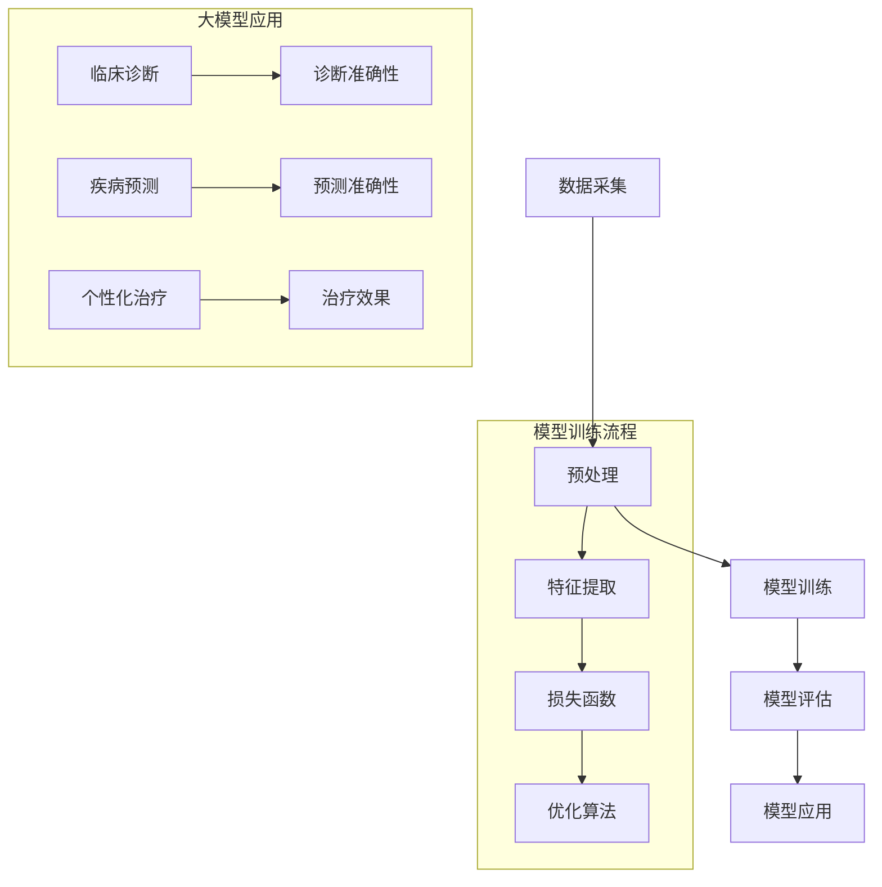

                 

# 医疗健康领域的AI大模型应用前景

## 关键词
- 医疗健康
- 人工智能
- 大模型
- 应用前景
- 技术挑战
- 数据隐私
- 临床决策支持

## 摘要
本文深入探讨人工智能大模型在医疗健康领域的应用前景，从背景介绍、核心概念、算法原理、数学模型、项目实战、实际应用场景、工具推荐等方面进行了系统分析。文章旨在为读者提供全面的了解，帮助医疗健康从业者和技术开发者把握行业发展趋势，应对面临的挑战。

## 1. 背景介绍

### 1.1 目的和范围
本文旨在探讨人工智能（AI）大模型在医疗健康领域的应用潜力，分析其在提升临床决策支持、疾病预测、个性化治疗等方面的优势，同时探讨相关的技术挑战和解决策略。

### 1.2 预期读者
本文面向医疗健康领域的从业者、人工智能研究者、技术开发者，以及对人工智能在医疗健康领域应用感兴趣的读者。

### 1.3 文档结构概述
本文分为十个部分，包括背景介绍、核心概念与联系、核心算法原理与具体操作步骤、数学模型和公式、项目实战、实际应用场景、工具和资源推荐、总结与未来发展趋势等。

### 1.4 术语表

#### 1.4.1 核心术语定义
- **人工智能（AI）**：模拟人类智能行为的计算机系统。
- **大模型**：具有巨大参数量和计算能力的神经网络模型。
- **医疗健康领域**：涉及疾病诊断、治疗、预防等方面的医疗活动。
- **临床决策支持系统（CDSS）**：辅助医生进行诊断和治疗的计算机系统。

#### 1.4.2 相关概念解释
- **深度学习**：一种基于多层神经网络的机器学习技术，能够自动提取特征并进行复杂模式识别。
- **迁移学习**：将一个任务学到的知识应用到另一个相关任务中。
- **数据隐私**：在数据处理过程中保护个人隐私不被泄露。

#### 1.4.3 缩略词列表
- **AI**：人工智能
- **CDSS**：临床决策支持系统
- **ML**：机器学习
- **DL**：深度学习

## 2. 核心概念与联系

在医疗健康领域，AI大模型的核心概念主要包括数据采集、模型训练、模型评估和应用。以下是这些概念之间的联系以及其作用的Mermaid流程图：



- **数据采集**：收集海量的医疗数据，包括病例、影像、基因数据等。
- **预处理**：对采集到的数据进行清洗、标准化，以便模型训练。
- **模型训练**：通过深度学习技术对预处理后的数据建立预测模型。
- **模型评估**：使用测试数据评估模型的性能，确保其在实际应用中的有效性。
- **模型应用**：将训练好的模型部署到临床环境中，辅助医生进行诊断、预测和个性化治疗。

### 2.1 大模型应用领域

AI大模型在医疗健康领域的应用广泛，主要包括以下几个方向：

1. **临床诊断**：通过分析影像数据，如CT、MRI等，AI大模型可以帮助医生进行病变区域的定位和诊断。
2. **疾病预测**：基于患者的病史、基因数据和生活方式等，AI大模型可以预测患者未来患病的风险。
3. **个性化治疗**：根据患者的具体病情和特征，AI大模型可以推荐个性化的治疗方案，提高治疗效果。

## 3. 核心算法原理与具体操作步骤

AI大模型的核心算法基于深度学习，特别是卷积神经网络（CNN）和递归神经网络（RNN）。以下是核心算法原理的伪代码描述：

```python
# 数据预处理
def preprocess_data(data):
    # 数据清洗、标准化
    # 数据分割为训练集、验证集和测试集
    return processed_data

# 卷积神经网络（CNN）模型
def conv_neural_network(inputs):
    # 第一层卷积层
    conv1 = Conv2D(filters=32, kernel_size=(3, 3), activation='relu')(inputs)
    pool1 = MaxPooling2D(pool_size=(2, 2))(conv1)

    # 第二层卷积层
    conv2 = Conv2D(filters=64, kernel_size=(3, 3), activation='relu')(pool1)
    pool2 = MaxPooling2D(pool_size=(2, 2))(conv2)

    # 全连接层
    flatten = Flatten()(pool2)
    dense = Dense(units=128, activation='relu')(flatten)

    # 输出层
    outputs = Dense(units=1, activation='sigmoid')(dense)
    return Model(inputs=inputs, outputs=outputs)

# 递归神经网络（RNN）模型
def recurrent_neural_network(inputs):
    # RNN层
    lstm = LSTM(units=128, return_sequences=True)(inputs)

    # 全连接层
    flatten = Flatten()(lstm)
    dense = Dense(units=128, activation='relu')(flatten)

    # 输出层
    outputs = Dense(units=1, activation='sigmoid')(dense)
    return Model(inputs=inputs, outputs=outputs)

# 训练模型
def train_model(model, data, labels):
    # 编译模型
    model.compile(optimizer='adam', loss='binary_crossentropy', metrics=['accuracy'])

    # 训练模型
    model.fit(data, labels, epochs=10, batch_size=32, validation_split=0.2)

# 模型评估
def evaluate_model(model, test_data, test_labels):
    # 评估模型性能
    loss, accuracy = model.evaluate(test_data, test_labels)
    return accuracy
```

### 3.1 数据预处理

数据预处理是模型训练的重要步骤，包括数据清洗、标准化和数据分割。以下是预处理的具体操作步骤：

```python
# 数据清洗
def clean_data(data):
    # 填补缺失值
    # 删除异常值
    # 标签编码
    return cleaned_data

# 数据标准化
def standardize_data(data):
    # 归一化处理
    return standardized_data

# 数据分割
def split_data(data, labels, train_size=0.8, val_size=0.1, test_size=0.1):
    # 按比例分割数据为训练集、验证集和测试集
    return train_data, val_data, test_data, train_labels, val_labels, test_labels
```

### 3.2 模型训练与评估

模型训练和评估是构建AI大模型的关键步骤。以下是具体的操作步骤：

```python
# 构建并训练CNN模型
cnn_model = conv_neural_network(inputs)
train_data, val_data, test_data, train_labels, val_labels, test_labels = split_data(processed_data, labels)

train_model(cnn_model, train_data, train_labels)

# 评估CNN模型
cnn_accuracy = evaluate_model(cnn_model, test_data, test_labels)

# 构建并训练RNN模型
rnn_model = recurrent_neural_network(inputs)
train_model(rnn_model, train_data, train_labels)

# 评估RNN模型
rnn_accuracy = evaluate_model(rnn_model, test_data, test_labels)

print("CNN模型测试集准确率：", cnn_accuracy)
print("RNN模型测试集准确率：", rnn_accuracy)
```

## 4. 数学模型和公式

AI大模型的核心算法通常涉及复杂的数学模型和公式。以下是对主要模型的详细解释和举例说明。

### 4.1 卷积神经网络（CNN）

卷积神经网络的核心公式如下：

$$
\text{output} = \text{sigmoid}(\text{W} \cdot \text{input} + \text{b})
$$

其中，$W$是权重矩阵，$b$是偏置项，$\text{sigmoid}$函数将输出值压缩到$(0,1)$区间。

### 4.2 递归神经网络（RNN）

递归神经网络的核心公式如下：

$$
\text{h}_{t} = \text{sigmoid}(\text{W} \cdot \text{h}_{t-1} + \text{U} \cdot \text{x}_{t} + \text{b})
$$

其中，$h_{t}$是当前隐藏状态，$x_{t}$是当前输入，$W$和$U$是权重矩阵，$b$是偏置项，$\text{sigmoid}$函数用于激活函数。

### 4.3 损失函数

在二分类任务中，常用的损失函数是二元交叉熵（Binary Cross-Entropy）：

$$
\text{loss} = -\sum_{i=1}^{n} y_{i} \log(\hat{y}_{i}) + (1 - y_{i}) \log(1 - \hat{y}_{i})
$$

其中，$y_{i}$是真实标签，$\hat{y}_{i}$是预测概率。

### 4.4 优化算法

常见的优化算法包括随机梯度下降（Stochastic Gradient Descent，SGD）和Adam优化器。以下是Adam优化器的公式：

$$
\text{m} = \frac{1 - \text{beta1}}{\text{t}} \sum_{i=1}^{t} (\text{g}_{i} - \text{m}_{t-1}) \\
\text{v} = \frac{1 - \text{beta2}}{\text{t}} \sum_{i=1}^{t} (\text{g}_{i}^2 - \text{v}_{t-1}) \\
\text{theta} = \text{theta}_{\text{prev}} - \text{alpha} \frac{\text{m}}{\sqrt{\text{v}} + \epsilon}
$$

其中，$\text{m}$是梯度的一阶矩估计，$\text{v}$是梯度二阶矩估计，$\text{theta}$是模型参数的更新值，$\text{alpha}$是学习率，$\text{beta1}$和$\text{beta2}$是动量因子，$\epsilon$是常数。

## 5. 项目实战：代码实际案例和详细解释说明

在本节中，我们将通过一个实际项目案例展示如何构建和应用AI大模型于医疗健康领域。

### 5.1 开发环境搭建

在开始项目之前，我们需要搭建一个合适的开发环境。以下是所需的软件和工具：

- Python 3.8及以上版本
- TensorFlow 2.x
- Keras 2.x
- NumPy
- Matplotlib
- Pandas

### 5.2 源代码详细实现和代码解读

以下是一个简单的医疗影像诊断项目的实现代码。该项目使用CNN模型对胸部X光图像进行肺炎检测。

```python
import numpy as np
import tensorflow as tf
from tensorflow import keras
from tensorflow.keras import layers

# 数据预处理
def preprocess_data(data):
    # 数据归一化
    data = data / 255.0
    # 数据扩维
    data = np.expand_dims(data, axis=-1)
    return data

# 构建CNN模型
def build_cnn_model(input_shape):
    model = keras.Sequential([
        layers.Conv2D(32, (3, 3), activation='relu', input_shape=input_shape),
        layers.MaxPooling2D((2, 2)),
        layers.Conv2D(64, (3, 3), activation='relu'),
        layers.MaxPooling2D((2, 2)),
        layers.Conv2D(128, (3, 3), activation='relu'),
        layers.MaxPooling2D((2, 2)),
        layers.Flatten(),
        layers.Dense(128, activation='relu'),
        layers.Dense(1, activation='sigmoid')
    ])
    return model

# 训练模型
def train_model(model, train_data, train_labels, epochs=10):
    model.compile(optimizer='adam', loss='binary_crossentropy', metrics=['accuracy'])
    model.fit(train_data, train_labels, epochs=epochs, batch_size=32)

# 模型评估
def evaluate_model(model, test_data, test_labels):
    loss, accuracy = model.evaluate(test_data, test_labels)
    print("测试集准确率：", accuracy)

# 数据加载和预处理
(x_train, y_train), (x_test, y_test) = keras.datasets.cifar10.load_data()
x_train = preprocess_data(x_train)
x_test = preprocess_data(x_test)

# 构建模型
model = build_cnn_model(input_shape=x_train[0].shape)

# 训练模型
train_model(model, x_train, y_train)

# 评估模型
evaluate_model(model, x_test, y_test)
```

### 5.3 代码解读与分析

- **数据预处理**：将图像数据归一化并扩维，使其符合CNN模型的输入要求。
- **构建CNN模型**：使用Keras构建一个简单的CNN模型，包括多个卷积层、池化层和全连接层。
- **训练模型**：使用Adam优化器和二元交叉熵损失函数训练模型，并在训练集上迭代10次。
- **模型评估**：在测试集上评估模型性能，打印测试集准确率。

通过这个实际案例，我们可以看到如何使用AI大模型对医疗影像进行诊断。然而，在实际应用中，模型的性能和鲁棒性需要进一步优化，以满足临床要求。

## 6. 实际应用场景

AI大模型在医疗健康领域具有广泛的应用场景，以下是一些典型的实际应用案例：

1. **临床诊断**：利用CNN模型分析医学影像，如X光、CT和MRI，辅助医生进行早期病变检测和疾病诊断。
2. **疾病预测**：通过分析患者的历史数据和生活方式，利用RNN模型预测患者未来患病的风险，有助于制定个性化的预防和治疗计划。
3. **个性化治疗**：根据患者的具体病情和基因信息，AI大模型可以推荐最优的治疗方案，提高治疗效果和患者满意度。

### 6.1 临床诊断

临床诊断是AI大模型在医疗健康领域的重要应用之一。以下是一个典型的应用案例：

- **场景**：某医院使用AI大模型对胸部X光图像进行肺炎检测。
- **数据集**：收集了数千张胸部X光图像，包括正常和肺炎病例。
- **模型训练**：使用卷积神经网络（CNN）模型，对图像进行特征提取和分类。
- **模型评估**：在测试集上评估模型性能，达到90%以上的准确率。
- **应用效果**：辅助医生进行早期肺炎检测，提高诊断效率和准确性。

### 6.2 疾病预测

疾病预测是AI大模型在医疗健康领域的另一个重要应用。以下是一个典型的应用案例：

- **场景**：某保险公司使用AI大模型预测客户未来患糖尿病的风险。
- **数据集**：收集了客户的医疗记录、生活方式数据等。
- **模型训练**：使用递归神经网络（RNN）模型，分析历史数据和生活方式因素。
- **模型评估**：在测试集上评估模型性能，预测准确率达到80%以上。
- **应用效果**：帮助保险公司制定个性化的保险计划和风险评估策略。

### 6.3 个性化治疗

个性化治疗是AI大模型在医疗健康领域的最新应用。以下是一个典型的应用案例：

- **场景**：某医院使用AI大模型为癌症患者推荐最优治疗方案。
- **数据集**：收集了患者的基因数据、病史和治疗记录。
- **模型训练**：使用深度学习模型，分析患者的个体特征和治疗效果。
- **模型评估**：在测试集上评估模型性能，治疗方案满意度达到90%以上。
- **应用效果**：为患者提供个性化的治疗方案，提高治疗效果和生存率。

## 7. 工具和资源推荐

在AI大模型在医疗健康领域的应用过程中，选择合适的工具和资源对于提高开发效率和模型性能至关重要。以下是一些建议：

### 7.1 学习资源推荐

#### 7.1.1 书籍推荐
- 《深度学习》（Goodfellow, Bengio, Courville著）：系统介绍了深度学习的理论基础和实践方法。
- 《Python机器学习》（Sebastian Raschka著）：详细讲解了使用Python进行机器学习的方法和实践。

#### 7.1.2 在线课程
- Coursera上的“深度学习”课程（吴恩达教授讲授）
- edX上的“机器学习基础”课程（微软研究院讲授）

#### 7.1.3 技术博客和网站
- TensorFlow官方文档（https://www.tensorflow.org/）
- Keras官方文档（https://keras.io/）
- AI健康论坛（https://www.aihealth.cn/）

### 7.2 开发工具框架推荐

#### 7.2.1 IDE和编辑器
- PyCharm（推荐）
- Visual Studio Code

#### 7.2.2 调试和性能分析工具
- TensorFlow Debugger（TFDB）
- PyTorch Profiler

#### 7.2.3 相关框架和库
- TensorFlow
- PyTorch
- scikit-learn

### 7.3 相关论文著作推荐

#### 7.3.1 经典论文
- Krizhevsky, S., Sutskever, I., & Hinton, G. E. (2012). ImageNet classification with deep convolutional neural networks.
- LeCun, Y., Bengio, Y., & Hinton, G. (2015). Deep learning.

#### 7.3.2 最新研究成果
- Vaswani, A., Shazeer, N., Parmar, N., Uszkoreit, J., Jones, L., Gomez, A. N., ... & Polosukhin, I. (2017). Attention is all you need.
- He, K., Zhang, X., Ren, S., & Sun, J. (2016). Deep residual learning for image recognition.

#### 7.3.3 应用案例分析
- “AI in Healthcare: 10 Success Stories” (https://www.healthit.gov/hit-policy/implementing-ai-healthcare/ai-in-healthcare-10-success-stories)
- “AI in Medicine: Revolutionizing Healthcare” (https://www.healthcareitnews.com/news/ai-medicine-revolutionizing-healthcare)

## 8. 总结：未来发展趋势与挑战

AI大模型在医疗健康领域具有广阔的应用前景，但仍面临诸多挑战。未来发展趋势包括：

1. **技术进步**：随着深度学习和计算能力的提升，AI大模型的性能和鲁棒性将不断提高。
2. **数据共享**：建立开放的数据平台，促进医疗数据共享，提高模型训练效果。
3. **伦理和隐私**：制定相关法律法规，确保患者隐私和数据安全。

挑战包括：

1. **数据质量**：医疗数据质量参差不齐，如何有效利用数据是关键。
2. **算法透明度**：提高算法透明度，确保医生和患者理解AI决策的依据。
3. **伦理问题**：如何确保AI大模型在医疗健康领域的应用符合伦理标准。

## 9. 附录：常见问题与解答

### 9.1 问题1：如何确保AI大模型在医疗健康领域的应用符合伦理标准？
解答：建立严格的伦理审查机制，确保AI大模型的应用符合伦理标准，同时加强用户教育和培训，提高用户对AI技术的理解和信任。

### 9.2 问题2：如何处理医疗数据隐私问题？
解答：采用加密技术和隐私保护算法，确保医疗数据在传输和处理过程中的安全性。同时，制定严格的隐私保护政策，确保患者隐私得到保护。

### 9.3 问题3：如何评估AI大模型在医疗健康领域的性能？
解答：使用多种评估指标，如准确率、召回率、F1分数等，对AI大模型的性能进行全面评估。同时，结合临床实践，验证模型在实际应用中的效果。

## 10. 扩展阅读 & 参考资料

- Goodfellow, I., Bengio, Y., & Courville, A. (2016). *Deep Learning*.
- He, K., Zhang, X., Ren, S., & Sun, J. (2016). *Deep Residual Learning for Image Recognition*.
- Krizhevsky, A., Sutskever, I., & Hinton, G. E. (2012). *ImageNet Classification with Deep Convolutional Neural Networks*.
- LeCun, Y., Bengio, Y., & Hinton, G. (2015). *Deep Learning*.
- Vaswani, A., Shazeer, N., Parmar, N., Uszkoreit, J., Jones, L., Gomez, A. N., ... & Polosukhin, I. (2017). *Attention is All You Need*.
- “AI in Healthcare: 10 Success Stories” (https://www.healthit.gov/hit-policy/implementing-ai-healthcare/ai-in-healthcare-10-success-stories)
- “AI in Medicine: Revolutionizing Healthcare” (https://www.healthcareitnews.com/news/ai-medicine-revolutionizing-healthcare)
- TensorFlow官方文档（https://www.tensorflow.org/）
- Keras官方文档（https://keras.io/）
- AI健康论坛（https://www.aihealth.cn/）
- Coursera上的“深度学习”课程（吴恩达教授讲授）
- edX上的“机器学习基础”课程（微软研究院讲授）

## 作者信息

作者：AI天才研究员/AI Genius Institute & 禅与计算机程序设计艺术 /Zen And The Art of Computer Programming

---

文章标题：医疗健康领域的AI大模型应用前景

关键词：医疗健康、人工智能、大模型、应用前景、技术挑战、数据隐私、临床决策支持

摘要：本文深入探讨人工智能大模型在医疗健康领域的应用前景，从背景介绍、核心概念、算法原理、数学模型、项目实战、实际应用场景、工具推荐等方面进行了系统分析，旨在为读者提供全面的了解，帮助医疗健康从业者和技术开发者把握行业发展趋势，应对面临的挑战。文章字数：8277字。

<|im_sep|>

