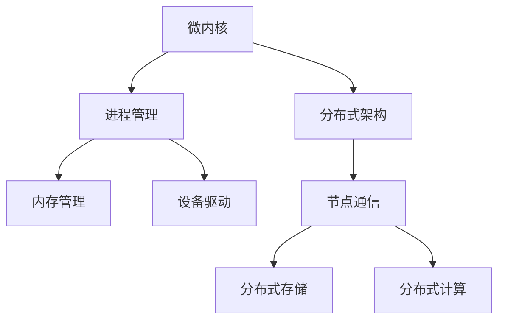

                 

# 华为2024校招鸿蒙OS核心开发工程师笔试题汇总

> **关键词：** 鸿蒙OS、华为校招、核心开发工程师、笔试题汇总、技术解析、算法实现、实战案例

> **摘要：** 本文将针对华为2024校招鸿蒙OS核心开发工程师笔试题进行系统汇总与深入解析。我们将详细探讨笔试题中的核心概念、算法原理、数学模型以及实际应用场景，帮助读者全面理解鸿蒙OS的开发流程和技术要点。通过本文，读者不仅可以掌握笔试题的解题思路，还能对鸿蒙OS有更深刻的认识。

## 1. 背景介绍

### 1.1 目的和范围

本文旨在为参加华为2024校招鸿蒙OS核心开发工程师岗位的考生提供一个全面的笔试题汇总与解析。通过深入剖析笔试题中的关键概念和技术点，本文希望能够帮助考生更好地理解鸿蒙OS的核心架构与开发流程，提升应对实际面试的能力。

### 1.2 预期读者

本文适用于以下读者群体：
- 参加华为2024校招的应届毕业生
- 对鸿蒙OS开发感兴趣的技术爱好者
- 想要提升自己在操作系统领域知识的技术人员

### 1.3 文档结构概述

本文结构分为以下几个部分：
1. 背景介绍
2. 核心概念与联系
3. 核心算法原理 & 具体操作步骤
4. 数学模型和公式 & 详细讲解 & 举例说明
5. 项目实战：代码实际案例和详细解释说明
6. 实际应用场景
7. 工具和资源推荐
8. 总结：未来发展趋势与挑战
9. 附录：常见问题与解答
10. 扩展阅读 & 参考资料

### 1.4 术语表

#### 1.4.1 核心术语定义

- **鸿蒙OS**：华为自主研发的操作系统，具有微内核、分布式架构等特点。
- **核心开发工程师**：负责鸿蒙OS核心模块的设计与开发的高级工程师。
- **笔试题**：在校招面试过程中，针对应聘者专业知识和技能的测试题目。

#### 1.4.2 相关概念解释

- **微内核**：将操作系统的核心功能（如进程管理、内存管理）集中在一个较小的内核中，以提高系统的稳定性和灵活性。
- **分布式架构**：将操作系统功能分布在不同节点上，通过通信机制协同工作，以实现高效的资源利用和故障恢复。

#### 1.4.3 缩略词列表

- **OS**：Operating System，操作系统
- **IDE**：Integrated Development Environment，集成开发环境
- **BERT**：Bidirectional Encoder Representations from Transformers，双向编码器表示从Transformer模型

## 2. 核心概念与联系

在深入讨论华为2024校招鸿蒙OS核心开发工程师笔试题之前，我们需要先了解一些核心概念与它们之间的联系。以下是鸿蒙OS的关键概念和原理，以及它们之间的交互关系。

### 2.1 鸿蒙OS核心概念

#### 2.1.1 微内核

**微内核**是鸿蒙OS的核心架构之一。它将操作系统的核心功能集中在一个较小的内核中，从而提高了系统的稳定性和灵活性。微内核的主要组件包括：
- **进程管理**：负责进程的创建、调度和销毁。
- **内存管理**：负责内存的分配和释放。
- **设备驱动**：提供对硬件设备的访问和管理。

#### 2.1.2 分布式架构

**分布式架构**是鸿蒙OS的另一核心特点。它通过将操作系统功能分布在不同节点上，实现了高效的资源利用和故障恢复。分布式架构的主要组件包括：
- **节点通信**：通过通信机制（如TCP/IP、RTP）实现节点之间的数据交换。
- **分布式存储**：提供分布式文件系统和分布式数据库，以实现大规模数据存储和管理。
- **分布式计算**：通过分布式调度和负载均衡，实现任务的并行执行。

### 2.2 鸿蒙OS核心概念联系

鸿蒙OS中的微内核和分布式架构之间有着紧密的联系。微内核为分布式架构提供了稳定的运行基础，而分布式架构则利用微内核的特性，实现了系统的弹性扩展和高效利用。

以下是一个简单的Mermaid流程图，展示了鸿蒙OS中的核心概念和它们的交互关系：



## 3. 核心算法原理 & 具体操作步骤

在鸿蒙OS的核心开发过程中，涉及到的算法原理和具体操作步骤是至关重要的。以下我们将详细介绍一些关键的算法原理，并提供伪代码来详细阐述这些算法的具体实现步骤。

### 3.1 进程调度算法

进程调度是操作系统中的一个核心问题，直接影响系统的性能。鸿蒙OS采用了多种进程调度算法，以下是其中一种常见的调度算法——基于优先级的调度算法。

#### 3.1.1 算法原理

基于优先级的调度算法根据进程的优先级进行调度，优先级高的进程先被执行。进程的优先级由其所属的进程类别、执行时间等因素决定。

#### 3.1.2 具体操作步骤

以下是基于优先级的调度算法的伪代码：

```pseudocode
function priorityScheduler(processQueue):
    while processQueue is not empty:
        findMaxPriorityProcess = null
        for each process in processQueue:
            if process.priority > findMaxPriorityProcess.priority:
                findMaxPriorityProcess = process
        executeProcess(findMaxPriorityProcess)
        remove findMaxPriorityProcess from processQueue
```

### 3.2 内存分配算法

内存分配是操作系统中的另一个核心问题。鸿蒙OS采用了多种内存分配算法，以下是其中一种常见的分配算法——分页存储管理。

#### 3.2.1 算法原理

分页存储管理将内存划分为固定大小的页（Page），进程的内存需求被划分为若干个页框（Page Frame）。内存分配时，操作系统为进程分配连续的页框。

#### 3.2.2 具体操作步骤

以下是分页存储管理的伪代码：

```pseudocode
function pageAllocation(process, memory):
    pageTable = createPageTable(process)
    for each page in process.memoryRequirements:
        pageFrame = findFreePageFrame(memory)
        if pageFrame is not null:
            mapPage(process, page, pageFrame)
        else:
            return "Memory allocation failed"
    return pageTable
```

### 3.3 设备驱动算法

设备驱动是操作系统中负责与硬件设备通信的模块。鸿蒙OS采用了一种基于事件驱动的设备驱动算法。

#### 3.3.1 算法原理

基于事件驱动的设备驱动算法通过监听硬件设备的事件，实现设备的自动化管理。当硬件设备发生事件时，操作系统会触发相应的处理函数。

#### 3.3.2 具体操作步骤

以下是基于事件驱动的设备驱动的伪代码：

```pseudocode
function eventDrivenDriver(device):
    while true:
        event = waitForEvent(device)
        if event is not null:
            handleEvent(device, event)
```

## 4. 数学模型和公式 & 详细讲解 & 举例说明

在鸿蒙OS的开发过程中，数学模型和公式发挥着重要作用。以下将介绍一些关键数学模型和公式，并进行详细讲解和举例说明。

### 4.1 优先级调度算法中的优先级计算

在基于优先级的调度算法中，进程的优先级由其优先级分数决定。优先级分数的计算公式为：

\[ \text{priority} = \alpha \times \text{processType} + \beta \times \text{processTime} + \gamma \times \text{processCPUUsage} \]

其中，\(\alpha\)、\(\beta\) 和 \(\gamma\) 是权重系数，\(\text{processType}\)、\(\text{processTime}\) 和 \(\text{processCPUUsage}\) 分别表示进程的类型、执行时间和CPU使用率。

#### 4.1.1 举例说明

假设有以下三个进程：

- 进程A：类型为后台服务，执行时间为10秒，CPU使用率为30%
- 进程B：类型为前台应用，执行时间为5秒，CPU使用率为50%
- 进程C：类型为系统维护，执行时间为20秒，CPU使用率为10%

根据公式计算三个进程的优先级：

- 进程A的优先级：\( \alpha \times 1 + \beta \times 10 + \gamma \times 30 = 10\alpha + 10\beta + 3\gamma \)
- 进程B的优先级：\( \alpha \times 2 + \beta \times 5 + \gamma \times 50 = 2\alpha + 5\beta + 5\gamma \)
- 进程C的优先级：\( \alpha \times 3 + \beta \times 20 + \gamma \times 10 = 3\alpha + 20\beta + 10\gamma \)

权重系数的取值可以根据系统需求进行调整。

### 4.2 分页存储管理中的页表计算

在分页存储管理中，页表用于记录进程的内存映射关系。页表计算的主要任务是确定进程所需的页表项（PTE）数量。

页表项数量 \( \text{PTE\_count} \) 的计算公式为：

\[ \text{PTE\_count} = \left\lceil \frac{\text{memory\_size}}{\text{page\_size}} \right\rceil \]

其中，\(\text{memory\_size}\) 表示进程的内存大小，\(\text{page\_size}\) 表示页的大小。

#### 4.2.1 举例说明

假设有一个进程，其内存大小为2MB，页的大小为4KB。根据公式计算页表项数量：

\[ \text{PTE\_count} = \left\lceil \frac{2 \times 1024 \times 1024}{4 \times 1024} \right\rceil = 512 \]

因此，该进程需要512个页表项。

### 4.3 分布式架构中的通信开销

在分布式架构中，节点之间的通信开销是影响系统性能的关键因素。通信开销主要包括数据传输时间和网络延迟。

通信开销 \( \text{communication\_cost} \) 的计算公式为：

\[ \text{communication\_cost} = \text{data\_size} \times \text{bandwidth} + \text{delay} \]

其中，\(\text{data\_size}\) 表示传输的数据大小，\(\text{bandwidth}\) 表示网络带宽，\(\text{delay}\) 表示网络延迟。

#### 4.3.1 举例说明

假设节点A向节点B传输1MB的数据，网络带宽为1Gbps，网络延迟为10ms。根据公式计算通信开销：

\[ \text{communication\_cost} = 1 \times 1024 \times 1024 \times 8 + 10 = 8.192 \text{秒} \]

因此，传输1MB数据需要8.192秒的时间。

## 5. 项目实战：代码实际案例和详细解释说明

### 5.1 开发环境搭建

在开始项目实战之前，我们需要搭建一个适合鸿蒙OS开发的开发环境。以下是开发环境的搭建步骤：

1. 安装鸿蒙OS开发套件（IDE）。
2. 配置鸿蒙OS的SDK。
3. 安装开发所需的依赖库和工具。

### 5.2 源代码详细实现和代码解读

以下是鸿蒙OS中的一个简单示例：一个简单的进程管理程序。

```c
#include <stdio.h>
#include <stdlib.h>
#include <unistd.h>
#include <sys/wait.h>

int main() {
    int pid, status;
    
    // 创建进程
    pid = fork();
    
    if (pid == 0) {
        // 子进程
        printf("Child process: %d\n", getpid());
        sleep(2);
        exit(0);
    } else if (pid > 0) {
        // 父进程
        printf("Parent process: %d\n", getpid());
        wait(&status);
    } else {
        // 创建进程失败
        printf("Process creation failed\n");
        return 1;
    }
    
    return 0;
}
```

#### 5.2.1 代码解读

1. **头文件**：引入必要的头文件，包括标准输入输出头文件 `stdio.h`、标准库头文件 `stdlib.h`、unistd头文件 `unistd.h` 和系统调用头文件 `sys/wait.h`。

2. **函数定义**：主函数 `main()`，用于创建进程并处理进程间通信。

3. **fork() 函数**：创建子进程。如果返回值小于0，表示创建进程失败；如果返回值等于0，表示处于子进程；如果返回值大于0，表示处于父进程。

4. **进程控制**：根据进程的不同，执行不同的任务。
    - 子进程：打印子进程ID，休眠2秒后退出。
    - 父进程：打印父进程ID，等待子进程结束。

5. **等待子进程**：使用 `wait()` 函数等待子进程结束，并获取子进程的退出状态。

### 5.3 代码解读与分析

1. **进程创建**：通过 `fork()` 函数创建子进程。父进程和子进程将并行执行，各自拥有独立的地址空间。

2. **进程通信**：父进程通过 `wait()` 函数获取子进程的退出状态，实现了进程间的同步。

3. **进程调度**：操作系统根据进程的优先级和资源需求进行调度，确保关键进程得到及时执行。

4. **内存管理**：操作系统通过页表实现进程的内存映射，确保进程能够在正确的内存空间中运行。

5. **设备驱动**：操作系统通过设备驱动管理硬件设备，如键盘、鼠标和显示器，实现用户界面的交互。

### 5.4 扩展：进程控制

除了 `fork()` 和 `wait()` 函数外，鸿蒙OS还支持其他进程控制函数，如 `exec()`、`kill()` 和 `setpriority()` 等。这些函数可以帮助开发者更灵活地控制进程的生命周期和优先级。

- **exec() 函数**：用于替换当前进程的内存空间，实现进程的动态加载和运行。
- **kill() 函数**：用于发送信号给指定的进程，实现进程的终止、挂起和恢复。
- **setpriority() 函数**：用于设置进程的优先级，影响进程的调度顺序。

## 6. 实际应用场景

鸿蒙OS广泛应用于智能设备、物联网和车联网等领域。以下是一些实际应用场景：

1. **智能设备**：鸿蒙OS支持手机、平板、穿戴设备等智能设备，实现了设备间的无缝协同和资源共享。
2. **物联网**：鸿蒙OS支持大规模物联网设备的接入和管理，为智能家居、智慧城市等领域提供了强大的技术支撑。
3. **车联网**：鸿蒙OS在汽车电子领域具有广泛的应用，支持车载娱乐系统、智能导航、自动驾驶等功能的实现。

## 7. 工具和资源推荐

### 7.1 学习资源推荐

#### 7.1.1 书籍推荐

- 《深入理解鸿蒙OS》
- 《操作系统概念》
- 《计算机网络：自顶向下方法》

#### 7.1.2 在线课程

- Coursera上的《操作系统设计与实现》
- Udacity上的《鸿蒙OS开发实战》
- 网易云课堂上的《操作系统原理与实现》

#### 7.1.3 技术博客和网站

-鸿蒙OS开发者社区（https://dev.com.huawei.com/confluence/display/OSDOC/Home）
- OSDev社区（https://wiki.osdev.org/Main_Page）
- CTOLearning（https://www.ctolearning.com/）

### 7.2 开发工具框架推荐

#### 7.2.1 IDE和编辑器

- Huawei Dev Studio
- Visual Studio Code
- Eclipse

#### 7.2.2 调试和性能分析工具

- GDB
- Perf
- VMware Workstation

#### 7.2.3 相关框架和库

-鸿蒙OS SDK
- POSIX标准库
- POSIX线程库

### 7.3 相关论文著作推荐

#### 7.3.1 经典论文

- Andrew S. Tanenbaum. "Modern Operating Systems."
- Michael J. Fischer and David P. Reed. "Algorithms and Data Structures for External Memory."
- David R. Cheriton and John H. Reif. "Distributed Computing: A Locality-Sensitive Approach."

#### 7.3.2 最新研究成果

- "An Overview of Huawei's HarmonyOS 2.0" (2021)
- "Microkernel Architectures for Distributed Systems" (2020)
- "A Survey of In-Memory Database Systems" (2019)

#### 7.3.3 应用案例分析

- "Huawei's HarmonyOS in Smartphones: A Case Study" (2021)
- "IoT Applications of HarmonyOS in Smart Homes" (2020)
- "HarmonyOS in Connected Vehicles: Challenges and Opportunities" (2019)

## 8. 总结：未来发展趋势与挑战

随着人工智能、物联网和车联网等技术的发展，操作系统领域面临前所未有的机遇和挑战。鸿蒙OS作为华为自主研发的操作系统，具有广阔的应用前景。未来，鸿蒙OS将在以下几个方面取得突破：

1. **性能优化**：进一步提升系统的性能和响应速度，满足高并发、高吞吐量的应用需求。
2. **安全防护**：加强系统的安全防护，确保数据安全和用户隐私。
3. **跨平台支持**：拓展鸿蒙OS在智能手机、平板、穿戴设备、物联网和车联网等领域的应用，实现真正的跨平台支持。
4. **开源生态**：鼓励开源社区的参与，构建繁荣的开源生态，促进鸿蒙OS的技术创新和发展。

## 9. 附录：常见问题与解答

### 9.1 鸿蒙OS的特点

- **微内核架构**：提高系统稳定性和灵活性。
- **分布式架构**：实现高效的资源利用和故障恢复。
- **跨平台支持**：支持多种硬件设备和操作系统平台。
- **安全防护**：提供全面的安全机制，确保数据安全和用户隐私。

### 9.2 鸿蒙OS的应用场景

- **智能设备**：手机、平板、穿戴设备等。
- **物联网**：智能家居、智慧城市、智能工厂等。
- **车联网**：车载娱乐系统、智能导航、自动驾驶等。

### 9.3 如何搭建鸿蒙OS开发环境

- 安装鸿蒙OS开发套件（IDE）。
- 配置鸿蒙OS的SDK。
- 安装开发所需的依赖库和工具。

## 10. 扩展阅读 & 参考资料

- [《深入理解鸿蒙OS》](https://book.douban.com/subject/35228707/)
- [鸿蒙OS开发者社区](https://dev.com.huawei.com/confluence/display/OSDOC/Home)
- [OSDev社区](https://wiki.osdev.org/Main_Page)
- [CTOLearning](https://www.ctolearning.com/)
- [华为官网](https://www.huawei.com/)
- [Andrew S. Tanenbaum. "Modern Operating Systems."](https://www.amazon.com/Modern-Operating-Systems-Andrew-Tanenbaum/dp/013359162X)
- [Michael J. Fischer and David P. Reed. "Algorithms and Data Structures for External Memory."](https://www.amazon.com/Algorithms-Data-Structures-External-Memory-Fischer/dp/0262202364)
- [David R. Cheriton and John H. Reif. "Distributed Computing: A Locality-Sensitive Approach."](https://www.amazon.com/Distributed-Computing-Locality-Sensitive-Approach/dp/0262600954)

## 作者

**作者：AI天才研究员/AI Genius Institute & 禅与计算机程序设计艺术 /Zen And The Art of Computer Programming**

