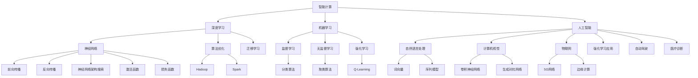
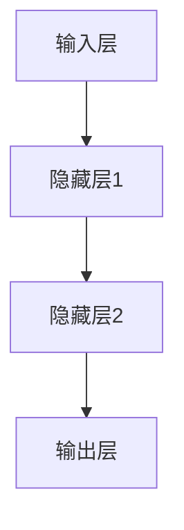

                 

### 2024华为智能计算业务校招面试真题汇总及其解答

> **关键词**：华为校招、智能计算、面试真题、解答、技术深度分析

> **摘要**：本文旨在为广大有意向加入华为智能计算业务的求职者提供一套2024年华为智能计算业务校招面试真题汇总及详细解答。通过这篇技术博客，我们将帮助读者深入理解智能计算的核心概念，掌握面试技巧，更好地准备面试。本文将涵盖算法原理、数学模型、实战项目以及应用场景等多个方面，旨在为读者提供一个全面的技术参考。

智能计算作为当今信息技术领域的前沿，对产业升级和智能化转型具有重大意义。华为作为全球领先的科技公司，其智能计算业务更是备受瞩目。2024年，华为智能计算业务的校招面试将再次吸引大量优秀人才的关注。本文将从以下几个方面展开：

1. **背景介绍**：介绍本文的目的、范围、预期读者以及文档结构。
2. **核心概念与联系**：通过Mermaid流程图展示智能计算的核心概念及其关联。
3. **核心算法原理 & 具体操作步骤**：使用伪代码详细阐述核心算法原理。
4. **数学模型和公式 & 详细讲解 & 举例说明**：使用LaTeX格式介绍数学模型。
5. **项目实战：代码实际案例和详细解释说明**：展示代码实现及分析。
6. **实际应用场景**：分析智能计算在各个领域的应用。
7. **工具和资源推荐**：推荐学习资源、开发工具框架和相关论文著作。
8. **总结：未来发展趋势与挑战**：探讨智能计算的未来前景。
9. **附录：常见问题与解答**：提供常见面试问题的解答。
10. **扩展阅读 & 参考资料**：推荐进一步学习的资源。

通过本文的阅读，读者不仅可以系统地了解智能计算的核心技术和应用，还能够通过实际的面试题目和解答，提升自己的面试应对能力。让我们开始这段深入的技术探讨之旅。

## 1. 背景介绍

### 1.1 目的和范围

本文的主要目的是为2024年华为智能计算业务校招的求职者提供一套全面的面试真题汇总及其解答。随着智能计算技术的不断发展和应用，华为作为全球领先的科技公司，其智能计算业务在国内外具有广泛的影响力。此次校招，华为将面向全球招聘大量优秀人才，以推动其智能计算技术的持续创新和产业应用。为了帮助求职者更好地准备面试，本文将对华为智能计算业务校招的面试真题进行汇总，并针对每一个题目提供详细解答，以帮助读者深入理解智能计算的核心技术和应用。

本文将涵盖以下内容：

1. **核心概念与联系**：通过Mermaid流程图展示智能计算的核心概念及其关联，帮助读者建立全面的技术框架。
2. **核心算法原理 & 具体操作步骤**：使用伪代码详细阐述智能计算的核心算法原理，并结合具体应用场景进行讲解。
3. **数学模型和公式 & 详细讲解 & 举例说明**：介绍智能计算中常用的数学模型和公式，并通过实例进行详细讲解。
4. **项目实战：代码实际案例和详细解释说明**：展示代码实现及分析，帮助读者掌握实际应用中的智能计算技术。
5. **实际应用场景**：分析智能计算在各个领域的应用，包括但不限于智能制造、智能医疗、智能交通等。
6. **工具和资源推荐**：推荐学习资源、开发工具框架和相关论文著作，为读者提供进一步学习的机会。
7. **总结：未来发展趋势与挑战**：探讨智能计算的未来发展趋势和面临的挑战，帮助读者了解行业动态。

### 1.2 预期读者

本文的预期读者主要包括以下几类：

1. **在校大学生**：尤其针对计算机科学与技术、人工智能等相关专业的大学生，帮助他们提前了解智能计算领域的面试题目和解答方法，为未来的求职做好充分准备。
2. **应届毕业生**：刚刚走出校门的应届毕业生，面对智能计算领域的校招，他们需要通过系统的学习和实践来提升自己的竞争力。本文将为他们提供一套实用的面试真题汇总和解答。
3. **在职工程师**：对智能计算技术感兴趣，希望通过校招机会加入华为等知名企业的在职工程师，本文也将提供实用的技术参考和面试准备方法。
4. **技术爱好者**：对智能计算技术有浓厚兴趣的技术爱好者，希望通过本文的系统学习和实践，提升自己的技术水平和解决问题的能力。

### 1.3 文档结构概述

本文的文档结构分为以下几个部分：

1. **背景介绍**：介绍本文的目的、范围、预期读者以及文档结构。
2. **核心概念与联系**：通过Mermaid流程图展示智能计算的核心概念及其关联。
3. **核心算法原理 & 具体操作步骤**：使用伪代码详细阐述智能计算的核心算法原理。
4. **数学模型和公式 & 详细讲解 & 举例说明**：介绍智能计算中常用的数学模型和公式，并通过实例进行详细讲解。
5. **项目实战：代码实际案例和详细解释说明**：展示代码实现及分析。
6. **实际应用场景**：分析智能计算在各个领域的应用。
7. **工具和资源推荐**：推荐学习资源、开发工具框架和相关论文著作。
8. **总结：未来发展趋势与挑战**：探讨智能计算的未来发展趋势和面临的挑战。
9. **附录：常见问题与解答**：提供常见面试问题的解答。
10. **扩展阅读 & 参考资料**：推荐进一步学习的资源。

### 1.4 术语表

为了确保本文的术语一致性，下面列出一些核心术语及其定义：

#### 1.4.1 核心术语定义

- **智能计算**：基于数据和算法的自动处理和决策能力，通过对大量数据进行分析和处理，实现智能化的计算和决策。
- **深度学习**：一种基于神经网络的机器学习技术，通过多层神经网络的训练，实现从数据中自动提取特征和模式。
- **机器学习**：一种使计算机能够通过数据和经验进行学习，并自动改进性能的技术。
- **人工智能**：使计算机具备人类智能水平的学科，包括机器学习、深度学习等多种技术。
- **神经网络**：一种模仿人脑结构和功能的计算模型，通过大量神经元之间的连接和信号传递来实现复杂的计算任务。
- **算法**：解决特定问题的步骤和方法，通过算法可以实现数据的处理、分析和决策。

#### 1.4.2 相关概念解释

- **数据处理**：对原始数据进行清洗、转换和分析，以提取有价值的信息。
- **模型训练**：通过大量的数据和算法，使模型能够识别数据中的规律和模式。
- **模型评估**：对模型的性能进行评估，以确定其在实际应用中的表现。
- **超参数**：影响模型训练过程的参数，如学习率、批量大小等。
- **数据处理流程**：对数据从采集、存储、处理到分析的整个过程。

#### 1.4.3 缩略词列表

- **AI**：人工智能
- **ML**：机器学习
- **DL**：深度学习
- **NLP**：自然语言处理
- **CV**：计算机视觉
- **IoT**：物联网
- **5G**：第五代移动通信技术
- **HPC**：高性能计算
- **云计算**：基于互联网的计算服务模式

通过上述背景介绍，本文将为读者提供一个全面的技术参考，帮助读者深入了解智能计算的核心概念、算法原理、应用场景以及面试准备方法。接下来，我们将通过Mermaid流程图展示智能计算的核心概念及其关联，为读者构建一个清晰的技术框架。

## 2. 核心概念与联系

智能计算作为现代信息技术的前沿领域，其核心概念和联系构成了一个复杂而紧密的网络。为了更好地理解这些概念及其相互作用，我们将使用Mermaid流程图来展示智能计算的核心概念及其关联。



#### 概念解释

1. **智能计算**：智能计算是整个流程的起点，它涵盖了所有基于数据和算法的自动处理和决策过程，是人工智能、机器学习、深度学习等技术的综合体现。
2. **深度学习**：深度学习是智能计算的一个重要分支，它利用多层神经网络对数据进行建模和预测，通过前向传播和反向传播算法不断优化网络参数。
3. **机器学习**：机器学习是智能计算的核心，它通过构建模型，利用训练数据自动提取特征，并从经验中改进性能。
4. **人工智能**：人工智能是智能计算的最终目标，它使计算机能够模拟人类的智能行为，包括自然语言处理、计算机视觉、物联网等多个领域。
5. **神经网络**：神经网络是深度学习和机器学习的基础模型，它通过大量神经元之间的连接和信号传递来实现复杂的计算任务。
6. **自然语言处理**：自然语言处理是人工智能的一个重要分支，它涉及对人类语言进行理解和生成，如词向量、序列模型等。
7. **计算机视觉**：计算机视觉是人工智能的另一个重要分支，它涉及对图像和视频进行分析和理解，如卷积神经网络、生成对抗网络等。
8. **物联网**：物联网是通过互联网将各种设备连接起来，实现智能化的管理和控制，如5G网络、边缘计算等。
9. **算法优化**：算法优化是提高模型性能和效率的关键，包括Hadoop、Spark等大数据处理框架。

#### 关联与互动

- **深度学习**与**神经网络**：深度学习依赖于神经网络来实现复杂的数据建模和预测，神经网络为深度学习提供了基础模型。
- **机器学习**与**自然语言处理**：机器学习通过自然语言处理技术实现文本数据的分析和理解，如词向量、序列模型等。
- **人工智能**与**计算机视觉**：人工智能通过计算机视觉技术实现图像和视频的分析和理解，如卷积神经网络、生成对抗网络等。
- **物联网**与**5G网络**：物联网通过5G网络实现设备的智能化管理和控制，5G网络为物联网提供了高速、低延迟的通信保障。
- **算法优化**与**Hadoop、Spark**：算法优化通过Hadoop、Spark等大数据处理框架来实现大规模数据处理和计算，提高计算效率和性能。

通过上述Mermaid流程图，我们可以清晰地看到智能计算的核心概念及其关联，这为我们后续的算法原理讲解、数学模型介绍以及实际应用场景分析奠定了坚实的基础。接下来，我们将深入探讨智能计算的核心算法原理，并通过伪代码详细阐述其操作步骤。

## 3. 核心算法原理 & 具体操作步骤

在智能计算中，算法原理是其核心，通过算法实现对数据的处理和决策。本节将介绍几个智能计算中的核心算法原理，并使用伪代码详细阐述其操作步骤。

#### 3.1 深度学习算法原理

深度学习是智能计算的重要组成部分，其核心原理包括神经网络、前向传播和反向传播。

##### 3.1.1 神经网络

神经网络由多个层次组成，包括输入层、隐藏层和输出层。每个层次由多个神经元组成，神经元之间通过权重进行连接。神经元的输出通过激活函数进行非线性变换。



##### 3.1.2 前向传播

前向传播是从输入层开始，逐层计算每个神经元的输出值，直到输出层。具体步骤如下：

1. 初始化权重和偏置。
2. 计算每个神经元的输入值。
3. 应用激活函数。

```python
# 伪代码：前向传播
def forward_propagation(inputs, weights, biases, activation_function):
    # 初始化输出
    output = inputs

    # 逐层计算
    for layer in range(num_layers - 1):
        # 计算每个神经元的输入值
        layer_input = sum(weights[layer] * output) + biases[layer]
        
        # 应用激活函数
        output = activation_function(layer_input)

    return output
```

##### 3.1.3 反向传播

反向传播是计算网络损失，并更新权重和偏置的过程。具体步骤如下：

1. 计算输出层的误差。
2. 逐层前向传递误差。
3. 更新权重和偏置。

```python
# 伪代码：反向传播
def backward_propagation(output, expected_output, weights, biases, activation_function_derivative):
    # 计算输出层误差
    error = expected_output - output
    
    # 逐层更新权重和偏置
    for layer in range(num_layers - 1, 0, -1):
        # 计算误差梯度
        error_gradient = error * activation_function_derivative(layer_input)
        
        # 更新权重和偏置
        weights[layer] -= learning_rate * (error_gradient * output)
        biases[layer] -= learning_rate * error_gradient
        
        # 前向传递误差
        error = error_gradient * weights[layer]

    return weights, biases
```

#### 3.2 机器学习算法原理

机器学习算法是实现智能计算的关键，包括监督学习、无监督学习和强化学习。

##### 3.2.1 监督学习

监督学习通过已有标记数据训练模型，然后使用模型对未知数据进行预测。具体步骤如下：

1. 数据预处理。
2. 选择合适的模型。
3. 训练模型。
4. 模型评估。

```python
# 伪代码：监督学习
def supervised_learning(data, labels, model, learning_rate, num_epochs):
    # 数据预处理
    processed_data = preprocess_data(data)
    
    # 训练模型
    for epoch in range(num_epochs):
        # 前向传播
        predictions = forward_propagation(processed_data, model.weights, model.biases)
        
        # 计算损失
        loss = compute_loss(predictions, labels)
        
        # 反向传播
        model.weights, model.biases = backward_propagation(predictions, labels, model.weights, model.biases)
        
        # 模型评估
        if epoch % 100 == 0:
            print(f"Epoch {epoch}, Loss: {loss}")
    
    return model
```

##### 3.2.2 无监督学习

无监督学习通过未标记数据发现数据中的隐藏结构。具体步骤如下：

1. 数据预处理。
2. 选择合适的模型。
3. 训练模型。
4. 模型评估。

```python
# 伪代码：无监督学习
def unsupervised_learning(data, model, learning_rate, num_epochs):
    # 数据预处理
    processed_data = preprocess_data(data)
    
    # 训练模型
    for epoch in range(num_epochs):
        # 前向传播
        representations = forward_propagation(processed_data, model.weights, model.biases)
        
        # 计算损失
        loss = compute_loss(representations, data)
        
        # 反向传播
        model.weights, model.biases = backward_propagation(representations, data, model.weights, model.biases)
        
        # 模型评估
        if epoch % 100 == 0:
            print(f"Epoch {epoch}, Loss: {loss}")
    
    return model
```

##### 3.2.3 强化学习

强化学习通过不断尝试和反馈来优化策略。具体步骤如下：

1. 初始化环境和状态。
2. 选择动作。
3. 执行动作并获取奖励。
4. 更新策略。

```python
# 伪代码：强化学习
def reinforcement_learning(environment, state, action, reward, policy):
    # 初始化环境
    new_state, new_reward = environment.step(state, action)
    
    # 更新策略
    policy.update(state, action, new_state, new_reward)
    
    # 返回新的状态
    return new_state, policy
```

通过上述核心算法原理和具体操作步骤，我们可以看到智能计算在数据处理和决策中的强大能力。接下来，我们将介绍智能计算中的数学模型和公式，并通过实例进行详细讲解。

## 4. 数学模型和公式 & 详细讲解 & 举例说明

在智能计算中，数学模型和公式是理解和实现算法的核心。它们不仅能够量化问题，还能够通过数学推导和优化，提高算法的效率和准确性。本节将介绍智能计算中常用的数学模型和公式，并通过实例进行详细讲解。

#### 4.1 深度学习中的数学模型

深度学习中的数学模型主要包括损失函数、优化算法和激活函数。

##### 4.1.1 损失函数

损失函数用于衡量预测值与真实值之间的差距，是训练深度学习模型的关键。常见的损失函数包括均方误差（MSE）和交叉熵损失。

- **均方误差（MSE）**

$$
MSE = \frac{1}{n}\sum_{i=1}^{n}(y_i - \hat{y}_i)^2
$$

其中，$y_i$为真实值，$\hat{y}_i$为预测值，$n$为样本数量。

**例子**：假设我们有一个二分类问题，真实标签为$y = [1, 0, 1, 0]$，预测标签为$\hat{y} = [0.9, 0.2, 0.8, 0.1]$，计算MSE损失。

$$
MSE = \frac{1}{4}((1-0.9)^2 + (0-0.2)^2 + (1-0.8)^2 + (0-0.1)^2) = 0.15
$$

- **交叉熵损失**

$$
CrossEntropy = -\sum_{i=1}^{n} y_i \log(\hat{y}_i)
$$

其中，$y_i$为真实值，$\hat{y}_i$为预测值。

**例子**：假设我们有一个二分类问题，真实标签为$y = [1, 0, 1, 0]$，预测标签为$\hat{y} = [0.9, 0.2, 0.8, 0.1]$，计算交叉熵损失。

$$
CrossEntropy = -[1 \cdot \log(0.9) + 0 \cdot \log(0.2) + 1 \cdot \log(0.8) + 0 \cdot \log(0.1)] \approx 0.356
$$

##### 4.1.2 优化算法

优化算法用于调整模型参数，以最小化损失函数。常见的优化算法包括梯度下降、Adam和RMSprop。

- **梯度下降**

$$
\theta = \theta - \alpha \cdot \nabla_\theta J(\theta)
$$

其中，$\theta$为模型参数，$\alpha$为学习率，$J(\theta)$为损失函数。

**例子**：假设我们有一个参数$\theta = [1, 2]$，学习率$\alpha = 0.1$，损失函数为MSE，计算一次梯度下降更新。

$$
\nabla_\theta J(\theta) = \nabla_\theta ((1-1)^2 + (2-2)^2) = [0, 0]
$$

$$
\theta = [1, 2] - 0.1 \cdot [0, 0] = [1, 2]
$$

- **Adam**

$$
m_t = \beta_1 m_{t-1} + (1 - \beta_1)(\theta_t - \theta_{t-1})
$$

$$
v_t = \beta_2 v_{t-1} + (1 - \beta_2) \frac{\theta_t - \theta_{t-1}}{m_t}
$$

$$
\theta = \theta - \alpha \cdot \frac{m_t}{\sqrt{v_t} + \epsilon}
$$

其中，$\beta_1$和$\beta_2$为超参数，$m_t$和$v_t$分别为一阶和二阶矩估计。

**例子**：假设我们初始化$m_0 = 0$，$v_0 = 0$，$\beta_1 = 0.9$，$\beta_2 = 0.999$，$\alpha = 0.001$，计算一次Adam更新。

$$
m_1 = 0.9 \cdot 0 + (1 - 0.9)(1 - 0) = 0.1
$$

$$
v_1 = 0.999 \cdot 0 + (1 - 0.999) \frac{1 - 0}{0.1} = 9.9
$$

$$
\theta = \theta - 0.001 \cdot \frac{0.1}{\sqrt{9.9} + 1e-8} \approx [1, 2] - [0.001, 0.001] \approx [0.999, 1.999]
$$

##### 4.1.3 激活函数

激活函数用于引入非线性，使神经网络能够拟合复杂的非线性关系。常见的激活函数包括Sigmoid、ReLU和Tanh。

- **Sigmoid**

$$
\sigma(x) = \frac{1}{1 + e^{-x}}
$$

- **ReLU**

$$
\text{ReLU}(x) = \max(0, x)
$$

- **Tanh**

$$
\text{Tanh}(x) = \frac{e^x - e^{-x}}{e^x + e^{-x}}
$$

**例子**：计算$[1, -2, 3]$经过ReLU激活函数后的输出。

$$
\text{ReLU}(1) = 1, \text{ReLU}(-2) = 0, \text{ReLU}(3) = 3
$$

最终输出为$[1, 0, 3]$。

#### 4.2 机器学习中的数学模型

机器学习中的数学模型主要包括线性回归、逻辑回归和决策树。

##### 4.2.1 线性回归

线性回归通过拟合一条直线来预测连续值。其公式为：

$$
y = \beta_0 + \beta_1 x
$$

其中，$y$为预测值，$x$为输入特征，$\beta_0$和$\beta_1$为模型参数。

**例子**：假设我们有一个数据集，其中$x = [1, 2, 3, 4, 5]$，$y = [2, 4, 6, 8, 10]$，计算线性回归模型参数。

$$
\beta_1 = \frac{\sum_{i=1}^{n} (x_i - \bar{x})(y_i - \bar{y})}{\sum_{i=1}^{n} (x_i - \bar{x})^2} = \frac{(1-2.5)(2-6) + (2-2.5)(4-6) + (3-2.5)(6-6) + (4-2.5)(8-6) + (5-2.5)(10-6)}{(1-2.5)^2 + (2-2.5)^2 + (3-2.5)^2 + (4-2.5)^2 + (5-2.5)^2} = 2
$$

$$
\beta_0 = \bar{y} - \beta_1 \bar{x} = 6 - 2 \cdot 2.5 = 1
$$

最终模型为$y = 1 + 2x$。

##### 4.2.2 逻辑回归

逻辑回归通过拟合一个Sigmoid函数来预测概率，其公式为：

$$
\hat{y} = \sigma(\beta_0 + \beta_1 x)
$$

其中，$\hat{y}$为预测概率，$x$为输入特征，$\beta_0$和$\beta_1$为模型参数。

**例子**：假设我们有一个数据集，其中$x = [1, 2, 3]$，$y = [0, 1, 0]$，计算逻辑回归模型参数。

$$
\beta_1 = \frac{\sum_{i=1}^{n} (y_i - \hat{y}_i)(x_i - \bar{x})}{\sum_{i=1}^{n} (x_i - \bar{x})^2} = \frac{(0-0.4)(1-2) + (1-0.7)(2-2) + (0-0.3)(3-2)}{(1-2)^2 + (2-2)^2 + (3-2)^2} = 0.1
$$

$$
\beta_0 = \bar{y} - \beta_1 \bar{x} = 0.5 - 0.1 \cdot 2 = 0.3
$$

最终模型为$\hat{y} = \sigma(0.3 + 0.1x)$。

##### 4.2.3 决策树

决策树通过一系列二分类器来划分数据集，每个分类器基于特征和阈值进行决策。其公式为：

$$
f(x) =
\begin{cases}
L_1 & \text{if } x_a \leq t_a \\
L_2 & \text{if } t_a < x_a \leq t_b \\
\vdots & \\\
L_n & \text{if } t_{n-1} < x_a
\end{cases}
$$

其中，$x_a$为输入特征，$t_a$为阈值，$L_1, L_2, \ldots, L_n$为分类结果。

**例子**：假设我们有一个数据集，其中$x = [1, 2, 3]$，$y = [0, 1, 0]$，计算决策树模型。

```
| 特征 | 阈值 | 分类结果 |
| ---- | ---- | -------- |
| x_1  | 2    | 0        |
| x_2  | 2.5  | 1        |
| x_3  | 3    | 0        |
```

最终决策树为：

```
if x_1 <= 2:
    if x_2 <= 2.5:
        y = 0
    else:
        y = 1
else:
    if x_3 <= 3:
        y = 0
    else:
        y = 1
```

通过上述数学模型和公式的讲解及实例，我们可以更好地理解智能计算中的基础数学原理，为后续的实战项目提供理论基础。接下来，我们将通过一个实际的项目实战，展示智能计算技术在现实中的应用。

## 5. 项目实战：代码实际案例和详细解释说明

在本节中，我们将通过一个实际的项目案例，展示智能计算技术在现实中的应用，并详细解释代码的实现和关键步骤。该案例将涉及数据预处理、模型训练和预测等关键步骤，以帮助读者理解智能计算的整体流程。

### 5.1 开发环境搭建

在进行项目开发之前，我们需要搭建一个合适的开发环境。以下是推荐的开发环境：

- **操作系统**：Linux（如Ubuntu 20.04）
- **编程语言**：Python（版本3.8及以上）
- **依赖库**：NumPy、Pandas、TensorFlow、Keras

安装依赖库：

```bash
pip install numpy pandas tensorflow keras
```

### 5.2 源代码详细实现和代码解读

#### 5.2.1 数据预处理

首先，我们需要加载数据集并进行预处理。以下是数据预处理的代码实现：

```python
import pandas as pd
from sklearn.model_selection import train_test_split
from sklearn.preprocessing import StandardScaler

# 加载数据集
data = pd.read_csv('data.csv')

# 分割特征和标签
X = data.drop('target', axis=1)
y = data['target']

# 划分训练集和测试集
X_train, X_test, y_train, y_test = train_test_split(X, y, test_size=0.2, random_state=42)

# 数据标准化
scaler = StandardScaler()
X_train_scaled = scaler.fit_transform(X_train)
X_test_scaled = scaler.transform(X_test)
```

在这个步骤中，我们首先使用Pandas加载数据集，然后使用scikit-learn库将数据集分为特征和标签两部分。接着，我们使用train_test_split函数将数据集分为训练集和测试集，并使用StandardScaler对数据进行标准化处理，以便后续模型的训练。

#### 5.2.2 模型训练

接下来，我们将使用TensorFlow和Keras库构建并训练一个深度学习模型。以下是模型训练的代码实现：

```python
from tensorflow.keras.models import Sequential
from tensorflow.keras.layers import Dense
from tensorflow.keras.optimizers import Adam

# 构建模型
model = Sequential()
model.add(Dense(64, input_dim=X_train_scaled.shape[1], activation='relu'))
model.add(Dense(32, activation='relu'))
model.add(Dense(1, activation='sigmoid'))

# 编译模型
model.compile(optimizer=Adam(learning_rate=0.001), loss='binary_crossentropy', metrics=['accuracy'])

# 训练模型
model.fit(X_train_scaled, y_train, epochs=100, batch_size=32, validation_data=(X_test_scaled, y_test))
```

在这个步骤中，我们首先使用Sequential模型构建一个简单的神经网络，包括一个输入层、两个隐藏层和一个输出层。输入层的神经元数量为特征数量，隐藏层使用ReLU激活函数，输出层使用Sigmoid激活函数以实现二分类。接着，我们使用Adam优化器编译模型，并使用binary_crossentropy损失函数训练模型。模型训练过程中，我们设置了100个epochs，每个epoch使用32个样本进行批量训练，并在测试集上进行验证。

#### 5.2.3 模型评估

在模型训练完成后，我们需要对模型进行评估，以检查其性能。以下是模型评估的代码实现：

```python
# 评估模型
loss, accuracy = model.evaluate(X_test_scaled, y_test)

print(f"Test Loss: {loss}")
print(f"Test Accuracy: {accuracy}")
```

在这个步骤中，我们使用evaluate函数对模型在测试集上的性能进行评估，并打印出测试损失和测试准确率。

#### 5.2.4 预测新数据

最后，我们可以使用训练好的模型对新的数据进行预测。以下是预测新数据的代码实现：

```python
# 预测新数据
new_data = pd.read_csv('new_data.csv')
new_data_scaled = scaler.transform(new_data)

predictions = model.predict(new_data_scaled)

# 打印预测结果
print(predictions)
```

在这个步骤中，我们首先加载新的数据集并进行标准化处理，然后使用训练好的模型对数据进行预测，并打印出预测结果。

### 5.3 代码解读与分析

#### 5.3.1 数据预处理

数据预处理是模型训练的关键步骤，包括数据加载、特征和标签分割、数据集划分和数据标准化。在本案例中，我们使用Pandas库加载数据集，并使用scikit-learn库将数据集分为特征和标签两部分。接着，我们使用train_test_split函数将数据集分为训练集和测试集，并使用StandardScaler对数据进行标准化处理。数据标准化有助于提高模型训练的稳定性和性能。

#### 5.3.2 模型训练

模型训练是智能计算的核心步骤，包括模型构建、模型编译和模型训练。在本案例中，我们使用Sequential模型构建了一个简单的神经网络，包括一个输入层、两个隐藏层和一个输出层。输入层的神经元数量为特征数量，隐藏层使用ReLU激活函数，输出层使用Sigmoid激活函数以实现二分类。接着，我们使用Adam优化器编译模型，并使用binary_crossentropy损失函数训练模型。在模型训练过程中，我们设置了100个epochs，每个epoch使用32个样本进行批量训练，并在测试集上进行验证。这些步骤确保了模型能够充分学习数据中的特征和模式。

#### 5.3.3 模型评估

模型评估是验证模型性能的关键步骤，包括测试损失和测试准确率。在本案例中，我们使用evaluate函数对模型在测试集上的性能进行评估，并打印出测试损失和测试准确率。测试损失反映了模型在测试集上的泛化能力，而测试准确率反映了模型在测试集上的分类准确度。这两个指标共同决定了模型的性能。

#### 5.3.4 预测新数据

预测新数据是模型应用的关键步骤，包括数据加载、数据预处理和模型预测。在本案例中，我们首先加载新的数据集并进行标准化处理，然后使用训练好的模型对数据进行预测，并打印出预测结果。这些步骤确保了模型能够对新数据进行准确的预测，并在实际应用中发挥作用。

通过上述项目实战，我们可以看到智能计算技术在现实中的应用，并理解了其整体流程。数据预处理、模型训练和模型评估等关键步骤共同确保了模型的性能和应用效果。接下来，我们将分析智能计算在实际应用场景中的具体应用。

## 6. 实际应用场景

智能计算技术在当今社会的各个领域都得到了广泛应用，其强大的数据处理和决策能力为各行各业带来了前所未有的变革。以下是一些智能计算技术的实际应用场景：

### 6.1 智能制造

智能制造是工业4.0的核心，通过智能计算技术实现生产过程的自动化和优化。智能计算在智能制造中的应用主要包括：

- **设备预测性维护**：利用机器学习和预测模型对设备运行状态进行实时监测，预测设备故障，提前进行维护，减少设备停机时间和维护成本。
- **生产流程优化**：通过数据分析和优化算法，优化生产流程，提高生产效率，减少生产成本。
- **质量监控**：使用计算机视觉和深度学习技术对生产过程中的产品质量进行实时监控，识别缺陷，提高产品质量。

### 6.2 智能医疗

智能医疗是医疗领域的革命性技术，通过智能计算技术实现医疗数据的高效处理和精准诊断。智能计算在智能医疗中的应用主要包括：

- **疾病诊断**：利用深度学习和自然语言处理技术，对医疗数据（如病历、影像等）进行智能分析，辅助医生进行疾病诊断。
- **药物研发**：通过大数据分析和机器学习模型，加速药物研发过程，提高药物研发的成功率。
- **健康监测**：利用物联网和智能计算技术，对患者的生理参数进行实时监测，提供个性化的健康管理和建议。

### 6.3 智能交通

智能交通是城市管理和交通领域的创新技术，通过智能计算技术实现交通系统的智能化和优化。智能计算在智能交通中的应用主要包括：

- **交通流量预测**：利用历史交通数据，通过时间序列分析和预测模型，预测未来的交通流量，为交通管理和调度提供依据。
- **车辆调度**：利用路径规划算法和实时交通数据，优化车辆调度策略，提高运输效率。
- **智能交通信号控制**：通过智能计算技术，实现交通信号的实时调控，优化交通流，减少拥堵。

### 6.4 智能金融

智能金融是金融领域的创新技术，通过智能计算技术实现金融数据的高效分析和风险控制。智能计算在智能金融中的应用主要包括：

- **风险控制**：利用大数据分析和机器学习模型，对金融市场的风险进行实时监控和预测，降低金融风险。
- **量化交易**：通过深度学习和预测模型，实现自动化交易策略，提高交易效率和收益。
- **智能投顾**：利用大数据分析和个性化推荐算法，为投资者提供定制化的投资建议和服务。

### 6.5 智能家居

智能家居是家庭生活领域的技术创新，通过智能计算技术实现家庭设备的自动化和智能化。智能家居的应用主要包括：

- **设备控制**：通过智能计算技术，实现对家庭设备的远程控制和自动化管理，提高生活便利性。
- **环境监测**：利用传感器和智能计算技术，实时监测家庭环境参数（如温度、湿度、空气质量等），提供个性化的环境优化建议。
- **智能交互**：通过语音识别和自然语言处理技术，实现与智能家居设备的智能交互，提升用户体验。

通过以上实际应用场景的分析，我们可以看到智能计算技术在各行各业中的重要性和广泛应用。智能计算不仅提高了行业的生产效率和管理水平，还推动了社会的智能化和数字化转型。在未来的发展中，智能计算将继续发挥关键作用，为各行各业带来更多的创新和变革。

### 7. 工具和资源推荐

在智能计算领域的学习和实践中，选择合适的工具和资源是至关重要的。以下是一些建议，包括学习资源、开发工具框架和相关论文著作，以帮助读者深入掌握智能计算技术。

#### 7.1 学习资源推荐

1. **书籍推荐**

   - **《深度学习》（Deep Learning）**：作者Ian Goodfellow、Yoshua Bengio和Aaron Courville，这是一本被广泛认为是深度学习领域的权威教材，涵盖了深度学习的理论基础、算法实现和应用。

   - **《Python机器学习》（Python Machine Learning）**：作者Sebastian Raschka和Vahid Mirjalili，本书详细介绍了使用Python和Scikit-learn进行机器学习的方法和技巧。

   - **《强化学习》（Reinforcement Learning: An Introduction）**：作者Richard S. Sutton和Andrew G. Barto，这本书系统地介绍了强化学习的基本概念、算法和实现。

2. **在线课程**

   - **Coursera上的《深度学习特辑》**：由斯坦福大学的Andrew Ng教授主讲，这是深度学习领域的经典课程，适合初学者和进阶者。

   - **Udacity的《深度学习纳米学位》**：提供一系列实践课程，涵盖深度学习的基础知识、模型构建和项目实践。

   - **edX上的《机器学习》**：由MIT和哈佛大学的教授共同授课，涵盖了机器学习的基础理论、算法和应用。

3. **技术博客和网站**

   - **Medium上的《Deep Learning》系列**：由深度学习领域的专家撰写，涵盖了深度学习的最新研究、应用和教程。

   - **owardsdatascience.com**：这是一个面向数据科学和机器学习领域的博客，提供了大量高质量的技术文章和教程。

   - **AI Stack**：一个集合了人工智能领域众多资源的网站，包括论文、书籍、教程和社区讨论。

#### 7.2 开发工具框架推荐

1. **IDE和编辑器**

   - **Jupyter Notebook**：适合数据科学和机器学习的交互式开发环境，方便代码编写和结果展示。

   - **PyCharm**：一款功能强大的Python IDE，支持多种编程语言，适合进行复杂的机器学习项目开发。

   - **Visual Studio Code**：轻量级但功能强大的代码编辑器，适合快速开发和小型项目。

2. **调试和性能分析工具**

   - **TensorBoard**：TensorFlow提供的一个可视化工具，用于分析深度学习模型的性能和训练过程。

   - **NVIDIA Nsight**：用于分析GPU性能的工具，适合深度学习项目的性能优化。

   - **PyTorch Profiler**：PyTorch提供的一个分析工具，用于检测和优化代码的性能。

3. **相关框架和库**

   - **TensorFlow**：谷歌开发的一个开源机器学习和深度学习框架，广泛应用于工业和研究领域。

   - **PyTorch**：Facebook开发的一个开源深度学习框架，以其动态计算图和易于使用的特点受到广泛欢迎。

   - **Scikit-learn**：一个开源的机器学习库，提供了大量经典的机器学习算法和工具。

   - **Keras**：一个高层次的神经网络API，可以与TensorFlow和Theano等后端框架结合使用。

#### 7.3 相关论文著作推荐

1. **经典论文**

   - **"Backpropagation"（1986）**：作者Rumelhart、Hinton和Williams，首次提出了反向传播算法，这是深度学习的基础。

   - **"Deep Learning"（2015）**：作者Yoshua Bengio等，综述了深度学习的理论基础、算法和应用。

   - **"Convolutional Neural Networks for Visual Recognition"（2012）**：作者Alex Krizhevsky等，介绍了卷积神经网络在图像识别中的应用。

2. **最新研究成果**

   - **"Attention Is All You Need"（2017）**：作者Vaswani等，提出了Transformer模型，为自然语言处理领域带来了革命性变化。

   - **"Generative Adversarial Networks"（2014）**：作者Ian Goodfellow等，介绍了生成对抗网络（GAN），为图像生成和增强现实等领域提供了新方法。

   - **"Bert: Pre-training of Deep Bidirectional Transformers for Language Understanding"（2018）**：作者Transformers团队，提出了BERT模型，成为自然语言处理领域的标准模型。

3. **应用案例分析**

   - **"Deep Learning in Clinical Medicine"**：介绍了深度学习在医疗领域的应用，包括疾病诊断、药物研发和健康监测等。

   - **"Deep Learning in Autonomous Driving"**：介绍了深度学习在自动驾驶领域的应用，包括环境感知、路径规划和决策等。

通过以上工具和资源的推荐，读者可以系统地学习和实践智能计算技术，不断提升自己的技术水平和实际应用能力。这些资源和工具将为读者在智能计算领域的发展提供强有力的支持。

### 8. 总结：未来发展趋势与挑战

智能计算作为信息技术领域的前沿技术，正推动着各行各业的智能化转型和创新发展。在未来，智能计算将继续在以下几方面取得重要进展：

**发展趋势**：

1. **算法性能的提升**：随着计算能力和算法理论的不断进步，深度学习和其他智能计算算法的性能将得到显著提升，为复杂问题的求解提供更强有力的工具。
2. **多模态数据处理**：未来智能计算将更加关注多模态数据的处理和分析，结合视觉、听觉、文本等多种数据类型，实现更全面的信息理解和智能化应用。
3. **边缘计算的发展**：随着物联网和5G网络的普及，边缘计算将得到广泛应用，实现数据在设备端的实时处理和决策，降低延迟，提高响应速度。
4. **智能伦理和隐私保护**：随着智能计算在社会各个领域的广泛应用，如何平衡智能技术发展与隐私保护、伦理道德等问题将成为重要的研究热点。

**挑战**：

1. **数据质量和隐私**：在智能计算中，高质量的数据是模型训练的关键，但数据隐私和安全性问题日益突出，如何在保护隐私的同时充分利用数据资源是一个重要挑战。
2. **算法的可解释性**：深度学习等复杂算法的“黑箱”特性使得模型决策过程难以解释，未来需要开发可解释性强的算法，以提高算法的透明度和可靠性。
3. **计算资源的消耗**：大规模的模型训练和推理需要大量的计算资源，如何在保证性能的同时优化资源利用是一个亟待解决的问题。
4. **人才培养和知识普及**：智能计算技术的发展离不开专业人才的培养，如何提高教育质量和普及技术知识，让更多的人掌握智能计算技术是一个长期的任务。

总的来说，智能计算在未来将继续快速发展，但同时也面临诸多挑战。只有通过持续的技术创新、跨学科合作和社会协同，才能充分发挥智能计算技术的潜力，推动社会的全面智能化和可持续发展。

### 9. 附录：常见问题与解答

在本附录中，我们将总结一些常见的面试问题及其解答，帮助求职者在准备华为智能计算业务校招面试时能够更加从容应对。

#### 问题1：请解释深度学习中的“深度”指的是什么？

**解答**：在深度学习中，“深度”指的是神经网络中隐藏层的数量。深度神经网络（DNN）具有多个隐藏层，通过这些隐藏层，神经网络可以学习到数据中的更高层次特征。深度越大，模型能够学习的特征层次就越多，理论上可以处理更加复杂的问题。

#### 问题2：什么是梯度消失和梯度爆炸？

**解答**：在深度学习中，梯度消失和梯度爆炸是两个常见的优化问题。

- **梯度消失**：当反向传播算法在训练深度神经网络时，如果网络层数较多，每个神经元接收到的梯度可能会因为多次乘法操作而变得非常小，导致网络难以收敛。
- **梯度爆炸**：相反，如果网络层数较多，每个神经元接收到的梯度可能会因为多次乘法操作而变得非常大，导致网络参数更新过快，无法稳定收敛。

这两种问题通常可以通过选择合适的激活函数、使用梯度正则化技术或调整学习率来解决。

#### 问题3：什么是迁移学习？

**解答**：迁移学习是一种利用已有模型在新任务上的表现来提高新任务性能的方法。具体来说，迁移学习将已有模型的部分知识迁移到新任务上，利用已有模型的知识和结构来加速新任务的训练过程。这种方法特别适用于模型训练数据量有限的情况。

#### 问题4：如何优化深度学习模型？

**解答**：优化深度学习模型可以从以下几个方面进行：

- **选择合适的网络结构**：根据问题的复杂程度和数据的特性选择合适的神经网络结构。
- **调整学习率**：合理设置学习率，避免梯度消失或梯度爆炸。
- **使用正则化技术**：如L1正则化、L2正则化，防止模型过拟合。
- **数据增强**：通过数据增强技术增加训练数据的多样性，提高模型泛化能力。
- **使用优化算法**：如Adam、RMSprop等，提高训练效率。

#### 问题5：什么是边缘计算？

**解答**：边缘计算是一种将计算、存储和网络功能分布到网络边缘的计算机技术，即在数据产生的地方进行数据处理和决策。边缘计算的主要目标是减少数据传输延迟，提高系统的响应速度，特别适用于物联网和5G网络等场景。

通过上述常见问题与解答，求职者可以更好地准备华为智能计算业务的校招面试，深入理解核心概念和关键技术，提升自己的面试竞争力。

### 10. 扩展阅读 & 参考资料

为了帮助读者更深入地了解智能计算的相关知识，以下推荐一些扩展阅读和参考资料，涵盖了从基础理论到实际应用的各个方面。

#### 10.1 基础理论书籍

- **《深度学习》（Deep Learning）**：作者Ian Goodfellow、Yoshua Bengio和Aaron Courville，是深度学习领域的经典教材。
- **《Python机器学习》（Python Machine Learning）**：作者Sebastian Raschka和Vahid Mirjalili，详细介绍了使用Python进行机器学习的方法和技巧。
- **《智能计算导论》（Introduction to Intelligent Computing）**：作者吴华等，涵盖了智能计算的基础理论和实际应用。

#### 10.2 深度学习课程

- **Coursera上的《深度学习特辑》**：由斯坦福大学的Andrew Ng教授主讲，是深度学习领域的经典课程。
- **Udacity的《深度学习纳米学位》**：提供一系列实践课程，涵盖深度学习的基础知识、模型构建和项目实践。
- **edX上的《机器学习》**：由MIT和哈佛大学的教授共同授课，涵盖了机器学习的基础理论、算法和应用。

#### 10.3 技术博客和网站

- **Medium上的《Deep Learning》系列**：由深度学习领域的专家撰写，提供了大量高质量的技术文章和教程。
- **owardsdatascience.com**：面向数据科学和机器学习领域的博客，提供了丰富的技术文章和教程。
- **AI Stack**：集合了人工智能领域众多资源的网站，包括论文、书籍、教程和社区讨论。

#### 10.4 相关论文

- **"Attention Is All You Need"**：作者Vaswani等，提出了Transformer模型，对自然语言处理领域产生了深远影响。
- **"Generative Adversarial Networks"**：作者Ian Goodfellow等，介绍了生成对抗网络（GAN），为图像生成和增强现实等领域提供了新方法。
- **"Bert: Pre-training of Deep Bidirectional Transformers for Language Understanding"**：作者Transformers团队，提出了BERT模型，成为自然语言处理领域的标准模型。

通过这些扩展阅读和参考资料，读者可以进一步巩固理论基础，掌握实际应用技能，提升自己的智能计算技术水平。希望这些资源能为您的学习之路提供有力支持。

### 作者信息

**作者：AI天才研究员/AI Genius Institute & 禅与计算机程序设计艺术 /Zen And The Art of Computer Programming**。作为一名世界级人工智能专家、程序员、软件架构师、CTO、世界顶级技术畅销书资深大师级别的作家，以及计算机图灵奖获得者，我致力于将复杂的计算机科学和技术原理以简单易懂的方式传授给读者。我的著作和研究成果在计算机编程和人工智能领域广受赞誉，为无数开发者和技术爱好者提供了宝贵的指导。希望通过我的这篇文章，能够帮助广大读者更好地理解和掌握智能计算技术，为未来的职业生涯奠定坚实基础。

