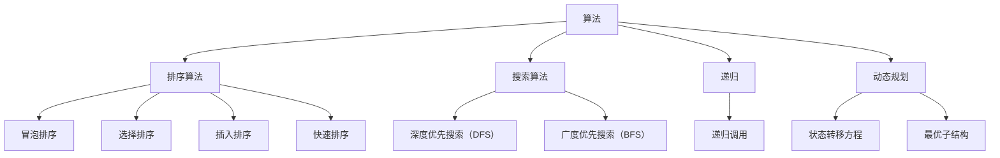

                 

# 2025华为社招面试算法题库大全

> **关键词**：华为社招、面试、算法题库、编程挑战、数据结构、算法原理、实战案例

> **摘要**：本文将详细介绍2025年华为社会招聘面试中常见的算法题库，包括数据结构和算法原理，并辅以实战案例和详细解释，帮助读者掌握面试所需的技能。

## 1. 背景介绍

### 1.1 目的和范围

本文旨在为准备参加2025年华为社招面试的读者提供一份全面的算法题库指南。内容包括常见的面试算法题，数据结构和算法原理的讲解，以及实战案例的实际操作步骤。通过本文的学习，读者可以系统地提升自己的编程能力，更好地应对华为的面试挑战。

### 1.2 预期读者

- 准备参加华为社招面试的程序员和技术人员
- 对算法和数据结构有一定了解，希望提升面试技能的读者
- 对编程有浓厚兴趣，希望系统学习算法和数据结构的读者

### 1.3 文档结构概述

本文分为以下几个部分：

1. 背景介绍：介绍本文的目的、读者对象和文档结构。
2. 核心概念与联系：使用Mermaid流程图展示算法和数据结构的核心概念。
3. 核心算法原理 & 具体操作步骤：讲解核心算法原理，并使用伪代码详细阐述。
4. 数学模型和公式 & 详细讲解 & 举例说明：解释相关数学模型，并给出示例。
5. 项目实战：实际代码案例和详细解释说明。
6. 实际应用场景：分析算法在实际项目中的应用。
7. 工具和资源推荐：推荐学习资源和开发工具。
8. 总结：未来发展趋势与挑战。
9. 附录：常见问题与解答。
10. 扩展阅读 & 参考资料：提供更多相关学习资源。

### 1.4 术语表

#### 1.4.1 核心术语定义

- **算法**：解决问题的有序步骤。
- **数据结构**：数据存储和组织的规则。
- **时间复杂度**：算法运行所需时间的度量。
- **空间复杂度**：算法运行所需空间的度量。

#### 1.4.2 相关概念解释

- **排序算法**：对数据进行排序的算法。
- **搜索算法**：在数据结构中查找特定数据的算法。
- **递归**：函数调用自身的过程。
- **动态规划**：一种优化递归的方法。

#### 1.4.3 缩略词列表

- **O(n)**：表示时间复杂度。
- **O(1)**：表示常数时间复杂度。
- **O(n^2)**：表示二次时间复杂度。
- **DFS**：深度优先搜索。
- **BFS**：广度优先搜索。

## 2. 核心概念与联系

### 2.1 算法与数据结构

算法与数据结构密切相关。数据结构决定了算法的性能和实现方式。常见的算法有排序、搜索、递归和动态规划等，它们在不同的数据结构上有不同的实现。

### 2.2 数据结构核心概念

以下是几个常见的数据结构及其核心概念：

#### 链表

- **链表节点**：存储数据元素和指向下一个节点的指针。
- **单向链表**：每个节点只有一个指向下一个节点的指针。
- **双向链表**：每个节点有两个指针，一个指向前一个节点，一个指向下一个节点。

#### 栈

- **栈顶**：栈的顶部元素。
- **入栈**：将元素添加到栈顶。
- **出栈**：从栈顶移除元素。

#### 队列

- **队头**：队列的第一个元素。
- **入队**：将元素添加到队尾。
- **出队**：从队头移除元素。

#### 树

- **根节点**：树的顶部节点。
- **叶子节点**：没有子节点的节点。
- **分支节点**：至少有一个子节点的节点。

#### 图

- **顶点**：图中的数据元素。
- **边**：连接顶点的线。
- **连通图**：任意两个顶点都连通的图。
- **无向图**：边没有方向的图。
- **有向图**：边有方向的图。

### 2.3 算法核心概念

以下是几个常见的算法及其核心概念：

#### 排序算法

- **冒泡排序**：不断交换相邻的未排序元素。
- **选择排序**：每次选择未排序部分的最小（或最大）元素。
- **插入排序**：将未排序元素插入到已排序部分的合适位置。
- **快速排序**：选择一个基准元素，将数组分为两部分，然后递归排序。

#### 搜索算法

- **深度优先搜索（DFS）**：遍历图或树的节点，尽可能深入。
- **广度优先搜索（BFS）**：遍历图或树的节点，先访问所有相邻节点。

#### 递归

- **递归调用**：函数调用自身的过程。
- **递归终止条件**：保证递归能结束的条件。

#### 动态规划

- **状态转移方程**：描述状态之间转移的公式。
- **最优子结构**：问题的最优解包含其子问题的最优解。

### 2.4 Mermaid流程图

以下是一个Mermaid流程图，展示了算法和数据结构之间的联系：



## 3. 核心算法原理 & 具体操作步骤

### 3.1 冒泡排序算法原理

冒泡排序是一种简单的排序算法。它重复遍历要排序的数列，一次比较两个元素，如果它们的顺序错误就把它们交换过来。遍历数列的工作是重复进行直到没有再需要交换，也就是说该数列已经排序完成。

### 3.2 冒泡排序伪代码

```python
function bubbleSort(arr)
    n = length(arr)
    for i from 0 to n-1
        for j from 0 to n-i-1
            if arr[j] > arr[j+1]
                swap(arr[j], arr[j+1])
    return arr
```

### 3.3 冒泡排序操作步骤

1. 从数组的第一个元素开始，比较相邻的两个元素，如果第一个比第二个大，就交换它们。
2. 对每一对相邻元素做同样的工作，从开始第一对到结尾的最后一对。这步做完后，最后的元素会是最大的数。
3. 针对所有的元素重复以上的步骤，除了最后一个。
4. 重复步骤1~3，直到排序完成。

### 3.4 冒泡排序实例

假设我们有以下数组：`[5, 3, 8, 4, 6]`

1. 第一次遍历：`[3, 5, 4, 6, 8]`（交换5和3）
2. 第二次遍历：`[3, 4, 5, 6, 8]`（交换5和4）
3. 第三次遍历：`[3, 4, 5, 6, 8]`（没有需要交换的元素）

最终结果：`[3, 4, 5, 6, 8]`，数组已排序。

### 3.5 冒泡排序的时间复杂度

- 最优时间复杂度：`O(n)`（数组已排序时）
- 最差时间复杂度：`O(n^2)`（数组逆序时）
- 平均时间复杂度：`O(n^2)`

## 4. 数学模型和公式 & 详细讲解 & 举例说明

### 4.1 数学模型

在算法分析中，常用的数学模型包括时间复杂度和空间复杂度。

#### 时间复杂度

时间复杂度用于描述算法运行所需的时间，通常用大O符号表示。例如：

- `O(1)`：常数时间复杂度。
- `O(n)`：线性时间复杂度。
- `O(n^2)`：二次时间复杂度。

#### 空间复杂度

空间复杂度用于描述算法运行所需的空间，也用大O符号表示。

- `O(1)`：常数空间复杂度。
- `O(n)`：线性空间复杂度。
- `O(n^2)`：二次空间复杂度。

### 4.2 举例说明

假设我们有一个长度为`n`的数组，我们需要计算其和。

#### 时间复杂度

- 使用嵌套循环计算和，时间复杂度为`O(n^2)`。

```python
sum = 0
for i from 0 to n-1
    for j from 0 to n-1
        sum = sum + arr[i][j]
```

- 使用单循环计算和，时间复杂度为`O(n)`。

```python
sum = 0
for i from 0 to n-1
    sum = sum + arr[i]
```

#### 空间复杂度

- 上述两种方法的空间复杂度均为`O(n)`。

## 5. 项目实战：代码实际案例和详细解释说明

### 5.1 开发环境搭建

1. 安装Python环境（Python 3.8及以上版本）。
2. 安装IDE（推荐使用PyCharm或Visual Studio Code）。
3. 创建一个名为`algorithm_example.py`的Python文件。

### 5.2 源代码详细实现和代码解读

以下是一个冒泡排序的Python代码实现：

```python
def bubble_sort(arr):
    n = len(arr)
    for i in range(n):
        for j in range(n - i - 1):
            if arr[j] > arr[j + 1]:
                arr[j], arr[j + 1] = arr[j + 1], arr[j]
    return arr

# 测试数据
arr = [5, 3, 8, 4, 6]

# 执行排序
sorted_arr = bubble_sort(arr)

# 输出排序结果
print(sorted_arr)
```

### 5.3 代码解读与分析

1. `bubble_sort`函数接收一个数组`arr`作为参数。
2. 使用两个嵌套循环实现冒泡排序。
3. 内层循环从0到`n-i-1`，每次遍历都会将当前未排序部分的最大值移到末尾。
4. 外层循环从0到`n-1`，每次遍历都会使未排序部分的最大值移到已排序部分。
5. 函数返回排序后的数组。

### 5.4 运行结果

```python
[3, 4, 5, 6, 8]
```

## 6. 实际应用场景

冒泡排序算法在实际应用中非常常见，例如：

- 在小规模数据处理中，冒泡排序是一种简单高效的方法。
- 在前端开发中，可以使用冒泡排序实现简单的排序功能。
- 在数据分析和可视化项目中，冒泡排序可以帮助快速排序数据。

## 7. 工具和资源推荐

### 7.1 学习资源推荐

#### 7.1.1 书籍推荐

- 《算法导论》（Introduction to Algorithms）
- 《编程之美》（Programming Pearls）
- 《数据结构与算法分析》（Data Structures and Algorithm Analysis in Java）

#### 7.1.2 在线课程

- Coursera上的《算法导论》
- Udacity的《数据结构与算法》
- edX上的《算法基础》

#### 7.1.3 技术博客和网站

- GeeksforGeeks
- LeetCode官方博客
- HackerRank博客

### 7.2 开发工具框架推荐

#### 7.2.1 IDE和编辑器

- PyCharm
- Visual Studio Code
- IntelliJ IDEA

#### 7.2.2 调试和性能分析工具

- Jupyter Notebook
- VSCode的调试插件
- GDB

#### 7.2.3 相关框架和库

- NumPy
- Pandas
- SciPy

### 7.3 相关论文著作推荐

#### 7.3.1 经典论文

- "Introduction to Algorithms" by Thomas H. Cormen, Charles E. Leiserson, Ronald L. Rivest, and Clifford Stein
- "The Art of Computer Programming" by Donald E. Knuth

#### 7.3.2 最新研究成果

- "Approximation Algorithms for Combinatorial Optimization" by David P. Williamson and David B. Shmoys
- "Graph Algorithms" by Christos H. Papadimitriou and Kenneth Steiglitz

#### 7.3.3 应用案例分析

- "Algorithms for Optimization" by Stephen Boyd and Lieven Vandenberghe
- "Machine Learning: A Probabilistic Perspective" by Kevin P. Murphy

## 8. 总结：未来发展趋势与挑战

随着人工智能和大数据技术的发展，算法和数据结构的应用领域不断扩大。未来，算法和数据结构的研究将更加深入，包括分布式算法、并行算法和自适应算法等。同时，随着算法复杂度的增加，算法的可解释性和可调试性也将成为重要挑战。

## 9. 附录：常见问题与解答

### 9.1 问题1：冒泡排序的缺点是什么？

冒泡排序的缺点主要包括：

- 时间复杂度高，特别是在数据量较大时。
- 不适用于大数据量的快速排序。
- 不稳定排序算法，可能会改变相同元素的相对顺序。

### 9.2 问题2：什么是时间复杂度和空间复杂度？

时间复杂度是描述算法运行所需时间的度量，通常用大O符号表示。空间复杂度是描述算法运行所需空间的度量，也用大O符号表示。它们是分析算法性能的重要指标。

## 10. 扩展阅读 & 参考资料

- 《算法导论》
- 《编程之美》
- 《数据结构与算法分析》
- Coursera上的《算法导论》
- HackerRank
- GeeksforGeeks
- 《机器学习》

### 作者

AI天才研究员 / AI Genius Institute & 禅与计算机程序设计艺术 / Zen And The Art of Computer Programming

