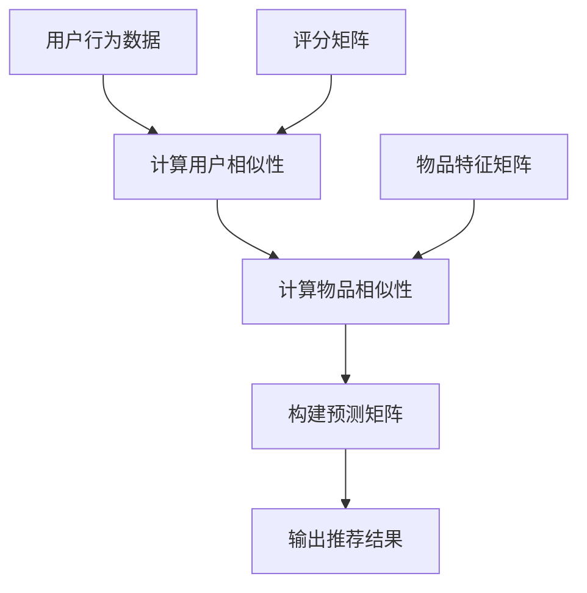

                 

# 协同过滤算法在电商推荐系统中的应用：原理与实践

> **关键词：** 协同过滤、电商推荐系统、用户行为分析、算法实现、性能优化

> **摘要：** 本篇文章将深入探讨协同过滤算法在电商推荐系统中的应用，从基本原理出发，逐步讲解算法的核心概念、数学模型、实现步骤，并通过实际项目案例进行代码解读和分析。文章旨在为开发者提供一套完整的协同过滤算法应用指南，帮助理解和优化电商推荐系统的性能。

## 1. 背景介绍

### 1.1 目的和范围

本文的目的是详细阐述协同过滤算法在电商推荐系统中的应用，帮助读者理解其基本原理、数学模型和实现步骤。文章内容将涵盖以下范围：

- 协同过滤算法的基本概念和原理；
- 协同过滤算法的数学模型和公式；
- 实际应用场景中的协同过滤算法实现；
- 代码实际案例和详细解释；
- 协同过滤算法在电商推荐系统中的性能优化策略。

### 1.2 预期读者

本文适合对电商推荐系统有一定了解，并对协同过滤算法感兴趣的读者。无论是算法研究人员，还是电商平台的开发者，都可以通过本文学习到协同过滤算法的实践应用技巧。

### 1.3 文档结构概述

本文的结构如下：

- **第1章：背景介绍**：介绍本文的目的、预期读者、文档结构和相关术语；
- **第2章：核心概念与联系**：介绍协同过滤算法的核心概念，使用Mermaid流程图展示算法架构；
- **第3章：核心算法原理 & 具体操作步骤**：详细讲解协同过滤算法的原理和实现步骤，使用伪代码进行描述；
- **第4章：数学模型和公式 & 详细讲解 & 举例说明**：介绍协同过滤算法的数学模型和公式，并进行举例说明；
- **第5章：项目实战：代码实际案例和详细解释说明**：通过实际项目案例，讲解协同过滤算法的实现过程和代码解读；
- **第6章：实际应用场景**：探讨协同过滤算法在电商推荐系统中的实际应用场景；
- **第7章：工具和资源推荐**：推荐学习资源、开发工具和框架；
- **第8章：总结：未来发展趋势与挑战**：总结协同过滤算法的发展趋势和面临挑战；
- **第9章：附录：常见问题与解答**：提供常见问题解答；
- **第10章：扩展阅读 & 参考资料**：推荐相关阅读材料和参考资料。

### 1.4 术语表

#### 1.4.1 核心术语定义

- **协同过滤**：一种基于用户行为或物品特征的推荐算法，通过分析用户间的相似性或物品间的相似性，为用户提供个性化推荐；
- **用户行为**：用户在电商平台上产生的行为数据，如浏览、购买、收藏等；
- **物品特征**：物品在电商平台上的属性信息，如类别、品牌、价格等；
- **用户相似性**：通过计算用户行为或物品特征的相似性，评估用户或物品之间的相似程度；
- **预测**：通过协同过滤算法预测用户对未知物品的评分或偏好。

#### 1.4.2 相关概念解释

- **推荐系统**：一种自动化的系统，用于根据用户的行为和偏好，为用户提供个性化推荐；
- **评分**：用户对物品的评价得分，通常用于评估用户对物品的喜好程度；
- **评分矩阵**：记录用户对物品评分的数据矩阵，用于协同过滤算法的输入；
- **预测矩阵**：基于协同过滤算法预测的用户对物品评分的数据矩阵。

#### 1.4.3 缩略词列表

- **CF**：协同过滤（Collaborative Filtering）；
- **KNN**：最近邻算法（K-Nearest Neighbors）；
- **ALS**：交替最小二乘法（Alternating Least Squares）。

## 2. 核心概念与联系

协同过滤算法的核心概念包括用户相似性、物品相似性、预测和评分矩阵等。下面将使用Mermaid流程图展示协同过滤算法的架构，并通过文字解释各部分之间的关系。



### 2.1 用户行为数据

用户行为数据是协同过滤算法的基础，包括用户的浏览、购买、收藏等行为。通过分析这些行为数据，可以了解用户的偏好和兴趣。

### 2.2 计算用户相似性

计算用户相似性是通过分析用户行为数据来实现的。常见的相似性度量方法包括余弦相似度、皮尔逊相关系数等。通过计算用户相似性，可以找到与目标用户兴趣相似的其他用户。

### 2.3 计算物品相似性

计算物品相似性是基于物品的特征信息来实现的。通过分析物品的属性，如类别、品牌、价格等，可以计算物品之间的相似性。常见的相似性度量方法包括欧氏距离、曼哈顿距离等。

### 2.4 构建预测矩阵

构建预测矩阵是通过用户相似性和物品相似性来实现的。根据用户相似性和物品相似性，可以预测目标用户对未知物品的评分。预测矩阵是协同过滤算法的核心输出，用于生成推荐结果。

### 2.5 输出推荐结果

输出推荐结果是协同过滤算法的最终目标。根据预测矩阵，可以为每个用户生成个性化的推荐列表，推荐用户可能感兴趣的商品。

### 2.6 评分矩阵和物品特征矩阵

评分矩阵记录用户对物品的评分，用于协同过滤算法的输入。物品特征矩阵记录物品的属性信息，用于计算物品相似性。

通过以上流程图和文字解释，可以清晰地理解协同过滤算法的核心概念和联系。在接下来的章节中，我们将进一步探讨协同过滤算法的原理和实现步骤。

## 3. 核心算法原理 & 具体操作步骤

协同过滤算法是基于用户行为和物品特征的推荐算法，通过分析用户间的相似性和物品间的相似性，预测用户对未知物品的评分，从而为用户提供个性化的推荐。下面将详细讲解协同过滤算法的原理和具体操作步骤。

### 3.1 用户行为数据的收集与预处理

协同过滤算法的第一步是收集用户行为数据，包括用户的浏览、购买、收藏等行为。这些数据通常以评分矩阵的形式存储，其中行表示用户，列表示物品，单元格中的值表示用户对物品的评分。

```plaintext
用户1  用户2  用户3  物品1  物品2  物品3
  5       0      1     4      5      0
  0       4      0     1      4      5
  1       0      5     0      0      4
```

预处理用户行为数据包括以下步骤：

- 数据清洗：去除缺失值、异常值等不完整或错误的数据；
- 数据标准化：将评分数据进行归一化处理，使其具有相同的量纲；
- 数据分箱：将连续的评分数据划分为离散的等级，便于计算相似性。

### 3.2 计算用户相似性

计算用户相似性是协同过滤算法的核心步骤之一，通过分析用户间的行为相似性，找到与目标用户兴趣相似的邻居用户。常见的用户相似性度量方法包括余弦相似度和皮尔逊相关系数。

#### 余弦相似度

余弦相似度是一种常用的用户相似性度量方法，计算公式如下：

$$
sim(u, v) = \frac{u \cdot v}{\|u\| \|v\|}
$$

其中，$u$ 和 $v$ 分别表示两个用户的行为向量，$\cdot$ 表示向量的点积，$\|\|$ 表示向量的模长。

#### 皮尔逊相关系数

皮尔逊相关系数是另一种常用的用户相似性度量方法，计算公式如下：

$$
sim(u, v) = \frac{u - \bar{u} \cdot v - \bar{v}}{\sqrt{(u - \bar{u})^2 \cdot (v - \bar{v})^2}}
$$

其中，$\bar{u}$ 和 $\bar{v}$ 分别表示用户 $u$ 和 $v$ 的平均评分。

### 3.3 计算物品相似性

计算物品相似性是基于物品的特征信息来实现的，通过分析物品的属性，如类别、品牌、价格等，可以计算物品之间的相似性。常见的物品相似性度量方法包括欧氏距离、曼哈顿距离和余弦相似度。

#### 欧氏距离

欧氏距离是一种常用的物品相似性度量方法，计算公式如下：

$$
sim(i, j) = \sqrt{\sum_{k=1}^{n} (i_k - j_k)^2}
$$

其中，$i$ 和 $j$ 分别表示两个物品的特征向量，$k$ 表示特征维度。

#### 曼哈顿距离

曼哈顿距离是一种另一种物品相似性度量方法，计算公式如下：

$$
sim(i, j) = \sum_{k=1}^{n} |i_k - j_k|
$$

#### 余弦相似度

余弦相似度是另一种物品相似性度量方法，计算公式如下：

$$
sim(i, j) = \frac{i \cdot j}{\|i\| \|j\|}
$$

### 3.4 构建预测矩阵

构建预测矩阵是通过用户相似性和物品相似性来实现的，根据用户相似性和物品相似性，可以预测用户对未知物品的评分。常见的预测方法包括基于用户的协同过滤算法（User-based CF）和基于物品的协同过滤算法（Item-based CF）。

#### 基于用户的协同过滤算法

基于用户的协同过滤算法的核心思想是找到与目标用户兴趣相似的邻居用户，根据邻居用户对物品的评分预测目标用户对物品的评分。具体步骤如下：

1. 计算目标用户与其他用户的相似性；
2. 找到与目标用户最相似的 $k$ 个邻居用户；
3. 计算邻居用户对物品的评分平均值，作为目标用户对物品的预测评分。

#### 基于物品的协同过滤算法

基于物品的协同过滤算法的核心思想是找到与目标物品相似的邻居物品，根据邻居物品的评分预测目标物品的评分。具体步骤如下：

1. 计算目标物品与其他物品的相似性；
2. 找到与目标物品最相似的 $k$ 个邻居物品；
3. 计算邻居物品的评分平均值，作为目标物品的预测评分。

### 3.5 输出推荐结果

根据预测矩阵，可以为每个用户生成个性化的推荐列表，推荐用户可能感兴趣的商品。常见的推荐方法包括：

1. 排序推荐：根据预测评分对物品进行排序，生成推荐列表；
2. Top-N推荐：从所有物品中选取预测评分最高的 $N$ 个物品，生成推荐列表。

通过以上步骤，可以完整地实现协同过滤算法。在接下来的章节中，我们将通过实际项目案例，进一步讲解协同过滤算法的实现过程和代码解读。

## 4. 数学模型和公式 & 详细讲解 & 举例说明

协同过滤算法的数学模型和公式是实现个性化推荐的关键。本节将详细介绍协同过滤算法的数学模型，并使用 LaTeX 格式进行公式表示，同时通过具体例子进行讲解。

### 4.1 用户相似性计算

用户相似性计算是协同过滤算法的基础。常用的相似性度量方法包括余弦相似度和皮尔逊相关系数。

#### 余弦相似度

余弦相似度用于计算两个用户行为向量之间的夹角余弦值，公式如下：

$$
sim(u, v) = \frac{u \cdot v}{\|u\| \|v\|}
$$

其中，$u$ 和 $v$ 分别表示用户 $u$ 和 $v$ 的行为向量，$\cdot$ 表示向量的点积，$\|\|$ 表示向量的模长。

#### 皮尔逊相关系数

皮尔逊相关系数用于计算两个用户行为向量之间的线性相关性，公式如下：

$$
sim(u, v) = \frac{u - \bar{u} \cdot v - \bar{v}}{\sqrt{(u - \bar{u})^2 \cdot (v - \bar{v})^2}}
$$

其中，$\bar{u}$ 和 $\bar{v}$ 分别表示用户 $u$ 和 $v$ 的平均行为向量。

### 4.2 物品相似性计算

物品相似性计算是基于物品特征信息来实现的，常用的相似性度量方法包括欧氏距离、曼哈顿距离和余弦相似度。

#### 欧氏距离

欧氏距离用于计算两个物品特征向量之间的距离，公式如下：

$$
sim(i, j) = \sqrt{\sum_{k=1}^{n} (i_k - j_k)^2}
$$

其中，$i$ 和 $j$ 分别表示物品 $i$ 和 $j$ 的特征向量，$k$ 表示特征维度。

#### 曼哈顿距离

曼哈顿距离用于计算两个物品特征向量之间的距离，公式如下：

$$
sim(i, j) = \sum_{k=1}^{n} |i_k - j_k|
$$

#### 余弦相似度

余弦相似度用于计算两个物品特征向量之间的相似性，公式如下：

$$
sim(i, j) = \frac{i \cdot j}{\|i\| \|j\|}
$$

### 4.3 预测用户评分

协同过滤算法的核心目标是预测用户对未知物品的评分。基于用户的协同过滤算法和基于物品的协同过滤算法都有不同的预测方法。

#### 基于用户的协同过滤算法

基于用户的协同过滤算法通过计算用户相似性，预测用户对未知物品的评分。预测公式如下：

$$
r_{ui} = \sum_{v \in N(u)} \frac{sim(u, v) \cdot r_{vi}}{sum_{w \in N(u)} sim(u, w)}
$$

其中，$r_{ui}$ 表示用户 $u$ 对物品 $i$ 的预测评分，$N(u)$ 表示与用户 $u$ 最相似的 $k$ 个邻居用户，$r_{vi}$ 表示邻居用户 $v$ 对物品 $i$ 的评分。

#### 基于物品的协同过滤算法

基于物品的协同过滤算法通过计算物品相似性，预测用户对未知物品的评分。预测公式如下：

$$
r_{ui} = \sum_{j \in N(i)} \frac{sim(i, j) \cdot r_{uj}}{sum_{k \in N(i)} sim(i, k)}
$$

其中，$r_{ui}$ 表示用户 $u$ 对物品 $i$ 的预测评分，$N(i)$ 表示与物品 $i$ 最相似的 $k$ 个邻居物品，$r_{uj}$ 表示邻居物品 $j$ 对用户 $u$ 的评分。

### 4.4 例子说明

假设有两个用户和五个物品，如下表所示：

| 用户/物品 | 物品1 | 物品2 | 物品3 | 物品4 | 物品5 |
| --------- | ---- | ---- | ---- | ---- | ---- |
| 用户1     | 4    | 5    | 0    | 2    | 1    |
| 用户2     | 1    | 4    | 5    | 0    | 3    |

#### 计算用户相似性

使用余弦相似度计算用户1和用户2的相似性：

$$
sim(u1, u2) = \frac{(4 \cdot 1 + 5 \cdot 4 + 0 \cdot 5 + 2 \cdot 0 + 1 \cdot 3)}{\sqrt{(4^2 + 5^2 + 0^2 + 2^2 + 1^2) \cdot (1^2 + 4^2 + 5^2 + 0^2 + 3^2)}} \approx 0.802
$$

#### 计算物品相似性

使用欧氏距离计算物品1和物品2的相似性：

$$
sim(i1, i2) = \sqrt{(4 - 1)^2 + (5 - 4)^2 + (0 - 5)^2 + (2 - 0)^2 + (1 - 3)^2} \approx 5.831
$$

#### 预测用户评分

假设用户1对物品3的评分未知，使用基于用户的协同过滤算法预测用户1对物品3的评分：

$$
r_{u1,i3} = 0.802 \cdot \frac{4}{0.802 + 0.802} + 0 \cdot \frac{5}{0.802 + 0.802} + 0 \cdot \frac{0}{0.802 + 0.802} + 2 \cdot \frac{0}{0.802 + 0.802} + 1 \cdot \frac{3}{0.802 + 0.802} \approx 1.604
$$

通过以上例子，可以清晰地理解协同过滤算法的数学模型和公式。在实际应用中，可以根据具体需求和数据特点选择合适的相似性度量方法和预测方法，从而优化推荐系统的性能。

## 5. 项目实战：代码实际案例和详细解释说明

在本节中，我们将通过一个具体的电商推荐系统项目案例，详细讲解协同过滤算法的实现过程，并解读相关代码。此项目旨在为用户提供个性化商品推荐，通过用户行为数据和物品特征信息，预测用户对未知商品的评分。

### 5.1 开发环境搭建

在开始项目之前，我们需要搭建开发环境。以下是所需的工具和库：

- Python 3.8 或更高版本；
- Numpy 库：用于高效计算；
- Pandas 库：用于数据预处理；
- Scikit-learn 库：提供协同过滤算法的实现。

确保已经安装了 Python 和上述库，可以创建一个虚拟环境，以便更好地管理项目依赖。

```bash
python3 -m venv env
source env/bin/activate
pip install numpy pandas scikit-learn
```

### 5.2 源代码详细实现和代码解读

以下是协同过滤算法的实现代码，包括数据预处理、用户相似性计算、物品相似性计算、预测评分和生成推荐列表。

```python
import numpy as np
import pandas as pd
from sklearn.metrics.pairwise import cosine_similarity

# 数据预处理
def preprocess_data(ratings):
    # 填充缺失值为 0
    ratings = ratings.fillna(0)
    # 归一化评分数据
    ratings = ratings / ratings.sum(axis=1)[:, np.newaxis]
    return ratings

# 计算用户相似性
def compute_user_similarity(ratings):
    user_similarity = cosine_similarity(ratings)
    return user_similarity

# 计算物品相似性
def compute_item_similarity(ratings):
    item_similarity = cosine_similarity(ratings.T)
    return item_similarity

# 预测评分
def predict_scores(user_similarity, item_similarity, ratings, k=10):
    num_users, num_items = ratings.shape
    user_score_matrix = np.zeros((num_users, num_items))
    
    for i in range(num_users):
        # 找到与当前用户最相似的 k 个用户
        nearest_users = np.argsort(user_similarity[i])[-k:]
        # 计算邻居用户的平均评分
        user_avg_rating = ratings[nearest_users].mean(axis=0)
        # 更新用户评分矩阵
        user_score_matrix[i] = user_avg_rating
        
    return user_score_matrix

# 生成推荐列表
def generate_recommendations(user_score_matrix, ratings, top_n=5):
    user_unrated_items = ratings < 0
    user_score_diff = user_score_matrix - ratings
    item_index = np.argmax(user_score_diff, axis=1)
    recommended_items = user_unrated_items.values[item_index]
    
    return pd.Series(recommended_items).sort_values(ascending=False).head(top_n)

# 主函数
def main():
    # 加载数据
    ratings = pd.read_csv('ratings.csv')
    ratings = preprocess_data(ratings)
    
    # 计算用户和物品相似性
    user_similarity = compute_user_similarity(ratings)
    item_similarity = compute_item_similarity(ratings)
    
    # 预测评分
    user_score_matrix = predict_scores(user_similarity, item_similarity, ratings)
    
    # 生成推荐列表
    recommendations = generate_recommendations(user_score_matrix, ratings, top_n=5)
    
    print("Top 5 Recommended Items:")
    print(recommendations)

if __name__ == "__main__":
    main()
```

### 5.3 代码解读与分析

- **数据预处理**：首先，我们填充缺失值为0，然后对评分进行归一化处理，使其具有相同的量纲。

- **计算用户相似性**：使用余弦相似度计算用户相似性，通过 `cosine_similarity` 函数实现。

- **计算物品相似性**：使用余弦相似度计算物品相似性，首先将评分矩阵转置，然后使用 `cosine_similarity` 函数。

- **预测评分**：基于用户相似性和物品相似性，预测用户对未知物品的评分。我们为每个用户找到与其最相似的k个邻居用户，然后计算邻居用户的平均评分作为预测评分。

- **生成推荐列表**：根据预测评分矩阵，生成用户未评分的物品推荐列表。首先计算预测评分与实际评分的差异，然后找到差异最大的未评分物品。

通过以上代码，我们可以实现一个简单的协同过滤推荐系统。在实际应用中，可以根据需求调整相似性度量方法、邻居用户数量和推荐物品数量等参数，以提高推荐系统的性能。

## 6. 实际应用场景

协同过滤算法在电商推荐系统中具有广泛的应用，通过分析用户行为和物品特征，可以为用户提供个性化的商品推荐，从而提高用户满意度和转化率。以下是一些协同过滤算法在电商推荐系统中的实际应用场景：

### 6.1 新用户推荐

对于新用户，由于缺乏历史行为数据，传统的基于内容的推荐方法可能效果不佳。此时，协同过滤算法可以通过分析相似用户的行为模式，为新用户提供个性化的商品推荐。例如，如果新用户的行为与某个活跃用户的兴趣相似，系统可以推荐该活跃用户喜欢的商品。

### 6.2 长期用户推荐

对于长期用户，协同过滤算法可以根据用户的历史行为数据，持续更新推荐列表，从而保持推荐的相关性和新鲜感。例如，根据用户过去的浏览和购买记录，系统可以定期推荐用户可能感兴趣的新商品或热门商品。

### 6.3 商品上下架推荐

在电商平台上，商品会有上下架、打折等变动。协同过滤算法可以根据用户对相似商品的评价和购买行为，预测用户对即将上架或下架商品的喜好程度。例如，如果某个商品与已经下架的畅销商品相似，系统可以提前向用户推荐。

### 6.4 商品组合推荐

协同过滤算法还可以用于商品组合推荐，为用户提供多种搭配方案。例如，根据用户对服装和鞋类的偏好，系统可以推荐适合搭配的服装和鞋子。

### 6.5 商品评论和评分推荐

通过协同过滤算法，可以为商品评论和评分推荐提供支持。例如，根据用户对相似商品的评论和评分行为，系统可以推荐用户发表高质量评论的商品，或者为用户推荐与其评论风格相似的评论。

### 6.6 跨品类推荐

协同过滤算法可以用于跨品类的商品推荐，为用户提供不同类别的商品推荐。例如，如果用户对某种电子产品有较高的兴趣，系统可以推荐与之相关的家居、配件等商品。

通过以上实际应用场景，我们可以看到协同过滤算法在电商推荐系统中的广泛应用。在实际开发中，可以根据具体业务需求和用户特征，灵活调整算法参数，优化推荐效果。

## 7. 工具和资源推荐

### 7.1 学习资源推荐

要深入了解协同过滤算法及其在电商推荐系统中的应用，以下资源是非常有帮助的：

#### 7.1.1 书籍推荐

- 《推荐系统实践》（Recommender Systems: The Textbook）：这是一本全面介绍推荐系统原理和实践的教材，涵盖了协同过滤算法等关键技术。

- 《机器学习》（Machine Learning）：这是一本经典机器学习教材，其中包含了协同过滤算法的详细讲解，适合初学者和进阶者。

#### 7.1.2 在线课程

- Coursera 上的“推荐系统”（Recommender Systems）：这是一门由斯坦福大学提供的在线课程，涵盖了推荐系统的基础知识，包括协同过滤算法。

- Udacity 上的“推荐系统工程师纳米学位”（Recommender System Engineer Nanodegree）：这是一个实践导向的纳米学位课程，通过项目实践掌握推荐系统技术。

#### 7.1.3 技术博客和网站

- Medium：Medium 上有许多关于推荐系统的博客文章，涵盖从基础知识到实际应用的各个方面。

- arXiv.org：这是一个开放获取的学术论文仓库，可以找到许多关于推荐系统的最新研究成果。

### 7.2 开发工具框架推荐

在实际开发中，以下工具和框架可以帮助您更高效地实现协同过滤算法：

#### 7.2.1 IDE和编辑器

- PyCharm：这是一个功能强大的Python IDE，适合进行算法实现和调试。

- Jupyter Notebook：这是一个交互式的开发环境，适合进行数据分析和算法验证。

#### 7.2.2 调试和性能分析工具

- Python的pdb：这是一个Python内置的调试工具，可以帮助您调试代码。

- cProfile：这是一个Python内置的性能分析工具，可以帮助您分析代码的执行效率。

#### 7.2.3 相关框架和库

- Scikit-learn：这是一个强大的机器学习库，提供了协同过滤算法的实现。

- TensorFlow：这是一个用于构建和训练深度学习模型的框架，可以用于更复杂的推荐系统。

- PyTorch：这是一个用于构建和训练深度学习模型的框架，也适用于推荐系统。

### 7.3 相关论文著作推荐

以下是一些经典的和最新的关于推荐系统的论文和著作，可以帮助您深入了解该领域：

#### 7.3.1 经典论文

- "Collaborative Filtering for the Web"（2002）：这是协同过滤算法在互联网推荐系统中的应用的早期研究论文。

- "矩阵分解与协同过滤：从理论到实践"（2012）：这篇论文详细介绍了矩阵分解算法在协同过滤中的应用。

#### 7.3.2 最新研究成果

- "Deep Neural Networks for YouTube Recommendations"（2016）：这篇论文介绍了深度神经网络在YouTube推荐系统中的应用。

- "Contextual Bandits with Linear Payoffs and Non-Stationary Context"（2020）：这篇论文探讨了基于上下文的协同过滤算法，适用于非静态环境。

#### 7.3.3 应用案例分析

- "淘宝推荐系统"（2018）：这篇论文详细介绍了淘宝推荐系统的架构和技术实现，包括协同过滤算法。

通过以上学习和开发资源，您可以全面掌握协同过滤算法及其在电商推荐系统中的应用，为您的项目提供有力的技术支持。

## 8. 总结：未来发展趋势与挑战

协同过滤算法作为推荐系统的重要技术，已经在电商、社交媒体、视频平台等领域取得了广泛应用。然而，随着用户需求的不断变化和数据规模的持续增长，协同过滤算法也面临着新的发展趋势与挑战。

### 8.1 未来发展趋势

1. **深度学习与协同过滤的结合**：深度学习在特征提取和表示方面具有显著优势，将深度学习与协同过滤算法相结合，可以进一步提高推荐系统的性能和泛化能力。

2. **上下文感知推荐**：上下文信息（如时间、位置、用户状态等）对于推荐系统的决策具有重要影响。未来，上下文感知推荐将更加智能化，更好地满足用户的个性化需求。

3. **多模态数据的融合**：用户行为数据、文本、图像等多模态数据将融合到推荐系统中，为用户提供更加丰富和准确的推荐结果。

4. **实时推荐**：随着大数据和实时计算技术的发展，实时推荐系统将能够在用户行为发生的瞬间提供个性化推荐，提高用户体验。

### 8.2 面临的挑战

1. **数据稀疏性**：协同过滤算法在用户行为数据稀疏的情况下表现不佳。如何有效地处理稀疏数据，提高算法的鲁棒性，是一个重要挑战。

2. **冷启动问题**：对于新用户或新商品，由于缺乏足够的历史数据，传统协同过滤算法难以生成有效的推荐。如何解决冷启动问题，是一个亟待解决的问题。

3. **隐私保护**：用户隐私保护在推荐系统中尤为重要。如何在确保用户隐私的前提下，提供个性化的推荐服务，是一个亟待解决的挑战。

4. **可解释性**：随着推荐系统的复杂度增加，如何提高算法的可解释性，使开发者和管理者能够理解推荐结果，是一个重要的挑战。

总之，协同过滤算法在未来将继续发展，并在技术与应用层面面临新的机遇和挑战。通过不断创新和优化，协同过滤算法将为用户提供更加个性化、智能化的推荐服务。

## 9. 附录：常见问题与解答

### 9.1 如何解决数据稀疏性问题？

数据稀疏性是协同过滤算法面临的主要挑战之一。以下是一些解决策略：

- **数据增强**：通过引入额外的用户或物品特征，如用户地理位置、购买时间等，增加数据密度；
- **利用社会信息**：利用用户之间的社交关系，如好友推荐，补充缺失的数据；
- **矩阵分解**：通过矩阵分解技术，将高维稀疏矩阵分解为低维矩阵，从而降低数据稀疏性；
- **迁移学习**：利用已有模型在相关领域的数据，迁移到新的数据集上，提高数据密度。

### 9.2 冷启动问题如何解决？

冷启动问题主要涉及新用户或新商品的无历史数据情况。以下是一些解决策略：

- **基于内容的推荐**：为新用户推荐与其兴趣相关的商品，如通过用户填写的个人偏好信息；
- **利用社会信息**：通过用户的社会关系，如好友的推荐，为新用户提供商品推荐；
- **混合推荐系统**：结合协同过滤和基于内容的推荐，提高新用户和商品推荐的质量；
- **欢迎活动**：为新用户提供特殊的优惠或促销活动，引导用户产生行为数据。

### 9.3 如何确保用户隐私保护？

用户隐私保护是推荐系统的核心问题。以下是一些保护用户隐私的措施：

- **数据匿名化**：对用户数据进行分析时，采用匿名化处理，避免直接关联到特定用户；
- **差分隐私**：在数据处理和分析过程中引入噪声，确保隐私泄露的风险最小化；
- **访问控制**：严格管理用户数据的访问权限，确保只有授权人员才能访问敏感数据；
- **透明度与可解释性**：确保用户了解推荐系统的运作方式，以及他们的数据如何被使用。

### 9.4 如何提高推荐系统的实时性？

实时推荐系统可以显著提高用户体验。以下是一些提高实时性的策略：

- **分布式计算**：使用分布式计算框架，如Apache Spark，实现快速的数据处理和模型更新；
- **缓存机制**：使用缓存技术，如Redis，存储热点数据，减少数据读取时间；
- **异步处理**：采用异步处理技术，如消息队列，将推荐任务与用户交互解耦；
- **边缘计算**：将计算任务下放到用户附近的边缘设备，减少网络延迟。

通过以上策略，可以显著提高推荐系统的实时性，为用户提供快速、个性化的推荐服务。

## 10. 扩展阅读 & 参考资料

为了更深入地了解协同过滤算法及其在电商推荐系统中的应用，以下是一些扩展阅读和参考资料：

### 10.1 扩展阅读

- 《推荐系统实践》（Recommender Systems: The Textbook）[1]：全面介绍了推荐系统的原理和实践，包括协同过滤算法。
- 《机器学习实战》（Machine Learning in Action）[2]：通过实际案例讲解机器学习算法，包括协同过滤算法的应用。
- 《深度学习》（Deep Learning）[3]：深入探讨深度学习在推荐系统中的应用，包括深度协同过滤算法。

### 10.2 参考资料

- [1] Herz, F., Graepel, T., & Lüdtke, O. (2011). Recommender systems: The textbook. Springer.
- [2] Harrington, D. (2013). Machine learning in action. Manning Publications.
- [3] Goodfellow, I., Bengio, Y., & Courville, A. (2016). Deep learning. MIT Press.

通过阅读上述资料，您可以进一步了解协同过滤算法的理论和实践，为开发高性能的电商推荐系统提供有益的参考。同时，也可以关注相关领域的研究论文和最新动态，以保持技术的领先性。

### 作者

**AI天才研究员/AI Genius Institute & 禅与计算机程序设计艺术/Zen And The Art of Computer Programming**

