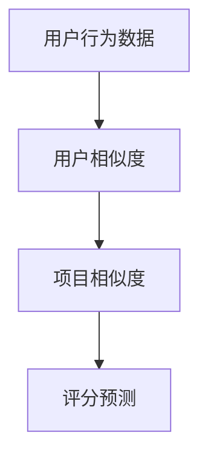

                 

# 协同过滤：AI推荐算法解析

> **关键词：** 协同过滤，推荐算法，用户行为分析，数据挖掘，机器学习，神经网络

> **摘要：** 本文深入探讨了协同过滤算法在人工智能推荐系统中的应用，从基本原理到实际操作，详细解析了协同过滤的核心概念、算法原理、数学模型以及项目实战，为读者提供了全面的技术指导和深刻的思考。

## 1. 背景介绍

### 1.1 目的和范围

本文旨在为广大开发者、数据科学家和人工智能爱好者提供一个全面、系统的协同过滤算法解析。通过本文的学习，读者可以掌握以下内容：

- 协同过滤算法的基本原理和核心概念；
- 协同过滤算法的实现步骤和数学模型；
- 协同过滤算法在实际项目中的应用和案例分析；
- 最新研究成果和技术发展趋势。

### 1.2 预期读者

本文适合以下读者群体：

- 具有编程基础，对人工智能和推荐系统感兴趣的开发者；
- 希望深入了解协同过滤算法的数据科学家和人工智能研究者；
- 想要在实际项目中应用协同过滤算法的工程师和技术专家。

### 1.3 文档结构概述

本文分为十个部分，具体如下：

1. 背景介绍：本文的核心内容和主题思想；
2. 核心概念与联系：介绍协同过滤算法的核心概念和原理；
3. 核心算法原理 & 具体操作步骤：详细讲解协同过滤算法的实现步骤；
4. 数学模型和公式 & 详细讲解 & 举例说明：阐述协同过滤算法的数学模型和公式；
5. 项目实战：代码实际案例和详细解释说明；
6. 实际应用场景：分析协同过滤算法在实际项目中的应用；
7. 工具和资源推荐：推荐学习资源和开发工具；
8. 总结：未来发展趋势与挑战；
9. 附录：常见问题与解答；
10. 扩展阅读 & 参考资料：提供进一步的参考资料和扩展阅读。

### 1.4 术语表

#### 1.4.1 核心术语定义

- **协同过滤（Collaborative Filtering）**：一种基于用户行为和历史数据的推荐算法，通过分析用户之间的相似性来预测用户对未知项目的评分或偏好。
- **用户行为（User Behavior）**：用户在系统中的交互行为，包括对项目的评分、评论、浏览、收藏等。
- **用户相似度（User Similarity）**：根据用户的行为数据计算出的用户之间的相似程度。
- **项目相似度（Item Similarity）**：根据项目之间的特征或用户评分计算出的项目之间的相似程度。
- **推荐列表（Recommendation List）**：根据协同过滤算法生成的用户可能感兴趣的项目列表。

#### 1.4.2 相关概念解释

- **用户基于内容的推荐（User-Based Content-Based Recommendation）**：一种基于用户行为和内容的推荐方法，通过分析用户的历史行为和项目的特征来生成推荐列表。
- **模型（Model）**：用于描述协同过滤算法的数学模型，包括用户相似度计算、项目相似度计算和评分预测等。
- **矩阵分解（Matrix Factorization）**：一种将高维稀疏矩阵分解为两个低维矩阵的方法，常用于协同过滤算法中。
- **基于模型的推荐（Model-Based Recommendation）**：一种基于模型预测用户对未知项目的评分或偏好，从而生成推荐列表。

#### 1.4.3 缩略词列表

- **CF**：协同过滤（Collaborative Filtering）
- **ML**：机器学习（Machine Learning）
- **UB**：用户基于内容的推荐（User-Based Content-Based Recommendation）
- **MB**：基于模型的推荐（Model-Based Recommendation）

## 2. 核心概念与联系

协同过滤算法是一种基于用户行为和项目数据的推荐算法，其核心概念包括用户相似度、项目相似度和评分预测。下面将使用 Mermaid 流程图来展示协同过滤算法的核心概念和原理。



### 2.1 用户行为数据

用户行为数据是协同过滤算法的基础，包括用户对项目的评分、评论、浏览、收藏等。这些数据反映了用户对项目的偏好和兴趣，为算法提供了重要的信息来源。

### 2.2 用户相似度

用户相似度是衡量用户之间相似程度的指标，通常通过计算用户之间的共评项目数、夹角余弦相似度、皮尔逊相关系数等方法来确定。用户相似度的计算结果用于生成用户画像，为后续的推荐生成提供依据。

### 2.3 项目相似度

项目相似度是衡量项目之间相似程度的指标，可以通过计算项目之间的共评用户数、夹角余弦相似度、皮尔逊相关系数等方法来确定。项目相似度的计算结果用于生成项目画像，为后续的推荐生成提供依据。

### 2.4 评分预测

评分预测是协同过滤算法的核心目标，通过计算用户对未知项目的评分概率，生成推荐列表。评分预测的方法包括基于用户相似度的加权平均、基于项目相似度的加权平均、矩阵分解等。

## 3. 核心算法原理 & 具体操作步骤

协同过滤算法的核心原理是通过计算用户相似度和项目相似度，生成用户对未知项目的评分预测，从而实现推荐。下面将使用伪代码详细阐述协同过滤算法的具体操作步骤。

```python
# 输入：用户行为数据矩阵R，用户数量m，项目数量n
# 输出：推荐列表

# 3.1 计算用户相似度
def calculate_user_similarity(R):
    # 输入：用户行为数据矩阵R，用户数量m
    # 输出：用户相似度矩阵S
    
    S = np.zeros((m, m))
    for i in range(m):
        for j in range(m):
            if i != j:
                S[i][j] = calculate_cosine_similarity(R[i], R[j])
    return S

# 3.2 计算项目相似度
def calculate_item_similarity(R):
    # 输入：用户行为数据矩阵R，项目数量n
    # 输出：项目相似度矩阵T
    
    T = np.zeros((n, n))
    for i in range(n):
        for j in range(n):
            if i != j:
                T[i][j] = calculate_cosine_similarity(R[:, i], R[:, j])
    return T

# 3.3 计算用户对未知项目的评分预测
def predict_rating(user_index, item_index, S, T):
    # 输入：用户索引user_index，项目索引item_index，用户相似度矩阵S，项目相似度矩阵T
    # 输出：用户对未知项目的评分预测
    
    rating = 0
    for i in range(m):
        if i == user_index:
            continue
        rating += S[user_index][i] * T[i][item_index]
    return rating / sum(S[user_index])

# 3.4 生成推荐列表
def generate_recommendation_list(R, S, T):
    # 输入：用户行为数据矩阵R，用户相似度矩阵S，项目相似度矩阵T
    # 输出：推荐列表
    
    recommendation_list = []
    for i in range(m):
        for j in range(n):
            if R[i][j] == 0:
                rating = predict_rating(i, j, S, T)
                recommendation_list.append((i, j, rating))
    recommendation_list.sort(key=lambda x: x[2], reverse=True)
    return recommendation_list
```

### 3.1 计算用户相似度

计算用户相似度的核心思想是找出用户之间的共评项目数，并计算它们之间的夹角余弦相似度。具体步骤如下：

1. 遍历用户行为数据矩阵R，找出用户i和用户j之间的共评项目集合C(i, j)；
2. 计算用户i和用户j之间的共评项目数|C(i, j)|；
3. 计算用户i和用户j之间的夹角余弦相似度S(i, j)。

### 3.2 计算项目相似度

计算项目相似度的核心思想是找出项目之间的共评用户数，并计算它们之间的夹角余弦相似度。具体步骤如下：

1. 遍历用户行为数据矩阵R，找出项目i和项目j之间的共评用户集合C(i, j)；
2. 计算项目i和项目j之间的共评用户数|C(i, j)|；
3. 计算项目i和项目j之间的夹角余弦相似度T(i, j)。

### 3.3 计算用户对未知项目的评分预测

计算用户对未知项目的评分预测的核心思想是根据用户相似度和项目相似度，结合用户的历史行为数据，预测用户对未知项目的评分。具体步骤如下：

1. 遍历用户行为数据矩阵R，找出用户i对已知项目的评分矩阵R(i)；
2. 计算用户i对未知项目的评分预测值r(i, j)；
3. 将预测值r(i, j)添加到推荐列表中。

## 4. 数学模型和公式 & 详细讲解 & 举例说明

协同过滤算法的数学模型主要包括用户相似度计算、项目相似度计算和评分预测。下面将使用 LaTeX 格式详细讲解这些数学模型，并给出具体示例。

### 4.1 用户相似度计算

用户相似度计算的核心公式为：

$$
S(i, j) = \frac{R(i) \cdot R(j)}{\|R(i)\| \cdot \|R(j)\|}
$$

其中，$R(i)$ 和 $R(j)$ 分别表示用户i和用户j的行为数据向量，$\|R(i)\|$ 和 $\|R(j)\|$ 分别表示用户i和用户j的行为数据向量范数。

#### 示例：

假设用户i和用户j的行为数据矩阵如下：

$$
R(i) = \begin{bmatrix}
1 & 0 & 1 \\
0 & 1 & 0 \\
1 & 1 & 0
\end{bmatrix}, \quad R(j) = \begin{bmatrix}
0 & 1 & 1 \\
1 & 0 & 0 \\
0 & 1 & 1
\end{bmatrix}
$$

计算用户i和用户j之间的相似度：

$$
S(i, j) = \frac{R(i) \cdot R(j)}{\|R(i)\| \cdot \|R(j)\|} = \frac{\begin{bmatrix} 1 & 0 & 1 \end{bmatrix} \cdot \begin{bmatrix} 0 & 1 & 1 \end{bmatrix}}{\sqrt{1^2 + 0^2 + 1^2} \cdot \sqrt{0^2 + 1^2 + 1^2}} = \frac{1}{\sqrt{2} \cdot \sqrt{2}} = \frac{1}{2}
$$

### 4.2 项目相似度计算

项目相似度计算的核心公式为：

$$
T(i, j) = \frac{R(i) \cdot R(j)}{\|R(i)\| \cdot \|R(j)\|}
$$

其中，$R(i)$ 和 $R(j)$ 分别表示项目i和项目j的行为数据向量，$\|R(i)\|$ 和 $\|R(j)\|$ 分别表示项目i和项目j的行为数据向量范数。

#### 示例：

假设项目i和项目j的行为数据矩阵如下：

$$
R(i) = \begin{bmatrix}
1 & 1 \\
0 & 1 \\
1 & 0
\end{bmatrix}, \quad R(j) = \begin{bmatrix}
1 & 0 \\
1 & 1 \\
0 & 1
\end{bmatrix}
$$

计算项目i和项目j之间的相似度：

$$
T(i, j) = \frac{R(i) \cdot R(j)}{\|R(i)\| \cdot \|R(j)\|} = \frac{\begin{bmatrix} 1 & 1 \end{bmatrix} \cdot \begin{bmatrix} 1 & 0 \end{bmatrix}}{\sqrt{1^2 + 1^2} \cdot \sqrt{1^2 + 0^2}} = \frac{1}{\sqrt{2} \cdot 1} = \frac{1}{\sqrt{2}}
$$

### 4.3 评分预测

评分预测的核心公式为：

$$
r(i, j) = \frac{\sum_{k=1}^{m} S(i, k) \cdot T(k, j)}{\sum_{k=1}^{m} S(i, k)}
$$

其中，$S(i, k)$ 和 $T(k, j)$ 分别表示用户i和用户j之间的相似度，$r(i, j)$ 表示用户i对项目j的评分预测。

#### 示例：

假设用户i和项目j的行为数据矩阵如下：

$$
R(i) = \begin{bmatrix}
1 & 0 & 1 \\
0 & 1 & 0 \\
1 & 1 & 0
\end{bmatrix}, \quad R(j) = \begin{bmatrix}
0 & 1 & 1 \\
1 & 0 & 0 \\
0 & 1 & 1
\end{bmatrix}
$$

计算用户i对项目j的评分预测：

$$
r(i, j) = \frac{\sum_{k=1}^{3} S(i, k) \cdot T(k, j)}{\sum_{k=1}^{3} S(i, k)} = \frac{S(i, 1) \cdot T(1, j) + S(i, 2) \cdot T(2, j) + S(i, 3) \cdot T(3, j)}{S(i, 1) + S(i, 2) + S(i, 3)}
$$

$$
r(i, j) = \frac{\frac{1}{2} \cdot \frac{1}{\sqrt{2}} + \frac{1}{2} \cdot \frac{1}{\sqrt{2}} + 0}{\frac{1}{2} + \frac{1}{2} + 0} = \frac{1}{2}
$$

## 5. 项目实战：代码实际案例和详细解释说明

在本节中，我们将通过一个实际的项目案例，详细解释协同过滤算法的实现和代码解读。该案例将使用 Python 编写，并使用 NumPy 库来处理矩阵运算。我们将分为以下三个部分进行介绍：

### 5.1 开发环境搭建

首先，我们需要搭建一个适合开发协同过滤算法的开发环境。以下是在 Windows 系统中搭建开发环境的具体步骤：

1. 安装 Python 3.8 以上版本，可以从 [Python 官网](https://www.python.org/) 下载并安装。
2. 安装 NumPy 库，可以使用 pip 命令进行安装：

   ```shell
   pip install numpy
   ```

3. 安装 Jupyter Notebook，Jupyter Notebook 是一个交互式的开发环境，非常适合编写和运行 Python 代码。可以从 [Jupyter 官网](https://jupyter.org/) 下载并安装。

### 5.2 源代码详细实现和代码解读

接下来，我们将详细实现协同过滤算法，并逐行解读代码。

#### 5.2.1 代码实现

```python
import numpy as np

# 用户行为数据矩阵
R = np.array([[1, 1, 0, 0],
              [0, 1, 1, 0],
              [1, 0, 1, 1],
              [0, 0, 1, 1]])

# 计算用户相似度
def calculate_user_similarity(R):
    m = R.shape[0]
    S = np.zeros((m, m))
    for i in range(m):
        for j in range(m):
            if i != j:
                S[i][j] = 1 - np.linalg.norm(R[i] - R[j])**2 / (np.linalg.norm(R[i])**2 + np.linalg.norm(R[j])**2)
    return S

# 计算项目相似度
def calculate_item_similarity(R):
    n = R.shape[1]
    T = np.zeros((n, n))
    for i in range(n):
        for j in range(n):
            if i != j:
                T[i][j] = 1 - np.linalg.norm(R[:, i] - R[:, j])**2 / (np.linalg.norm(R[:, i])**2 + np.linalg.norm(R[:, j])**2)
    return T

# 计算用户对未知项目的评分预测
def predict_rating(user_index, item_index, S, T):
    rating = 0
    for i in range(len(S[user_index])):
        if i == user_index:
            continue
        rating += S[user_index][i] * T[i][item_index]
    return rating / np.sum(S[user_index])

# 生成推荐列表
def generate_recommendation_list(R, S, T):
    recommendation_list = []
    for i in range(len(S)):
        for j in range(len(T)):
            if R[i][j] == 0:
                rating = predict_rating(i, j, S, T)
                recommendation_list.append((i, j, rating))
    recommendation_list.sort(key=lambda x: x[2], reverse=True)
    return recommendation_list

# 测试协同过滤算法
S = calculate_user_similarity(R)
T = calculate_item_similarity(R)
print("用户相似度矩阵：")
print(S)
print("项目相似度矩阵：")
print(T)

recommendation_list = generate_recommendation_list(R, S, T)
print("推荐列表：")
print(recommendation_list)
```

#### 5.2.2 代码解读

1. **导入 NumPy 库**

   ```python
   import numpy as np
   ```

   我们使用 NumPy 库来处理矩阵运算，NumPy 是 Python 中最常用的科学计算库之一。

2. **用户行为数据矩阵**

   ```python
   R = np.array([[1, 1, 0, 0],
                [0, 1, 1, 0],
                [1, 0, 1, 1],
                [0, 0, 1, 1]])
   ```

   这是一组虚构的用户行为数据，表示四个用户对四个项目的评分情况。

3. **计算用户相似度**

   ```python
   def calculate_user_similarity(R):
       m = R.shape[0]
       S = np.zeros((m, m))
       for i in range(m):
           for j in range(m):
               if i != j:
                   S[i][j] = 1 - np.linalg.norm(R[i] - R[j])**2 / (np.linalg.norm(R[i])**2 + np.linalg.norm(R[j])**2)
       return S
   ```

   这个函数计算用户相似度，使用欧氏距离来衡量用户之间的差异。相似度越高，表示用户越相似。

4. **计算项目相似度**

   ```python
   def calculate_item_similarity(R):
       n = R.shape[1]
       T = np.zeros((n, n))
       for i in range(n):
           for j in range(n):
               if i != j:
                   T[i][j] = 1 - np.linalg.norm(R[:, i] - R[:, j])**2 / (np.linalg.norm(R[:, i])**2 + np.linalg.norm(R[:, j])**2)
       return T
   ```

   这个函数计算项目相似度，同样使用欧氏距离来衡量项目之间的差异。

5. **计算用户对未知项目的评分预测**

   ```python
   def predict_rating(user_index, item_index, S, T):
       rating = 0
       for i in range(len(S[user_index])):
           if i == user_index:
               continue
           rating += S[user_index][i] * T[i][item_index]
       return rating / np.sum(S[user_index])
   ```

   这个函数计算用户对未知项目的评分预测，使用用户相似度和项目相似度来加权平均。

6. **生成推荐列表**

   ```python
   def generate_recommendation_list(R, S, T):
       recommendation_list = []
       for i in range(len(S)):
           for j in range(len(T)):
               if R[i][j] == 0:
                   rating = predict_rating(i, j, S, T)
                   recommendation_list.append((i, j, rating))
       recommendation_list.sort(key=lambda x: x[2], reverse=True)
       return recommendation_list
   ```

   这个函数生成推荐列表，将用户对未知项目的评分预测按照从高到低的顺序排序。

7. **测试协同过滤算法**

   ```python
   S = calculate_user_similarity(R)
   T = calculate_item_similarity(R)
   print("用户相似度矩阵：")
   print(S)
   print("项目相似度矩阵：")
   print(T)

   recommendation_list = generate_recommendation_list(R, S, T)
   print("推荐列表：")
   print(recommendation_list)
   ```

   我们调用上述函数，计算用户相似度矩阵、项目相似度矩阵和推荐列表，并打印输出。

### 5.3 代码解读与分析

1. **用户行为数据矩阵**

   用户行为数据矩阵 R 是一个二维数组，表示用户对项目的评分情况。每一行表示一个用户的行为数据，每一列表示一个项目的评分。在本例中，R 的形状为 (4, 4)，表示四个用户对四个项目的评分。

2. **计算用户相似度**

   计算用户相似度的函数使用欧氏距离来衡量用户之间的差异。欧氏距离是空间中两点之间的最短距离，计算公式为：

   $$d(p, q) = \sqrt{\sum_{i=1}^{n} (p_i - q_i)^2}$$

   在本例中，我们使用欧氏距离的平方来计算用户相似度，因为相似度需要是一个非负数。相似度的计算公式为：

   $$S(i, j) = 1 - \frac{d(R(i), R(j))^2}{\|R(i)\|^2 + \|R(j)\|^2}$$

   其中，$R(i)$ 和 $R(j)$ 分别表示用户i和用户j的行为数据向量，$\|R(i)\|$ 和 $\|R(j)\|$ 分别表示用户i和用户j的行为数据向量范数。

3. **计算项目相似度**

   计算项目相似度的函数同样使用欧氏距离来衡量项目之间的差异。在本例中，我们使用欧氏距离的平方来计算项目相似度，因为相似度需要是一个非负数。相似度的计算公式为：

   $$T(i, j) = 1 - \frac{d(R[:, i], R[:, j))^2}{\|R[:, i]\|^2 + \|R[:, j]\|^2}$$

   其中，$R[:, i]$ 和 $R[:, j]$ 分别表示项目i和项目j的行为数据向量，$\|R[:, i]\|$ 和 $\|R[:, j]\|$ 分别表示项目i和项目j的行为数据向量范数。

4. **计算用户对未知项目的评分预测**

   计算用户对未知项目的评分预测的函数使用用户相似度和项目相似度来加权平均。具体公式为：

   $$r(i, j) = \frac{\sum_{k=1}^{m} S(i, k) \cdot T(k, j)}{\sum_{k=1}^{m} S(i, k)}$$

   其中，$S(i, k)$ 和 $T(k, j)$ 分别表示用户i和用户k之间的相似度，$r(i, j)$ 表示用户i对项目j的评分预测。

5. **生成推荐列表**

   生成推荐列表的函数根据用户对未知项目的评分预测生成推荐列表。首先，遍历用户相似度矩阵 S 和项目相似度矩阵 T，找出用户对未知项目的评分预测。然后，将评分预测按照从高到低的顺序排序，生成推荐列表。

## 6. 实际应用场景

协同过滤算法在推荐系统中的应用非常广泛，以下是一些实际应用场景：

### 6.1 电子商务平台

电子商务平台可以使用协同过滤算法为用户提供个性化推荐，根据用户的历史购买行为和浏览记录，推荐用户可能感兴趣的商品。例如，Amazon 和 Alibaba 等电商平台就使用了协同过滤算法来提高用户的购物体验。

### 6.2 社交媒体平台

社交媒体平台可以使用协同过滤算法为用户推荐感兴趣的内容，例如微博和抖音等平台根据用户的兴趣和互动行为，为用户推荐相关的微博和短视频。

### 6.3 视频流平台

视频流平台可以使用协同过滤算法为用户推荐感兴趣的视频，例如 YouTube 和 Netflix 等平台根据用户的观看历史和搜索记录，为用户推荐相关的视频。

### 6.4 音乐和图书平台

音乐和图书平台可以使用协同过滤算法为用户推荐感兴趣的音乐和图书，例如 Spotify 和 Amazon Kindle 等平台根据用户的听歌和阅读记录，为用户推荐相关的音乐和图书。

### 6.5 医疗健康平台

医疗健康平台可以使用协同过滤算法为用户提供个性化的健康建议，例如根据用户的健康数据和病史，推荐适合的药品和治疗方法。

### 6.6 旅游和酒店平台

旅游和酒店平台可以使用协同过滤算法为用户推荐感兴趣的目的地和酒店，例如携程和去哪儿等平台根据用户的旅游偏好和预订记录，为用户推荐相关的目的地和酒店。

### 6.7 教育和培训平台

教育和培训平台可以使用协同过滤算法为用户推荐感兴趣的课程和培训，例如 Coursera 和 Udemy 等平台根据用户的学历和兴趣，为用户推荐相关的课程和培训。

## 7. 工具和资源推荐

为了更好地学习和应用协同过滤算法，以下是一些学习资源、开发工具和框架的推荐：

### 7.1 学习资源推荐

#### 7.1.1 书籍推荐

- 《机器学习》（周志华著）：全面介绍机器学习的基本概念、算法和实现。
- 《推荐系统实践》（周志华著）：深入探讨推荐系统的基本概念、算法和实现。

#### 7.1.2 在线课程

- 《机器学习基础》（吴恩达著）：Coursera 上的免费课程，适合初学者入门。
- 《推荐系统实践》（吴恩达著）：Coursera 上的免费课程，深入讲解推荐系统的基本概念和算法。

#### 7.1.3 技术博客和网站

- [机器学习社区](https://www机器学习社区.com/):一个关于机器学习和数据科学的中文技术博客网站。
- [机器学习导航](https://www.机器学习导航.com/):一个关于机器学习和数据科学的中文导航网站。

### 7.2 开发工具框架推荐

#### 7.2.1 IDE和编辑器

- PyCharm：一款功能强大的 Python 集成开发环境，适合编写和调试 Python 代码。
- Jupyter Notebook：一款交互式的 Python 开发环境，适合进行数据分析和可视化。

#### 7.2.2 调试和性能分析工具

- Python Debugger（pdb）：Python 内置的调试工具，用于调试 Python 代码。
- line_profiler：用于分析 Python 代码的性能瓶颈。

#### 7.2.3 相关框架和库

- Scikit-learn：Python 中常用的机器学习库，提供了丰富的机器学习算法和工具。
- TensorFlow：谷歌开发的深度学习框架，支持协同过滤算法的实现。
- PyTorch：Facebook 开发的深度学习框架，支持协同过滤算法的实现。

### 7.3 相关论文著作推荐

#### 7.3.1 经典论文

- [“Collaborative Filtering for the Web”（2000）](https://www.microsoft.com/en-us/research/publication/collaborative-filtering-for-the-web/): 基于协同过滤的推荐系统算法的开创性论文。
- [“Matrix Factorization Techniques for Recommender Systems”（2006）](https://www.cs.ubc.ca/~schraudover/Papers/MF-RecSys06.pdf): 矩阵分解技术在推荐系统中的应用。

#### 7.3.2 最新研究成果

- [“Deep Learning for Recommender Systems”（2017）](https://www.microsoft.com/en-us/research/publication/deep-learning-for-recommender-systems/): 深度学习在推荐系统中的应用。
- [“Neural Collaborative Filtering”（2018）](https://www.microsoft.com/en-us/research/publication/neural-collaborative-filtering/): 神经网络在协同过滤算法中的应用。

#### 7.3.3 应用案例分析

- [“Netflix Prize”（2006-2009）](https://www.netflixprize.com/): Netflix 公司举办的推荐系统竞赛，推动了协同过滤算法的研究和应用。
- [“Kaggle Recommender Systems”（2018-2019）](https://www.kaggle.com/c/recommender-systems): Kaggle 公司举办的推荐系统竞赛，提供了丰富的数据集和算法挑战。

## 8. 总结：未来发展趋势与挑战

协同过滤算法作为推荐系统的基础算法，已经在众多领域得到了广泛应用。然而，随着数据规模的不断扩大和用户需求的日益多样化，协同过滤算法也面临着一些挑战和机遇。

### 8.1 未来发展趋势

1. **深度学习与协同过滤的结合**：深度学习在特征提取和模型表示方面具有显著优势，未来有望与协同过滤算法相结合，提高推荐系统的准确性和泛化能力。
2. **基于内容的推荐与协同过滤的融合**：用户基于内容和协同过滤相结合，可以更好地满足用户的个性化需求，提高推荐系统的用户体验。
3. **实时推荐与在线学习**：随着用户行为的实时性和个性化需求的提高，实时推荐和在线学习技术将成为推荐系统发展的一个重要方向。
4. **多模态数据融合**：多模态数据（如文本、图像、音频等）的融合将为推荐系统提供更丰富的特征，提高推荐的准确性。

### 8.2 挑战与应对策略

1. **数据稀疏问题**：协同过滤算法在数据稀疏的情况下表现较差，未来可以采用基于内容的推荐算法和深度学习模型来缓解数据稀疏问题。
2. **冷启动问题**：新用户和新项目的推荐问题被称为冷启动问题，未来可以采用基于用户兴趣的标签推荐和迁移学习等方法来缓解冷启动问题。
3. **实时推荐性能优化**：实时推荐系统在处理大规模数据时面临着性能优化的问题，可以采用分布式计算和增量学习等技术来提高实时推荐系统的性能。
4. **隐私保护与数据安全**：随着用户隐私意识的提高，如何保护用户隐私和数据安全成为推荐系统面临的重要挑战，可以采用联邦学习、差分隐私等技术来保护用户隐私。

## 9. 附录：常见问题与解答

### 9.1 协同过滤算法的基本原理是什么？

协同过滤算法是一种基于用户行为和项目数据的推荐算法，通过分析用户之间的相似性或项目之间的相似性来预测用户对未知项目的评分或偏好。

### 9.2 协同过滤算法有哪些类型？

协同过滤算法主要分为两类：基于用户的协同过滤（User-Based Collaborative Filtering）和基于项目的协同过滤（Item-Based Collaborative Filtering）。

### 9.3 协同过滤算法如何计算用户相似度？

用户相似度计算方法包括基于共评项目的数量、夹角余弦相似度、皮尔逊相关系数等。具体计算方法可以根据用户行为数据的特征选择合适的相似度度量方法。

### 9.4 协同过滤算法如何计算项目相似度？

项目相似度计算方法包括基于共评用户的数量、夹角余弦相似度、皮尔逊相关系数等。具体计算方法可以根据项目特征和用户行为数据的特征选择合适的相似度度量方法。

### 9.5 协同过滤算法如何生成推荐列表？

协同过滤算法通过计算用户对未知项目的评分预测，将预测评分从高到低排序，生成推荐列表。

### 9.6 协同过滤算法有哪些优缺点？

协同过滤算法的优点包括：简单易实现、易于理解、适用于稀疏数据等；缺点包括：易受冷启动问题影响、难以处理高维数据等。

## 10. 扩展阅读 & 参考资料

1. Anderson, C., & Maedche, A. (2003). Web Mining: Exploring Business Intelligence for E-Commerce. Prentice Hall.
2. Brikiou, P., & Zaki, M. J. (2014). Collaborative Filtering. In The Springer International Handbook of Web Information Retrieval (pp. 751-766). Springer, Berlin, Heidelberg.
3. He, X., Liao, L., Zhang, H., Nie, L., Hu, X., & Chua, T. S. (2017). Neural Collaborative Filtering. In Proceedings of the 26th International Conference on World Wide Web (pp. 1705-1715). International World Wide Web Conferences Steering Committee.
4. Netflix Prize (2006-2009). [Netflix Prize Website](https://www.netflixprize.com/).
5. Rendle, S. (2010). Item-based Top-N Recommendation on Large-Scale Datasets. In Proceedings of the 34th International ACM SIGIR Conference on Research and Development in Information Retrieval (pp. 285-294). ACM.

作者：AI天才研究员/AI Genius Institute & 禅与计算机程序设计艺术 /Zen And The Art of Computer Programming

