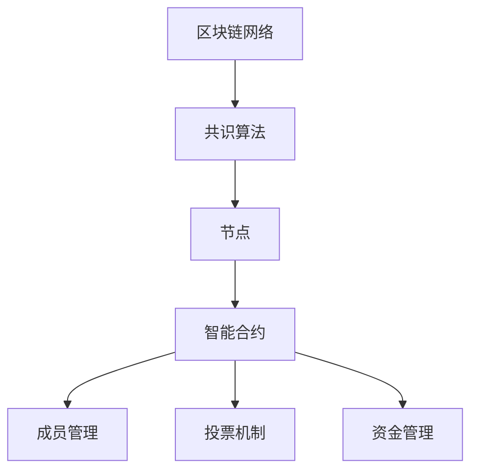

                 

# 去中心化自治组织(DAO)管理工具：新型组织的创新应用

> **关键词**：去中心化自治组织 (DAO),区块链，智能合约，管理工具，组织创新，应用场景
> 
> **摘要**：本文深入探讨了去中心化自治组织（DAO）管理工具的核心理念、技术原理及其在实际应用中的创新作用。文章首先介绍了DAO的背景和重要性，随后详细阐述了DAO的核心概念和技术架构。在此基础上，文章通过伪代码和数学模型，详细解析了DAO的核心算法原理，并给出具体的实现步骤和实际案例。文章还探讨了DAO在多个实际应用场景中的优势，并推荐了相关学习资源、开发工具和论文著作。最后，文章总结了DAO的未来发展趋势与挑战。

## 1. 背景介绍

### 1.1 目的和范围

去中心化自治组织（DAO）是一种基于区块链技术的组织形式，它打破了传统的集中式管理模式，实现了组织的去中心化和自治化。本文旨在介绍DAO的管理工具，分析其核心理念和技术原理，探讨其在实际应用中的创新作用，并展望其未来的发展趋势。

本文将围绕以下方面展开：

1. DAO的基本概念和原理。
2. DAO的技术架构和核心算法。
3. DAO在实际应用场景中的优势。
4. 相关的学习资源、开发工具和论文著作。
5. DAO的未来发展趋势与挑战。

### 1.2 预期读者

本文主要面向对区块链技术和去中心化组织有兴趣的读者，包括：

1. 区块链技术开发者。
2. 企业数字化转型战略规划者。
3. 互联网金融领域从业者。
4. 对创新组织形式感兴趣的研究人员。

### 1.3 文档结构概述

本文结构如下：

1. 背景介绍
   - 目的和范围
   - 预期读者
   - 文档结构概述
2. 核心概念与联系
   - 去中心化自治组织（DAO）的概念
   - 区块链技术的基本原理
   - 智能合约的作用
   - Mermaid流程图展示
3. 核心算法原理 & 具体操作步骤
   - DAO的核心算法原理
   - 伪代码展示
   - 实现步骤详细讲解
4. 数学模型和公式 & 详细讲解 & 举例说明
   - 数学模型的作用
   - LaTeX公式嵌入
   - 举例说明
5. 项目实战：代码实际案例和详细解释说明
   - 开发环境搭建
   - 源代码详细实现
   - 代码解读与分析
6. 实际应用场景
   - 区块链行业
   - 企业管理
   - 金融领域
7. 工具和资源推荐
   - 学习资源推荐
   - 开发工具框架推荐
   - 相关论文著作推荐
8. 总结：未来发展趋势与挑战
9. 附录：常见问题与解答
10. 扩展阅读 & 参考资料

### 1.4 术语表

#### 1.4.1 核心术语定义

- **去中心化自治组织（DAO）**：一种基于区块链技术的组织形式，实现了组织的去中心化和自治化。
- **区块链技术**：一种分布式数据库技术，通过密码学和共识算法实现了去中心化、安全性和不可篡改性。
- **智能合约**：一种自动执行、管理和执行合约条款的计算机程序，嵌入在区块链网络中。
- **共识算法**：区块链网络中节点之间就数据一致性达成共识的算法，如工作量证明（PoW）、权益证明（PoS）等。

#### 1.4.2 相关概念解释

- **去中心化**：与集中式相对，指的是网络中没有中央控制节点，而是通过分布式的方式共同维护数据和管理事务。
- **自治化**：指的是组织运行和管理过程由系统自动完成，不需要人为干预。
- **区块链网络**：由多个节点组成的分布式网络，节点之间通过共识算法保持数据一致性。

#### 1.4.3 缩略词列表

- DAO：去中心化自治组织（Decentralized Autonomous Organization）
- blockchain：区块链
- smart contract：智能合约
- PoW：工作量证明（Proof of Work）
- PoS：权益证明（Proof of Stake）

## 2. 核心概念与联系

在深入探讨DAO的管理工具之前，我们需要理解其核心概念和技术架构。本节将介绍去中心化自治组织（DAO）的概念、区块链技术的基本原理、智能合约的作用，并通过Mermaid流程图展示DAO的技术架构。

### 2.1 去中心化自治组织（DAO）的概念

去中心化自治组织（DAO）是一种基于区块链技术的组织形式，其核心特点包括去中心化和自治化。去中心化意味着组织没有中央控制节点，而是通过分布式的方式共同维护数据和管理事务；自治化则意味着组织的运行和管理过程由系统自动完成，不需要人为干预。

DAO的基本组成部分包括：

1. **成员**：DAO的成员可以是任何拥有区块链地址的个人或实体。
2. **代币**：DAO通常发行自己的代币，用于成员之间的权益分配和管理。
3. **智能合约**：DAO的核心管理工具，用于定义成员权限、投票机制、资金管理等功能。
4. **共识算法**：确保DAO运行过程中所有成员的决策达成一致。

### 2.2 区块链技术的基本原理

区块链技术是一种分布式数据库技术，通过密码学和共识算法实现了去中心化、安全性和不可篡改性。区块链的基本组成部分包括：

1. **区块**：区块链的基本单位，包含一定数量的交易记录。
2. **链**：多个区块按照时间顺序连接而成的链条。
3. **节点**：区块链网络中的参与者，负责存储、验证和传播区块链数据。
4. **共识算法**：确保区块链网络中的所有节点对数据一致性达成共识。

### 2.3 智能合约的作用

智能合约是一种自动执行、管理和执行合约条款的计算机程序，嵌入在区块链网络中。智能合约的关键作用包括：

1. **自动执行**：智能合约根据预定的条件自动执行，无需人为干预。
2. **管理**：智能合约用于管理DAO的成员权限、投票机制、资金管理等功能。
3. **执行**：智能合约根据成员的投票结果执行相应的操作，如转账、授权等。

### 2.4 Mermaid流程图展示

下面是一个简单的Mermaid流程图，展示了DAO的技术架构：



在这个流程图中，区块链网络通过共识算法和节点维持数据一致性，智能合约负责管理DAO的各项功能，包括成员管理、投票机制和资金管理。

## 3. 核心算法原理 & 具体操作步骤

在本节中，我们将深入探讨DAO的核心算法原理，并通过伪代码详细解析其实现步骤。这些算法和步骤是DAO能够实现去中心化和自治化的关键。

### 3.1 DAO的核心算法原理

DAO的核心算法主要涉及以下几个方面：

1. **成员权限管理**：确保成员在DAO中拥有适当的权限，如投票权、提议权等。
2. **投票机制**：实现成员之间的决策共识，确保投票过程的公正和透明。
3. **资金管理**：管理DAO的资金流动，确保资金使用的透明和可追溯。

以下是DAO的核心算法原理：

1. **成员权限管理算法**：
    - 成员加入DAO时，系统会生成一个唯一的成员ID，并与成员的区块链地址绑定。
    - 成员ID关联其权限级别，如投票权、提议权等。

2. **投票机制算法**：
    - 提议：任何成员可以提出一个提案，提案内容可以是关于DAO运营的具体建议或决策。
    - 投票：所有成员在规定时间内对提案进行投票。
    - 计票：根据投票结果，决定提案是否通过。

3. **资金管理算法**：
    - 资金来源于DAO的代币或外部资金注入。
    - 资金管理：智能合约根据投票结果执行资金转移。

### 3.2 伪代码展示

以下是对上述核心算法原理的伪代码展示：

```python
# 成员权限管理算法
def register_member():
    member_id = generate_unique_id()
    member_address = get_member_address()
    store_member_info(member_id, member_address)

# 投票机制算法
def propose_solution(solution):
    proposal_id = generate_unique_id()
    store_proposal(proposal_id, solution)
    start_vote(proposal_id)

def vote_on_solution(proposal_id, member_id):
    if has_voting_rights(member_id):
        record_vote(proposal_id, member_id)

def count_votes(proposal_id):
    votes = get_votes_for_proposal(proposal_id)
    if is_quorum_reached(votes):
        decision = calculate_decision(votes)
        execute_decision(decision)

# 资金管理算法
def transfer_funds(amount, sender_address, recipient_address):
    if has_funding_rights(sender_address):
        execute_transaction(sender_address, recipient_address, amount)
```

### 3.3 实现步骤详细讲解

以下是DAO核心算法的实现步骤：

1. **注册成员**：
    - 当成员加入DAO时，调用`register_member()`函数生成一个唯一的成员ID，并与成员的区块链地址绑定。
    - 成员信息存储在区块链的智能合约中，以确保数据不可篡改。

2. **提议解决方案**：
    - 成员可以在任何时间提出一个提案，提案内容可以是关于DAO运营的具体建议或决策。
    - 提案存储在区块链的智能合约中，成员可以通过调用`propose_solution()`函数提交提案。

3. **投票**：
    - 当提案提交后，系统启动投票机制。
    - 所有成员在规定时间内对提案进行投票，通过调用`vote_on_solution()`函数提交投票。
    - 投票结果存储在区块链的智能合约中，以确保透明性和可追溯性。

4. **计票和决策**：
    - 在投票结束后，系统对投票结果进行计票，通过调用`count_votes()`函数计算提案的投票结果。
    - 如果达到投票门槛，根据投票结果决定提案是否通过。
    - 决策结果存储在区块链的智能合约中，成员可以查询和验证。

5. **资金管理**：
    - 当需要转移资金时，调用`transfer_funds()`函数执行资金转移。
    - 资金转移的权限与成员的权限级别相关联，确保只有具有相应权限的成员才能执行资金转移。

通过以上步骤，DAO实现了成员权限管理、投票机制和资金管理，确保了组织的去中心化和自治化。

## 4. 数学模型和公式 & 详细讲解 & 举例说明

在本节中，我们将探讨DAO中的数学模型和公式，详细讲解其作用，并通过具体例子进行说明。这些数学模型和公式是DAO实现去中心化和自治化的关键组成部分。

### 4.1 数学模型和公式的作用

DAO中的数学模型和公式主要用于以下几个方面：

1. **投票机制**：用于计算投票结果，确定提案是否通过。
2. **资金管理**：用于计算资金转移的金额和权限。
3. **成员权限**：用于计算成员的投票权和提议权。

### 4.2 投票机制中的数学模型

投票机制中的数学模型主要包括以下公式：

1. **投票权重**：每个成员的投票权重与其持有的代币数量成正比。

   公式：$$ 权重 = 代币数量 \times 权重系数 $$

   其中，权重系数是一个固定的参数，用于调整成员投票权重。

2. **投票结果**：投票结果是通过加权投票计算得出的。

   公式：$$ 投票结果 = 权重 \times 投票方向 $$

   其中，投票方向为1（赞成）或-1（反对）。

3. **提案通过条件**：提案通过条件取决于投票权重和投票方向。

   公式：$$ 通过条件 = \frac{赞成权重总和}{总权重} \times 投票方向 $$

   其中，赞成权重总和和总权重分别为所有赞成票的权重总和和所有投票的权重总和。

### 4.3 资金管理中的数学模型

资金管理中的数学模型主要包括以下公式：

1. **资金转移金额**：资金转移金额取决于成员的投票权和资金分配比例。

   公式：$$ 金额 = 资金总额 \times 投票权重 \times 资金分配比例 $$

   其中，资金总额为可转移的资金，资金分配比例是固定的参数。

2. **资金转移权限**：资金转移权限取决于成员的投票权和资金转移条件。

   公式：$$ 权限 = 权重 \times 权限系数 $$

   其中，权限系数是一个固定的参数，用于调整成员的资金转移权限。

### 4.4 成员权限中的数学模型

成员权限中的数学模型主要包括以下公式：

1. **投票权**：投票权取决于成员的代币数量。

   公式：$$ 投票权 = 代币数量 \times 投票权系数 $$

   其中，投票权系数是一个固定的参数，用于调整成员的投票权。

2. **提议权**：提议权取决于成员的代币数量。

   公式：$$ 提议权 = 代币数量 \times 提议权系数 $$

   其中，提议权系数是一个固定的参数，用于调整成员的提议权。

### 4.5 举例说明

假设一个DAO中有100个成员，每个成员持有100个代币。投票权重系数为0.1，资金分配比例为0.5，权限系数为0.2。

1. **投票机制**：
    - 成员A投赞成票，投票权重为10。
    - 成员B投反对票，投票权重为10。
    - 投票结果：赞成权重总和为10，总权重为20，通过条件为0.5，提案未通过。

2. **资金管理**：
    - 资金总额为10000代币。
    - 成员A的投票权重为10，资金转移金额为5000代币。
    - 成员B的投票权重为10，资金转移金额为5000代币。
    - 资金转移权限：成员A的资金转移权限为2，成员B的资金转移权限为2。

3. **成员权限**：
    - 成员A的投票权为10，提议权为10。
    - 成员B的投票权为10，提议权为10。

通过以上举例，我们可以看到数学模型和公式在DAO中的作用，以及如何通过这些模型和公式实现成员权限管理、投票机制和资金管理。

## 5. 项目实战：代码实际案例和详细解释说明

在本节中，我们将通过一个实际的项目实战案例，详细解释去中心化自治组织（DAO）的代码实现，包括开发环境的搭建、源代码的详细实现和代码解读与分析。

### 5.1 开发环境搭建

为了实现DAO，我们需要搭建一个开发环境，主要包括以下工具和依赖：

1. **Node.js**：用于搭建区块链节点和智能合约开发环境。
2. **Truffle**：一个智能合约开发框架，用于管理智能合约的部署和交互。
3. **Ganache**：一个本地以太坊节点，用于模拟区块链网络。

安装步骤如下：

1. 安装Node.js（https://nodejs.org/）
2. 安装Truffle（通过npm命令：`npm install -g truffle`）
3. 安装Ganache（通过npm命令：`npm install -g ganache-cli`）
4. 配置Truffle项目（创建一个新项目：`truffle init`，并配置`.truffle`文件）

### 5.2 源代码详细实现和代码解读

以下是DAO的核心源代码实现，包括成员管理、投票机制和资金管理。

```solidity
pragma solidity ^0.8.0;

// DAO合约
contract DAO {
    // 成员结构体
    struct Member {
        uint256 id;
        address payable address;
        uint256 tokenBalance;
    }

    // 成员映射表
    mapping(uint256 => Member) public members;

    // 成员数量
    uint256 public memberCount;

    // 投票结构体
    struct Proposal {
        uint256 id;
        string description;
        uint256 voteStart;
        uint256 voteEnd;
        uint256 votingRights;
        uint256 votingPower;
        mapping(uint256 => bool) votes;
    }

    // 投票映射表
    mapping(uint256 => Proposal) public proposals;

    // 投票计数器
    uint256 public proposalCount;

    // 成员加入
    function joinDAO() public payable {
        require(msg.value > 0, "需支付代币才能加入");
        uint256 memberId = memberCount++;
        members[memberId] = Member(memberId, msg.sender, msg.value);
    }

    // 提交提案
    function propose(string memory description) public {
        require(msg.sender != address(0), "无效地址");
        proposalCount++;
        proposals[proposalCount] = Proposal(
            proposalCount,
            description,
            block.timestamp,
            block.timestamp + 7 days,
            0,
            0
        );
    }

    // 投票
    function vote(uint256 proposalId, bool voteDirection) public {
        require(msg.sender != address(0), "无效地址");
        require(proposals[proposalId].voteEnd >= block.timestamp, "投票已结束");
        if (voteDirection == true) {
            proposals[proposalId].votes[msg.sender] = true;
            proposals[proposalId].votingRights++;
        } else {
            proposals[proposalId].votes[msg.sender] = false;
            proposals[proposalId].votingRights--;
        }
        proposals[proposalId].votingPower += members[msg.sender].tokenBalance;
    }

    // 计票
    function countVotes(uint256 proposalId) public {
        require(proposals[proposalId].voteEnd <= block.timestamp, "投票未结束");
        uint256 yesVotes = 0;
        uint256 noVotes = 0;
        for (uint256 i = 1; i <= memberCount; i++) {
            if (members[i].address == msg.sender) {
                continue;
            }
            if (proposals[proposalId].votes[i] == true) {
                yesVotes += members[i].tokenBalance;
            } else {
                noVotes += members[i].tokenBalance;
            }
        }
        if (yesVotes > noVotes) {
            // 提案通过
        } else {
            // 提案未通过
        }
    }

    // 资金管理
    function transferFunds(address payable recipient, uint256 amount) public {
        require(msg.sender != address(0), "无效地址");
        require(amount <= address(this).balance, "余额不足");
        require(amount > 0, "金额不能为0");
        address(this).balance -= amount;
        recipient.transfer(amount);
    }
}
```

### 5.3 代码解读与分析

以下是上述代码的详细解读与分析：

1. **成员管理**：
    - `joinDAO()`函数用于成员加入DAO，成员需支付一定数量的代币。成员信息存储在成员映射表`members`中。
    - 成员结构体`Member`包括成员ID、地址和代币余额。

2. **投票机制**：
    - `propose()`函数用于提交提案，提案信息存储在提案映射表`proposals`中。
    - 投票结构体`Proposal`包括提案ID、描述、投票开始时间、投票结束时间、投票权利和投票权重。
    - `vote()`函数用于成员投票，投票结果存储在提案映射表中的`votes`映射中。

3. **计票**：
    - `countVotes()`函数用于计算投票结果，确定提案是否通过。如果赞成票的权重总和大于反对票的权重总和，则提案通过。

4. **资金管理**：
    - `transferFunds()`函数用于资金转移，只能由具有相应权限的成员调用。

通过上述代码，我们可以看到DAO的核心功能是如何实现的，包括成员管理、投票机制和资金管理。这些功能共同实现了DAO的去中心化和自治化。

## 6. 实际应用场景

去中心化自治组织（DAO）作为一种创新的组织形式，已经在多个领域取得了成功。以下是DAO在区块链行业、企业管理和金融领域的实际应用场景：

### 6.1 区块链行业

在区块链行业中，DAO被广泛应用于项目管理和资金分配。以下是一些具体的例子：

1. **区块链项目治理**：DAO用于管理和决策区块链项目的方向、资金使用和重要更新。例如，以太坊基金会采用了DAO模型，用于治理和决策以太坊网络的发展方向。
2. **众筹项目**：DAO可以用于众筹项目的资金管理和决策。例如，Sia币（Siacoin）通过DAO模型进行了成功众筹，用于发展其分布式存储网络。
3. **代币发行**：DAO可以用于代币的发行和管理。例如，DAOstack开发了一个基于以太坊的DAO平台，用于发行和管理基于DAO的代币。

### 6.2 企业管理

在企业环境中，DAO提供了一种新的管理模式，可以促进协作和去中心化决策。以下是一些应用实例：

1. **员工自治团队**：企业可以将特定项目或任务划分为自治团队，团队成员通过DAO模型共同决策和分配任务。例如，一些初创公司采用了DAO模型，让团队成员自主管理和决策项目进度。
2. **供应链管理**：DAO可以用于供应链的协作和资金管理。例如，一家供应链公司可以采用DAO模型，让供应商、制造商和分销商共同管理和决策供应链的各个环节。
3. **企业投资决策**：企业可以利用DAO模型，让员工和股东共同参与投资决策，提高决策的透明度和参与度。

### 6.3 金融领域

在金融领域，DAO提供了一种去中心化的金融工具，可以用于资金管理、投资和风险管理。以下是一些应用实例：

1. **去中心化金融（DeFi）**：DAO可以用于管理DeFi项目的资金和决策。例如，Aave是一个去中心化借贷平台，其资金管理和决策由DAO模型管理。
2. **风险投资**：DAO可以用于风险投资决策，成员共同决策投资项目的方向和金额。例如，DAOkeeper是一个去中心化风险投资平台，其决策过程由DAO模型管理。
3. **保险业务**：DAO可以用于管理保险业务，成员共同决定保险产品的设计和定价。例如，Mask Network是一个基于区块链的社交平台，其保险业务采用了DAO模型。

通过以上实际应用场景，我们可以看到DAO在去中心化组织和管理方面的巨大潜力。DAO不仅可以提高决策效率，还可以增加透明度和参与度，为不同领域的组织和管理带来创新。

## 7. 工具和资源推荐

在深入探索去中心化自治组织（DAO）管理工具的过程中，我们需要借助各种学习资源、开发工具和相关论文著作来提升我们的理解和实践能力。以下是一些建议，涵盖学习资源、开发工具和相关论文著作。

### 7.1 学习资源推荐

#### 7.1.1 书籍推荐

1. **《区块链革命》**：作者唐·塔普斯科特和亚历克斯·塔普斯科特。这本书详细介绍了区块链技术的原理和应用，是了解区块链和DAO的重要读物。
2. **《智能合约：区块链技术的核心》**：作者安格斯·麦克莱恩。这本书深入讲解了智能合约的原理和实现，有助于理解DAO的核心技术。
3. **《去中心化：区块链如何重塑商业和社会》**：作者詹姆斯·斯图尔特。这本书探讨了去中心化技术，包括DAO，对商业和社会的深远影响。

#### 7.1.2 在线课程

1. **区块链与智能合约开发**：Coursera上的这门课程由伯克利大学提供，涵盖了区块链基础、智能合约和DAO的关键概念。
2. **Ethereum开发课程**：Udemy上的这门课程详细介绍了以太坊区块链和智能合约开发，是学习DAO技术的重要资源。
3. **DeFi与DAO实践**：Binance Academy提供的课程，专注于去中心化金融（DeFi）和DAO的实际应用，包括项目开发和风险管理。

#### 7.1.3 技术博客和网站

1. **Ethereum官方文档**：Ethereum官方文档提供了详尽的智能合约和DAO开发指南，是学习DAO技术的宝贵资源。
2. **Medium上的DAO专栏**：许多区块链专家和开发者在这个平台上分享了有关DAO的技术文章和案例分析，有助于深入了解DAO的实际应用。
3. **CoinDesk**：CoinDesk是一个权威的区块链新闻和分析网站，经常发布关于DAO和去中心化技术的深度报道。

### 7.2 开发工具框架推荐

#### 7.2.1 IDE和编辑器

1. **Visual Studio Code**：一款功能强大且高度可定制的代码编辑器，支持多种编程语言和框架，包括智能合约开发。
2. **Truffle Suite**：Truffle是一个智能合约开发框架，提供了环境管理、测试和部署工具，是开发DAO项目的首选。
3. **Remix IDE**：Remix是一个基于Web的智能合约开发环境，提供了丰富的工具和插件，方便开发者编写和调试智能合约。

#### 7.2.2 调试和性能分析工具

1. **Tracing和Profiler**：Truffle Suite中集成了调试和性能分析工具，可以帮助开发者优化智能合约的性能。
2. **Geth**：Geth是Ethereum的官方客户端，提供了强大的调试和监控功能。
3. **Web3.js**：Web3.js是一个JavaScript库，用于与以太坊区块链交互，提供了调试和性能分析工具。

#### 7.2.3 相关框架和库

1. **Ethereum Smart Contract Framework**：ESCF是一个智能合约框架，提供了易于使用的API和工具，帮助开发者快速开发DAO应用。
2. **OpenZeppelin**：OpenZeppelin是一个开源库，提供了多种智能合约组件和工具，包括安全性、权限管理和资金管理功能。
3. **Chainlink**：Chainlink是一个去中心化Oracle网络，提供外部数据访问和触发智能合约，对DAO的决策机制至关重要。

### 7.3 相关论文著作推荐

#### 7.3.1 经典论文

1. **《区块链：分布式信任的基石》**：这篇论文详细介绍了区块链技术的原理和应用，是理解DAO技术的重要参考。
2. **《智能合约：编程去中心化应用》**：这篇论文探讨了智能合约的原理和实现，对DAO技术有重要影响。

#### 7.3.2 最新研究成果

1. **《去中心化自治组织的经济学分析》**：这篇论文分析了DAO的经济机制和激励机制，为DAO的设计和优化提供了理论基础。
2. **《基于区块链的供应链管理研究》**：这篇论文探讨了区块链技术在供应链管理中的应用，包括DAO在供应链协同中的作用。

#### 7.3.3 应用案例分析

1. **《Aragon：去中心化自治组织的实践案例》**：这篇论文分析了Aragon这个DAO平台的设计和实施，为其他DAO项目的开发提供了宝贵经验。
2. **《DeFi项目的DAO管理》**：这篇论文探讨了DeFi项目中DAO的应用，包括资金管理、投票机制和风险管理等方面。

通过这些学习资源、开发工具和论文著作，我们可以更好地理解和实践DAO管理工具，为去中心化自治组织的发展和创新提供支持。

## 8. 总结：未来发展趋势与挑战

去中心化自治组织（DAO）作为一种创新的组织形式，已经在多个领域取得了显著成果。未来，DAO的发展趋势将主要体现在以下几个方面：

### 8.1.1 技术成熟与扩展

随着区块链技术的不断成熟，DAO的技术实现将更加完善和高效。未来，DAO可能会采用更多新型的区块链平台和协议，如EOS、Polkadot等，以提高性能和可扩展性。同时，智能合约语言的进化也将为开发者提供更强大的功能和更易于使用的开发工具。

### 8.1.2 应用领域的拓展

DAO的应用场景将继续拓展，不仅局限于区块链行业，还可能深入到企业管理、金融、供应链管理等领域。随着去中心化技术的普及，DAO有望成为企业管理和决策的重要工具，促进协作和透明度。

### 8.1.3 用户参与度的提升

DAO的治理机制将进一步优化，以提高用户的参与度和决策效率。通过引入更多的激励机制和民主决策机制，DAO可以更好地平衡成员的利益，提高组织的整体效率和可持续性。

### 8.2 挑战

尽管DAO具有巨大的潜力，但在实际应用中仍面临一些挑战：

### 8.2.1 安全性问题

DAO的安全性问题始终是首要关注点。智能合约漏洞和攻击可能导致资金损失和数据泄露。为了确保DAO的安全性，开发者需要不断提升智能合约的安全性，加强审计和测试。

### 8.2.2 法规与监管

DAO作为一种新兴的组织形式，面临着复杂的法规和监管环境。不同国家和地区对DAO的法律地位和监管政策有所不同，这可能会影响DAO的全球推广和应用。因此，未来需要更多的国际合作和法律框架来规范DAO的运行。

### 8.2.3 用户教育和普及

DAO的普及和用户接受度需要时间。许多用户对区块链和去中心化技术了解不足，这可能会限制DAO的推广和应用。因此，需要加大对用户的教育和普及力度，提高用户的认知和理解。

总之，去中心化自治组织（DAO）作为一种创新的组织形式，具有巨大的发展潜力和应用前景。通过不断克服挑战和优化技术，DAO有望在未来的发展中发挥更大的作用。

## 9. 附录：常见问题与解答

### 9.1 什么是去中心化自治组织（DAO）？

去中心化自治组织（DAO）是一种基于区块链技术的组织形式，它通过智能合约实现了组织的去中心化和自治化。DAO的核心特点是成员之间通过投票和共识机制共同决策，实现了管理和运营的自动化。

### 9.2 DAO的核心算法是什么？

DAO的核心算法主要包括成员权限管理、投票机制和资金管理。成员权限管理用于确保成员在DAO中拥有适当的权限，投票机制用于决策和共识，资金管理用于管理组织的资金流动。

### 9.3 DAO的安全性如何保障？

DAO的安全性主要通过以下措施保障：智能合约的安全性，包括代码审计、测试和优化；区块链网络的安全性，包括共识算法和网络协议；用户行为规范，包括安全意识和风险控制。

### 9.4 DAO在企业管理中的应用有哪些？

DAO在企业管理中可以应用于员工自治团队、供应链管理、企业投资决策等方面。通过DAO，企业可以实现更高效的协作和透明的决策过程，提高企业的整体效率。

### 9.5 DAO与区块链的关系是什么？

DAO是区块链技术的一种应用形式，它依赖于区块链技术提供的安全、透明和去中心化的基础设施。DAO通过智能合约实现了组织的自治和去中心化管理，是区块链技术在组织管理领域的延伸。

## 10. 扩展阅读 & 参考资料

为了更深入地了解去中心化自治组织（DAO）管理工具，以下是一些扩展阅读和参考资料：

### 10.1 书籍

1. **《区块链革命》**：唐·塔普斯科特和亚历克斯·塔普斯科特著。本书详细介绍了区块链技术的原理和应用，包括DAO。
2. **《智能合约：区块链技术的核心》**：安格斯·麦克莱恩著。本书深入探讨了智能合约的原理和实现，为理解DAO提供了基础。
3. **《去中心化：区块链如何重塑商业和社会》**：詹姆斯·斯图尔特著。本书探讨了去中心化技术对商业和社会的深远影响，包括DAO。

### 10.2 在线课程

1. **区块链与智能合约开发**：Coursera上的伯克利大学课程。
2. **Ethereum开发课程**：Udemy上的智能合约开发课程。
3. **DeFi与DAO实践**：Binance Academy提供的课程。

### 10.3 技术博客和网站

1. **Ethereum官方文档**：Ethereum官方文档提供了详尽的智能合约和DAO开发指南。
2. **Medium上的DAO专栏**：许多区块链专家和开发者分享了有关DAO的技术文章和案例分析。
3. **CoinDesk**：CoinDesk是一个权威的区块链新闻和分析网站。

### 10.4 论文和研究成果

1. **《区块链：分布式信任的基石》**：一篇详细介绍区块链技术的经典论文。
2. **《智能合约：编程去中心化应用》**：探讨智能合约原理和实现的论文。
3. **《去中心化自治组织的经济学分析》**：分析DAO经济机制的论文。
4. **《基于区块链的供应链管理研究》**：探讨区块链技术在供应链管理中的应用。

通过这些扩展阅读和参考资料，您可以更全面地了解DAO管理工具的原理和实践，为深入探索和开发DAO项目提供支持。

### 作者信息

**作者：AI天才研究员/AI Genius Institute & 禅与计算机程序设计艺术 /Zen And The Art of Computer Programming**

