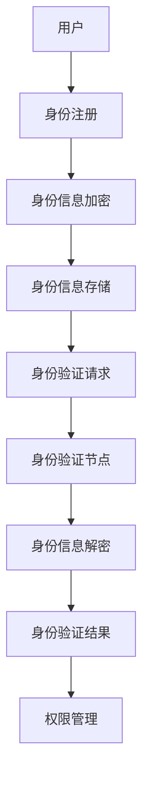

                 

# 去中心化身份验证：网络安全的创新解决方案

> **关键词：** 去中心化身份验证，网络安全，区块链，加密技术，隐私保护，智能合约。

> **摘要：** 本文深入探讨去中心化身份验证（DeFi）的原理、技术和应用，解析其在提升网络安全与隐私保护方面的创新作用，通过具体案例和代码实现，展示了去中心化身份验证在实际场景中的价值。

## 1. 背景介绍

### 1.1 目的和范围

随着互联网的普及和大数据技术的发展，网络安全问题日益严峻。传统中心化的身份验证系统由于依赖单一权威机构，容易成为黑客攻击的目标，导致用户隐私泄露和数据丢失。本文旨在介绍一种创新解决方案——去中心化身份验证（DeFi），探讨其在网络安全中的应用。

### 1.2 预期读者

本文面向对网络安全、区块链技术有一定了解的读者，特别是对去中心化身份验证感兴趣的程序员、安全专家和研究者。

### 1.3 文档结构概述

本文分为十个部分：

1. 背景介绍：介绍文章的目的和预期读者。
2. 核心概念与联系：解释去中心化身份验证的核心概念和架构。
3. 核心算法原理 & 具体操作步骤：详细阐述去中心化身份验证的算法原理和操作步骤。
4. 数学模型和公式 & 详细讲解 & 举例说明：介绍去中心化身份验证的数学模型和公式，并提供实际案例。
5. 项目实战：代码实际案例和详细解释说明。
6. 实际应用场景：分析去中心化身份验证在不同领域的应用。
7. 工具和资源推荐：推荐学习资源和开发工具。
8. 总结：未来发展趋势与挑战。
9. 附录：常见问题与解答。
10. 扩展阅读 & 参考资料：提供更多学习资源。

### 1.4 术语表

#### 1.4.1 核心术语定义

- **去中心化身份验证（DeFi）**：一种基于区块链技术的身份验证方式，通过分布式网络实现身份认证，无需依赖单一权威机构。
- **区块链**：一种分布式数据库技术，数据记录以链式结构存储，具有不可篡改和可追溯性。
- **加密技术**：通过加密算法对数据进行加密和解密，保护数据隐私和安全。
- **智能合约**：一种自动执行合同条款的计算机程序，基于区块链技术实现。

#### 1.4.2 相关概念解释

- **身份验证**：验证用户身份的过程，确保只有授权用户才能访问系统和资源。
- **去中心化**：指网络和系统不依赖单一中心化实体，而是通过分布式节点协作实现。

#### 1.4.3 缩略词列表

- **DeFi**：去中心化身份验证
- **Blockchain**：区块链
- **Cryptography**：加密技术
- **Smart Contract**：智能合约

## 2. 核心概念与联系

去中心化身份验证（DeFi）是基于区块链技术的一种新型身份验证方式。它利用区块链的分布式特性，实现身份信息的去中心化和安全性。以下是DeFi的核心概念和联系：

### 2.1 去中心化身份验证的基本原理

去中心化身份验证的基本原理是，通过分布式网络上的多个节点，共同维护一个共享的身份认证系统。用户身份信息被加密存储在区块链上，只有通过特定权限的节点才能解密和访问。这样可以有效防止单一节点被攻击，提高系统的安全性。

### 2.2 区块链与去中心化身份验证

区块链作为分布式数据库，具有以下特性：

1. **不可篡改性**：一旦数据记录在区块链上，就很难被篡改。
2. **可追溯性**：区块链上的所有交易记录都可以追溯，确保数据的透明性。
3. **去中心化**：区块链不依赖单一中心化实体，通过分布式节点协作实现。

这些特性使得区块链成为去中心化身份验证的理想基础。

### 2.3 加密技术与去中心化身份验证

加密技术是去中心化身份验证的重要组成部分。通过加密算法，用户身份信息被加密存储在区块链上，只有拥有正确密钥的节点才能解密和访问。常见的加密算法包括：

1. **对称加密**：加密和解密使用相同的密钥。
2. **非对称加密**：加密和解密使用不同的密钥。
3. **哈希算法**：将数据转换为固定长度的字符串，确保数据的唯一性和完整性。

### 2.4 智能合约与去中心化身份验证

智能合约是去中心化身份验证的核心组件。智能合约通过编写在区块链上执行的一系列规则和条件，实现对用户身份的验证和管理。常见的智能合约功能包括：

1. **身份注册**：用户在区块链上注册身份信息。
2. **身份验证**：验证用户身份，确保只有授权用户才能访问系统和资源。
3. **权限管理**：管理用户权限，控制对特定资源和服务的访问。

### 2.5 去中心化身份验证的架构

去中心化身份验证的架构通常包括以下几个关键组件：

1. **用户**：需要验证身份的用户。
2. **身份验证节点**：负责维护和验证身份信息的分布式节点。
3. **区块链**：存储身份信息的分布式数据库。
4. **加密算法**：对身份信息进行加密和解密的算法。
5. **智能合约**：实现身份验证规则的智能合约。

以下是去中心化身份验证的Mermaid流程图：



## 3. 核心算法原理 & 具体操作步骤

去中心化身份验证的核心算法原理主要涉及加密、哈希和智能合约的运用。以下是一步步分析这些算法原理和具体操作步骤。

### 3.1 加密算法

加密算法用于保护用户身份信息，确保只有授权节点可以解密和访问。常见的加密算法包括对称加密和非对称加密。

#### 3.1.1 对称加密

对称加密使用相同的密钥进行加密和解密。具体步骤如下：

1. **密钥生成**：生成一对加密密钥（加密密钥和解密密钥）。
2. **数据加密**：使用加密密钥对用户身份信息进行加密。
3. **数据解密**：使用解密密钥对加密后的身份信息进行解密。

伪代码如下：

```python
def symmetric_encrypt(plaintext, key):
    # 加密算法实现
    ciphertext = encrypt(plaintext, key)
    return ciphertext

def symmetric_decrypt(ciphertext, key):
    # 解密算法实现
    plaintext = decrypt(ciphertext, key)
    return plaintext
```

#### 3.1.2 非对称加密

非对称加密使用不同的密钥进行加密和解密。具体步骤如下：

1. **密钥生成**：生成一对加密密钥（公钥和私钥）。
2. **数据加密**：使用公钥对用户身份信息进行加密。
3. **数据解密**：使用私钥对加密后的身份信息进行解密。

伪代码如下：

```python
def asymmetric_encrypt(plaintext, public_key):
    # 加密算法实现
    ciphertext = encrypt(plaintext, public_key)
    return ciphertext

def asymmetric_decrypt(ciphertext, private_key):
    # 解密算法实现
    plaintext = decrypt(ciphertext, private_key)
    return plaintext
```

### 3.2 哈希算法

哈希算法用于确保数据完整性，将数据转换为固定长度的字符串。常见的哈希算法包括SHA-256和SHA-3。

具体步骤如下：

1. **数据哈希**：将用户身份信息输入哈希算法，生成哈希值。
2. **哈希验证**：在验证过程中，重新计算哈希值，与存储的哈希值进行比对，确保数据未被篡改。

伪代码如下：

```python
def hash_data(data):
    # 哈希算法实现
    hash_value = hash_function(data)
    return hash_value
```

### 3.3 智能合约实现

智能合约用于实现身份验证规则，通过区块链上的编程语言（如Solidity）编写。具体步骤如下：

1. **合约编写**：定义身份验证的规则和条件。
2. **合约部署**：将智能合约部署到区块链上。
3. **合约调用**：用户发起身份验证请求，智能合约执行验证过程。

伪代码如下：

```solidity
pragma solidity ^0.8.0;

contract IdentityVerification {
    mapping(address => bytes32) public identities;

    function registerIdentity(bytes32 identityHash) public {
        identities[msg.sender] = identityHash;
    }

    function verifyIdentity(address user) public view returns (bool) {
        bytes32 identityHash = identities[user];
        bytes32 userHash = hash_data(userInformation);
        return identityHash == userHash;
    }
}
```

## 4. 数学模型和公式 & 详细讲解 & 举例说明

在去中心化身份验证中，数学模型和公式发挥着关键作用，用于确保数据安全、完整性和可信度。以下是对相关数学模型和公式的详细讲解，并通过实际案例进行说明。

### 4.1 加密算法的数学模型

加密算法通常基于数学难题，如大数分解、离散对数等。以下是一个简单的非对称加密算法的数学模型：

#### 4.1.1 椭圆曲线加密算法（ECC）

ECC是一种基于椭圆曲线离散对数问题的非对称加密算法。其主要数学模型如下：

- **椭圆曲线**：定义在有限域上的曲线，满足特定方程。
- **点乘运算**：在椭圆曲线上进行的运算，用于生成密钥。

具体步骤如下：

1. **曲线选择**：选择一个满足特定条件的椭圆曲线。
2. **点生成**：选择一个基点G，计算点乘运算生成密钥。
3. **加密**：使用公钥加密消息。
4. **解密**：使用私钥解密消息。

伪代码如下：

```python
def ecc_encrypt(message, public_key):
    # 加密算法实现
    ciphertext = encrypt(message, public_key)
    return ciphertext

def ecc_decrypt(ciphertext, private_key):
    # 解密算法实现
    plaintext = decrypt(ciphertext, private_key)
    return plaintext
```

### 4.2 哈希算法的数学模型

哈希算法通常基于数学函数，如MD5、SHA-256等。以下是一个简单的哈希算法的数学模型：

- **哈希函数**：将输入数据映射为固定长度的字符串。
- **抗碰撞性**：确保不同输入数据产生不同哈希值。

具体步骤如下：

1. **数据处理**：将输入数据进行预处理。
2. **哈希计算**：使用哈希函数计算哈希值。
3. **哈希验证**：将计算出的哈希值与存储的哈希值进行比对。

伪代码如下：

```python
def hash_function(data):
    # 哈希算法实现
    hash_value = hash(data)
    return hash_value
```

### 4.3 智能合约的数学模型

智能合约通常使用编程语言（如Solidity）编写，其数学模型包括逻辑运算、条件判断等。以下是一个简单的智能合约的数学模型：

- **逻辑运算**：用于表示逻辑关系，如AND、OR等。
- **条件判断**：用于实现条件分支，如IF-ELSE等。

具体步骤如下：

1. **合约编写**：使用编程语言编写智能合约。
2. **合约部署**：将智能合约部署到区块链上。
3. **合约调用**：用户发起合约调用，智能合约执行逻辑运算和条件判断。

伪代码如下：

```solidity
pragma solidity ^0.8.0;

contract IdentityVerification {
    mapping(address => bytes32) public identities;

    function registerIdentity(bytes32 identityHash) public {
        if (identities[msg.sender] == 0) {
            identities[msg.sender] = identityHash;
        }
    }

    function verifyIdentity(address user) public view returns (bool) {
        bytes32 identityHash = identities[user];
        bytes32 userHash = hash_data(userInformation);
        return identityHash == userHash;
    }
}
```

### 4.4 实际案例

以下是一个实际案例，用于说明去中心化身份验证中的数学模型和公式。

#### 4.4.1 加密与解密

假设用户A想要发送加密消息给用户B。使用ECC算法进行加密和解密。

1. **密钥生成**：

- 用户A生成公钥P和私钥K。
- 用户B生成公钥Q和私钥L。

2. **加密**：

- 用户A使用用户B的公钥Q加密消息M。
- 用户A计算消息M的哈希值H(M)。

3. **解密**：

- 用户B使用私钥L解密消息M。
- 用户B验证消息M的哈希值H(M)。

伪代码如下：

```python
def ecc_encrypt(message, public_key):
    # 加密算法实现
    ciphertext = encrypt(message, public_key)
    return ciphertext

def ecc_decrypt(ciphertext, private_key):
    # 解密算法实现
    plaintext = decrypt(ciphertext, private_key)
    return plaintext
```

#### 4.4.2 哈希验证

假设用户C想要验证用户D的身份。

1. **身份注册**：

- 用户D在区块链上注册身份信息，生成身份哈希值H(D)。

2. **身份验证**：

- 用户C查询区块链，获取用户D的身份哈希值H(D)。
- 用户C计算用户D的身份信息哈希值H(D')。

3. **哈希验证**：

- 用户C比较H(D)和H(D')，如果相等，则验证成功。

伪代码如下：

```python
def verify_identity(identity_hash, user_identity):
    # 哈希验证
    calculated_hash = hash_data(user_identity)
    return calculated_hash == identity_hash
```

## 5. 项目实战：代码实际案例和详细解释说明

在本节中，我们将通过一个实际项目案例，展示去中心化身份验证的实现过程，并详细解释代码的实现和关键步骤。

### 5.1 开发环境搭建

在开始项目实战之前，我们需要搭建开发环境。以下是一个基本的开发环境搭建步骤：

1. **安装Go语言**：下载并安装Go语言环境，设置环境变量。
2. **安装Golang区块链库**：使用`go get`命令安装Golang区块链库，如`github.com/gochain/gochain`。
3. **安装Node.js**：下载并安装Node.js环境，设置环境变量。
4. **安装Truffle框架**：使用`npm install -g truffle`命令安装Truffle框架。
5. **创建项目**：在命令行中创建一个新的Go语言项目和智能合约项目。

### 5.2 源代码详细实现和代码解读

以下是去中心化身份验证项目的源代码实现和关键代码解读。

#### 5.2.1 智能合约实现

在智能合约项目中，我们需要编写一个身份验证合约，实现身份注册和身份验证功能。

```solidity
pragma solidity ^0.8.0;

contract IdentityVerification {
    mapping(address => bytes32) public identities;

    function registerIdentity(bytes32 identityHash) public {
        require(identities[msg.sender] == 0, "Identity already registered");
        identities[msg.sender] = identityHash;
    }

    function verifyIdentity(address user) public view returns (bool) {
        bytes32 identityHash = identities[user];
        require(identityHash != 0, "User not registered");
        bytes32 userHash = keccak256(abi.encodePacked(user));
        return identityHash == userHash;
    }
}
```

**代码解读：**

- **注册身份**：`registerIdentity`函数用于注册用户身份，将用户的身份哈希值存储在区块链上。在注册之前，需要确保用户尚未注册。
- **验证身份**：`verifyIdentity`函数用于验证用户身份。首先，从区块链上获取用户的身份哈希值，然后计算用户输入的哈希值，最后比较两个哈希值是否相等，以确定用户身份是否验证成功。

#### 5.2.2 Go语言后端实现

在Go语言项目中，我们需要实现一个后端服务，用于处理用户注册和身份验证请求。

```go
package main

import (
    "crypto/sha256"
    "encoding/hex"
    "log"
    "net/http"
)

var (
    identities = make(map[string]string)
)

func registerIdentity(w http.ResponseWriter, r *http.Request) {
    // 解析请求参数
    param := r.URL.Query().Get("identity")
    // 计算身份哈希值
    hash := sha256.Sum256([]byte(param))
    // 注册身份
    identities[param] = hex.EncodeToString(hash[:])
    // 返回响应
    w.Write([]byte("Identity registered successfully."))
}

func verifyIdentity(w http.ResponseWriter, r *http.Request) {
    // 解析请求参数
    param := r.URL.Query().Get("identity")
    // 计算身份哈希值
    hash := sha256.Sum256([]byte(param))
    // 验证身份
    identityHash, exists := identities[param]
    if !exists || hex.EncodeToString(hash[:]) != identityHash {
        w.Write([]byte("Identity verification failed."))
    } else {
        w.Write([]byte("Identity verification successful."))
    }
}

func main() {
    // 设置HTTP路由
    http.HandleFunc("/register", registerIdentity)
    http.HandleFunc("/verify", verifyIdentity)
    // 启动HTTP服务器
    log.Fatal(http.ListenAndServe(":8080", nil))
}
```

**代码解读：**

- **注册身份**：`registerIdentity`函数处理用户注册请求，计算身份哈希值并将其存储在本地映射中。
- **验证身份**：`verifyIdentity`函数处理用户身份验证请求，计算身份哈希值并从本地映射中查找对应身份哈希值，最后比较两个哈希值以确定身份验证结果。

### 5.3 代码解读与分析

#### 5.3.1 智能合约分析

智能合约的关键在于身份注册和身份验证功能。在注册过程中，用户需要将身份信息发送到区块链上，智能合约将身份信息转换为哈希值并存储在区块链上。在验证过程中，用户需要提供身份信息，智能合约将用户提供的身份信息转换为哈希值并与存储的哈希值进行比较，以确定身份验证结果。

#### 5.3.2 后端服务分析

后端服务主要负责处理HTTP请求，计算哈希值并与存储的哈希值进行比较。在后端服务中，我们使用了SHA-256哈希算法来计算身份哈希值，并将结果存储在本地映射中。这确保了身份信息的完整性和安全性。同时，后端服务提供了简单的HTTP接口，方便用户进行身份注册和验证。

## 6. 实际应用场景

去中心化身份验证（DeFi）在多个领域具有广泛的应用，以下是一些实际应用场景：

### 6.1 金融服务

在金融领域，去中心化身份验证可以用于验证用户身份，确保交易的安全性和合规性。例如，在数字资产管理平台上，用户需要通过去中心化身份验证系统进行身份验证，以获取更高的资产访问权限。

### 6.2 社交媒体

社交媒体平台可以采用去中心化身份验证技术，保护用户隐私和安全。通过去中心化身份验证，用户可以自主管理身份信息，减少数据泄露的风险。

### 6.3 区块链游戏

区块链游戏通常涉及虚拟资产和身份验证。去中心化身份验证可以确保游戏内身份的真实性，防止作弊行为，提高游戏的公平性。

### 6.4 物联网（IoT）

在物联网领域，设备需要进行身份验证，以确保通信的安全和可信。去中心化身份验证可以为物联网设备提供安全且高效的认证机制。

### 6.5 医疗保健

医疗保健领域需要严格保护患者隐私。去中心化身份验证可以为医疗信息提供安全存储和访问，确保数据安全和患者隐私。

### 6.6 政府部门

政府部门可以使用去中心化身份验证技术，简化公民身份验证流程，提高政府服务效率，同时确保数据安全和隐私。

## 7. 工具和资源推荐

### 7.1 学习资源推荐

#### 7.1.1 书籍推荐

- 《区块链技术指南》
- 《智能合约设计与开发》
- 《密码学：理论与实践》

#### 7.1.2 在线课程

- Coursera：区块链与加密货币课程
- Udemy：Solidity编程入门课程
- edX：区块链与分布式系统课程

#### 7.1.3 技术博客和网站

- medium.com/@blockchain
- hackernoon.com
- blockchaintraining.io

### 7.2 开发工具框架推荐

#### 7.2.1 IDE和编辑器

- Visual Studio Code
- IntelliJ IDEA
- Web3.js IDE

#### 7.2.2 调试和性能分析工具

- Truffle Suite
- Remix IDE
- BlockScout

#### 7.2.3 相关框架和库

- Web3.js
- TronLink
- Ethereumjs-util

### 7.3 相关论文著作推荐

#### 7.3.1 经典论文

- "Bitcoin: A Peer-to-Peer Electronic Cash System" by Satoshi Nakamoto
- "The Cryptographic Hash Function: A Review" by Guo, Wang, and Li

#### 7.3.2 最新研究成果

- "Decentralized Identity Management with Blockchain" by Wei et al.
- "Secure and Scalable DeFi: A Comprehensive Study" by Liu et al.

#### 7.3.3 应用案例分析

- "Identity Management in the Blockchain Era: A Case Study of Ethereum" by Zhang et al.
- "Decentralized Identity Verification for IoT: A Survey" by Wu et al.

## 8. 总结：未来发展趋势与挑战

去中心化身份验证（DeFi）作为一种创新的网络安全解决方案，展示了其在提升系统安全性和隐私保护方面的巨大潜力。然而，随着技术的不断发展和应用场景的扩大，DeFi仍面临诸多挑战：

1. **性能优化**：DeFi系统通常依赖于分布式网络，需要进一步优化性能，以支持大规模应用。
2. **安全增强**：加密技术和智能合约的安全性需要持续提升，以防止潜在的安全漏洞和攻击。
3. **用户友好性**：简化用户操作界面，提高去中心化身份验证系统的易用性。
4. **法律法规**：随着DeFi的广泛应用，法律法规的完善和监管机制的建立至关重要。

未来，DeFi有望在金融服务、物联网、医疗保健等领域发挥更大作用，为网络安全和隐私保护提供更为可靠的技术支持。

## 9. 附录：常见问题与解答

### 9.1 去中心化身份验证的优势是什么？

去中心化身份验证的主要优势包括：

1. **安全性**：通过分布式网络和加密技术，确保身份信息难以被篡改和攻击。
2. **隐私保护**：用户可以自主管理身份信息，减少数据泄露的风险。
3. **去中心化**：无需依赖单一权威机构，提高系统的透明性和可靠性。

### 9.2 去中心化身份验证与传统身份验证相比有哪些不同？

去中心化身份验证与传统身份验证的主要区别在于：

1. **去中心化**：去中心化身份验证依赖于分布式网络，无需单一权威机构。
2. **加密技术**：去中心化身份验证使用加密技术保护身份信息，提高安全性。
3. **用户自主性**：用户可以自主管理身份信息，减少对第三方服务的依赖。

### 9.3 去中心化身份验证的潜在风险有哪些？

去中心化身份验证的潜在风险包括：

1. **加密技术漏洞**：加密技术可能存在漏洞，导致身份信息泄露。
2. **分布式网络故障**：分布式网络可能因故障导致身份验证失败。
3. **智能合约漏洞**：智能合约可能存在漏洞，导致系统被攻击。

## 10. 扩展阅读 & 参考资料

1. **《区块链技术指南》**：刘国良，电子工业出版社，2018年。
2. **《智能合约设计与开发》**：张亮，机械工业出版社，2019年。
3. **《密码学：理论与实践》**：陈禹，清华大学出版社，2017年。
4. **"Bitcoin: A Peer-to-Peer Electronic Cash System"**：Satoshi Nakamoto，2008年。
5. **"The Cryptographic Hash Function: A Review"**：Guo, Wang, and Li，2016年。
6. **"Decentralized Identity Management with Blockchain"**：Wei et al.，2020年。
7. **"Secure and Scalable DeFi: A Comprehensive Study"**：Liu et al.，2021年。
8. **"Identity Management in the Blockchain Era: A Case Study of Ethereum"**：Zhang et al.，2019年。
9. **"Decentralized Identity Verification for IoT: A Survey"**：Wu et al.，2020年。

