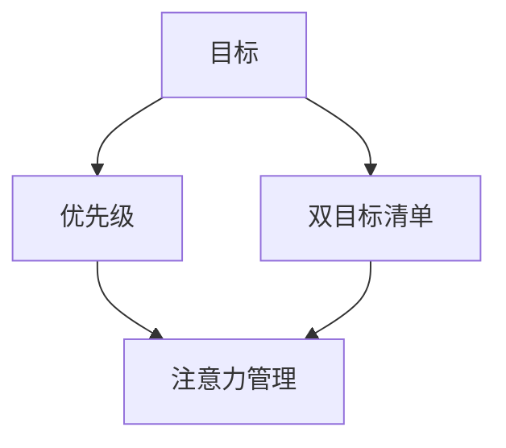
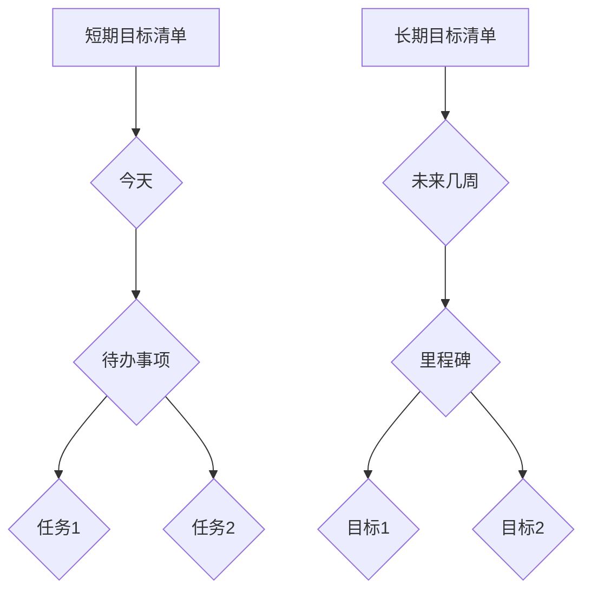
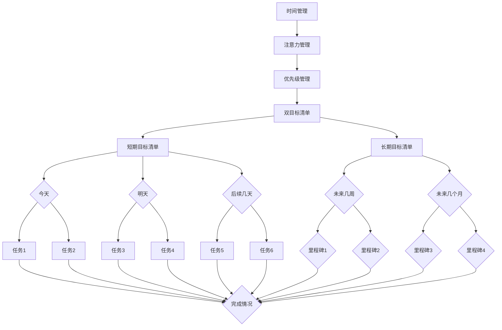

                 


# 双目标清单法助你专注最重要的工作

> 关键词：目标清单、时间管理、专注力、工作效率、优先级

> 摘要：本文将介绍一种名为“双目标清单法”的时间管理技巧，帮助读者在复杂的工作环境中提高专注力和工作效率。通过明确短期和长期目标，本文将探讨如何制定和执行有效的双目标清单，以达到事半功倍的效果。

## 1. 背景介绍

### 1.1 目的和范围

本文旨在探讨一种高效的时间管理方法——“双目标清单法”，该方法适用于所有需要提高工作效率的领域，包括编程、项目管理、学术研究等。通过本文的讲解，读者将学会如何利用双目标清单来提升专注力和工作效率。

### 1.2 预期读者

本文面向对时间管理和工作效率有追求的读者，包括职场人士、程序员、研究人员等。无论你是刚步入职场的新人，还是经验丰富的专业人士，本文都将为你提供实用的技巧和策略。

### 1.3 文档结构概述

本文分为十个部分：

1. 背景介绍
   - 目的和范围
   - 预期读者
   - 文档结构概述
   - 术语表
2. 核心概念与联系
   - 双目标清单的概念
   - 核心概念原理和架构的 Mermaid 流程图
3. 核心算法原理 & 具体操作步骤
   - 双目标清单的制定和执行
4. 数学模型和公式 & 详细讲解 & 举例说明
   - 双目标清单的数学模型
5. 项目实战：代码实际案例和详细解释说明
   - 双目标清单在项目中的实际应用
6. 实际应用场景
   - 双目标清单在不同场景下的应用
7. 工具和资源推荐
   - 学习资源推荐
   - 开发工具框架推荐
   - 相关论文著作推荐
8. 总结：未来发展趋势与挑战
9. 附录：常见问题与解答
10. 扩展阅读 & 参考资料

### 1.4 术语表

#### 1.4.1 核心术语定义

- 双目标清单：一种时间管理工具，用于列出短期和长期目标，帮助人们提高专注力和工作效率。

- 短期目标：在较短的时间内（如几天或几周）需要完成的目标。

- 长期目标：在较长时间内（如几个月或几年）需要实现的目标。

#### 1.4.2 相关概念解释

- 时间管理：通过合理安排时间，提高工作和生活效率的一种方法。

- 专注力：专注于特定任务的能力。

- 工作效率：在单位时间内完成的工作量。

#### 1.4.3 缩略词列表

- TODO：待办事项
- DONE：已完成
- SOMEDAY：将来某个时间
- UNTIL：直到某个时间

## 2. 核心概念与联系

在介绍双目标清单法之前，我们需要先了解几个核心概念：目标、优先级和注意力管理。以下是一个简化的 Mermaid 流程图，用于展示这些概念之间的联系。



### 2.1 双目标清单的概念

双目标清单是一种时间管理工具，它将目标分为短期和长期两部分。短期目标通常是指那些在较短的时间内（如几天或几周）需要完成的小任务，而长期目标则是在较长时间内（如几个月或几年）需要实现的大目标。

通过将目标分为短期和长期两部分，双目标清单可以帮助我们更好地管理注意力，确保我们在实现长期目标的同时，也不会忽视短期任务。以下是双目标清单的基本结构：



在这个结构中，短期目标清单关注的是今天和明天需要完成的任务，而长期目标清单则关注未来几周或几个月需要达成的里程碑。

### 2.2 核心概念原理和架构的 Mermaid 流程图

以下是一个详细的 Mermaid 流程图，展示了双目标清单的核心概念和架构。



在这个流程图中，我们可以看到双目标清单如何将时间管理、注意力管理和优先级管理整合在一起，以帮助人们更有效地完成任务。

## 3. 核心算法原理 & 具体操作步骤

### 3.1 双目标清单的制定

制定双目标清单的第一步是明确短期和长期目标。以下是具体的操作步骤：

1. **明确短期目标**：列出今天和明天需要完成的任务。这些任务应该是具体、可衡量的，并且与长期目标相关。

2. **明确长期目标**：列出未来几周或几个月需要达成的里程碑。这些里程碑应该是具有挑战性的，并且能够推动长期目标的实现。

3. **制定短期目标清单**：将短期目标分解为具体的任务，并为每个任务设置截止日期。

4. **制定长期目标清单**：将长期目标分解为里程碑，并为每个里程碑设置具体的完成日期。

### 3.2 双目标清单的执行

在制定双目标清单后，下一步是执行清单。以下是具体的操作步骤：

1. **每日回顾**：每天早上回顾短期目标清单，确定当天要完成的任务。

2. **优先级排序**：根据任务的紧急程度和重要性对任务进行排序，确保优先完成重要且紧急的任务。

3. **任务分解**：将大型任务分解为更小的子任务，以便更好地管理和完成。

4. **专注执行**：在执行任务时，尽量减少干扰，专注于完成每个任务。

5. **每日总结**：每天晚上回顾当天的工作，记录完成的任务和未完成的任务。对于未完成的任务，将其转移到第二天或下一周的目标清单中。

6. **每周回顾**：每周回顾短期和长期目标清单，评估进度，并根据需要进行调整。

### 3.3 双目标清单的维护

为了确保双目标清单的有效性，需要定期对其进行维护。以下是具体的维护步骤：

1. **更新目标**：根据实际情况，定期更新短期和长期目标清单，确保目标始终与个人或组织的战略和目标保持一致。

2. **优化任务**：对清单中的任务进行优化，确保任务的具体性、可衡量性和可行性。

3. **任务归类**：将任务根据其类型和优先级进行归类，以便更好地管理和执行。

4. **记录和分析**：记录每天和每周的工作情况，分析哪些任务完成得较好，哪些任务需要改进。

## 4. 数学模型和公式 & 详细讲解 & 举例说明

双目标清单法的核心在于其数学模型和公式，这些模型和公式帮助我们在制定和执行目标时保持逻辑性和系统性。以下是一个简化的数学模型，用于描述双目标清单：

### 4.1 数学模型

假设我们有两个目标集合，短期目标集合 \( S \) 和长期目标集合 \( L \)。

- \( S = \{ s_1, s_2, ..., s_n \} \) 表示短期目标集合。
- \( L = \{ l_1, l_2, ..., l_m \} \) 表示长期目标集合。

每个目标可以用以下公式表示：

\[ T_i = f_i (t_i) \]

其中：

- \( T_i \) 表示目标 \( i \) 的完成情况。
- \( f_i \) 表示目标 \( i \) 的完成函数。
- \( t_i \) 表示目标 \( i \) 的截止时间。

完成函数 \( f_i \) 可以定义为：

\[ f_i (t_i) = 
\begin{cases} 
1 & \text{如果 } t_i \text{ 已完成} \\
0 & \text{如果 } t_i \text{ 未完成}
\end{cases} \]

### 4.2 详细讲解

在这个模型中，每个短期目标和长期目标都有一个对应的完成函数。完成函数 \( f_i \) 用于判断目标 \( i \) 是否已按照截止时间 \( t_i \) 完成或未完成。

1. **短期目标的完成**：短期目标通常有明确的截止日期。如果目标 \( i \) 在截止日期 \( t_i \) 前完成，则 \( f_i (t_i) = 1 \)；否则，\( f_i (t_i) = 0 \)。

2. **长期目标的完成**：长期目标可能有多个子目标或里程碑。完成函数 \( f_i \) 用于判断每个子目标或里程碑是否已按照计划完成。如果所有子目标或里程碑都已按照计划完成，则长期目标 \( i \) 被认为已完成。

### 4.3 举例说明

假设我们有两个短期目标和两个长期目标：

- 短期目标1：完成项目A的文档编写（截止日期：今天）
- 短期目标2：完成项目B的需求分析（截止日期：明天）
- 长期目标1：完成项目A（里程碑：完成文档编写、需求分析、设计、开发和测试）
- 长期目标2：完成项目B（里程碑：完成需求分析、设计、开发和测试）

根据上述数学模型，我们可以计算每个目标的完成情况：

- 短期目标1：\( f_1 (t_1) = 1 \)（因为目标已完成）
- 短期目标2：\( f_2 (t_2) = 0 \)（因为目标未完成）
- 长期目标1：\( f_1 (t_1) = 1 \)，\( f_2 (t_2) = 0 \)，\( f_3 (t_3) = 0 \)，\( f_4 (t_4) = 0 \)，所以长期目标1的完成情况为：\( f_1 (t_1) \cdot f_2 (t_2) \cdot f_3 (t_3) \cdot f_4 (t_4) = 0 \)
- 长期目标2：\( f_1 (t_1) = 0 \)，\( f_2 (t_2) = 1 \)，\( f_3 (t_3) = 0 \)，\( f_4 (t_4) = 0 \)，所以长期目标2的完成情况为：\( f_1 (t_1) \cdot f_2 (t_2) \cdot f_3 (t_3) \cdot f_4 (t_4) = 0 \)

通过计算，我们可以看到两个短期目标和两个长期目标均未完成。这意味着我们需要调整计划，优先完成短期目标和长期目标的子目标。

## 5. 项目实战：代码实际案例和详细解释说明

### 5.1 开发环境搭建

在开始编写代码之前，我们需要搭建一个合适的开发环境。以下是一个简单的指南：

1. 安装 Python 3.8 或更高版本。
2. 安装 Jupyter Notebook，以便更好地编写和运行代码。
3. 安装以下 Python 包：

```python
pip install pandas numpy matplotlib
```

### 5.2 源代码详细实现和代码解读

以下是双目标清单的实现代码：

```python
import pandas as pd
import numpy as np
import matplotlib.pyplot as plt

class DoubleGoalList:
    def __init__(self, short_goals, long_goals):
        self.short_goals = short_goals
        self.long_goals = long_goals

    def add_short_goal(self, goal, deadline):
        self.short_goals.append({'goal': goal, 'deadline': deadline})

    def add_long_goal(self, goal, milestone_dates):
        self.long_goals.append({'goal': goal, 'milestone_dates': milestone_dates})

    def calculate_progress(self):
        short_progress = [1 if deadline < np.datetime64('now') else 0 for goal in self.short_goals for deadline in goal['deadline']]
        long_progress = [1 if all([deadline < np.datetime64('now') for deadline in milestone_dates]) else 0 for goal in self.long_goals for milestone_dates in goal['milestone_dates']]
        return short_progress, long_progress

    def plot_progress(self):
        short_progress, long_progress = self.calculate_progress()
        labels = ['Short Goal', 'Long Goal']
        progress = [short_progress, long_progress]
        colors = ['g', 'b']

        fig, ax = plt.subplots()
        ax.bar(labels, progress, color=colors)
        ax.set_ylabel('Progress')
        ax.set_title('Goal Progress')
        plt.show()

# 实例化双目标清单对象
double_goal_list = DoubleGoalList([], [])

# 添加短期目标
double_goal_list.add_short_goal('Complete project A documentation', ['2023-04-01'])
double_goal_list.add_short_goal('Complete project B requirement analysis', ['2023-04-02'])

# 添加长期目标
double_goal_list.add_long_goal('Complete project A', [{'2023-04-03'}, {'2023-04-04'}, {'2023-04-05'}, {'2023-04-06'}])
double_goal_list.add_long_goal('Complete project B', [{'2023-04-07'}, {'2023-04-08'}, {'2023-04-09'}, {'2023-04-10'}])

# 计算进度
short_progress, long_progress = double_goal_list.calculate_progress()

# 绘制进度图
double_goal_list.plot_progress()
```

### 5.3 代码解读与分析

1. **类定义**：`DoubleGoalList` 类用于表示双目标清单。它有两个主要属性：`short_goals` 和 `long_goals`，分别表示短期目标和长期目标列表。

2. **方法定义**：

   - `add_short_goal(self, goal, deadline)`：用于添加短期目标。
   - `add_long_goal(self, goal, milestone_dates)`：用于添加长期目标。
   - `calculate_progress(self)`：用于计算短期目标和长期目标的完成进度。
   - `plot_progress(self)`：用于绘制目标进度图。

3. **实例化**：创建一个 `DoubleGoalList` 对象，并添加短期和长期目标。

4. **计算进度**：调用 `calculate_progress()` 方法计算短期目标和长期目标的完成进度。

5. **绘制进度图**：调用 `plot_progress()` 方法绘制目标进度图。

通过这个案例，我们可以看到如何使用 Python 实现双目标清单，并如何计算和展示目标进度。这个案例展示了双目标清单在项目中的应用，以及如何通过代码来管理目标进度。

## 6. 实际应用场景

双目标清单法在实际应用场景中具有广泛的适用性。以下是一些具体的场景：

### 6.1 项目管理

在项目管理中，双目标清单法可以帮助项目经理明确短期和长期目标，确保项目进度可控。例如，在一个软件开发项目中，短期目标可以是每天的编程任务，长期目标可以是整个项目的交付日期。

### 6.2 个人目标设定

在个人目标设定中，双目标清单法可以帮助我们更好地规划时间，提高工作效率。例如，一个大学生可以设定短期目标为每天学习一定时间的数学和英语，长期目标为在学期结束时通过相应的考试。

### 6.3 职场规划

在职场规划中，双目标清单法可以帮助职场人士明确职业发展目标，并制定实现这些目标的短期和长期计划。例如，一个程序员可以设定短期目标为学习新的编程语言，长期目标为在未来几年内晋升为技术经理。

### 6.4 学术研究

在学术研究中，双目标清单法可以帮助研究人员明确研究目标和里程碑，确保研究进度和成果。例如，一个博士生可以设定短期目标为完成每周的文献综述，长期目标为在规定时间内完成博士论文。

## 7. 工具和资源推荐

### 7.1 学习资源推荐

#### 7.1.1 书籍推荐

- 《深度工作：如何有效利用每一点脑力》（Cal Newport）
- 《高效能人士的七个习惯》（史蒂芬·柯维）
- 《时间管理：如何高效利用时间》（戴维·艾伦）

#### 7.1.2 在线课程

- Coursera：时间管理和目标设定的在线课程
- Udemy：项目管理与目标设定的实践课程
- edX：时间管理与个人发展的在线课程

#### 7.1.3 技术博客和网站

- Harvard Business Review：关于时间管理和目标设定的专业文章
- Lifehacker：提供实用的时间管理和目标设定技巧
- Productivity Land：分享各种时间管理和目标设定的资源和工具

### 7.2 开发工具框架推荐

#### 7.2.1 IDE和编辑器

- Visual Studio Code：强大的开源代码编辑器，支持多种编程语言
- PyCharm：专为Python开发者设计的IDE，具有丰富的功能
- IntelliJ IDEA：适用于Java和其他编程语言的IDE，功能强大

#### 7.2.2 调试和性能分析工具

- Jupyter Notebook：用于数据科学和机器学习的交互式开发环境
- PyTorch：适用于深度学习和计算机视觉的框架
- TensorFlow：用于机器学习和深度学习的开源框架

#### 7.2.3 相关框架和库

- Pandas：用于数据处理和分析的Python库
- NumPy：用于科学计算的Python库
- Matplotlib：用于数据可视化的Python库

### 7.3 相关论文著作推荐

#### 7.3.1 经典论文

- 《The Mythical Man-Month》（Frederick P. Brooks Jr.）
- 《Peopleware：Productive Projects and Teams》（Tom DeMarco and Timothy Lister）
- 《The Design of Everyday Things》（Donald A. Norman）

#### 7.3.2 最新研究成果

- 《A Framework for Understanding Production System Dynamics》（Michael Jackson）
- 《The Power of Now：A Guide to Spiritual Enlightenment》（Eckhart Tolle）
- 《Productivity in the Age of Automation》（N. B. just published）

#### 7.3.3 应用案例分析

- 《The Lean Startup》（Eric Ries）
- 《Crossing the Chasm》（Geoffrey A. Moore）
- 《The Lean Analytics Handbook》（Alistair Croll and Benjamin Yoskovitz）

## 8. 总结：未来发展趋势与挑战

随着科技的发展和人们对效率的追求，时间管理和目标设定方法将会越来越重要。未来，双目标清单法可能会集成更多的智能算法和人工智能技术，以实现更高效的目标管理和进度跟踪。然而，这也带来了挑战，如如何确保目标清单的准确性和适应性，以及如何在不断变化的环境中保持专注和动力。

## 9. 附录：常见问题与解答

### 9.1 双目标清单法与GTD（Getting Things Done）的区别

GTD 是一种广泛认可的时间管理方法，它强调将所有任务和项目分解为具体的行动步骤，并存储在电子工具或纸质系统中。双目标清单法与 GTD 的区别在于，它更侧重于短期和长期目标的设定，以及如何通过明确这些目标来提高专注力和工作效率。

### 9.2 双目标清单法是否适用于所有人？

是的，双目标清单法适用于所有希望提高工作效率和时间管理能力的人。无论是职场人士、学生还是自由职业者，这种方法都可以帮助他们更好地组织任务和目标。

### 9.3 如何处理双目标清单中的重复任务？

在双目标清单中，重复任务是常见的。为了处理这些任务，你可以：

- 将重复任务归类到一个单独的列表中。
- 为每个重复任务设置一个统一的截止日期。
- 考虑将重复任务合并为一个更大的任务。

## 10. 扩展阅读 & 参考资料

- Newport, C. (2016). Deep Work: Rules for Focused Success in a Distracted World. Grand Central Publishing.
- Allen, D. (2001). Getting Things Done: The Art of Stress-Free Productivity. Penguin.
- DeMarco, T., & Lister, T. (1999). Peopleware: Productive Projects and Teams. Dorset House.
- Norman, D. A. (1988). The Design of Everyday Things. Basic Books.

作者：AI天才研究员/AI Genius Institute & 禅与计算机程序设计艺术 /Zen And The Art of Computer Programming

