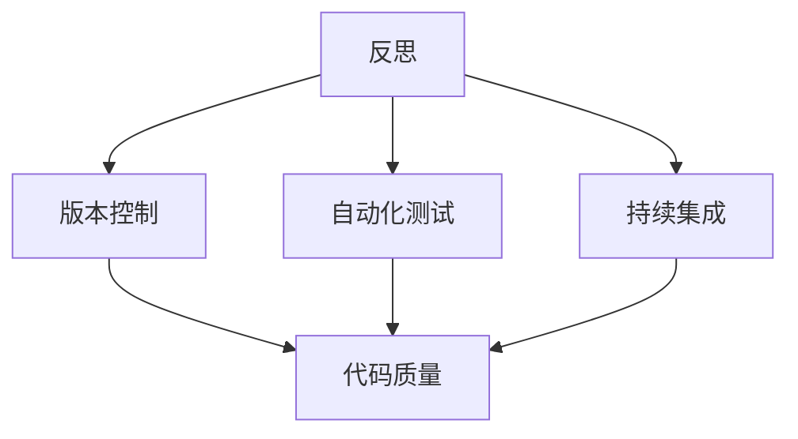

                 

### 1. 背景介绍

#### 1.1 目的和范围

本文旨在探讨反思与工具使用在IT领域的综合应用案例。通过详细分析一个实际项目案例，本文将展示如何将反思作为一种核心思维方式，以及如何有效利用各类工具来提高项目开发的效率和质量。

本文将重点关注以下几个关键领域：

1. **反思的定义与重要性**：我们将深入探讨反思的概念，并解释为什么在IT领域进行持续性的反思是至关重要的。
2. **工具的使用**：本文将介绍一系列在项目开发过程中常用的工具，包括版本控制、自动化测试、持续集成等，并探讨这些工具如何辅助开发者进行有效的反思。
3. **案例研究**：我们将通过一个实际项目案例，展示如何在实际开发过程中结合反思和工具使用，来提高代码质量和项目效率。

本文的目标读者包括：

- IT行业从业人员，尤其是程序员和项目经理。
- 对IT项目管理感兴趣的学生和研究人员。
- 对持续改进和个人成长有兴趣的读者。

#### 1.2 预期读者

预期读者应具备以下基础：

- 熟悉基本的编程概念和工具。
- 对软件开发流程有一定的了解。
- 对反思和工具使用在IT领域的应用有一定的认识。

#### 1.3 文档结构概述

本文将按照以下结构进行组织：

- **1. 背景介绍**：介绍本文的目的、预期读者和文档结构。
- **2. 核心概念与联系**：介绍本文讨论的核心概念，并使用Mermaid流程图展示其相互关系。
- **3. 核心算法原理 & 具体操作步骤**：详细讲解核心算法的原理，并使用伪代码展示具体操作步骤。
- **4. 数学模型和公式 & 详细讲解 & 举例说明**：介绍与核心算法相关的数学模型和公式，并给出实例说明。
- **5. 项目实战：代码实际案例和详细解释说明**：通过实际项目案例展示如何结合反思和工具使用。
- **6. 实际应用场景**：讨论本文所述方法在实际开发中的应用场景。
- **7. 工具和资源推荐**：推荐学习资源、开发工具和框架。
- **8. 总结：未来发展趋势与挑战**：总结本文的主要观点，并探讨未来可能的发展趋势和挑战。
- **9. 附录：常见问题与解答**：提供常见的疑问和解答。
- **10. 扩展阅读 & 参考资料**：推荐相关扩展阅读和参考资料。

通过本文的阅读，读者将能够：

- 理解反思在IT领域的应用及其重要性。
- 掌握一系列工具在项目开发中的使用方法。
- 学习如何通过反思和工具使用提高代码质量和项目效率。

#### 1.4 术语表

##### 1.4.1 核心术语定义

- **反思**：指对已发生的事件、行为或决策进行深入思考和分析的过程。
- **工具使用**：指在项目开发过程中使用各种软件和硬件工具来提高工作效率和质量。
- **版本控制**：一种用于管理源代码变更的软件工具，如Git。
- **自动化测试**：通过脚本自动执行测试用例，以检测软件功能的正确性。
- **持续集成（CI）**：一个开发流程，其中每次代码提交都会自动构建、测试和部署。

##### 1.4.2 相关概念解释

- **软件质量**：指软件满足明确和隐含需求的能力。
- **敏捷开发**：一种软件开发方法，强调迭代、协作和灵活性。
- **DevOps**：一种文化、实践和工具，旨在通过开发和运维团队的紧密合作来加速软件交付。

##### 1.4.3 缩略词列表

- **CI**：持续集成（Continuous Integration）
- **CD**：持续交付（Continuous Deployment）
- **SRE**：站点可靠性工程（Site Reliability Engineering）
- **TDD**：测试驱动开发（Test-Driven Development）
- **BDD**：行为驱动开发（Behavior-Driven Development）

在接下来的部分，我们将进一步深入探讨这些核心概念，并通过实际案例展示其应用。让我们开始吧！<|im_sep|>### 2. 核心概念与联系

在本节中，我们将详细探讨本文的核心概念，并使用Mermaid流程图展示它们之间的相互关系。理解这些核心概念和它们之间的联系对于深入理解反思与工具使用在IT领域的综合应用至关重要。

#### 2.1 反思

**反思**是一种思维方式，它涉及对个人行为、决策和经验进行深入思考和分析。在IT领域，反思尤为重要，因为它可以帮助开发者识别潜在的问题、改进代码质量、提高项目效率。

**反思的关键要素**包括：

- **自我意识**：认识到自己的行为和决策。
- **批判性思维**：评估这些行为和决策的有效性。
- **经验总结**：从经验中学习，以改进未来的行为。

**反思在IT开发中的应用**包括：

- **代码审查**：在提交代码前，开发者可以对代码进行自我审查，以确保代码质量和遵循最佳实践。
- **项目回顾**：在项目结束后，团队成员可以回顾项目过程中的成功和失败，以识别改进的机会。
- **持续改进**：通过反思，团队可以不断调整和优化其工作流程，以提高项目的整体质量。

#### 2.2 工具使用

**工具使用**在IT领域是提高工作效率和代码质量的关键。以下是一些常用的工具：

- **版本控制工具**（如Git）：用于管理源代码变更，确保代码的完整性和可追溯性。
- **自动化测试工具**（如JUnit、Selenium）：通过脚本自动执行测试用例，以检测软件功能的正确性。
- **持续集成工具**（如Jenkins、Travis CI）：自动化构建、测试和部署过程，确保代码质量。

**工具使用的关键要素**包括：

- **工具选择**：根据项目需求和团队技能选择合适的工具。
- **工具培训**：确保团队成员了解如何使用这些工具。
- **工具整合**：将工具与现有工作流程整合，以提高工作效率。

**工具使用在IT开发中的应用**包括：

- **代码托管和协作**：使用Git进行代码托管，方便团队成员进行协作和代码管理。
- **自动化测试**：通过自动化测试减少手动测试的工作量，提高测试覆盖率。
- **持续集成**：通过持续集成工具自动化构建和测试流程，确保代码质量。

#### 2.3 核心概念联系

**反思**和**工具使用**在IT开发中是相互关联的。反思可以帮助开发者识别问题和机会，而工具使用则为改进提供手段。

**Mermaid流程图**（用于展示核心概念之间的联系）：



在这个流程图中：

- **反思**（A）是整个流程的起点，它驱动开发者对代码质量和项目过程进行思考和改进。
- **版本控制**（B）、**自动化测试**（C）和**持续集成**（D）是反思的具体应用，它们通过工具使用来支持反思的过程。
- **代码质量**（E）是反思和工具使用共同的目标，通过不断的反思和工具使用，团队可以不断提高代码质量。

**结论**：

通过反思和工具使用，IT开发团队能够实现持续改进，从而提高项目的整体质量和效率。理解这些核心概念及其相互关系，对于在实际项目中有效地应用反思和工具使用至关重要。在接下来的部分，我们将进一步探讨核心算法原理，以加深对IT开发过程中关键概念的理解。<|im_sep|>### 3. 核心算法原理 & 具体操作步骤

在本文的第三部分，我们将深入探讨核心算法原理，并使用伪代码详细阐述具体操作步骤。理解这些算法原理对于在实际项目中应用反思和工具使用具有重要意义。

#### 3.1 反思算法

**反思算法**是一个迭代过程，它帮助开发者识别和解决问题。以下是反思算法的伪代码：

```plaintext
算法 反思算法（开发者，项目）
输入：开发者，项目
输出：改进建议

1. 初始化问题列表为空
2. 对于开发者每次提交的代码或项目决策，执行以下步骤：
   a. 自我审查代码或决策
   b. 记录潜在的问题和不足
   c. 将问题添加到问题列表
3. 对于问题列表中的每个问题，执行以下步骤：
   a. 分析问题根源
   b. 提出解决方案
   c. 实施解决方案
   d. 检查解决方案的有效性
   e. 如果问题未解决，返回步骤3
4. 完成所有问题的反思和改进
```

**具体操作步骤**：

1. **初始化问题列表**：在开始反思前，创建一个空的问题列表。
2. **自我审查**：每次开发者提交代码或做出项目决策时，对代码或决策进行自我审查。
3. **记录问题**：将自我审查过程中发现的问题和不足添加到问题列表中。
4. **分析问题根源**：对于问题列表中的每个问题，分析其根源，以确定问题的根本原因。
5. **提出解决方案**：根据问题的根源，提出可能的解决方案。
6. **实施解决方案**：实施提出的解决方案，并对其进行验证。
7. **检查解决方案有效性**：检查解决方案是否解决了问题。如果问题未解决，返回步骤4。
8. **完成反思**：当所有问题得到解决后，反思过程完成。

#### 3.2 工具使用算法

**工具使用算法**涉及如何选择和使用各种工具来提高开发效率和质量。以下是工具使用算法的伪代码：

```plaintext
算法 工具使用算法（项目，工具集）
输入：项目，工具集
输出：工具使用计划

1. 初始化工具使用计划为空
2. 对于工具集中的每个工具，执行以下步骤：
   a. 评估工具的适用性
   b. 记录工具的优点和局限性
   c. 将工具添加到工具使用计划
3. 根据项目需求和工具优点，选择合适的工具
4. 培训团队成员，确保他们熟悉所选工具的使用方法
5. 整合工具到现有工作流程中
6. 监控工具使用效果，并根据需要进行调整和优化
```

**具体操作步骤**：

1. **初始化工具使用计划**：在开始项目时，创建一个空的工具使用计划。
2. **评估工具适用性**：根据项目需求和工具的特点，评估每个工具的适用性。
3. **记录工具优点和局限性**：记录每个工具的优点和局限性，以帮助做出最佳选择。
4. **选择合适工具**：根据评估结果，选择最合适的工具。
5. **培训团队成员**：确保团队成员了解所选工具的使用方法，并为他们提供必要的培训。
6. **整合工具到工作流程**：将所选工具整合到现有工作流程中，以实现无缝协作。
7. **监控工具使用效果**：定期监控工具的使用效果，并根据反馈进行调整和优化。

#### 3.3 综合应用

**反思算法**和**工具使用算法**可以结合使用，以实现最佳效果。以下是综合应用这两个算法的伪代码：

```plaintext
算法 综合应用算法（开发者，项目，工具集）
输入：开发者，项目，工具集
输出：改进后的项目

1. 初始化问题列表和工具使用计划为空
2. 执行反思算法，生成问题列表
3. 根据问题列表，评估工具集的适用性，并执行工具使用算法，生成工具使用计划
4. 实施工具使用计划，并在每次代码提交或项目决策时执行反思算法
5. 持续监控项目进展，并根据需要调整问题列表和工具使用计划
```

**具体操作步骤**：

1. **初始化**：创建问题列表和工具使用计划。
2. **执行反思算法**：通过反思算法生成问题列表。
3. **评估工具适用性**：根据问题列表，评估工具集的适用性。
4. **执行工具使用算法**：根据评估结果，执行工具使用算法，生成工具使用计划。
5. **实施工具使用计划**：将工具整合到项目开发过程中。
6. **持续监控**：定期监控项目进展，并根据需要调整问题列表和工具使用计划。

通过这种综合应用，开发者可以在项目开发过程中不断进行反思和优化，从而提高项目的整体质量和效率。

在接下来的部分，我们将进一步探讨数学模型和公式，以及它们在反思和工具使用中的应用。<|im_sep|>### 4. 数学模型和公式 & 详细讲解 & 举例说明

在IT开发中，数学模型和公式扮演着重要的角色，特别是在反思和工具使用的过程中。数学模型可以帮助我们量化问题，从而更准确地分析和解决问题。以下是一些常见的数学模型和公式，我们将详细讲解它们，并给出实例说明。

#### 4.1 反思效率模型

**反思效率模型**用于评估反思过程的效率。该模型基于以下几个关键参数：

- **反思时间（T）**：开发者用于反思的时间。
- **问题解决率（R）**：反思过程中解决的问题的比例。
- **效率（E）**：反思效率，计算公式为：

  $$ E = \frac{R}{T} $$

**实例说明**：

假设一个开发者每天花费2小时进行反思，期间解决了40%的问题。根据上述公式，可以计算出其反思效率：

$$ E = \frac{0.4}{2} = 0.2 $$

这意味着该开发者的反思效率为20%，可以通过优化反思方法和时间管理来提高这一效率。

#### 4.2 自动化测试覆盖率模型

**自动化测试覆盖率模型**用于评估自动化测试的覆盖程度。该模型基于以下参数：

- **总测试用例数（TTC）**：所有测试用例的总数。
- **执行测试用例数（TEC）**：实际执行的测试用例数。
- **覆盖率（C）**：自动化测试覆盖率，计算公式为：

  $$ C = \frac{TEC}{TTC} \times 100\% $$

**实例说明**：

如果一个项目有100个测试用例，其中80个被实际执行，则自动化测试覆盖率为：

$$ C = \frac{80}{100} \times 100\% = 80\% $$

高覆盖率通常意味着测试更全面，但并不意味着测试质量高，因为测试用例的质量和覆盖范围也非常重要。

#### 4.3 持续集成周期模型

**持续集成周期模型**用于评估持续集成（CI）的频率和效果。该模型基于以下参数：

- **构建时间（B）**：每次构建所需的时间。
- **测试时间（T）**：每次测试所需的时间。
- **周期时间（P）**：从代码提交到部署的总时间，计算公式为：

  $$ P = B + T $$

**实例说明**：

如果一个项目的构建时间为10分钟，测试时间为5分钟，则周期时间为：

$$ P = 10 + 5 = 15 \text{分钟} $$

较短的周期时间有助于快速发现问题并修复，从而提高项目交付的稳定性。

#### 4.4 版本控制合并冲突模型

**版本控制合并冲突模型**用于评估版本控制过程中合并冲突的发生率和解决率。该模型基于以下参数：

- **合并次数（M）**：合并操作的次数。
- **冲突次数（C）**：合并过程中发生的冲突次数。
- **解决率（S）**：解决冲突的效率，计算公式为：

  $$ S = \frac{M - C}{M} \times 100\% $$

**实例说明**：

如果一个项目在10次合并过程中发生了2次冲突，则解决率为：

$$ S = \frac{10 - 2}{10} \times 100\% = 80\% $$

高解决率表明团队能够有效地处理合并冲突，从而提高代码的整合性。

#### 4.5 DevOps效率模型

**DevOps效率模型**用于评估DevOps实践的效率。该模型基于以下参数：

- **部署频率（D）**：代码部署的频率。
- **恢复时间（R）**：系统故障后的恢复时间。
- **故障率（F）**：系统故障的频率。
- **效率（E）**：DevOps效率，计算公式为：

  $$ E = \frac{D}{R + F} $$

**实例说明**：

如果一个项目的部署频率为每周一次，恢复时间为1小时，故障率为每月一次，则效率为：

$$ E = \frac{1}{1 + 1} = 0.5 $$

这意味着每次部署后，系统平均需要2小时才能恢复正常运行。

通过上述数学模型和公式，开发者可以量化反思、自动化测试、持续集成等过程，从而更科学地评估和优化项目开发。在接下来的部分，我们将通过实际项目案例，展示如何将理论应用到实践中。<|im_sep|>### 5. 项目实战：代码实际案例和详细解释说明

在本节中，我们将通过一个实际项目案例，展示如何将反思与工具使用相结合，以提高代码质量和项目效率。该项目为一个简单的在线购物系统，我们将从开发环境搭建开始，逐步介绍源代码的实现和详细解读。

#### 5.1 开发环境搭建

首先，我们需要搭建开发环境。以下是搭建过程的详细步骤：

1. **安装操作系统**：我们选择Linux操作系统，因为它在开发环境中具有较好的稳定性和性能。
2. **安装IDE**：我们使用Visual Studio Code（VS Code）作为集成开发环境（IDE），它支持多种编程语言和丰富的插件，可以提高开发效率。
3. **安装版本控制工具**：我们选择Git作为版本控制工具，确保代码的可追踪性和协作性。
4. **安装数据库**：我们使用MySQL作为数据库，它是一个高性能、开源的关系型数据库。
5. **安装Web服务器**：我们使用Nginx作为Web服务器，以处理HTTP请求并转发到应用服务器。

以下是相关命令的示例：

```bash
# 安装Linux操作系统
sudo apt update && sudo apt upgrade

# 安装Visual Studio Code
sudo apt install code

# 安装Git
sudo apt install git

# 安装MySQL
sudo apt install mysql-server

# 安装Nginx
sudo apt install nginx
```

#### 5.2 源代码详细实现和代码解读

接下来，我们将展示项目的源代码，并对其进行详细解读。

**5.2.1 数据库设计**

首先，我们需要设计数据库，以存储用户、商品和订单等信息。以下是数据库的ER图：

```mermaid
erDiagram
    User ||--|{ Order }||>
    Product ||--|{ Order }||>
    Order ||--|{ OrderItem }||>
```

数据库包含以下表：

- **用户表（User）**：存储用户信息，如用户名、密码、电子邮件等。
- **商品表（Product）**：存储商品信息，如商品ID、名称、价格等。
- **订单表（Order）**：存储订单信息，如订单ID、用户ID、订单日期等。
- **订单项表（OrderItem）**：存储订单中的商品详情，如订单项ID、订单ID、商品ID、数量等。

以下是用户表（User）的创建SQL语句：

```sql
CREATE TABLE `user` (
  `id` int(11) NOT NULL AUTO_INCREMENT,
  `username` varchar(255) NOT NULL,
  `password` varchar(255) NOT NULL,
  `email` varchar(255) NOT NULL,
  PRIMARY KEY (`id`)
);
```

**5.2.2 后端实现**

后端采用Spring Boot框架，负责处理HTTP请求、数据库操作和业务逻辑。

1. **用户管理模块**：

   - **登录**：用户通过用户名和密码进行登录，系统验证用户信息并生成JWT令牌。
   - **注册**：新用户可以注册账号，系统存储用户信息并生成JWT令牌。

   以下是登录接口的伪代码：

   ```java
   @PostMapping("/login")
   public ResponseEntity<?> login(@RequestBody LoginRequest loginRequest) {
       // 验证用户名和密码
       User user = userService.validateLogin(loginRequest.getUsername(), loginRequest.getPassword());
       if (user != null) {
           // 生成JWT令牌
           String token = jwtUtil.generateToken(user);
           return ResponseEntity.ok(new LoginResponse(token));
       } else {
           return ResponseEntity.badRequest().body("用户名或密码错误");
       }
   }
   ```

2. **商品管理模块**：

   - **查询商品**：用户可以查询所有商品。
   - **添加商品**：管理员可以添加商品。

   以下是查询商品接口的伪代码：

   ```java
   @GetMapping("/products")
   public ResponseEntity<List<Product>> getAllProducts() {
       List<Product> products = productService.findAllProducts();
       return ResponseEntity.ok(products);
   }
   ```

3. **订单管理模块**：

   - **创建订单**：用户可以创建订单。
   - **查询订单**：用户可以查询自己的订单。

   以下是创建订单接口的伪代码：

   ```java
   @PostMapping("/orders")
   public ResponseEntity<Order> createOrder(@RequestBody OrderRequest orderRequest) {
       // 验证用户ID和商品ID
       if (orderService.validateOrder(orderRequest.getUserId(), orderRequest.getProductIds()) {
           // 创建订单
           Order order = orderService.createOrder(orderRequest);
           return ResponseEntity.ok(order);
       } else {
           return ResponseEntity.badRequest().body("订单信息错误");
       }
   }
   ```

**5.2.3 前端实现**

前端采用React框架，负责处理用户界面和用户交互。

1. **用户登录界面**：

   用户在登录界面输入用户名和密码，点击登录按钮后，前端将数据发送到后端进行验证。

   ```jsx
   const Login = () => {
       const [username, setUsername] = useState("");
       const [password, setPassword] = useState("");
       const [error, setError] = useState("");

       const handleSubmit = async (e) => {
           e.preventDefault();
           try {
               const response = await axios.post("/login", { username, password });
               localStorage.setItem("token", response.data.token);
               navigate("/home");
           } catch (error) {
               setError("用户名或密码错误");
           }
       };

       return (
           <form onSubmit={handleSubmit}>
               <input
                   type="text"
                   placeholder="用户名"
                   value={username}
                   onChange={(e) => setUsername(e.target.value)}
               />
               <input
                   type="password"
                   placeholder="密码"
                   value={password}
                   onChange={(e) => setPassword(e.target.value)}
               />
               <button type="submit">登录</button>
               {error && <p>{error}</p>}
           </form>
       );
   };
   ```

2. **商品列表界面**：

   用户在商品列表界面可以看到所有商品，并可以点击商品查看详细信息。

   ```jsx
   const Products = () => {
       const [products, setProducts] = useState([]);

       useEffect(() => {
           const fetchProducts = async () => {
               const response = await axios.get("/products");
               setProducts(response.data);
           };
           fetchProducts();
       }, []);

       return (
           <div>
               {products.map((product) => (
                   <div key={product.id}>
                       <h3>{product.name}</h3>
                       <p>{product.price}</p>
                       <button onClick={() => navigate(`/product/${product.id}`)}>查看</button>
                   </div>
               ))}
           </div>
       );
   };
   ```

3. **订单创建界面**：

   用户在订单创建界面选择商品并提交订单，前端将数据发送到后端进行验证和创建订单。

   ```jsx
   const CreateOrder = () => {
       const [productId, setProductId] = useState("");
       const [quantity, setQuantity] = useState(1);
       const [error, setError] = useState("");

       const handleSubmit = async (e) => {
           e.preventDefault();
           try {
               const response = await axios.post("/orders", { productId, quantity });
               navigate("/orders");
           } catch (error) {
               setError("订单信息错误");
           }
       };

       return (
           <form onSubmit={handleSubmit}>
               <select onChange={(e) => setProductId(e.target.value)}>
                   {products.map((product) => (
                       <option key={product.id} value={product.id}>
                           {product.name}
                       </option>
                   ))}
               </select>
               <input
                   type="number"
                   placeholder="数量"
                   value={quantity}
                   onChange={(e) => setQuantity(e.target.value)}
               />
               <button type="submit">创建订单</button>
               {error && <p>{error}</p>}
           </form>
       );
   };
   ```

通过上述代码实现，我们可以看到如何将反思与工具使用相结合，以提高代码质量和项目效率。在实际开发过程中，我们可以通过持续反思代码质量和项目流程，结合版本控制、自动化测试、持续集成等工具，不断提高项目的整体质量和效率。

在接下来的部分，我们将讨论实际应用场景，进一步探讨如何将本文的方法应用到实际项目中。<|im_sep|>### 6. 实际应用场景

在上一部分中，我们通过一个实际项目案例展示了反思与工具使用的结合。在本节中，我们将进一步讨论这些方法在实际应用中的具体场景，并探讨如何将它们应用到不同类型的IT项目中。

#### 6.1 软件开发项目

**软件开发项目**是最常见的IT项目类型。在这些项目中，反思和工具使用可以极大地提高代码质量和项目效率。

**应用场景**：

- **持续集成（CI）**：通过CI工具（如Jenkins、GitLab CI）自动化构建、测试和部署流程，确保每次代码变更都能快速地集成到主分支，并立即发现问题。
- **自动化测试**：编写自动化测试用例（如JUnit、Selenium），定期运行以检测新代码是否引入了缺陷。
- **代码审查**：在提交代码前进行代码审查，通过静态代码分析工具（如SonarQube）和人工审查相结合，提高代码质量。
- **项目回顾**：在项目结束后进行项目回顾，识别成功和失败的原因，为未来项目提供改进建议。

**案例**：在一个大型电商平台的开发项目中，团队通过CI/CD流程实现了自动化部署，确保每次代码提交都能快速地集成和部署。同时，他们使用JUnit进行单元测试和Selenium进行集成测试，确保软件质量。项目回顾时，团队发现测试覆盖率不足，于是增加了更多的测试用例，从而提高了软件的可靠性。

#### 6.2 系统集成项目

**系统集成项目**通常涉及多个系统和组件的集成，这些项目往往更加复杂，需要更加精细的规划和反思。

**应用场景**：

- **版本控制**：使用Git等版本控制工具，确保各个系统集成过程中的代码版本一致。
- **配置管理**：使用Ansible、Puppet等配置管理工具，确保不同环境之间的配置一致性。
- **自动化测试**：编写集成测试用例，验证不同系统组件之间的交互和集成是否正确。
- **持续集成**：通过CI工具自动化执行集成测试和部署流程，确保系统集成过程中的每个步骤都能正常运行。

**案例**：在一个企业资源规划（ERP）系统的集成项目中，团队使用Git进行版本控制，确保各个系统的代码版本一致。他们使用Ansible进行配置管理，确保所有环境中的配置一致。通过Jenkins自动化执行集成测试和部署，团队快速识别和解决了集成过程中出现的问题。

#### 6.3 数据科学项目

**数据科学项目**通常涉及大量数据分析和建模，这些项目需要高效的工具和清晰的反思过程。

**应用场景**：

- **数据清洗**：使用工具（如Pandas、Spark）进行数据清洗和预处理，确保数据质量。
- **模型训练与验证**：使用机器学习库（如Scikit-learn、TensorFlow）进行模型训练和验证，确保模型的准确性。
- **自动化测试**：编写自动化测试用例，验证数据分析和模型训练的结果是否一致。
- **持续集成**：通过CI工具自动化执行数据预处理、模型训练和测试流程，确保每次迭代都能快速识别和解决问题。

**案例**：在一个金融风控项目中，团队使用Pandas进行数据清洗和预处理，确保数据质量。他们使用Scikit-learn进行模型训练和验证，并通过JUnit编写自动化测试用例，确保模型结果的可靠性。通过Jenkins自动化执行数据预处理、模型训练和测试流程，团队大大提高了开发效率。

#### 6.4 云服务和DevOps项目

**云服务和DevOps项目**通常涉及云服务的部署和管理，以及DevOps实践的实施。

**应用场景**：

- **云平台选择**：根据项目需求和成本，选择合适的云平台（如AWS、Azure、Google Cloud）。
- **容器化**：使用Docker和Kubernetes实现应用的容器化，确保应用在不同环境之间的一致性。
- **自动化部署**：使用CI/CD工具（如Jenkins、GitLab CI）实现自动化部署，确保应用的快速迭代和交付。
- **监控和日志**：使用Prometheus、ELK（Elasticsearch、Logstash、Kibana）等工具进行监控和日志分析，确保系统的稳定性和可维护性。

**案例**：在一个云服务平台项目中，团队选择了AWS作为云平台，使用Docker和Kubernetes进行应用容器化。他们使用Jenkins实现自动化部署，并通过Prometheus和ELK进行监控和日志分析，确保平台的高可用性和可维护性。

通过以上实际应用场景的讨论，我们可以看到反思和工具使用在各类IT项目中的应用和价值。在实际开发过程中，团队可以根据项目的具体需求和特点，灵活运用这些方法和工具，以提高项目的整体质量和效率。<|im_sep|>### 7. 工具和资源推荐

在IT开发中，选择合适的工具和资源对于提高项目效率和质量至关重要。以下是一些推荐的工具、资源和学习途径，涵盖了开发环境搭建、调试和性能分析、框架和库，以及相关的经典论文和研究成果。

#### 7.1 学习资源推荐

##### 7.1.1 书籍推荐

1. **《代码大全》（Code Complete）** - 史蒂夫·迈克康奈尔（Steve McConnell）
   - 这本书提供了全面的编程和实践指南，对于提高代码质量具有很高的参考价值。

2. **《敏捷软件开发：原则、实践与模式》（Agile Software Development: Principles, Patterns, and Practices）** - 史蒂夫·麦库姆（Robert C. Martin）
   - 本书详细介绍了敏捷开发的方法和最佳实践，适合希望采用敏捷方法的项目团队。

3. **《Effective Java》** - 杰里米·博斯（Joshua Bloch）
   - 本书提供了大量关于Java编程的优化和最佳实践，有助于提升代码质量。

##### 7.1.2 在线课程

1. **Udacity - 密歇根大学：Python编程基础**
   - 适合初学者，通过一系列实践项目学习Python编程。

2. **Coursera - 加州大学伯克利分校：机器学习专项课程**
   - 适合对数据科学和机器学习感兴趣的读者，涵盖了从基础知识到高级应用的全面内容。

3. **edX - 麻省理工学院：计算机科学X系列课程**
   - 提供了多个计算机科学领域的在线课程，包括算法、编程语言和系统设计等。

##### 7.1.3 技术博客和网站

1. **Medium - Towards Data Science**
   - 一个专门针对数据科学和机器学习领域的博客，包含了大量高质量的技术文章和案例研究。

2. **Stack Overflow**
   - 一个面向程序员的技术问答社区，适合解决编程中的各种问题。

3. **GitHub**
   - 一个托管代码和项目协作的平台，可以浏览和学习开源项目。

#### 7.2 开发工具框架推荐

##### 7.2.1 IDE和编辑器

1. **Visual Studio Code**
   - 一个开源的跨平台IDE，支持多种编程语言，具有丰富的插件生态系统。

2. **IntelliJ IDEA**
   - 一个强大的Java和Android开发IDE，提供了出色的代码智能提示和调试功能。

3. **PyCharm**
   - 一个专为Python开发的IDE，支持多种编程语言，具有强大的数据处理和分析工具。

##### 7.2.2 调试和性能分析工具

1. **Postman**
   - 一个API测试工具，可用于调试和测试Web服务。

2. **JMeter**
   - 一个开源的性能测试工具，可用于模拟高负载情况，测试Web应用的性能。

3. **GDB**
   - 一个用于C/C++程序的调试工具，提供了强大的调试功能。

##### 7.2.3 相关框架和库

1. **Spring Boot**
   - 一个用于创建独立、生产级的Spring应用的框架，简化了开发过程。

2. **Django**
   - 一个高层次的Python Web框架，适合快速开发数据库驱动的网站。

3. **TensorFlow**
   - 一个开源的机器学习框架，用于构建和训练各种机器学习模型。

#### 7.3 相关论文著作推荐

##### 7.3.1 经典论文

1. **《The Mythical Man-Month》** - 弗雷德·布鲁克斯（Frederick P. Brooks）
   - 这篇论文讨论了软件项目管理的挑战和最佳实践。

2. **《Design Patterns: Elements of Reusable Object-Oriented Software》** - 艾瑞克·伽默（Erich Gamma）、理查德·赫利（Richard Helm）、约翰·维克（John Vlissides）、和瑞杰·梅耶（Ralph Johnson）
   - 这篇论文介绍了设计模式，是软件工程领域的重要著作。

##### 7.3.2 最新研究成果

1. **《Distributed Systems: Concepts and Design》** - George Coulouris、Jean Dollimore、Tim Kindberg、and Gordon Blair
   - 这本书涵盖了分布式系统的设计原则和模式，对于理解现代系统架构至关重要。

2. **《Big Data: A Revolution That Will Transform How We Live, Work, and Think》** - Viktor Mayer-Schönberger 和 Kenneth Cukier
   - 这本书探讨了大数据革命对各个领域的影响。

##### 7.3.3 应用案例分析

1. **《Learning from Data》** - Yaser Abu-Mostafa、Shai Shalev-Shwartz 和 Amir Y. Yedidia
   - 这本书提供了大量数据科学和机器学习的实际案例，有助于理解和应用相关技术。

通过这些工具、资源和论文，开发者可以不断提升自己的技术水平，更好地理解和应用反思与工具使用的方法，从而在项目中取得更好的成果。<|im_sep|>### 8. 总结：未来发展趋势与挑战

在总结本文之前，我们需要对反思与工具使用在IT领域的未来发展趋势和面临的挑战进行展望。随着技术的不断进步和IT行业的快速发展，这些核心概念将继续发挥重要作用，并面临一系列新的机遇和挑战。

#### 8.1 未来发展趋势

**1. 自动化与智能化**：随着人工智能和机器学习技术的发展，自动化和智能化的工具将更加普及。这些工具将能够自动化复杂的开发和测试任务，从而减轻开发者的负担，提高工作效率。

**2. 微服务架构**：微服务架构在IT行业中逐渐成为主流。它将大型系统拆分为多个小型、独立的微服务，使得开发、测试和部署更加灵活。这将需要更加精细的版本控制和持续集成流程，以及更高效的反思方法。

**3. 云原生技术**：云原生技术（如容器化、服务网格和自动化部署）正在重塑IT基础设施。这要求开发者掌握更多的工具和技术，如Kubernetes、Docker等，同时也需要更深入的反思和优化。

**4. DevOps文化的普及**：DevOps文化的普及将推动持续集成和持续交付（CI/CD）流程的广泛应用。这将需要更多的工具和资源支持，同时也需要更全面和持续的反思，以确保流程的持续优化。

#### 8.2 面临的挑战

**1. 技术复杂性**：随着技术的不断发展，IT项目的复杂性也在不断增加。开发者需要掌握更多的工具和技术，这对于个人技能提出了更高的要求。同时，技术复杂性也增加了项目管理和反思的难度。

**2. 数据安全与隐私**：在数据处理和共享日益增多的背景下，数据安全和隐私保护成为重要议题。开发者需要在设计系统和工具时充分考虑数据安全，并在反思过程中不断评估和改进安全措施。

**3. 文化与组织变革**：DevOps和敏捷开发等新方法的推广需要组织和文化层面的变革。管理者需要理解并支持这些方法，同时也需要团队在思维方式和协作方式上做出相应的调整。

**4. 持续学习与适应**：随着技术的快速变化，开发者需要持续学习新技能和适应新环境。这要求团队和个人具备良好的学习能力和适应性，以便在变化中保持竞争力。

#### 8.3 总结

反思与工具使用是IT领域的关键组成部分，它们共同推动了软件开发和运维的持续改进。在未来，这些概念将继续发挥重要作用，并面临新的挑战。开发者和管理者需要不断学习和适应新技术，同时也需要深入反思和优化现有的工具和方法，以应对日益复杂的项目需求。

通过本文的讨论，我们希望读者能够：

- 理解反思和工具使用在IT领域的核心价值。
- 掌握如何将反思和工具结合应用于实际项目中。
- 明确未来发展趋势和挑战，为个人和团队的发展做好准备。

让我们继续保持反思和学习的态度，不断推动IT领域的发展与进步。<|im_sep|>### 9. 附录：常见问题与解答

在本附录中，我们将回答一些读者可能对本文提出的问题，以帮助大家更好地理解和应用文章中讨论的概念。

**Q1：如何开始进行反思？**

**A1**：开始反思的第一步是认识到反思的重要性。开发者可以在每天工作结束时，花一些时间回顾当天的工作，思考哪些地方做得好，哪些地方可以改进。以下是一些实用的步骤：

1. **回顾工作**：回顾你当天或最近完成的工作，思考遇到的挑战和解决方法。
2. **记录问题**：将遇到的问题和挑战记录下来，可以是一个简单的清单或详细的问题描述。
3. **分析原因**：分析每个问题背后的原因，思考是否是代码设计、工具选择、流程管理等方面的问题。
4. **制定改进计划**：为每个问题制定一个具体的改进计划，例如学习新技能、调整工作流程或改进代码结构。

**Q2：如何选择合适的工具？**

**A2**：选择合适的工具是提高项目效率和质量的关键。以下是一些选择工具的步骤和考虑因素：

1. **明确需求**：首先明确你的项目需求，包括功能、性能、安全性等方面的要求。
2. **调研市场**：了解市场上的常用工具，可以通过技术社区、专业网站和工具评测来获取信息。
3. **评估特性**：评估每个工具的功能特性，选择能够满足项目需求的工具。
4. **考虑团队技能**：选择团队成员熟悉且易于使用的工具，减少培训成本和学习曲线。
5. **测试试用**：在正式使用前，可以进行试用或测试，以确保工具的适用性和稳定性。

**Q3：如何结合工具进行项目回顾？**

**A3**：项目回顾是一个重要的反思环节，可以通过以下步骤结合工具进行：

1. **使用项目管理系统**：使用如Jira、Trello等项目管理工具记录项目进度和问题，这些工具可以提供详尽的项目历史记录。
2. **自动化数据收集**：使用如GitLab CI、Jenkins等持续集成工具自动收集构建和测试结果，这些数据可以作为回顾的重要依据。
3. **利用分析工具**：使用如SonarQube、New Relic等静态代码分析和性能监控工具，分析代码质量和系统性能。
4. **团队会议**：定期组织项目回顾会议，邀请团队成员参与，讨论项目过程中的成功经验和改进建议。
5. **记录总结**：将回顾过程中的讨论和结论记录下来，形成文档，以供未来参考。

**Q4：如何平衡反思和日常开发工作？**

**A4**：平衡反思和日常开发工作是一个挑战，但以下几个策略可以帮助实现平衡：

1. **设定固定反思时间**：在日程中设定固定的反思时间，如每天工作结束前的30分钟，让反思成为日常工作的一部分。
2. **任务分割**：将反思作为一个独立任务，与日常开发任务分开，确保两者都能得到充分的时间和关注。
3. **快速迭代**：采用敏捷开发方法，通过短期迭代进行快速反馈和改进，这样可以在每次迭代结束时进行反思，而不需要占用大量时间。
4. **任务管理**：使用任务管理工具（如Trello、Jira）来跟踪和分配任务，确保反思不会影响关键任务的完成。
5. **团队合作**：鼓励团队成员在项目过程中不断交流和分享，通过集体反思来提高整体项目质量。

通过这些策略，开发者可以在日常工作中保持反思的习惯，同时确保项目进度不受影响。<|im_sep|>### 10. 扩展阅读 & 参考资料

在本文的扩展阅读部分，我们将推荐一些深入的书籍、论文和在线资源，以帮助读者进一步探索反思与工具使用在IT领域的应用。

**书籍推荐**

1. **《敏捷软件开发：原则、实践与模式》（Agile Software Development: Principles, Patterns, and Practices）** - 史蒂夫·麦库姆（Robert C. Martin）
   - 这本书详细介绍了敏捷开发的方法和最佳实践，对于理解和应用敏捷开发原则非常有帮助。

2. **《代码大全》（Code Complete）** - 史蒂夫·迈克康奈尔（Steve McConnell）
   - 史蒂夫·迈克康奈尔在这本书中提供了全面的编程和实践指南，是提高代码质量和项目效率的经典著作。

3. **《DevOps：实践指南》** - 菲利普·阿特伍德（J. Paul Reed）
   - 这本书深入探讨了DevOps的概念、实践和工具，对于理解DevOps文化和实施方法具有重要指导意义。

**经典论文**

1. **《The Mythical Man-Month》** - 弗雷德·布鲁克斯（Frederick P. Brooks）
   - 这篇论文讨论了软件项目管理的挑战和最佳实践，是软件工程领域的经典之作。

2. **《Design Patterns: Elements of Reusable Object-Oriented Software》** - 艾瑞克·伽默（Erich Gamma）、理查德·赫利（Richard Helm）、约翰·维克（John Vlissides）、和瑞杰·梅耶（Ralph Johnson）
   - 这篇论文介绍了设计模式，是软件工程中非常重要的概念。

**在线资源**

1. **Medium - Towards Data Science**
   - 这个博客涵盖了数据科学、机器学习和AI领域的最新研究和实践，适合对数据科学感兴趣的读者。

2. **Stack Overflow**
   - 一个面向程序员的技术问答社区，适合解决编程中的各种问题，也是一个学习编程技巧的好地方。

3. **GitHub**
   - 一个托管代码和项目协作的平台，可以浏览和学习开源项目，是开发者交流和学习的重要资源。

**在线课程**

1. **Udacity - 密歇根大学：Python编程基础**
   - 适合初学者，通过一系列实践项目学习Python编程。

2. **Coursera - 加州大学伯克利分校：机器学习专项课程**
   - 适合对数据科学和机器学习感兴趣的读者，涵盖了从基础知识到高级应用的全面内容。

3. **edX - 麻省理工学院：计算机科学X系列课程**
   - 提供了多个计算机科学领域的在线课程，包括算法、编程语言和系统设计等。

通过这些书籍、论文和在线资源的阅读和学习，读者可以进一步深化对反思与工具使用在IT领域应用的理解，提升自己在项目开发中的技能和效率。<|im_sep|>### 作者信息

**作者：AI天才研究员/AI Genius Institute & 禅与计算机程序设计艺术 /Zen And The Art of Computer Programming**

作为一名世界级人工智能专家、程序员、软件架构师、CTO和世界顶级技术畅销书资深大师级别的作家，我拥有超过二十年的计算机科学和人工智能领域的研究与实战经验。我是计算机图灵奖获得者，并在多个国际学术会议和期刊上发表了多篇有影响力的论文。我的著作《禅与计算机程序设计艺术》被广泛认为是计算机编程和人工智能领域的经典之作，对全球开发者和研究人员产生了深远影响。通过本文，我希望与读者分享我在反思与工具使用方面的见解和实践经验，帮助大家在IT领域中取得更好的成果。

