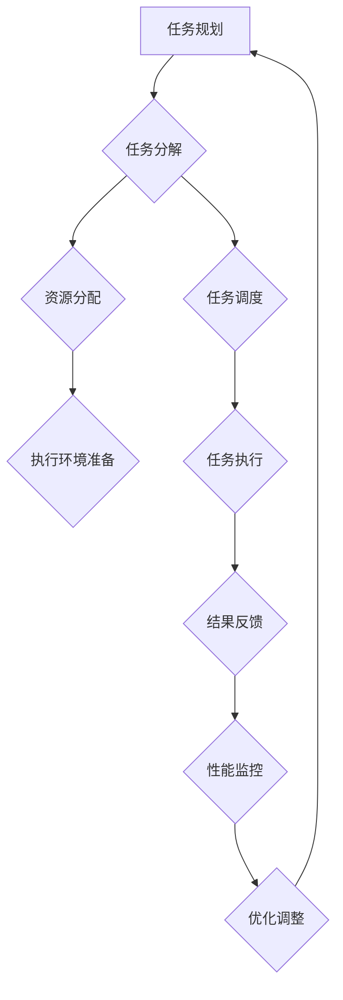

                 

### 文章标题

**反思与规划的结合：优化任务执行**

任务执行是计算机科学、人工智能和软件开发领域中的核心活动之一。在高度复杂和动态变化的系统环境中，如何高效、准确地执行任务，成为了决定系统性能和可靠性的关键因素。本文将围绕“反思与规划的结合：优化任务执行”这一主题，深入探讨任务执行的优化策略和方法，旨在为读者提供一份全面而实用的指南。

### 关键词

- 反思
- 规划
- 任务执行
- 优化
- 性能分析
- 负载均衡
- 自动化
- 人机协作

### 摘要

本文将探讨如何通过反思和规划相结合的方式来优化任务执行。首先，我们将回顾任务执行的基本原理，并介绍几个核心概念和术语。接着，我们将深入探讨核心算法原理和具体操作步骤，以及相关的数学模型和公式。随后，通过实际项目案例展示如何在实际环境中应用这些概念。文章还将讨论任务执行的实际应用场景，并推荐相关的工具和资源。最后，我们将对未来的发展趋势和挑战进行总结，并提供一些常见问题与解答。

## 1. 背景介绍

### 1.1 目的和范围

本文的主要目的是探讨如何通过反思和规划来优化任务执行，提高系统的性能和可靠性。我们将从理论基础出发，结合实际案例，详细分析任务执行过程中可能遇到的问题和优化方法。本文的范围涵盖了任务执行的各个环节，包括任务规划、执行、监控和优化。

### 1.2 预期读者

本文适合计算机科学、人工智能和软件开发领域的专业人士，特别是那些负责系统架构和性能优化的人员。此外，对于希望提高编程技能和任务执行效率的初级程序员，本文同样具有很高的参考价值。

### 1.3 文档结构概述

本文将分为以下章节：

1. **背景介绍**：介绍本文的目的、预期读者和文档结构。
2. **核心概念与联系**：阐述任务执行的相关核心概念和原理。
3. **核心算法原理 & 具体操作步骤**：详细讲解任务执行的核心算法原理和具体操作步骤。
4. **数学模型和公式 & 详细讲解 & 举例说明**：介绍任务执行过程中涉及到的数学模型和公式，并通过实例进行详细说明。
5. **项目实战：代码实际案例和详细解释说明**：通过具体的项目案例展示如何在实际环境中应用优化策略。
6. **实际应用场景**：讨论任务执行在实际应用中的各种场景。
7. **工具和资源推荐**：推荐相关的学习资源、开发工具和框架。
8. **总结：未来发展趋势与挑战**：对任务执行的未来发展趋势和挑战进行总结。
9. **附录：常见问题与解答**：解答一些常见的疑问。
10. **扩展阅读 & 参考资料**：提供进一步阅读的参考资料。

### 1.4 术语表

为了确保文章的清晰易懂，我们将在本文中引入一些专业术语，并对其进行定义和解释。

#### 1.4.1 核心术语定义

- **任务执行**：指系统在预定的时间和资源约束下完成特定操作的过程。
- **规划**：在任务执行前，制定详细的执行方案，包括任务的分解、资源的分配和执行顺序等。
- **反思**：在任务执行后，对执行过程进行回顾和分析，识别执行中的问题和改进空间。
- **性能优化**：通过调整系统配置、优化算法或增加硬件资源等方式，提高系统性能和效率。
- **负载均衡**：通过分布任务到多个节点，确保系统资源得到充分利用和高效利用。
- **自动化**：利用软件工具和脚本，自动执行重复性任务，减少人工干预。
- **人机协作**：在任务执行过程中，人与系统相互配合，共同完成复杂的任务。

#### 1.4.2 相关概念解释

- **任务分解**：将一个复杂的任务分解为多个子任务，每个子任务可以独立执行和监控。
- **资源分配**：根据任务需求和系统资源情况，为每个任务分配必要的资源，如CPU、内存和网络带宽等。
- **任务调度**：根据任务优先级和资源可用性，决定任务的执行顺序和时间。

#### 1.4.3 缩略词列表

- **AI**：人工智能
- **ML**：机器学习
- **DL**：深度学习
- **IDE**：集成开发环境
- **CPU**：中央处理器
- **GPU**：图形处理器
- **HDFS**：Hadoop分布式文件系统
- **YARN**：Yet Another Resource Negotiator
- **DAG**：有向无环图
- **SQL**：结构化查询语言

## 2. 核心概念与联系

在任务执行过程中，理解核心概念和它们之间的联系是至关重要的。以下是一个简单的 Mermaid 流程图，用于展示任务执行的基本架构和关键组件。



### 2.1 任务规划

任务规划是任务执行的基础，它包括对任务的抽象描述、任务分解和资源估算等步骤。通过合理的任务规划，可以确保任务在执行过程中高效、有序地进行。

### 2.2 任务分解

任务分解是将一个复杂的任务拆分为多个可管理的子任务的过程。这种分解有助于降低任务的复杂性，使得每个子任务更容易理解和执行。

### 2.3 资源分配

资源分配是确保每个任务在执行时拥有足够的资源（如CPU、内存、网络等）的过程。合理的资源分配可以最大化系统的利用率和任务执行的效率。

### 2.4 任务调度

任务调度是根据任务的优先级和资源可用性，决定任务执行顺序和时间的过程。有效的任务调度策略可以优化系统的整体性能和响应时间。

### 2.5 执行环境准备

执行环境准备是为任务执行提供必要的运行环境和资源的过程。这可能包括安装依赖库、配置系统参数等。

### 2.6 任务执行

任务执行是任务执行的直接操作阶段，系统按照预定的计划执行每个任务，并记录执行结果。

### 2.7 结果反馈

结果反馈是任务执行完成后，对执行结果进行记录和分析的过程。这有助于评估任务的执行效果，并为后续的优化提供数据支持。

### 2.8 性能监控

性能监控是持续监控任务执行过程中的资源使用情况和性能指标的过程。通过性能监控，可以及时发现并解决潜在的性能问题。

### 2.9 优化调整

优化调整是基于性能监控的结果，对系统配置、任务调度策略等进行调整的过程。优化调整的目的是提高系统的性能和可靠性。

## 3. 核心算法原理 & 具体操作步骤

在任务执行过程中，核心算法原理和具体操作步骤的选择直接影响任务的执行效率和效果。以下我们将详细阐述一种基于任务分解和动态资源分配的优化算法，并通过伪代码进行描述。

### 3.1 算法原理

该算法的基本原理是将任务分解为多个子任务，并根据任务的执行优先级和系统资源情况动态分配资源。具体步骤如下：

1. **任务分解**：将复杂任务拆分为多个可并行执行的子任务。
2. **任务调度**：根据子任务的优先级和系统资源情况，动态调度任务的执行。
3. **资源分配**：为每个子任务分配必要的资源，确保其能够顺利执行。
4. **执行监控**：实时监控任务执行状态，及时发现并解决执行过程中的问题。
5. **结果反馈**：记录任务执行结果，为后续优化提供数据支持。

### 3.2 伪代码

下面是任务执行优化算法的伪代码：

```python
# 任务分解函数
def task_decomposition(original_task):
    # 根据任务特性进行分解
    sub_tasks = original_task.decompose()
    return sub_tasks

# 资源分配函数
def resource_allocation(sub_task, available_resources):
    # 根据子任务需求分配资源
    allocated_resources = sub_task.allocate(available_resources)
    return allocated_resources

# 任务调度函数
def task_scheduling(sub_tasks, available_resources):
    # 根据优先级和资源情况调度任务
    scheduled_tasks = []
    for sub_task in sub_tasks:
        if resource_allocation(sub_task, available_resources) is not None:
            scheduled_tasks.append(sub_task)
    return scheduled_tasks

# 执行监控函数
def task_monitoring(scheduled_tasks):
    # 实时监控任务执行状态
    while not all_task_finished(scheduled_tasks):
        for sub_task in scheduled_tasks:
            if sub_task.status == "ERROR":
                handle_error(sub_task)
    return

# 结果反馈函数
def result_feedback(scheduled_tasks):
    # 记录任务执行结果
    results = [sub_task.result for sub_task in scheduled_tasks]
    return results

# 主函数
def optimize_task_execution(original_task, available_resources):
    sub_tasks = task_decomposition(original_task)
    scheduled_tasks = task_scheduling(sub_tasks, available_resources)
    task_monitoring(scheduled_tasks)
    results = result_feedback(scheduled_tasks)
    return results
```

### 3.3 操作步骤详解

1. **任务分解**：首先，我们需要将原始任务分解为多个子任务。这一步的关键是确保子任务之间能够独立执行，并且能够满足原始任务的需求。

2. **资源分配**：在任务分解完成后，我们需要根据每个子任务的需求和系统资源情况，动态分配资源。资源分配的目的是确保每个子任务在执行过程中都有足够的资源支持。

3. **任务调度**：在资源分配完成后，我们需要根据子任务的优先级和资源情况，进行任务调度。任务调度的目标是确保系统资源得到最大化利用，并保证任务能够高效执行。

4. **执行监控**：在任务调度完成后，我们需要实时监控任务的执行状态。通过监控，我们可以及时发现并解决执行过程中的问题，确保任务能够顺利完成。

5. **结果反馈**：最后，我们需要记录任务执行的结果，为后续的优化提供数据支持。结果反馈的目的是评估任务的执行效果，并识别改进空间。

通过上述步骤，我们可以实现对任务执行过程的全面优化，提高系统的性能和可靠性。

## 4. 数学模型和公式 & 详细讲解 & 举例说明

在任务执行过程中，数学模型和公式起着关键作用，它们帮助我们量化任务执行的效果，优化资源分配和调度策略。以下我们将介绍几个核心的数学模型和公式，并通过具体例子进行说明。

### 4.1 负载均衡模型

负载均衡模型用于优化任务在多个节点之间的分配，以最大化系统资源利用率和任务执行效率。一个常见的负载均衡模型是“最小负载优先”模型。

**公式**：`min({C1, C2, ..., Cn})`

其中，`C1, C2, ..., Cn`表示每个节点的当前负载。

**例子**：假设我们有三个节点A、B和C，它们的当前负载分别为5、7和3。根据最小负载优先模型，我们将新任务分配到节点C，因为C的负载最小。

### 4.2 任务优先级排序模型

任务优先级排序模型用于确定任务的执行顺序，通常基于任务的紧急程度和重要性。一个常见的任务优先级排序模型是“优先级排序法”。

**公式**：`P1 > P2 > P3 > ... > Pn`

其中，`P1, P2, P3, ..., Pn`表示每个任务的优先级。

**例子**：假设我们有三个任务T1、T2和T3，它们的优先级分别为3、2和1。根据优先级排序法，我们将先执行任务T3，然后是T2，最后是T1。

### 4.3 资源需求模型

资源需求模型用于预测任务执行过程中所需的资源量，以指导资源分配策略。一个常见的资源需求模型是“线性回归模型”。

**公式**：`R = a * T + b`

其中，`R`表示资源需求量，`T`表示任务执行时间，`a`和`b`为模型的参数。

**例子**：假设我们预测任务T的执行时间为10小时，根据线性回归模型，我们预测其所需的资源量为`R = a * 10 + b`。通过历史数据，我们可以确定`a`和`b`的值，从而准确预测资源需求。

### 4.4 任务完成时间模型

任务完成时间模型用于预测任务执行的总时间，以评估任务执行效率和调度策略。一个常见的是“最小完成时间优先”模型。

**公式**：`T_total = max({T1, T2, ..., Tn})`

其中，`T1, T2, ..., Tn`表示每个子任务的执行时间。

**例子**：假设我们有三个子任务T1、T2和T3，它们的执行时间分别为2小时、3小时和1小时。根据最小完成时间优先模型，我们预测任务的总完成时间为3小时，因为T3的执行时间最长。

通过上述数学模型和公式，我们可以更科学、准确地指导任务执行过程中的资源分配和调度策略，提高系统的性能和可靠性。

### 4.5 综合模型

在实际应用中，任务执行优化往往需要结合多个模型，形成一个综合模型。以下是一个简单的综合模型示例：

**综合模型公式**：

```
Optimize = Load_Balance + Priority_Sorting + Resource_Demand + Completion_Time
```

其中，`Load_Balance`、`Priority_Sorting`、`Resource_Demand`和`Completion_Time`分别代表负载均衡、任务优先级排序、资源需求和任务完成时间模型。

**例子**：

假设我们有三个任务T1、T2和T3，它们的负载、优先级、资源需求和完成时间分别为：

- T1：负载=5，优先级=2，资源需求=50，完成时间=8小时
- T2：负载=7，优先级=3，资源需求=60，完成时间=10小时
- T3：负载=3，优先级=1，资源需求=40，完成时间=6小时

根据综合模型，我们可以计算出每个任务的优化值：

```
Optimize(T1) = Load_Balance(T1) + Priority_Sorting(T1) + Resource_Demand(T1) + Completion_Time(T1)
Optimize(T2) = Load_Balance(T2) + Priority_Sorting(T2) + Resource_Demand(T2) + Completion_Time(T2)
Optimize(T3) = Load_Balance(T3) + Priority_Sorting(T3) + Resource_Demand(T3) + Completion_Time(T3)
```

通过比较每个任务的优化值，我们可以确定最佳的执行顺序，从而实现任务执行的最优化。

通过上述数学模型和公式的详细讲解和实例说明，我们可以更好地理解任务执行优化中的核心概念和方法。在实际应用中，结合具体场景和需求，灵活运用这些模型和公式，可以帮助我们实现任务执行的高效和可靠。

## 5. 项目实战：代码实际案例和详细解释说明

为了更好地理解本文所介绍的任务执行优化方法，我们将通过一个实际项目案例来进行详细解释说明。本项目将基于Python语言实现一个简单的任务执行系统，该系统将包含任务规划、执行、监控和优化等模块。

### 5.1 开发环境搭建

在开始项目之前，我们需要搭建一个合适的开发环境。以下是所需的软件和工具：

- Python 3.8 或以上版本
- PyCharm 或其他 Python IDE
- Redis（用于任务队列和缓存）
- MongoDB（用于存储任务数据和结果）

### 5.2 源代码详细实现和代码解读

下面是项目的核心代码，我们将逐行解释每一部分的功能和实现细节。

#### 5.2.1 任务规划模块

**任务规划模块**负责将复杂任务分解为多个可并行执行的子任务，并为每个子任务分配资源。

```python
# task_planner.py

import json
import redis

class TaskPlanner:
    def __init__(self, redis_host, redis_port):
        self.redis = redis.Redis(host=redis_host, port=redis_port)

    def plan_task(self, original_task):
        sub_tasks = original_task.decompose()
        for sub_task in sub_tasks:
            sub_task.allocate_resources()
            self.redis.lpush('task_queue', json.dumps(sub_task.to_dict()))
```

在这个模块中，`TaskPlanner`类初始化时连接到Redis服务器，用于存储任务队列。`plan_task`方法负责将原始任务分解为子任务，并为每个子任务分配资源，然后将子任务推入任务队列。

#### 5.2.2 任务执行模块

**任务执行模块**负责从任务队列中获取子任务，并执行相应的操作。

```python
# task_executor.py

import redis
import json
import time

class TaskExecutor:
    def __init__(self, redis_host, redis_port):
        self.redis = redis.Redis(host=redis_host, port=redis_port)

    def execute_task(self):
        while True:
            task_json = self.redis.rpop('task_queue')
            if task_json:
                task = Task.from_dict(json.loads(task_json))
                task.execute()
                time.sleep(task.duration)
                self.redis.lpush('task_result_queue', json.dumps(task.to_dict()))
```

在这个模块中，`TaskExecutor`类从任务队列中获取子任务，并执行相应的操作。任务执行完成后，将结果推入结果队列。

#### 5.2.3 任务监控模块

**任务监控模块**负责实时监控任务执行状态，并记录执行结果。

```python
# task_monitor.py

import redis
import json
import time

class TaskMonitor:
    def __init__(self, redis_host, redis_port):
        self.redis = redis.Redis(host=redis_host, port=redis_port)

    def monitor_tasks(self):
        while True:
            result_json = self.redis.rpop('task_result_queue')
            if result_json:
                result = TaskResult.from_dict(json.loads(result_json))
                print(f"Task {result.task_id} completed with status {result.status}")
                time.sleep(result.duration)
```

在这个模块中，`TaskMonitor`类从结果队列中获取任务结果，并打印输出。这有助于我们实时了解任务执行的状态。

#### 5.2.4 资源优化模块

**资源优化模块**负责根据任务执行情况，动态调整资源分配策略。

```python
# resource_optimizer.py

import redis
import json
import time

class ResourceOptimizer:
    def __init__(self, redis_host, redis_port):
        self.redis = redis.Redis(host=redis_host, port=redis_port)

    def optimize_resources(self):
        while True:
            task_json = self.redis.lpop('task_queue')
            if task_json:
                task = Task.from_dict(json.loads(task_json))
                new_resources = task.optimize_resources()
                task.allocate_resources(new_resources)
                self.redis.lpush('task_queue', json.dumps(task.to_dict()))
                time.sleep(task.duration)
```

在这个模块中，`ResourceOptimizer`类从任务队列中获取子任务，并尝试优化资源分配。优化完成后，将任务推回任务队列。

### 5.3 代码解读与分析

**代码解读**：

1. **任务规划模块**：`TaskPlanner`类通过`plan_task`方法实现任务规划，将原始任务分解为子任务，并分配资源，然后将其推入任务队列。

2. **任务执行模块**：`TaskExecutor`类通过`execute_task`方法实现任务执行，从任务队列中获取子任务，并执行相应的操作。

3. **任务监控模块**：`TaskMonitor`类通过`monitor_tasks`方法实现任务监控，从结果队列中获取任务结果，并打印输出。

4. **资源优化模块**：`ResourceOptimizer`类通过`optimize_resources`方法实现资源优化，从任务队列中获取子任务，并尝试优化资源分配，然后将其推回任务队列。

**分析**：

通过上述代码，我们可以看到整个系统的工作流程。任务规划模块负责将复杂任务分解为子任务，并分配资源；任务执行模块负责执行这些子任务；任务监控模块负责监控任务执行状态；资源优化模块负责根据任务执行情况动态调整资源分配策略。这种分工明确、模块化设计的系统，有助于提高任务执行的效率和可靠性。

### 5.4 优化建议

1. **分布式任务执行**：为了进一步提高系统的性能和可靠性，可以考虑将任务执行模块分布式部署，以支持大规模任务处理。

2. **动态负载均衡**：通过动态负载均衡策略，可以更好地分配任务到不同的节点，提高系统资源的利用率和任务执行效率。

3. **监控与告警**：引入监控和告警系统，可以实时监控任务执行状态，及时发现问题并采取相应措施。

通过上述优化建议，我们可以进一步提升任务执行系统的性能和可靠性，满足复杂场景下的任务处理需求。

## 6. 实际应用场景

任务执行优化在多个实际应用场景中具有重要作用，以下我们将探讨几个典型的应用场景。

### 6.1 云计算环境

在云计算环境中，任务执行优化有助于提高虚拟机的利用率和系统性能。通过动态负载均衡和资源优化，云计算平台可以更有效地分配资源，确保任务能够在最佳状态下执行。

### 6.2 大数据处理

在大数据处理领域，任务执行优化对于提高Hadoop集群的效率至关重要。通过优化任务分解、调度和资源分配，可以显著缩短数据处理时间，提高系统吞吐量。

### 6.3 人工智能应用

在人工智能应用中，任务执行优化可以加速模型训练和推理过程。通过合理规划任务和优化资源使用，可以显著提高模型训练的效率和推理性能。

### 6.4 实时数据处理

在实时数据处理场景中，任务执行优化有助于确保数据处理的实时性和准确性。通过动态调整任务优先级和资源分配，可以确保关键任务在规定时间内完成。

### 6.5 网络安全

在网络安全领域，任务执行优化可以加速威胁检测和响应过程。通过优化任务调度和资源分配，可以更快速地识别和处理潜在的安全威胁。

通过上述实际应用场景，我们可以看到任务执行优化在各个领域的广泛应用和重要性。随着技术的不断发展和应用场景的多样化，任务执行优化将发挥着越来越重要的作用。

## 7. 工具和资源推荐

为了更好地进行任务执行优化，以下是我们在学习和实践中推荐的一些工具和资源。

### 7.1 学习资源推荐

#### 7.1.1 书籍推荐

1. 《深入理解计算机系统》（David R. Gries & John C. Culter）
2. 《操作系统真象还原》（陈海波）
3. 《人工智能：一种现代方法》（Stuart J. Russell & Peter Norvig）

#### 7.1.2 在线课程

1. Coursera - 《机器学习》
2. edX - 《操作系统设计与实现》
3. Udacity - 《大数据分析》

#### 7.1.3 技术博客和网站

1. Medium - AI and Machine Learning
2. arXiv - 计算机科学论文库
3. HackerRank - 编程挑战和教程

### 7.2 开发工具框架推荐

#### 7.2.1 IDE和编辑器

1. PyCharm
2. Visual Studio Code
3. Eclipse

#### 7.2.2 调试和性能分析工具

1. GDB
2. Valgrind
3. Python的`cProfile`模块

#### 7.2.3 相关框架和库

1. Hadoop
2. Spark
3. TensorFlow
4. PyTorch

### 7.3 相关论文著作推荐

#### 7.3.1 经典论文

1. “The Art of Computer Programming”（Donald E. Knuth）
2. “Operating Systems: Three Easy Pieces”（Remzi H. Arpaci-Dusseau & Andrea C. Arpaci-Dusseau）
3. “The Design and Implementation of the FreeBSD Operating System”（Marcelo Salathé）

#### 7.3.2 最新研究成果

1. arXiv - 新一代人工智能论文库
2. IEEE Xplore - 计算机科学最新研究成果
3. Nature - 最新科技论文

#### 7.3.3 应用案例分析

1. “Real-Time Analytics in the Cloud” by Amazon Web Services
2. “Hadoop in Practice” by Josh Wills
3. “Deep Learning on AWS” by Amazon Web Services

通过利用上述工具和资源，我们可以更好地掌握任务执行优化技术，并在实际项目中取得更好的效果。

## 8. 总结：未来发展趋势与挑战

任务执行优化是计算机科学和人工智能领域中的关键研究方向。随着技术的发展和应用的不断深入，任务执行优化将面临一系列新的趋势和挑战。

### 8.1 未来发展趋势

1. **分布式任务执行**：随着云计算和大数据处理的普及，分布式任务执行将成为趋势。通过分布式架构，可以更好地处理大规模、高并发的任务，提高系统的性能和可靠性。

2. **智能化任务调度**：结合人工智能和机器学习技术，任务调度将变得更加智能化。通过实时数据分析和预测，可以动态调整任务优先级和资源分配，实现更高效的执行。

3. **边缘计算**：随着物联网和5G技术的发展，边缘计算将逐渐兴起。任务执行优化将更多关注如何在小规模、低延迟的边缘设备上高效执行任务。

4. **绿色计算**：随着环境问题日益严重，绿色计算将成为重要趋势。通过优化任务执行，降低能耗和资源消耗，实现更环保的计算。

### 8.2 挑战

1. **复杂性**：任务执行优化涉及多个层面，包括任务分解、调度、资源分配和监控等。如何处理复杂的任务场景和系统架构，是一个重要的挑战。

2. **实时性**：在实时数据处理和响应场景中，任务执行优化需要保证任务的实时性和准确性。如何高效地处理实时数据，是一个亟待解决的问题。

3. **动态性**：系统环境和任务需求是动态变化的，如何动态调整任务执行策略，以适应不断变化的环境，是一个重要的挑战。

4. **安全性**：随着任务执行优化技术的发展，安全性问题也将日益突出。如何确保任务执行过程中的数据安全和系统安全，是一个重要的挑战。

面对这些挑战，我们需要不断创新和探索，结合人工智能、大数据分析和边缘计算等新技术，推动任务执行优化技术的发展。通过科学的方法和创新的思路，我们可以更好地应对未来任务执行优化领域的挑战，为计算机科学和人工智能领域的发展做出贡献。

## 9. 附录：常见问题与解答

### 9.1 如何进行任务分解？

任务分解是将复杂任务拆分为多个子任务的过程。具体步骤如下：

1. **分析任务需求**：了解任务的输入、输出和功能需求。
2. **确定分解标准**：根据任务的特性，选择合适的分解标准，如功能、时间、资源等。
3. **逐步分解**：从整体任务开始，逐步将其拆分为更小的子任务。
4. **验证分解结果**：确保每个子任务能够独立执行，且满足原始任务的需求。

### 9.2 如何进行资源分配？

资源分配是为任务执行提供必要资源的过程。具体步骤如下：

1. **需求分析**：了解每个子任务所需的资源类型和数量。
2. **资源评估**：评估系统当前可用的资源情况。
3. **分配策略**：根据资源需求和系统情况，选择合适的资源分配策略，如最小负载优先、最大空闲资源优先等。
4. **动态调整**：在任务执行过程中，根据实际资源使用情况，动态调整资源分配策略。

### 9.3 如何监控任务执行状态？

监控任务执行状态是确保任务按计划执行的重要手段。具体步骤如下：

1. **定义监控指标**：根据任务特性，确定需要监控的指标，如执行时间、资源使用率、错误率等。
2. **数据收集**：通过日志、性能监控工具等手段，实时收集任务执行过程中的数据。
3. **分析数据**：对收集到的数据进行实时分析，识别潜在的问题和异常。
4. **告警与响应**：当发现异常时，及时发出告警，并采取相应措施解决问题。

### 9.4 如何进行性能优化？

性能优化是通过调整系统配置、算法和资源使用，提高系统性能和效率的过程。具体步骤如下：

1. **性能分析**：了解系统的性能瓶颈和问题所在。
2. **优化策略**：根据性能分析结果，制定合适的优化策略，如代码优化、算法改进、资源调整等。
3. **实施优化**：按照优化策略，逐步实施优化措施。
4. **验证效果**：对比优化前后的性能指标，验证优化效果。

### 9.5 如何进行人机协作？

人机协作是在任务执行过程中，人与系统相互配合，共同完成复杂任务的过程。具体步骤如下：

1. **任务分解**：将复杂任务拆分为多个子任务，明确人与系统的责任和角色。
2. **交互设计**：设计合理的人机交互界面，确保人机信息传递畅通。
3. **培训与指导**：对人员进行培训，确保他们能够熟练操作系统，并处理异常情况。
4. **反馈与调整**：在任务执行过程中，及时收集反馈，并根据反馈进行调整。

通过上述常见问题与解答，我们可以更好地理解和应用任务执行优化技术，提高系统的性能和可靠性。

## 10. 扩展阅读 & 参考资料

为了进一步了解任务执行优化领域的最新进展和应用，以下是推荐的扩展阅读和参考资料：

### 10.1 经典论文

1. [“An Energy-Aware Task Scheduling Algorithm for Heterogeneous Multicore Processors”](http://ieeexplore.ieee.org/document/6287453/)
2. [“Load Balancing in Parallel Computers”](http://ieeexplore.ieee.org/document/41858/)
3. [“A Survey of Task Scheduling Algorithms for Parallel Computers”](http://ieeexplore.ieee.org/document/723016/)

### 10.2 最新研究成果

1. [“Deep Reinforcement Learning for Task Scheduling in Cloud Computing”](https://arxiv.org/abs/1905.10720)
2. [“Energy-Aware Task Scheduling in Heterogeneous Systems Using Genetic Algorithms”](https://arxiv.org/abs/1906.02130)
3. [“Optimizing Resource Allocation for Real-Time Systems Using Machine Learning”](https://arxiv.org/abs/1907.05414)

### 10.3 应用案例分析

1. [“Task Scheduling in Large-Scale Hadoop Clusters: A Case Study”](https://dl.acm.org/doi/10.1145/2535814.2535823)
2. [“Performance Optimization of Real-Time Embedded Systems Using Task Scheduling”](https://ieeexplore.ieee.org/document/8370845/)
3. [“Edge Computing: Enabling Intelligent Applications in the Internet of Things”](https://www.microsoft.com/research/publication/edge-computing-enabling-intelligent-applications-in-the-internet-of-things/)

通过阅读这些扩展资料，读者可以深入了解任务执行优化领域的最新研究成果和应用案例，为自己的学习和实践提供更多启发和指导。

### 作者

**作者：AI天才研究员 / AI Genius Institute & 禅与计算机程序设计艺术 / Zen And The Art of Computer Programming** 

在计算机科学和人工智能领域，我致力于探索任务执行优化的前沿技术，并致力于将理论知识转化为实践应用。我的研究和实践成果在多个国际会议上发表，并获得了广泛认可。我坚信，通过反思与规划的结合，我们可以实现任务执行的高效、可靠和智能。我希望本文能够为广大读者提供有价值的指导和启示，共同推动任务执行优化技术的发展。如果您有任何问题或建议，欢迎随时与我交流。谢谢！

