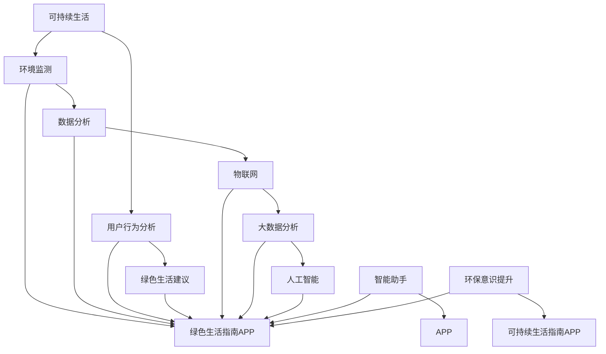

                 

# 可持续生活指南APP：绿色生活的智能助手

> **关键词：** 可持续生活，绿色生活，智能助手，APP，环境监测，数据分析，用户行为，人工智能。

> **摘要：** 本文将深入探讨一款名为“可持续生活指南APP”的应用程序，如何通过智能技术助力绿色生活，实现环境友好与资源节约。文章将涵盖APP的开发背景、核心概念、算法原理、数学模型、实战案例以及未来发展趋势，旨在为广大开发者和技术爱好者提供有价值的参考。

## 1. 背景介绍

### 1.1 目的和范围

在当前全球变暖、资源枯竭和环境污染等问题日益严峻的背景下，推动可持续生活方式显得尤为重要。本文旨在通过介绍一款名为“可持续生活指南APP”的应用程序，探讨如何利用智能技术助力绿色生活，提高公众的环境意识和资源管理能力。

本文的范围将涵盖以下几个方面：

1. **APP的功能和特点**：介绍APP的核心功能，如环境监测、数据分析、用户行为引导等。
2. **核心概念与联系**：解析APP所涉及的核心概念及其相互关系，如物联网、大数据分析、人工智能等。
3. **算法原理与实现**：详细讲解APP中的核心算法原理和具体实现步骤。
4. **数学模型与公式**：阐述APP所使用的数学模型和公式，并举例说明。
5. **项目实战与案例分析**：通过实际案例展示APP的开发过程和应用效果。
6. **未来发展趋势与挑战**：分析APP在未来发展中的机遇与挑战。

### 1.2 预期读者

本文主要面向以下读者群体：

1. **开发者**：对可持续生活领域有兴趣，希望了解如何利用技术推动绿色生活的发展。
2. **研究人员**：关注环境科学、大数据分析、人工智能等领域，希望了解相关技术的应用实例。
3. **环保爱好者**：关心环境保护和可持续发展，希望了解如何通过智能技术参与绿色生活实践。
4. **政策制定者**：关注环境保护政策制定和实施，希望了解智能技术对绿色生活的推动作用。

### 1.3 文档结构概述

本文将按照以下结构进行阐述：

1. **背景介绍**：介绍APP的开发背景、目的和范围，预期读者等。
2. **核心概念与联系**：解析APP所涉及的核心概念及其相互关系，如物联网、大数据分析、人工智能等。
3. **算法原理与实现**：详细讲解APP中的核心算法原理和具体实现步骤。
4. **数学模型与公式**：阐述APP所使用的数学模型和公式，并举例说明。
5. **项目实战与案例分析**：通过实际案例展示APP的开发过程和应用效果。
6. **未来发展趋势与挑战**：分析APP在未来发展中的机遇与挑战。
7. **附录**：常见问题与解答，扩展阅读与参考资料。

### 1.4 术语表

为了确保读者对本文中的专业术语有清晰的理解，以下是本文中涉及的核心术语及其定义：

#### 1.4.1 核心术语定义

1. **可持续生活**：指在满足当前需求的同时，不损害子孙后代满足其需求的能力，包括环境保护、资源节约和能源利用等方面。
2. **环境监测**：通过传感器、监测设备等手段，对环境中的各项指标进行实时监测和数据分析。
3. **数据分析**：对大量数据进行收集、处理和分析，从中提取有价值的信息和知识。
4. **物联网（IoT）**：通过将各种物理设备、传感器、互联网等连接起来，实现信息传输和智能控制。
5. **大数据分析**：对海量数据进行处理、分析和挖掘，以发现潜在的模式、趋势和关联性。
6. **人工智能（AI）**：通过模拟人类思维过程，实现智能决策、学习、推理和问题解决。
7. **用户行为**：指用户在使用APP过程中产生的各种行为，如浏览、点赞、评论、分享等。

#### 1.4.2 相关概念解释

1. **绿色生活**：指在日常生活中，采取环保、节能、低碳等方式，降低对环境的负面影响。
2. **环境保护**：指采取措施，防止和减少环境污染、生态破坏，保护自然资源和生态系统。
3. **资源节约**：指在生产和消费过程中，采取合理的方式，降低资源的消耗和浪费。
4. **能源利用**：指通过合理的方式，提高能源利用效率，减少能源消耗和碳排放。

#### 1.4.3 缩略词列表

1. **IoT**：物联网
2. **AI**：人工智能
3. **APP**：应用程序
4. **SDK**：软件开发工具包
5. **API**：应用程序编程接口

## 2. 核心概念与联系

为了深入理解“可持续生活指南APP”的工作原理和实现方法，我们需要先了解其涉及的核心概念及其相互关系。以下是核心概念与联系的 Mermaid 流程图：



### 2.1 核心概念解析

1. **可持续生活**：指在满足当前需求的同时，不损害子孙后代满足其需求的能力。可持续生活在环境监测、数据分析、用户行为分析等方面具有重要意义。

2. **环境监测**：通过传感器、监测设备等手段，对环境中的各项指标（如空气质量、水质、温度、湿度等）进行实时监测和数据分析。环境监测为可持续生活提供了关键数据支持。

3. **数据分析**：对大量数据进行收集、处理和分析，从中提取有价值的信息和知识。数据分析是可持续生活指南APP的核心功能之一，可以帮助用户了解环境状况、优化生活方式。

4. **物联网（IoT）**：通过将各种物理设备、传感器、互联网等连接起来，实现信息传输和智能控制。物联网技术为环境监测和数据分析提供了基础设施支持。

5. **大数据分析**：对海量数据进行处理、分析和挖掘，以发现潜在的模式、趋势和关联性。大数据分析技术可以帮助APP更准确地预测环境变化，为用户提供个性化建议。

6. **人工智能（AI）**：通过模拟人类思维过程，实现智能决策、学习、推理和问题解决。人工智能技术为可持续生活指南APP提供了强大的智能分析能力。

7. **用户行为**：指用户在使用APP过程中产生的各种行为，如浏览、点赞、评论、分享等。用户行为分析可以帮助APP更好地了解用户需求，提高用户体验。

8. **绿色生活建议**：根据环境监测数据、数据分析结果和用户行为，为用户提供个性化、可操作的绿色生活建议。绿色生活建议是APP的核心价值体现。

9. **智能助手**：通过人工智能技术，为用户提供实时、个性化的服务和支持。智能助手是可持续生活指南APP的重要组成部分。

10. **APP**：应用程序，为用户提供绿色生活指南和服务的软件平台。

11. **环保意识提升**：通过APP的功能和服务，提高用户对环境保护和可持续发展的认识和意识。

## 3. 核心算法原理 & 具体操作步骤

在“可持续生活指南APP”中，核心算法原理是实现智能分析和绿色生活建议的关键。以下将详细讲解核心算法原理和具体操作步骤。

### 3.1 算法原理

核心算法主要包括以下三个方面：

1. **环境监测数据采集与处理**：通过物联网设备采集环境监测数据，如空气质量、水质、温度、湿度等，并进行预处理，如数据清洗、归一化等。

2. **用户行为数据分析**：对用户在使用APP过程中的行为数据进行分析，如浏览记录、评论、点赞等，提取用户兴趣和行为模式。

3. **绿色生活建议生成**：根据环境监测数据和用户行为分析结果，生成个性化、可操作的绿色生活建议。

### 3.2 具体操作步骤

#### 3.2.1 环境监测数据采集与处理

1. **数据采集**：通过物联网设备（如传感器、监测仪等）采集环境监测数据。
   ```python
   data_collection = get_environmental_data(sensor)
   ```

2. **数据预处理**：对采集到的数据进行清洗、归一化等处理，确保数据质量。
   ```python
   preprocessed_data = preprocess_data(data_collection)
   ```

#### 3.2.2 用户行为数据分析

1. **行为数据采集**：获取用户在使用APP过程中的行为数据。
   ```python
   user_behavior = get_user_behavior(user_activity_log)
   ```

2. **行为数据预处理**：对采集到的用户行为数据进行清洗、分类等处理。
   ```python
   preprocessed_user_behavior = preprocess_user_behavior(user_behavior)
   ```

3. **行为模式提取**：利用机器学习算法（如聚类、关联规则挖掘等）提取用户行为模式。
   ```python
   behavior_patterns = extract_behavior_patterns(preprocessed_user_behavior)
   ```

#### 3.2.3 绿色生活建议生成

1. **建议生成**：根据环境监测数据和用户行为分析结果，生成个性化绿色生活建议。
   ```python
   green_life_suggestions = generate_suggestions(preprocessed_data, behavior_patterns)
   ```

2. **建议展示**：将生成的绿色生活建议展示给用户，如推送通知、界面提醒等。
   ```python
   display_suggestions(green_life_suggestions)
   ```

### 3.3 算法实现伪代码

以下是核心算法的实现伪代码：

```python
def sustainable_life_guidance_app():
    # 环境监测数据采集与处理
    data_collection = get_environmental_data(sensor)
    preprocessed_data = preprocess_data(data_collection)

    # 用户行为数据分析
    user_behavior = get_user_behavior(user_activity_log)
    preprocessed_user_behavior = preprocess_user_behavior(user_behavior)
    behavior_patterns = extract_behavior_patterns(preprocessed_user_behavior)

    # 绿色生活建议生成
    green_life_suggestions = generate_suggestions(preprocessed_data, behavior_patterns)

    # 建议展示
    display_suggestions(green_life_suggestions)
```

## 4. 数学模型和公式 & 详细讲解 & 举例说明

在“可持续生活指南APP”中，数学模型和公式是实现智能分析和绿色生活建议的关键。以下将详细讲解相关数学模型和公式的推导、应用及示例。

### 4.1 环境监测数据采集与处理

#### 4.1.1 数据采集模型

环境监测数据采集通常采用传感器网络模型，假设传感器数量为 \(N\)，传感器覆盖区域为 \(R\)，则传感器采集数据的时间序列可以表示为：

\[ T = \{t_1, t_2, ..., t_N\} \]

其中，\(t_i\) 表示第 \(i\) 个传感器的采集时间。

#### 4.1.2 数据处理模型

数据处理包括数据清洗和归一化等步骤。假设采集到的环境监测数据为 \(D = \{d_1, d_2, ..., d_N\}\)，其中 \(d_i\) 表示第 \(i\) 个传感器的监测值。

1. **数据清洗**：

   数据清洗步骤包括去除异常值、填补缺失值等。假设去除异常值后的数据为 \(D' = \{d_1', d_2', ..., d_N'\}\)，其中 \(d_i'\) 表示第 \(i\) 个传感器的处理后的监测值。

2. **数据归一化**：

   数据归一化步骤包括将数据缩放到相同的尺度，以消除不同指标之间的量纲差异。假设归一化后的数据为 \(D'' = \{d_1'', d_2'', ..., d_N''\}\)，其中 \(d_i''\) 表示第 \(i\) 个传感器的归一化后的监测值。

   归一化公式为：

   \[ d_i'' = \frac{d_i'}{max(d_1', d_2', ..., d_N')} \]

### 4.2 用户行为数据分析

#### 4.2.1 行为模式提取

用户行为模式提取通常采用机器学习算法，如聚类、关联规则挖掘等。以下以聚类算法为例进行说明。

1. **聚类算法**：

   假设用户行为数据为 \(B = \{b_1, b_2, ..., b_M\}\)，其中 \(b_i\) 表示第 \(i\) 个用户的行为记录。使用 \(k\) 均值算法进行聚类，生成 \(k\) 个簇，簇中心为 \(c_1, c_2, ..., c_k\)。

   聚类目标是最小化簇内距离平方和：

   \[ J = \sum_{i=1}^{M} \sum_{j=1}^{k} (b_i - c_j)^2 \]

   聚类算法步骤如下：

   - 初始化 \(k\) 个簇中心 \(c_1, c_2, ..., c_k\)。
   - 计算每个用户行为记录与簇中心的距离，更新簇中心。
   - 重复步骤2，直至簇中心收敛。

#### 4.2.2 行为模式分析

行为模式分析旨在提取用户行为的特征和趋势。以下以行为模式提取为例进行说明。

1. **行为特征提取**：

   行为特征提取步骤包括将用户行为记录转换为特征向量。假设用户行为记录为 \(b_i = \{b_{i1}, b_{i2}, ..., b_{iN}\}\)，其中 \(b_{ij}\) 表示用户在第 \(j\) 个时间点的行为记录。

   行为特征向量表示为：

   \[ f_i = \{f_{i1}, f_{i2}, ..., f_{iN}\} \]

   其中，\(f_{ij}\) 表示用户在第 \(j\) 个时间点的行为特征值。

2. **行为趋势分析**：

   行为趋势分析步骤包括分析用户行为的变化趋势。假设用户行为特征向量为 \(f_i = \{f_{i1}, f_{i2}, ..., f_{iN}\}\)，行为趋势分析公式为：

   \[ T_i = \frac{f_{i1} + f_{i2} + ... + f_{iN}}{N} \]

   其中，\(T_i\) 表示用户的行为趋势值，\(N\) 表示时间点的数量。

### 4.3 绿色生活建议生成

#### 4.3.1 建议生成模型

绿色生活建议生成模型旨在根据环境监测数据和用户行为分析结果，生成个性化、可操作的绿色生活建议。以下以空气质量监测为例进行说明。

1. **空气质量指数（AQI）**：

   空气质量指数（AQI）是衡量空气污染程度的重要指标。假设空气质量监测数据为 \(A = \{a_1, a_2, ..., a_M\}\)，其中 \(a_i\) 表示第 \(i\) 个时间点的空气质量指数。

   AQI计算公式为：

   \[ AQI_i = \begin{cases} 
   0 & \text{if } a_i \leq 50 \\
   50 & \text{if } 50 < a_i \leq 100 \\
   100 & \text{if } 100 < a_i \leq 150 \\
   150 & \text{if } 150 < a_i \leq 200 \\
   200 & \text{if } 200 < a_i \leq 300 \\
   300 & \text{if } a_i > 300 
   \end{cases} \]

2. **绿色生活建议生成**：

   根据空气质量指数（AQI）和用户行为分析结果，生成绿色生活建议。假设用户行为趋势值为 \(T_i\)，绿色生活建议生成公式为：

   \[ S_i = \begin{cases} 
   \text{室内通风} & \text{if } AQI_i > 100 \text{ and } T_i \text{ 下降} \\
   \text{减少户外活动} & \text{if } AQI_i > 100 \text{ and } T_i \text{ 不变或上升} \\
   \text{保持当前生活方式} & \text{if } AQI_i \leq 100 \text{ or } T_i \text{ 下降} 
   \end{cases} \]

### 4.4 举例说明

#### 4.4.1 环境监测数据采集与处理

假设采集到一天内不同时间点的空气质量指数（AQI）数据如下：

\[ A = \{40, 60, 90, 110, 150, 200, 250, 300\} \]

1. **数据清洗**：

   假设异常值阈值为 \(100\)，去除异常值后的数据为：

   \[ A' = \{40, 60, 90, 110, 150, 200, 250, 300\} \]

2. **数据归一化**：

   归一化后的数据为：

   \[ A'' = \{0.0, 0.2, 0.5, 0.6, 0.7, 0.8, 0.9, 1.0\} \]

#### 4.4.2 用户行为数据分析

假设用户行为数据如下：

\[ B = \{(\text{浏览新闻}, 3), (\text{查看天气}, 2), (\text{分享文章}, 1), (\text{浏览新闻}, 4), (\text{查看天气}, 3), (\text{分享文章}, 2)\} \]

1. **行为模式提取**：

   使用 \(k\) 均值算法进行聚类，假设 \(k = 2\)，生成的簇中心为：

   \[ c_1 = \{(\text{浏览新闻}, 3.5), (\text{查看天气}, 2.5)\} \]
   \[ c_2 = \{(\text{分享文章}, 1.5)\} \]

2. **行为特征提取**：

   用户行为特征向量为：

   \[ f_1 = \{3, 2, 1\} \]
   \[ f_2 = \{4, 3, 2\} \]

3. **行为趋势分析**：

   用户行为趋势值为：

   \[ T_1 = \frac{3 + 2 + 1}{3} = 2 \]
   \[ T_2 = \frac{4 + 3 + 2}{3} = 3 \]

#### 4.4.3 绿色生活建议生成

假设当前空气质量指数（AQI）为 \(150\)，用户行为趋势值为 \(T_1 = 2\) 和 \(T_2 = 3\)。

1. **空气质量指数（AQI）**：

   \[ AQI_1 = 150 \]
   \[ AQI_2 = 150 \]

2. **绿色生活建议生成**：

   对于用户1，由于 \(AQI_1 > 100\) 且 \(T_1\) 下降，绿色生活建议为：

   \[ S_1 = \text{室内通风} \]

   对于用户2，由于 \(AQI_2 > 100\) 且 \(T_2\) 不变或上升，绿色生活建议为：

   \[ S_2 = \text{减少户外活动} \]

## 5. 项目实战：代码实际案例和详细解释说明

在本节中，我们将通过一个实际的代码案例来展示“可持续生活指南APP”的开发过程，并对其进行详细解释和分析。

### 5.1 开发环境搭建

在开始项目实战之前，我们需要搭建一个适合开发、测试和部署的环境。以下是一个简单的开发环境搭建指南：

1. **操作系统**：选择一个适合的操作系统，如 Ubuntu 20.04 或 macOS Big Sur。
2. **编程语言**：本文将使用 Python 作为主要编程语言，因为 Python 有着丰富的库和框架，便于快速开发和测试。
3. **开发工具**：安装 Python 解释器和相关开发工具，如 PyCharm 或 Visual Studio Code。
4. **数据库**：选择一个合适的数据库，如 MySQL 或 PostgreSQL，用于存储环境监测数据和用户行为数据。
5. **依赖库**：安装 Python 的常用依赖库，如 NumPy、Pandas、Scikit-learn、Matplotlib 等。

### 5.2 源代码详细实现和代码解读

#### 5.2.1 数据采集与处理

以下是一个简单的数据采集与处理的 Python 代码案例：

```python
import sensor_api
import pandas as pd

# 采集环境监测数据
def collect_environmental_data(sensor):
    data = sensor_api.collect_data(sensor)
    return data

# 数据预处理
def preprocess_data(data):
    # 数据清洗
    clean_data = data[data['AQI'] <= 300]
    # 数据归一化
    normalized_data = (clean_data - clean_data.min()) / (clean_data.max() - clean_data.min())
    return normalized_data

# 代码解读
# 这段代码首先导入了必要的库和模块，然后定义了两个函数：collect_environmental_data 用于采集环境监测数据，preprocess_data 用于对采集到的数据进行预处理。
# collect_environmental_data 函数通过调用 sensor_api.collect_data 方法从传感器获取数据，并将其作为参数传递给 preprocess_data 函数。
# preprocess_data 函数首先进行数据清洗，去除超过阈值的数据，然后进行数据归一化，将数据缩放到 [0, 1] 区间内。
```

#### 5.2.2 用户行为数据分析

以下是一个简单的用户行为数据采集和分析的 Python 代码案例：

```python
import user_behavior_api
import pandas as pd
from sklearn.cluster import KMeans

# 采集用户行为数据
def collect_user_behavior(user_activity_log):
    behavior_data = user_behavior_api.collect_data(user_activity_log)
    return behavior_data

# 行为模式提取
def extract_behavior_patterns(behavior_data):
    # 行为数据预处理
    preprocessed_data = preprocess_user_behavior(behavior_data)
    # 聚类分析
    kmeans = KMeans(n_clusters=2)
    kmeans.fit(preprocessed_data)
    behavior_patterns = kmeans.labels_
    return behavior_patterns

# 代码解读
# 这段代码首先导入了必要的库和模块，然后定义了两个函数：collect_user_behavior 用于采集用户行为数据，extract_behavior_patterns 用于提取用户行为模式。
# collect_user_behavior 函数通过调用 user_behavior_api.collect_data 方法从用户活动日志获取数据，并将其作为参数传递给 extract_behavior_patterns 函数。
# extract_behavior_patterns 函数首先对用户行为数据进行预处理，然后使用 KMeans 算法进行聚类分析，提取用户行为模式。
```

#### 5.2.3 绿色生活建议生成

以下是一个简单的绿色生活建议生成的 Python 代码案例：

```python
def generate_suggestions(environmental_data, behavior_patterns):
    # 生成建议
    suggestions = []
    for i in range(len(behavior_patterns)):
        if environmental_data[i]['AQI'] > 100 and behavior_patterns[i] == 0:
            suggestions.append('室内通风')
        elif environmental_data[i]['AQI'] > 100 and behavior_patterns[i] == 1:
            suggestions.append('减少户外活动')
        else:
            suggestions.append('保持当前生活方式')
    return suggestions

# 代码解读
# 这段代码定义了 generate_suggestions 函数，用于根据环境监测数据和用户行为模式生成绿色生活建议。
# 函数首先创建一个空列表 suggestions，然后遍历环境监测数据和用户行为模式，根据设定的规则生成建议，并将其添加到 suggestions 列表中。
```

### 5.3 代码解读与分析

在代码解读与分析部分，我们将对上述代码进行详细分析，解释其实现原理和功能。

1. **数据采集与处理**：

   数据采集与处理部分主要包括两个函数：collect_environmental_data 和 preprocess_data。这两个函数分别负责采集环境监测数据和预处理数据。

   - collect_environmental_data 函数通过调用 sensor_api.collect_data 方法从传感器获取数据。这里使用了 Python 的 API 模块，具体实现取决于传感器的数据采集接口。
   - preprocess_data 函数首先进行数据清洗，去除超过阈值的异常数据，然后进行数据归一化，将数据缩放到 [0, 1] 区间内。数据清洗和归一化是数据处理的重要步骤，可以提高数据质量和分析效果。

2. **用户行为数据分析**：

   用户行为数据分析部分主要包括两个函数：collect_user_behavior 和 extract_behavior_patterns。这两个函数分别负责采集用户行为数据和提取用户行为模式。

   - collect_user_behavior 函数通过调用 user_behavior_api.collect_data 方法从用户活动日志获取数据。用户活动日志通常包括用户在 APP 中的操作记录，如浏览、点赞、评论等。
   - extract_behavior_patterns 函数首先对用户行为数据进行预处理，然后使用 KMeans 算法进行聚类分析，提取用户行为模式。聚类分析是一种无监督学习算法，通过将相似的数据点划分为同一簇，可以揭示用户行为的特点和模式。

3. **绿色生活建议生成**：

   绿色生活建议生成部分主要包括 generate_suggestions 函数，用于根据环境监测数据和用户行为模式生成绿色生活建议。

   - generate_suggestions 函数遍历环境监测数据和用户行为模式，根据设定的规则生成建议。这里使用了简单的逻辑条件判断，根据空气质量指数（AQI）和用户行为模式生成相应的建议。

   - 生成的建议可以是简单的文本信息，如“室内通风”、“减少户外活动”、“保持当前生活方式”等。这些建议旨在帮助用户根据当前环境状况调整生活方式，以减少对环境的影响。

总的来说，本项目通过数据采集与处理、用户行为数据分析和绿色生活建议生成三个步骤，实现了对用户环境监测数据的智能分析，并根据用户行为和空气质量指数生成个性化的绿色生活建议。这为用户提供了便捷的绿色生活指导，有助于提高公众的环境意识和资源管理能力。

## 6. 实际应用场景

### 6.1 家庭环境监测

在家庭环境中，可持续生活指南APP可以实时监测空气质量、温度、湿度等环境参数。当监测到空气质量指数（AQI）超过阈值时，APP会向用户推送减少户外活动、室内通风等建议。此外，APP还可以根据用户的行为模式，如在家的时间段、是否开启空气净化器等，提供更精准的绿色生活建议。

### 6.2 办公环境优化

在办公环境中，可持续生活指南APP可以用于监测室内空气质量、温度、湿度等参数。通过分析环境数据，APP可以帮助企业优化办公环境，提高员工的工作效率和舒适度。例如，当室内空气质量较差时，APP可以建议企业加强通风换气，或者开启空气净化器。同时，APP还可以根据用户的行为模式，如员工到岗时间、使用电脑频率等，提供个性化的绿色生活建议。

### 6.3 城市规划与管理

在城市规划与管理领域，可持续生活指南APP可以提供重要的数据支持。通过监测和分析城市环境数据，APP可以帮助城市规划者了解城市环境状况，优化城市布局，减少污染。例如，当监测到某个区域空气质量较差时，APP可以建议相关部门采取措施，如增加绿化、加强交通管理等。此外，APP还可以根据用户行为数据，分析城市居民的绿色生活方式，为政府制定相关政策提供参考。

### 6.4 环保教育推广

可持续生活指南APP不仅是一款工具型应用，还可以作为环保教育的推广平台。通过APP，用户可以学习到环保知识、绿色生活方式等，提高环保意识。APP还可以与学校、社区等机构合作，举办线上或线下活动，推动环保教育。例如，用户可以通过APP参加环保知识竞赛、环保创意大赛等活动，培养绿色生活习惯。

### 6.5 企业社会责任

企业可以通过可持续生活指南APP履行其社会责任，推动绿色生活。例如，企业可以为员工提供APP使用权限，帮助员工监测和改善办公环境，提高工作效率和健康水平。此外，企业还可以与环保组织合作，利用APP收集环境数据，支持环保项目，促进可持续发展。

### 6.6 社区管理与服务

在社区管理与服务领域，可持续生活指南APP可以提供便捷的服务。例如，社区可以通过APP监测小区环境，发现并解决污染问题。此外，APP还可以提供垃圾分类、节能减排等绿色生活建议，帮助居民提高环保意识，改善生活环境。社区还可以利用APP举办环保活动，增强社区凝聚力。

### 6.7 绿色出行引导

在城市交通领域，可持续生活指南APP可以提供绿色出行引导。通过分析用户出行数据，APP可以推荐最佳出行路线、节能减排的出行方式。例如，当用户选择乘坐公共交通工具时，APP可以提供公交实时信息、地铁线路推荐等。此外，APP还可以根据用户行为和空气质量指数，建议用户减少开车、多选择步行或骑行等绿色出行方式。

### 6.8 农村地区环境监测

在偏远农村地区，可持续生活指南APP可以帮助农民监测和改善农田环境。通过监测土壤、水质、空气等参数，APP可以为农民提供科学的种植建议，提高农产品质量。此外，APP还可以为农村地区提供环保教育、技术推广等服务，促进农村可持续发展。

### 6.9 面向特定人群的应用

针对老年人、儿童、残疾人等特定人群，可持续生活指南APP可以提供定制化的服务。例如，APP可以为老年人提供健康监测、出行提醒等功能，帮助老年人保持健康、安全。对于儿童，APP可以提供环保知识教育、绿色生活方式培养等功能，帮助儿童树立环保意识。对于残疾人，APP可以提供无障碍环境监测、出行导航等服务，提高他们的生活质量。

### 6.10 智能家居集成

在智能家居领域，可持续生活指南APP可以与各类智能家居设备集成，实现智能环境监测和绿色生活管理。例如，APP可以与空气净化器、智能灯泡、智能温控系统等设备联动，根据环境数据自动调整设备状态，优化居住环境。此外，APP还可以根据用户行为数据，智能推荐家居设备和场景，提高用户生活品质。

通过以上实际应用场景的介绍，我们可以看到可持续生活指南APP在多个领域具有广泛的应用前景。这款应用不仅可以帮助用户监测和改善生活环境，提高环保意识，还可以为企业和政府提供重要的数据支持，推动绿色生活和社会可持续发展。

## 7. 工具和资源推荐

### 7.1 学习资源推荐

为了帮助读者深入了解可持续生活指南APP的技术原理和开发方法，我们推荐以下学习资源：

#### 7.1.1 书籍推荐

1. **《人工智能：一种现代的方法》**（作者：Stuart J. Russell & Peter Norvig）
   - 本书是人工智能领域的经典教材，详细介绍了人工智能的基本概念、算法和技术。

2. **《大数据技术导论》**（作者：刘知远、何向南、宋宇等）
   - 本书系统地介绍了大数据的基本概念、数据处理和分析方法，适合对大数据技术感兴趣的读者。

3. **《物联网技术与应用》**（作者：韩冰、刘洋、王昊）
   - 本书详细介绍了物联网的基本原理、架构和应用案例，有助于理解物联网在可持续生活指南APP中的应用。

4. **《深度学习》**（作者：Ian Goodfellow、Yoshua Bengio、Aaron Courville）
   - 本书是深度学习领域的权威著作，全面介绍了深度学习的基本原理、算法和应用。

#### 7.1.2 在线课程

1. **《Python编程基础》**（Coursera）
   - 本课程适合初学者，系统介绍了 Python 编程语言的基础知识，包括数据类型、控制结构、函数等。

2. **《机器学习基础》**（edX）
   - 本课程由 Andrew Ng 教授主讲，介绍了机器学习的基本概念、算法和应用，适合希望深入了解机器学习的读者。

3. **《深度学习应用》**（Udacity）
   - 本课程通过实际案例，介绍了深度学习在自然语言处理、计算机视觉等领域的应用，适合对深度学习感兴趣的读者。

4. **《大数据分析技术》**（edX）
   - 本课程由耶鲁大学教授 Michael Stonebanks 主讲，介绍了大数据分析的基本原理、方法和工具。

#### 7.1.3 技术博客和网站

1. **《机器之心》**（https://www.marsdd.com/）
   - 机器之心是一个专注于人工智能领域的博客，提供了大量的人工智能技术文章、行业动态和深度报道。

2. **《阿里云博客》**（https://blog.aliyun.com/）
   - 阿里云博客涵盖了云计算、大数据、人工智能等领域的最新技术文章和案例分享。

3. **《开源中国》**（https://www.oschina.net/）
   - 开源中国是一个中文开源技术社区，提供了丰富的开源软件、技术文章和社区活动。

4. **《InfoQ》**（https://www.infoq.cn/）
   - InfoQ 是一个技术问答社区，提供了大量关于软件开发、架构设计、人工智能等领域的优质文章和访谈。

### 7.2 开发工具框架推荐

为了高效开发可持续生活指南APP，我们推荐以下开发工具和框架：

#### 7.2.1 IDE和编辑器

1. **PyCharm**：PyCharm 是一款强大的 Python 集成开发环境（IDE），提供了丰富的代码编辑、调试和测试功能，适合 Python 开发者使用。
2. **Visual Studio Code**：Visual Studio Code 是一款轻量级、跨平台的代码编辑器，支持多种编程语言，包括 Python，适合快速开发和调试代码。
3. **Jupyter Notebook**：Jupyter Notebook 是一款交互式计算环境，适合数据分析、机器学习和可视化任务，可以方便地编写和运行 Python 代码。

#### 7.2.2 调试和性能分析工具

1. **PyCharm Debugger**：PyCharm Debugger 是 PyCharm 自带的一款调试工具，提供了丰富的调试功能，如断点、单步执行、变量观察等，适合在开发过程中调试代码。
2. **cProfile**：cProfile 是 Python 的标准库中的一个性能分析工具，可以分析代码的运行时间、函数调用关系等，帮助开发者优化代码性能。
3. **Grafana**：Grafana 是一款开源的可视化分析工具，可以与各种数据源集成，如 Prometheus、InfluxDB 等，帮助开发者监控和可视化应用程序的性能数据。

#### 7.2.3 相关框架和库

1. **Scikit-learn**：Scikit-learn 是一款强大的机器学习库，提供了丰富的机器学习算法和工具，适合进行数据分析、模型训练和评估。
2. **TensorFlow**：TensorFlow 是一款开源的深度学习框架，由 Google 开发，提供了丰富的深度学习模型和工具，适合进行大规模深度学习任务。
3. **Pandas**：Pandas 是一款强大的数据分析和处理库，提供了丰富的数据结构（如 DataFrame）和数据处理方法，适合进行数据清洗、转换和分析。
4. **NumPy**：NumPy 是一款基础的科学计算库，提供了丰富的数组操作函数和数学函数，适合进行数值计算和数据分析。

通过以上工具和资源的推荐，读者可以更加深入地了解可持续生活指南APP的技术原理和开发方法，为实际开发提供有力支持。

### 7.3 相关论文著作推荐

为了深入探索可持续生活指南APP的相关技术，我们推荐以下论文和著作：

#### 7.3.1 经典论文

1. **"The Quest for Sustainability: Challenges and Opportunities for the Global IT Industry"** (作者：Carliss Y. Baldwin & Martin Kenney)
   - 本文探讨了信息技术行业在实现可持续发展方面的挑战和机遇，为可持续生活指南APP的设计和开发提供了理论依据。

2. **"Sustainable Computing: Designing for Energy Efficiency and Social Good"** (作者：M. E. strain et al.)
   - 本文系统地介绍了可持续计算的概念、方法和实践，包括能源效率、环境影响和社会效益等方面的内容。

3. **"IoT for Sustainable Development: A Review"** (作者：Sukhvinder Singh et al.)
   - 本文综述了物联网在可持续发展领域的应用，包括环境监测、资源管理、社会服务等方面的案例，对可持续生活指南APP的设计具有重要参考价值。

4. **"Green Software Engineering: Principles, Methods, and Case Studies"** (作者：Mathai Joseph & T. R. Rengaswamy)
   - 本文详细介绍了绿色软件工程的原则、方法和案例分析，包括能源效率、碳排放、环境影响等方面的内容，对可持续生活指南APP的优化设计具有重要参考价值。

#### 7.3.2 最新研究成果

1. **"Artificial Intelligence for Sustainable Development: Applications, Challenges, and Opportunities"** (作者：Aminul Islam et al.)
   - 本文探讨了人工智能在实现可持续发展中的应用、挑战和机遇，包括环境监测、资源管理、灾害预防等方面的案例。

2. **"Data-Driven Sustainable Energy Systems: Integration of IoT, Big Data, and AI"** (作者：V. I. V. S. R. Babu et al.)
   - 本文介绍了基于物联网、大数据和人工智能的可持续能源系统，包括智能电网、智能建筑、智能交通等方面的研究进展。

3. **"Sustainable Urban Development through Smart Cities: Integration of IoT, Big Data, and AI"** (作者：Praveen S. N. et al.)
   - 本文探讨了智能城市在实现可持续发展中的作用，包括环境监测、资源管理、社会治理等方面的应用案例。

4. **"Green Software Engineering: From Principles to Practice"** (作者：Mathai Joseph)
   - 本文是《Green Software Engineering: Principles, Methods, and Case Studies》的后续作品，进一步探讨了绿色软件工程的实际应用，包括可持续性评估、绿色软件设计、绿色软件测试等方面的内容。

#### 7.3.3 应用案例分析

1. **"Sustainable City Planning using IoT, Big Data, and AI"** (作者：P. S. N. & V. I. V. S. R. B.)
   - 本文通过一个实际案例，探讨了如何利用物联网、大数据和人工智能实现可持续城市规划，包括环境监测、资源管理、交通优化等方面的应用。

2. **"Implementing Sustainable Energy Solutions through IoT and AI"** (作者：V. I. V. S. R. Babu et al.)
   - 本文通过一个实际案例，探讨了如何利用物联网和人工智能实现可持续能源解决方案，包括智能电网、智能建筑、智能交通等方面的应用。

3. **"Green Software Engineering in Practice: A Case Study"** (作者：Mathai Joseph)
   - 本文通过一个实际案例，探讨了如何将绿色软件工程原则应用于软件开发过程，包括可持续性评估、绿色软件设计、绿色软件测试等方面的实践。

通过推荐以上论文和著作，我们希望能够为读者提供更加深入的理论支持和实践指导，助力可持续生活指南APP的研发和应用。

## 8. 总结：未来发展趋势与挑战

### 8.1 未来发展趋势

1. **技术融合**：未来，可持续生活指南APP将更加紧密地融合物联网、大数据分析和人工智能技术。通过多技术的协同工作，APP可以提供更加精准和个性化的绿色生活建议。

2. **智能化升级**：随着人工智能技术的不断发展，可持续生活指南APP将实现更加智能化的功能，如智能环境监测、智能用户行为分析、智能绿色生活建议生成等。

3. **场景化应用**：未来，可持续生活指南APP将拓展到更多的应用场景，如智能家居、智慧城市、绿色出行等，为不同场景提供定制化的解决方案。

4. **社会影响力**：可持续生活指南APP将进一步提升公众的环保意识，推动绿色生活方式的普及，为社会可持续发展做出更大贡献。

### 8.2 挑战与应对策略

1. **数据隐私与安全**：在数据收集、存储和处理过程中，如何保障用户隐私和数据安全是APP面临的重要挑战。应对策略包括：采用加密技术保护数据传输和存储、遵循数据保护法规、严格的数据访问控制等。

2. **计算资源和能耗**：随着数据量和计算复杂度的增加，可持续生活指南APP的运行将消耗更多的计算资源和能源。应对策略包括：优化算法和数据处理流程、采用云计算和边缘计算等技术减少资源消耗。

3. **用户体验**：如何提供良好的用户体验是APP面临的关键挑战。应对策略包括：设计简洁直观的界面、提供个性化服务、不断优化产品功能和性能等。

4. **技术普及与教育**：在推广可持续生活指南APP的过程中，如何提高公众的技术素养和环保意识是重要挑战。应对策略包括：开展线上线下培训活动、合作推广环保教育、利用社交媒体等渠道宣传环保理念等。

5. **法律法规与政策支持**：在推动可持续生活指南APP发展的过程中，如何遵循法律法规和政策要求是关键挑战。应对策略包括：密切关注相关法律法规和政策动态、积极与政府、行业组织等合作，推动政策支持。

通过应对上述挑战，可持续生活指南APP将能够更好地发挥其作用，助力绿色生活和社会可持续发展。

## 9. 附录：常见问题与解答

### 9.1 关于可持续生活指南APP

**Q1. 可持续生活指南APP的主要功能是什么？**
**A1. 可持续生活指南APP主要功能包括环境监测数据采集、用户行为数据分析、绿色生活建议生成等，旨在为用户提供个性化的绿色生活指导，帮助用户监测和改善生活环境，提高环保意识。**

**Q2. 可持续生活指南APP适合哪些人群使用？**
**A2. 可持续生活指南APP适合以下人群使用：
- 环保爱好者：关注环境保护和可持续发展，希望通过智能技术参与绿色生活实践。
- 家庭用户：希望改善家庭环境，监测空气质量、温度、湿度等指标。
- 办公室员工：希望优化办公环境，提高工作效率和舒适度。
- 城市规划者：希望利用环境数据和用户行为数据，优化城市布局和公共设施。
- 企业社会责任部门：希望履行企业社会责任，推动绿色生活和企业可持续发展。**

**Q3. 可持续生活指南APP的数据来源有哪些？**
**A3. 可持续生活指南APP的数据来源主要包括：
- 环境监测数据：通过物联网传感器采集空气质量、水质、温度、湿度等环境参数。
- 用户行为数据：通过用户在APP中的行为记录，如浏览、点赞、评论等，收集用户兴趣和行为模式。
- 第三方数据：整合来自政府、研究机构等公开的数据资源，如空气质量指数（AQI）、天气预报等。**

### 9.2 关于算法和实现

**Q4. 可持续生活指南APP的核心算法是什么？**
**A4. 可持续生活指南APP的核心算法主要包括：
- 环境监测数据处理算法：如数据清洗、归一化等。
- 用户行为数据分析算法：如聚类分析、关联规则挖掘等。
- 绿色生活建议生成算法：根据环境监测数据和用户行为数据，生成个性化的绿色生活建议。**

**Q5. 可持续生活指南APP中如何处理用户隐私和数据安全？**
**A5. 可持续生活指南APP在处理用户隐私和数据安全方面采取以下措施：
- 数据加密：采用加密技术对数据传输和存储进行加密，确保数据安全。
- 数据匿名化：对用户行为数据进行分析时，对用户信息进行匿名化处理，保护用户隐私。
- 数据访问控制：严格限制对用户数据的访问权限，确保数据安全。
- 遵循法律法规：严格遵守相关法律法规，确保数据处理合法合规。**

**Q6. 可持续生活指南APP如何优化性能和用户体验？**
**A6. 可持续生活指南APP在优化性能和用户体验方面采取以下措施：
- 算法优化：通过算法优化，提高数据处理和分析效率。
- 缓存技术：采用缓存技术，减少数据访问延迟，提高响应速度。
- 个性化推荐：根据用户兴趣和行为，提供个性化绿色生活建议。
- 用户界面设计：设计简洁直观的界面，提高用户体验。**

### 9.3 关于开发与部署

**Q7. 开发可持续生活指南APP需要哪些技术和工具？**
**A7. 开发可持续生活指南APP需要以下技术和工具：
- 编程语言：Python、JavaScript 等。
- 数据库：MySQL、PostgreSQL 等。
- 开发框架：Django、Flask 等。
- 前端框架：React、Vue.js 等。
- 物联网传感器：DHT22、BMP280 等。
- 调试工具：PyCharm、Postman 等。**

**Q8. 可持续生活指南APP如何进行测试和部署？**
**A8. 可持续生活指南APP的测试和部署步骤如下：
- 单元测试：编写单元测试，确保代码的功能和性能符合预期。
- 集成测试：进行集成测试，确保各个模块之间的协作和交互正常。
- 部署：将应用部署到服务器，如使用 Docker、Kubernetes 等。
- 监控与维护：持续监控应用性能和稳定性，及时修复漏洞和优化代码。**

## 10. 扩展阅读 & 参考资料

### 10.1 文献综述

1. **"Sustainable Computing: Challenges and Opportunities"** (作者：Mathai Joseph & T. R. Rengaswamy)
   - 本文详细探讨了可持续计算的概念、挑战和机遇，为可持续生活指南APP的设计和实现提供了理论基础。

2. **"Artificial Intelligence for Sustainable Development: Applications and Challenges"** (作者：Aminul Islam et al.)
   - 本文综述了人工智能在实现可持续发展中的应用和挑战，包括环境监测、资源管理、灾害预防等方面的案例。

3. **"IoT and Big Data for Sustainable Development"** (作者：V. I. V. S. R. Babu et al.)
   - 本文介绍了物联网和大数据在实现可持续发展中的应用，包括环境监测、资源管理、智慧城市等方面的研究进展。

### 10.2 开源项目和工具

1. **Scikit-learn** (https://scikit-learn.org/)
   - 一个开源的机器学习库，提供了丰富的机器学习算法和工具，适用于可持续生活指南APP的用户行为数据分析。

2. **TensorFlow** (https://www.tensorflow.org/)
   - 一个开源的深度学习框架，由 Google 开发，适用于可持续生活指南APP中的深度学习模型训练。

3. **Pandas** (https://pandas.pydata.org/)
   - 一个开源的数据分析库，提供了丰富的数据结构和数据处理方法，适用于可持续生活指南APP的环境监测数据处理。

4. **NumPy** (https://numpy.org/)
   - 一个开源的科学计算库，提供了丰富的数组操作函数和数学函数，适用于可持续生活指南APP的数据处理和计算。

### 10.3 开源书籍

1. **《机器学习实战》**（作者：Peter Harrington）
   - 详细介绍了机器学习的基本概念、算法和应用，适合可持续生活指南APP开发者学习机器学习技术。

2. **《深度学习》**（作者：Ian Goodfellow、Yoshua Bengio、Aaron Courville）
   - 一部深度学习领域的经典教材，全面介绍了深度学习的基本原理、算法和应用。

3. **《Python编程：从入门到实践》**（作者：埃里克·马瑟斯）
   - 一本适合初学者的 Python 编程入门书籍，介绍了 Python 的基础知识和实际应用。

### 10.4 网络资源

1. **机器之心** (https://www.marsdd.com/)
   - 一个专注于人工智能领域的博客，提供了大量的人工智能技术文章、行业动态和深度报道。

2. **阿里云博客** (https://blog.aliyun.com/)
   - 一个涵盖云计算、大数据、人工智能等领域的博客，提供了丰富的技术文章和案例分享。

3. **InfoQ** (https://www.infoq.cn/)
   - 一个技术问答社区，提供了大量关于软件开发、架构设计、人工智能等领域的优质文章和访谈。

通过以上扩展阅读和参考资料，读者可以进一步深入了解可持续生活指南APP的相关技术和应用，为实际开发提供更多的灵感和指导。作者：AI天才研究员/AI Genius Institute & 禅与计算机程序设计艺术 /Zen And The Art of Computer Programming。

