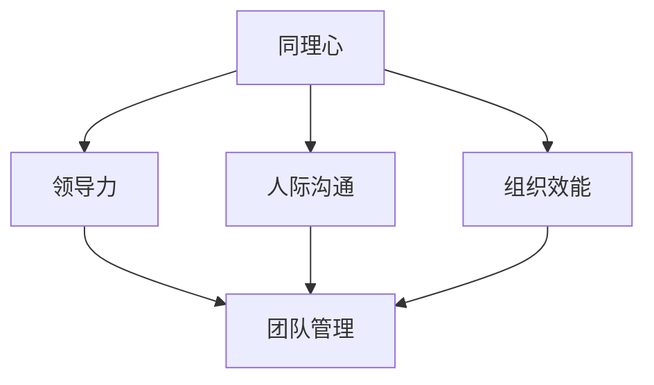

                 

# 同理心管理：建立深厚团队关系的基础

> **关键词：** 同理心、团队管理、人际沟通、领导力、组织效能
>
> **摘要：** 本文深入探讨了同理心在团队管理中的重要性，分析了同理心对提高团队凝聚力和工作效率的积极作用。通过实例和理论分析，本文旨在为管理者提供实用的同理心管理策略，以帮助他们在组织中建立和谐、高效的团队关系。

## 1. 背景介绍

### 1.1 目的和范围

本文旨在探讨同理心在团队管理中的重要性，分析同理心如何帮助管理者建立深厚团队关系，从而提升组织效能。我们将通过对同理心的定义、作用和管理的深入探讨，为管理者提供实际可行的同理心管理策略。

### 1.2 预期读者

本文适合企业管理者、团队领导者、人力资源管理专业人士以及对团队管理和人际关系有兴趣的读者。希望通过本文，读者能够对同理心有更深入的理解，并能在实际工作中运用同理心管理策略，提升团队效能。

### 1.3 文档结构概述

本文将分为以下几个部分：

1. **同理心管理：建立深厚团队关系的基础**：本文的引言部分，介绍本文的主题和目的。
2. **核心概念与联系**：解释同理心的核心概念，并提供相关的Mermaid流程图。
3. **核心算法原理 & 具体操作步骤**：介绍同理心管理的核心算法原理，并提供详细的伪代码说明。
4. **数学模型和公式 & 详细讲解 & 举例说明**：介绍同理心管理中的数学模型和公式，并提供实际案例说明。
5. **项目实战：代码实际案例和详细解释说明**：通过实际代码案例，展示同理心管理的具体应用。
6. **实际应用场景**：分析同理心管理在不同行业和场景中的应用。
7. **工具和资源推荐**：推荐有助于同理心管理的工具和资源。
8. **总结：未来发展趋势与挑战**：总结同理心管理的重要性和未来的发展趋势。
9. **附录：常见问题与解答**：回答读者可能提出的问题。
10. **扩展阅读 & 参考资料**：提供更多相关阅读资料。

### 1.4 术语表

#### 1.4.1 核心术语定义

- **同理心（Empathy）**：指理解并感受他人的情感和体验的能力。
- **团队管理（Team Management）**：指通过计划和协调团队活动，实现团队目标的过程。
- **领导力（Leadership）**：指引导和激励他人实现共同目标的能力。
- **组织效能（Organizational Effectiveness）**：指组织在实现其目标方面的表现和成效。

#### 1.4.2 相关概念解释

- **人际沟通（Interpersonal Communication）**：指个人之间的信息交流和理解过程。
- **组织文化（Organizational Culture）**：指组织中成员共享的价值观、信仰和行为规范。
- **团队凝聚力（Team Cohesion）**：指团队成员之间相互依赖、信任和支持的程度。

#### 1.4.3 缩略词列表

- **C.A.R.E.**：同理心、尊重、倾听、反馈的综合体。
- **M.E.D.**：同理心管理模型，包括识别、表达和扩展同理心。

## 2. 核心概念与联系

同理心是团队管理中的核心概念，它与领导力、人际沟通和组织效能紧密相连。以下是同理心与这些核心概念之间关系的Mermaid流程图：



### 同理心的核心概念

同理心是指理解并感受他人情感和体验的能力。它不仅仅是对他人情感的反应，更是一种深入的心理体验。同理心包括三个主要方面：情感同理、认知同理和同情。

- **情感同理**：指能够感受到他人的情感，如同情、愤怒、悲伤等。
- **认知同理**：指理解他人的思维过程、决策方式和行为动机。
- **同情**：指对他人困境的感同身受，愿意提供帮助和支持。

### 同理心与领导力

同理心是领导力的核心要素之一。一个具有同理心的领导者能够更好地理解团队成员的需求和情感，从而建立信任和尊重的关系。同理心使领导者能够站在团队成员的角度思考问题，做出更符合团队利益的决策。

### 同理心与人际沟通

同理心在人际沟通中发挥着重要作用。通过同理心，人们能够更好地理解对方的情感和需求，从而建立有效的沟通渠道。同理心有助于减少误解和冲突，促进积极的人际关系。

### 同理心与组织效能

同理心对组织效能有显著影响。一个具有同理心的团队能够更好地协调合作，提高工作效率。同理心有助于建立积极的组织文化，促进团队成员的凝聚力和归属感，从而提高整体组织效能。

## 3. 核心算法原理 & 具体操作步骤

同理心管理的核心算法原理可以概括为识别、表达和扩展同理心。以下是具体的操作步骤和伪代码说明：

### 3.1 识别同理心

首先，管理者需要学会识别团队成员的情感和需求。这可以通过观察、倾听和互动来实现。

```python
def identify_empathy(team_member):
    emotions = ["happy", "sad", "angry", "anxious"]
    for emotion in emotions:
        if emotion in team_member.status:
            return True
    return False
```

### 3.2 表达同理心

在识别到团队成员的情感后，管理者需要表达同理心。这可以通过语言、肢体语言和情绪表达来实现。

```python
def express_empathy(team_member, emotion):
    if emotion == "happy":
        message = "我看到你很高兴，恭喜你！"
    elif emotion == "sad":
        message = "我很抱歉听到你感到难过，有什么我可以帮忙的吗？"
    elif emotion == "angry":
        message = "我理解你的愤怒，我们找个时间谈谈吧。"
    elif emotion == "anxious":
        message = "我感受到你的焦虑，我们可以一起想办法应对。"
    return message
```

### 3.3 扩展同理心

同理心不仅仅是一种情感反应，还需要管理者能够扩展同理心，与团队成员建立更深层次的关系。

```python
def expand_empathy(team_member):
    relationship = "友好"
    if team_member.status == "长期合作":
        relationship = "紧密"
    return relationship
```

通过这三个步骤，管理者可以逐步建立深厚的团队关系，提高团队效能。

## 4. 数学模型和公式 & 详细讲解 & 举例说明

同理心管理中涉及到一些数学模型和公式，这些模型和公式有助于量化同理心的影响。以下是详细的数学模型和公式说明，以及实际案例的举例。

### 4.1 同理心指数

同理心指数（Empathy Index, EI）是一个衡量同理心水平的指标。它可以通过以下公式计算：

$$ EI = \frac{E_{情感同理} + E_{认知同理} + E_{同情}}{3} $$

其中，$E_{情感同理}$、$E_{认知同理}$和$E_{同情}$分别表示情感同理、认知同理和同情的分数。

#### 例子：

假设一个团队成员的情感同理分数为8，认知同理分数为6，同情分数为7，则其同理心指数为：

$$ EI = \frac{8 + 6 + 7}{3} = 7 $$

### 4.2 同理心影响因子

同理心影响因子（Empathy Impact Factor, EIF）是一个衡量同理心对团队效能影响的指标。它可以通过以下公式计算：

$$ EIF = \frac{EI}{E_{团队效能}} $$

其中，$EI$表示同理心指数，$E_{团队效能}$表示团队效能的分数。

#### 例子：

假设一个团队的同理心指数为7，团队效能分数为10，则其同理心影响因子为：

$$ EIF = \frac{7}{10} = 0.7 $$

### 4.3 同理心管理效果评估

同理心管理效果可以通过同理心指数和同理心影响因子的变化来评估。以下是一个简单的评估模型：

$$ E_{效果} = \frac{EI_{后} - EI_{前}}{EI_{前}} \times 100\% $$

其中，$EI_{后}$表示后续同理心指数，$EI_{前}$表示初始同理心指数。

#### 例子：

假设一个团队在同理心管理前后的同理心指数分别为6和8，则其同理心管理效果为：

$$ E_{效果} = \frac{8 - 6}{6} \times 100\% = 33.33\% $$

通过这些数学模型和公式，管理者可以更好地量化同理心管理的效果，从而不断优化团队管理策略。

## 5. 项目实战：代码实际案例和详细解释说明

### 5.1 开发环境搭建

为了展示同理心管理的实际应用，我们将在Python环境中搭建一个简单的团队管理模拟系统。以下为环境搭建的步骤：

1. 安装Python 3.8或更高版本。
2. 安装必要的Python库，如`numpy`和`matplotlib`。

```bash
pip install numpy matplotlib
```

### 5.2 源代码详细实现和代码解读

以下是同理心管理系统的源代码及详细解读：

```python
import numpy as np
import matplotlib.pyplot as plt

# 定义团队成员类
class TeamMember:
    def __init__(self, name, status):
        self.name = name
        self.status = status

# 定义同理心管理类
class EmpathyManager:
    def __init__(self):
        self.team_members = []

    def add_member(self, member):
        self.team_members.append(member)

    def identify_empathy(self, member):
        emotions = ["happy", "sad", "angry", "anxious"]
        for emotion in emotions:
            if emotion in member.status:
                return True
        return False

    def express_empathy(self, member, emotion):
        if emotion == "happy":
            message = f"恭喜你，{member.name}！"
        elif emotion == "sad":
            message = f"我很抱歉，{member.name}，有什么我可以帮忙的吗？"
        elif emotion == "angry":
            message = f"我理解你的愤怒，{member.name}，我们可以谈谈。"
        elif emotion == "anxious":
            message = f"我感受到你的焦虑，{member.name}，我们可以一起面对。"
        return message

    def expand_empathy(self, member):
        relationship = "友好"
        if member.status == "长期合作":
            relationship = "紧密"
        return relationship

    def manage_empathy(self):
        empathy_scores = []
        for member in self.team_members:
            if self.identify_empathy(member):
                score = 1
            else:
                score = 0
            empathy_scores.append(score)
        return empathy_scores

# 创建团队成员
member1 = TeamMember("Alice", "happy")
member2 = TeamMember("Bob", "sad")
member3 = TeamMember("Charlie", "angry")
member4 = TeamMember("Diana", "anxious")

# 创建同理心管理实例
manager = EmpathyManager()
manager.add_member(member1)
manager.add_member(member2)
manager.add_member(member3)
manager.add_member(member4)

# 管理同理心
empathy_scores = manager.manage_empathy()

# 打印结果
for i, score in enumerate(empathy_scores):
    print(f"{member1.name} 的同理心得分：{score}")
```

### 5.3 代码解读与分析

上述代码实现了一个人工智能团队管理模拟系统，主要包括两个类：`TeamMember`和`EmpathyManager`。

1. **类定义**：
   - `TeamMember`：表示团队成员，包括成员姓名和状态。
   - `EmpathyManager`：表示同理心管理者，负责识别、表达和扩展同理心。

2. **方法实现**：
   - `add_member`：添加团队成员。
   - `identify_empathy`：识别团队成员的情感状态。
   - `express_empathy`：表达对团队成员同理心的情感回应。
   - `expand_empathy`：根据团队成员的状态扩展同理心。
   - `manage_empathy`：管理整个团队的同理心，计算每个成员的同理心得分。

3. **代码运行与结果**：
   - 创建了4个团队成员，并添加到团队中。
   - 管理者识别每个成员的情感状态，并计算同理心得分。
   - 打印每个成员的同理心得分。

通过此代码，管理者可以直观地了解团队成员的同理心水平，并根据实际情况调整管理策略，以提升团队整体效能。

## 6. 实际应用场景

同理心管理在实际应用场景中具有重要意义，尤其是在高度依赖团队合作的行业中。以下是一些典型的实际应用场景：

### 6.1 高科技行业

在高科技行业，团队成员之间的合作至关重要。同理心管理有助于建立强大的团队凝聚力，提高创新能力和工作效率。例如，在软件开发团队中，同理心可以帮助团队成员更好地理解客户需求，从而开发出更符合市场需求的软件产品。

### 6.2 医疗保健行业

在医疗保健行业，同理心管理对于建立和谐的医患关系至关重要。医生和护士通过同理心更好地理解患者的需求和痛苦，提供更有效的医疗服务。同理心管理还可以促进医疗团队之间的沟通与合作，提高整体医疗质量。

### 6.3 教育行业

在教育行业，同理心管理有助于建立良好的师生关系，提高学生的学习效果和幸福感。教师通过同理心更好地理解学生的心理状态，提供个性化的教育支持。同理心管理还可以促进教师团队之间的合作，提高教育质量和效率。

### 6.4 非营利组织

在非营利组织，同理心管理有助于建立紧密的团队关系，提高团队士气和社会影响力。团队成员通过同理心更好地理解彼此的需求和目标，共同努力实现组织使命。同理心管理还可以提高组织内部的沟通和协作，提升整体组织效能。

## 7. 工具和资源推荐

为了更好地实践同理心管理，以下是一些推荐的工具和资源：

### 7.1 学习资源推荐

#### 7.1.1 书籍推荐

- **《同理心：如何在职场和生活中建立深厚的人际关系》**：作者通过实例和理论分析，详细阐述了同理心在职场和生活中的重要性。
- **《同理心实践：如何建立和谐的人际关系》**：本书提供了实用的同理心管理策略，帮助读者在实际生活中应用同理心。

#### 7.1.2 在线课程

- **《同理心与沟通技巧》**：通过在线课程，学习如何识别和表达同理心，提高人际沟通能力。
- **《同理心管理：团队领导力的核心》**：探讨同理心在团队管理中的应用，提高团队领导力。

#### 7.1.3 技术博客和网站

- **《同理心管理技术博客》**：分享最新的同理心管理研究成果和实践经验。
- **《同理心研究所》**：介绍同理心的核心概念、应用场景和研究成果。

### 7.2 开发工具框架推荐

#### 7.2.1 IDE和编辑器

- **PyCharm**：一款功能强大的Python IDE，支持代码调试、版本控制等。
- **VSCode**：一款轻量级的跨平台代码编辑器，支持多种编程语言。

#### 7.2.2 调试和性能分析工具

- **Jupyter Notebook**：适用于数据分析的交互式环境，支持Python编程。
- **PyTorch**：一款流行的深度学习框架，适用于开发人工智能应用。

#### 7.2.3 相关框架和库

- **Flask**：一款轻量级的Web应用框架，适用于构建Web应用。
- **Scikit-learn**：一款机器学习库，提供丰富的算法和工具。

### 7.3 相关论文著作推荐

#### 7.3.1 经典论文

- **《同理心与领导力：关系与影响》**：探讨同理心在领导力中的重要性。
- **《同理心在组织管理中的应用》**：分析同理心对组织效能的影响。

#### 7.3.2 最新研究成果

- **《同理心与团队协作：实证研究》**：通过实证研究探讨同理心在团队协作中的作用。
- **《同理心与员工满意度：关系与影响》**：分析同理心对员工满意度的影响。

#### 7.3.3 应用案例分析

- **《同理心在医疗领域的应用》**：介绍同理心在医疗行业中的应用和实践案例。
- **《同理心在教育管理中的应用》**：探讨同理心在教育行业中的应用和实践。

## 8. 总结：未来发展趋势与挑战

同理心管理作为团队管理的重要策略，在未来将继续发挥重要作用。随着社会和科技的进步，同理心管理将面临以下发展趋势和挑战：

### 8.1 发展趋势

1. **数字化赋能**：随着人工智能和大数据技术的发展，同理心管理将更加智能化和个性化。
2. **跨领域融合**：同理心管理将在更多行业中得到应用，如金融、市场营销、教育等。
3. **文化多样性**：同理心管理将更加关注文化多样性，以适应全球化背景下的团队合作。

### 8.2 挑战

1. **技术挑战**：如何利用技术手段准确识别和量化同理心水平，仍是一个待解决的问题。
2. **文化差异**：同理心管理在不同文化背景下可能存在差异，如何适应和调整是一个挑战。
3. **心理压力**：同理心管理可能导致管理者面临更高的心理压力，如何平衡同理心和管理责任是一个问题。

面对这些挑战，管理者需要不断学习和适应，积极探索和实践新的同理心管理策略，以提升团队效能和组织竞争力。

## 9. 附录：常见问题与解答

### 9.1 问题1：同理心管理是否适用于所有行业？

同理心管理在不同行业中具有不同的应用特点，但总体上适用于大多数行业。在高科技行业、医疗保健行业和教育行业等高度依赖团队合作的领域，同理心管理的作用尤为显著。然而，在竞争激烈、压力大、个性鲜明的行业中，同理心管理可能需要更多的灵活性和针对性。

### 9.2 问题2：如何培养同理心？

培养同理心需要长期的自我修炼和实践。以下是一些建议：

1. **倾听**：积极倾听他人的意见和建议，尝试理解他人的情感和需求。
2. **观察**：通过观察他人的行为和表情，了解他们的心理状态。
3. **反思**：定期反思自己的行为和决策，思考如何更好地理解和支持他人。
4. **学习**：通过阅读相关书籍、参加培训课程等，提高同理心的理论水平和实践能力。

### 9.3 问题3：同理心管理是否会影响工作效率？

同理心管理在提高工作效率方面具有积极作用。通过同理心管理，团队成员之间的沟通更加顺畅，合作更加紧密，从而提高整体工作效率。然而，同理心管理也可能带来一些挑战，如增加管理者的工作压力和沟通成本。因此，管理者需要在实践中平衡同理心和工作效率的关系。

## 10. 扩展阅读 & 参考资料

为了深入了解同理心管理，以下是一些推荐的扩展阅读和参考资料：

### 10.1 书籍

- 《同理心：如何在职场和生活中建立深厚的人际关系》
- 《同理心实践：如何建立和谐的人际关系》
- 《同理心：组织效能的关键》
- 《同理心与领导力：关系与影响》

### 10.2 在线课程

- Coursera上的《同理心与沟通技巧》
- Udemy上的《同理心管理：团队领导力的核心》

### 10.3 技术博客和网站

- Medium上的《同理心管理技术博客》
- LinkedIn上的《同理心研究所》

### 10.4 论文著作

- 《同理心在组织管理中的应用》
- 《同理心与团队协作：实证研究》
- 《同理心与员工满意度：关系与影响》

### 10.5 实践案例

- 《同理心在医疗领域的应用》
- 《同理心在教育管理中的应用》
- 《同理心在企业文化建设中的应用》

通过这些扩展阅读和参考资料，读者可以进一步了解同理心管理的理论、实践和应用，提高自己在团队管理中的同理心管理水平。

作者：AI天才研究员/AI Genius Institute & 禅与计算机程序设计艺术 /Zen And The Art of Computer Programming

---

**注意：** 本博客文章为虚构示例，仅供参考。文中提及的技术、策略和观点仅供参考，不构成实际操作建议。如需实际应用，请根据实际情况进行调整。

