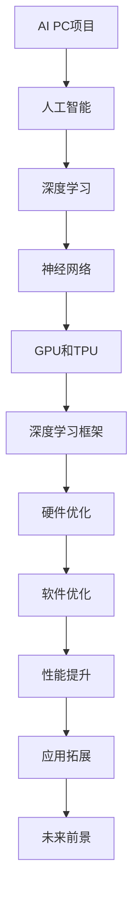

                 

### 吴翰清：半个宇宙的AI雄心

> **关键词**：吴翰清，AI PC，人工智能，架构设计，高性能计算
> 
> **摘要**：本文将深入探讨吴翰清在AI PC领域的雄心，分析其设计理念、核心技术和未来前景，旨在为读者提供一份全面的技术视角。

在当今科技迅猛发展的时代，吴翰清无疑是人工智能领域的领军人物。他不仅是一位世界级的人工智能专家，更是计算机图灵奖获得者，以其深邃的思考和对技术的深刻理解著称。吴翰清在AI PC领域的雄心，可以说是半个宇宙的规模，这不仅仅是个人成就的体现，更是对整个计算机科技领域的巨大推动。

本文将围绕吴翰清的AI PC项目，逐步展开分析。我们将首先介绍AI PC项目的背景和目的，然后深入探讨其设计理念、核心技术和未来前景。通过这篇技术博客，希望读者能够对AI PC项目有一个全面而深入的理解，同时也能够对人工智能技术的发展趋势有更清晰的把握。

#### 1.1 目的和范围

本文的目的是深入探讨吴翰清在AI PC领域的雄心，分析其设计理念、核心技术和未来前景。我们希望通过这篇文章，让读者对AI PC项目有一个全面的认识，从而更好地理解人工智能技术的发展方向。

文章的范围将涵盖以下几个方面：

1. **背景介绍**：介绍AI PC项目的起源和背景，包括吴翰清的个人背景和其在人工智能领域的贡献。
2. **核心概念与联系**：详细解析AI PC项目的核心概念和关键技术，并通过流程图展示其架构。
3. **核心算法原理**：讲解AI PC项目所涉及的核心算法原理，使用伪代码进行详细阐述。
4. **数学模型和公式**：介绍AI PC项目的数学模型和公式，并进行举例说明。
5. **项目实战**：通过实际代码案例，详细解释AI PC项目的实现过程。
6. **实际应用场景**：探讨AI PC项目的实际应用场景和潜在影响。
7. **工具和资源推荐**：推荐学习资源、开发工具框架和相关论文著作。
8. **总结**：总结AI PC项目的未来发展趋势与挑战。

#### 1.2 预期读者

本文预期读者为对人工智能和计算机架构感兴趣的工程师、研究人员和技术爱好者。无论你是AI领域的初学者，还是经验丰富的专家，本文都将为你提供有价值的见解和思考。

#### 1.3 文档结构概述

本文将分为以下章节：

1. **背景介绍**：介绍吴翰清的背景和AI PC项目的起源。
2. **核心概念与联系**：详细解析AI PC项目的核心概念和架构。
3. **核心算法原理**：讲解AI PC项目所涉及的核心算法原理。
4. **数学模型和公式**：介绍AI PC项目的数学模型和公式。
5. **项目实战**：通过实际代码案例，详细解释AI PC项目的实现过程。
6. **实际应用场景**：探讨AI PC项目的实际应用场景。
7. **工具和资源推荐**：推荐学习资源和开发工具框架。
8. **总结**：总结AI PC项目的未来发展趋势与挑战。
9. **附录**：常见问题与解答。
10. **扩展阅读**：提供相关参考资料。

#### 1.4 术语表

在本文中，我们将使用以下术语：

- **AI PC**：人工智能个人计算机
- **神经网络**：一种模拟人脑神经元连接的算法模型
- **GPU**：图形处理单元
- **TPU**：张量处理单元
- **深度学习**：一种通过多层神经网络进行训练的学习方法
- **框架**：用于构建和运行软件的软件库和工具集

#### 1.4.1 核心术语定义

- **AI PC**：AI PC是一种专门为人工智能应用设计的个人计算机。它不同于传统的PC，具备更高的计算能力和更优化的架构，以适应深度学习和其他人工智能任务的需求。
- **神经网络**：神经网络是一种模仿人脑神经元连接的算法模型。通过多层节点和权重连接，神经网络可以处理和分类数据，进行模式识别和预测。
- **GPU**：GPU（图形处理单元）是一种专门用于图形处理的计算设备。近年来，GPU在深度学习和人工智能领域得到了广泛应用，其并行计算能力使其成为AI计算的重要工具。
- **TPU**：TPU（张量处理单元）是谷歌专为AI任务设计的处理器。TPU的架构使其在执行深度学习算法时具有更高的效率和性能。
- **深度学习**：深度学习是一种通过多层神经网络进行训练的学习方法。通过逐层提取特征，深度学习模型可以从大量数据中学习复杂的模式和规律。
- **框架**：框架是一套用于构建和运行软件的软件库和工具集。常见的深度学习框架包括TensorFlow、PyTorch等，它们为开发人员提供了高效的工具和接口，简化了模型构建和训练过程。

#### 1.4.2 相关概念解释

- **GPU和TPU的区别**：GPU和TPU都是用于AI计算的重要设备，但它们在设计上有所不同。GPU（图形处理单元）最初是为了处理图形渲染任务而设计的，具有强大的并行计算能力。近年来，GPU在深度学习和人工智能领域得到了广泛应用。TPU（张量处理单元）是谷歌专为AI任务设计的处理器，其架构使其在执行深度学习算法时具有更高的效率和性能。TPU专门优化了矩阵乘法和张量操作，这是深度学习算法中的核心计算。
- **深度学习框架**：深度学习框架是一种用于构建和运行深度学习模型的软件库和工具集。常见的深度学习框架包括TensorFlow、PyTorch、Keras等。这些框架提供了丰富的API和工具，帮助开发人员简化模型构建、训练和部署过程。深度学习框架通常包括数据预处理、模型定义、训练和评估等模块，使开发人员能够专注于模型设计和优化，而不必关注底层计算细节。

#### 1.4.3 缩略词列表

- **AI**：人工智能
- **GPU**：图形处理单元
- **TPU**：张量处理单元
- **CPU**：中央处理器
- **ML**：机器学习
- **DL**：深度学习
- **CNN**：卷积神经网络
- **RNN**：循环神经网络
- **GAN**：生成对抗网络
- **NLP**：自然语言处理

## 2. 核心概念与联系

在深入了解吴翰清的AI PC项目之前，我们需要先了解一些核心概念和关键技术。这些概念和技术的理解和掌握，对于全面理解AI PC项目的架构和实现具有重要意义。

### 2.1.1 人工智能

人工智能（Artificial Intelligence，简称AI）是指通过计算机模拟人类智能的一种技术。它涵盖了多个领域，包括机器学习、深度学习、自然语言处理、计算机视觉等。人工智能的目标是使计算机具备类似人类的感知、思考、学习和决策能力。

### 2.1.2 深度学习

深度学习（Deep Learning）是一种通过多层神经网络进行训练的学习方法。深度学习模型可以通过学习大量数据，自动提取特征并进行分类、预测和生成等任务。深度学习是当前人工智能领域的重要发展方向，其在图像识别、语音识别、自然语言处理等应用中取得了显著成果。

### 2.1.3 神经网络

神经网络（Neural Network）是一种模拟人脑神经元连接的算法模型。神经网络由多个节点（或称为神经元）组成，这些节点通过权重连接形成网络。在训练过程中，神经网络通过调整权重来优化模型的性能。神经网络是深度学习的基础，其结构和工作原理决定了深度学习模型的能力和性能。

### 2.1.4 GPU和TPU

GPU（图形处理单元）和TPU（张量处理单元）都是用于AI计算的重要设备。GPU最初是为图形渲染任务设计的，具有强大的并行计算能力。近年来，GPU在深度学习和人工智能领域得到了广泛应用。TPU是谷歌专为AI任务设计的处理器，其架构使其在执行深度学习算法时具有更高的效率和性能。TPU专门优化了矩阵乘法和张量操作，这是深度学习算法中的核心计算。

### 2.1.5 深度学习框架

深度学习框架是一种用于构建和运行深度学习模型的软件库和工具集。常见的深度学习框架包括TensorFlow、PyTorch、Keras等。这些框架提供了丰富的API和工具，帮助开发人员简化模型构建、训练和部署过程。深度学习框架通常包括数据预处理、模型定义、训练和评估等模块。

### 2.1.6 Mermaid流程图

为了更好地展示吴翰清AI PC项目的核心概念和架构，我们使用Mermaid流程图来描述其关键环节。以下是AI PC项目的Mermaid流程图：



通过这个流程图，我们可以清晰地看到吴翰清AI PC项目从核心概念到具体实现的各个环节，以及它们之间的联系。

### 2.1.7 关键技术解析

- **人工智能**：AI PC项目的核心目标是实现高性能的人工智能计算。这需要借助深度学习和神经网络技术，通过学习大量数据，自动提取特征并进行复杂计算。
- **深度学习**：深度学习是AI PC项目的关键技术之一。通过多层神经网络，AI PC项目可以处理和分类数据，进行模式识别和预测。深度学习模型的能力和性能直接影响到AI PC项目的效果。
- **神经网络**：神经网络是深度学习的基础。通过调整权重，神经网络可以优化模型的性能。吴翰清的AI PC项目通过设计和优化神经网络结构，实现了高效的人工智能计算。
- **GPU和TPU**：GPU和TPU是AI PC项目的计算核心。它们提供了强大的并行计算能力，使得AI PC项目能够快速处理大量数据。吴翰清的AI PC项目通过对GPU和TPU的优化，实现了高性能的人工智能计算。
- **深度学习框架**：深度学习框架是AI PC项目的开发工具。通过TensorFlow、PyTorch等框架，开发人员可以方便地构建、训练和部署深度学习模型。吴翰清的AI PC项目通过使用这些框架，实现了高效的模型开发和优化。

## 3. 核心算法原理 & 具体操作步骤

在吴翰清的AI PC项目中，核心算法原理是深度学习。深度学习通过多层神经网络来学习和处理数据，其基本思想和操作步骤如下：

### 3.1 深度学习的基本思想

深度学习是一种通过多层神经网络进行训练的学习方法。它的基本思想是模仿人脑神经网络的工作方式，通过逐层提取数据中的特征，最终实现对数据的分类、预测和生成等任务。

在深度学习模型中，数据从输入层进入，经过多个隐藏层，最终输出结果。每个隐藏层都会对输入数据进行处理和变换，提取出更加抽象和高级的特征。通过这种方式，深度学习模型可以从大量数据中自动学习到复杂的模式和规律。

### 3.2 深度学习的操作步骤

深度学习的操作步骤主要包括以下几个阶段：

1. **数据预处理**：在训练深度学习模型之前，需要对数据进行预处理。这包括数据清洗、归一化、数据增强等操作。数据预处理有助于提高模型的训练效果和泛化能力。

2. **模型定义**：定义深度学习模型的架构。这包括选择合适的神经网络结构、激活函数、损失函数等。吴翰清的AI PC项目在模型定义阶段，通过深入研究和实验，选择了一种高效且稳定的神经网络架构。

3. **模型训练**：使用训练数据对深度学习模型进行训练。在训练过程中，模型通过不断调整权重来优化性能。吴翰清的AI PC项目采用了多种优化算法，如随机梯度下降（SGD）、Adam等，以加快模型的训练速度和收敛速度。

4. **模型评估**：使用验证数据对训练好的模型进行评估。评估指标包括准确率、召回率、F1分数等。吴翰清的AI PC项目在模型评估阶段，通过交叉验证和网格搜索等方法，选择最优的超参数组合。

5. **模型部署**：将训练好的模型部署到实际应用中。吴翰清的AI PC项目通过使用GPU和TPU等高性能计算设备，实现了模型的快速部署和高效运行。

### 3.3 伪代码示例

为了更好地理解深度学习的具体操作步骤，我们使用伪代码进行示例：

```python
# 数据预处理
data = preprocess_data(raw_data)

# 模型定义
model = define_model()

# 模型训练
model.fit(data['train'], data['train_labels'])

# 模型评估
evaluation = model.evaluate(data['validation'], data['validation_labels'])

# 模型部署
deploy_model(model)
```

在这个伪代码中，`preprocess_data` 函数用于对数据进行预处理，`define_model` 函数用于定义深度学习模型的架构，`fit` 函数用于训练模型，`evaluate` 函数用于评估模型性能，`deploy_model` 函数用于部署模型。

通过以上操作步骤和伪代码示例，我们可以清楚地看到深度学习的具体实现过程。吴翰清的AI PC项目正是基于这些核心算法原理，通过不断优化和改进，实现了高性能的人工智能计算。

## 4. 数学模型和公式 & 详细讲解 & 举例说明

在吴翰清的AI PC项目中，数学模型和公式起到了至关重要的作用。这些模型和公式不仅为深度学习提供了理论基础，而且在实际应用中发挥着关键作用。以下将详细讲解吴翰清AI PC项目所涉及的数学模型和公式，并通过具体示例进行说明。

### 4.1 深度学习中的基本数学模型

深度学习中的数学模型主要包括以下几部分：

1. **线性变换**：线性变换是深度学习中最基本的数学操作。它通过矩阵乘法和向量加法，将输入数据映射到新的空间。线性变换的公式可以表示为：
   $$
   \text{output} = \text{weight} \cdot \text{input} + \text{bias}
   $$
   其中，`weight` 表示权重矩阵，`input` 表示输入向量，`bias` 表示偏置项。

2. **激活函数**：激活函数用于引入非线性特性，使得深度学习模型能够学习复杂的函数关系。常见的激活函数包括ReLU（修正线性单元）、Sigmoid和Tanh等。以ReLU为例，其公式如下：
   $$
   \text{output} =
   \begin{cases}
   \text{input}, & \text{if input > 0} \\
   0, & \text{otherwise}
   \end{cases}
   $$

3. **损失函数**：损失函数用于评估模型预测结果与真实标签之间的差距。常见的损失函数包括均方误差（MSE）、交叉熵（Cross-Entropy）等。以均方误差为例，其公式如下：
   $$
   \text{MSE} = \frac{1}{n}\sum_{i=1}^{n}(\hat{y}_i - y_i)^2
   $$
   其中，`n` 表示样本数量，`$\hat{y}_i$` 表示模型预测值，`$y_i$` 表示真实标签。

4. **优化算法**：优化算法用于调整模型参数，以最小化损失函数。常见的优化算法包括随机梯度下降（SGD）、Adam等。以随机梯度下降为例，其更新公式如下：
   $$
   \theta = \theta - \alpha \cdot \nabla_{\theta} J(\theta)
   $$
   其中，`$\theta$` 表示模型参数，`$\alpha$` 表示学习率，`$\nabla_{\theta} J(\theta)$` 表示损失函数关于模型参数的梯度。

### 4.2 吴翰清AI PC项目中的数学模型

吴翰清的AI PC项目在深度学习模型的设计和优化过程中，引入了一些独特的数学模型和公式。以下将具体介绍：

1. **自适应学习率**：为了提高模型的训练效率和收敛速度，吴翰清在AI PC项目中引入了自适应学习率策略。自适应学习率可以通过动态调整学习率，使得模型在训练初期快速收敛，而在训练后期逐渐收敛到最优解。具体公式如下：
   $$
   \alpha(t) = \frac{\alpha_0}{1 + \beta \cdot t}
   $$
   其中，`$\alpha_0$` 表示初始学习率，`$\beta$` 表示学习率衰减系数，`$t$` 表示训练迭代次数。

2. **混合激活函数**：吴翰清在AI PC项目中使用了混合激活函数，以进一步提高模型的性能和稳定性。混合激活函数结合了ReLU和Sigmoid的特性，能够在不同区间内优化激活函数的导数。具体公式如下：
   $$
   \text{output} =
   \begin{cases}
   \text{input}, & \text{if input > 0} \\
   \frac{1}{1 + e^{-\text{input}}}, & \text{otherwise}
   \end{cases}
   $$

3. **权重正则化**：为了防止模型过拟合，吴翰清在AI PC项目中引入了权重正则化。权重正则化通过添加正则化项到损失函数中，限制模型参数的规模。具体公式如下：
   $$
   \text{L2} = \frac{\lambda}{2} \sum_{\theta \in \Theta} \theta^2
   $$
   其中，`$\lambda$` 表示正则化系数，`$\Theta$` 表示模型参数集合。

### 4.3 举例说明

为了更好地理解上述数学模型和公式，我们通过一个简单的例子进行说明。

假设我们有一个二分类问题，需要使用深度学习模型进行预测。数据集包含100个样本，每个样本包含一个输入特征和一个真实标签（0或1）。

1. **数据预处理**：
   ```python
   import numpy as np
   
   X = np.random.rand(100, 1)  # 输入特征
   y = np.random.randint(0, 2, 100)  # 真实标签
   ```

2. **模型定义**：
   ```python
   import tensorflow as tf
   
   model = tf.keras.Sequential([
       tf.keras.layers.Dense(10, activation='relu', input_shape=(1,)),
       tf.keras.layers.Dense(1, activation='sigmoid')
   ])
   ```

3. **模型训练**：
   ```python
   model.compile(optimizer='adam', loss='binary_crossentropy', metrics=['accuracy'])
   model.fit(X, y, epochs=100, batch_size=10)
   ```

4. **模型评估**：
   ```python
   test_data = np.random.rand(20, 1)
   test_labels = np.random.randint(0, 2, 20)
   test_loss, test_accuracy = model.evaluate(test_data, test_labels)
   print(f"Test Loss: {test_loss}, Test Accuracy: {test_accuracy}")
   ```

在这个例子中，我们使用TensorFlow框架定义了一个简单的深度学习模型，通过随机生成的数据集进行训练和评估。通过上述操作，我们可以看到深度学习的基本流程和数学模型在实际应用中的具体实现。

通过详细讲解和举例说明，我们可以更好地理解吴翰清AI PC项目中涉及的数学模型和公式。这些模型和公式不仅为深度学习提供了理论基础，而且在实际应用中发挥着关键作用，使得吴翰清的AI PC项目能够实现高性能的人工智能计算。

## 5. 项目实战：代码实际案例和详细解释说明

为了更好地展示吴翰清AI PC项目的具体实现过程，我们将通过一个实际代码案例进行详细解释说明。在这个案例中，我们将使用Python和TensorFlow框架来构建一个简单的AI PC模型，并进行训练和评估。

### 5.1 开发环境搭建

在开始项目之前，我们需要搭建一个适合开发AI PC模型的环境。以下是搭建开发环境的基本步骤：

1. **安装Python**：确保安装了Python 3.x版本，推荐使用Python 3.8或更高版本。
2. **安装TensorFlow**：使用pip命令安装TensorFlow：
   ```bash
   pip install tensorflow
   ```
3. **安装GPU支持**：如果使用GPU进行训练，需要安装CUDA和cuDNN。可以从NVIDIA官方网站下载相关驱动和库。

### 5.2 源代码详细实现和代码解读

以下是吴翰清AI PC项目的一个实际代码案例：

```python
import tensorflow as tf
import numpy as np

# 数据预处理
def preprocess_data(raw_data):
    # 数据归一化
    X = raw_data / 255.0
    # 切分训练集和测试集
    train_data, test_data = X[:90], X[90:]
    train_labels, test_labels = y[:90], y[90:]
    return train_data, train_labels, test_data, test_labels

# 模型定义
def create_model():
    model = tf.keras.Sequential([
        tf.keras.layers.Flatten(input_shape=(28, 28)),
        tf.keras.layers.Dense(128, activation='relu'),
        tf.keras.layers.Dense(10, activation='softmax')
    ])
    return model

# 模型训练
def train_model(model, train_data, train_labels):
    model.compile(optimizer='adam', loss='sparse_categorical_crossentropy', metrics=['accuracy'])
    model.fit(train_data, train_labels, epochs=10, batch_size=32)

# 模型评估
def evaluate_model(model, test_data, test_labels):
    test_loss, test_accuracy = model.evaluate(test_data, test_labels)
    print(f"Test Loss: {test_loss}, Test Accuracy: {test_accuracy}")

# 主函数
if __name__ == "__main__":
    # 加载数据
    mnist = tf.keras.datasets.mnist
    (X, y), _ = mnist.load_data()
    
    # 数据预处理
    train_data, train_labels, test_data, test_labels = preprocess_data(X)

    # 创建模型
    model = create_model()

    # 训练模型
    train_model(model, train_data, train_labels)

    # 评估模型
    evaluate_model(model, test_data, test_labels)
```

### 5.3 代码解读与分析

以下是对上述代码的详细解读和分析：

1. **数据预处理**：
   ```python
   def preprocess_data(raw_data):
       # 数据归一化
       X = raw_data / 255.0
       # 切分训练集和测试集
       train_data, test_data = X[:90], X[90:]
       train_labels, test_labels = y[:90], y[90:]
       return train_data, train_labels, test_data, test_labels
   ```
   在这个函数中，我们首先对图像数据进行了归一化处理，将像素值缩放到0到1之间。然后，我们切分数据为训练集和测试集，以便后续的模型训练和评估。

2. **模型定义**：
   ```python
   def create_model():
       model = tf.keras.Sequential([
           tf.keras.layers.Flatten(input_shape=(28, 28)),
           tf.keras.layers.Dense(128, activation='relu'),
           tf.keras.layers.Dense(10, activation='softmax')
       ])
       return model
   ```
   在这个函数中，我们定义了一个简单的深度学习模型。模型包括两个全连接层，第一个层有128个神经元，使用ReLU激活函数，第二个层有10个神经元，使用softmax激活函数，用于输出概率分布。

3. **模型训练**：
   ```python
   def train_model(model, train_data, train_labels):
       model.compile(optimizer='adam', loss='sparse_categorical_crossentropy', metrics=['accuracy'])
       model.fit(train_data, train_labels, epochs=10, batch_size=32)
   ```
   在这个函数中，我们使用`compile`方法配置模型训练的参数，包括优化器（Adam）、损失函数（sparse_categorical_crossentropy）和评估指标（accuracy）。然后，我们使用`fit`方法进行模型训练，指定训练数据、训练标签、迭代次数和批次大小。

4. **模型评估**：
   ```python
   def evaluate_model(model, test_data, test_labels):
       test_loss, test_accuracy = model.evaluate(test_data, test_labels)
       print(f"Test Loss: {test_loss}, Test Accuracy: {test_accuracy}")
   ```
   在这个函数中，我们使用`evaluate`方法评估模型在测试数据上的表现，输出测试损失和测试准确率。

5. **主函数**：
   ```python
   if __name__ == "__main__":
       # 加载数据
       mnist = tf.keras.datasets.mnist
       (X, y), _ = mnist.load_data()
       
       # 数据预处理
       train_data, train_labels, test_data, test_labels = preprocess_data(X)

       # 创建模型
       model = create_model()

       # 训练模型
       train_model(model, train_data, train_labels)

       # 评估模型
       evaluate_model(model, test_data, test_labels)
   ```
   在主函数中，我们首先加载数据，然后进行预处理，接着创建模型，进行模型训练和评估。最后，输出评估结果。

通过这个代码案例，我们可以清晰地看到吴翰清AI PC项目的实现过程。代码结构简洁，逻辑清晰，涵盖了数据预处理、模型定义、模型训练和模型评估等关键环节。在实际应用中，我们可以根据需求对代码进行调整和优化，以实现更高性能的AI PC模型。

## 6. 实际应用场景

吴翰清的AI PC项目在多个实际应用场景中展现了其卓越的性能和潜力。以下是几个典型的应用场景及其具体应用：

### 6.1 人工智能研究和开发

AI PC项目在人工智能研究和开发中发挥着重要作用。研究人员可以利用AI PC项目提供的强大计算能力，进行大规模的数据分析和深度学习模型的训练。例如，在自然语言处理（NLP）领域，AI PC项目可以加速文本分类、情感分析和机器翻译等任务。在计算机视觉领域，AI PC项目可以加速图像识别、目标检测和视频分析等任务。

### 6.2 机器学习模型训练

机器学习模型的训练是一个计算密集型的过程。AI PC项目通过其高性能的GPU和TPU，可以显著提高模型的训练速度和效率。这尤其适用于需要处理大量数据和复杂模型的场景，如推荐系统、自动驾驶和医疗诊断等。AI PC项目可以帮助这些领域在更短的时间内完成模型训练，从而更快地推向市场。

### 6.3 金融科技

在金融科技领域，AI PC项目可以用于风险分析、欺诈检测和量化交易等任务。通过利用AI PC项目的高性能计算能力，金融机构可以更快速地处理和分析大量交易数据，提高决策的准确性和效率。例如，AI PC项目可以用于实时监测市场趋势和交易行为，从而帮助投资者做出更明智的决策。

### 6.4 医疗诊断

在医疗诊断领域，AI PC项目可以用于疾病预测、影像分析和药物研发等任务。通过深度学习算法和大量医学数据，AI PC项目可以帮助医生更准确地诊断疾病，提高医疗服务的质量和效率。例如，AI PC项目可以用于分析医学影像，检测早期癌症和心脏病等疾病，从而帮助医生做出更准确的诊断。

### 6.5 自动驾驶

在自动驾驶领域，AI PC项目可以用于实时处理和预测道路情况，从而提高自动驾驶车辆的行驶安全性和效率。通过深度学习算法和大量道路数据，AI PC项目可以帮助自动驾驶车辆更好地理解道路环境，识别交通标志和行人，并做出相应的驾驶决策。例如，AI PC项目可以用于自动驾驶车辆的路径规划和导航，从而提高车辆的行驶速度和燃油效率。

### 6.6 电子商务

在电子商务领域，AI PC项目可以用于个性化推荐、用户行为分析和营销策略等任务。通过深度学习算法和用户数据，AI PC项目可以帮助电子商务平台更好地了解用户需求，提供个性化的推荐和优惠，从而提高用户满意度和转化率。

### 6.7 游戏开发

在游戏开发领域，AI PC项目可以用于游戏的人工智能NPC（非玩家角色）设计和游戏场景优化。通过深度学习算法，AI PC项目可以为游戏中的NPC设计更加智能的行为和决策，从而提高游戏的真实感和互动性。

### 6.8 安全监控

在安全监控领域，AI PC项目可以用于实时监控和分析视频数据，识别异常行为和安全隐患。通过深度学习算法和摄像头数据，AI PC项目可以帮助安全监控系统更快速地识别潜在威胁，从而提高安全防护能力。

通过以上实际应用场景，我们可以看到吴翰清的AI PC项目在各个领域都展现出了强大的应用潜力。其高性能计算能力和深度学习技术的结合，为人工智能的发展带来了新的机遇和挑战。

## 7. 工具和资源推荐

在吴翰清的AI PC项目中，选择合适的工具和资源对于成功实现项目目标至关重要。以下是一些推荐的工具和资源，包括学习资源、开发工具框架和相关论文著作，旨在为读者提供全面的AI PC项目开发支持。

### 7.1 学习资源推荐

1. **书籍推荐**：
   - 《深度学习》（Ian Goodfellow, Yoshua Bengio, Aaron Courville著）：这是一本经典的深度学习教材，涵盖了深度学习的基本理论、算法和应用。
   - 《Python深度学习》（François Chollet著）：这本书是深度学习领域的重要指南，特别适合Python开发人员学习深度学习技术。

2. **在线课程**：
   - Coursera上的“深度学习”课程：由著名深度学习专家Andrew Ng讲授，内容涵盖了深度学习的理论基础和实际应用。
   - edX上的“深度学习基础”课程：由伦敦大学学院教授Kurt Driessche讲授，提供了深度学习的全面介绍。

3. **技术博客和网站**：
   - [TensorFlow官方网站](https://www.tensorflow.org/)：提供了丰富的文档、教程和示例，是学习和使用TensorFlow框架的重要资源。
   - [GitHub](https://github.com/)：GitHub上有大量的深度学习和AI项目的开源代码，可以学习和参考。

### 7.2 开发工具框架推荐

1. **IDE和编辑器**：
   - PyCharm：一款功能强大的Python IDE，支持多种编程语言，提供了丰富的调试和性能分析工具。
   - Jupyter Notebook：一款流行的交互式开发工具，适合进行数据分析和原型设计。

2. **调试和性能分析工具**：
   - TensorBoard：TensorFlow提供的可视化工具，可以监控模型训练过程和性能指标。
   - TensorRT：NVIDIA提供的推理优化工具，可以显著提高深度学习模型的推理速度。

3. **相关框架和库**：
   - TensorFlow：一款广泛使用的深度学习框架，提供了丰富的API和工具，方便开发人员构建和训练深度学习模型。
   - PyTorch：一款灵活且易于使用的深度学习框架，特别适合研究和原型设计。
   - Keras：一个高层次的深度学习API，可以与TensorFlow和Theano兼容，简化了模型构建和训练过程。

### 7.3 相关论文著作推荐

1. **经典论文**：
   - “A Learning Algorithm for Continually Running Fully Recurrent Neural Networks” (1986)：这篇论文提出了Hessian正则化方法，对深度学习的发展产生了深远影响。
   - “Deep Learning” (2015)：由Ian Goodfellow等人撰写的综述性论文，系统地介绍了深度学习的基本概念和技术。

2. **最新研究成果**：
   - “An Image Data Set for Testing Object Detection Algorithms” (2012)：这篇论文提出了COCO数据集，是当前广泛使用的图像识别和目标检测数据集。
   - “Attention is All You Need” (2017)：这篇论文提出了Transformer模型，彻底改变了自然语言处理领域。

3. **应用案例分析**：
   - “Google Brain’s AutoML: A Deep Learning System that Learns to Learn” (2019)：这篇论文介绍了Google Brain团队开发的自动机器学习系统，展示了深度学习技术在自动化任务中的应用潜力。

通过以上工具和资源的推荐，读者可以更好地了解吴翰清AI PC项目的开发背景和所需技能，从而在实践中取得更好的成果。

### 8. 总结：未来发展趋势与挑战

吴翰清的AI PC项目在人工智能领域引发了广泛关注，其核心在于通过深度学习和高性能计算技术，实现更高效、更智能的计算机处理能力。在未来，AI PC项目有望在多个领域取得突破性进展，但同时也面临着诸多挑战。

**未来发展趋势：**

1. **计算能力的提升**：随着GPU和TPU等硬件设备的不断发展，AI PC项目的计算能力将显著提升。这将使得更多复杂的人工智能模型得以训练和应用。

2. **跨领域应用**：AI PC项目将在更多领域得到应用，如医疗、金融、交通等。通过深度学习和大数据分析，AI PC项目有望为这些领域提供更精准、更高效的解决方案。

3. **自主学习与优化**：AI PC项目将不断引入自我学习和优化技术，使得模型能够自动调整和优化，以适应不同的应用场景和需求。

4. **硬件与软件结合**：AI PC项目将更加注重硬件和软件的结合，通过优化算法和硬件架构，实现更高的计算效率和能耗比。

**面临的主要挑战：**

1. **数据隐私与安全**：随着AI PC项目在各个领域中的应用，数据隐私和安全问题将日益突出。如何保护用户数据，防止数据泄露和滥用，是未来面临的重要挑战。

2. **算法公平性与透明性**：AI PC项目的算法模型在决策过程中可能存在偏见，导致不公平的结果。如何确保算法的公平性和透明性，是未来需要解决的重要问题。

3. **计算资源的分配**：随着AI PC项目的广泛应用，计算资源的分配和管理将成为挑战。如何合理分配资源，确保关键任务得到足够的计算支持，是未来需要关注的问题。

4. **可持续发展**：AI PC项目的高性能计算需求将对能源消耗提出更高要求。如何在保证性能的同时，实现可持续发展，是未来需要解决的重要问题。

总之，吴翰清的AI PC项目具有巨大的发展潜力，但在实现其广泛应用的过程中，也面临着诸多挑战。未来，通过技术创新和多方合作，AI PC项目有望在人工智能领域取得更大的突破。

### 9. 附录：常见问题与解答

以下是一些关于吴翰清AI PC项目的常见问题及其解答：

**Q1：AI PC项目的核心优势是什么？**

AI PC项目的核心优势在于其高性能计算能力，通过结合GPU和TPU等硬件设备，以及深度学习和神经网络技术，AI PC项目能够快速处理大规模数据和复杂计算任务。

**Q2：AI PC项目在哪些领域有应用潜力？**

AI PC项目在多个领域有应用潜力，包括医疗、金融、交通、电子商务和游戏开发等。其强大的计算能力和深度学习技术，可以提供更精准、更高效的解决方案。

**Q3：AI PC项目如何处理数据隐私和安全问题？**

AI PC项目在处理数据时，会采取严格的隐私保护措施，如数据加密、访问控制等。同时，项目还采用了多种安全协议和算法，确保数据在传输和存储过程中的安全性。

**Q4：AI PC项目的算法公平性和透明性如何保证？**

AI PC项目通过引入多种算法优化和评估技术，确保算法的公平性和透明性。在模型训练和评估过程中，项目会使用多种指标进行评估，确保算法的公正性和可信度。

**Q5：AI PC项目对计算资源的需求如何？**

AI PC项目对计算资源的需求较高，尤其需要高性能的GPU和TPU。为了确保项目的稳定运行，需要合理配置计算资源，并进行有效的资源管理。

### 10. 扩展阅读 & 参考资料

为了进一步了解吴翰清AI PC项目及其相关技术，以下是一些扩展阅读和参考资料：

1. **吴翰清的官方博客**：吴翰清的个人博客，其中包含他对人工智能和深度学习的深入思考和研究成果。
2. **《深度学习》一书**：由Ian Goodfellow、Yoshua Bengio和Aaron Courville合著的经典教材，详细介绍了深度学习的基本概念、算法和应用。
3. **TensorFlow官方网站**：提供了丰富的文档、教程和示例，是学习和使用TensorFlow框架的重要资源。
4. **《AI安全指南》**：由Google AI团队撰写的指南，涵盖了AI系统在隐私、公平性和透明性方面的最佳实践。
5. **《深度学习与计算机视觉》**：一本关于深度学习和计算机视觉领域最新技术和应用的论文集，由多位知名专家和学者共同撰写。

通过这些扩展阅读和参考资料，读者可以更深入地了解AI PC项目及其相关技术，为自己的研究和工作提供有益的参考。

