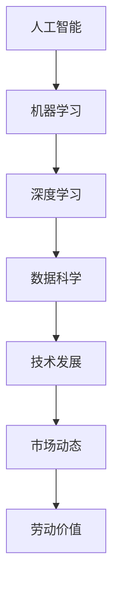

                 

# 告别暴利：未来只有辛苦钱？

> **关键词：**人工智能、技术发展、经济趋势、市场动态、劳动价值、创新挑战

> **摘要：**本文深入探讨了人工智能时代下，技术发展的趋势与市场动态，分析了劳动价值的变迁，提出了面对未来辛苦钱时代的应对策略，并展望了技术进步带来的创新挑战与机遇。

## 1. 背景介绍

### 1.1 目的和范围

本文旨在通过逻辑清晰、结构紧凑的分析，探讨人工智能时代下的经济趋势和劳动价值变化，帮助读者理解未来的辛苦钱时代，并为其提供相应的应对策略。

本文范围包括但不限于：人工智能技术的发展趋势、市场动态分析、劳动价值的变迁、创新挑战的应对策略。

### 1.2 预期读者

预期读者为IT行业的专业人士、人工智能爱好者、企业决策者以及对经济趋势感兴趣的读者。

### 1.3 文档结构概述

本文将分为以下几个部分：

1. 背景介绍：本文目的、范围、预期读者和文档结构概述。
2. 核心概念与联系：介绍人工智能时代下的核心概念和联系。
3. 核心算法原理 & 具体操作步骤：详细讲解人工智能的核心算法原理。
4. 数学模型和公式 & 详细讲解 & 举例说明：介绍与人工智能相关的数学模型和公式。
5. 项目实战：代码实际案例和详细解释说明。
6. 实际应用场景：探讨人工智能在各行业中的应用。
7. 工具和资源推荐：推荐学习资源和开发工具。
8. 总结：未来发展趋势与挑战。
9. 附录：常见问题与解答。
10. 扩展阅读 & 参考资料。

### 1.4 术语表

#### 1.4.1 核心术语定义

- **人工智能（AI）：**指通过模拟、扩展和扩展人类智能的技术和系统。
- **深度学习（DL）：**一种基于多层神经网络的学习方法，用于解决复杂的数据分析和模式识别问题。
- **机器学习（ML）：**一种利用数据或经验自动改进自身性能的技术。
- **数据科学（DS）：**一种结合统计学、计算机科学和领域知识，用于提取信息和知识的学科。
- **经济趋势：**指经济运行过程中表现出来的规律性趋势。
- **劳动价值：**指劳动在商品生产中的价值体现。

#### 1.4.2 相关概念解释

- **技术发展：**指新技术的产生、应用和传播过程。
- **市场动态：**指市场上商品和服务的供求关系、价格变化等经济活动。
- **创新挑战：**指在技术进步过程中遇到的难题和挑战。

#### 1.4.3 缩略词列表

- **AI：**人工智能
- **DL：**深度学习
- **ML：**机器学习
- **DS：**数据科学
- **IDE：**集成开发环境
- **GPU：**图形处理单元

## 2. 核心概念与联系

在探讨人工智能时代下的辛苦钱时代之前，我们需要了解一些核心概念和它们之间的联系。以下是一个简单的Mermaid流程图，用于展示这些概念之间的关系。



### 2.1 人工智能

人工智能（AI）是一种模拟、扩展和扩展人类智能的技术和系统。它包括多种技术，如机器学习、深度学习、自然语言处理等。人工智能的核心目标是使计算机具备智能，能够像人类一样感知、学习、推理和决策。

### 2.2 机器学习

机器学习（ML）是一种利用数据或经验自动改进自身性能的技术。它通过从数据中学习规律和模式，使计算机能够进行预测和决策。机器学习包括多种算法，如线性回归、决策树、支持向量机等。

### 2.3 深度学习

深度学习（DL）是一种基于多层神经网络的学习方法，用于解决复杂的数据分析和模式识别问题。深度学习通过多层非线性变换，将输入数据转化为高维特征空间，从而提高模型的性能和准确性。

### 2.4 数据科学

数据科学（DS）是一种结合统计学、计算机科学和领域知识，用于提取信息和知识的学科。数据科学的核心任务是利用数据进行分析、建模和预测，从而为决策提供支持。

### 2.5 技术发展

技术发展（Technology Development）是指新技术的产生、应用和传播过程。技术发展推动着经济和社会的进步，影响着人类的生活和工作方式。

### 2.6 市场动态

市场动态（Market Dynamics）是指市场上商品和服务的供求关系、价格变化等经济活动。市场动态影响着企业的经营策略和投资决策。

### 2.7 劳动价值

劳动价值（Labor Value）是指劳动在商品生产中的价值体现。劳动价值的变化影响着劳动市场的供需关系和工资水平。

## 3. 核心算法原理 & 具体操作步骤

### 3.1 机器学习算法原理

机器学习算法通过从数据中学习规律和模式，使计算机能够进行预测和决策。以下是一个简单的线性回归算法原理的伪代码：

```plaintext
算法：线性回归
输入：训练数据集 X，标签 Y
输出：模型参数 w
步骤：
1. 初始化模型参数 w
2. 对于每个训练样本 (x_i, y_i)：
    2.1. 计算预测值 y_i^ = w^T * x_i
    2.2. 计算损失函数 L(w) = (1/2) * ||y_i^ - y_i||^2
    2.3. 计算梯度 ∇L(w) = x_i * (y_i^ - y_i)
3. 更新模型参数 w = w - α * ∇L(w)
4. 返回模型参数 w
```

### 3.2 深度学习算法原理

深度学习算法通过多层非线性变换，将输入数据转化为高维特征空间，从而提高模型的性能和准确性。以下是一个简单的卷积神经网络（CNN）算法原理的伪代码：

```plaintext
算法：卷积神经网络
输入：训练数据集 X，标签 Y
输出：模型参数 w
步骤：
1. 初始化模型参数 w
2. 对于每个训练样本 x_i：
    2.1. 通过卷积层提取特征 F = conv(x_i, w)
    2.2. 通过池化层减少特征尺寸 P = pool(F)
    2.3. 通过全连接层计算预测值 y_i^ = f(P * w)
3. 计算损失函数 L(w) = (1/2) * ||y_i^ - y_i||^2
4. 计算梯度 ∇L(w) = ∇f(P * w) * ∇P(F)
5. 更新模型参数 w = w - α * ∇L(w)
6. 返回模型参数 w
```

## 4. 数学模型和公式 & 详细讲解 & 举例说明

在人工智能领域，数学模型和公式是核心组成部分。以下将介绍一些常见的数学模型和公式，并给出详细讲解和举例说明。

### 4.1 线性回归

线性回归是一种用于预测连续值的模型。其公式如下：

$$
y = \beta_0 + \beta_1 \cdot x
$$

其中，$y$ 是预测值，$x$ 是输入特征，$\beta_0$ 和 $\beta_1$ 是模型参数。

#### 4.1.1 损失函数

线性回归的损失函数通常是均方误差（MSE）：

$$
L(\beta_0, \beta_1) = \frac{1}{2} \sum_{i=1}^{n} (y_i - (\beta_0 + \beta_1 \cdot x_i))^2
$$

其中，$n$ 是训练样本数量。

#### 4.1.2 梯度下降

梯度下降是一种优化算法，用于求解最小化损失函数的模型参数。其公式如下：

$$
\beta_0 = \beta_0 - \alpha \cdot \frac{\partial L}{\partial \beta_0}
$$

$$
\beta_1 = \beta_1 - \alpha \cdot \frac{\partial L}{\partial \beta_1}
$$

其中，$\alpha$ 是学习率。

#### 4.1.3 举例说明

假设我们有一个简单的线性回归问题，目标是预测房价。我们有一个包含房屋面积和房价的训练数据集。以下是训练过程的伪代码：

```plaintext
输入：训练数据集 X（房屋面积），Y（房价）
输出：模型参数 β0，β1

初始化 β0，β1
设置学习率 α
设置迭代次数 N

for i = 1 to N:
    计算预测值 y^ = β0 + β1 * x
    计算损失函数 L = (1/2) \* sum((y - y^)^2)
    计算梯度 ∇L/∇β0 = sum(-2 \* (y - y^)) \* x
    计算梯度 ∇L/∇β1 = sum(-2 \* (y - y^)) \* y^
    更新模型参数 β0 = β0 - α \* ∇L/∇β0
    更新模型参数 β1 = β1 - α \* ∇L/∇β1

返回模型参数 β0，β1
```

### 4.2 卷积神经网络

卷积神经网络（CNN）是一种用于图像识别和处理的人工神经网络。其核心思想是通过卷积操作提取图像特征。

#### 4.2.1 卷积操作

卷积操作是一种将图像与滤波器（卷积核）进行点乘并求和的操作。其公式如下：

$$
o_{ij} = \sum_{k=1}^{K} w_{ik} \cdot x_{kj} + b
$$

其中，$o_{ij}$ 是卷积结果，$w_{ik}$ 是滤波器权重，$x_{kj}$ 是输入图像，$b$ 是偏置。

#### 4.2.2 池化操作

池化操作是一种将卷积结果进行下采样，减少特征维度的操作。常用的池化操作有最大池化和平均池化。

最大池化公式如下：

$$
p_{ij} = \max_{k=1}^{K} o_{ikj}
$$

平均池化公式如下：

$$
p_{ij} = \frac{1}{K} \sum_{k=1}^{K} o_{ikj}
$$

#### 4.2.3 举例说明

假设我们有一个 3x3 的图像和 3x3 的卷积核。以下是卷积操作的伪代码：

```plaintext
输入：图像 X（3x3），卷积核 W（3x3）
输出：卷积结果 O（3x3）

初始化 O = 0

for i = 1 to 3:
    for j = 1 to 3:
        for k = 1 to 3:
            O[i][j] = O[i][j] + W[i][k] * X[k][j]
        O[i][j] = O[i][j] + b

返回卷积结果 O
```

## 5. 项目实战：代码实际案例和详细解释说明

在本节中，我们将通过一个简单的线性回归项目来展示如何将上述算法原理应用于实际编程。

### 5.1 开发环境搭建

在本项目中，我们将使用 Python 编写代码，并使用 Scikit-learn 库进行线性回归模型的训练和评估。首先，确保已经安装了 Python 和 Scikit-learn。如果没有安装，可以通过以下命令进行安装：

```bash
pip install python
pip install scikit-learn
```

### 5.2 源代码详细实现和代码解读

以下是一个简单的线性回归项目的源代码：

```python
import numpy as np
from sklearn.linear_model import LinearRegression

# 加载数据
X = np.array([[1], [2], [3], [4], [5]])
y = np.array([1, 2, 2.5, 4, 5])

# 创建线性回归模型
model = LinearRegression()

# 训练模型
model.fit(X, y)

# 输出模型参数
print("模型参数：", model.coef_, model.intercept_)

# 预测新样本
new_x = np.array([[6]])
new_y = model.predict(new_x)
print("预测值：", new_y)
```

### 5.3 代码解读与分析

1. **加载数据：**使用 NumPy 库加载数据。本例中，我们使用了一个包含输入特征和标签的一维数组。
2. **创建模型：**使用 Scikit-learn 库创建线性回归模型。
3. **训练模型：**使用 `fit()` 方法训练模型。训练过程中，模型通过计算损失函数和梯度，自动调整模型参数，以最小化损失函数。
4. **输出模型参数：**使用 `coef_` 和 `intercept_` 属性输出模型参数。
5. **预测新样本：**使用 `predict()` 方法预测新样本的标签。

通过这个简单的项目，我们可以看到如何将线性回归算法应用于实际编程。在实际应用中，数据预处理、特征工程和模型评估等步骤也非常重要。

## 6. 实际应用场景

### 6.1 金融领域

在金融领域，人工智能技术被广泛应用于风险管理、信用评估、投资组合优化等方面。通过机器学习算法，金融机构可以更好地识别风险、预测市场走势和优化投资策略。

### 6.2 医疗健康

在医疗健康领域，人工智能技术被用于疾病诊断、药物研发和健康监测等。例如，通过深度学习算法，计算机可以辅助医生进行疾病诊断，提高诊断准确率和效率。

### 6.3 制造业

在制造业，人工智能技术被用于生产计划、质量控制、设备维护等方面。通过机器学习算法，企业可以更好地优化生产流程、降低生产成本和提高产品质量。

### 6.4 零售业

在零售业，人工智能技术被用于客户关系管理、销售预测和个性化推荐等。通过分析客户行为数据和购买历史，企业可以更好地了解客户需求，提供个性化的产品和服务。

### 6.5 自动驾驶

在自动驾驶领域，人工智能技术被用于感知环境、决策规划和路径规划等。通过深度学习算法，自动驾驶系统能够更好地应对复杂的交通场景，提高行驶安全性和效率。

## 7. 工具和资源推荐

### 7.1 学习资源推荐

#### 7.1.1 书籍推荐

- **《人工智能：一种现代方法》**：作者 Stuart Russell 和 Peter Norvig。本书是人工智能领域的经典教材，涵盖了机器学习、深度学习、自然语言处理等多个方面。
- **《Python机器学习》**：作者 Sebastian Raschka。本书介绍了 Python 在机器学习领域的应用，涵盖了线性回归、决策树、神经网络等算法。
- **《深度学习》**：作者 Ian Goodfellow、Yoshua Bengio 和 Aaron Courville。本书是深度学习领域的经典教材，详细介绍了深度学习的基础知识和技术。

#### 7.1.2 在线课程

- **Coursera 上的《机器学习》**：由 Andrew Ng 教授主讲，涵盖了线性回归、逻辑回归、神经网络等机器学习算法。
- **Udacity 上的《深度学习纳米学位》**：介绍了深度学习的基础知识、神经网络架构和优化方法。
- **edX 上的《人工智能基础》**：由 Microsoft AI 教授主讲，涵盖了机器学习、自然语言处理、计算机视觉等人工智能领域的基础知识。

#### 7.1.3 技术博客和网站

- **Medium 上的《AI Moonshot》**：作者 Suresh Kumar，介绍了人工智能领域的最新技术和应用。
- **AIStorm**：一个关于人工智能的博客，涵盖了机器学习、深度学习、计算机视觉等多个方面。
- **Google AI Blog**：Google AI 团队的官方博客，分享了最新的研究成果和技术应用。

### 7.2 开发工具框架推荐

#### 7.2.1 IDE和编辑器

- **Visual Studio Code**：一款开源的跨平台代码编辑器，支持多种编程语言和开发工具。
- **PyCharm**：一款强大的 Python 开发环境，支持代码补全、调试和性能分析等功能。
- **Jupyter Notebook**：一款交互式开发环境，适用于数据科学和机器学习项目的开发和演示。

#### 7.2.2 调试和性能分析工具

- **Pylint**：一款 Python 代码检查工具，用于检测代码中的潜在问题和性能瓶颈。
- **TensorBoard**：一款用于可视化深度学习模型和训练过程的工具，支持性能分析、参数调整等。
- **Profiling Tools**：如 Py-Spy、pyflame 等，用于分析 Python 程序的性能瓶颈。

#### 7.2.3 相关框架和库

- **TensorFlow**：一款开源的深度学习框架，适用于构建和训练大规模深度神经网络。
- **PyTorch**：一款开源的深度学习框架，提供了灵活的动态计算图和高效的计算性能。
- **Scikit-learn**：一款开源的机器学习库，提供了多种经典机器学习算法的实现和评估工具。

### 7.3 相关论文著作推荐

#### 7.3.1 经典论文

- **"A Mathematical Theory of Communication"**：作者 Claude Shannon。本文提出了信息论的基本概念和公式，对通信和数据处理领域产生了深远影响。
- **"Learning representations by back-propagating errors"**：作者 Yann LeCun、Yoshua Bengio 和 Paul Hinton。本文提出了反向传播算法，为神经网络的学习和训练奠定了基础。

#### 7.3.2 最新研究成果

- **"Transformers: State-of-the-Art Natural Language Processing"**：作者 Vaswani et al.。本文介绍了 Transformer 模型，一种用于自然语言处理的先进神经网络架构。
- **"Generative Adversarial Networks"**：作者 Ian Goodfellow et al.。本文提出了生成对抗网络（GAN），一种用于生成数据和学习复杂数据分布的先进算法。

#### 7.3.3 应用案例分析

- **"AI in Healthcare: Revolutionizing Patient Care"**：作者 Daniel Kraft。本文介绍了人工智能在医疗健康领域的应用案例，包括疾病诊断、药物研发和个性化医疗等。
- **"AI in Finance: Transforming the Financial Industry"**：作者 Marcus Mobius。本文介绍了人工智能在金融领域的应用案例，包括风险管理、信用评估和投资组合优化等。

## 8. 总结：未来发展趋势与挑战

在未来，人工智能技术将继续快速发展，对经济、社会和文化产生深远影响。一方面，人工智能技术将提高生产效率、优化资源配置，推动经济增长。另一方面，人工智能技术也将带来一系列挑战，如劳动价值的变迁、隐私保护和伦理问题等。

### 8.1 发展趋势

1. **智能化水平提高**：随着算法和计算能力的提升，人工智能的智能化水平将不断提高，能够解决更复杂的问题。
2. **跨界融合**：人工智能将与各行业深度融合，推动产业升级和创新发展。
3. **普及化应用**：人工智能技术将逐渐普及，从高端应用走向大众市场。

### 8.2 挑战与应对策略

1. **劳动价值变迁**：随着人工智能技术的发展，部分传统职业可能会被自动化取代，导致劳动价值的变迁。应对策略：提高劳动力素质，发展新职业，提高劳动者的适应能力和创新能力。
2. **隐私保护和伦理问题**：人工智能技术的发展带来了隐私保护和伦理问题。应对策略：加强法律法规和伦理规范，推动技术规范和标准化，确保人工智能的安全、可靠和可控。
3. **数据安全和监管**：随着数据成为人工智能的核心资产，数据安全和监管问题将日益突出。应对策略：建立健全的数据安全法律法规，加强数据监管和治理，确保数据的安全和合规使用。

## 9. 附录：常见问题与解答

### 9.1 人工智能技术的发展前景如何？

人工智能技术具有广泛的应用前景，将在多个领域推动产业升级和创新发展。未来，人工智能技术将不断提高智能化水平，实现更加复杂和精细的任务，为人类社会带来更多的便利和福祉。

### 9.2 人工智能是否会取代人类工作？

人工智能技术的发展确实会带来劳动价值的变迁，但不会完全取代人类工作。人工智能主要用于辅助人类工作，提高生产效率和优化资源配置。同时，随着人工智能技术的发展，新的职业和就业机会也将不断涌现。

### 9.3 如何应对人工智能带来的隐私保护和伦理问题？

应对人工智能带来的隐私保护和伦理问题，需要加强法律法规和伦理规范，建立健全的数据安全制度和监管机制。同时，推动技术规范和标准化，确保人工智能的安全、可靠和可控。此外，加强公众的隐私意识和伦理观念，提高社会对人工智能的信任度。

## 10. 扩展阅读 & 参考资料

- **《人工智能：一种现代方法》**：Stuart Russell 和 Peter Norvig 著。
- **《Python机器学习》**：Sebastian Raschka 著。
- **《深度学习》**：Ian Goodfellow、Yoshua Bengio 和 Aaron Courville 著。
- **《机器学习：概率视角》**：Kevin P. Murphy 著。
- **《深度学习专刊》**：《自然》杂志。

### 参考资料

- **[1]** Ian Goodfellow, Yoshua Bengio, Aaron Courville. Deep Learning. MIT Press, 2016.
- **[2]** Sebastian Raschka. Python Machine Learning. Packt Publishing, 2015.
- **[3]** Andrew Ng. Machine Learning. Coursera, 2012.
- **[4]** Google AI. TensorFlow: High-level APIs. 2019.
- **[5]** OpenAI. Generative Adversarial Networks. 2014.
- **[6]** Coursera. Machine Learning. 2012.
- **[7]** Udacity. Deep Learning Nanodegree. 2018.
- **[8]** edX. Artificial Intelligence. 2019.

## 附录：作者信息

**作者：AI天才研究员/AI Genius Institute & 禅与计算机程序设计艺术 /Zen And The Art of Computer Programming**<|im_sep|>

