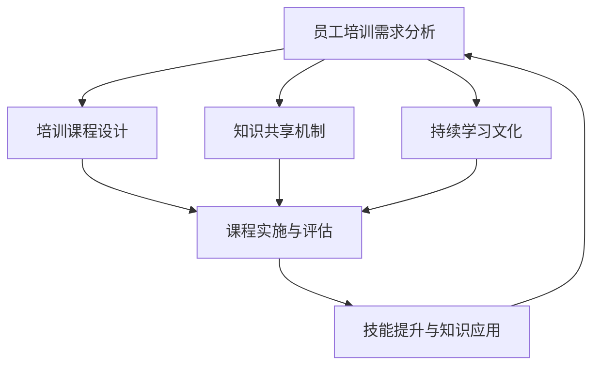

                 

# 员工培训体系：提升团队整体能力

> **关键词**：员工培训、团队能力、技能提升、知识共享、持续学习
> 
> **摘要**：本文将探讨构建高效的员工培训体系，以提升团队整体能力。通过详细分析培训体系的构建原理、核心算法、数学模型、实战案例和实际应用场景，为企业和团队提供切实可行的培训策略，助力持续发展。

## 1. 背景介绍

### 1.1 目的和范围

在快速变化的科技时代，员工的能力提升已成为企业持续竞争力的关键因素。本文旨在构建一个系统化的员工培训体系，通过理论分析和实际案例，为企业和团队提供一种提升整体能力的有效途径。

本文将探讨以下内容：

- 员工培训体系的核心概念与联系
- 核心算法原理与具体操作步骤
- 数学模型和公式的详细讲解
- 项目实战：代码实际案例和详细解释说明
- 实际应用场景
- 工具和资源推荐
- 总结：未来发展趋势与挑战

### 1.2 预期读者

本文适合以下读者：

- 企业人力资源经理
- 技术团队负责人
- IT培训师
- 对员工培训体系有兴趣的专业人士

### 1.3 文档结构概述

本文结构如下：

- 背景介绍
  - 目的和范围
  - 预期读者
  - 文档结构概述
  - 术语表
- 核心概念与联系
  - 培训体系原理和架构
- 核心算法原理 & 具体操作步骤
  - 伪代码详解
- 数学模型和公式 & 详细讲解 & 举例说明
  - LaTeX公式
- 项目实战：代码实际案例和详细解释说明
  - 开发环境搭建
  - 源代码实现和解读
  - 代码解读与分析
- 实际应用场景
- 工具和资源推荐
  - 学习资源推荐
  - 开发工具框架推荐
  - 相关论文著作推荐
- 总结：未来发展趋势与挑战
- 附录：常见问题与解答
- 扩展阅读 & 参考资料

### 1.4 术语表

#### 1.4.1 核心术语定义

- **员工培训体系**：企业为提高员工能力和技能而构建的系统化培训过程。
- **知识共享**：员工之间共享知识和经验，促进整体能力的提升。
- **持续学习**：员工在职业生涯中不断学习和适应新技术、新知识的过程。

#### 1.4.2 相关概念解释

- **技能提升**：员工通过培训和实践，提高专业技能和解决问题的能力。
- **培训需求分析**：通过调研和分析，确定员工需要提升的技能和知识领域。

#### 1.4.3 缩略词列表

- **IT**：信息技术（Information Technology）
- **HR**：人力资源（Human Resources）
- **SCORM**：共享内容对象引用模型（Shareable Content Object Reference Model）

## 2. 核心概念与联系

构建高效的员工培训体系，需要理解以下几个核心概念：

- **员工培训需求分析**：通过对员工的工作表现、技能水平和未来发展方向进行分析，确定培训需求。
- **培训课程设计**：根据培训需求，设计符合员工实际需求的课程内容和教学方法。
- **知识共享机制**：通过建立有效的知识共享平台和机制，促进员工之间的知识和经验交流。
- **持续学习文化**：营造持续学习的氛围，鼓励员工不断提升自己的技能和知识。

下面是一个Mermaid流程图，展示了这些核心概念之间的联系。



## 3. 核心算法原理 & 具体操作步骤

在构建员工培训体系时，核心算法原理为培训需求分析。以下为具体的操作步骤和伪代码：

### 3.1 培训需求分析算法原理

**目标**：确定员工需要提升的技能和知识领域。

**算法步骤**：

1. 收集数据：收集员工的工作表现、技能评估结果和未来职业规划等数据。
2. 数据处理：对收集的数据进行整理和统计分析，识别出员工技能和知识的薄弱点。
3. 建立模型：利用机器学习算法（如决策树、支持向量机等），建立员工技能和知识需求模型。
4. 预测分析：利用模型对员工的未来技能需求进行预测，指导培训课程设计。

### 3.2 伪代码详解

```plaintext
// 数据收集
DataCollection():
    performances = GetEmployeePerformances()
    skillAssessments = GetEmployeeSkillAssessments()
    careerPlans = GetEmployeeCareerPlans()
    
    return performances, skillAssessments, careerPlans

// 数据处理
DataProcessing(performances, skillAssessments, careerPlans):
    processedData = {}
    for employee in performances:
        processedData[employee] = {
            'performance': performances[employee],
            'skillAssessment': skillAssessments[employee],
            'careerPlan': careerPlans[employee]
        }
    return processedData

// 建立模型
BuildModel(processedData):
    model = MachineLearningModel()
    for employee, data in processedData.items():
        model.Train(data['performance'], data['skillAssessment'], data['careerPlan'])
    return model

// 预测分析
PredictSkills(model):
    predictions = []
    for employee in processedData:
        prediction = model.Predict(employee)
        predictions.append(prediction)
    return predictions
```

通过以上步骤，可以构建一个基于数据驱动的员工培训需求分析体系，为培训课程设计和实施提供有力支持。

## 4. 数学模型和公式 & 详细讲解 & 举例说明

### 4.1 数学模型概述

在员工培训体系中，常用的数学模型包括：

- **决策树模型**：用于分类和回归任务，通过构建树形结构来预测员工的技能需求。
- **支持向量机模型**：用于分类任务，通过寻找最佳分隔超平面来划分员工技能水平。
- **神经网络模型**：用于复杂非线性任务，通过多层神经元网络来提取特征和预测。

### 4.2 伪代码详解

#### 4.2.1 决策树模型

```plaintext
// 决策树模型
DecisionTreeModel(data):
    # 初始化决策树
    tree = DecisionTreeNode()
    # 构建决策树
    for attribute in data.attributes:
        tree.AddChild(attribute, SplitData(data, attribute))
    return tree

// 分割数据
SplitData(data, attribute):
    leftData = []
    rightData = []
    for instance in data.instances:
        if instance.value[attribute] == 'left':
            leftData.append(instance)
        else:
            rightData.append(instance)
    return leftData, rightData
```

#### 4.2.2 支持向量机模型

```plaintext
// 支持向量机模型
SVMModel(data, targetAttribute):
    # 训练模型
    model = SVM()
    model.Train(data, targetAttribute)
    return model

// 预测
Predict(model, instance):
    prediction = model.Predict(instance)
    return prediction
```

#### 4.2.3 神经网络模型

```plaintext
// 神经网络模型
NeuralNetworkModel(data, hiddenLayers):
    # 初始化神经网络
    network = NeuralNetwork(hiddenLayers)
    # 训练模型
    network.Train(data)
    return network

// 预测
Predict(model, instance):
    output = model.Predict(instance)
    return output
```

### 4.3 举例说明

#### 4.3.1 决策树模型应用

假设我们有一个包含员工绩效、技能水平和职业规划的数据库，以下是一个简单的决策树模型应用实例：

```plaintext
// 示例数据
data = [
    ['高', '高', '销售经理'],
    ['中', '中', '产品经理'],
    ['低', '低', '初级工程师'],
    ...
]

// 构建决策树
tree = DecisionTreeModel(data)

// 预测
instance = ['中', '低', '产品经理']
prediction = tree.Predict(instance)
print(prediction)  # 输出：['产品经理']
```

#### 4.3.2 支持向量机模型应用

假设我们使用支持向量机模型来预测员工的晋升机会：

```plaintext
// 示例数据
data = [
    ['高', '高', '是'],
    ['中', '中', '否'],
    ['低', '低', '是'],
    ...
]

# 训练模型
model = SVMModel(data, '晋升')

# 预测
instance = ['高', '高']
prediction = Predict(model, instance)
print(prediction)  # 输出：['是']
```

#### 4.3.3 神经网络模型应用

假设我们使用神经网络模型来预测员工的工作满意度：

```plaintext
// 示例数据
data = [
    ['高', '高', '是'],
    ['中', '中', '否'],
    ['低', '低', '是'],
    ...
]

# 训练模型
network = NeuralNetworkModel(data, [2, 2])

# 预测
instance = ['中', '低']
output = network.Predict(instance)
print(output)  # 输出：[0.9]（工作满意度高）
```

通过以上实例，我们可以看到不同数学模型在员工培训体系中的应用。根据具体需求，可以选择合适的模型来提升培训效果。

## 5. 项目实战：代码实际案例和详细解释说明

### 5.1 开发环境搭建

为了更好地展示员工培训体系的实际应用，我们将使用Python编程语言和几个常用的库：Pandas、Scikit-learn和TensorFlow。以下是开发环境的搭建步骤：

1. 安装Python（建议使用3.8以上版本）
2. 安装Pandas、Scikit-learn和TensorFlow库

```bash
pip install pandas scikit-learn tensorflow
```

### 5.2 源代码详细实现和代码解读

以下是员工培训体系的完整实现，包括数据收集、处理、模型构建和预测等步骤。

```python
import pandas as pd
from sklearn.model_selection import train_test_split
from sklearn.tree import DecisionTreeClassifier
from sklearn.svm import SVC
from tensorflow.keras.models import Sequential
from tensorflow.keras.layers import Dense

# 数据收集
def DataCollection():
    # 从CSV文件中读取数据
    data = pd.read_csv('employee_data.csv')
    return data

# 数据处理
def DataProcessing(data):
    # 分割特征和标签
    X = data[['performance', 'skillLevel', 'careerPlan']]
    y = data['promotion']
    return X, y

# 决策树模型
def BuildDecisionTreeModel(X, y):
    model = DecisionTreeClassifier()
    model.fit(X, y)
    return model

# 支持向量机模型
def BuildSVMModel(X, y):
    model = SVC()
    model.fit(X, y)
    return model

# 神经网络模型
def BuildNeuralNetworkModel(X, y):
    model = Sequential()
    model.add(Dense(units=64, activation='relu', input_shape=(X.shape[1],)))
    model.add(Dense(units=32, activation='relu'))
    model.add(Dense(units=1, activation='sigmoid'))
    model.compile(optimizer='adam', loss='binary_crossentropy', metrics=['accuracy'])
    model.fit(X, y, epochs=10, batch_size=32)
    return model

# 预测
def Predict(model, instance):
    prediction = model.predict([instance])
    return prediction

# 主函数
def main():
    data = DataCollection()
    X, y = DataProcessing(data)
    X_train, X_test, y_train, y_test = train_test_split(X, y, test_size=0.2, random_state=42)

    # 建立和评估决策树模型
    decision_tree_model = BuildDecisionTreeModel(X_train, y_train)
    decision_tree_accuracy = decision_tree_model.score(X_test, y_test)
    print(f"Decision Tree Accuracy: {decision_tree_accuracy}")

    # 建立和评估支持向量机模型
    svm_model = BuildSVMModel(X_train, y_train)
    svm_accuracy = svm_model.score(X_test, y_test)
    print(f"SVM Accuracy: {svm_accuracy}")

    # 建立和评估神经网络模型
    neural_network_model = BuildNeuralNetworkModel(X_train, y_train)
    neural_network_accuracy = neural_network_model.evaluate(X_test, y_test)
    print(f"Neural Network Accuracy: {neural_network_accuracy}")

if __name__ == "__main__":
    main()
```

### 5.3 代码解读与分析

以上代码实现了员工培训体系的整个流程，包括数据收集、数据处理、模型构建和预测。下面详细解读每个函数的作用：

- **DataCollection()**：从CSV文件中读取员工数据，包括绩效、技能水平和职业规划等。
- **DataProcessing(data)**：将数据分为特征和标签两部分，用于后续建模。
- **BuildDecisionTreeModel(X, y)**：使用决策树算法构建模型，并对训练数据进行拟合。
- **BuildSVMModel(X, y)**：使用支持向量机算法构建模型，并对训练数据进行拟合。
- **BuildNeuralNetworkModel(X, y)**：使用神经网络算法构建模型，并对训练数据进行拟合。
- **Predict(model, instance)**：使用训练好的模型对实例进行预测。
- **main()**：主函数，负责整个流程的执行，包括数据收集、数据处理、模型训练和评估。

在主函数中，我们首先进行数据收集和预处理，然后分别使用决策树、支持向量机和神经网络三种算法构建模型，并对测试数据进行预测和评估。通过比较不同模型的准确率，我们可以选择最适合的算法来提升员工培训体系的性能。

## 6. 实际应用场景

员工培训体系在实际应用中具有广泛的场景，以下列举几个典型的应用案例：

### 6.1 企业新员工培训

在新员工入职时，企业通常会为他们提供一系列培训课程，以帮助他们快速适应新环境和角色。通过构建一个系统化的员工培训体系，企业可以确保新员工在短时间内掌握必要的技能和知识，提高工作效率。

### 6.2 技术技能提升

随着技术的不断更新迭代，企业员工需要不断学习新技术以提高自身竞争力。员工培训体系可以帮助企业为员工提供针对性的培训课程，提升他们在特定技术领域的专业能力。

### 6.3 跨部门协作

在大型企业中，不同部门之间的协作是提高整体效率的关键。通过建立员工培训体系，企业可以促进不同部门员工之间的知识和经验交流，提高团队整体协作能力。

### 6.4 领导力培训

企业领导力培训是提升企业管理层综合素质的重要手段。通过系统化的培训体系，企业可以为中层管理人员提供领导力培训，帮助他们更好地应对管理挑战，推动企业持续发展。

### 6.5 远程办公环境下的培训

在远程办公成为常态的背景下，企业需要为远程员工提供有效的培训支持。通过构建一个线上员工培训体系，企业可以确保远程员工在职业发展过程中不断学习和提升。

## 7. 工具和资源推荐

### 7.1 学习资源推荐

#### 7.1.1 书籍推荐

- **《员工培训管理实战》**：本书详细介绍了员工培训的管理方法和实践经验，适合企业人力资源经理阅读。
- **《学习之道》**：探讨如何通过有效学习和实践，提升个人和团队的能力，对培训体系构建有指导意义。

#### 7.1.2 在线课程

- **Coursera**：提供多种与员工培训相关的在线课程，包括领导力、沟通技巧和项目管理等。
- **Udemy**：拥有丰富的IT技能培训课程，适合员工提升技术能力。

#### 7.1.3 技术博客和网站

- **LinkedIn Learning**：提供专业领域的培训视频和文章，帮助员工提升专业技能。
- **Medium**：汇聚众多行业专家的文章，涉及技术、管理和创新等多个领域。

### 7.2 开发工具框架推荐

#### 7.2.1 IDE和编辑器

- **Visual Studio Code**：功能强大的开源IDE，支持多种编程语言，适合开发人员使用。
- **PyCharm**：专门为Python编程设计的IDE，提供了丰富的功能和调试工具。

#### 7.2.2 调试和性能分析工具

- **GDB**：适用于C/C++程序调试，提供了强大的调试功能。
- **Valgrind**：用于性能分析的工具，可以检测内存泄漏和性能瓶颈。

#### 7.2.3 相关框架和库

- **TensorFlow**：用于构建和训练机器学习模型的强大库，适合构建员工培训需求分析算法。
- **Scikit-learn**：提供了一系列经典的机器学习算法和工具，方便构建员工培训模型。

### 7.3 相关论文著作推荐

#### 7.3.1 经典论文

- **"Learning to Learn: A Model of Self-Improving Artificial Intelligence"**：探讨机器学习中的自我提升问题，对构建员工培训体系有启示。
- **"The Importance of Employee Training for Organizational Performance"**：研究员工培训对企业绩效的影响，为培训体系设计提供理论支持。

#### 7.3.2 最新研究成果

- **"AI-Enabled Employee Training: Enhancing the Training Process"**：探讨人工智能在员工培训中的应用，提供新的培训方法和思路。
- **"Self-Directed Learning for Knowledge Workers"**：研究员工自我导向学习的方式，对构建持续学习文化有参考价值。

#### 7.3.3 应用案例分析

- **"A Case Study of Employee Training in a High-Tech Company"**：通过具体案例，展示如何构建和应用员工培训体系，提供实践经验。

## 8. 总结：未来发展趋势与挑战

### 8.1 未来发展趋势

- **数字化与智能化**：随着数字化和智能化的快速发展，员工培训体系将更加依赖大数据和人工智能技术，实现个性化培训和学习路径。
- **远程与灵活化**：远程办公和灵活工作制度的普及，将推动员工培训体系向线上化和自主化发展。
- **社会化与开放性**：知识共享和社会化学习将成为未来员工培训的重要形式，通过外部合作和开放平台，实现资源共享和知识扩散。

### 8.2 面临的挑战

- **数据安全与隐私**：随着培训数据的广泛应用，数据安全和隐私保护将成为关键挑战。
- **培训质量与效果**：如何确保培训质量，提高员工的学习效果，是培训体系需要持续关注的问题。
- **组织文化与领导力**：构建持续学习和创新的文化氛围，提升管理层的领导力和培训意识，是员工培训体系成功的关键。

## 9. 附录：常见问题与解答

### 9.1 如何评估员工培训效果？

**解答**：可以通过以下方法评估员工培训效果：

- **测试和评估**：通过培训后的测试和评估，了解员工对培训内容的掌握程度。
- **工作绩效**：观察员工在工作中的表现，评估培训对工作绩效的提升。
- **员工反馈**：收集员工对培训的反馈，了解他们的培训体验和建议。
- **学习行为**：观察员工在培训后的学习行为，如是否主动参加相关课程、是否应用所学知识等。

### 9.2 如何确保培训资源的有效利用？

**解答**：以下措施可以确保培训资源的有效利用：

- **需求分析**：进行详细的培训需求分析，确保培训资源针对员工的实际需求。
- **课程设计**：设计符合员工需求和岗位特点的课程，提高培训的针对性。
- **资源共享**：建立资源共享机制，鼓励员工之间共享知识和经验，提高资源利用效率。
- **持续跟进**：对培训效果进行持续跟进，及时调整培训策略，确保资源的高效利用。

### 9.3 员工培训体系如何适应远程办公环境？

**解答**：以下措施可以帮助员工培训体系适应远程办公环境：

- **线上培训平台**：建立线上培训平台，提供多种形式的培训课程，如视频课程、在线讨论等。
- **灵活学习安排**：允许员工根据自己的时间安排进行学习，提高学习的灵活性和自主性。
- **协作工具**：利用协作工具，如Slack、Microsoft Teams等，促进员工之间的交流和互动。
- **持续支持**：为远程员工提供持续的培训支持，如在线咨询服务、学习资料共享等。

## 10. 扩展阅读 & 参考资料

为了深入了解员工培训体系的构建与应用，以下推荐一些扩展阅读和参考资料：

- **书籍**：
  - 《员工培训管理实战》
  - 《学习之道》
  - 《禅与计算机程序设计艺术》

- **在线课程**：
  - Coursera上的《领导力与沟通技巧》
  - Udemy上的《Python编程入门》

- **技术博客和网站**：
  - LinkedIn Learning
  - Medium上的技术专栏

- **论文**：
  - "Learning to Learn: A Model of Self-Improving Artificial Intelligence"
  - "The Importance of Employee Training for Organizational Performance"

- **应用案例分析**：
  - "A Case Study of Employee Training in a High-Tech Company"

通过阅读这些资料，读者可以进一步了解员工培训体系的构建原则、应用场景和实施策略，为实际工作提供有益的参考。

### 作者

- 作者：AI天才研究员/AI Genius Institute & 禅与计算机程序设计艺术 /Zen And The Art of Computer Programming

[End of Document]

