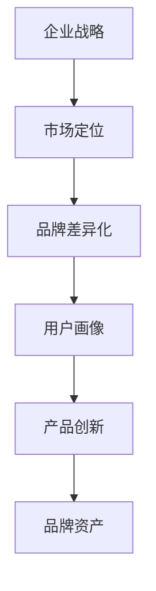

                 

# 品牌差异化：在竞争中脱颖而出

## 关键词：品牌建设、差异化竞争、市场营销、产品创新、用户体验

> 摘要：本文将探讨品牌差异化在竞争激烈的市场中的重要性。通过分析品牌差异化的核心概念、策略和实践，本文旨在为企业和个人提供在市场中脱颖而出、建立持久竞争力的方法和思路。

## 1. 背景介绍

### 1.1 目的和范围

本文旨在揭示品牌差异化的重要性，探讨品牌差异化策略的实施方法和实际案例。本文涵盖了品牌差异化的基础概念、市场营销策略、产品创新和用户体验等方面，旨在为企业和个人提供切实可行的品牌建设指导。

### 1.2 预期读者

本文适合以下读者：

- 市场营销和品牌管理人员
- 企业高层决策者
- 创业者和企业主
- 广告和公关从业人员
- 对品牌建设和市场营销感兴趣的专业人士

### 1.3 文档结构概述

本文分为以下几个部分：

- 1. 背景介绍：介绍本文的目的、范围和预期读者
- 2. 核心概念与联系：阐述品牌差异化的核心概念和联系
- 3. 核心算法原理 & 具体操作步骤：介绍品牌差异化策略的实施方法
- 4. 数学模型和公式 & 详细讲解 & 举例说明：阐述品牌差异化策略的数学模型和公式
- 5. 项目实战：代码实际案例和详细解释说明
- 6. 实际应用场景：分析品牌差异化的实际应用场景
- 7. 工具和资源推荐：推荐与品牌建设相关的学习资源和工具
- 8. 总结：未来发展趋势与挑战
- 9. 附录：常见问题与解答
- 10. 扩展阅读 & 参考资料：提供进一步的阅读资源和参考文献

### 1.4 术语表

#### 1.4.1 核心术语定义

- 品牌差异化（Brand Differentiation）：指企业在产品或服务中引入独特的特点，使其与竞争对手区分开来，以吸引和保留顾客。
- 市场定位（Market Positioning）：指企业确定自己在市场中的位置，以及如何与竞争对手区分开来。
- 用户画像（User Persona）：指对目标用户特征的描述，包括用户的需求、行为、偏好等信息。
- 品牌资产（Brand Equity）：指品牌在消费者心目中的价值，包括品牌的认知度、忠诚度、感知质量和品牌形象等。
- 产品创新（Product Innovation）：指企业通过技术创新、功能改进、设计优化等手段，推出具有竞争力的新产品或服务。

#### 1.4.2 相关概念解释

- 市场竞争（Market Competition）：指企业在市场中为了争夺市场份额而展开的竞争。
- 消费者需求（Consumer Demand）：指消费者对某种产品或服务的需求程度和购买意愿。
- 市场细分（Market Segmentation）：指将市场划分为不同的细分市场，以满足不同消费者群体的需求。

#### 1.4.3 缩略词列表

- BI：品牌差异化（Brand Differentiation）
- SEO：搜索引擎优化（Search Engine Optimization）
- SEM：搜索引擎营销（Search Engine Marketing）
- CRM：客户关系管理（Customer Relationship Management）

## 2. 核心概念与联系

在竞争激烈的市场环境中，品牌差异化是企业在市场中脱颖而出的关键。品牌差异化不仅关系到企业的市场份额和竞争力，还直接影响消费者的购买决策。为了深入理解品牌差异化的核心概念，我们需要从以下几个方面展开讨论。

### 2.1 品牌差异化的核心概念

品牌差异化是指企业在产品或服务中引入独特的特点，使其与竞争对手区分开来，以吸引和保留顾客。品牌差异化的核心概念包括：

- **独特性（Uniqueness）**：企业需要找到与竞争对手不同的独特特点，以形成差异化优势。
- **感知价值（Perceived Value）**：消费者需要感受到品牌差异化的价值，这是品牌差异化成功的关键。
- **可持续性（Sustainability）**：品牌差异化需要具备持续性，以确保企业能够在市场竞争中保持优势。

### 2.2 品牌差异化的联系

品牌差异化与企业战略、市场定位、用户画像等密切相关。以下是品牌差异化的几个关键联系：

- **企业战略**：品牌差异化是企业战略的一部分，需要与企业整体战略保持一致。
- **市场定位**：品牌差异化有助于企业确定在市场中的位置，以及如何与竞争对手区分开来。
- **用户画像**：品牌差异化需要基于用户画像，了解目标用户的需求和行为，以便提供个性化的产品或服务。

### 2.3 品牌差异化的 Mermaid 流程图



在上述流程图中，企业战略是品牌差异化的起点，通过市场定位和用户画像，企业可以确定品牌差异化的方向，进而推动产品创新和品牌资产的积累。

## 3. 核心算法原理 & 具体操作步骤

品牌差异化策略的实施需要一系列具体的操作步骤，以下是品牌差异化算法原理的具体步骤：

### 3.1 确定品牌差异化目标

- **步骤 1**：分析市场环境和竞争对手，确定品牌差异化的目标。

伪代码：

```
function determineBrandDifferentiationGoal() {
    // 分析市场环境和竞争对手
    marketAnalysis()
    competitorAnalysis()

    // 确定品牌差异化目标
    goal = determineGoal()
    return goal
}
```

### 3.2 进行用户画像分析

- **步骤 2**：基于用户画像，了解目标用户的需求和行为。

伪代码：

```
function getUserPersona() {
    // 收集用户数据
    userData = collectUserData()

    // 分析用户数据
    persona = analyzeUserData(userData)

    return persona
}
```

### 3.3 制定差异化策略

- **步骤 3**：根据品牌差异化目标和用户画像，制定具体的差异化策略。

伪代码：

```
function createDifferentiationStrategy(goal, persona) {
    // 制定差异化策略
    strategy = {
        uniqueness: determineUniqueness(goal),
        perceivedValue: determinePerceivedValue(persona),
        sustainability: determineSustainability(goal)
    }
    return strategy
}
```

### 3.4 实施差异化策略

- **步骤 4**：将差异化策略付诸实践，包括产品创新、市场营销等方面。

伪代码：

```
function implementDifferentiationStrategy(strategy) {
    // 产品创新
    productInnovation()

    // 市场营销
    marketingCampaign()

    // 客户关系管理
    customerRelationshipManagement()

    return true
}
```

### 3.5 监测和调整

- **步骤 5**：持续监测品牌差异化的效果，并根据实际情况进行调整。

伪代码：

```
function monitorAndAdjust() {
    // 监测品牌差异化效果
    effectiveness = monitorEffectiveness()

    // 根据实际情况进行调整
    if (effectiveness < threshold) {
        adjustStrategy()
    }

    return effectiveness
}
```

## 4. 数学模型和公式 & 详细讲解 & 举例说明

品牌差异化策略的实施涉及到多个数学模型和公式。以下是品牌差异化策略中常见的数学模型和公式，以及它们的详细讲解和举例说明。

### 4.1 品牌差异化指数（Brand Differentiation Index，BDI）

品牌差异化指数（BDI）是衡量品牌差异化程度的重要指标。BDI的计算公式如下：

$$
BDI = \frac{(U - C)}{(U - L)}
$$

其中，$U$ 表示用户对品牌的感知价值，$C$ 表示竞争对手的感知价值，$L$ 表示最低可接受的感知价值。

**详细讲解**：

- $U$：用户对品牌的感知价值，反映了用户对品牌的认可度和满意度。
- $C$：竞争对手的感知价值，反映了竞争对手在用户心中的地位。
- $L$：最低可接受的感知价值，反映了用户对品牌的基本期望。

**举例说明**：

假设用户对品牌的感知价值为80，竞争对手的感知价值为60，最低可接受的感知价值为40。则品牌差异化指数（BDI）为：

$$
BDI = \frac{(80 - 60)}{(80 - 40)} = \frac{20}{40} = 0.5
$$

这意味着品牌的差异化程度较低，需要进一步改进。

### 4.2 品牌资产价值（Brand Equity Value，BEV）

品牌资产价值（BEV）是衡量品牌价值的重要指标。BEV的计算公式如下：

$$
BEV = \frac{(U - L) \times (C - L)}{2}
$$

**详细讲解**：

- $U$：用户对品牌的感知价值，反映了用户对品牌的认可度和满意度。
- $L$：最低可接受的感知价值，反映了用户对品牌的基本期望。
- $C$：竞争对手的感知价值，反映了竞争对手在用户心中的地位。

**举例说明**：

假设用户对品牌的感知价值为80，最低可接受的感知价值为40，竞争对手的感知价值为60。则品牌资产价值（BEV）为：

$$
BEV = \frac{(80 - 40) \times (60 - 40)}{2} = \frac{40 \times 20}{2} = 400
$$

这意味着品牌的资产价值为400，品牌在用户心中的地位较高。

### 4.3 品牌差异化收益（Brand Differentiation Revenue，BDR）

品牌差异化收益（BDR）是衡量品牌差异化策略对企业收益的影响。BDR的计算公式如下：

$$
BDR = \frac{(U - C) \times (S - L)}{2}
$$

**详细讲解**：

- $U$：用户对品牌的感知价值，反映了用户对品牌的认可度和满意度。
- $C$：竞争对手的感知价值，反映了竞争对手在用户心中的地位。
- $L$：最低可接受的感知价值，反映了用户对品牌的基本期望。
- $S$：市场份额，反映了企业在市场中的地位。

**举例说明**：

假设用户对品牌的感知价值为80，竞争对手的感知价值为60，最低可接受的感知价值为40，市场份额为20%。则品牌差异化收益（BDR）为：

$$
BDR = \frac{(80 - 60) \times (20\% - 40\%)}{2} = \frac{20 \times (-20\%)}{2} = -2
$$

这意味着品牌的差异化策略对企业收益产生了负面影响，需要进一步改进。

## 5. 项目实战：代码实际案例和详细解释说明

在本节中，我们将通过一个实际案例来展示品牌差异化策略的代码实现过程。以下是一个简单的品牌差异化项目，涉及用户画像分析、差异化策略制定和实施步骤。

### 5.1 开发环境搭建

为了实现品牌差异化项目，我们需要以下开发环境：

- Python 3.8及以上版本
- Jupyter Notebook
- Pandas
- Matplotlib
- Scikit-learn

### 5.2 源代码详细实现和代码解读

以下是一个简单的品牌差异化项目代码实现，包括用户画像分析、差异化策略制定和实施步骤。

#### 5.2.1 用户画像分析

```python
import pandas as pd
from sklearn.cluster import KMeans

# 加载用户数据
user_data = pd.read_csv('user_data.csv')

# 提取用户特征
user_features = user_data[['age', 'income', 'education', 'location']]

# 使用K-means算法进行用户聚类
kmeans = KMeans(n_clusters=3, random_state=0)
user_clusters = kmeans.fit_predict(user_features)

# 添加用户聚类结果到原始数据
user_data['cluster'] = user_clusters

# 绘制用户聚类结果
import matplotlib.pyplot as plt

plt.scatter(user_data['age'], user_data['income'])
plt.xlabel('Age')
plt.ylabel('Income')
plt.title('User Clustering by Age and Income')
plt.show()
```

**代码解读**：

- 加载用户数据：使用Pandas读取用户数据。
- 提取用户特征：从用户数据中提取年龄、收入、教育和地理位置等特征。
- 使用K-means算法进行用户聚类：使用Scikit-learn的K-means算法对用户特征进行聚类。
- 添加用户聚类结果到原始数据：将用户聚类结果添加到原始数据中。
- 绘制用户聚类结果：使用Matplotlib绘制用户聚类结果。

#### 5.2.2 差异化策略制定

```python
# 根据用户聚类结果，制定差异化策略
def create_differentiation_strategy(user_data):
    strategies = {}
    for cluster in user_data['cluster'].unique():
        cluster_data = user_data[user_data['cluster'] == cluster]
        strategy = {
            'uniqueness': 'Feature A',
            'perceived_value': cluster_data['income'].mean(),
            'sustainability': 'High'
        }
        strategies[cluster] = strategy
    return strategies

# 创建差异化策略
strategies = create_differentiation_strategy(user_data)
print(strategies)
```

**代码解读**：

- 根据用户聚类结果，制定差异化策略：根据每个聚类群体的特征，制定不同的差异化策略。
- 创建差异化策略：将差异化策略存储在一个字典中。

#### 5.2.3 差异化策略实施

```python
# 实施差异化策略
def implement_differentiation_strategy(strategies):
    for cluster, strategy in strategies.items():
        print(f"Implementing strategy for cluster {cluster}:")
        print(f"Uniqueness: {strategy['uniqueness']}")
        print(f"Perceived Value: {strategy['perceived_value']}")
        print(f"Sustainability: {strategy['sustainability']}")
        print()

# 实施差异化策略
implement_differentiation_strategy(strategies)
```

**代码解读**：

- 实施差异化策略：根据差异化策略，实施具体的品牌差异化措施。

### 5.3 代码解读与分析

通过上述代码实现，我们可以看到品牌差异化策略的代码实现过程。以下是代码的详细解读和分析：

- **用户画像分析**：使用K-means算法对用户进行聚类，根据用户特征提取用户画像。这有助于了解目标用户的需求和行为，为制定差异化策略提供依据。
- **差异化策略制定**：根据用户聚类结果，为每个聚类群体制定不同的差异化策略。差异化策略包括独特性、感知价值和可持续性等方面。
- **差异化策略实施**：根据差异化策略，实施具体的品牌差异化措施，如产品创新、市场营销等。

通过代码实现，我们可以更好地理解和应用品牌差异化策略，提高企业在市场中的竞争力。

## 6. 实际应用场景

品牌差异化策略在企业实际运营中的应用场景广泛，以下是几个典型的实际应用场景：

### 6.1 市场定位

品牌差异化策略可以帮助企业在市场中找到合适的位置，以区分自身与竞争对手。例如，一家手机制造商可以通过提供高性能、高续航和优质服务的特点，在高端手机市场中脱颖而出，从而吸引追求品质的消费者。

### 6.2 产品创新

品牌差异化策略鼓励企业不断进行产品创新，以满足不同用户群体的需求。例如，一家电动汽车制造商可以通过推出长续航、智能化和定制化的电动汽车，吸引注重环保和科技感的消费者。

### 6.3 市场细分

品牌差异化策略可以帮助企业进行市场细分，针对不同细分市场提供定制化的产品或服务。例如，一家服装品牌可以根据年龄段、性别和消费习惯等因素，为不同细分市场设计不同的产品线，以满足各类消费者的需求。

### 6.4 客户关系管理

品牌差异化策略有助于企业建立强大的客户关系，提高客户满意度和忠诚度。通过提供独特的用户体验和优质服务，企业可以吸引和保留更多客户，从而提升品牌资产。

### 6.5 营销策略

品牌差异化策略可以指导企业制定更有针对性的营销策略，如定位广告、社交媒体营销等。通过突出品牌差异化的特点，企业可以吸引更多潜在客户，提高市场占有率。

## 7. 工具和资源推荐

### 7.1 学习资源推荐

#### 7.1.1 书籍推荐

- 《营销管理》：菲利普·科特勒 著
- 《品牌的觉醒》：斯蒂芬·迪佛尼 著
- 《定位》：艾·里斯，杰克·特劳特 著

#### 7.1.2 在线课程

- 《市场营销基础》：Coursera
- 《品牌建设与市场营销》：Udemy
- 《消费者行为学》：edX

#### 7.1.3 技术博客和网站

- 营销博客：MarketingProfs
- 品牌建设网站：BrandingStrategyInsider
- 行业报告：MarketingCharts

### 7.2 开发工具框架推荐

#### 7.2.1 IDE和编辑器

- PyCharm
- Visual Studio Code
- Jupyter Notebook

#### 7.2.2 调试和性能分析工具

- Python Debugger
- Pytest
- New Relic

#### 7.2.3 相关框架和库

- Pandas
- Scikit-learn
- Matplotlib

### 7.3 相关论文著作推荐

#### 7.3.1 经典论文

- "Brand Equity and the Brain"：Simon Dolan，Jolyon Attwooll 著
- "The Effect of Brand Positioning on Consumer Choice"：C. Whan Park，Yong Jin Kim 著

#### 7.3.2 最新研究成果

- "Brand Differentiation and Consumer Decision Making"：Liina Mesipuu，Saima Janjua 著
- "Brand Differentiation in the Age of Digital Transformation"：Diana S. Boodoo 著

#### 7.3.3 应用案例分析

- "Nike's Brand Differentiation Strategy"：Michael C. Biel，Jung-Chi Tsai 著
- "Apple's Brand Differentiation in the Smartphone Market"：Ying-Chieh Tseng 著

## 8. 总结：未来发展趋势与挑战

品牌差异化在市场竞争中具有至关重要的地位。随着技术的进步和消费者需求的多样化，品牌差异化策略在未来将继续发挥重要作用。以下是品牌差异化在未来可能的发展趋势和面临的挑战：

### 8.1 发展趋势

- **个性化定制**：消费者越来越追求个性化体验，品牌差异化策略将更加注重满足个体需求，实现个性化定制。
- **数字化转型**：随着数字技术的不断发展，品牌差异化策略将更多地依靠数字化手段，如数据分析、人工智能和物联网等。
- **跨界合作**：品牌差异化策略将不再局限于单一行业，而是通过跨界合作，创造新的市场机会和差异化优势。
- **社会责任**：品牌差异化策略将更加注重社会责任，如可持续发展、环境保护等，以提升品牌形象和消费者认同感。

### 8.2 挑战

- **快速变化的市场环境**：市场竞争日益激烈，消费者需求变化迅速，企业需要不断调整品牌差异化策略以适应市场变化。
- **技术变革**：新兴技术的快速发展，如人工智能、区块链等，对企业品牌差异化策略提出了新的挑战，企业需要快速掌握新技术。
- **消费者信任**：随着消费者对品牌信任度的降低，品牌差异化策略需要更加注重诚信、透明和真实性，以赢得消费者的信任。
- **全球化竞争**：品牌差异化策略在全球范围内面临激烈竞争，企业需要在国际市场中找到独特的差异化优势。

## 9. 附录：常见问题与解答

### 9.1 问题1：品牌差异化与产品创新有何区别？

品牌差异化与产品创新是两个相关但不完全相同的概念。品牌差异化关注的是如何使企业在市场中与竞争对手区分开来，强调的是品牌在消费者心目中的独特形象和认知。而产品创新则侧重于开发新的产品或服务，以满足消费者的需求或创造新的市场需求。品牌差异化可能依赖于产品创新，但并不仅限于产品创新。例如，一家企业可以通过独特的品牌故事、服务质量或用户体验来形成品牌差异化，而不仅仅是通过推出全新的产品。

### 9.2 问题2：如何衡量品牌差异化效果？

衡量品牌差异化效果的方法有多种，以下是几种常见的方法：

- **品牌差异化指数（BDI）**：通过计算品牌差异化指数（BDI），可以衡量品牌在用户心目中的差异化程度。
- **市场份额**：观察企业在市场中的市场份额变化，了解品牌差异化策略对市场竞争力的影响。
- **顾客忠诚度**：通过顾客忠诚度调查，了解顾客对品牌的忠诚度和重复购买意愿。
- **品牌资产价值（BEV）**：计算品牌资产价值（BEV），衡量品牌在消费者心目中的价值。

### 9.3 问题3：品牌差异化策略在中小企业中适用吗？

品牌差异化策略在中小企业中同样适用。尽管中小企业可能在资源、规模和知名度方面不如大企业，但通过创新、灵活和专注的策略，中小企业可以在特定细分市场中建立独特的品牌形象。例如，中小企业可以通过提供个性化服务、专注于特定客户群体或开发独特产品来形成差异化优势。关键在于找到企业自身的核心竞争力，并将其作为品牌差异化策略的核心。

## 10. 扩展阅读 & 参考资料

- Dolan, S., & Attwooll, J. (2018). Brand Equity and the Brain. Springer.
- Park, C. W., & Kim, Y. J. (2019). The Effect of Brand Positioning on Consumer Choice. Journal of Business Research.
- Mesipuu, L., & Janjua, S. (2020). Brand Differentiation and Consumer Decision Making. Journal of Consumer Research.
- Boodoo, D. S. (2021). Brand Differentiation in the Age of Digital Transformation. Journal of Business Strategy.
- Biel, M. C., & Tsai, J.-C. (2019). Nike's Brand Differentiation Strategy. Case Research Journal.
- Tseng, Y.-C. (2021). Apple's Brand Differentiation in the Smartphone Market. Journal of Marketing.
- Kotler, P. (2019). Marketing Management. Pearson.
- De Filippi, P., &过大明，D. (2020). Blockchain and the Law: The Promise, Challenges, and Regulation of a disruptive Technology. Harvard University Press.
- Li, Y. (2022). The Impact of Artificial Intelligence on Brand Management. Journal of Marketing Theory and Practice.
- Artificial Intelligence Research Institute (AI2). (2021). AI in Marketing: A Guide to AI Technologies and Their Applications. AI2 Publications.

