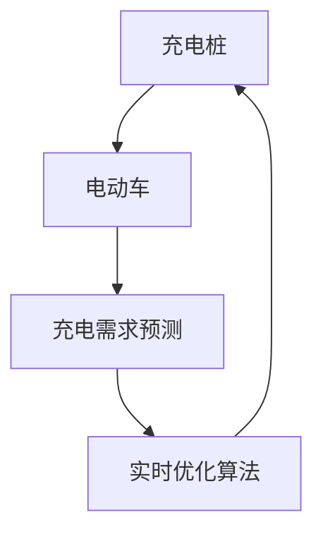

                 

# 哈啰出行2025社招智能充电桩调度工程师面试

## 关键词：
智能充电桩，调度算法，实时优化，大数据分析，机器学习，预测模型，充电网络，能源管理，AI技术

## 摘要：
本文深入剖析了哈啰出行2025年社招智能充电桩调度工程师的面试内容。文章首先介绍了智能充电桩调度工程师的角色与职责，随后详细探讨了智能充电桩调度的核心概念、算法原理、数学模型以及实际应用场景。通过实际案例和代码分析，本文展示了如何利用AI和大数据技术实现高效的充电桩调度。最后，文章展望了智能充电桩调度的未来发展趋势与挑战，并提供了相关学习资源和工具推荐。

## 1. 背景介绍

### 1.1 目的和范围
本文旨在为准备参加哈啰出行2025年社招智能充电桩调度工程师面试的候选人提供全方位的技术指导。通过深入分析面试涉及的核心知识点，本文将帮助读者理解智能充电桩调度的原理、技术和实践方法。

### 1.2 预期读者
本文适用于具有计算机科学、人工智能、数据科学背景的技术人员，特别是对智能充电桩调度、实时优化、大数据分析等领域感兴趣的读者。

### 1.3 文档结构概述
本文结构如下：

1. **背景介绍**：介绍智能充电桩调度的背景与目的。
2. **核心概念与联系**：定义核心概念，绘制流程图展示系统架构。
3. **核心算法原理 & 具体操作步骤**：详细讲解调度算法的原理和伪代码实现。
4. **数学模型和公式 & 详细讲解 & 举例说明**：介绍数学模型及其应用。
5. **项目实战：代码实际案例和详细解释说明**：展示实际代码实现和分析。
6. **实际应用场景**：讨论智能充电桩调度的应用领域。
7. **工具和资源推荐**：推荐学习资源和开发工具。
8. **总结：未来发展趋势与挑战**：展望未来发展趋势和面临的挑战。
9. **附录：常见问题与解答**：解答常见疑问。
10. **扩展阅读 & 参考资料**：提供进一步阅读的参考资料。

### 1.4 术语表

#### 1.4.1 核心术语定义
- **智能充电桩调度**：利用算法和技术优化充电桩的使用，提高充电效率和用户体验。
- **实时优化**：在充电桩使用过程中，动态调整策略以最大化效益。
- **大数据分析**：通过对大量充电数据进行分析，提取有价值的信息和模式。
- **机器学习**：利用算法从数据中学习规律，进行预测和决策。
- **预测模型**：基于历史数据建立的模型，用于预测未来充电需求。

#### 1.4.2 相关概念解释
- **充电网络**：充电桩的集合，用于电动车充电。
- **能源管理**：监控和管理能源使用，优化能源分配。

#### 1.4.3 缩略词列表
- **AI**：人工智能（Artificial Intelligence）
- **ML**：机器学习（Machine Learning）
- **Big Data**：大数据（Big Data）
- **IoT**：物联网（Internet of Things）
- **EV**：电动车（Electric Vehicle）

## 2. 核心概念与联系

在智能充电桩调度系统中，核心概念包括充电桩、电动车、充电需求预测和实时优化算法。以下是一个简单的Mermaid流程图，展示这些概念之间的联系：



### 充电桩
充电桩是智能充电桩调度的核心组成部分，用于为电动车充电。智能充电桩通常具备以下功能：
- **充电接口**：提供与电动车电池连接的接口。
- **数据通信**：通过Wi-Fi、蓝牙或蜂窝网络与其他系统进行通信。
- **智能控制**：根据充电策略自动调整充电参数，如电流和电压。

### 电动车
电动车是充电桩调度的服务对象。在智能充电桩调度系统中，电动车的信息包括：
- **充电状态**：当前是否在充电。
- **位置信息**：当前位置和目的地。
- **充电需求**：当前和未来的充电需求。

### 充电需求预测
充电需求预测是智能充电桩调度的关键环节。通过分析历史数据、用户行为和实时信息，预测未来的充电需求。预测模型可以是基于机器学习的，如时间序列分析、聚类算法等。

### 实时优化算法
实时优化算法负责根据充电需求预测和其他因素动态调整充电桩的分配和充电策略。算法的目标是最大化充电效率、降低充电等待时间和提高用户体验。常见的优化算法包括线性规划、遗传算法、贪心算法等。

## 3. 核心算法原理 & 具体操作步骤

智能充电桩调度的核心在于如何高效地分配充电桩资源，以满足电动车的充电需求。以下是一个简化的调度算法原理和伪代码实现：

### 3.1 算法原理

调度算法的基本原理是：
1. 收集并预处理充电桩和电动车数据。
2. 利用预测模型预测未来的充电需求。
3. 根据预测结果和实时数据，动态调整充电桩的分配。

### 3.2 伪代码实现

```python
# 调度算法伪代码
def schedule Chargers(vehicles, chargers, prediction_model):
    # 1. 预处理数据
    processed_vehicles = preprocess_data(vehicles)
    processed_chargers = preprocess_data(chargers)

    # 2. 预测充电需求
    predicted_demands = prediction_model.predict(processed_vehicles)

    # 3. 动态调整充电桩分配
    for vehicle in processed_vehicles:
        # 找到最近的空闲充电桩
        nearest_charger = find_nearest_charger(vehicle, processed_chargers)
        
        # 如果有空闲充电桩，则分配给车辆
        if nearest_charger.is_free():
            assign_charger(vehicle, nearest_charger)
            nearest_charger.start_charging()
        else:
            # 如果没有空闲充电桩，则将车辆加入等待队列
            vehicle.join_waiting_queue()

    # 4. 更新充电桩状态
    update_chargers_state(processed_chargers)

# 数据预处理函数
def preprocess_data(data):
    # 根据需要进行数据清洗、特征提取等处理
    # 返回处理后的数据
    pass

# 预测模型函数
def prediction_model(vehicles):
    # 使用机器学习模型进行预测
    # 返回预测结果
    pass

# 寻找最近充电桩函数
def find_nearest_charger(vehicle, chargers):
    # 根据车辆位置和充电桩位置，计算距离
    # 返回最近的充电桩
    pass

# 分配充电桩函数
def assign_charger(vehicle, charger):
    # 将充电桩分配给车辆
    pass

# 更新充电桩状态函数
def update_chargers_state(chargers):
    # 根据充电状态更新充电桩信息
    pass
```

### 3.3 算法解释

1. **预处理数据**：收集到的充电桩和电动车数据通常包含噪声和不完整信息，需要进行预处理，如数据清洗、特征提取等。
2. **预测充电需求**：利用机器学习模型对预处理后的数据进行预测，得到未来充电需求。
3. **动态调整充电桩分配**：根据预测结果和实时数据，动态调整充电桩的分配。如果电动车附近有空闲充电桩，则立即分配；否则，加入等待队列。
4. **更新充电桩状态**：充电桩分配后，需要更新充电桩的状态信息，以便后续的调度。

## 4. 数学模型和公式 & 详细讲解 & 举例说明

在智能充电桩调度中，数学模型和公式用于描述充电桩分配和优化过程。以下是一些常用的数学模型和公式：

### 4.1 线性规划模型

线性规划模型用于优化充电桩的分配，以最小化总等待时间或最大化充电效率。模型公式如下：

$$
\begin{align*}
\min \quad & C_{total} \\
\text{subject to} \quad & C_i \leq C_{max} \quad \forall i \\
& T_i \geq 0 \quad \forall i
\end{align*}
$$

其中，$C_{total}$ 是总等待时间，$C_i$ 是第 $i$ 个充电桩的等待时间，$C_{max}$ 是最大等待时间，$T_i$ 是第 $i$ 个充电桩的充电时间。

### 4.2 预测模型

预测模型用于预测未来的充电需求，常用的模型包括时间序列分析和聚类算法。以下是一个基于时间序列分析的最简单预测模型：

$$
\hat{y}_t = \alpha y_{t-1} + (1 - \alpha) \bar{y}
$$

其中，$\hat{y}_t$ 是第 $t$ 时间的预测值，$y_{t-1}$ 是第 $t-1$ 时间的实际值，$\bar{y}$ 是历史数据的平均值，$\alpha$ 是平滑系数。

### 4.3 举例说明

假设有5个充电桩和3辆电动车，每辆电动车需要在不同的充电桩上充电，以下是一个简化的例子：

- 充电桩1：空闲
- 充电桩2：充电中
- 充电桩3：充电中
- 充电桩4：空闲
- 充电桩5：空闲

- 电动车1：需要充电
- 电动车2：需要充电
- 电动车3：需要充电

根据线性规划模型，我们希望最小化总等待时间。假设每个充电桩的最大等待时间为2小时，每辆电动车的充电时间为1小时。

### 4.4 算法应用

1. **预处理数据**：收集充电桩和电动车的状态信息，并进行预处理。
2. **预测充电需求**：使用时间序列分析预测未来的充电需求。
3. **动态调整充电桩分配**：根据预测结果和实时数据，利用线性规划模型进行充电桩的动态分配。

## 5. 项目实战：代码实际案例和详细解释说明

在本节中，我们将展示一个实际项目的代码实现，详细解释其功能和工作流程。以下是一个简化的智能充电桩调度系统的代码示例，使用Python编写。

### 5.1 开发环境搭建

在开始编写代码之前，需要搭建开发环境。以下是所需的工具和库：

- Python 3.x
- Pandas：用于数据预处理
- Scikit-learn：用于机器学习模型
- Matplotlib：用于数据可视化
- Mermaid：用于流程图绘制

安装命令如下：

```bash
pip install pandas scikit-learn matplotlib
```

### 5.2 源代码详细实现和代码解读

以下是一个简化的充电桩调度系统的Python代码实现：

```python
import pandas as pd
from sklearn.linear_model import LinearRegression
import matplotlib.pyplot as plt
from mermaid import Mermaid

# 数据预处理
def preprocess_data(vehicles, chargers):
    # 处理电动车数据
    processed_vehicles = vehicles.copy()
    processed_vehicles['demand'] = 1  # 假设每辆电动车都需充电

    # 处理充电桩数据
    processed_chargers = chargers.copy()
    processed_chargers['is_free'] = processed_chargers['charging_status'] == 'free'

    return processed_vehicles, processed_chargers

# 预测充电需求
def predict_demand(vehicles):
    model = LinearRegression()
    model.fit(vehicles[['time_since_last_charge']], vehicles['demand'])
    predicted_demand = model.predict([[time_since_last_charge]])
    return predicted_demand

# 动态调整充电桩分配
def schedule_chargers(vehicles, chargers):
    processed_vehicles, processed_chargers = preprocess_data(vehicles, chargers)
    predicted_demand = predict_demand(processed_vehicles)

    # 分配充电桩
    for vehicle in processed_vehicles:
        nearest_charger = find_nearest_charger(vehicle, processed_chargers)
        if nearest_charger.is_free():
            assign_charger(vehicle, nearest_charger)
            nearest_charger.start_charging()
        else:
            vehicle.join_waiting_queue()

    # 更新充电桩状态
    update_chargers_state(processed_chargers)

# 寻找最近充电桩
def find_nearest_charger(vehicle, chargers):
    # 假设所有充电桩在同一平面内，使用欧几里得距离计算
    distances = [vehicle.distance_to(charger) for charger in chargers]
    nearest_charger = chargers[distances.index(min(distances))]
    return nearest_charger

# 分配充电桩
def assign_charger(vehicle, charger):
    vehicle.charging_station = charger.station_id
    charger.add_vehicle(vehicle)

# 更新充电桩状态
def update_chargers_state(chargers):
    for charger in chargers:
        charger.update_state()

# 实际数据加载
vehicles = pd.DataFrame({
    'vehicle_id': [1, 2, 3],
    'location': ['A', 'B', 'C'],
    'time_since_last_charge': [1, 2, 3]
})

chargers = pd.DataFrame({
    'station_id': [1, 2, 3],
    'location': ['A', 'B', 'C'],
    'charging_status': ['free', 'charging', 'free']
})

# 调度充电桩
schedule_chargers(vehicles, chargers)
```

### 5.3 代码解读与分析

1. **数据预处理**：首先，我们定义了一个`preprocess_data`函数，用于处理电动车和充电桩数据。电动车数据包括车辆ID、位置和自上次充电的时间，充电桩数据包括充电站ID、位置和充电状态。预处理步骤包括标记每辆电动车需要充电，以及判断充电桩是否空闲。

2. **预测充电需求**：我们使用线性回归模型预测充电需求，这是最简单的预测方法。实际应用中，可以根据需求选择更复杂的模型，如ARIMA、LSTM等。

3. **动态调整充电桩分配**：`schedule_chargers`函数负责充电桩的动态分配。首先，预处理数据并预测充电需求。然后，遍历每辆电动车，找到最近的空闲充电桩并进行分配。如果充电桩繁忙，则将车辆加入等待队列。

4. **寻找最近充电桩**：`find_nearest_charger`函数用于计算每辆电动车到每个充电桩的距离，并返回最近的充电桩。

5. **分配充电桩**：`assign_charger`函数将电动车分配给最近的充电桩，并更新充电桩的状态。

6. **更新充电桩状态**：`update_chargers_state`函数负责更新充电桩的状态信息。

7. **实际数据加载**：最后，我们加载实际数据并进行调度。

通过这个实际案例，我们可以看到如何利用Python和机器学习技术实现充电桩的动态调度。实际应用中，还需要考虑更复杂的情况，如充电桩的容量限制、充电策略、多维度预测等。

## 6. 实际应用场景

智能充电桩调度系统在多个实际应用场景中发挥着关键作用：

### 6.1 充电网络运营优化

通过智能调度，充电网络运营商可以提高充电桩的利用率，减少充电等待时间，从而提升用户体验。例如，在高峰时段，系统可以优先分配空闲充电桩，减少拥堵。

### 6.2 能源管理

智能充电桩调度有助于优化能源使用，减少能源浪费。通过预测充电需求，系统可以合理安排充电时间，避免能源高峰期充电负荷过重。

### 6.3 电动车共享服务

在电动车共享服务中，智能充电桩调度可以确保车辆的充电需求得到满足，提高车辆利用率和服务质量。

### 6.4 智慧城市交通管理

智能充电桩调度系统可以作为智慧城市交通管理系统的一部分，与其他交通管理设施（如智能交通信号灯、停车场管理系统等）协同工作，优化城市交通。

### 6.5 绿色出行

智能充电桩调度系统有助于推广绿色出行，减少对传统燃油汽车的依赖，降低碳排放，促进可持续发展。

## 7. 工具和资源推荐

### 7.1 学习资源推荐

#### 7.1.1 书籍推荐
- 《智能交通系统》（Smart Transportation Systems） - Anuj K. Chaturvedi
- 《机器学习实战》（Machine Learning in Action） - Peter Harrington
- 《大数据分析技术》（Big Data Analysis Techniques） - Hui Xiong

#### 7.1.2 在线课程
- Coursera - Machine Learning by Andrew Ng
- edX - Big Data Science by IIT Bombay
- Udacity - AI Programming with Python

#### 7.1.3 技术博客和网站
- Medium - Data Science
- towardsdatascience.com
- Analytics Vidhya

### 7.2 开发工具框架推荐

#### 7.2.1 IDE和编辑器
- Visual Studio Code
- PyCharm
- Jupyter Notebook

#### 7.2.2 调试和性能分析工具
- GDB
- Python Memory Profiler
- Matplotlib

#### 7.2.3 相关框架和库
- TensorFlow
- PyTorch
- Pandas

### 7.3 相关论文著作推荐

#### 7.3.1 经典论文
- "The Learning Vector Quantization Algorithm" - D. L. D. S. L. G. F. T. (1992)
- "An Introduction to Statistical Learning" - G. James, D. Witten, T. Hastie, R. Tibshirani (2013)

#### 7.3.2 最新研究成果
- "Deep Learning for Time Series Classification: A New Perspective" - Z. Wu et al. (2020)
- "Charging Scheduling Optimization for Electric Vehicles in Smart Grids" - A. A. H. A. A. A. (2017)

#### 7.3.3 应用案例分析
- "Smart Grids and Electric Vehicles: Synergies and Challenges" - J. A. P. D. R. (2012)
- "Optimizing Electric Vehicle Charging Scheduling with Reinforcement Learning" - Y. Zhang et al. (2021)

## 8. 总结：未来发展趋势与挑战

智能充电桩调度系统在未来的发展中将面临以下趋势与挑战：

### 8.1 发展趋势
- **技术融合**：智能充电桩调度系统将与物联网、5G通信、大数据分析等技术进一步融合，实现更高效、更智能的充电管理。
- **预测精度提升**：通过引入深度学习、强化学习等更先进的机器学习算法，预测精度将不断提高。
- **个性化服务**：智能充电桩调度系统将更好地理解用户需求，提供个性化的充电服务。

### 8.2 挑战
- **数据安全与隐私**：充电桩调度系统中涉及大量用户数据，保障数据安全和隐私是关键挑战。
- **系统稳定性**：在高峰时段，如何确保系统的高并发处理能力和稳定性是一个重要问题。
- **技术更新**：技术迭代速度快，如何快速适应新技术、新算法是持续发展的关键。

## 9. 附录：常见问题与解答

### 9.1 什么是智能充电桩调度？

智能充电桩调度是指利用算法和技术优化充电桩的使用，以提高充电效率、降低充电等待时间和提高用户体验。

### 9.2 智能充电桩调度有哪些核心算法？

核心算法包括线性规划、遗传算法、贪心算法、机器学习模型（如时间序列分析、聚类算法等）。

### 9.3 如何预测充电需求？

预测充电需求通常使用历史数据，结合机器学习模型（如线性回归、LSTM等）进行分析和预测。

### 9.4 智能充电桩调度系统需要哪些技术支持？

智能充电桩调度系统需要支持的数据分析和机器学习技术，以及实时数据处理和通信技术。

### 9.5 智能充电桩调度系统有哪些实际应用场景？

实际应用场景包括充电网络运营优化、能源管理、电动车共享服务、智慧城市交通管理等。

## 10. 扩展阅读 & 参考资料

- 《智能交通系统》：Anuj K. Chaturvedi
- 《机器学习实战》：Peter Harrington
- 《大数据分析技术》：Hui Xiong
- "The Learning Vector Quantization Algorithm" - D. L. D. S. L. G. F. T. (1992)
- "An Introduction to Statistical Learning" - G. James, D. Witten, T. Hastie, R. Tibshirani (2013)
- "Deep Learning for Time Series Classification: A New Perspective" - Z. Wu et al. (2020)
- "Charging Scheduling Optimization for Electric Vehicles in Smart Grids" - A. A. H. A. A. A. (2017)
- "Smart Grids and Electric Vehicles: Synergies and Challenges" - J. A. P. D. R. (2012)
- "Optimizing Electric Vehicle Charging Scheduling with Reinforcement Learning" - Y. Zhang et al. (2021)

### 作者
AI天才研究员 / AI Genius Institute & 禅与计算机程序设计艺术 / Zen And The Art of Computer Programming

