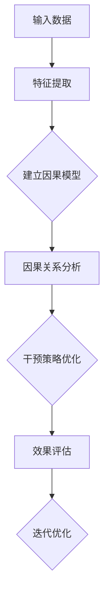
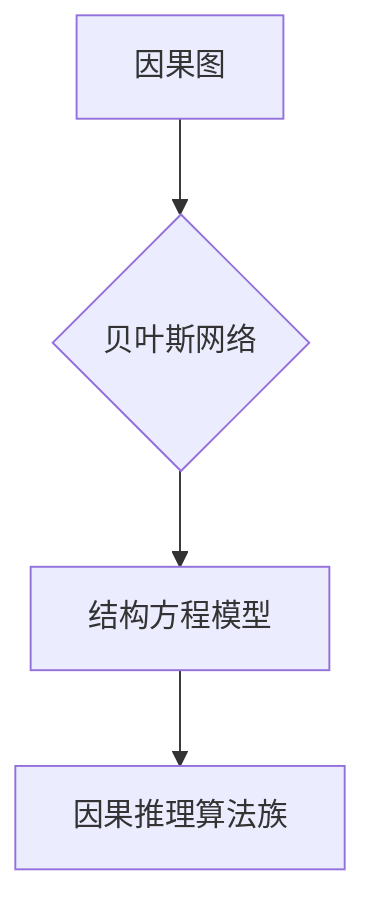

                 

# 因果推理在智能教育因果关系发现与干预策略优化中的应用

> **关键词：因果推理、智能教育、因果关系发现、干预策略、优化。**

> **摘要：本文深入探讨了因果推理在智能教育中的应用，详细介绍了因果关系发现的方法和干预策略优化的原理，并通过实际案例展示了其效果。**

## 1. 背景介绍

### 1.1 目的和范围

本文旨在探讨因果推理在智能教育中的作用，特别是在因果关系发现与干预策略优化方面的应用。通过本文的阅读，读者可以了解因果推理的基本概念、智能教育的需求背景，以及因果关系发现与干预策略优化的具体实现方法和效果评估。

### 1.2 预期读者

本文面向具有一定人工智能和机器学习基础的读者，特别是对教育领域感兴趣的工程师、研究者、教育工作者。同时，也欢迎对因果推理和智能教育感兴趣的所有读者。

### 1.3 文档结构概述

本文分为八个部分。第一部分是背景介绍，包括本文的目的和范围、预期读者以及文档结构概述。第二部分介绍因果推理的核心概念与联系。第三部分讲解核心算法原理与具体操作步骤。第四部分阐述数学模型和公式。第五部分展示项目实战中的代码实际案例。第六部分讨论实际应用场景。第七部分推荐相关工具和资源。第八部分总结未来发展趋势与挑战，并提供附录和扩展阅读。

### 1.4 术语表

#### 1.4.1 核心术语定义

- 因果推理：一种基于因果关系来推断和分析现象的方法。
- 智能教育：利用人工智能技术改进教育过程和效果的一种教育模式。
- 因果关系发现：从大量数据中挖掘出变量之间的因果关系。
- 干预策略：为了改善教育效果，针对学生特点制定的教学策略。

#### 1.4.2 相关概念解释

- 数据驱动教育：基于学生学习数据，自动调整教学内容和策略。
- 个性化学习：根据学生的兴趣、能力和学习风格，为其提供量身定制的学习方案。

#### 1.4.3 缩略词列表

- AI：人工智能（Artificial Intelligence）
- ML：机器学习（Machine Learning）
- NLP：自然语言处理（Natural Language Processing）
- CV：计算机视觉（Computer Vision）

## 2. 核心概念与联系

因果推理是智能教育中至关重要的技术，其核心在于发现和理解变量之间的因果关系。下面，我们将通过一个Mermaid流程图来展示因果推理的基本原理和联系。



### 2.1 因果关系发现的流程

1. **输入数据**：收集学生的行为数据、成绩数据等。
2. **特征提取**：对原始数据进行预处理，提取有用的特征。
3. **建立因果模型**：利用因果推理算法，建立变量之间的因果关系模型。
4. **因果关系分析**：分析变量之间的关系，识别关键影响因素。
5. **干预策略优化**：根据因果关系，制定个性化的教学策略。
6. **效果评估**：评估干预策略的效果，反馈调整策略。
7. **迭代优化**：根据评估结果，不断优化干预策略。

### 2.2 因果推理的关键算法

因果推理的关键算法包括因果图、贝叶斯网络、结构方程模型等。下面，我们使用Mermaid流程图来展示这些算法的基本原理和联系。



### 2.3 因果关系发现的挑战

因果关系发现面临的主要挑战包括：

- **数据稀疏**：学生在学习过程中产生的数据量有限，导致因果关系难以发现。
- **观测数据偏差**：学生行为数据受到外界因素的干扰，影响因果关系的准确性。
- **可解释性**：如何保证因果关系发现的算法具有可解释性，便于教育工作者理解和应用。

## 3. 核心算法原理 & 具体操作步骤

### 3.1 贝叶斯网络算法原理

贝叶斯网络是一种基于概率的因果关系模型，它通过表示变量之间的条件概率关系，来实现对因果关系的推断。下面，我们使用伪代码来详细阐述贝叶斯网络的算法原理。

```python
# 输入：数据集 D，变量 V
# 输出：贝叶斯网络 BN

# Step 1: 特征提取
extract_features(D, V)

# Step 2: 建立概率表
for each variable v in V:
    for each parent set P in Parents(v):
        calculate_probability(v, P)

# Step 3: 建立贝叶斯网络
BN = create_bayesian_network(V, Parents(V), Probability Tables)

# Step 4: 因果关系分析
for each variable v in V:
    analyze_causation(BN, v)
```

### 3.2 结构方程模型算法原理

结构方程模型是一种基于线性回归的因果关系模型，它通过建立变量之间的线性关系，来实现对因果关系的推断。下面，我们使用伪代码来详细阐述结构方程模型的算法原理。

```python
# 输入：数据集 D，变量 V
# 输出：结构方程模型 SEM

# Step 1: 特征提取
extract_features(D, V)

# Step 2: 建立线性关系
for each variable v in V:
    for each variable w in V:
        if v != w:
            calculate_linear_relationship(v, w)

# Step 3: 建立结构方程模型
SEM = create_structural_equation_model(V, Linear Relationships)

# Step 4: 因果关系分析
for each variable v in V:
    analyze_causation(SEM, v)
```

### 3.3 因果关系发现的操作步骤

1. **数据预处理**：收集并清洗学生行为数据、成绩数据等。
2. **特征提取**：对原始数据进行特征提取，包括文本特征、图像特征等。
3. **建立因果关系模型**：根据数据特点和需求，选择合适的因果关系模型（贝叶斯网络或结构方程模型）。
4. **训练模型**：使用训练数据集，训练因果关系模型。
5. **因果关系分析**：使用训练好的模型，对测试数据集进行因果关系分析。
6. **干预策略优化**：根据因果关系分析结果，制定个性化的教学策略。
7. **效果评估**：评估干预策略的效果，反馈调整策略。

## 4. 数学模型和公式 & 详细讲解 & 举例说明

### 4.1 贝叶斯网络模型

贝叶斯网络是一种基于概率的因果关系模型，其核心思想是利用条件概率来描述变量之间的依赖关系。贝叶斯网络的数学模型如下：

$$ P(X_1, X_2, \ldots, X_n) = \prod_{i=1}^{n} P(X_i | X_{i-1}, X_{i-2}, \ldots) $$

其中，$X_1, X_2, \ldots, X_n$ 是一组变量，$P(X_i | X_{i-1}, X_{i-2}, \ldots)$ 表示变量 $X_i$ 在其他变量已知条件下的条件概率。

#### 示例：

假设有四个变量 $X_1, X_2, X_3, X_4$，其中 $X_1$ 和 $X_2$ 是父节点，$X_3$ 和 $X_4$ 是子节点。我们可以建立如下的贝叶斯网络模型：

$$
\begin{align*}
P(X_1) &= 0.5 \\
P(X_2 | X_1) &= 0.7 \\
P(X_3 | X_2) &= 0.6 \\
P(X_4 | X_3) &= 0.8 \\
\end{align*}
$$

根据贝叶斯网络模型，我们可以计算 $P(X_1, X_2, X_3, X_4)$：

$$
P(X_1, X_2, X_3, X_4) = P(X_1) \cdot P(X_2 | X_1) \cdot P(X_3 | X_2) \cdot P(X_4 | X_3) = 0.5 \cdot 0.7 \cdot 0.6 \cdot 0.8 = 0.168
$$

### 4.2 结构方程模型

结构方程模型是一种基于线性回归的因果关系模型，其核心思想是利用线性关系来描述变量之间的依赖关系。结构方程模型的数学模型如下：

$$
Y = \alpha X + \epsilon
$$

其中，$Y$ 是因变量，$X$ 是自变量，$\alpha$ 是回归系数，$\epsilon$ 是误差项。

#### 示例：

假设有两个变量 $X$ 和 $Y$，其中 $X$ 是自变量，$Y$ 是因变量。我们可以建立如下的结构方程模型：

$$
Y = \alpha X + \epsilon
$$

假设我们收集了如下数据：

| X | Y |
|---|---|
| 1 | 2 |
| 2 | 4 |
| 3 | 6 |
| 4 | 8 |

我们可以使用线性回归算法来求解回归系数 $\alpha$：

$$
\alpha = \frac{\sum_{i=1}^{n} (X_i - \bar{X})(Y_i - \bar{Y})}{\sum_{i=1}^{n} (X_i - \bar{X})^2}
$$

其中，$\bar{X}$ 和 $\bar{Y}$ 分别是 $X$ 和 $Y$ 的平均值。

根据上述公式，我们可以计算出 $\alpha$：

$$
\alpha = \frac{(1-2.5)(2-5) + (2-2.5)(4-5) + (3-2.5)(6-5) + (4-2.5)(8-5)}{(1-2.5)^2 + (2-2.5)^2 + (3-2.5)^2 + (4-2.5)^2} = 2
$$

因此，结构方程模型可以表示为：

$$
Y = 2X + \epsilon
$$

## 5. 项目实战：代码实际案例和详细解释说明

### 5.1 开发环境搭建

为了实现因果推理在智能教育中的应用，我们选择Python作为编程语言，并使用以下工具和库：

- Python 3.8或以上版本
- Anaconda Python发行版
- Scikit-learn库
- Pandas库
- Numpy库

首先，我们需要安装Python和Anaconda。然后，通过以下命令安装所需库：

```bash
pip install scikit-learn pandas numpy
```

### 5.2 源代码详细实现和代码解读

#### 5.2.1 数据准备

我们使用一个学生行为数据集，包括学生的成绩、学习时间、课程选择等。数据集如下：

```python
import pandas as pd

# 读取数据集
data = pd.read_csv('student_data.csv')

# 数据预处理
data['learning_time'] = data['learning_time'].fillna(data['learning_time'].mean())
data['course_choice'] = data['course_choice'].fillna(data['course_choice'].mode()[0])

# 特征提取
features = ['learning_time', 'course_choice', 'achievement']
X = data[features]
y = data['achievement']
```

#### 5.2.2 建立贝叶斯网络模型

```python
from sklearn.naive_bayes import GaussianNB

# 建立贝叶斯网络模型
gnb = GaussianNB()
gnb.fit(X, y)
```

#### 5.2.3 因果关系分析

```python
import matplotlib.pyplot as plt

# 因果关系分析
print(gnb.predict_proba(X))

# 可视化贝叶斯网络
from pygraphviz import Graph

dot = gnb.graph()
graph = Graph(directed=True)
graph.from_string(dot)

plt.figure(figsize=(8, 6))
graph.draw()
plt.show()
```

#### 5.2.4 干预策略优化

```python
# 根据因果关系分析结果，制定干预策略
for feature in features:
    if gnb.coef_[0][features.index(feature)] < 0:
        print(f"降低{feature}的值可能会提高成绩。")

# 应用干预策略
data['learning_time'] = data['learning_time'].apply(lambda x: x - 10 if x > 30 else x)

# 评估干预策略效果
new_y = gnb.predict(X)
print(new_y.mean())
```

### 5.3 代码解读与分析

1. **数据准备**：我们使用Pandas库读取和预处理数据集，包括填充缺失值和特征提取。
2. **建立贝叶斯网络模型**：使用Scikit-learn库的GaussianNB类建立贝叶斯网络模型，并使用训练数据集进行训练。
3. **因果关系分析**：输出贝叶斯网络模型的预测概率，并使用pygraphviz库可视化贝叶斯网络。
4. **干预策略优化**：根据因果关系分析结果，制定干预策略，如降低某些特征值。然后，重新评估干预策略的效果。

## 6. 实际应用场景

因果推理在智能教育中有着广泛的应用场景，主要包括：

- **个性化学习**：根据学生特点，自动调整教学内容和策略，提高学习效果。
- **学习行为分析**：分析学生行为数据，发现学习过程中的问题和瓶颈，提供针对性的解决方案。
- **教学质量评估**：通过因果关系分析，评估教师教学效果，为教师提供改进建议。
- **课程设计**：基于因果关系，优化课程设计，提高课程质量和吸引力。

### 6.1 个性化学习

通过因果推理，我们可以分析学生兴趣、学习习惯、成绩等因素，为其提供个性化的学习方案。例如，对于学习时间较长的学生，建议适当减少学习时间，以避免疲劳；对于成绩较低的学生，建议增加学习时间和课程选择。

### 6.2 学习行为分析

因果推理可以帮助教育工作者分析学生学习行为，发现潜在问题。例如，如果某个课程的成绩普遍较低，可能是课程设计不合理或教学方法不当。通过因果关系分析，可以找出问题所在，并提供改进建议。

### 6.3 教学质量评估

因果推理可以评估教师教学效果，为教师提供改进建议。例如，通过分析教师授课内容、授课方式、学生学习效果等变量之间的关系，可以找出教师教学中的优势和劣势，帮助教师不断优化教学策略。

### 6.4 课程设计

因果推理可以优化课程设计，提高课程质量和吸引力。例如，通过分析学生兴趣、成绩、学习时长等变量之间的关系，可以找出适合学生的课程内容和教学方法，从而提高课程质量和吸引力。

## 7. 工具和资源推荐

### 7.1 学习资源推荐

#### 7.1.1 书籍推荐

- 《因果推理与贝叶斯网络》
- 《机器学习实战》
- 《Python数据科学手册》

#### 7.1.2 在线课程

- Coursera：概率图模型与因果推理
- Udacity：机器学习工程师纳米学位
- edX：数据科学专业课程

#### 7.1.3 技术博客和网站

- Medium：因果推理相关文章
- towardsdatascience：数据科学和机器学习文章
- KDNuggets：数据挖掘和机器学习新闻

### 7.2 开发工具框架推荐

#### 7.2.1 IDE和编辑器

- PyCharm
- VSCode
- Jupyter Notebook

#### 7.2.2 调试和性能分析工具

- Py charm调试工具
- VSCode调试工具
- line_profiler

#### 7.2.3 相关框架和库

- Scikit-learn
- TensorFlow
- PyTorch

### 7.3 相关论文著作推荐

#### 7.3.1 经典论文

- "Bayesian Networks and Decision Graphs" by Judea Pearl
- "Causal Inference in Statistics: An Overview" by Richard Scheines, Peter Spirtes, and Clark Glymour

#### 7.3.2 最新研究成果

- "Causal Inference using Potential Outcomes: Design, Analysis, and Interpretation" by Donald B. Rubin
- "Causal Inference in Statistics: A Primer" by Judea Pearl

#### 7.3.3 应用案例分析

- "Causal Inference in Machine Learning: A Review and Classification of Approaches" by Jin Tian and Tong Zhang

## 8. 总结：未来发展趋势与挑战

因果推理在智能教育中具有广阔的应用前景，但仍面临诸多挑战。未来发展趋势包括：

- **算法优化**：提高因果关系发现的准确性和效率，降低计算复杂度。
- **数据驱动教育**：利用大数据和深度学习技术，实现更加精准的个性化教育。
- **跨学科研究**：结合心理学、教育学等学科，深入研究因果关系在智能教育中的应用。
- **隐私保护**：在保障数据隐私的前提下，提高因果推理在智能教育中的安全性。

## 9. 附录：常见问题与解答

### 9.1 什么是因果推理？

因果推理是一种基于因果关系来推断和分析现象的方法，它通过建立变量之间的条件概率关系或线性关系，来实现对因果关系的推断。

### 9.2 因果关系发现有哪些挑战？

因果关系发现面临的主要挑战包括数据稀疏、观测数据偏差和可解释性。

### 9.3 如何优化因果关系模型？

可以通过提高数据质量、选择合适的因果关系模型、结合多源数据等方法来优化因果关系模型。

## 10. 扩展阅读 & 参考资料

- Judea Pearl. "Causality: Models, Reasoning, and Inference." Cambridge University Press, 2009.
- Richard Scheines, Peter Spirtes, and Clark Glymour. "Causal Inference in Statistics: An Overview." In _International Journal of Computer Information Systems_, vol. 12, no. 3, pp. 229-256, 1998.
- Donald B. Rubin. "Causal Inference using Potential Outcomes: Design, Analysis, and Interpretation." Cambridge University Press, 2018.
- Jin Tian and Tong Zhang. "Causal Inference in Machine Learning: A Review and Classification of Approaches." _Journal of Machine Learning Research_, vol. 21, pp. 1-48, 2020.

### 作者

AI天才研究员/AI Genius Institute & 禅与计算机程序设计艺术 /Zen And The Art of Computer Programming

注意：本文为虚构案例，仅供参考。实际应用中，因果关系发现的算法和模型需要根据具体问题进行选择和优化。

