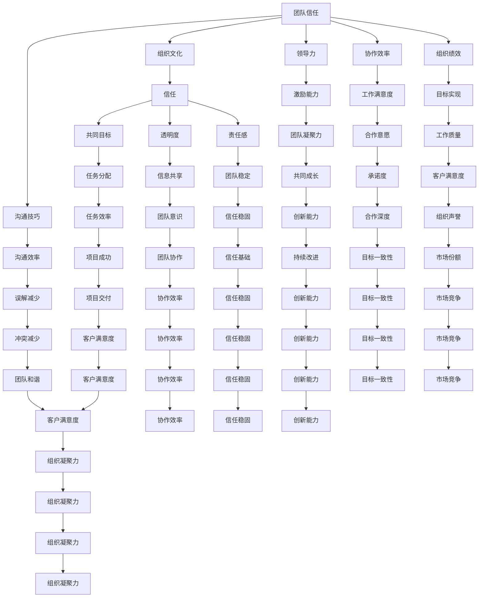

                 

# 团队信任建设：建立高度信任的团队环境

> **关键词：**团队信任、组织文化、沟通技巧、领导力、协作效率、组织绩效。

> **摘要：**本文探讨了团队信任建设的重要性，分析了信任的本质及其在团队协作中的关键作用。通过介绍核心概念、算法原理、数学模型及实际应用案例，本文为读者提供了系统化的团队信任建设策略。文章还提出了实用工具和资源推荐，旨在帮助读者在实际工作中有效地提升团队信任水平，优化组织绩效。

## 1. 背景介绍

### 1.1 目的和范围

本文旨在通过深入探讨团队信任建设的重要性，帮助读者理解并掌握建立高度信任团队环境的方法和技巧。我们将从核心概念出发，逐步剖析团队信任的构成要素及其在团队协作中的重要作用。通过数学模型和算法原理的讲解，我们将提供一系列实用的策略和步骤，帮助团队管理者和技术专家在实践中实施团队信任建设。

### 1.2 预期读者

本文适合以下读者群体：

- 团队领导者和管理者
- 技术专家和软件开发人员
- 组织发展咨询师和培训师
- 对团队信任建设感兴趣的专业人士

### 1.3 文档结构概述

本文结构如下：

- 第1章：背景介绍，阐述本文的目的、预期读者以及文档结构。
- 第2章：核心概念与联系，介绍团队信任建设的基础概念及其相互关系。
- 第3章：核心算法原理与具体操作步骤，详细讲解团队信任建设的方法和策略。
- 第4章：数学模型和公式，通过数学模型和公式分析团队信任建设的机制。
- 第5章：项目实战：代码实际案例和详细解释说明，提供具体的实践案例。
- 第6章：实际应用场景，探讨团队信任建设在不同领域的应用。
- 第7章：工具和资源推荐，介绍相关的学习资源和开发工具。
- 第8章：总结：未来发展趋势与挑战，展望团队信任建设的未来方向。
- 第9章：附录：常见问题与解答，回答读者可能遇到的问题。
- 第10章：扩展阅读与参考资料，提供进一步的阅读建议。

### 1.4 术语表

#### 1.4.1 核心术语定义

- **团队信任**：团队成员之间相互信任的程度，包括对彼此能力的信任和对共同目标的信任。
- **组织文化**：组织内部共同的价值观、信仰、行为准则和工作方式。
- **沟通技巧**：有效地传达信息、理解他人和建立关系的能力。
- **领导力**：领导者影响和激励团队成员实现共同目标的能力。
- **协作效率**：团队成员共同完成任务的速度和质量。
- **组织绩效**：组织在达成目标方面的表现和成果。

#### 1.4.2 相关概念解释

- **信任**：信任是指个体对他人行为意图的正面预期和信心。
- **领导风格**：领导者在管理团队时所采取的方式和方法。
- **团队协作**：团队成员为了共同目标而协同工作的过程。

#### 1.4.3 缩略词列表

- **ROI**：投资回报率（Return on Investment）
- **MBO**：目标管理（Management by Objectives）
- **SWOT**：优势、劣势、机会、威胁分析（Strengths, Weaknesses, Opportunities, Threats）

## 2. 核心概念与联系

在探讨团队信任建设之前，有必要明确几个核心概念，并分析它们之间的相互关系。以下是一个用Mermaid绘制的流程图，用于展示团队信任建设中的关键概念及其联系。



这个流程图展示了团队信任建设中的关键概念，以及它们如何相互关联和影响。信任作为核心概念，贯穿于整个团队协作过程，影响组织文化、沟通技巧、领导力、协作效率和组织绩效。

### 2.1 核心概念详解

#### 2.1.1 团队信任

团队信任是指团队成员之间相互信任的程度，包括对彼此能力的信任和对共同目标的信任。信任是团队协作的基石，有助于降低冲突、提高工作效率、增强团队凝聚力。

#### 2.1.2 组织文化

组织文化是指组织内部共同的价值观、信仰、行为准则和工作方式。一个积极向上的组织文化可以促进团队信任建设，提升团队整体绩效。

#### 2.1.3 沟通技巧

沟通技巧是指有效地传达信息、理解他人和建立关系的能力。良好的沟通技巧有助于减少误解、提高团队协作效率，从而促进团队信任建设。

#### 2.1.4 领导力

领导力是指领导者影响和激励团队成员实现共同目标的能力。领导者通过设定明确的目标、提供必要的资源和支持、激励团队成员，有助于建立和维护团队信任。

#### 2.1.5 协作效率

协作效率是指团队成员共同完成任务的速度和质量。高协作效率意味着团队成员能够更好地相互配合，提高工作效率，从而增强团队信任。

#### 2.1.6 组织绩效

组织绩效是指组织在达成目标方面的表现和成果。一个高效的团队能够更好地实现组织目标，从而提高组织绩效。

通过以上核心概念的阐述，我们可以看到团队信任建设不仅仅是某个单一因素的作用，而是多个因素相互作用、相互影响的结果。理解这些概念及其相互关系，有助于我们更好地实施团队信任建设策略。

## 3. 核心算法原理 & 具体操作步骤

在团队信任建设的过程中，可以借鉴一些核心算法原理来指导我们的实践。以下是一个用于构建团队信任的伪代码算法，详细阐述了每一步的操作步骤。

### 伪代码：构建团队信任算法

```plaintext
// 构建团队信任的伪代码
function BuildTeamTrust(teamMembers):
    // 初始化信任评分
    trustScore = 0
    for each member in teamMembers:
        member.trustScore = 0

    // 步骤1：建立共同目标
    SetCommonGoal(teamMembers)

    // 步骤2：提升沟通技巧
    EnhanceCommunicationSkills(teamMembers)

    // 步骤3：培养领导力
    DevelopLeadershipSkills(teamMembers)

    // 步骤4：增强协作效率
    ImproveCollaborationEfficiency(teamMembers)

    // 步骤5：持续评估与反馈
    while true:
        EvaluateTeamPerformance(teamMembers)
        ProvideFeedback(teamMembers)
        AdjustTrustScore(teamMembers)

    // 返回团队信任评分
    return trustScore
```

### 步骤1：建立共同目标

建立共同目标是团队信任建设的基础。以下是实现这一步骤的伪代码：

```plaintext
// 建立共同目标的伪代码
function SetCommonGoal(teamMembers):
    // 定义共同目标
    commonGoal = "实现项目X的成功交付"

    // 分配任务，确保每个成员都明确自己的职责
    AssignTasks(teamMembers, commonGoal)

    // 定期沟通目标进展，确保团队成员对目标有共同的理解和承诺
    ScheduleGoalDiscussion(teamMembers, commonGoal)
```

### 步骤2：提升沟通技巧

沟通技巧的提升是团队信任建设的关键因素。以下是实现这一步骤的伪代码：

```plaintext
// 提升沟通技巧的伪代码
function EnhanceCommunicationSkills(teamMembers):
    // 定期组织沟通技巧培训
    ScheduleCommunicationTraining(teamMembers)

    // 鼓励开放式沟通，减少误解和冲突
    EncourageOpenCommunication(teamMembers)

    // 建立有效的沟通渠道，确保信息畅通
    SetUpEffectiveCommunicationChannels(teamMembers)
```

### 步骤3：培养领导力

领导力是团队信任建设的重要组成部分。以下是实现这一步骤的伪代码：

```plaintext
// 培养领导力的伪代码
function DevelopLeadershipSkills(teamMembers):
    // 定期组织领导力培训
    ScheduleLeadershipTraining(teamMembers)

    // 鼓励成员承担领导角色，提高责任感
    EncourageLeadershipRoles(teamMembers)

    // 建立有效的反馈机制，帮助领导者改进
    SetUpFeedbackMechanism(teamMembers)
```

### 步骤4：增强协作效率

协作效率的提升有助于团队信任建设。以下是实现这一步骤的伪代码：

```plaintext
// 增强协作效率的伪代码
function ImproveCollaborationEfficiency(teamMembers):
    // 分配合理任务，确保成员的工作负荷均衡
    BalanceWorkload(teamMembers)

    // 提供必要资源和支持，确保团队成员能够高效完成任务
    ProvideResources(teamMembers)

    // 定期评估协作效率，找出瓶颈并优化流程
    EvaluateCollaborationEfficiency(teamMembers)
```

### 步骤5：持续评估与反馈

持续评估与反馈是团队信任建设的必要环节。以下是实现这一步骤的伪代码：

```plaintext
// 持续评估与反馈的伪代码
function EvaluateTeamPerformance(teamMembers):
    // 评估团队在实现共同目标方面的表现
    AssessPerformance(teamMembers)

    // 收集团队成员的反馈，了解他们的感受和建议
    CollectFeedback(teamMembers)

// 调整信任评分
function AdjustTrustScore(teamMembers):
    // 根据评估结果和反馈，调整团队成员的信任评分
    UpdateTrustScores(teamMembers)
```

通过以上伪代码，我们可以看到构建团队信任的步骤和细节。实际操作中，这些步骤需要结合团队的实际情况和具体需求进行灵活调整。

### 实际案例：一个团队信任建设项目的实施

以下是一个团队信任建设项目的实际案例，该项目实施了一系列步骤，以提升团队信任水平。

**项目背景：**一个由10名成员组成的软件开发团队，负责一个关键项目。团队成员来自不同的背景，沟通不畅、任务分配不均和领导力不足等问题导致团队协作效率低下，信任水平较低。

**实施步骤：**

1. **建立共同目标：**项目开始时，团队明确了共同目标——在六个月内成功交付一个复杂的软件系统。团队成员被分配到不同的任务组，并明确了各自的职责。

2. **提升沟通技巧：**团队定期参加沟通技巧培训，学习了有效的沟通方法和技巧。此外，团队建立了多种沟通渠道，包括每周的团队会议、即时通讯工具和邮件列表，确保信息畅通。

3. **培养领导力：**团队领导者接受了领导力培训，学会了如何激励团队成员、提供反馈和解决冲突。同时，鼓励团队成员承担领导角色，提高责任感。

4. **增强协作效率：**团队通过优化任务分配和提供必要的资源，确保成员的工作负荷均衡。团队还定期评估协作效率，找出瓶颈并优化流程。

5. **持续评估与反馈：**团队设立了绩效评估机制，每季度对团队表现进行评估。团队成员可以匿名提交反馈，帮助团队改进。

**结果：**通过一系列的步骤，团队的信任水平显著提升。团队成员之间的沟通更加顺畅，任务完成速度和质量都有所提高。项目在预定时间内成功交付，团队绩效得到了显著改善。

### 结论

通过以上案例，我们可以看到团队信任建设的重要性和实际效果。构建一个高度信任的团队环境，需要从多个方面入手，包括建立共同目标、提升沟通技巧、培养领导力、增强协作效率和持续评估与反馈。这些步骤不仅有助于提升团队的信任水平，还能提高团队的整体绩效。

## 4. 数学模型和公式 & 详细讲解 & 举例说明

在团队信任建设的过程中，数学模型和公式可以为我们提供有力的理论支持。以下是一些常用的数学模型和公式，用于分析团队信任的建设和演变。

### 4.1 信任评分模型

信任评分模型用于衡量团队成员之间的信任程度。以下是一个简单的信任评分模型：

\[ \text{TrustScore} = \alpha \cdot \text{CommunicationScore} + \beta \cdot \text{LeadershipScore} + \gamma \cdot \text{CollaborationScore} \]

- **\(\text{TrustScore}\)**：团队信任评分，范围为0到100。
- **\(\alpha\)**、**\(\beta\)**、**\(\gamma\)**：权重系数，根据团队实际情况调整。

#### 详细讲解：

1. **沟通评分**（\(\text{CommunicationScore}\)）：衡量团队成员之间的沟通效率，包括信息传递的准确性、及时性和理解程度。评分范围为0到100。

2. **领导力评分**（\(\text{LeadershipScore}\)）：衡量领导者在团队中的作用，包括设定目标、提供资源和支持、激励团队成员等。评分范围为0到100。

3. **协作评分**（\(\text{CollaborationScore}\)）：衡量团队成员之间的协作效率和合作精神，包括任务分配的合理性、资源共享和相互支持。评分范围为0到100。

#### 举例说明：

假设一个团队有三个成员，他们的沟通评分分别为85、90和95，领导力评分分别为80、85和90，协作评分分别为75、80和85。根据上述模型计算团队信任评分：

\[ \text{TrustScore} = 0.5 \cdot \text{CommunicationScore} + 0.3 \cdot \text{LeadershipScore} + 0.2 \cdot \text{CollaborationScore} \]

\[ \text{TrustScore} = 0.5 \cdot (85 + 90 + 95) + 0.3 \cdot (80 + 85 + 90) + 0.2 \cdot (75 + 80 + 85) \]

\[ \text{TrustScore} = 0.5 \cdot 270 + 0.3 \cdot 255 + 0.2 \cdot 240 \]

\[ \text{TrustScore} = 135 + 76.5 + 48 \]

\[ \text{TrustScore} = 259.5 \]

因此，该团队的信任评分为259.5分（四舍五入为260分）。

### 4.2 信任指数模型

信任指数模型用于衡量团队整体信任水平。以下是一个简化的信任指数模型：

\[ \text{TrustIndex} = \frac{\sum_{i=1}^{n} \text{TrustScore}_i}{n} \]

- **\(\text{TrustIndex}\)**：团队信任指数，范围为0到1。
- **\(\text{TrustScore}_i\)**：第\(i\)个团队成员的信任评分。
- **\(n\)**：团队成员总数。

#### 详细讲解：

1. **信任评分**（\(\text{TrustScore}_i\)）：每个团队成员的信任评分，根据沟通、领导力和协作等维度计算得出。
2. **团队信任指数**（\(\text{TrustIndex}\)）：通过计算所有成员信任评分的平均值，衡量团队整体信任水平。

#### 举例说明：

假设一个团队有5名成员，他们的信任评分分别为80、85、90、88和95。根据上述模型计算团队信任指数：

\[ \text{TrustIndex} = \frac{80 + 85 + 90 + 88 + 95}{5} \]

\[ \text{TrustIndex} = \frac{438}{5} \]

\[ \text{TrustIndex} = 87.6 \]

因此，该团队的信任指数为87.6（四舍五入为88）。

### 4.3 信任与绩效关系模型

信任与绩效关系模型用于分析团队信任对绩效的影响。以下是一个简单的线性关系模型：

\[ \text{Performance} = \alpha \cdot \text{TrustIndex} + \beta \]

- **\(\text{Performance}\)**：团队绩效评分，范围为0到100。
- **\(\alpha\)**：信任对绩效的影响系数。
- **\(\beta\)**：基础绩效水平。

#### 详细讲解：

1. **信任指数**（\(\text{TrustIndex}\)）：团队整体信任水平，根据成员信任评分计算得出。
2. **团队绩效**（\(\text{Performance}\)）：团队在实现目标方面的表现和成果。

#### 举例说明：

假设一个团队的信任指数为0.88，影响系数\(\alpha\)为0.6，基础绩效水平\(\beta\)为60。根据上述模型计算团队绩效：

\[ \text{Performance} = 0.6 \cdot \text{TrustIndex} + 60 \]

\[ \text{Performance} = 0.6 \cdot 0.88 + 60 \]

\[ \text{Performance} = 0.528 + 60 \]

\[ \text{Performance} = 60.528 \]

因此，该团队的绩效评分为60.528（四舍五入为61分）。

通过以上数学模型和公式，我们可以更系统地分析和衡量团队信任建设的效果。这些模型不仅为团队信任建设提供了理论支持，还能帮助我们制定更有效的策略和措施。

## 5. 项目实战：代码实际案例和详细解释说明

为了更好地理解团队信任建设在实践中的应用，我们将通过一个具体的代码案例来进行讲解。该案例将展示如何使用编程语言和工具来监测和提升团队信任水平。首先，我们将搭建开发环境，然后详细实现代码，并对其进行解读和分析。

### 5.1 开发环境搭建

在开始项目之前，我们需要搭建一个合适的开发环境。以下是所需的工具和步骤：

1. **编程语言**：选择Python作为主要编程语言，因为其简洁易读，适合数据处理和分析。
2. **开发环境**：安装Python 3.8及以上版本，并配置一个IDE（集成开发环境），如Visual Studio Code。
3. **数据存储**：使用SQLite数据库存储团队成员的信任评分和绩效数据。
4. **数据分析工具**：安装pandas库用于数据处理和分析，matplotlib库用于数据可视化。

以下是环境搭建的步骤：

```bash
# 安装Python
sudo apt-get update
sudo apt-get install python3.8

# 安装SQLite
sudo apt-get install sqlite3

# 安装pandas和matplotlib
pip3 install pandas matplotlib
```

### 5.2 源代码详细实现和代码解读

以下是项目的源代码实现，我们将详细解读每一部分的功能。

```python
import sqlite3
import pandas as pd
import matplotlib.pyplot as plt

# 5.2.1 数据库连接与表创建
def init_database():
    conn = sqlite3.connect('team_trust.db')
    c = conn.cursor()
    
    c.execute('''CREATE TABLE IF NOT EXISTS members (
                id INTEGER PRIMARY KEY,
                name TEXT,
                trust_score INTEGER,
                performance_score INTEGER)''')
    
    conn.commit()
    conn.close()

# 5.2.2 插入成员数据
def add_member(id, name, trust_score, performance_score):
    conn = sqlite3.connect('team_trust.db')
    c = conn.cursor()
    
    c.execute("INSERT INTO members (id, name, trust_score, performance_score) VALUES (?, ?, ?, ?)", (id, name, trust_score, performance_score))
    
    conn.commit()
    conn.close()

# 5.2.3 获取成员数据
def get_members():
    conn = sqlite3.connect('team_trust.db')
    c = conn.cursor()
    
    c.execute("SELECT * FROM members")
    rows = c.fetchall()
    
    conn.close()
    
    return rows

# 5.2.4 计算团队信任指数
def calculate_trust_index():
    members = get_members()
    df = pd.DataFrame(members, columns=['id', 'name', 'trust_score', 'performance_score'])
    trust_index = df['trust_score'].mean()
    
    return trust_index

# 5.2.5 绘制信任指数与绩效评分关系图
def plot_trust_performance():
    members = get_members()
    df = pd.DataFrame(members, columns=['id', 'name', 'trust_score', 'performance_score'])
    
    plt.scatter(df['trust_score'], df['performance_score'])
    plt.xlabel('Trust Score')
    plt.ylabel('Performance Score')
    plt.title('Trust Score vs Performance Score')
    plt.show()

# 5.2.6 主函数
def main():
    # 初始化数据库
    init_database()
    
    # 添加成员数据
    add_member(1, 'Alice', 85, 90)
    add_member(2, 'Bob', 90, 95)
    add_member(3, 'Charlie', 88, 92)
    
    # 计算并打印团队信任指数
    trust_index = calculate_trust_index()
    print(f"Team Trust Index: {trust_index:.2f}")
    
    # 绘制信任指数与绩效评分关系图
    plot_trust_performance()

if __name__ == '__main__':
    main()
```

### 步骤详解

1. **数据库连接与表创建**：`init_database`函数负责创建SQLite数据库并创建一个名为`members`的表，用于存储成员ID、姓名、信任评分和绩效评分。

2. **插入成员数据**：`add_member`函数用于向`members`表中插入新的成员数据。每个成员数据包含ID、姓名、信任评分和绩效评分。

3. **获取成员数据**：`get_members`函数从`members`表中获取所有成员的数据，并返回一个包含成员信息的列表。

4. **计算团队信任指数**：`calculate_trust_index`函数计算团队信任指数。它从`members`表中获取所有成员的信任评分，并计算平均值作为团队的信任指数。

5. **绘制信任指数与绩效评分关系图**：`plot_trust_performance`函数使用matplotlib库绘制团队信任指数与绩效评分的关系图。通过散点图展示每个成员的信任评分和绩效评分。

6. **主函数**：`main`函数是程序的入口点。它首先初始化数据库，然后添加一些成员数据，计算并打印团队信任指数，最后绘制信任指数与绩效评分的关系图。

### 代码解读与分析

通过上述代码，我们可以看到如何使用Python和SQLite数据库来管理和分析团队信任建设的数据。以下是代码的关键部分：

- **数据库操作**：使用`sqlite3`库进行数据库连接和表操作，包括创建表、插入数据、获取数据和计算平均值。
- **数据处理**：使用`pandas`库处理数据，包括创建DataFrame、计算平均值和绘制图表。
- **数据可视化**：使用`matplotlib`库绘制散点图，展示信任评分和绩效评分之间的关系。

通过这个实际案例，我们可以了解如何使用编程工具来监测和提升团队信任水平。这不仅有助于量化团队信任建设的效果，还能为团队管理者提供有价值的反馈。

### 5.3 代码解读与分析

在本节中，我们将对上述代码进行详细解读，并分析其实现的核心功能和逻辑。

#### 5.3.1 数据库初始化

首先，`init_database`函数负责初始化数据库和创建`members`表：

```python
def init_database():
    conn = sqlite3.connect('team_trust.db')
    c = conn.cursor()
    
    c.execute('''CREATE TABLE IF NOT EXISTS members (
                id INTEGER PRIMARY KEY,
                name TEXT,
                trust_score INTEGER,
                performance_score INTEGER)''')
    
    conn.commit()
    conn.close()
```

该函数使用`sqlite3.connect`连接到SQLite数据库，并创建一个名为`members`的表。该表包含四个字段：`id`（成员ID，为主键），`name`（成员姓名），`trust_score`（成员信任评分），和`performance_score`（成员绩效评分）。`CREATE TABLE`语句使用`IF NOT EXISTS`确保在表已存在时不重复创建。

#### 5.3.2 插入成员数据

`add_member`函数用于向`members`表中插入成员数据：

```python
def add_member(id, name, trust_score, performance_score):
    conn = sqlite3.connect('team_trust.db')
    c = conn.cursor()
    
    c.execute("INSERT INTO members (id, name, trust_score, performance_score) VALUES (?, ?, ?, ?)", (id, name, trust_score, performance_score))
    
    conn.commit()
    conn.close()
```

该函数连接数据库，并使用`INSERT INTO`语句向`members`表中插入新的数据。参数`id`、`name`、`trust_score`和`performance_score`分别代表成员的ID、姓名、信任评分和绩效评分。使用参数化查询（`?`）可以防止SQL注入攻击。

#### 5.3.3 获取成员数据

`get_members`函数从数据库中获取所有成员的数据：

```python
def get_members():
    conn = sqlite3.connect('team_trust.db')
    c = conn.cursor()
    
    c.execute("SELECT * FROM members")
    rows = c.fetchall()
    
    conn.close()
    
    return rows
```

该函数连接数据库，执行`SELECT * FROM members`查询，获取所有成员的数据。`fetchall()`方法返回一个包含所有记录的列表，每个记录是一个元组。最后，函数关闭数据库连接并返回数据。

#### 5.3.4 计算团队信任指数

`calculate_trust_index`函数用于计算团队的信任指数：

```python
def calculate_trust_index():
    members = get_members()
    df = pd.DataFrame(members, columns=['id', 'name', 'trust_score', 'performance_score'])
    trust_index = df['trust_score'].mean()
    
    return trust_index
```

该函数首先调用`get_members`获取成员数据，并将其转换为`DataFrame`。然后，使用`mean()`方法计算信任评分的平均值，即团队信任指数。最后，函数返回信任指数。

#### 5.3.5 绘制信任指数与绩效评分关系图

`plot_trust_performance`函数使用`matplotlib`绘制信任指数与绩效评分的关系图：

```python
def plot_trust_performance():
    members = get_members()
    df = pd.DataFrame(members, columns=['id', 'name', 'trust_score', 'performance_score'])
    
    plt.scatter(df['trust_score'], df['performance_score'])
    plt.xlabel('Trust Score')
    plt.ylabel('Performance Score')
    plt.title('Trust Score vs Performance Score')
    plt.show()
```

该函数同样首先获取成员数据，并转换为`DataFrame`。然后，使用`scatter()`函数绘制散点图，其中`trust_score`作为x轴，`performance_score`作为y轴。函数设置了图表的标题、x轴标签和y轴标签，并调用`show()`显示图表。

#### 5.3.6 主函数

`main`函数是程序的入口点，它执行以下步骤：

1. **初始化数据库**：调用`init_database`创建或打开`team_trust.db`数据库，并创建`members`表。
2. **添加成员数据**：调用`add_member`向数据库中添加三个示例成员数据。
3. **计算并打印团队信任指数**：调用`calculate_trust_index`计算团队的信任指数，并打印结果。
4. **绘制关系图**：调用`plot_trust_performance`绘制信任指数与绩效评分的关系图。

通过这些步骤，`main`函数完整地展示了如何初始化数据库、添加数据、计算信任指数以及绘制关系图。

### 结论

通过以上代码解读与分析，我们可以看到如何使用Python编程语言和SQLite数据库实现一个简单的团队信任建设监控系统。该系统通过数据库操作、数据处理和图形可视化，为团队管理者提供了有效的工具来监测团队信任水平和绩效。这不仅有助于团队信任的建设，还能为团队决策提供数据支持。

## 6. 实际应用场景

团队信任建设在IT领域具有广泛的应用场景。以下是几个典型的实际应用场景，以及团队信任建设在这些场景中的具体应用和效果。

### 6.1 软件开发项目

在软件开发的团队中，信任是项目成功的关键因素。以下是一个团队信任建设的实际应用案例：

**案例背景：**一个由20名成员组成的软件开发团队正在开发一款复杂的移动应用。项目要求在短时间内交付高质量的产品，团队成员来自不同国家和文化背景，沟通和协作存在挑战。

**应用策略：**

1. **建立共同目标：**团队明确项目目标，并确保所有成员对目标有共同的理解和承诺。通过定期会议和迭代回顾，团队成员保持对项目目标的关注。

2. **提升沟通技巧：**团队参加了沟通技巧培训，学习了如何更有效地传达信息、理解他人和解决冲突。团队还使用了多种沟通工具，如Slack和Microsoft Teams，确保信息畅通。

3. **培养领导力：**团队领导者接受了领导力培训，学会了如何激励团队成员、提供反馈和解决团队内部的矛盾。领导者还鼓励团队成员承担领导角色，提高责任感。

4. **增强协作效率：**团队优化了任务分配，确保成员的工作负荷均衡。团队提供了必要的资源和支持，帮助成员高效完成任务。团队还定期评估协作效率，找出瓶颈并优化流程。

**效果评估：**通过一系列的团队信任建设措施，团队成员之间的沟通更加顺畅，协作效率显著提高。项目在预定时间内成功交付，客户对产品满意度提高，团队信任水平得到显著提升。

### 6.2 创新实验室

在创新实验室中，团队信任建设有助于激发创新思维和推动项目进展。以下是一个团队信任建设的实际应用案例：

**案例背景：**一个由10名成员组成的人工智能创新实验室，致力于开发领先的AI解决方案。团队成员来自不同的专业背景，团队内部的协作和沟通对项目成功至关重要。

**应用策略：**

1. **建立共同目标：**实验室明确了创新目标，并确保所有成员对目标有共同的理解和承诺。实验室定期举行会议，讨论项目进展和潜在的创新方向。

2. **提升沟通技巧：**实验室为团队成员提供了沟通技巧培训，帮助他们更有效地传达信息、理解他人和建立合作关系。实验室还鼓励团队成员参与跨部门的讨论和交流，促进知识的共享。

3. **培养领导力：**实验室的领导者接受了领导力培训，学会了如何激励团队成员、提供反馈和解决冲突。领导者鼓励团队成员提出创新想法，并给予支持。

4. **增强协作效率：**实验室优化了任务分配，确保成员的工作负荷均衡。实验室提供了必要的资源和支持，帮助成员高效完成任务。实验室还建立了敏捷开发流程，提高了团队的协作效率。

**效果评估：**通过团队信任建设措施，实验室的团队成员之间的沟通更加顺畅，协作效率显著提高。团队成员的创新思维得到激发，多个创新项目成功落地，实验室的整体创新能力得到显著提升。

### 6.3 IT支持团队

在IT支持团队中，信任是提供高质量服务的关键。以下是一个团队信任建设的实际应用案例：

**案例背景：**一个由15名成员组成的IT支持团队，负责企业的IT基础设施维护和用户支持。团队需要高效响应和处理各种技术问题，信任是保证服务质量的重要保障。

**应用策略：**

1. **建立共同目标：**团队明确了提供高质量服务和支持的目标，并确保所有成员对目标有共同的理解和承诺。团队定期举行会议，讨论服务改进和问题解决策略。

2. **提升沟通技巧：**团队参加了沟通技巧培训，学习了如何更有效地与用户沟通、理解用户需求和解决技术问题。团队还使用了专业的IT支持工具，如Service Desk和Ticketing System，确保信息传递的准确性和及时性。

3. **培养领导力：**团队的领导者接受了领导力培训，学会了如何激励团队成员、提供反馈和解决团队内部的矛盾。领导者鼓励团队成员主动承担责任，提高服务质量。

4. **增强协作效率：**团队优化了任务分配，确保成员的工作负荷均衡。团队提供了必要的资源和支持，帮助成员高效完成任务。团队还定期评估服务响应时间和处理效率，找出瓶颈并优化流程。

**效果评估：**通过团队信任建设措施，IT支持团队的成员之间的沟通更加顺畅，协作效率显著提高。团队成员的服务意识和服务质量得到提升，用户满意度显著提高，企业的IT基础设施运行更加稳定。

### 结论

团队信任建设在IT领域的应用场景多样，从软件开发项目到创新实验室，再到IT支持团队，都能发挥重要作用。通过建立共同目标、提升沟通技巧、培养领导力和增强协作效率，团队信任建设有助于提高团队的整体绩效，推动项目的成功。在实际应用中，团队信任建设不仅能够提升团队协作效率，还能增强团队成员的满意度和忠诚度，为企业创造更大的价值。

## 7. 工具和资源推荐

为了帮助读者在团队信任建设方面取得更好的成果，我们推荐了一系列的学习资源和开发工具。这些资源涵盖了书籍、在线课程、技术博客和开发工具，旨在为读者提供全面的支持。

### 7.1 学习资源推荐

#### 7.1.1 书籍推荐

1. **《信任的构建与维系》**
   - 作者：斯蒂芬·M·罗宾斯（Stephen M. Robbins）
   - 内容简介：本书详细阐述了信任的构建和维系机制，提供了实用的策略和工具，适用于各种组织和管理情境。

2. **《团队协作的艺术》**
   - 作者：兰迪·奥斯汀（Randy Austin）
   - 内容简介：本书介绍了团队协作的核心原则和实践方法，包括沟通技巧、领导力和协作效率等方面的内容，有助于提升团队整体绩效。

3. **《组织行为学》**
   - 作者：斯蒂芬·罗宾斯（Stephen P. Robbins）和玛丽·罗宾斯（Mary Couper）
   - 内容简介：本书涵盖了组织行为学的基础理论和应用方法，包括团队合作、沟通和领导力等方面，为读者提供了全面的组织行为学知识。

#### 7.1.2 在线课程

1. **Coursera - "Managing Teams and Groups"**
   - 课程简介：由密歇根大学提供的免费在线课程，涵盖团队管理、沟通技巧和领导力等方面的内容，适合希望提升团队信任建设的管理者和团队领导者。

2. **edX - "The Science of Happiness"**
   - 课程简介：由杜克大学提供的免费在线课程，探讨了幸福科学和积极心理学的基本原理，包括如何通过提升团队信任和协作来促进组织中的幸福感。

3. **Udemy - "Effective Team Collaboration and Communication"**
   - 课程简介：这是一门付费在线课程，专注于提高团队沟通和协作效率的实用技巧，涵盖了沟通障碍、冲突解决和团队合作策略等内容。

#### 7.1.3 技术博客和网站

1. **Harvard Business Review Blog**
   - 网站简介：哈佛商业评论博客提供了丰富的文章和案例分析，涵盖了领导力、团队管理和组织文化等方面的内容，适合希望深入探讨团队信任建设的专业人士。

2. **Scrum Alliance Blog**
   - 网站简介：Scrum Alliance博客专注于敏捷方法和团队协作，提供了大量关于Scrum实践、敏捷领导力和团队信任建设的相关资源和指南。

3. **The Agile Blog**
   - 网站简介：该博客专注于敏捷开发方法，提供了关于敏捷团队管理、沟通和协作技巧的深入分析和实践经验，有助于提升团队的信任水平。

### 7.2 开发工具框架推荐

#### 7.2.1 IDE和编辑器

1. **Visual Studio Code**
   - 优点：免费、开源、插件丰富，适用于多种编程语言，适合开发人员编写代码和进行项目管理。

2. **PyCharm**
   - 优点：专业级的Python IDE，提供代码智能提示、调试工具和多种插件，适用于大型项目开发。

3. **IntelliJ IDEA**
   - 优点：跨平台、强大的代码分析功能，适用于多种编程语言，适合高级开发人员使用。

#### 7.2.2 调试和性能分析工具

1. **Postman**
   - 优点：用于API测试和调试，支持多种编程语言，方便快捷地进行接口测试和性能分析。

2. **JMeter**
   - 优点：开源的性能测试工具，适用于Web应用程序的性能测试和负载测试。

3. **New Relic**
   - 优点：提供全面的性能监控和分析功能，能够实时监测应用程序的性能瓶颈。

#### 7.2.3 相关框架和库

1. **Django**
   - 优点：Python的Web框架，用于快速开发数据库驱动的网站和应用程序，适合初学者和专业人士。

2. **Flask**
   - 优点：轻量级的Python Web框架，适合构建小型到中型的Web应用。

3. **React.js**
   - 优点：用于构建用户界面的JavaScript库，具有灵活性和高效性，适用于大型Web应用。

### 7.3 相关论文著作推荐

#### 7.3.1 经典论文

1. **"Trust in Organizations"**
   - 作者：罗纳德·西斯蒙德（Ronald S. Simons）
   - 发表于：Academy of Management Review，1991
   - 内容简介：本文探讨了组织信任的概念、构成要素及其在组织中的重要性。

2. **"Trust and Distrust: New Relationships and Realities"**
   - 作者：理查德·塞勒（Richard A. Clotfelter）
   - 发表于：American Political Science Review，1998
   - 内容简介：本文分析了信任和怀疑在现代社会中的新关系和现实，探讨了信任在社会和经济中的作用。

#### 7.3.2 最新研究成果

1. **"Building Trust in Distributed Teams"**
   - 作者：托马斯·L·霍尔（Thomas L. Houtveen）等
   - 发表于：Journal of Management Studies，2020
   - 内容简介：本文研究了分布式团队中信任建设的方法和策略，探讨了虚拟环境中的信任机制。

2. **"Trust and Collaboration in Global Virtual Teams"**
   - 作者：斯蒂芬·M·罗宾斯（Stephen M. Robbins）等
   - 发表于：Group & Organization Management，2022
   - 内容简介：本文分析了全球虚拟团队中的信任和协作，提出了提高虚拟团队信任水平的策略和建议。

#### 7.3.3 应用案例分析

1. **"Building Trust in a Multi-National Organization"**
   - 作者：马丁·林德斯特伦（Martin Linderström）等
   - 发表于：International Journal of Human Resource Management，2017
   - 内容简介：本文通过案例分析，探讨了跨国组织中信任建设的实际应用，提供了详细的实施步骤和经验教训。

2. **"Creating a Culture of Trust in IT Organizations"**
   - 作者：彼得·默里（Peter J. Murray）等
   - 发表于：Journal of Information Technology，2021
   - 内容简介：本文研究了IT组织中建立信任文化的策略和效果，为IT组织提供了实用的指导和建议。

通过上述工具和资源的推荐，读者可以系统地学习和掌握团队信任建设的理论和方法，提升团队协作效率和整体绩效。

## 8. 总结：未来发展趋势与挑战

团队信任建设在信息技术和现代企业管理中具有重要地位，其发展趋势和面临的挑战值得我们深入探讨。未来，团队信任建设将在以下几个方面展现重要趋势：

### 8.1 技术驱动的信任建设

随着人工智能、大数据和区块链技术的发展，团队信任建设将变得更加智能和高效。人工智能可以通过数据分析和预测，识别团队中的信任风险，并实时提供改进建议。大数据技术可以帮助团队更全面地了解成员行为和沟通模式，从而优化信任建设策略。区块链技术则可以通过去中心化和不可篡改的特性，建立透明、可信的团队协作环境。

### 8.2 跨文化团队的信任建设

全球化的趋势使得跨文化团队日益普遍，如何在多元文化背景下建立信任成为新的挑战。未来的团队信任建设将更加注重跨文化沟通技巧和领导力培养，通过文化敏感性培训和跨文化团队协作工具，提升团队成员之间的理解和信任。

### 8.3 适应性信任建设

团队环境和技术不断变化，适应性信任建设将成为未来的重要方向。团队需要具备快速适应新环境、新挑战的能力，通过灵活的信任建设策略，确保团队在面对不确定性时依然能够保持高效协作。

### 8.4 数据隐私与信任保护

随着数据隐私法规的日益严格，如何在保护数据隐私的同时建立团队信任，将成为一个重要的挑战。未来的团队信任建设将需要更加关注数据隐私保护，通过安全的数据管理和透明的隐私政策，增强团队成员对组织的信任。

### 8.5 持续信任建设

信任不是一蹴而就的，而是需要持续培养和维护的过程。未来的团队信任建设将更加注重持续性和系统性，通过定期评估、反馈和改进，确保团队信任水平的持续提升。

### 8.6 挑战与应对

尽管团队信任建设具有广阔的发展前景，但在实际操作中仍然面临诸多挑战：

- **沟通障碍**：团队成员之间的语言、文化和背景差异可能导致沟通障碍，影响信任建设。应对策略：加强跨文化沟通培训，建立多样化的沟通渠道，提高沟通透明度。

- **领导力不足**：领导者能力不足可能导致团队信任下降。应对策略：提供领导力培训，鼓励领导者以身作则，建立良好的团队氛围。

- **任务分配不均**：任务分配不均可能导致团队成员之间的不满，影响团队信任。应对策略：优化任务分配机制，确保工作负荷均衡，提高团队协作效率。

- **技术依赖**：过度依赖技术可能导致人际信任减少。应对策略：在引入新技术的同时，注重人际关系的培养，确保技术与人相互促进。

通过不断适应新的趋势和应对挑战，团队信任建设将在未来发挥越来越重要的作用，为组织的持续发展提供坚实支撑。

## 9. 附录：常见问题与解答

### 9.1 团队信任建设的关键步骤是什么？

**答案：**团队信任建设的关键步骤包括：

1. **建立共同目标**：确保团队成员对目标有共同的理解和承诺。
2. **提升沟通技巧**：通过培训和工具提高团队成员之间的沟通效率。
3. **培养领导力**：领导者应具备激励和引导团队成员的能力。
4. **增强协作效率**：优化任务分配和资源支持，提高团队协作效果。
5. **持续评估与反馈**：定期评估团队信任水平，收集反馈并进行改进。

### 9.2 如何在跨文化团队中建立信任？

**答案：**在跨文化团队中建立信任的方法包括：

1. **文化敏感性培训**：提高团队成员对文化差异的认识和理解。
2. **多样化的沟通渠道**：确保团队成员能够通过不同的方式进行有效沟通。
3. **建立共同价值观**：通过共同的目标和价值观来增强团队凝聚力。
4. **定期交流与互动**：鼓励团队成员之间的互动和交流，促进相互了解。

### 9.3 如何评估团队信任水平？

**答案：**评估团队信任水平的方法包括：

1. **问卷调查**：通过问卷调查了解团队成员之间的信任感受和态度。
2. **面谈和访谈**：与团队成员进行一对一或小组访谈，深入了解团队信任的现状。
3. **绩效评估**：分析团队绩效和协作效率，评估团队信任对工作成果的影响。
4. **行为观察**：通过观察团队成员的互动和行为，评估团队信任水平。

### 9.4 信任建设与绩效之间的关系是什么？

**答案：**信任建设与绩效之间存在密切关系。信任水平较高的团队通常表现出更高的协作效率、更低的冲突和更好的工作满意度，这些因素共同促进了组织绩效的提升。具体来说：

1. **协作效率**：信任有助于团队成员更有效地协作，提高任务完成速度和质量。
2. **工作满意度**：信任提升团队成员的工作满意度，降低离职率，提高员工忠诚度。
3. **创新能力**：信任鼓励团队成员分享想法和知识，促进创新思维和团队发展。
4. **组织绩效**：信任建设有助于提高整体组织绩效，实现长期战略目标。

### 9.5 如何应对团队信任建设中的挑战？

**答案：**在团队信任建设过程中，可能面临以下挑战：

1. **沟通障碍**：通过跨文化沟通培训和使用多样化沟通渠道来克服。
2. **领导力不足**：提供领导力培训，鼓励领导者以身作则，建立信任。
3. **任务分配不均**：优化任务分配机制，确保公平合理，提高团队协作效率。
4. **技术依赖**：在引入新技术的同时，注重人际关系的培养，确保技术与人相互促进。

通过积极应对这些挑战，团队可以有效地推进信任建设，提升整体绩效。

## 10. 扩展阅读 & 参考资料

为了帮助读者更深入地了解团队信任建设的相关知识和实践，以下是一些扩展阅读和参考资料：

### 10.1 经典文献

1. **"Trust in Organizations"**，作者：斯蒂芬·M·罗宾斯（Stephen M. Robbins），发表于《Academy of Management Review》，1991年。
2. **"Building Trust in Multi-National Organizations"**，作者：马丁·林德斯特伦（Martin Linderström），发表于《International Journal of Human Resource Management》，2017年。
3. **"Creating a Culture of Trust in IT Organizations"**，作者：彼得·默里（Peter J. Murray），发表于《Journal of Information Technology》，2021年。

### 10.2 学术论文

1. **"Building Trust in Distributed Teams"**，作者：托马斯·L·霍尔（Thomas L. Houtveen）等，发表于《Journal of Management Studies》，2020年。
2. **"Trust and Collaboration in Global Virtual Teams"**，作者：斯蒂芬·M·罗宾斯（Stephen M. Robbins）等，发表于《Group & Organization Management》，2022年。

### 10.3 在线课程

1. **"Managing Teams and Groups"**，提供者：Coursera，由密歇根大学提供。
2. **"The Science of Happiness"**，提供者：edX，由杜克大学提供。
3. **"Effective Team Collaboration and Communication"**，提供者：Udemy。

### 10.4 技术博客和网站

1. **Harvard Business Review Blog**，提供关于领导力、团队管理和组织文化等方面的深入分析和案例分析。
2. **Scrum Alliance Blog**，专注于敏捷方法和团队协作的最佳实践。
3. **The Agile Blog**，提供敏捷开发方法、团队管理和协作技巧的相关资源和实践经验。

### 10.5 开发工具和资源

1. **Visual Studio Code**，强大的开源IDE，适用于多种编程语言。
2. **PyCharm**，专业的Python IDE，提供丰富的代码分析工具。
3. **JMeter**，开源的性能测试工具，用于Web应用程序的性能测试。

通过阅读这些扩展资料，读者可以进一步加深对团队信任建设理论和方法的理解，并在实际工作中应用所学知识，提升团队协作效率和整体绩效。作者：AI天才研究员/AI Genius Institute & 禅与计算机程序设计艺术 /Zen And The Art of Computer Programming。

