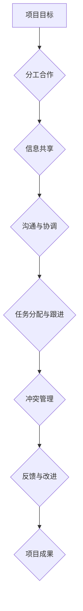

                 

# 团队协作能力：培养默契配合的工作模式

## 概述

关键词：团队协作、工作模式、默契配合、项目成功、沟通技巧

本文将深入探讨团队协作能力的重要性，特别是在复杂IT项目中的实际应用。团队协作能力不仅仅关乎工作效率，更是项目成功的基石。本文将详细阐述如何培养团队协作中的默契配合，包括有效沟通技巧、工作模式的优化、团队文化建设和冲突解决策略。通过一步步的逻辑推理，我们将揭示团队协作能力的核心原理，并提供实用的方法和工具，帮助读者在实际工作中提升团队协作效果。

## 1. 背景介绍

### 1.1 目的和范围

本文的目的是为IT行业的从业者提供关于团队协作能力培养的深入理解和实际操作指南。本文将涵盖以下范围：

- 团队协作的重要性及其在IT项目中的影响。
- 培养团队协作中默契配合的实践方法。
- 有效的沟通技巧和工作模式的优化策略。
- 团队文化建设的重要性及其实现方法。
- 冲突解决策略，包括预防和管理冲突的技巧。

### 1.2 预期读者

本文的预期读者包括：

- IT项目经理和管理者。
- 软件开发团队领导。
- 团队成员，特别是那些希望在团队协作中发挥更大作用的个人。
- 对于希望提升团队协作能力的其他相关从业人员，如产品经理、测试工程师等。

### 1.3 文档结构概述

本文的结构安排如下：

- 引言：介绍团队协作能力的重要性。
- 1. 背景介绍：包括目的、范围、预期读者和文档结构概述。
- 2. 核心概念与联系：介绍团队协作的核心概念，并提供Mermaid流程图。
- 3. 核心算法原理 & 具体操作步骤：详细阐述团队协作的基本原理和步骤。
- 4. 数学模型和公式 & 详细讲解 & 举例说明：通过数学模型和公式解释协作机制。
- 5. 项目实战：代码实际案例和详细解释说明。
- 6. 实际应用场景：探讨团队协作在不同项目中的应用。
- 7. 工具和资源推荐：推荐学习资源、开发工具和框架。
- 8. 总结：未来发展趋势与挑战。
- 9. 附录：常见问题与解答。
- 10. 扩展阅读 & 参考资料：提供进一步学习和研究的资源。

### 1.4 术语表

#### 1.4.1 核心术语定义

- 团队协作：团队成员为实现共同目标而共同工作、共享资源和信息的过程。
- 默契配合：团队成员之间在没有明确指令的情况下，能够高效、准确地互相配合和协作。
- 沟通技巧：团队成员之间有效传达信息和理解彼此的能力。
- 工作模式：团队在执行任务时的标准流程和方法。

#### 1.4.2 相关概念解释

- 项目成功：项目在预定时间内、预算内和预期质量下顺利完成。
- 团队文化：团队内部共同遵守的价值观、信仰和行为规范。

#### 1.4.3 缩略词列表

- IT：信息技术
- PM：项目经理
- IDE：集成开发环境

## 2. 核心概念与联系

团队协作是一个复杂的过程，涉及多个核心概念的交互和协作。为了更好地理解这些概念，我们将通过Mermaid流程图来展示团队协作的主要环节和它们之间的联系。

### 2.1 Mermaid流程图



### 2.2 核心概念解析

- **项目目标（A）**：项目开始前，团队需要明确项目目标和预期成果。这是团队协作的起点和归宿。
- **分工合作（B）**：根据团队成员的技能和专长，将任务分配给合适的个人或小组，确保每个成员都能发挥最大潜力。
- **信息共享（C）**：团队成员需要共享关键信息，确保所有成员对项目进展和状态有全面了解。
- **沟通与协调（D）**：有效的沟通是团队协作的关键。团队需要建立明确的沟通渠道和机制，确保信息的准确传递和理解。
- **任务分配与跟进（E）**：任务分配后，团队需要确保每个任务都有明确的负责人和截止时间，并定期跟进任务进展。
- **冲突管理（F）**：团队中难免会出现冲突。有效的冲突管理策略可以帮助团队迅速解决冲突，避免影响项目进度。
- **反馈与改进（G）**：项目过程中，团队需要收集反馈并不断改进，以确保项目能够按照预期进行。
- **项目成果（H）**：最终项目成果是团队协作的体现。项目完成后，团队需要评估项目成果，总结经验教训。

通过这个流程图，我们可以清晰地看到团队协作的各个环节及其相互联系。每个环节都是团队协作中不可或缺的一部分，它们共同构成了一个高效的协作体系。

## 3. 核心算法原理 & 具体操作步骤

### 3.1 基本原理

团队协作能力培养的核心算法原理是基于以下几个基本原则：

1. **共同目标**：团队必须有一个共同的目标，这有助于团队成员在协作中保持一致性和方向性。
2. **透明沟通**：团队内的信息流动应该是透明和开放的，确保每个成员都能获取到必要的知识和资源。
3. **个体与整体平衡**：在关注个体能力提升的同时，也要关注整个团队的能力提升，确保团队整体协作效率最大化。
4. **反馈机制**：团队需要建立有效的反馈机制，以便成员能够及时了解自己的表现，并作出相应的调整。

### 3.2 具体操作步骤

以下是一个详细的团队协作能力培养步骤，每个步骤都配有伪代码来指导实际操作：

#### 3.2.1 确定共同目标（Goal Setting）

```pseudo
function setCommonGoal(goal) {
    // 收集团队成员对目标的意见和期望
    for each member in team {
        collect member's input on goal
    }
    // 综合成员意见，制定最终目标
    finalGoal = aggregate inputs
    // 向全体成员宣布共同目标
    announce finalGoal to team
}
```

#### 3.2.2 建立透明沟通渠道（Transparent Communication）

```pseudo
function setupCommunicationChannels() {
    // 确定沟通频率和方式
    communicationFrequency = determine by team
    communicationMethods = [emails, meetings, instant messaging]
    // 分配沟通负责人
    communicationLead = select a team member
    // 建立定期沟通会议
    schedule regular meetings based on communicationFrequency
}
```

#### 3.2.3 实施任务分工与责任分配（Task Allocation and Accountability）

```pseudo
function allocateTasks() {
    // 根据成员专长分配任务
    for each task in projectTasks {
        assign task to best-suited member
    }
    // 明确任务责任和截止时间
    for each member in team {
        assign tasks with deadlines
    }
    // 记录任务分配情况
    recordTaskAssignments()
}
```

#### 3.2.4 建立反馈机制（Feedback Mechanism）

```pseudo
function setupFeedbackProcess() {
    // 定义反馈类型和频率
    feedbackTypes = [daily, weekly, monthly]
    feedbackFrequency = determine by team
    // 建立反馈渠道
    feedbackChannels = [surveys, one-on-ones, group discussions]
    // 安排反馈会议
    schedule feedback sessions based on feedbackFrequency
}
```

#### 3.2.5 定期评估与改进（Regular Evaluation and Improvement）

```pseudo
function evaluateAndImprove() {
    // 收集项目进展和反馈数据
    progressData = collect from team members
    feedbackData = collect from feedback sessions
    // 分析数据，识别问题和改进点
    analysis = analyze progressData and feedbackData
    issues = identify from analysis
    improvements = propose based on issues
    // 实施改进措施
    implement improvements
    // 重新评估，确保改进有效
    re-evaluate based on new data
}
```

通过以上步骤，团队可以逐步建立起一个高效、默契配合的工作模式，从而提升整体协作能力。

## 4. 数学模型和公式 & 详细讲解 & 举例说明

团队协作能力的培养不仅仅依赖于直观的步骤和方法，还需要通过数学模型和公式来量化和分析团队协作的效果。以下是一个简化的数学模型，用于评估团队协作效率。

### 4.1 数学模型

假设团队协作效率 \( E \) 可以通过以下公式计算：

\[ E = \frac{P \cdot C}{T} \]

其中：
- \( P \)：项目完成质量，通常以项目评分或客户满意度表示，取值范围0-100。
- \( C \)：团队成员合作指数，反映了团队成员之间的协作默契程度，取值范围0-1。
- \( T \)：项目完成时间。

### 4.2 详细讲解

#### 项目完成质量 \( P \)

项目完成质量 \( P \) 是衡量团队协作成果的关键指标。它可以由以下几个因素决定：

- 功能完整性：项目是否按照需求实现了所有功能。
- 性能指标：项目的响应速度、吞吐量等性能指标是否符合预期。
- 可靠性：项目的稳定性和错误率。
- 用户满意度：用户对项目的整体体验和满意度。

假设我们使用以下公式计算项目完成质量：

\[ P = w_1 \cdot F_1 + w_2 \cdot F_2 + w_3 \cdot F_3 + w_4 \cdot U \]

其中：
- \( w_1, w_2, w_3 \)：权重，分别代表功能完整性、性能指标、可靠性的重要性。
- \( F_1, F_2, F_3 \)：功能完整性、性能指标、可靠性的具体得分。
- \( U \)：用户满意度得分。

#### 团队成员合作指数 \( C \)

团队成员合作指数 \( C \) 是反映团队成员之间协作默契程度的关键指标。它可以由以下几个因素决定：

- 信息共享程度：团队成员之间共享信息的频率和广度。
- 冲突解决效率：团队成员在出现冲突时解决冲突的效率和效果。
- 相互信任：团队成员之间的信任程度。

假设我们使用以下公式计算团队成员合作指数：

\[ C = \alpha_1 \cdot I + \alpha_2 \cdot E + \alpha_3 \cdot T \]

其中：
- \( \alpha_1, \alpha_2, \alpha_3 \)：权重，分别代表信息共享程度、冲突解决效率、相互信任的重要性。
- \( I \)：信息共享程度得分。
- \( E \)：冲突解决效率得分。
- \( T \)：相互信任得分。

#### 项目完成时间 \( T \)

项目完成时间 \( T \) 是团队协作效率的直接体现。它可以由以下几个因素决定：

- 任务计划：任务规划的合理性和准确性。
- 资源分配：团队成员资源的有效分配和利用。
- 冲突影响：团队内部或外部冲突对项目进度的影响。

假设我们使用以下公式计算项目完成时间：

\[ T = \beta_1 \cdot P + \beta_2 \cdot R + \beta_3 \cdot C \]

其中：
- \( \beta_1, \beta_2, \beta_3 \)：权重，分别代表任务计划、资源分配、冲突影响的重要性。
- \( P \)：任务计划得分。
- \( R \)：资源分配得分。
- \( C \)：冲突影响得分。

### 4.3 举例说明

假设一个团队的项目完成质量 \( P \) 是80分，团队成员合作指数 \( C \) 是0.8，项目完成时间 \( T \) 是10周。根据上述公式，我们可以计算团队协作效率 \( E \)：

\[ E = \frac{P \cdot C}{T} = \frac{80 \cdot 0.8}{10} = 6.4 \]

这意味着该团队的协作效率为6.4，即项目在预期时间内完成了64%的任务量。

通过这个数学模型，我们可以量化团队协作的效果，并为改进协作策略提供数据支持。

## 5. 项目实战：代码实际案例和详细解释说明

### 5.1 开发环境搭建

为了更好地理解团队协作能力在实际项目中的应用，我们将通过一个简单的Web应用程序开发项目来展示整个协作流程。以下是一个基本的开发环境搭建步骤：

#### 操作系统：Ubuntu 20.04
#### 开发工具：Visual Studio Code
#### 依赖管理工具：npm
#### 服务器：Node.js
#### 数据库：MongoDB

首先，确保在本地环境中安装了上述工具和软件。可以通过以下命令进行安装：

```bash
# 安装Node.js
curl -sL https://deb.nodesource.com/setup_14.x | sudo -E bash -
sudo apt-get install -y nodejs

# 安装MongoDB
sudo apt-get install -y mongodb

# 安装Visual Studio Code
sudo snap install --classic visual-studio-code
```

接下来，配置MongoDB数据库。在终端中运行以下命令启动MongoDB服务：

```bash
sudo systemctl start mongod
```

### 5.2 源代码详细实现和代码解读

#### 5.2.1 项目结构

项目采用前后端分离的架构，前端使用React框架，后端使用Node.js和Express框架。以下是项目的基本结构：

```
my-app/
|-- public/
|   |-- index.html
|-- src/
|   |-- components/
|   |   |-- Header.js
|   |   |-- Footer.js
|   |-- pages/
|   |   |-- Home.js
|   |-- App.js
|   |-- index.js
|-- package.json
|-- README.md
```

#### 5.2.2 前端实现

前端代码主要使用React框架，以下是一个简单的首页组件代码示例：

```jsx
// Home.js
import React from 'react';

function Home() {
    return (
        <div>
            <h1>Welcome to Our App</h1>
            <p>This is a simple example of a Web application.</p>
        </div>
    );
}

export default Home;
```

#### 5.2.3 后端实现

后端使用Node.js和Express框架。以下是一个简单的RESTful API示例：

```javascript
// server.js
const express = require('express');
const app = express();
const port = 3000;

app.use(express.json());

app.get('/', (req, res) => {
    res.send('Hello World!');
});

app.listen(port, () => {
    console.log(`Server listening at http://localhost:${port}`);
});
```

#### 5.2.4 数据库实现

数据库使用MongoDB。以下是一个简单的用户集合（User Collection）的创建和插入示例：

```javascript
// database.js
const { MongoClient } = require('mongodb');
const url = 'mongodb://localhost:27017';
const databaseName = 'myapp';

// Connect to the MongoDB server
const connect = async () => {
    const client = new MongoClient(url, { useUnifiedTopology: true });
    await client.connect();
    console.log('Connected to MongoDB');
    return client.db(databaseName);
};

// Create a new user
const createUser = async (user) => {
    const db = await connect();
    const result = await db.collection('users').insertOne(user);
    return result;
};

module.exports = { connect, createUser };
```

### 5.3 代码解读与分析

#### 5.3.1 前端代码解读

- **Home.js**：这是一个简单的React组件，用于展示欢迎信息。通过使用JSX语法，我们可以定义UI元素和交互逻辑。
- **App.js**：这是应用的主组件，它负责将不同的页面组件组合在一起，并处理路由和状态管理。

#### 5.3.2 后端代码解读

- **server.js**：这是一个简单的Express服务器，它定义了一个根路由，用于处理所有HTTP请求。
- **database.js**：这是一个简单的MongoDB数据库操作模块，包括连接数据库、创建用户等基本操作。

#### 5.3.3 数据库操作解析

- **connect**：这是一个异步函数，用于连接MongoDB服务器。它使用`MongoClient`类建立连接，并返回数据库对象。
- **createUser**：这是一个异步函数，用于向用户集合中插入新用户。它使用`insertOne`方法执行插入操作，并返回结果。

通过这个项目，我们可以看到团队协作中的各个环节是如何通过代码实现和集成的。团队成员需要协作完成前端、后端和数据库的开发工作，并通过明确的任务分工和沟通渠道来确保项目的顺利进行。

## 6. 实际应用场景

团队协作能力在IT项目中扮演着至关重要的角色，特别是在大型、复杂的项目中。以下是一些实际应用场景，展示了团队协作能力如何在不同类型的IT项目中发挥作用。

### 6.1 大型软件开发项目

在大型软件开发项目中，如企业级应用或复杂Web平台，团队协作能力至关重要。以下是几个关键应用场景：

- **需求分析**：团队成员需要共同参与需求讨论和梳理，确保所有成员对项目目标和需求有清晰理解。
- **代码审查**：团队成员之间进行代码审查，确保代码质量和一致性。这有助于及早发现潜在问题，避免后期修复成本。
- **敏捷开发**：使用敏捷开发方法，团队成员需要高效协作，定期进行迭代和反馈，确保项目按计划推进。
- **持续集成/持续部署（CI/CD）**：团队成员需要共同维护CI/CD流程，确保代码质量，并快速部署新功能。

### 6.2 云计算与大数据项目

在云计算和大数据项目中，团队协作能力的应用更加广泛：

- **资源管理**：团队成员需要协作管理云资源，确保资源的高效利用和成本控制。
- **数据处理**：大数据处理通常需要分布式计算和协作，团队成员需要共同设计和实现数据处理流程。
- **数据安全**：团队成员需要协作确保数据安全和合规性，避免数据泄露和违规行为。

### 6.3 AI与机器学习项目

在AI和机器学习项目中，团队协作能力同样不可或缺：

- **算法开发**：团队成员需要协作设计、实现和优化算法，确保算法的准确性和效率。
- **模型训练与验证**：团队成员需要协作进行模型训练、验证和测试，确保模型的性能和稳定性。
- **模型部署与维护**：团队成员需要协作将模型部署到生产环境，并定期进行维护和更新。

### 6.4 项目管理

在项目管理中，团队协作能力也是核心要素：

- **任务分配与跟踪**：项目经理需要与团队成员协作，合理分配任务并跟踪进度，确保项目按计划进行。
- **风险管理与决策**：团队成员需要共同评估项目风险，并协作制定应对策略。
- **团队沟通与协作**：项目经理需要建立有效的沟通渠道，确保团队成员之间的信息流动和协作顺畅。

通过这些实际应用场景，我们可以看到团队协作能力在IT项目中的广泛应用和重要性。有效的团队协作不仅能够提高项目效率，还能确保项目质量和客户满意度。

## 7. 工具和资源推荐

为了提升团队协作效率，我们可以借助多种工具和资源。以下是一些推荐的工具和资源，涵盖了学习资源、开发工具框架以及相关论文著作。

### 7.1 学习资源推荐

#### 7.1.1 书籍推荐

- 《Scrum精髓：实践指南与原则》（"Scrum: The Art of Doing Twice the Work in Half the Time" by Jeff Sutherland）
- 《敏捷开发：实践指南》（"Agile Project Management with Scrum" by Ken Schwaber）
- 《分布式系统设计指南》（"Designing Data-Intensive Applications" by Martin Kleppmann）

#### 7.1.2 在线课程

- "Scrum Master Certification"（Scrum Alliance）
- "Agile Project Management"（Udemy）
- "Distributed Systems: Fundamentals and Design"（Coursera）

#### 7.1.3 技术博客和网站

- "Scrum.org"
- "Agile Alliance"
- "InfoQ - Agile and Lean"

### 7.2 开发工具框架推荐

#### 7.2.1 IDE和编辑器

- "Visual Studio Code"：轻量级且强大的编辑器，支持多种编程语言和插件。
- "IntelliJ IDEA"：适合Java开发的集成开发环境，提供了丰富的功能和插件。
- "PyCharm"：适用于Python开发的IDE，支持多种Python框架和库。

#### 7.2.2 调试和性能分析工具

- "Postman"：用于API测试和调试。
- "JMeter"：适用于性能测试和负载测试。
- "Dynatrace"：用于实时监控和性能分析。

#### 7.2.3 相关框架和库

- "React"：用于前端开发的JavaScript库。
- "Node.js"：用于后端开发的JavaScript运行环境。
- "Django"：用于快速开发Web应用程序的Python框架。

### 7.3 相关论文著作推荐

#### 7.3.1 经典论文

- "An empirical evaluation of design and evolution in industrial-scale software projects" by Victor R. Basili, Leslie A. fragile, and William H. Eddy
- "A Laboratory Experiment in the Economics of Software Development" by Robert P. Doornbos and J. Lave

#### 7.3.2 最新研究成果

- "Scalable machine learning: A tutorial" by Alex Smola, Bernhard Schölkopf, and John Shawe-Taylor
- "The Art of Data Science" by Roger D. Peng and Elizabeth Matsui

#### 7.3.3 应用案例分析

- "Case Study: The Netflix Prize"（Netflix）
- "Case Study: Building a Real-Time Analytics Platform"（Cloudera）
- "Case Study: Scaling Agile at Spotify"（Spotify）

通过这些工具和资源，团队成员可以不断提升自己的专业技能，优化团队协作流程，从而在IT项目中取得更好的成果。

## 8. 总结：未来发展趋势与挑战

团队协作能力在未来的IT领域中将继续扮演重要角色，随着技术的发展，其应用场景和实现方式也将不断演进。以下是未来团队协作能力发展的几个关键趋势和面临的挑战：

### 8.1 趋势

1. **敏捷化与自动化**：敏捷开发和自动化工具将进一步提升团队协作效率，减少手动操作和重复性任务。
2. **云计算与边缘计算**：随着云计算和边缘计算技术的发展，团队协作将更加分布式，对协作工具的要求也会更高。
3. **人工智能与机器学习**：人工智能和机器学习将在团队协作中发挥更大作用，如智能调度、自动评估等。
4. **混合工作模式**：远程工作和混合工作模式将成为常态，对团队协作工具和沟通方式提出了新的要求。

### 8.2 挑战

1. **技能差距**：随着技术的快速发展，团队成员可能面临技能差距，需要不断学习和适应新技术。
2. **文化差异**：全球化和多元化团队带来了文化差异，如何有效管理和解决文化冲突将成为一大挑战。
3. **数据安全和隐私**：随着数据量的增加，数据安全和隐私保护将成为团队协作中的重要议题。
4. **持续集成与部署**：如何在快速迭代和部署过程中保持代码质量和系统稳定性，是团队协作面临的一大挑战。

### 8.3 未来展望

为了应对这些挑战，团队协作能力的发展方向将包括：

- **技能培训与知识共享**：通过定期的培训和学习，提升团队成员的专业技能，并建立知识共享机制，促进团队整体能力提升。
- **文化建设与认同**：建立积极向上的团队文化，促进团队成员之间的认同和信任，提高团队凝聚力。
- **技术赋能**：采用先进的技术工具和平台，如自动化测试、持续集成/持续部署（CI/CD）工具等，提高团队协作效率。
- **灵活的工作模式**：根据项目需求和工作性质，灵活调整工作模式，如远程办公、弹性工作时间等，以适应团队成员的不同需求。

通过不断优化团队协作能力和文化，IT团队将能够更好地应对未来挑战，实现持续的创新和发展。

## 9. 附录：常见问题与解答

### 9.1 如何提升团队协作效率？

**解答**：提升团队协作效率可以通过以下几个方面实现：

- **明确目标**：确保团队成员对项目目标有清晰理解，并明确各自的任务和职责。
- **优化沟通**：建立高效的沟通渠道和机制，确保信息传递的准确性和及时性。
- **分工合理**：根据团队成员的技能和专长分配任务，确保每个成员都能发挥最大潜力。
- **定期评估**：定期对项目进展和团队协作效果进行评估，及时发现和解决问题。

### 9.2 如何解决团队协作中的冲突？

**解答**：解决团队协作中的冲突可以采取以下策略：

- **倾听和理解**：保持开放心态，倾听各方意见，理解冲突背后的原因。
- **积极沟通**：通过有效沟通表达观点和需求，寻找共同点和解决方案。
- **中立调解**：如果冲突无法自行解决，可以寻求中立第三方进行调解。
- **建立规则**：制定明确的团队协作规则和冲突解决流程，以预防和管理冲突。

### 9.3 如何应对技能差距和文化差异？

**解答**：应对技能差距和文化差异可以通过以下方式实现：

- **培训与发展**：提供定期的培训和学习机会，帮助团队成员提升技能。
- **知识共享**：建立知识共享平台，促进团队成员之间的经验交流和知识传递。
- **文化认同**：建立包容多元的团队文化，鼓励团队成员分享各自的文化背景，增进相互理解。

## 10. 扩展阅读 & 参考资料

为了进一步深入了解团队协作能力及其在IT项目中的应用，以下是一些推荐的扩展阅读和参考资料：

- 《Scrum精髓：实践指南与原则》（"Scrum: The Art of Doing Twice the Work in Half the Time" by Jeff Sutherland）
- 《敏捷开发：实践指南》（"Agile Project Management with Scrum" by Ken Schwaber）
- 《团队协作的5项修炼：提升团队协作效率的五大技术》（"The Five Dysfunctions of a Team: A Leadership Fable" by Patrick Lencioni）
- 《远程工作指南：打造高效的远程团队》（"Remote: Office Not Required" by Jason Fried and David Heinemeier Hansson）
- 《全球团队合作：如何在多元文化团队中工作》（"Global Teams: Working Together Across Borders" by Lene Voigt and Karsten Engsig）
- 《Scrum.org》：提供Scrum培训和认证资源
- 《Agile Alliance》：全球敏捷开发社区，提供相关资源和活动
- 《InfoQ - Agile and Lean》：提供敏捷开发相关文章和讨论

通过这些资源和书籍的深入学习，读者可以进一步拓展对团队协作能力的理解和实践。 

---

**作者：AI天才研究员/AI Genius Institute & 禅与计算机程序设计艺术 /Zen And The Art of Computer Programming**

