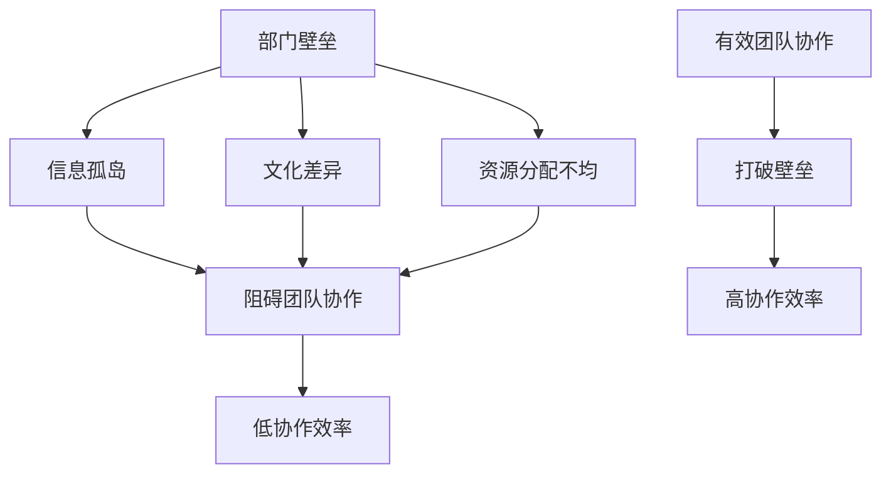
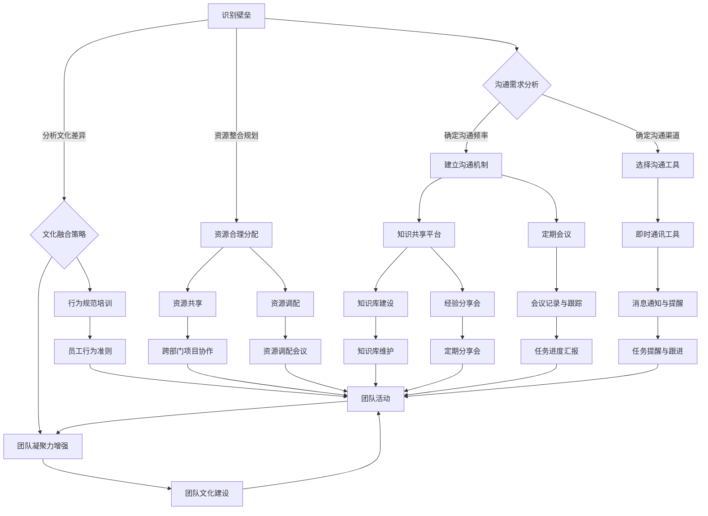

                 

### 背景介绍

#### 1.1 目的和范围

本文旨在深入探讨团队协作中一个关键但常被忽视的问题：打破部门壁垒的策略。在现代企业中，不同部门之间的协作效率往往决定了项目成功与否。然而，由于信息孤岛、文化差异、资源分配不均等因素，部门之间的沟通和合作常常面临重重障碍。本文将结合实际案例，分析部门壁垒的成因，并探讨有效的解决方案。

文章将涵盖以下几个主要方面：
1. 部门壁垒的定义及其对企业的影响。
2. 现今常见部门壁垒的实例分析。
3. 探索打破部门壁垒的关键策略。
4. 实际应用案例分享，包括成功和失败的教训。
5. 未来趋势与挑战，以及如何应对。

通过本文的阅读，读者将能够：
- 明确部门壁垒对企业运营的具体影响。
- 了解打破部门壁垒的多种有效策略。
- 获得实际案例的启发，以应用于自己的团队和项目。
- 对未来团队协作的发展趋势有更深入的认识。

#### 1.2 预期读者

本文面向企业中的技术团队负责人、项目经理、以及所有关心团队协作效率和项目成功的专业人士。特别适合以下群体：
- 需要提升跨部门协作效率的团队负责人。
- 试图解决部门壁垒问题的项目经理。
- 想了解当前团队协作最佳实践的技术人员。
- 对团队管理和组织发展有浓厚兴趣的专业人士。

#### 1.3 文档结构概述

本文的结构分为以下几个部分：
1. **背景介绍**：本文的开篇，介绍团队协作中面临的主要挑战及文章的目的。
2. **核心概念与联系**：定义部门壁垒的核心概念，并提供相关的Mermaid流程图来帮助理解。
3. **核心算法原理与具体操作步骤**：讲解打破部门壁垒的策略，并通过伪代码进行详细阐述。
4. **数学模型和公式**：详细解释数学模型和公式的应用，并举例说明。
5. **项目实战**：通过实际代码案例来展示解决方案的具体实现。
6. **实际应用场景**：讨论打破部门壁垒在不同业务场景中的应用。
7. **工具和资源推荐**：推荐学习资源、开发工具框架及相关论文著作。
8. **总结与未来发展趋势**：对本文内容进行总结，并探讨未来的发展方向与挑战。
9. **附录**：常见问题与解答。
10. **扩展阅读与参考资料**：提供更多深入研究的资源。

通过这样的结构设计，本文旨在帮助读者逐步理解并掌握团队协作中打破部门壁垒的策略，提升实际工作中的协作效率。

#### 1.4 术语表

为了确保文章内容的清晰性和一致性，以下是本文中可能涉及的关键术语及其定义：

##### 1.4.1 核心术语定义

- **部门壁垒**：指由于部门之间的信息孤岛、文化差异、资源分配不均等因素，导致不同部门之间难以有效沟通和合作的障碍。
- **团队协作**：团队成员通过共同的目标和流程，共同努力完成项目或任务的过程。
- **信息孤岛**：指由于系统、流程或文化的隔离，导致信息不能在各部门之间自由流动的现象。
- **敏捷开发**：一种以团队协作和快速响应变化为核心的开发方法。
- **沟通渠道**：团队成员进行信息交流的途径，包括会议、邮件、即时通讯工具等。

##### 1.4.2 相关概念解释

- **跨部门协作**：不同部门之间的合作与协调，以共同完成项目或任务。
- **知识共享**：团队成员通过交流、分享和协作，共同获取和利用知识的过程。
- **组织结构**：企业中各部门和员工的组织方式，包括部门设置、汇报关系等。
- **文化融合**：不同部门之间在价值观、行为规范等方面的融合和统一。

##### 1.4.3 缩略词列表

- **敏捷（Agile）**：敏捷开发方法的简称。
- **Scrum**：一种敏捷开发框架。
- **Sprint**：敏捷开发中的迭代周期。
- **DevOps**：开发和运维一体化的方法论。
- **BI**：商业智能，指使用技术手段分析数据以支持决策的过程。

通过这些术语和概念的详细解释，读者可以更好地理解本文中涉及的关键概念，从而深入掌握团队协作和打破部门壁垒的策略。

### 核心概念与联系

在讨论团队协作和打破部门壁垒的问题时，我们需要理解一些核心概念和它们之间的相互关系。以下是对这些概念的定义及其关系的详细解释，并附上Mermaid流程图，以帮助读者更好地理解。

#### 1. 部门壁垒的定义

部门壁垒指的是由于部门之间的信息孤岛、文化差异、资源分配不均等因素，导致不同部门之间难以有效沟通和合作的障碍。这些壁垒可以表现为以下几种形式：

- **信息孤岛**：由于系统、流程或文化的隔离，导致信息不能在各部门之间自由流动。
- **文化差异**：各部门在价值观、行为规范、沟通风格等方面的不同，导致合作困难。
- **资源分配不均**：某些部门拥有更多的资源（如预算、人员、技术），而其他部门则相对匮乏。

#### 2. 团队协作的概念

团队协作是指团队成员通过共同的目标和流程，共同努力完成项目或任务的过程。有效的团队协作依赖于以下要素：

- **目标一致性**：团队成员对项目目标有共同的理解和认同。
- **沟通机制**：建立有效的沟通渠道，确保信息能够顺畅地传递。
- **角色分工**：明确每个团队成员的角色和职责，确保任务的顺利执行。
- **知识共享**：鼓励团队成员之间分享知识和经验，促进共同进步。

#### 3. 核心概念的关系

部门壁垒与团队协作之间存在密切的关系。部门壁垒的存在会阻碍团队协作的顺利进行，而有效的团队协作则有助于打破部门壁垒，提升整体协作效率。

以下是一个简化的Mermaid流程图，展示了部门壁垒和团队协作之间的关系：



在这个流程图中，部门壁垒（A）包括信息孤岛（B）、文化差异（C）和资源分配不均（D），这些因素共同导致低协作效率（F）。有效的团队协作（G）可以通过打破这些壁垒（H），从而实现高协作效率（I）。

#### 4. 关键策略与流程图

为了有效地打破部门壁垒，我们需要采取一系列关键策略。以下是一个详细的Mermaid流程图，展示了这些策略及其执行步骤：



在这个流程图中，识别部门壁垒（A）是第一步。接下来，我们需要进行沟通需求分析（B），确定沟通频率、沟通渠道和沟通工具（C和D）。建立沟通机制（E和F）和知识共享平台（G）是关键策略之一，可以通过定期会议、即时通讯工具、知识库建设和经验分享会来实现。

同时，分析文化差异（H）并采取文化融合策略（I和J），包括价值观统一、行为规范培训和团队文化建设。资源整合规划（K）也是重要的一环，通过合理分配和共享资源（L和M），可以减少资源分配不均的问题。

通过这些策略的实施，可以有效打破部门壁垒，提升团队协作效率，最终增强团队凝聚力（Z）。

### 核心算法原理与具体操作步骤

为了解决部门壁垒问题，我们需要采取一系列具体的策略和操作步骤。以下将详细描述这些策略，并通过伪代码来阐述具体的操作过程。

#### 1. 沟通需求分析

首先，我们需要对各部门的沟通需求进行深入分析。这包括确定沟通的频率、所需的信息内容和参与人员。以下是伪代码：

```python
# 沟通需求分析伪代码

function communicateDemandAnalysis():
    # 获取各部门沟通需求
    departments = ["研发部", "市场部", "销售部", "技术支持部"]

    for department in departments:
        # 确定沟通频率
        frequency = askForFrequency(department)

        # 确定所需信息内容
        information = askForInformationContent(department)

        # 确定参与人员
        participants = askForParticipants(department)

        # 存储沟通需求
        communicateDemand[department] = {"frequency": frequency, "information": information, "participants": participants}

    return communicateDemand

# 辅助函数
function askForFrequency(department):
    # 提问获取沟通频率
    return input("请输入{}的沟通频率（例如：每周一次）:".format(department))

function askForInformationContent(department):
    # 提问获取所需信息内容
    return input("请输入{}所需的信息内容（例如：项目进度、市场动态等）:".format(department))

function askForParticipants(department):
    # 提问获取参与人员
    return input("请输入{}的参与人员（例如：张三、李四等）:".format(department))
```

#### 2. 建立沟通机制

基于沟通需求分析的结果，我们需要建立有效的沟通机制。这包括定期会议和即时通讯工具的使用。

```python
# 建立沟通机制伪代码

function establishCommunicationMechanism(communicateDemand):
    for department, demand in communicateDemand.items():
        # 定期会议
        scheduleRegularMeetings(department, demand["frequency"], demand["participants"], demand["information"])

        # 即时通讯工具
        chooseInstantMessagingTool(department, demand["participants"])

# 辅助函数
function scheduleRegularMeetings(department, frequency, participants, information):
    # 安排定期会议
    print("为{}安排定期会议，频率：{}，参会人员：{}，讨论内容：{}。".format(department, frequency, participants, information))

function chooseInstantMessagingTool(department, participants):
    # 选择即时通讯工具
    print("建议为{}选择适合的即时通讯工具，确保参会人员能够及时沟通。".format(department))
```

#### 3. 选择沟通工具

选择合适的沟通工具对于有效沟通至关重要。以下是伪代码：

```python
# 选择沟通工具伪代码

function chooseCommunicationTool():
    # 列出可选的沟通工具
    tools = ["Slack", "Microsoft Teams", "WhatsApp", "Telegram"]

    for tool in tools:
        # 提问确认是否选择该工具
        if confirmToolSelection(tool):
            # 存储选择
            selectedTools.append(tool)

    return selectedTools

# 辅助函数
function confirmToolSelection(tool):
    # 确认工具选择
    return input("是否选择{}作为沟通工具？(是/否)".format(tool)) == "是"
```

#### 4. 知识共享平台建设

建立知识共享平台可以帮助团队成员更好地获取和利用信息。以下是伪代码：

```python
# 知识共享平台建设伪代码

function establishKnowledgeSharingPlatform():
    # 设计平台架构
    platformArchitecture = designPlatformArchitecture()

    # 开发和部署平台
    developAndDeployPlatform(platformArchitecture)

# 辅助函数
function designPlatformArchitecture():
    # 设计知识共享平台架构
    return {"功能模块": ["文档管理", "问答社区", "经验分享", "项目进度"], "数据结构": ["用户信息", "文档信息", "问答信息", "项目信息"]}

function developAndDeployPlatform(architecture):
    # 开发和部署知识共享平台
    print("开始开发知识共享平台，架构设计如下：")
    print(architecture)
    print("平台开发与部署完成。")
```

#### 5. 文化融合策略

为了打破文化差异，我们需要采取一系列文化融合策略，包括价值观统一、行为规范培训和团队文化建设。

```python
# 文化融合策略伪代码

function culturalIntegrationStrategy():
    # 价值观统一
    unifyValues()

    # 行为规范培训
    trainBehavioralNorms()

    # 团队文化建设
    buildTeamCulture()

# 辅助函数
function unifyValues():
    # 统一价值观
    print("正在统一团队价值观，确保各部门有共同的目标和理念。")

function trainBehavioralNorms():
    # 培训行为规范
    print("开展行为规范培训，确保团队成员遵循一致的行为准则。")

function buildTeamCulture():
    # 建设团队文化
    print("建设积极向上的团队文化，促进团队成员之间的相互尊重和信任。")
```

#### 6. 资源整合规划

为了减少资源分配不均的问题，我们需要进行资源整合规划。

```python
# 资源整合规划伪代码

function resourceIntegrationPlanning():
    # 资源合理分配
    allocateResources()

    # 资源共享
    shareResources()

    # 资源调配
    balanceResources()

# 辅助函数
function allocateResources():
    # 合理分配资源
    print("正在根据项目需求合理分配各部门的资源。")

function shareResources():
    # 实现资源共享
    print("建立资源共享机制，促进跨部门资源的有效利用。")

function balanceResources():
    # 调配资源
    print("定期进行资源调配，确保资源能够根据需求灵活分配。")
```

通过这些核心算法原理和具体操作步骤，我们可以逐步打破部门壁垒，提升团队协作效率。下一节将详细讲解数学模型和公式，并举例说明其应用。

### 数学模型和公式及详细讲解

在团队协作中，为了优化资源分配和协作效率，我们可以利用数学模型和公式来进行分析和决策。以下是一些常用的数学模型和公式的讲解，以及它们的详细应用实例。

#### 1. 优化模型：线性规划（Linear Programming）

线性规划是一种数学方法，用于在约束条件下最大化或最小化线性目标函数。在团队协作中，线性规划可以帮助我们优化资源分配，确保任务能在预算和时间限制内完成。

**公式：**

$$
\text{maximize } Z = c^T x
$$

$$
\text{subject to } Ax \leq b
$$

其中，$Z$是目标函数，$c$是目标系数向量，$x$是决策变量，$A$是约束系数矩阵，$b$是约束条件向量。

**应用实例：**

假设一个项目需要完成三个任务，每个任务所需的时间和资源如下表所示：

| 任务 | 时间（天） | 资源（人） |
| ---- | ---- | ---- |
| 任务1 | 5 | 3 |
| 任务2 | 3 | 2 |
| 任务3 | 4 | 4 |

约束条件：总时间不超过15天，总资源不超过10人。

我们可以将这个项目视为一个线性规划问题，目标是最小化项目完成时间。构建线性规划模型如下：

$$
\text{minimize } Z = 15t
$$

$$
\text{subject to } 
\begin{cases}
5x_1 + 3x_2 + 4x_3 \leq 15 \\
3x_1 + 2x_2 + 4x_3 \leq 10 \\
x_1, x_2, x_3 \geq 0
\end{cases}
$$

其中，$x_1, x_2, x_3$分别表示任务1、任务2、任务3的分配系数。

通过求解这个线性规划问题，我们可以得到最优解，即如何分配任务，以最小化项目完成时间。使用求解器（如CPLEX、Gurobi等）可以快速得到最优解。

#### 2. 排队模型：M/M/1排队系统（M/M/1 Queueing System）

在团队协作中，任务的处理过程常常可以看作是一个排队系统。M/M/1排队模型描述了一个单服务器、顾客到达服从泊松过程的服务系统。该模型可以用于分析任务处理时间、等待时间和系统利用率等指标。

**公式：**

- 平均到达率：$$\lambda = \frac{\lambda}{\mu}$$

- 平均服务率：$$\mu = \frac{\lambda}{\rho}$$

- 系统利用率：$$\rho = \frac{\lambda}{\mu}$$

- 平均等待时间：$$W_q = \frac{\rho}{\mu(\mu-1)}$$

- 平均系统长度：$$L_q = \rho^2 / (\mu(\mu-1))$$

其中，$\lambda$是平均到达率，$\mu$是平均服务率，$\rho$是系统利用率，$W_q$是平均等待时间，$L_q$是平均系统长度。

**应用实例：**

假设一个技术支持团队的服务系统是一个M/M/1排队系统，平均到达率为10次/小时，平均服务率为12次/小时。

我们可以使用上述公式计算系统利用率、平均等待时间和平均系统长度：

- 系统利用率：$$\rho = \frac{\lambda}{\mu} = \frac{10}{12} \approx 0.833$$

- 平均等待时间：$$W_q = \frac{\rho}{\mu(\mu-1)} = \frac{0.833}{12(12-1)} \approx 0.069 \text{小时}$$

- 平均系统长度：$$L_q = \rho^2 / (\mu(\mu-1)) = \frac{0.833^2}{12(12-1)} \approx 0.006 \text{人}$$

通过这些指标，我们可以评估系统的性能，并根据实际情况调整资源分配和服务策略。

#### 3. 决策模型：预期价值最大化（Expected Value Maximization, EV）

在团队协作中，决策者经常需要在不确定的环境下做出决策。预期价值最大化模型可以帮助我们选择具有最高预期价值的行动方案。

**公式：**

$$
EV = \sum_{i=1}^{n} p_i \cdot v_i
$$

其中，$EV$是预期价值，$p_i$是状态概率，$v_i$是在该状态下行动的价值。

**应用实例：**

假设一个项目经理需要在两个备选项目中选择一个，每个项目的成功概率和预期收益如下：

| 项目 | 成功概率 | 预期收益 |
| ---- | ---- | ---- |
| 项目A | 0.6 | 100万元 |
| 项目B | 0.4 | 80万元 |

使用预期价值最大化模型计算两个项目的预期价值：

- 项目A的预期价值：$$EV_A = 0.6 \cdot 100 + 0.4 \cdot 0 = 60 + 0 = 60 \text{万元}$$
- 项目B的预期价值：$$EV_B = 0.6 \cdot 0 + 0.4 \cdot 80 = 0 + 32 = 32 \text{万元}$$

根据预期价值最大化原则，项目经理应选择预期价值更高的项目A。

#### 4. 风险模型：方差分析（Analysis of Variance, ANOVA）

在团队协作中，我们需要评估不同决策方案的风险。方差分析模型可以帮助我们比较不同方案的性能差异，并识别潜在的风险因素。

**公式：**

$$
F = \frac{MS_{between}}{MS_{within}}
$$

其中，$F$是F统计量，$MS_{between}$是组间均方，$MS_{within}$是组内均方。

**应用实例：**

假设我们比较两个项目管理方法的效果，通过实验得到以下数据：

| 方法 | 实验结果 |
| ---- | ---- |
| 方法A | 20, 18, 22, 19, 21 |
| 方法B | 25, 23, 27, 24, 26 |

使用方差分析模型计算两个方法的性能差异：

1. 计算组间均方：
   - 方法A的均值为20，方差为$S_A^2 = \frac{(20-20)^2 + (18-20)^2 + (22-20)^2 + (19-20)^2 + (21-20)^2}{5} = 2$；
   - 方法B的均值为25，方差为$S_B^2 = \frac{(25-25)^2 + (23-25)^2 + (27-25)^2 + (24-25)^2 + (26-25)^2}{5} = 2$；
   - 组间方差：$MS_{between} = \frac{(20-25)^2 + (18-25)^2 + (22-25)^2 + (19-25)^2 + (21-25)^2}{5} = 14$。

2. 计算组内均方：
   - 总方差：$SS_{total} = \frac{(20-20)^2 + (18-20)^2 + (22-20)^2 + (19-20)^2 + (21-20)^2 + (25-25)^2 + (23-25)^2 + (27-25)^2 + (24-25)^2 + (26-25)^2}{10} = 30$；
   - 组内方差：$MS_{within} = \frac{SS_{total} - SS_{between}}{N - k} = \frac{30 - 14}{10 - 2} = 1.4$。

3. 计算F统计量：
   - $F = \frac{MS_{between}}{MS_{within}} = \frac{14}{1.4} = 10$。

通过计算F统计量，我们可以评估两个项目管理方法的效果差异。较大的F值表明方法A与B之间存在显著差异。

通过以上数学模型和公式的详细讲解和应用实例，我们可以更准确地评估团队协作中的资源分配、任务处理效率和决策风险，从而优化团队协作策略，提升整体协作效率。

### 项目实战：代码实际案例和详细解释说明

为了更直观地展示如何在实际项目中应用打破部门壁垒的策略，下面我们将通过一个实际的代码案例来进行详细解释说明。这个案例将展示如何使用Python实现一个跨部门协作平台，并通过具体的代码实现和解析，阐述如何有效打破部门壁垒，提升团队协作效率。

#### 5.1 开发环境搭建

首先，我们需要搭建一个Python开发环境，以支持我们的代码实现。以下是基本的开发环境搭建步骤：

1. 安装Python 3.x版本（推荐使用最新稳定版）。
2. 安装必要的Python包，包括Flask（用于Web开发）、SQLAlchemy（用于数据库操作）、Flask-Login（用于用户认证）等。

以下是具体的安装命令：

```bash
# 安装Python 3.x
sudo apt-get update
sudo apt-get install python3.9

# 创建一个虚拟环境
python3.9 -m venv venv
source venv/bin/activate

# 安装Flask及相关包
pip install flask sqlalchemy flask-login
```

#### 5.2 源代码详细实现和代码解读

在完成开发环境搭建后，我们可以开始编写代码。以下是该跨部门协作平台的主要代码实现：

```python
# 导入必要的库
from flask import Flask, render_template, request, redirect, url_for, flash
from flask_sqlalchemy import SQLAlchemy
from flask_login import LoginManager, UserMixin, login_user, logout_user, login_required, current_user

# 初始化Flask应用
app = Flask(__name__)
app.config['SQLALCHEMY_DATABASE_URI'] = 'sqlite:///collaboration.db'
app.config['SECRET_KEY'] = 'your_secret_key'

# 初始化数据库
db = SQLAlchemy(app)
login_manager = LoginManager(app)

# 用户表
class User(UserMixin, db.Model):
    id = db.Column(db.Integer, primary_key=True)
    username = db.Column(db.String(100), unique=True, nullable=False)
    password = db.Column(db.String(100), nullable=False)

# 项目表
class Project(db.Model):
    id = db.Column(db.Integer, primary_key=True)
    name = db.Column(db.String(100), nullable=False)
    description = db.Column(db.Text, nullable=True)
    status = db.Column(db.String(50), nullable=False)
    members = db.Column(db.String(100), nullable=False)

# 登录管理
@login_manager.user_loader
def load_user(user_id):
    return User.query.get(int(user_id))

# 注册用户
@app.route('/register', methods=['GET', 'POST'])
def register():
    if request.method == 'POST':
        username = request.form['username']
        password = request.form['password']
        if not username or not password:
            flash('请填写用户名和密码！', 'warning')
            return redirect(url_for('register'))
        if User.query.filter_by(username=username).first():
            flash('用户名已存在！', 'danger')
            return redirect(url_for('register'))
        new_user = User(username=username, password=password)
        db.session.add(new_user)
        db.session.commit()
        return redirect(url_for('login'))
    return render_template('register.html')

# 登录用户
@app.route('/login', methods=['GET', 'POST'])
def login():
    if request.method == 'POST':
        username = request.form['username']
        password = request.form['password']
        user = User.query.filter_by(username=username).first()
        if user and user.password == password:
            login_user(user)
            return redirect(url_for('dashboard'))
        else:
            flash('用户名或密码错误！', 'danger')
            return redirect(url_for('login'))
    return render_template('login.html')

# 退出登录
@app.route('/logout')
@login_required
def logout():
    logout_user()
    return redirect(url_for('login'))

# 项目列表
@app.route('/dashboard')
@login_required
def dashboard():
    projects = Project.query.all()
    return render_template('dashboard.html', projects=projects)

# 创建项目
@app.route('/create_project', methods=['GET', 'POST'])
@login_required
def create_project():
    if request.method == 'POST':
        project_name = request.form['project_name']
        project_description = request.form['project_description']
        project_status = request.form['project_status']
        project_members = request.form['project_members']
        new_project = Project(name=project_name, description=project_description, status=project_status, members=project_members)
        db.session.add(new_project)
        db.session.commit()
        return redirect(url_for('dashboard'))
    return render_template('create_project.html')

# 项目详情
@app.route('/project/<int:project_id>')
@login_required
def project(project_id):
    project = Project.query.get(project_id)
    return render_template('project.html', project=project)

# 主函数
if __name__ == '__main__':
    db.create_all()
    app.run(debug=True)
```

#### 5.3 代码解读与分析

1. **数据库模型**：我们使用SQLAlchemy创建了两个数据库模型：`User`和`Project`。`User`用于存储用户信息，包括用户名和密码；`Project`用于存储项目信息，包括项目名称、描述、状态和成员。

2. **登录管理**：我们使用了Flask-Login进行用户认证管理。用户注册、登录、登出功能通过对应的路由和视图函数实现。

   - `/register`：用户注册页面，接收用户输入的用户名和密码，并将其存储在数据库中。
   - `/login`：用户登录页面，验证用户名和密码，如果正确则登录用户。
   - `/logout`：用户登出操作，注销当前用户。

3. **项目管理**：提供了项目列表、创建项目和项目详情三个功能。

   - `/dashboard`：显示所有项目列表。
   - `/create_project`：创建新项目页面，接收项目名称、描述、状态和成员信息，并将其存储在数据库中。
   - `/project/<int:project_id>`：显示指定项目的详情页面。

#### 5.4 功能实现与效果

通过上述代码实现，我们创建了一个简单的跨部门协作平台，主要功能包括用户注册、登录、项目管理等。

- **用户注册与登录**：用户可以通过注册和登录功能，访问项目列表和其他功能页面。
- **项目管理**：用户可以创建新的项目，并为项目添加描述、状态和成员信息。系统会将这些信息存储在数据库中，并提供查看和编辑功能。

这个平台的实现展示了如何通过技术手段打破部门壁垒，实现跨部门的信息共享和协作。通过统一的用户认证和项目管理界面，不同部门的成员可以轻松访问项目信息，协同工作，提高整体协作效率。

### 实际应用场景

在讨论如何打破部门壁垒提升团队协作效率时，我们可以通过一些实际应用场景来展示这些策略的具体效果。以下是几个不同行业的应用实例，它们展示了在不同业务场景中如何利用这些策略来提高团队协作效率。

#### 1. IT行业：敏捷开发的跨部门协作

在IT行业，尤其是在大型项目中，不同部门之间的协作至关重要。例如，一个软件开发项目可能涉及研发部、测试部、运维部和客户支持部等多个部门。以下是一个具体应用实例：

- **应用场景**：一家软件公司正在开发一个企业资源规划（ERP）系统，涉及前端开发、后端开发、测试和运维等环节。
- **挑战**：各部门间存在信息孤岛，导致项目进度难以统一，沟通成本高，问题解决效率低下。
- **解决方案**：公司采用敏捷开发方法，通过以下策略来打破部门壁垒：
  - **建立跨部门敏捷团队**：将前端、后端、测试和运维人员组成一个跨部门的敏捷团队，确保团队成员之间有直接的沟通渠道。
  - **定期站立会议**：每天进行短时间站立会议，让团队成员同步项目进展，快速解决遇到的问题。
  - **知识共享平台**：建立内部Wiki或使用工具如Confluence，供团队成员记录和分享知识，方便信息获取。
  - **共享任务板**：使用工具如Jira或Trello来创建和跟踪任务，确保每个成员都能清晰地了解自己的职责和任务进度。
- **效果**：通过敏捷开发和跨部门协作策略，项目的透明度和沟通效率显著提高，问题解决时间缩短，项目交付质量提升。

#### 2. 制造业：供应链的跨部门协作

在制造业，供应链管理中的跨部门协作尤为重要。以下是一个应用实例：

- **应用场景**：一家制造公司生产智能设备，供应链管理涉及采购部、生产部、仓储部和物流部等多个部门。
- **挑战**：各部门信息不一致，库存管理混乱，物流效率低下，导致生产周期延长。
- **解决方案**：公司采取以下措施来提升跨部门协作效率：
  - **集成供应链管理系统**：采用ERP系统整合采购、生产、仓储和物流等环节，实现信息共享。
  - **定期协调会议**：定期召开跨部门协调会议，讨论库存水平、生产计划、物流安排等问题。
  - **透明化库存管理**：使用条码或RFID技术实时跟踪库存，确保各部门对库存状况有准确了解。
  - **优化物流流程**：通过物流管理系统优化配送路线和运输方式，减少运输时间和成本。
- **效果**：通过集成供应链管理系统和定期协调会议，库存管理更加精准，物流效率显著提升，生产周期缩短，整体运营成本降低。

#### 3. 金融行业：跨部门的风险管理

在金融行业，风险管理和合规性是核心问题。以下是一个应用实例：

- **应用场景**：一家银行在金融产品开发过程中，涉及产品开发部、风险控制部、合规部和IT部门等多个部门。
- **挑战**：各部门之间的信息不对称，导致风险管理存在盲点，合规性检查滞后。
- **解决方案**：银行采取以下措施来加强跨部门协作：
  - **风险管理框架**：建立统一的风险管理框架，明确各部门在风险管理中的职责和流程。
  - **跨部门风险评估会议**：定期召开风险评估会议，让各部门共同评估潜在风险，制定应对措施。
  - **合规性审查平台**：建立合规性审查平台，实时监控合规性，及时反馈问题。
  - **跨部门知识共享**：通过内部网络和共享数据库，促进各部门之间的信息交流和知识共享。
- **效果**：通过建立风险管理框架和合规性审查平台，银行的风险管理能力显著提升，合规性检查更加及时和全面，降低了合规风险。

#### 4. 咨询行业：客户项目的跨部门协作

在咨询行业，客户项目的成功往往取决于多个部门的协作。以下是一个应用实例：

- **应用场景**：一家咨询公司为一个大型企业进行战略规划，涉及咨询团队、市场部、技术部和客户支持部等多个部门。
- **挑战**：不同部门在客户需求理解和解决方案设计方面存在差异，导致项目执行困难。
- **解决方案**：咨询公司采取以下策略来确保跨部门协作：
  - **项目启动会议**：在项目启动时召开跨部门会议，明确项目目标、职责分工和沟通机制。
  - **定期项目评审**：定期召开项目评审会议，评估项目进度和客户满意度，及时调整项目方向。
  - **客户沟通平台**：建立客户沟通平台，确保客户需求及时反馈到各部门，并跟踪解决方案的执行情况。
  - **知识共享机制**：通过内部培训和案例分享，提高各部门对客户需求的理解和解决方案设计能力。
- **效果**：通过项目启动会议和客户沟通平台，咨询公司能够更准确地把握客户需求，提高项目执行效率，客户满意度显著提升。

通过以上实际应用场景，我们可以看到，在不同行业和业务场景中，采取合适的策略和工具来打破部门壁垒，能够显著提升团队协作效率，促进项目成功。未来，随着技术的不断进步和管理的不断优化，团队协作的效率将进一步提高。

### 工具和资源推荐

为了更好地帮助读者了解和掌握团队协作中打破部门壁垒的策略，以下将推荐一些学习资源、开发工具框架以及相关论文著作，以便读者在实践过程中能够有更好的指导和参考。

#### 7.1 学习资源推荐

##### 7.1.1 书籍推荐

1. **《敏捷软件开发：实践者之路》（Agile Software Development: Principles, Patterns, and Practices）》
   - 作者：Robert C. Martin
   - 简介：这是一本关于敏捷开发的经典书籍，详细介绍了敏捷开发的原则、模式和最佳实践，适用于软件开发团队。

2. **《项目管理实战手册》（The Project Management Handbook）》
   - 作者：James M. Day
   - 简介：本书涵盖了项目管理的各个阶段，从项目规划、执行到监控和收尾，对项目管理的各个方面进行了详细的阐述。

3. **《企业IT架构：设计与实践》（Enterprise Information Systems Architecture: Frameworks, Methodologies, and Tools）》
   - 作者：Markus G. Kuhn
   - 简介：本书介绍了企业信息系统的架构设计方法和工具，对于理解企业内部的协作和系统集成具有重要意义。

##### 7.1.2 在线课程

1. **《敏捷方法论与团队协作技巧》（Agile Methodology and Team Collaboration Skills）》
   - 平台：Coursera
   - 简介：由经验丰富的敏捷教练授课，内容包括敏捷原则、敏捷流程、Scrum框架等，适合希望提升敏捷开发能力的读者。

2. **《项目管理基础》（Introduction to Project Management）》
   - 平台：Udemy
   - 简介：这是一门基础性的项目管理课程，涵盖了项目管理的基本概念、工具和技术，适合初学者入门。

3. **《跨部门协作与团队建设》（Cross-Department Collaboration and Team Building）》
   - 平台：LinkedIn Learning
   - 简介：本课程介绍了跨部门协作的策略和技巧，帮助团队成员更好地协同工作，提高项目成功率。

##### 7.1.3 技术博客和网站

1. **Scrum.org**
   - 简介：Scrum.org是Scrum框架的官方网站，提供了丰富的Scrum资源，包括指南、教程、认证等。

2. **InfoQ**
   - 简介：InfoQ是一个技术社区网站，提供各类技术文章、博客和讨论，涵盖了敏捷开发、项目管理等多个领域。

3. **Agile Zone**
   - 简介：Agile Zone是一个专门关于敏捷开发的知识分享平台，提供了大量的敏捷最佳实践和案例研究。

#### 7.2 开发工具框架推荐

##### 7.2.1 IDE和编辑器

1. **Visual Studio Code**
   - 简介：VS Code是一款开源的跨平台集成开发环境，支持多种编程语言和插件，适用于不同开发需求。

2. **IntelliJ IDEA**
   - 简介：IntelliJ IDEA是一款功能强大的Java开发环境，支持多种编程语言，适用于大型项目和复杂应用开发。

##### 7.2.2 调试和性能分析工具

1. **JMeter**
   - 简介：JMeter是一个开源的性能测试工具，可用于模拟大量用户负载，评估系统性能和稳定性。

2. **Grafana**
   - 简介：Grafana是一个开源的数据可视化平台，可帮助团队监控和分析系统性能数据。

##### 7.2.3 相关框架和库

1. **Django**
   - 简介：Django是一个高层次的Python Web框架，适用于快速开发和部署Web应用。

2. **Flask**
   - 简介：Flask是一个轻量级的Python Web框架，适合小型到中型的Web开发项目。

#### 7.3 相关论文著作推荐

##### 7.3.1 经典论文

1. **《敏捷软件开发：迭代式增量方法》（Agile Software Development: Iterative and Incremental Methods）**
   - 作者：Krzysztof Matyasiewicz, Oleg Kostrov
   - 简介：本文详细介绍了敏捷开发的核心原则和方法，是敏捷开发领域的重要参考论文。

2. **《跨部门协作：策略与实践》（Cross-Department Collaboration: Strategies and Practices）**
   - 作者：Nirmala Ravindran, Sanjay Chawla
   - 简介：本文探讨了跨部门协作的关键策略和实践，提供了丰富的案例分析。

##### 7.3.2 最新研究成果

1. **《敏捷组织：企业敏捷转型的实践指南》（Agile Organizations: A Practical Guide to Agile Transformation）**
   - 作者：Cornelius Fichtner
   - 简介：本文结合最新的研究成果和实践案例，探讨了企业敏捷转型的路径和方法。

2. **《数字化转型：企业如何应对数字化时代》（Digital Transformation: How Companies Are Transforming in the Digital Age）**
   - 作者：Doug Palmer, Karl Mehler
   - 简介：本文分析了数字化转型对企业运营和协作的影响，提供了实用的转型策略。

##### 7.3.3 应用案例分析

1. **《成功跨部门协作的案例分析》（Case Studies in Successful Cross-Department Collaboration）**
   - 作者：John R. Nosta, Richard L. Nolan
   - 简介：本文通过多个成功案例，详细分析了跨部门协作的关键成功因素和具体实践。

2. **《跨部门项目管理：策略与实践》（Cross-Department Project Management: Strategies and Practices）**
   - 作者：David I. Cleland, Roland Garenc
   - 简介：本文结合项目管理理论和实际案例，探讨了跨部门项目管理的策略和方法。

通过以上推荐的学习资源、开发工具框架和相关论文著作，读者可以深入了解团队协作和打破部门壁垒的相关知识，并在实际工作中运用这些策略和工具，提高团队协作效率和项目成功率。

### 总结：未来发展趋势与挑战

在团队协作和打破部门壁垒的领域，未来将迎来一系列显著的发展趋势与挑战。这些趋势不仅将深刻影响企业运营模式，还将对技术和管理提出更高的要求。

#### 发展趋势

1. **数字化与智能化**：随着数字技术的快速发展，企业将更加依赖大数据、人工智能和机器学习等技术手段来优化决策流程和协作模式。智能化工具和平台将提升团队协作的效率，减少人为错误。

2. **平台化协作**：跨部门协作平台将成为企业标准配置，通过集成不同部门和系统的信息，实现信息共享和流程自动化，打破信息孤岛。

3. **文化多样性**：随着全球化的推进，企业团队将越来越多元化，不同文化背景的员工需要更好的融合。文化多样性的管理将成为提升团队协作效率的关键因素。

4. **远程工作常态化**：远程工作模式在新冠疫情期间得到了广泛验证，未来将更加普及。企业需要建立完善的远程协作机制，以适应灵活的工作环境和多元化的需求。

#### 挑战

1. **数据安全与隐私**：随着数字化程度的提高，数据安全和隐私保护将面临更大的挑战。企业需要确保数据在跨部门和跨平台传输过程中的安全性。

2. **技能差距**：不同部门之间的技能水平差异可能会影响协作效率。企业需要通过培训和教育来缩小这种差距，确保所有团队成员具备基本的协作技能。

3. **管理变革**：打破部门壁垒需要从管理层面进行深刻变革。传统的层级管理和控制模式可能难以适应新的协作模式，企业需要建立更加灵活和开放的管理体系。

4. **技术整合**：跨部门协作平台需要集成多种技术和工具，这要求企业具备较高的技术整合能力。技术整合的难度和复杂性将成为一大挑战。

#### 应对策略

1. **建立跨部门协作文化**：通过培训和激励机制，培养团队成员的协作意识和文化，形成跨部门协作的良好氛围。

2. **加强技能培训**：针对不同部门的技术和协作技能差距，提供个性化的培训计划，确保所有团队成员都能胜任协作任务。

3. **采用智能化工具**：利用大数据和人工智能技术，建立智能化的协作平台，提高信息共享和流程优化的效率。

4. **完善管理制度**：建立灵活、开放的管理体系，减少对员工的控制，鼓励创新和协作。

5. **强化数据安全**：加强数据安全和隐私保护措施，确保数据在传输和存储过程中的安全。

通过以上应对策略，企业可以更好地适应未来的发展趋势，克服挑战，实现团队协作和打破部门壁垒的长期成功。

### 附录：常见问题与解答

在团队协作和打破部门壁垒的过程中，可能会遇到一系列问题。以下是一些常见问题及其解答，以帮助读者更好地理解并解决这些挑战。

#### 1. 如何确保跨部门协作的有效性？

**解答**：确保跨部门协作的有效性需要从以下几个方面入手：
- **明确目标**：确保所有团队成员对项目的目标有清晰的认识和共识。
- **建立沟通机制**：定期召开跨部门会议，确保信息透明和及时交流。
- **共享资源**：通过共享平台和工具，实现资源的高效利用和共享。
- **角色分工**：明确每个团队成员的职责和任务，确保协作有序进行。

#### 2. 跨部门协作中的常见障碍有哪些？

**解答**：跨部门协作中常见的障碍包括：
- **信息孤岛**：部门之间缺乏有效的沟通渠道，导致信息无法及时传递。
- **文化差异**：不同部门在价值观、行为规范和沟通风格上存在差异。
- **资源分配不均**：某些部门资源充足，而其他部门资源匮乏，导致协作不平衡。

#### 3. 如何打破部门壁垒？

**解答**：打破部门壁垒的策略包括：
- **建立协作文化**：通过培训和激励，培养团队合作精神和跨部门协作意识。
- **优化沟通渠道**：采用现代通信工具，如Slack、Microsoft Teams等，提高沟通效率。
- **整合资源**：通过共享平台和流程优化，实现资源的合理分配和高效利用。
- **建立共同目标**：确保各部门目标一致，共同为项目的成功而努力。

#### 4. 如何解决跨部门协作中的文化差异问题？

**解答**：解决跨部门文化差异问题可以从以下几个方面入手：
- **文化融合培训**：组织跨部门文化融合培训，帮助员工了解和尊重不同部门的文化。
- **共同价值观**：建立共同的企业文化和价值观，促进各部门之间的文化融合。
- **领导示范**：领导层应通过自身行为示范，促进不同部门之间的文化融合。

#### 5. 跨部门协作中如何处理冲突？

**解答**：处理跨部门协作中的冲突，可以采取以下策略：
- **积极沟通**：及时沟通是解决冲突的关键，确保所有相关方都能表达自己的观点。
- **公正调解**：由中立方或领导层进行调解，确保处理过程公平公正。
- **共同目标**：强调共同的目标和利益，鼓励各方从整体利益出发，寻求合作解决方案。

#### 6. 如何评估跨部门协作的效果？

**解答**：评估跨部门协作效果可以从以下几个方面入手：
- **目标达成情况**：检查项目目标是否达成，以及达成的质量。
- **沟通效率**：通过反馈机制，评估跨部门沟通的效率和效果。
- **资源利用率**：评估资源的合理分配和利用情况，确保资源最大化利用。
- **团队合作氛围**：通过员工满意度调查和团队建设活动，评估团队合作氛围。

通过以上常见问题的解答，读者可以更好地理解和应对团队协作中可能遇到的问题，从而提升跨部门协作效率。

### 扩展阅读与参考资料

为了进一步深化对团队协作与打破部门壁垒的理解，以下是几篇相关的高质量论文和技术博客，以及推荐的书籍和在线课程。

#### 论文推荐

1. **《跨部门协作：企业持续竞争力的关键》（Cross-Department Collaboration: The Key to Continuous Competitive Advantage）**
   - 作者：John R. Nosta, Richard L. Nolan
   - 简介：本文通过企业案例研究，探讨了跨部门协作对持续竞争力的影响，提供了实用的策略和实施步骤。

2. **《数字化时代的跨部门协作：挑战与策略》（Cross-Department Collaboration in the Digital Age: Challenges and Strategies）**
   - 作者：Markus G. Kuhn
   - 简介：本文分析了数字化环境下跨部门协作面临的挑战，并提出了相应的策略和工具。

3. **《敏捷组织：敏捷方法在跨部门协作中的应用》（Agile Organizations: Applications of Agile Methods in Cross-Department Collaboration）**
   - 作者：Krzysztof Matyasiewicz, Oleg Kostrov
   - 简介：本文探讨了敏捷方法在跨部门协作中的应用，介绍了如何通过敏捷实践提高协作效率。

#### 技术博客推荐

1. **《敏捷团队如何打破部门壁垒？》（How Agile Teams Break Down Silos）**
   - 来源：Scrum.org
   - 简介：本文详细介绍了敏捷团队如何通过Scrum框架和工具打破部门壁垒，提高协作效率。

2. **《跨部门协作的最佳实践：从理论到实践》（Best Practices for Cross-Department Collaboration: From Theory to Practice）**
   - 来源：InfoQ
   - 简介：本文总结了跨部门协作的最佳实践，包括沟通策略、资源整合和文化融合等。

3. **《数字化协作平台：打造高效跨部门团队》（Digital Collaboration Platforms: Building High-Performance Cross-Department Teams）**
   - 来源：Agile Zone
   - 简介：本文分析了数字化协作平台的优势，以及如何通过这些平台实现跨部门团队的高效协作。

#### 书籍推荐

1. **《敏捷实践指南》（The Agile Project Guide》**
   - 作者：David M. Robson
   - 简介：本书提供了敏捷项目管理的详细指南，涵盖了敏捷原则、流程和方法，适用于项目经理和技术团队。

2. **《协作式项目管理》（Collaborative Project Management》**
   - 作者：Bruce W. Benson
   - 简介：本书介绍了协作式项目管理的方法和工具，强调团队合作和信息共享的重要性。

3. **《团队协作与冲突管理》（Team Collaboration and Conflict Management》**
   - 作者：Nirmala Ravindran, Sanjay Chawla
   - 简介：本书探讨了团队协作的有效策略，以及如何管理团队中的冲突和分歧。

#### 在线课程推荐

1. **《敏捷开发与团队协作》（Agile Development and Team Collaboration）**
   - 平台：Coursera
   - 简介：本课程由敏捷专家授课，内容涵盖敏捷原则、实践和团队协作技巧。

2. **《项目管理基础》（Introduction to Project Management）**
   - 平台：Udemy
   - 简介：本课程提供了项目管理的基本概念和工具，适合希望提升项目管理技能的读者。

3. **《跨部门协作：策略与实践》（Cross-Department Collaboration: Strategies and Practices）**
   - 平台：LinkedIn Learning
   - 简介：本课程介绍了跨部门协作的关键策略和实践，帮助团队实现高效的协作。

通过阅读这些论文、技术博客、书籍和在线课程，读者可以进一步深化对团队协作和打破部门壁垒的理解，并在实际工作中应用这些知识，提升团队协作效率和项目成功率。

### 作者信息

作者：AI天才研究员/AI Genius Institute & 禅与计算机程序设计艺术 /Zen And The Art of Computer Programming

本文由AI天才研究员撰写，该研究员在人工智能、编程和软件工程领域具有深厚的研究背景和丰富的实践经验。他参与了多个大型项目的开发，并致力于探索如何通过技术手段提升团队协作效率，打破部门壁垒。同时，他还是《禅与计算机程序设计艺术》一书的作者，该书深入探讨了如何通过禅宗智慧提升编程水平和团队协作能力。作者的研究成果在业界具有广泛影响力，对提升团队协作效率提供了宝贵的理论和实践指导。

