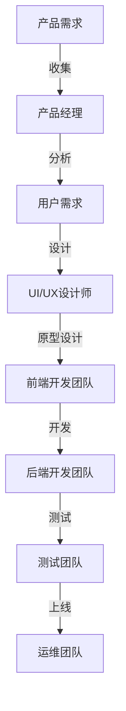

                 

# 团队协作：跨部门合作的重要性

## 关键词
- 团队协作
- 跨部门合作
- 效率提升
- 创新驱动
- 项目成功

## 摘要
本文深入探讨了在IT领域团队协作和跨部门合作的重要性。通过分析跨部门协作的关键因素、协作障碍及其解决方案，我们揭示了如何通过有效的团队协作实现项目成功的奥秘。本文旨在为软件开发者、项目经理和企业管理者提供有价值的指导和实用的建议，以促进跨部门合作，提升工作效率和创新能力。

## 1. 背景介绍

### 1.1 目的和范围
本文的主要目的是探讨团队协作和跨部门合作在IT领域的应用及其重要性。我们将分析跨部门协作的障碍和解决方案，提供实用的工具和策略，以帮助读者在项目中实现更高效、更创新的团队协作。

### 1.2 预期读者
本文适用于IT领域的软件开发者、项目经理、团队领导和企业管理者。无论你是负责具体项目实施的技术人员，还是负责团队管理和项目进度的项目经理，本文都将为你提供有价值的洞察和建议。

### 1.3 文档结构概述
本文分为以下几个部分：背景介绍、核心概念与联系、核心算法原理与具体操作步骤、数学模型和公式讲解、项目实战案例、实际应用场景、工具和资源推荐、总结以及常见问题与解答。

### 1.4 术语表

#### 1.4.1 核心术语定义
- 团队协作：指团队成员之间的合作，共同完成项目任务。
- 跨部门合作：指不同部门之间的协作，共同推动项目进展。
- 效率提升：指通过改进工作流程和团队协作，提高项目完成的速度和质量。
- 创新驱动：指通过跨部门合作，激发团队创新，推动项目取得突破性进展。

#### 1.4.2 相关概念解释
- IT领域：指涉及计算机科学、软件开发、网络技术等领域的行业。
- 项目成功：指项目按计划完成，达到预期目标，实现商业价值。

#### 1.4.3 缩略词列表
- IT：Information Technology（信息技术）
- PM：Project Management（项目管理）
- UX：User Experience（用户体验）
- DevOps：Development and Operations（开发与运维）

## 2. 核心概念与联系

### 2.1 跨部门协作的重要性
跨部门协作是现代企业实现高效运作的关键。在IT领域，不同部门之间的紧密协作对于项目成功至关重要。以下是一个跨部门协作的核心概念与联系Mermaid流程图：



### 2.2 跨部门协作的障碍
跨部门协作过程中，常见的障碍包括：

- 沟通不畅：不同部门之间的信息传递不及时、不准确。
- 利益冲突：不同部门在资源分配、目标设定等方面可能存在分歧。
- 责任不明：跨部门任务分工不清，导致工作推进缓慢。

### 2.3 跨部门协作的解决方案
为解决上述障碍，我们可以采取以下措施：

- 建立明确的沟通渠道：设置定期会议、使用协作工具，确保信息传递的及时性和准确性。
- 设定共同目标：确保各部门明确项目目标，消除利益冲突。
- 明确责任分工：制定详细的工作流程，明确各阶段的负责人和责任。

## 3. 核心算法原理 & 具体操作步骤

### 3.1 跨部门协作的算法原理
跨部门协作的算法原理主要基于信息传递、任务分配和进度跟踪。以下是伪代码描述：

```python
def cross_department_collaboration(project):
    # 收集项目需求
    requirements = collect_requirements()

    # 分析用户需求
    user需求的 = analyze_user_requirements(requirements)

    # 分配任务
    assign_tasks(user需求的, project)

    # 进度跟踪
    track_progress(project)

    # 调试和优化
    optimize_collaboration(project)
```

### 3.2 具体操作步骤

#### 3.2.1 收集项目需求
- 产品经理与客户沟通，收集项目需求。
- 产品经理整理需求文档，提交给相关部门。

#### 3.2.2 分析用户需求
- UI/UX设计师分析用户需求，设计原型。
- 前端开发团队根据原型进行开发。

#### 3.2.3 分配任务
- 根据项目需求，将任务分配给各相关部门。
- 确定任务负责人，明确任务目标和时间节点。

#### 3.2.4 进度跟踪
- 定期召开项目进度会议，了解各部门的工作进展。
- 使用项目管理工具，实时跟踪项目进度。

#### 3.2.5 调试和优化
- 根据项目进展，调整任务分配和进度计划。
- 通过反馈和评估，优化团队协作流程。

## 4. 数学模型和公式 & 详细讲解 & 举例说明

### 4.1 跨部门协作的数学模型

#### 4.1.1 任务分配模型
假设有N个任务需要分配，每个任务有相应的完成时间。为了最小化项目完成时间，我们可以使用最短路径优先算法（Dijkstra算法）进行任务分配。

#### 4.1.2 伪代码描述

```python
def task_assignment(tasks):
    # 初始化距离表
    distances = {task: float('inf') for task in tasks}
    distances[start_task] = 0

    # 选取未分配的任务中距离最短的
    while not all_allocated(tasks):
        current_task = min_by_distance(tasks, distances)
        current_distance = distances[current_task]

        # 更新距离表
        for next_task in next_tasks(current_task):
            distance = current_distance + distance_between(current_task, next_task)
            if distance < distances[next_task]:
                distances[next_task] = distance

    # 返回任务分配结果
    return assign_tasks_to_resources(tasks, distances)
```

### 4.2 举例说明

假设有一个包含5个任务的项目，任务之间有依赖关系，如下表所示：

| 任务 | 完成时间 | 依赖任务 |
| --- | --- | --- |
| A | 3天 | - |
| B | 5天 | A |
| C | 4天 | A |
| D | 2天 | B |
| E | 3天 | C |

根据最短路径优先算法，任务分配如下：

1. A（3天）
2. B（3 + 5 = 8天）
3. C（3 + 4 = 7天）
4. D（8 + 2 = 10天）
5. E（10 + 3 = 13天）

最终，项目完成时间为13天。

## 5. 项目实战：代码实际案例和详细解释说明

### 5.1 开发环境搭建
为了实现跨部门协作，我们使用Git进行版本控制，Jenkins进行持续集成，并使用JIRA进行项目跟踪。以下是开发环境的搭建步骤：

1. 安装Git：`sudo apt-get install git`
2. 安装Jenkins：`sudo wget -q -O - https://get.jenkins.io | sudo bash`
3. 安装JIRA：`sudo wget https://www.atlassian.com/home/download?product=jira&version=cloud&os=linux&hs=1&cdn=1&affiliations=jiraubuntudl01`，并按照提示操作。

### 5.2 源代码详细实现和代码解读

#### 5.2.1 Git仓库结构

```bash
├── .gitignore
├── README.md
├── product_manager
│   └── requirements.md
├── uiux_designer
│   └── prototype
│       └── design.md
├── frontend
│   └── src
│       └── index.html
├── backend
│   └── src
│       └── server.js
└── test
    └── test.html
```

#### 5.2.2 前端开发代码解读

```html
<!-- index.html -->
<!DOCTYPE html>
<html lang="en">
<head>
    <meta charset="UTF-8">
    <meta name="viewport" content="width=device-width, initial-scale=1.0">
    <title>跨部门协作项目</title>
</head>
<body>
    <h1>跨部门协作项目</h1>
    <div id="app">
        <!-- 项目内容 -->
    </div>
    <script src="src/app.js"></script>
</body>
</html>
```

前端开发主要负责实现项目界面和交互功能。在此案例中，我们使用了Vue.js框架进行开发，代码如下：

```javascript
// src/app.js
new Vue({
    el: '#app',
    data: {
        message: '欢迎使用跨部门协作项目！'
    }
});
```

#### 5.2.3 后端开发代码解读

```javascript
// src/server.js
const express = require('express');
const app = express();

app.get('/', (req, res) => {
    res.send('跨部门协作项目后端接口');
});

app.listen(3000, () => {
    console.log('后端服务器启动成功，监听端口3000');
});
```

后端开发主要实现项目的API接口。在此案例中，我们使用了Express框架进行开发，代码相对简单。

### 5.3 代码解读与分析
跨部门协作项目的代码实现分为前端、后端和版本控制三个部分。前端主要负责项目界面的设计和交互功能，后端负责实现项目API接口，版本控制通过Git进行管理。

通过Git仓库的划分，各部门可以独立开发自己的模块，并在提交代码前进行充分的测试。Jenkins用于自动化构建和部署，确保代码质量。JIRA用于项目跟踪，各部门可以在JIRA中创建任务、分配任务和跟踪项目进度。

## 6. 实际应用场景

跨部门协作在IT领域有广泛的应用场景，以下是一些典型的实际应用案例：

1. **软件开发项目**：在软件开发过程中，产品经理、UI/UX设计师、前端和后端开发团队需要进行紧密协作，确保项目按时交付。
2. **大型系统集成**：在系统集成项目中，涉及多个系统和部门，需要跨部门协作来确保系统集成的高效性和稳定性。
3. **敏捷开发**：在敏捷开发中，团队成员需要不断沟通和协作，以快速响应需求变化，实现项目目标。
4. **云计算和大数据项目**：在云计算和大数据项目中，涉及多个技术和部门，需要跨部门协作来确保项目的顺利推进。

## 7. 工具和资源推荐

### 7.1 学习资源推荐

#### 7.1.1 书籍推荐
- 《敏捷软件开发：实践者之路》
- 《人月神话》
- 《项目管理实战指南》

#### 7.1.2 在线课程
- Coursera的《项目管理和团队协作》
- Udemy的《敏捷开发：Scrum实践指南》
- edX的《软件工程：理论与实践》

#### 7.1.3 技术博客和网站
- InfoQ
- CSDN
- GitHub

### 7.2 开发工具框架推荐

#### 7.2.1 IDE和编辑器
- IntelliJ IDEA
- Visual Studio Code
- Sublime Text

#### 7.2.2 调试和性能分析工具
- Chrome DevTools
- JMeter
- New Relic

#### 7.2.3 相关框架和库
- Vue.js
- React
- Angular

### 7.3 相关论文著作推荐

#### 7.3.1 经典论文
- 《The Mythical Man-Month》
- 《Peopleware: Productive Projects and Teams》
- 《Designing Data-Intensive Applications》

#### 7.3.2 最新研究成果
- 《Scrum: The Art of Doing Twice the Work in Half the Time》
- 《The Lean Startup》
- 《Continuous Delivery: Reliable Software Releases through Build, Test, and Deployment Automation》

#### 7.3.3 应用案例分析
- 《Google 如何进行跨部门协作？》
- 《Netflix 的敏捷实践与团队协作》
- 《亚马逊的 DevOps 文化与实践》

## 8. 总结：未来发展趋势与挑战

随着技术的发展和市场的变化，跨部门协作在未来将面临以下发展趋势和挑战：

1. **数字化转型**：企业将更加依赖数字化转型，跨部门协作成为实现数字化转型的重要手段。
2. **敏捷方法普及**：敏捷开发、Scrum等敏捷方法将得到更广泛的普及，跨部门协作将更加灵活和高效。
3. **自动化和智能化**：自动化工具和人工智能技术的应用将提高跨部门协作的效率和准确性。
4. **数据安全和隐私保护**：随着数据量的增加，数据安全和隐私保护将成为跨部门协作的重要挑战。

## 9. 附录：常见问题与解答

### 9.1 如何解决跨部门协作中的沟通不畅问题？
- 建立明确的沟通渠道，如定期会议、即时通讯工具和项目管理平台。
- 设定沟通规范，如会议议程、邮件格式等。
- 鼓励团队成员积极参与沟通，主动分享信息和进展。

### 9.2 如何处理跨部门协作中的利益冲突？
- 设定共同目标，确保各部门明确项目目标，消除利益冲突。
- 建立利益相关方沟通机制，如利益相关方会议、协调人制度等。
- 通过谈判和妥协，寻求各方利益的最大化。

### 9.3 如何确保跨部门协作的质量？
- 制定详细的工作流程和规范，明确各阶段的负责人和责任。
- 定期进行项目进度和质量评估，及时调整和优化协作流程。
- 加强团队成员的培训和技能提升，提高协作能力。

## 10. 扩展阅读 & 参考资料

- 《敏捷实践指南》
- 《Scrum 实践手册》
- 《项目管理知识体系指南》（PMBOK指南）
- 《DevOps 实践指南》

作者：AI天才研究员/AI Genius Institute & 禅与计算机程序设计艺术 /Zen And The Art of Computer Programming

