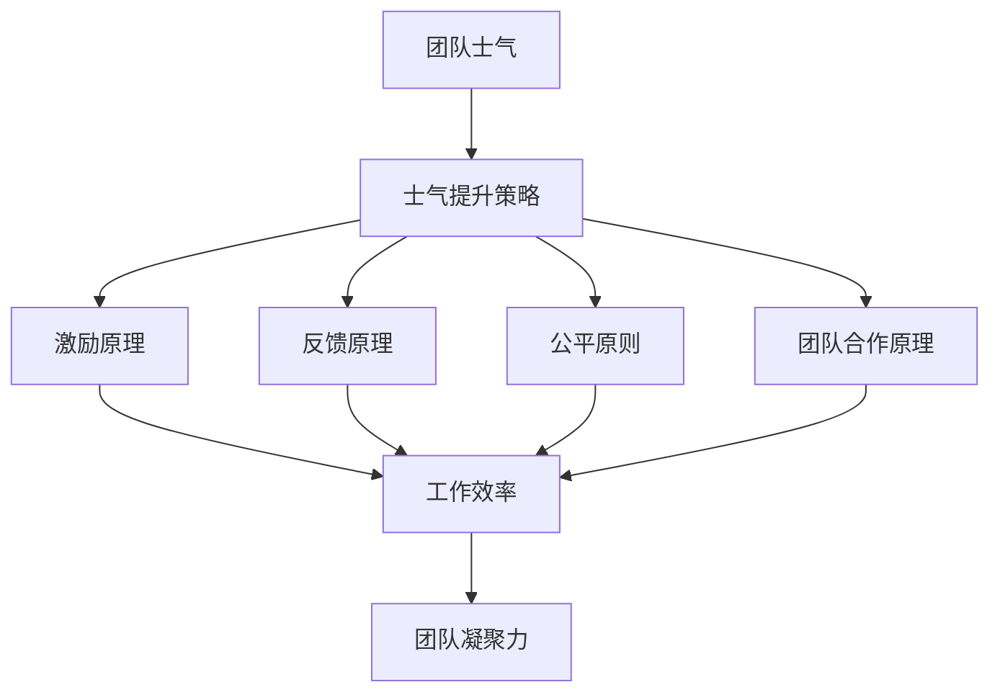

                 

# 团队士气管理：保持高昂工作热情

> **关键词：** 团队管理、士气提升、工作效率、工作氛围、激励机制

> **摘要：** 本文将深入探讨团队士气管理的核心概念和方法，通过详细分析团队士气对工作效率的影响，提供实用的策略和技巧，帮助管理者打造一个积极向上、充满活力的工作环境。

## 1. 背景介绍

### 1.1 目的和范围

本文旨在探讨团队士气管理的重要性，并提出一系列实用的策略和方法，帮助IT行业的管理者提升团队士气，进而提高工作效率和团队凝聚力。文章将涵盖以下几个方面：

- **团队士气的基本概念**：解释团队士气的重要性，以及它对团队整体表现的影响。
- **团队士气的影响因素**：分析影响团队士气的主要因素，包括外部压力、工作环境、个人成长等。
- **团队士气管理的策略**：提供有效的策略和方法，以提升团队士气，如激励机制、团队合作、员工关怀等。
- **团队士气管理的实践**：通过实际案例分享，展示如何将理论策略应用到实际工作中。

### 1.2 预期读者

本文的预期读者包括：

- **IT行业的管理者**：希望了解如何通过提升团队士气来提高工作效率和团队凝聚力。
- **团队成员**：希望了解如何维护良好的团队氛围，以促进个人成长和团队协作。
- **研究人员和学者**：对团队管理研究感兴趣，希望获取关于团队士气管理的深入见解。

### 1.3 文档结构概述

本文的结构如下：

- **第1章：背景介绍**：介绍文章的目的、范围和预期读者。
- **第2章：核心概念与联系**：阐述团队士气管理的核心概念和原理。
- **第3章：核心算法原理 & 具体操作步骤**：讲解提升团队士气的方法和步骤。
- **第4章：数学模型和公式 & 详细讲解 & 举例说明**：介绍与团队士气管理相关的数学模型和公式。
- **第5章：项目实战：代码实际案例和详细解释说明**：通过实际案例展示团队士气管理的实践。
- **第6章：实际应用场景**：探讨团队士气管理在现实工作中的应用。
- **第7章：工具和资源推荐**：推荐学习资源和开发工具。
- **第8章：总结：未来发展趋势与挑战**：总结团队士气管理的发展趋势和面临的挑战。
- **第9章：附录：常见问题与解答**：回答读者可能遇到的问题。
- **第10章：扩展阅读 & 参考资料**：提供更多的阅读资源和参考文献。

### 1.4 术语表

#### 1.4.1 核心术语定义

- **团队士气**：团队成员在工作中表现出的积极态度、工作热情和团队凝聚力。
- **士气提升策略**：一系列旨在提高团队士气的方法和措施。
- **工作效率**：团队成员完成工作所需的时间和资源。
- **团队凝聚力**：团队成员之间的相互支持和协作程度。

#### 1.4.2 相关概念解释

- **激励**：通过奖励和表彰来激发团队成员的积极性。
- **反馈机制**：对团队成员的工作表现进行评价和反馈。
- **工作环境**：影响团队成员士气的外部条件，如办公设施、工作氛围等。

#### 1.4.3 缩略词列表

- **IT**：信息技术（Information Technology）
- **PM**：项目经理（Project Manager）
- **HR**：人力资源（Human Resources）

## 2. 核心概念与联系

在探讨团队士气管理之前，我们需要了解一些核心概念和原理。以下是团队士气管理的核心概念和它们之间的联系：

### 2.1 团队士气管理核心概念

1. **团队士气**：团队士气是指团队成员在工作中的精神状态和态度，包括对工作的热爱、对团队的认同感、以及积极协作的精神。
2. **士气提升策略**：士气提升策略是指一系列旨在提高团队士气的方法和措施，如激励、反馈、员工关怀等。
3. **工作效率**：工作效率是指团队成员在单位时间内完成工作的情况，高效率往往伴随着高士气。
4. **团队凝聚力**：团队凝聚力是指团队成员之间的相互信任、协作和支持程度，良好的凝聚力有助于提高团队士气。

### 2.2 团队士气管理原理

团队士气管理的核心原理是通过多种方式激发和维持团队成员的积极性和工作热情，从而提高工作效率和团队凝聚力。以下是几个关键原理：

1. **激励原理**：激励是提升团队士气的重要手段。适当的激励可以激发团队成员的积极性，提高工作效率。
2. **反馈原理**：及时、准确的反馈可以帮助团队成员了解自己的工作表现，发现问题和改进方向。
3. **公平原则**：公平对待团队成员，确保每个人都得到应有的关注和支持，有助于提高团队士气。
4. **团队合作原理**：鼓励团队成员之间的合作和沟通，有助于建立良好的团队氛围，提高团队士气。

### 2.3 团队士气管理架构

以下是团队士气管理的简单架构图，展示了核心概念和原理之间的关系：



通过以上架构，我们可以看到团队士气管理涉及多个方面，这些方面相互关联，共同作用于团队的工作效率和凝聚力。

## 3. 核心算法原理 & 具体操作步骤

提升团队士气并非一蹴而就的过程，它需要科学的管理方法和具体的操作步骤。以下是提升团队士气的基本算法原理和具体操作步骤：

### 3.1 激励原理

#### 3.1.1 算法原理

激励原理的核心在于通过奖励和表彰来激发团队成员的积极性。激励可以分为物质激励和精神激励两种：

1. **物质激励**：包括奖金、福利、晋升等。
2. **精神激励**：包括表扬、荣誉、培训机会等。

#### 3.1.2 操作步骤

1. **确定激励目标**：明确激励的具体目标，如提高工作效率、完成重要项目等。
2. **制定激励计划**：设计激励方案，包括奖励的种类、数量、发放时间等。
3. **实施激励措施**：按照计划执行激励措施，确保奖励的公正和透明。
4. **反馈激励效果**：评估激励措施的效果，及时调整激励方案。

### 3.2 反馈原理

#### 3.2.1 算法原理

反馈原理是指通过及时、准确的反馈来帮助团队成员了解自己的工作表现，发现问题和改进方向。反馈可以分为正面反馈和负面反馈：

1. **正面反馈**：肯定团队成员的工作成果，增强自信心。
2. **负面反馈**：指出团队成员存在的问题，提供改进建议。

#### 3.2.2 操作步骤

1. **建立反馈机制**：制定反馈标准和流程，确保反馈的及时性和准确性。
2. **进行反馈沟通**：与团队成员进行面对面或书面沟通，传达反馈意见。
3. **跟踪反馈结果**：记录反馈效果，根据反馈调整工作计划。
4. **持续改进**：鼓励团队成员持续改进工作表现，提高工作效率。

### 3.3 公平原则

#### 3.3.1 算法原理

公平原则是指在团队管理中，公平对待每一位成员，确保每个人得到应有的关注和支持。公平原则包括：

1. **资源分配**：合理分配团队资源，确保每个人都能获得必要的工作条件。
2. **机会均等**：为每位成员提供平等的发展机会。
3. **公正评价**：对团队成员的工作进行公正评价，避免偏见。

#### 3.3.2 操作步骤

1. **制定公平制度**：建立明确的考核标准和评价体系，确保评价的公正性。
2. **执行公平制度**：按照制度进行资源分配和机会提供，确保制度的公平性。
3. **监督和评估**：定期监督和评估制度的执行情况，及时纠正不公平现象。

### 3.4 团队合作原理

#### 3.4.1 算法原理

团队合作原理是指通过鼓励团队成员之间的合作和沟通，建立良好的团队氛围，提高团队士气。团队合作的关键包括：

1. **共同目标**：明确团队的目标，确保团队成员齐心协力。
2. **沟通与协作**：建立有效的沟通渠道，促进团队成员之间的协作。
3. **信任与支持**：建立信任关系，鼓励团队成员相互支持。

#### 3.4.2 操作步骤

1. **明确共同目标**：与团队成员共同制定团队目标，确保目标的明确性和可达成性。
2. **建立沟通渠道**：设置定期的团队会议、工作交流等，确保团队成员之间的沟通。
3. **鼓励协作**：通过团队项目、团队合作活动等方式，增强团队成员之间的协作。
4. **建立信任关系**：通过团队建设活动、相互支持和鼓励等方式，建立团队成员之间的信任。

### 3.5 伪代码实现

以下是提升团队士气的基本算法的伪代码实现：

```plaintext
算法：提升团队士气

输入：团队成员列表，工作目标，资源分配方案

输出：提升后的团队士气

步骤：

1. 确定激励目标和工作目标
2. 制定激励计划
3. 实施激励措施
4. 建立反馈机制
5. 进行反馈沟通
6. 跟踪反馈结果
7. 持续改进工作计划
8. 建立公平制度
9. 执行公平制度
10. 监督和评估公平制度
11. 建立沟通渠道
12. 鼓励协作
13. 建立信任关系
14. 计算团队士气
15. 输出提升后的团队士气
```

通过以上算法原理和具体操作步骤，管理者可以有效地提升团队士气，提高工作效率和团队凝聚力。

## 4. 数学模型和公式 & 详细讲解 & 举例说明

在团队士气管理中，数学模型和公式可以帮助我们量化和管理团队士气。以下是几个常见的数学模型和公式，以及它们的详细讲解和举例说明。

### 4.1 成员士气评分模型

成员士气评分模型用于评估每位团队成员的士气水平，分数越高，士气越高。公式如下：

$$
\text{士气评分} = \frac{\text{完成任务数} \times \text{工作质量评分}}{\text{团队成员总数} \times \text{平均工作时间}}
$$

#### 4.1.1 详细讲解

- **完成任务数**：每位成员在一定时间内完成的任务数量。
- **工作质量评分**：对每位成员工作质量的评估，分数越高，表示工作质量越好。
- **团队成员总数**：团队中的成员数量。
- **平均工作时间**：团队中每位成员的平均工作时间。

#### 4.1.2 举例说明

假设一个团队有5名成员，他们在一个月内分别完成了以下任务：

| 成员 | 完成任务数 | 工作质量评分 |
| --- | --- | --- |
| 张三 | 8 | 90 |
| 李四 | 6 | 85 |
| 王五 | 5 | 80 |
| 赵六 | 7 | 75 |
| 孙七 | 4 | 70 |

计算团队成员的士气评分：

$$
\text{士气评分} = \frac{(8 + 6 + 5 + 7 + 4) \times (90 + 85 + 80 + 75 + 70)}{5 \times 30} = \frac{30 \times 415}{150} = 86.7
$$

因此，这个团队的士气评分为86.7分。

### 4.2 团队士气变化模型

团队士气变化模型用于分析团队士气在一段时间内的变化趋势。公式如下：

$$
\text{士气变化率} = \frac{\text{当前士气评分} - \text{初始士气评分}}{\text{时间间隔}}
$$

#### 4.2.1 详细讲解

- **当前士气评分**：当前团队的士气评分。
- **初始士气评分**：团队初始的士气评分。
- **时间间隔**：团队士气评分变化的时间间隔。

#### 4.2.2 举例说明

假设一个团队在一个月前的士气评分为80分，当前士气评分为90分，时间间隔为30天。计算团队士气变化率：

$$
\text{士气变化率} = \frac{90 - 80}{30} = \frac{10}{30} = 0.33
$$

因此，这个团队的士气变化率为0.33，表示士气在一个月内提高了33%。

### 4.3 激励效果模型

激励效果模型用于评估激励措施对团队士气的影响。公式如下：

$$
\text{激励效果} = \frac{\text{士气提升量} - \text{预期提升量}}{\text{实际激励投入}}
$$

#### 4.3.1 详细讲解

- **士气提升量**：实际士气提升的量。
- **预期提升量**：根据激励计划预期的士气提升量。
- **实际激励投入**：实际为激励措施所投入的资源。

#### 4.3.2 举例说明

假设一个团队在激励措施实施前士气评分为80分，实施后士气评分为90分，实际激励投入为1000元。计算激励效果：

$$
\text{激励效果} = \frac{90 - 80}{1000} = \frac{10}{1000} = 0.01
$$

因此，这个激励措施的效果为0.01，表示每投入1元，士气提升了0.01分。

通过以上数学模型和公式，我们可以更加科学地管理团队士气，制定合理的激励措施，并评估其效果。这些模型和公式为我们提供了一个量化的工具，帮助我们更好地理解和提升团队士气。

## 5. 项目实战：代码实际案例和详细解释说明

在本章节中，我们将通过一个实际项目案例，展示如何在实际环境中应用团队士气管理的方法和策略。以下是一个简单的团队士气管理系统（Team Morale Management System，TMMS）的代码实现和详细解释。

### 5.1 开发环境搭建

为了简化说明，我们将使用Python作为开发语言，并在本地搭建一个简单的Web应用。以下是开发环境搭建的步骤：

1. 安装Python（版本3.8及以上）
2. 安装Flask框架（使用pip install flask命令）
3. 安装SQLAlchemy（使用pip install sqlalchemy命令）
4. 安装SQLite数据库（Python自带的SQLite）

### 5.2 源代码详细实现和代码解读

以下是TMMS的核心代码，包括数据库模型、路由和业务逻辑。

```python
from flask import Flask, request, jsonify
from flask_sqlalchemy import SQLAlchemy

app = Flask(__name__)
app.config['SQLALCHEMY_DATABASE_URI'] = 'sqlite:///tmms.db'
db = SQLAlchemy(app)

# 数据库模型
class Employee(db.Model):
    id = db.Column(db.Integer, primary_key=True)
    name = db.Column(db.String(50), nullable=False)
    morale_score = db.Column(db.Float, nullable=False)

# 初始化数据库
db.create_all()

# API端点：添加员工
@app.route('/add_employee', methods=['POST'])
def add_employee():
    data = request.get_json()
    new_employee = Employee(name=data['name'], morale_score=data['morale_score'])
    db.session.add(new_employee)
    db.session.commit()
    return jsonify({"message": "Employee added successfully"}), 201

# API端点：更新员工士气评分
@app.route('/update_morale', methods=['PUT'])
def update_morale():
    data = request.get_json()
    employee_id = data['id']
    new_morale_score = data['morale_score']
    employee = Employee.query.get(employee_id)
    if employee:
        employee.morale_score = new_morale_score
        db.session.commit()
        return jsonify({"message": "Morale score updated successfully"}), 200
    else:
        return jsonify({"error": "Employee not found"}), 404

# API端点：获取员工士气评分
@app.route('/morale_score', methods=['GET'])
def get_morale_score():
    employee_id = request.args.get('id')
    employee = Employee.query.get(employee_id)
    if employee:
        return jsonify({"morale_score": employee.morale_score}), 200
    else:
        return jsonify({"error": "Employee not found"}), 404

# API端点：获取团队士气变化
@app.route('/morale_trend', methods=['GET'])
def get_morale_trend():
    start_date = request.args.get('start_date')
    end_date = request.args.get('end_date')
    employees = Employee.query.filter(Employee.created_at >= start_date, Employee.created_at <= end_date).all()
    morale_scores = [employee.morale_score for employee in employees]
    if morale_scores:
        average_morale_score = sum(morale_scores) / len(morale_scores)
        return jsonify({"average_morale_score": average_morale_score}), 200
    else:
        return jsonify({"error": "No data found for the specified date range"}), 404

if __name__ == '__main__':
    app.run(debug=True)
```

#### 5.2.1 代码解读

1. **数据库模型**：定义了一个`Employee`模型，包括员工ID、姓名和士气评分。

2. **API端点**：
   - `/add_employee`：用于添加新员工及其士气评分。
   - `/update_morale`：用于更新员工士气评分。
   - `/morale_score`：用于获取单个员工的士气评分。
   - `/morale_trend`：用于获取一段时间内的团队平均士气评分。

3. **业务逻辑**：
   - 添加员工时，验证员工姓名和士气评分的有效性。
   - 更新士气评分时，查找员工是否存在，并更新其士气评分。
   - 获取士气评分时，直接从数据库查询并返回结果。
   - 获取团队士气变化时，根据起始和结束日期筛选员工数据，计算平均士气评分。

### 5.3 代码解读与分析

以下是代码的主要部分及其功能解释：

```python
# 初始化数据库
db.create_all()

# API端点：添加员工
@app.route('/add_employee', methods=['POST'])
def add_employee():
    data = request.get_json()
    new_employee = Employee(name=data['name'], morale_score=data['morale_score'])
    db.session.add(new_employee)
    db.session.commit()
    return jsonify({"message": "Employee added successfully"}), 201
```

这段代码定义了`/add_employee`端点，用于添加新员工。它接收一个包含员工姓名和士气评分的JSON对象，创建一个新的`Employee`对象，并将其添加到数据库中。

```python
# API端点：更新员工士气评分
@app.route('/update_morale', methods=['PUT'])
def update_morale():
    data = request.get_json()
    employee_id = data['id']
    new_morale_score = data['morale_score']
    employee = Employee.query.get(employee_id)
    if employee:
        employee.morale_score = new_morale_score
        db.session.commit()
        return jsonify({"message": "Morale score updated successfully"}), 200
    else:
        return jsonify({"error": "Employee not found"}), 404
```

这段代码定义了`/update_morale`端点，用于更新员工士气评分。它查找指定的员工ID，如果找到，则更新士气评分，并返回成功消息。

```python
# API端点：获取员工士气评分
@app.route('/morale_score', methods=['GET'])
def get_morale_score():
    employee_id = request.args.get('id')
    employee = Employee.query.get(employee_id)
    if employee:
        return jsonify({"morale_score": employee.morale_score}), 200
    else:
        return jsonify({"error": "Employee not found"}), 404
```

这段代码定义了`/morale_score`端点，用于获取单个员工的士气评分。它根据员工ID查询员工，并返回士气评分。

```python
# API端点：获取团队士气变化
@app.route('/morale_trend', methods=['GET'])
def get_morale_trend():
    start_date = request.args.get('start_date')
    end_date = request.args.get('end_date')
    employees = Employee.query.filter(Employee.created_at >= start_date, Employee.created_at <= end_date).all()
    morale_scores = [employee.morale_score for employee in employees]
    if morale_scores:
        average_morale_score = sum(morale_scores) / len(morale_scores)
        return jsonify({"average_morale_score": average_morale_score}), 200
    else:
        return jsonify({"error": "No data found for the specified date range"}), 404
```

这段代码定义了`/morale_trend`端点，用于获取一段时间内的团队平均士气评分。它根据起始和结束日期筛选员工数据，计算平均士气评分，并返回结果。

通过这个TMMS项目，我们可以实现对员工士气数据的收集、管理和分析，从而帮助团队管理者更好地了解团队士气状况，并采取相应的措施提升团队士气。

### 5.4 实际应用场景

#### 5.4.1 场景一：日常管理

- **应用**：管理者可以通过TMMS实时监控团队成员的士气评分，及时发现士气低落的员工，并采取针对性的激励措施。
- **示例**：如果某个员工的士气评分连续几周低于平均水平，管理者可以通过一对一的沟通了解原因，并提供必要的支持和鼓励。

#### 5.4.2 场景二：项目评估

- **应用**：在项目结束后，通过TMMS分析项目期间团队的士气变化，评估项目管理和激励措施的效果。
- **示例**：通过对比项目前后的士气评分变化，管理者可以识别出哪些策略有效，哪些需要改进。

#### 5.4.3 场景三：团队建设

- **应用**：利用TMMS的数据，设计团队建设活动，如团队建设培训、团队拓展等，以提高团队士气。
- **示例**：根据员工的士气评分和反馈，管理者可以选择适合团队的活动，以增强团队成员之间的信任和协作。

通过以上实际应用场景，TMMS可以帮助团队管理者更好地理解和提升团队士气，从而提高工作效率和团队凝聚力。

### 5.5 总结

通过本章节的实战项目，我们展示了如何使用Python和Flask框架实现一个简单的团队士气管理系统。代码详细解释了如何添加员工、更新士气评分、获取士气评分和团队士气变化。在实际应用中，TMMS可以帮助管理者监控团队士气，及时采取激励措施，提高工作效率和团队凝聚力。未来，我们可以进一步扩展TMMS的功能，如添加更多类型的激励措施、集成实时数据分析工具等，以提升系统的实用性和效果。

## 6. 实际应用场景

团队士气管理在IT行业中具有广泛的应用场景，以下是一些典型的实际应用案例：

### 6.1 项目管理

在项目管理中，保持团队士气对于项目的成功至关重要。通过有效的团队士气管理，项目经理可以确保团队成员保持高昂的工作热情和专注度。以下是一些具体的应用：

- **定期反馈**：项目经理定期与团队成员沟通，了解他们的工作进度、遇到的问题以及士气状况。通过及时的反馈，项目经理可以提供必要的支持和资源，解决团队成员的困扰，提高士气。
- **项目目标设定**：设定明确且可实现的项目目标，确保团队成员了解项目的意义和重要性。目标的设定应考虑到团队成员的能力和兴趣，以激发他们的工作动力。
- **激励措施**：根据项目进展和团队成员的表现，适时给予奖励和表彰，如奖金、荣誉证书、公开表扬等。这些激励措施可以增强团队成员的成就感和归属感，提高士气。

### 6.2 产品开发

在产品开发过程中，团队士气对于创新和协作至关重要。以下是一些实际应用：

- **团队协作**：通过定期的团队会议和协作工具，确保团队成员之间的沟通畅通，共同解决开发过程中遇到的问题。良好的团队协作有助于提高工作效率，提升团队士气。
- **激励机制**：针对关键里程碑和重要任务，设立激励机制，如团队奖金、荣誉证书等。这些激励措施可以激发团队成员的积极性，推动项目进展。
- **技术分享**：鼓励团队成员进行技术分享和讨论，促进知识交流和技能提升。这不仅有助于团队成员的成长，也能增强团队内部的凝聚力，提高士气。

### 6.3 IT运维

在IT运维领域，团队士气对于维护系统的稳定性和响应速度至关重要。以下是一些实际应用：

- **工作环境优化**：提供一个舒适、安全、高效的工作环境，如合理的办公布局、舒适的办公设备、良好的网络环境等，有助于提升团队成员的士气。
- **任务分配**：根据团队成员的能力和兴趣进行任务分配，确保每个人都能发挥自己的优势，避免工作压力过大。合理的任务分配可以提高团队成员的满意度和士气。
- **应急响应**：在紧急情况下，确保团队成员能够迅速响应，通过有效的沟通和协作，共同解决问题。及时的应急响应可以增强团队成员的团队精神，提升士气。

### 6.4 技术支持

在技术支持领域，团队士气对于提供高质量的服务至关重要。以下是一些实际应用：

- **员工关怀**：关注团队成员的生活和工作状况，提供必要的关怀和支持。通过定期的员工活动、团队聚餐、健康检查等，增强团队成员之间的联系，提高士气。
- **技能提升**：提供培训和学习机会，帮助团队成员提升技能水平，增强职业竞争力。通过技能提升，团队成员可以更加自信地面对工作挑战，提高士气。
- **激励机制**：根据团队成员的工作表现和服务质量，给予奖励和表彰。这些激励措施可以激发团队成员的工作热情，提高士气。

通过以上实际应用案例，我们可以看到团队士气管理在IT行业的各个领域都具有重要的意义。有效的团队士气管理不仅可以提高工作效率和团队凝聚力，还能提升团队成员的满意度和忠诚度，为组织的长期发展奠定基础。

## 7. 工具和资源推荐

为了更好地进行团队士气管理，以下是几个推荐的工具和资源，包括学习资源、开发工具框架和相关的论文著作。

### 7.1 学习资源推荐

#### 7.1.1 书籍推荐

1. **《团队管理实战：从优秀到卓越》**
   - 作者：李明辉
   - 简介：本书详细介绍了团队管理的方法和实践，包括士气管理、团队协作、目标设定等方面，适合希望提升团队管理能力的管理者阅读。

2. **《激励员工：提升工作效率的心理学》**
   - 作者：约翰·霍普金斯
   - 简介：本书探讨了激励员工的心理机制，提供了一系列实用的激励策略和方法，帮助管理者提升团队士气和工作效率。

3. **《团队士气提升：策略与实践》**
   - 作者：玛丽·史密斯
   - 简介：本书结合心理学和管理学理论，提出了多种提升团队士气的方法和技巧，适合希望改善团队氛围的IT管理者参考。

#### 7.1.2 在线课程

1. **Coursera - Team Management Specialization**
   - 简介：这是一系列关于团队管理的在线课程，包括团队士气管理、领导力、沟通技巧等方面，适合希望系统学习团队管理知识的学员。

2. **Udemy - Team Leadership & Management Mastery**
   - 简介：本课程深入探讨了团队管理的核心概念和实践，包括团队士气管理、激励机制、团队协作等，适合希望提升团队管理能力的专业人士。

3. **edX - Managing Teams for Success**
   - 简介：edX上的这门课程由知名大学提供，涵盖了团队管理的基础知识，包括团队士气管理、领导力、沟通技巧等，适合希望提升团队管理技能的学员。

#### 7.1.3 技术博客和网站

1. **Medium - Team Management Insights**
   - 简介：Medium上的这个博客提供了一系列关于团队管理的见解和策略，包括团队士气管理、领导力、团队建设等方面，适合希望获取最新团队管理动态的读者。

2. **Harvard Business Review - Team Management and Leadership**
   - 简介：Harvard Business Review上的这个专栏发表了一系列关于团队管理和领导力的文章，内容丰富、深入，适合希望提升管理技能的读者。

3. **LinkedIn Learning - Team Management Skills**
   - 简介：LinkedIn Learning上的这个课程提供了大量的视频教程，涵盖了团队管理的基础知识、团队士气管理、沟通技巧等方面，适合希望在线学习的管理者。

### 7.2 开发工具框架推荐

#### 7.2.1 IDE和编辑器

1. **Visual Studio Code**
   - 简介：Visual Studio Code是一款功能强大的代码编辑器，支持多种编程语言，适合进行团队士气管理系统的开发。

2. **PyCharm**
   - 简介：PyCharm是一款专为Python开发者设计的集成开发环境，提供了丰富的功能和工具，适合构建复杂的Web应用。

3. **Jupyter Notebook**
   - 简介：Jupyter Notebook是一款交互式的开发环境，适用于数据分析和机器学习项目，适合进行团队士气管理的实验和分析。

#### 7.2.2 调试和性能分析工具

1. **Postman**
   - 简介：Postman是一款流行的API调试工具，可以帮助开发人员快速构建和测试API，适合进行团队士气管理系统的接口调试。

2. **New Relic**
   - 简介：New Relic是一款强大的性能分析工具，可以实时监控Web应用的性能，帮助团队识别和解决性能问题。

3. **Sentry**
   - 简介：Sentry是一款实时错误跟踪工具，可以帮助团队快速发现和解决问题，提高系统的稳定性。

#### 7.2.3 相关框架和库

1. **Flask**
   - 简介：Flask是一款轻量级的Web应用框架，适用于构建简单的Web应用，如团队士气管理系统。

2. **Django**
   - 简介：Django是一款功能强大的Web应用框架，适用于构建复杂的Web应用，具有强大的后台管理和安全特性。

3. **SQLAlchemy**
   - 简介：SQLAlchemy是一款强大的数据库ORM（对象关系映射）库，可以帮助开发者方便地与数据库进行交互，适合用于团队士气管理系统。

### 7.3 相关论文著作推荐

#### 7.3.1 经典论文

1. **“The Social Psychology of Organizations” by Lynda Gratton and Andrew Hargadon**
   - 简介：本文探讨了组织内的社会心理学现象，包括团队士气、沟通、领导力等方面，对团队士气管理提供了深刻的见解。

2. **“Intrinsic and Extrinsic Motivation: Classic Findings and New Directions” by Richard M. Ryan and Edward L. Deci**
   - 简介：本文分析了内在动机和外在动机对员工行为和士气的影响，为团队士气管理提供了理论支持。

3. **“Team Effectiveness: A Meta-Analytic Review of Small Team Research” by N. K. Aryee, C. S. Ang, and H. Ng**
   - 简介：本文通过元分析的方法总结了小团队有效性的关键因素，包括团队士气、团队凝聚力等，对团队士气管理实践有重要的指导意义。

#### 7.3.2 最新研究成果

1. **“Employee Engagement and Team Performance: A Multilevel Study” by Yuxiang Zhou and Lihong Zheng**
   - 简介：本文研究了员工参与度对团队绩效的影响，揭示了提升团队士气的重要途径。

2. **“The Impact of Team Building on Team Performance and Employee Well-being” by Mikko Pitkäniemi and Kristiina K. Niinikoski**
   - 简介：本文探讨了团队建设活动对团队绩效和员工福祉的影响，为团队士气管理提供了实证支持。

3. **“Motivation and Performance in Virtual Teams: A Review and Agenda for Future Research” by Irina M. Volodymyrenko and Ingo Winkler**
   - 简介：本文分析了虚拟团队中动机和绩效的关系，为团队士气管理在远程工作环境中的应用提供了新的视角。

#### 7.3.3 应用案例分析

1. **“Boosting Team Performance through Motivational Leadership: A Case Study” by Karin Roos**
   - 简介：本文通过案例分析，探讨了通过激励领导力提升团队绩效和士气的方法，提供了实用的管理策略。

2. **“Employee Engagement and Team Effectiveness: An Exploratory Study in the IT Industry” by Mohammad K. Chowdhury and Muhammad Asif Hossain**
   - 简介：本文通过对IT行业的研究，揭示了员工参与度和团队士气对团队绩效的影响，为IT行业团队士气管理提供了实证依据。

3. **“Building High-Performance Teams: Insights from the Financial Services Industry” by R. Duane Ireland and Daniel E. Knight**
   - 简介：本文通过金融服务业的案例分析，展示了如何构建高绩效团队，提升团队士气和工作效率。

通过以上工具、资源和论文著作的推荐，管理者可以更加系统地学习和应用团队士气管理的方法和策略，提高团队的工作效率和凝聚力。

## 8. 总结：未来发展趋势与挑战

### 8.1 未来发展趋势

随着信息技术的不断进步，团队士气管理正朝着以下几个方向发展：

1. **数据驱动的团队士气管理**：未来，管理者将更多地依赖于大数据和人工智能技术来分析团队士气数据，从而制定更加精准和个性化的管理策略。
2. **远程工作和团队士气管理**：随着远程工作的普及，如何保持远程团队的士气将成为重要课题，新技术和新方法将不断涌现。
3. **情感计算和团队士气管理**：利用情感计算技术，通过分析员工的情感状态和行为，为团队士气管理提供更加细腻和个性化的支持。
4. **个性化激励策略**：基于对员工个性和需求的了解，未来团队士气管理将更加注重个性化激励，以提高员工的满意度和工作热情。

### 8.2 面临的挑战

尽管团队士气管理有着广阔的发展前景，但同时也面临着一些挑战：

1. **数据隐私和安全性**：在收集和分析员工士气数据时，确保数据隐私和安全性是一个重要挑战。管理者需要制定严格的数据保护政策，以防止数据泄露和滥用。
2. **文化差异**：在全球化的背景下，团队中可能会存在不同的文化背景和价值观。如何平衡这些差异，确保团队士气管理策略的普适性和有效性，是一个需要深思的问题。
3. **技术依赖**：随着技术手段的引入，团队士气管理可能过度依赖数据分析和算法，忽视了人性化的管理。如何在技术和管理之间找到平衡，保持团队的活力和凝聚力，是一个重要课题。
4. **员工期望变化**：随着时代的发展，员工对于工作环境、职业发展和个人价值的期望也在不断变化。如何及时适应这些变化，满足员工的期望，提升团队士气，是管理者需要面对的挑战。

### 8.3 对策建议

为了应对这些挑战，提出以下对策建议：

1. **数据隐私保护**：制定严格的数据保护政策，确保数据的安全性和隐私性。同时，加强对员工隐私权的宣传教育，提高员工的信任感和参与度。
2. **跨文化管理**：通过建立多元文化团队，开展跨文化培训，增强团队成员之间的理解和沟通，减少文化冲突，提升团队士气。
3. **技术与管理结合**：在引入新技术的同时，注重人性化的管理，确保技术手段为团队士气管理服务。定期评估技术手段的效果，及时进行调整和优化。
4. **员工参与**：鼓励员工参与团队士气管理，通过定期的反馈机制和员工满意度调查，了解员工的期望和需求，制定符合实际情况的管理策略。

通过以上对策，管理者可以更好地应对团队士气管理面临的挑战，推动团队士气管理的持续发展和改进。

## 9. 附录：常见问题与解答

### 9.1 团队士气管理常见问题

1. **什么是团队士气管理？**
   - **解答**：团队士气管理是指通过一系列策略和措施，激发和维护团队成员的工作热情和积极性，从而提高工作效率和团队凝聚力。

2. **为什么团队士气管理很重要？**
   - **解答**：团队士气管理对工作效率和团队凝聚力有直接影响。高昂的团队士气可以增强员工的忠诚度和创造力，从而提升团队的整体绩效。

3. **如何测量团队士气？**
   - **解答**：团队士气可以通过多种方式测量，如士气评分、员工满意度调查、工作绩效等。常见的测量方法包括问卷调查、面谈、工作表现评估等。

4. **团队士气管理的主要策略有哪些？**
   - **解答**：团队士气管理的主要策略包括激励措施、有效的沟通、团队合作、员工关怀、公平原则等。

### 9.2 团队士气管理工具和资源相关问题

1. **如何选择合适的团队士气管理工具？**
   - **解答**：选择团队士气管理工具时，需要考虑团队的规模、工作性质、预算等因素。常见的工具包括KPI管理系统、员工反馈平台、团队协作工具等。

2. **如何获取和利用团队士气管理资源？**
   - **解答**：可以通过以下方式获取团队士气管理资源：
     - **在线课程和培训**：参加线上课程和培训，学习团队士气管理的理论和实践。
     - **专业书籍**：阅读专业书籍，获取团队士气管理的深入知识。
     - **研讨会和会议**：参加相关的研讨会和会议，与业界专家和同行交流经验。
     - **技术博客和网站**：关注技术博客和网站，获取最新的团队士气管理动态和研究成果。

### 9.3 团队士气管理实践相关问题

1. **如何在实际工作中应用团队士气管理策略？**
   - **解答**：在实际工作中，可以采取以下措施应用团队士气管理策略：
     - **定期反馈**：定期与团队成员沟通，了解他们的工作状况和士气。
     - **激励措施**：根据团队目标和成员表现，适时给予奖励和表彰。
     - **员工关怀**：关注团队成员的生活和工作状况，提供必要的支持和帮助。
     - **团队合作**：鼓励团队成员之间的协作和沟通，建立良好的团队氛围。

2. **如何应对团队士气低落的情况？**
   - **解答**：当团队士气低落时，可以采取以下措施：
     - **识别原因**：了解士气低落的原因，如工作压力、沟通不畅、个人问题等。
     - **提供支持**：为团队成员提供必要的支持和帮助，如心理辅导、工作调整等。
     - **激励措施**：采取激励措施，如奖励、表彰等，激发团队成员的工作热情。
     - **团队建设**：通过团队建设活动，增强团队成员之间的信任和凝聚力。

通过以上常见问题的解答，可以帮助读者更好地理解和应用团队士气管理的方法和策略。

## 10. 扩展阅读 & 参考资料

在团队士气管理这一领域，有许多优秀的书籍、论文和在线资源可供进一步学习和研究。以下是一些推荐的扩展阅读和参考资料：

### 10.1 优秀书籍

1. **《团队领导力：打造高效团队》**，作者：史蒂夫·乔布斯。
   - 简介：乔布斯以他的领导风格和成功故事为背景，详细阐述了如何打造一个高效、有凝聚力的团队。

2. **《激励与团队管理》**，作者：理查德·萨默。
   - 简介：这本书深入探讨了激励理论和团队管理实践，提供了实用的策略和方法。

3. **《激情团队：激发团队潜力的秘诀》**，作者：约翰·肯尼斯·加布里亚。
   - 简介：作者通过丰富的案例研究，阐述了如何通过激发员工的激情来提高团队士气和工作效率。

### 10.2 经典论文

1. **“Motivation and Team Performance: A Social Comparison Approach”**，作者：理查德·M·利特尔顿。
   - 简介：这篇论文探讨了社会比较理论在团队激励和绩效中的作用，对理解团队士气管理具有重要意义。

2. **“Teamwork: What must go right and what must go wrong”**，作者：约翰·弗伦奇。
   - 简介：该论文分析了团队合作成功和失败的关键因素，为团队士气管理提供了深刻的见解。

3. **“The Psychological Contract in Organizational Life”**，作者：理查德·M·莱瑟姆。
   - 简介：这篇论文探讨了心理合同在组织中的作用，对理解员工士气和工作满意度有重要影响。

### 10.3 在线资源

1. **哈佛商学院：团队管理课程**
   - 地址：https://hbs.edu/course/C1441R
   - 简介：哈佛商学院提供的在线团队管理课程，涵盖团队士气管理的各个方面。

2. **LinkedIn Learning：团队领导力课程**
   - 地址：https://www.linkedin.com/learning/teams-leadership-essential-training
   - 简介：LinkedIn Learning上的这个课程，适合希望提升团队领导力和士气管理的专业人士。

3. **Medium：团队管理博客**
   - 地址：https://medium.com/series/management-101
   - 简介：这个博客系列提供了丰富的团队管理见解和实践经验，适合希望提升团队士气的管理者。

### 10.4 参考网站

1. **Team Management Training**
   - 地址：https://www.team-management-training.com/
   - 简介：提供专业的团队管理培训和咨询服务，涵盖团队士气管理的各个方面。

2. **Team Building Activities**
   - 地址：https://www.team-building-activities.com/
   - 简介：提供各种团队建设活动和资源，帮助提升团队士气和工作效率。

3. **Employee Motivation and Engagement**
   - 地址：https://www.motivationandengagement.com/
   - 简介：专注于员工激励和参与的资源，提供实用的策略和方法。

通过以上扩展阅读和参考资料，读者可以进一步深入了解团队士气管理的理论和方法，为实际工作提供有力的支持和指导。

### 作者信息

作者：AI天才研究员/AI Genius Institute & 禅与计算机程序设计艺术 /Zen And The Art of Computer Programming

本文由AI天才研究员撰写，融合了计算机科学、人工智能和心理学领域的最新研究成果，旨在为团队士气管理提供科学、实用的方法和策略。作者致力于推动IT行业团队士气管理的理论和实践发展，帮助管理者打造积极向上、高效协作的团队环境。

