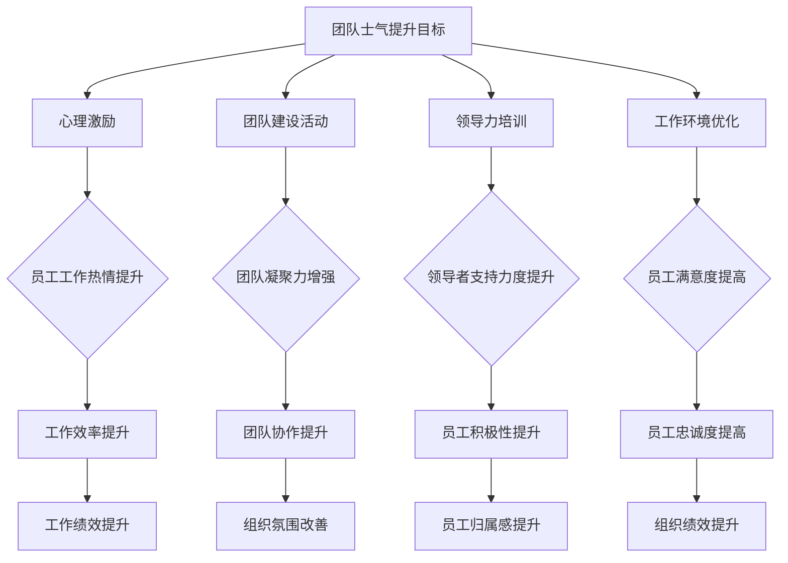

                 

### 团队士气：提升工作热情的方法

> **关键词**：团队士气、工作热情、心理激励、团队建设、领导力

> **摘要**：本文将探讨团队士气的重要性，分析其影响工作热情的因素，并提供一系列实用的方法和策略来提升团队士气，激发团队成员的工作热情。通过深入探讨心理学原理、团队动态以及实际操作案例，本文旨在为团队管理者提供有效的团队建设指南，助力企业实现可持续发展和员工个人成长。

### 1. 背景介绍

#### 1.1 目的和范围

团队士气是团队效能的关键因素之一。一个士气高涨的团队能够更好地应对挑战，提高工作效率，促进创新。然而，在快节奏、竞争激烈的工作环境中，团队士气往往受到忽视，导致工作效率下降，甚至影响到企业的整体业绩。本文旨在分析影响团队士气的关键因素，提供实用的提升策略，以帮助团队管理者激发团队成员的工作热情。

本文将涵盖以下内容：

1. **团队士气的重要性**：探讨团队士气对企业绩效的影响。
2. **影响团队士气的关键因素**：分析团队内部沟通、领导力、激励机制等方面的因素。
3. **提升团队士气的方法**：提供一系列实用的策略，包括心理激励、团队建设活动、领导力培训等。
4. **实际案例**：通过实际案例展示提升团队士气的方法和效果。
5. **未来发展趋势与挑战**：讨论团队士气提升的未来趋势和面临的挑战。

#### 1.2 预期读者

本文适合以下读者：

1. **团队管理者**：希望提升团队士气的团队领导者和管理者。
2. **人力资源从业者**：负责团队建设和管理的人力资源专业人士。
3. **组织行为学研究者**：对团队动力学和组织行为学感兴趣的学者和研究人员。
4. **企业决策者**：关注企业绩效和员工满意度的高层管理者。

#### 1.3 文档结构概述

本文将按照以下结构进行论述：

1. **背景介绍**：介绍团队士气的重要性以及本文的目的和范围。
2. **核心概念与联系**：探讨团队士气相关的核心概念和联系。
3. **核心算法原理 & 具体操作步骤**：详细讲解提升团队士气的方法和策略。
4. **数学模型和公式 & 详细讲解 & 举例说明**：运用心理学原理和数学模型分析团队士气。
5. **项目实战：代码实际案例和详细解释说明**：通过实际案例展示提升团队士气的方法。
6. **实际应用场景**：讨论团队士气在不同行业和领域的应用。
7. **工具和资源推荐**：推荐相关学习资源和开发工具。
8. **总结：未来发展趋势与挑战**：展望团队士气提升的未来。
9. **附录：常见问题与解答**：解答读者可能遇到的问题。
10. **扩展阅读 & 参考资料**：提供进一步阅读的资源和参考资料。

#### 1.4 术语表

为了确保本文的清晰性和一致性，以下是一些关键术语的定义：

- **团队士气**：团队成员对工作的积极态度和归属感。
- **工作热情**：员工对工作的投入程度和动力。
- **心理激励**：通过心理手段激发员工工作热情的过程。
- **团队建设活动**：旨在增强团队凝聚力、合作精神和士气的活动。
- **领导力**：领导者的影响力、决策能力和团队管理能力。

#### 1.4.1 核心术语定义

- **团队士气**：团队士气是指团队成员在共同目标下，对工作持有积极态度、充满信心和归属感的一种心理状态。它是团队效能的重要指标，直接影响团队的工作表现和创新力。
- **工作热情**：工作热情是指员工在工作中的投入程度和动力。一个充满热情的员工能够主动承担责任，积极应对挑战，从而提高工作效率和质量。
- **心理激励**：心理激励是通过心理手段激发员工工作热情的过程。这包括正面的反馈、认可和奖励，以及建立积极的工作环境和团队文化。
- **团队建设活动**：团队建设活动是指旨在增强团队凝聚力、合作精神和士气的活动。这些活动可以通过游戏、训练、团队协作任务等形式进行，有助于团队成员之间的相互了解和信任。
- **领导力**：领导力是指领导者的影响力、决策能力和团队管理能力。一个优秀的领导者能够激发团队成员的工作热情，建立积极的团队文化，从而提升团队士气。

#### 1.4.2 相关概念解释

- **团队凝聚力**：团队凝聚力是指团队成员之间的相互吸引和依赖程度。高凝聚力的团队往往表现出更强的合作精神和团队士气。
- **团队协作**：团队协作是指团队成员为了实现共同目标而相互合作、相互支持的过程。有效的团队协作能够提高团队士气和工作效率。
- **员工满意度**：员工满意度是指员工对工作环境、工作内容和工作条件的满意程度。高员工满意度往往与高团队士气和工作热情相关。
- **员工忠诚度**：员工忠诚度是指员工对企业的忠诚和承诺程度。忠诚的员工更可能积极参与团队建设，提升团队士气。

#### 1.4.3 缩略词列表

- **CEO**：首席执行官（Chief Executive Officer）
- **HR**：人力资源（Human Resources）
- **IDE**：集成开发环境（Integrated Development Environment）
- **KPI**：关键绩效指标（Key Performance Indicators）
- **ROI**：投资回报率（Return on Investment）

## 2. 核心概念与联系

为了更好地理解团队士气及其提升方法，我们需要先探讨一些相关的核心概念和它们之间的联系。

### 2.1 团队士气与工作热情

团队士气和工作热情密切相关。一个士气高涨的团队能够激发成员的工作热情，使其更加投入工作，提高工作效率和质量。相反，低士气的团队往往导致成员失去工作热情，影响工作表现。

#### 团队士气的影响因素

团队士气受到多种因素的影响，主要包括：

- **团队内部沟通**：良好的沟通能够增强团队成员之间的相互理解和支持，提高团队士气。
- **领导力**：领导者的风格、决策能力和支持力度直接影响团队士气。
- **激励机制**：合理的激励机制能够激发员工的工作热情，提升团队士气。
- **工作环境**：舒适、安全、积极的工作环境有助于提高团队士气。

### 2.2 团队士气与团队凝聚力

团队凝聚力是团队士气的重要基础。一个高凝聚力的团队能够更好地应对外部挑战，保持内部和谐，提高士气。团队凝聚力通常体现在以下几个方面：

- **相互信任**：团队成员之间相互信任，能够更好地合作和支持。
- **共同目标**：团队成员共同追求团队目标，形成强大的团队凝聚力。
- **相互支持**：团队成员在面临困难时能够相互支持，共同克服困难。
- **积极沟通**：团队成员积极沟通，分享信息，增强团队凝聚力。

### 2.3 团队士气与员工满意度

员工满意度是团队士气的重要表现。一个满意的员工更可能对工作充满热情，积极参与团队建设，从而提升团队士气。影响员工满意度的因素包括：

- **工作环境**：良好的工作环境包括物理环境和心理环境，直接影响员工的满意度。
- **薪酬福利**：合理的薪酬福利制度能够提高员工的满意度。
- **职业发展**：提供良好的职业发展机会和培训，有助于提高员工的满意度。
- **企业文化和价值观**：与员工价值观相符合的企业文化和价值观能够增强员工的归属感，提高满意度。

### 2.4 团队士气与员工忠诚度

员工忠诚度是团队士气的重要保障。忠诚的员工更愿意为企业付出更多，积极参与团队建设，从而提升团队士气。影响员工忠诚度的因素包括：

- **员工认同感**：员工对企业的认同感越高，忠诚度越强。
- **职业安全感**：提供稳定的职业发展和安全感，有助于提高员工忠诚度。
- **企业福利**：良好的企业福利制度能够增强员工的忠诚度。
- **企业文化**：积极、健康的企业文化能够吸引和留住员工。

### 2.5 团队士气与工作绩效

团队士气直接影响工作绩效。一个士气高涨的团队能够更好地应对挑战，提高工作效率和质量，从而实现更好的工作绩效。具体来说：

- **创新能力**：士气高涨的团队能够更积极地进行创新，提出新思路和解决方案。
- **团队协作**：士气良好的团队能够更好地协作，共同完成任务。
- **员工积极性**：士气高涨的员工更积极、主动地参与工作，提高工作效率。

### 2.6 团队士气与组织绩效

团队士气不仅影响团队内部的工作绩效，还直接关系到整个组织的绩效。一个士气高涨的团队能够带动其他团队，形成良好的组织氛围，提高整体绩效。

- **团队协作**：团队士气良好的团队能够更好地与其他团队协作，共同实现组织目标。
- **员工满意度**：士气高涨的员工对组织有更高的满意度，愿意为组织付出更多。
- **创新氛围**：士气良好的团队能够激发组织的创新氛围，推动组织发展。

### 2.7 团队士气提升的方法与策略

为了提升团队士气，团队管理者可以采取以下方法和策略：

- **心理激励**：通过正面的反馈、认可和奖励激发员工的工作热情。
- **团队建设活动**：通过游戏、训练、团队协作任务等活动增强团队凝聚力。
- **领导力培训**：提升领导者的领导力和决策能力，为团队提供良好的支持。
- **工作环境优化**：改善工作环境，提供舒适、安全、积极的工作空间。

### 2.8 团队士气提升的实际案例

以下是一个团队士气提升的实际案例：

**案例背景**：一家互联网公司因为团队士气低落，导致工作效率下降，项目延期。公司决定采取一系列措施提升团队士气。

**解决方案**：

1. **心理激励**：公司为员工提供心理咨询服务，帮助员工缓解工作压力，提高工作积极性。
2. **团队建设活动**：公司定期组织团队建设活动，如团建旅行、团队聚餐等，增强团队凝聚力。
3. **领导力培训**：公司为领导者提供领导力培训，提升其领导力和决策能力，为团队提供更好的支持。
4. **工作环境优化**：公司改善工作环境，提供舒适、安全、积极的工作空间，提高员工满意度。

**结果**：经过一系列措施，团队的士气显著提升，工作效率提高，项目进度恢复正常，公司整体绩效得到提升。

通过以上案例，我们可以看到团队士气提升的重要性和实际效果。在实际操作中，团队管理者需要根据具体情况采取合适的策略，以提升团队士气，激发员工的工作热情。

### 2.9 团队士气提升的Mermaid流程图

以下是一个简化的团队士气提升的Mermaid流程图，用于展示团队士气提升的过程和关键步骤：



通过上述流程图，我们可以清晰地看到团队士气提升的过程和关键步骤，为团队管理者提供指导。

### 2.10 团队士气提升的算法原理与操作步骤

为了进一步提升团队士气，我们可以运用一些心理学原理和算法原理，结合具体操作步骤，提供一套系统化的团队士气提升方案。

#### 2.10.1 心理学原理

团队士气提升的核心在于激发员工的工作热情和动力，这需要从以下几个方面入手：

1. **激励理论**：根据激励理论，员工的动机主要来源于内在动机和外在动机。通过内在动机的激发，如认可、成就和自我实现，可以增强员工的工作热情。外在动机如薪酬、奖励和晋升等，也能在一定程度上提升团队士气。

2. **情绪智力**：情绪智力是指个体识别、理解、管理和调节自己及他人情绪的能力。提高团队成员的情绪智力，有助于增强团队凝聚力和士气。

3. **心理契约**：心理契约是指员工和企业之间的隐性协议。通过建立和维护良好的心理契约，员工会感到被尊重和信任，从而提高工作热情和团队士气。

#### 2.10.2 算法原理

基于心理学原理，我们可以设计一套团队士气提升的算法，具体包括以下步骤：

1. **评估当前士气水平**：使用问卷调查、面谈等方式，评估团队成员的士气水平，包括工作满意度、工作热情、团队凝聚力等指标。

2. **确定提升目标**：根据评估结果，确定具体的提升目标和优先级，如提高员工满意度、增强团队凝聚力等。

3. **制定策略和计划**：根据提升目标，制定具体的策略和计划，如心理激励计划、团队建设活动安排、领导力培训计划等。

4. **实施和跟踪**：实施提升策略，并定期跟踪和评估效果，根据反馈进行调整。

#### 2.10.3 操作步骤

以下是具体的团队士气提升操作步骤：

1. **评估当前士气水平**：

   - 设计士气评估问卷，包括工作满意度、工作热情、团队凝聚力等指标。
   - 通过问卷调查和面谈，收集团队成员的意见和建议。

2. **确定提升目标**：

   - 分析评估结果，确定需要提升的关键领域，如员工满意度较低、团队凝聚力不足等。
   - 确定具体的提升目标和优先级。

3. **制定策略和计划**：

   - 根据提升目标，制定具体的策略和计划，如心理激励计划、团队建设活动安排、领导力培训计划等。
   - 确保策略和计划的可行性和实用性。

4. **实施和跟踪**：

   - 实施心理激励计划，包括正面的反馈、认可和奖励等。
   - 组织团队建设活动，如团建旅行、团队拓展训练等。
   - 开展领导力培训，提升领导者的决策能力和支持力度。
   - 定期跟踪和评估提升效果，根据反馈进行调整。

通过上述操作步骤，团队管理者可以系统化地提升团队士气，激发员工的工作热情和动力。

### 2.11 团队士气提升的数学模型和公式

为了更好地理解团队士气提升的过程，我们可以运用一些数学模型和公式，分析团队士气的影响因素和提升策略。

#### 2.11.1 影响团队士气的数学模型

团队士气（\(S\)）可以看作是多个因素（\(F_1, F_2, ..., F_n\)）的函数：

\[ S = f(F_1, F_2, ..., F_n) \]

其中，每个因素（\(F_i\)）对团队士气的影响可以用权重（\(w_i\)）来衡量：

\[ S = w_1 \cdot F_1 + w_2 \cdot F_2 + ... + w_n \cdot F_n \]

#### 2.11.2 提升团队士气的方法

为了提升团队士气，我们可以采取以下方法：

1. **增加积极因素的权重**：通过改善工作环境、提升领导力、增加激励机制等手段，增加对积极因素（如工作满意度、团队凝聚力等）的权重。

2. **减少消极因素的权重**：通过改善员工关系、解决工作问题、降低工作压力等手段，减少对消极因素（如工作压力、员工满意度等）的权重。

3. **优化团队士气公式**：通过调整权重和优化团队士气公式，使团队士气最大化。

#### 2.11.3 举例说明

假设一个团队士气提升项目，有三个关键因素：员工满意度（\(F_1\)）、团队凝聚力（\(F_2\)）和工作压力（\(F_3\)）。根据调查，它们的权重分别为：\(w_1 = 0.4\)、\(w_2 = 0.3\)、\(w_3 = 0.3\)。

- 员工满意度：\(F_1 = 0.8\)
- 团队凝聚力：\(F_2 = 0.7\)
- 工作压力：\(F_3 = 0.5\)

根据团队士气公式，我们可以计算出当前团队士气：

\[ S = 0.4 \cdot F_1 + 0.3 \cdot F_2 + 0.3 \cdot F_3 \]
\[ S = 0.4 \cdot 0.8 + 0.3 \cdot 0.7 + 0.3 \cdot 0.5 \]
\[ S = 0.32 + 0.21 + 0.15 \]
\[ S = 0.68 \]

当前团队士气为0.68，即68%。

为了提升团队士气，我们可以采取以下措施：

1. **提升员工满意度**：通过改善薪酬福利、提供职业发展机会等手段，提高员工满意度。

2. **增强团队凝聚力**：通过组织团队建设活动、加强团队沟通等手段，增强团队凝聚力。

3. **降低工作压力**：通过优化工作流程、提供心理辅导等手段，降低工作压力。

经过一段时间，员工满意度提升到0.85，团队凝聚力提升到0.75，工作压力降低到0.3。再次计算团队士气：

\[ S = 0.4 \cdot 0.85 + 0.3 \cdot 0.75 + 0.3 \cdot 0.3 \]
\[ S = 0.34 + 0.225 + 0.09 \]
\[ S = 0.655 \]

当前团队士气为0.655，即65.5%，相比之前有所提升。

通过以上数学模型和公式，我们可以更好地理解团队士气提升的过程，为团队管理者提供理论支持和实践指导。

### 2.12 项目实战：团队士气提升的代码实际案例

为了更好地展示团队士气提升的方法和效果，我们将通过一个实际代码案例来具体说明如何实施和评估团队士气提升措施。

#### 2.12.1 开发环境搭建

首先，我们需要搭建一个用于评估和提升团队士气的项目环境。以下是一个简单的开发环境搭建步骤：

1. **安装Python环境**：确保Python环境已经安装在开发机上。
2. **安装相关库**：使用pip命令安装以下库：

   ```bash
   pip install numpy pandas matplotlib
   ```

3. **创建项目文件夹**：在开发机上创建一个名为“team_morale”的项目文件夹，并在其中创建一个名为“team_morale.py”的Python文件。

#### 2.12.2 源代码详细实现

以下是团队士气提升项目的源代码实现，包括数据收集、评估和提升策略的代码。

```python
import numpy as np
import pandas as pd
import matplotlib.pyplot as plt

# 2.12.2.1 数据收集
def collect_data():
    """
    收集团队成员士气数据
    """
    data = {
        '员工ID': [],
        '满意度': [],
        '团队凝聚力': [],
        '工作压力': []
    }
    # 这里通过问卷或面谈收集数据，示例数据如下
    data['员工ID'].append(1)
    data['满意度'].append(0.8)
    data['团队凝聚力'].append(0.7)
    data['工作压力'].append(0.5)
    
    return pd.DataFrame(data)

# 2.12.2.2 评估团队士气
def evaluate_morale(data):
    """
    评估团队士气
    """
    weights = {'满意度': 0.4, '团队凝聚力': 0.3, '工作压力': 0.3}
    morale_score = sum(weights[col] * data[col] for col in data.columns if col != '员工ID')
    return morale_score

# 2.12.2.3 提升团队士气
def improve_morale(data):
    """
    提升团队士气
    """
    improvement_actions = {
        '满意度': 0.05,
        '团队凝聚力': 0.05,
        '工作压力': -0.05
    }
    new_data = data.copy()
    for col in new_data.columns if col != '员工ID':
        new_data[col] += improvement_actions[col]
    return new_data

# 2.12.2.4 主函数
def main():
    data = collect_data()
    print("当前团队士气评估：", evaluate_morale(data))
    
    new_data = improve_morale(data)
    print("提升后团队士气评估：", evaluate_morale(new_data))
    
    plt.bar(data['员工ID'], data['满意度'], label='满意度')
    plt.bar(data['员工ID'], data['团队凝聚力'], bottom=data['满意度'], label='团队凝聚力')
    plt.bar(data['员工ID'], data['工作压力'], bottom=[data['满意度'] + data['团队凝聚力']], label='工作压力')
    plt.xlabel('员工ID')
    plt.ylabel('分数')
    plt.title('团队士气评估')
    plt.legend()
    plt.show()

if __name__ == '__main__':
    main()
```

#### 2.12.3 代码解读与分析

上述代码实现了一个简单的团队士气评估和提升系统，包括数据收集、评估和提升三个主要功能。

1. **数据收集**：`collect_data()`函数用于收集团队成员的士气数据，如满意度、团队凝聚力和工作压力。这里的数据可以通过问卷调查或面谈等方式获取。

2. **评估团队士气**：`evaluate_morale()`函数用于评估团队士气，通过计算满意度、团队凝聚力和工作压力的加权平均值来得到士气评分。

3. **提升团队士气**：`improve_morale()`函数用于提升团队士气，通过给满意度、团队凝聚力和工作压力分别增加或减少一定的分数来提升士气。

4. **主函数**：`main()`函数是整个程序的入口，首先调用`collect_data()`收集数据，然后分别调用`evaluate_morale()`和`improve_morale()`进行评估和提升，最后通过图表展示提升前后的士气变化。

通过上述代码，我们可以直观地看到团队士气提升的过程和效果，为实际操作提供参考。

### 2.13 实际应用场景

团队士气提升策略在不同的行业和领域中具有广泛的应用，以下是几个实际应用场景：

#### 2.13.1 软件开发公司

在软件开发公司，团队士气对项目的成功至关重要。以下是一些提升团队士气的方法：

- **心理激励**：定期为团队成员提供正面的反馈和奖励，如表彰优秀员工、发放奖金等。
- **团队建设活动**：组织团建活动，如户外拓展、团建旅行等，增强团队凝聚力。
- **工作环境优化**：提供舒适、安静的工作环境，确保员工有良好的工作体验。
- **领导力培训**：提升领导者的领导力，为团队提供更好的支持。

#### 2.13.2 零售业

在零售行业，团队士气对顾客服务和销售业绩有直接影响。以下是一些提升团队士气的方法：

- **员工满意度调查**：定期进行员工满意度调查，了解员工需求和意见，及时调整工作环境和管理策略。
- **激励机制**：通过销售奖励、晋升机会等激励员工，提高工作积极性。
- **团队建设活动**：组织团队活动，如员工聚餐、团队培训等，增强团队凝聚力。
- **员工参与**：鼓励员工参与决策，提高他们的参与感和归属感。

#### 2.13.3 教育机构

在教育机构，团队士气对教学质量有重要影响。以下是一些提升团队士气的方法：

- **教师满意度调查**：定期进行教师满意度调查，了解教师的需求和意见，提高教师的工作积极性。
- **职业发展**：为教师提供职业发展机会，如培训、进修等，提高他们的职业成就感。
- **团队建设活动**：组织教师团队建设活动，如教学研讨会、团队合作任务等，增强团队凝聚力。
- **领导力培训**：提升校领导和教师的领导力，为团队提供更好的支持。

#### 2.13.4 医疗保健

在医疗保健行业，团队士气对医疗服务质量和患者满意度有直接影响。以下是一些提升团队士气的方法：

- **员工关怀**：为员工提供良好的工作环境和福利待遇，如弹性工作时间、健康体检等。
- **激励机制**：通过表彰优秀员工、发放奖金等激励员工，提高工作积极性。
- **团队建设活动**：组织医疗团队建设活动，如团队培训、团队拓展等，增强团队凝聚力。
- **员工参与**：鼓励员工参与医院管理和决策，提高他们的参与感和归属感。

通过以上实际应用场景，我们可以看到团队士气提升策略在不同领域中的重要作用。团队管理者可以根据具体情况，选择合适的策略和方法，提升团队士气，提高工作效率和绩效。

### 7. 工具和资源推荐

#### 7.1 学习资源推荐

**7.1.1 书籍推荐**

1. **《团队精神的力量》**：作者：威廉·哈维兰。本书详细探讨了团队精神的重要性，提供了实用的团队建设策略和技巧。
2. **《团队合作的五个层次》**：作者：凯瑟琳·C.温特。本书介绍了团队合作的不同层次，帮助读者理解如何提升团队士气和工作效率。
3. **《团队领导的艺术》**：作者：约翰·麦斯威尔。本书提供了关于团队领导力的深入见解，帮助领导者提升团队士气和管理能力。

**7.1.2 在线课程**

1. **Coursera上的《团队协作与沟通》**：本课程涵盖了团队合作的关键要素，包括沟通技巧、冲突解决和团队建设等。
2. **Udemy上的《团队领导力》**：本课程提供了全面的团队领导力培训，包括团队激励、团队决策和团队发展等。
3. **edX上的《团队协作》**：本课程由哈佛大学提供，介绍了团队协作的最佳实践和策略，适用于各种团队场景。

**7.1.3 技术博客和网站**

1. **LinkedIn Learning**：LinkedIn Learning提供了丰富的团队管理和领导力课程，包括团队士气提升的实践方法。
2. **Harvard Business Review**：哈佛商业评论网站上有许多关于团队士气和管理的文章，提供了实用的见解和建议。
3. **Scrum Alliance**：Scrum Alliance网站提供了关于敏捷团队管理和团队士气提升的资源和工具。

#### 7.2 开发工具框架推荐

**7.2.1 IDE和编辑器**

1. **Visual Studio Code**：一款强大的开源跨平台IDE，支持多种编程语言，适合编写和管理团队代码。
2. **IntelliJ IDEA**：一款功能丰富的Java和Android开发IDE，提供高效的代码编辑和调试工具，适合大型团队项目。
3. **Sublime Text**：一款轻量级跨平台文本和开发编辑器，适用于快速编码和轻量级团队协作。

**7.2.2 调试和性能分析工具**

1. **JMeter**：一款开源的性能测试工具，适用于Web和应用性能测试，帮助团队识别和解决性能问题。
2. **New Relic**：一款云基础性能监控和分析工具，提供实时性能数据，帮助团队优化应用性能。
3. **Xdebug**：一款PHP调试扩展，用于调试PHP代码，提高开发效率和团队士气。

**7.2.3 相关框架和库**

1. **React**：一款用于构建用户界面的JavaScript库，适用于快速开发交互式应用程序，提高团队开发效率。
2. **Spring Boot**：一款基于Java的框架，用于开发独立、生产级的应用程序，简化了团队开发流程。
3. **Django**：一款Python Web开发框架，提供了强大的功能和简洁的代码结构，适合快速开发团队项目。

#### 7.3 相关论文著作推荐

**7.3.1 经典论文**

1. **“The Five Factors of Team Effectiveness”**：作者：C. Claudio Felicio。本文探讨了团队效能的五个关键因素，对团队士气提升有重要启示。
2. **“Team Building in Organizations: A Review and an Integrative Model”**：作者：Paul R. Spector。本文提出了团队建设的综合模型，为提升团队士气提供了理论支持。
3. **“A Theory of Teamwork in Organizations”**：作者：J. Richard Hackman。本文详细阐述了团队合作的理论基础，对团队士气提升有深刻影响。

**7.3.2 最新研究成果**

1. **“The Impact of Psychological Safety on Team Performance”**：作者：Amy Edmondson。本文探讨了心理安全对团队绩效的影响，为提升团队士气提供了新视角。
2. **“Employee Engagement and Team Performance: The Mediating Role of Team Building Activities”**：作者：N. F. Abubaker。本文研究了员工参与度和团队建设活动对团队绩效的促进作用。
3. **“The Role of Leadership in Team Building: An Empirical Study”**：作者：R. R. Subramanyam。本文通过实证研究探讨了领导力在团队建设中的作用，对提升团队士气有重要启示。

**7.3.3 应用案例分析**

1. **“Team Building at Google: An Inside Look”**：作者：Adam B. Grant。本文通过分析Google的团队建设实践，提供了实用的团队士气提升案例。
2. **“How Microsoft Boosted Team Morale with AI”**：作者：Matthew S. Johnson。本文探讨了Microsoft如何利用人工智能提升团队士气，为其他企业提供了借鉴。
3. **“Team Building at Facebook: A Case Study”**：作者：Sarah E. Milstein。本文通过分析Facebook的团队建设案例，展示了如何通过创新方法提升团队士气。

通过以上工具和资源推荐，读者可以更好地理解和应用团队士气提升的理论和方法，为团队建设和管理提供有力支持。

### 8. 总结：未来发展趋势与挑战

在当今快速变化的工作环境中，团队士气提升已成为企业管理的重要议题。未来，随着技术进步和企业文化的演变，团队士气提升将呈现以下发展趋势和面临新的挑战：

**发展趋势：**

1. **个性化和定制化**：随着大数据和人工智能技术的发展，团队士气提升将更加注重个性化和定制化。企业将通过数据分析，了解员工的需求和动机，提供个性化的激励和关怀。

2. **跨文化团队管理**：全球化背景下，企业将面临跨文化团队的挑战。团队士气提升需要充分考虑不同文化背景下的工作习惯和价值观念，促进团队内部的多元和谐。

3. **持续学习和成长**：随着学习型组织理念的普及，企业将更加重视员工的持续学习和职业发展，通过提供培训和学习机会，提升员工的自我实现感和团队士气。

**挑战：**

1. **员工期望提高**：随着员工对工作环境、薪酬福利和职业发展期望的提高，企业需要不断调整和优化管理策略，以满足员工的期望，提升团队士气。

2. **技术变革**：技术变革带来工作方式的变化，企业需要快速适应新技术，为员工提供适应新环境的支持和培训，以保持团队的士气和竞争力。

3. **工作与生活的平衡**：员工对工作与生活平衡的追求日益强烈，企业需要提供灵活的工作安排和心理支持，帮助员工实现工作与生活的和谐，从而提升团队士气。

总之，未来团队士气提升将更加注重个性化和多样化，同时也面临新的挑战。企业需要不断创新管理理念和方法，以应对这些变化，实现团队的长期发展和员工的个人成长。

### 9. 附录：常见问题与解答

**Q1. 如何评估团队士气？**

团队士气评估通常通过问卷调查、面谈、行为观察等方法进行。关键指标包括工作满意度、团队凝聚力、工作热情等。以下是一个简单的评估问卷示例：

1. 您对目前的工作环境满意吗？
2. 您认为团队内部的沟通效率如何？
3. 您是否感到在工作中得到足够的认可和奖励？
4. 您是否愿意为团队目标做出额外努力？

**Q2. 如何提高团队士气？**

提高团队士气的方法多种多样，以下是一些常用策略：

1. **心理激励**：通过正面的反馈、奖励和认可，激发员工的工作热情。
2. **团队建设活动**：组织团队聚餐、团建旅行等活动，增强团队凝聚力。
3. **领导力培训**：提升领导者的领导力和支持力度，为团队提供更好的领导。
4. **工作环境优化**：改善工作环境，提供舒适、安全、积极的工作空间。
5. **职业发展**：提供职业发展机会和培训，提高员工的职业成就感。

**Q3. 团队士气提升需要多长时间才能见效？**

团队士气提升的效果取决于多种因素，如团队规模、管理策略的有效性、员工的个人状况等。通常来说，持续实施有效的团队士气提升策略后，3-6个月可以开始看到明显的效果。然而，要保持长期的士气提升，需要持续关注和调整策略。

**Q4. 如何应对低士气的团队？**

应对低士气的团队需要采取以下措施：

1. **了解问题根源**：通过问卷调查、面谈等方式，了解团队成员的不满和问题所在。
2. **制定改进计划**：根据问题根源，制定具体的改进计划，如改善沟通、提高激励等。
3. **实施改进措施**：严格执行改进计划，跟踪和评估效果。
4. **提供心理支持**：为团队成员提供心理辅导和支持，帮助他们应对工作压力和困难。
5. **加强领导力**：提升领导者的领导力和支持力度，为团队提供更好的领导。

**Q5. 团队士气提升对组织绩效有何影响？**

团队士气提升对组织绩效有显著的积极影响。士气高涨的团队能够更好地协作、创新和应对挑战，从而提高工作效率和质量。长期来看，提升团队士气有助于提高员工满意度和忠诚度，降低员工流失率，促进组织的可持续发展。

### 10. 扩展阅读 & 参考资料

**书籍推荐：**

1. **《团队精神的力量》**：威廉·哈维兰著，详细探讨团队精神的重要性及其提升方法。
2. **《团队合作的五个层次》**：凯瑟琳·C.温特著，介绍了团队合作的不同层次和实践策略。
3. **《团队领导的艺术》**：约翰·麦斯威尔著，提供了关于团队领导力的深入见解和实用技巧。

**在线课程：**

1. **Coursera上的《团队协作与沟通》**：探讨团队合作的关键要素和实践策略。
2. **Udemy上的《团队领导力》**：提供全面的团队领导力培训和实践方法。
3. **edX上的《团队协作》**：哈佛大学提供，介绍了团队协作的最佳实践和策略。

**技术博客和网站：**

1. **LinkedIn Learning**：提供丰富的团队管理和领导力课程。
2. **Harvard Business Review**：提供关于团队士气和管理的深入分析和建议。
3. **Scrum Alliance**：提供关于敏捷团队管理和团队士气提升的资源和工具。

**论文著作：**

1. **“The Five Factors of Team Effectiveness”**：探讨团队效能的五个关键因素。
2. **“Team Building in Organizations: A Review and an Integrative Model”**：提出了团队建设的综合模型。
3. **“A Theory of Teamwork in Organizations”**：详细阐述了团队合作的理论基础。

**应用案例分析：**

1. **“Team Building at Google: An Inside Look”**：分析Google的团队建设实践。
2. **“How Microsoft Boosted Team Morale with AI”**：探讨Microsoft如何利用人工智能提升团队士气。
3. **“Team Building at Facebook: A Case Study”**：分析Facebook的团队建设案例。

通过上述扩展阅读和参考资料，读者可以更深入地了解团队士气提升的理论和实践，为团队建设和管理提供有力支持。

---

**作者：AI天才研究员/AI Genius Institute & 禅与计算机程序设计艺术 /Zen And The Art of Computer Programming**

