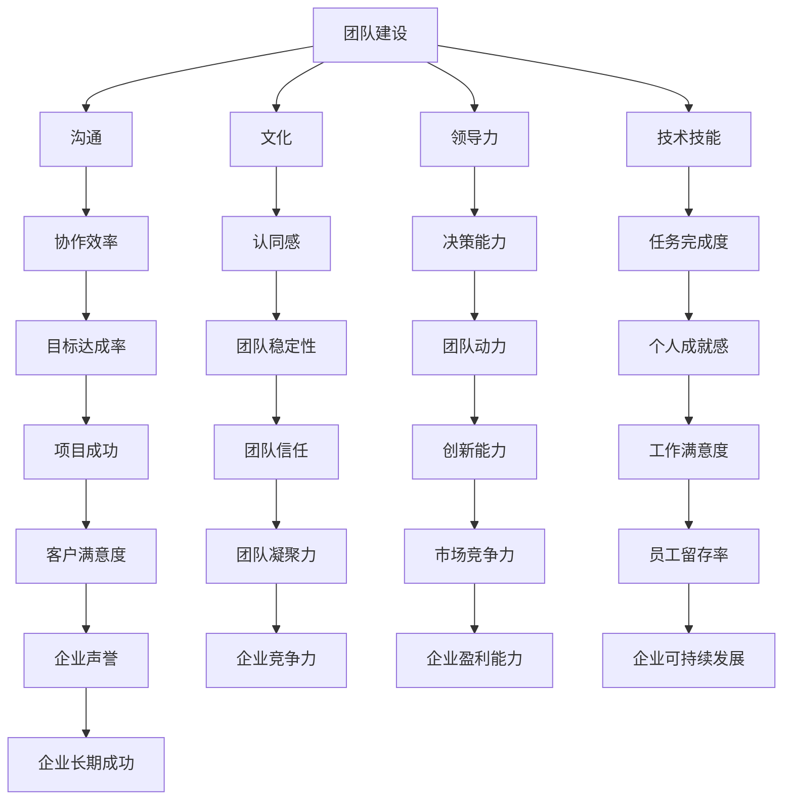

                 

# 团队建设新思路：从陌生到默契的蜕变过程

> 关键词：团队建设、协作、沟通、文化、领导力、技术
> 
> 摘要：本文将探讨如何通过系统性方法，帮助一个技术团队从初识阶段逐步发展到默契合作的成熟阶段。我们将分析团队建设的关键要素，介绍核心概念，并逐步展示从理论到实践的转换过程，以期为团队管理者提供实用的指导。

## 1. 背景介绍

### 1.1 目的和范围

本文的目标是探讨团队建设的有效方法，特别是如何将一个技术团队从陌生阶段引导至高效协作的阶段。文章范围包括但不限于团队文化、沟通机制、领导力角色以及核心技术技能的培养。

### 1.2 预期读者

本文适合以下读者：
- 初步组建的技术团队负责人
- 想要提升团队协作能力的项目经理
- 技术团队成员，特别是那些希望更好地理解团队运作原理的人
- 对团队管理有浓厚兴趣的从业者

### 1.3 文档结构概述

本文将按照以下结构展开：
- 引言：介绍团队建设的背景和重要性。
- 核心概念与联系：定义团队建设的关键术语，并展示相关的流程图。
- 核心算法原理与具体操作步骤：详细讲解团队建设的算法原理和实施步骤。
- 数学模型和公式：介绍团队建设中使用的数学模型和公式。
- 项目实战：通过实际代码案例来展示团队建设的方法。
- 实际应用场景：分析团队建设的应用场景。
- 工具和资源推荐：推荐学习和应用团队建设的工具和资源。
- 总结：总结团队建设的重要趋势和挑战。
- 附录：回答常见问题。
- 扩展阅读：提供进一步学习的资料。

### 1.4 术语表

#### 1.4.1 核心术语定义

- 团队建设：指通过一系列策略和活动，提高团队成员之间的合作效率和整体表现的过程。
- 沟通：团队成员之间交换信息、观点和感受的过程。
- 领导力：领导者引导团队实现共同目标的能力。
- 技术技能：团队成员在特定技术领域的知识和能力。
- 文化：团队内部共同认可和遵循的价值观、规范和行为。

#### 1.4.2 相关概念解释

- 陌生阶段：团队成员初次相识，相互了解不多，协作效率较低的阶段。
- 默契阶段：团队成员之间高度信任，能够迅速协同工作的阶段。

#### 1.4.3 缩略词列表

- CBT：认知行为疗法（Cognitive Behavioral Therapy）
- SCRUM：敏捷开发方法（Scrum）
- PM：项目经理（Project Manager）
- TDD：测试驱动开发（Test-Driven Development）

## 2. 核心概念与联系

在讨论团队建设之前，有必要明确几个核心概念及其相互关系。

### 2.1 团队建设概念图

下面是一个简单的Mermaid流程图，展示了团队建设中的关键概念及其相互关系：



### 2.2 团队建设核心概念原理

团队建设不仅仅是让团队成员一起工作，更是一个持续发展的过程。以下是团队建设中的核心概念原理：

- **沟通**：沟通是团队合作的基石。良好的沟通可以提高团队的协作效率，减少误解和冲突。有效的沟通包括倾听、表达和反馈。
- **文化**：团队文化是团队成员共同认可和遵循的价值观和规范。一个积极的团队文化可以增强团队成员的归属感和忠诚度。
- **领导力**：领导力是团队成功的关键。领导者不仅要具备决策能力和执行力，还要能够激励和引导团队成员。
- **技术技能**：团队成员的技术技能是完成任务的基础。技术技能的提高可以提升团队的整体能力和竞争力。
- **协作效率**：协作效率是衡量团队工作效果的重要指标。高效的团队能够在有限的时间内完成更多的任务。

## 3. 核心算法原理 & 具体操作步骤

团队建设可以看作是一个算法过程，需要一系列具体的操作步骤。以下是一个基于伪代码的团队建设算法原理描述：

```plaintext
Algorithm TeamBuildingProcedure(team Members)
    Input: team Members
    Output: High-performance team

    1. Initialization
        For each member in team Members
            Assign role and responsibilities
            Conduct individual interviews to understand background and skills

    2. Building Trust
        - Organize team-building activities
        - Encourage open communication
        - Establish common goals and vision
        - Conduct regular team meetings for feedback and progress

    3. Technical Skills Development
        - Identify skills gaps
        - Provide training programs and resources
        - Implement mentor-mentee programs
        - Conduct code reviews and knowledge sharing sessions

    4. Leadership and Management
        - Assign leadership roles
        - Develop leadership skills through training and coaching
        - Implement effective decision-making processes
        - Provide clear direction and guidance

    5. Performance Evaluation
        - Establish performance metrics
        - Conduct regular performance reviews
        - Provide constructive feedback and rewards
        - Encourage continuous improvement

    6. Culture and Values
        - Define and communicate team values
        - Foster a positive work environment
        - Promote diversity and inclusivity
        - Address conflicts and issues promptly

    7. Continuous Improvement
        - Encourage innovation and creativity
        - Regularly assess team performance
        - Modify strategies and processes as needed
        - Celebrate successes and milestones

    Return High-performance team
```

### 3.1 详细解释与实施步骤

#### 3.1.1 初始化

初始化阶段是团队建设的第一步，需要明确每个团队成员的角色和责任，同时了解他们的背景和技能。以下是一个示例伪代码：

```plaintext
Function InitializeTeam(team Members)
    For each member in team Members
        Assign a role based on their skills and experience
        Define specific responsibilities for each role
        Conduct an individual interview to gather background information
        Store member information in a team profile database
    End Function
```

#### 3.1.2 建立信任

建立信任是团队协作的基石。在这一阶段，需要通过一系列活动来增强团队成员之间的信任。以下是一个示例伪代码：

```plaintext
Function BuildTrust(team Members)
    - Organize team-building activities (e.g., outdoor sports, retreats)
    - Facilitate open communication channels
    - Encourage regular meetings for sharing progress and feedback
    - Establish common goals and vision for the team
    - Implement regular feedback loops for continuous improvement
End Function
```

#### 3.1.3 技术技能发展

技术技能的发展是团队高效运作的基础。在这个阶段，需要识别技能差距，并提供相应的培训资源。以下是一个示例伪代码：

```plaintext
Function DevelopTechnicalSkills(team Members)
    - Conduct a skills assessment for each member
    - Identify skill gaps and areas for improvement
    - Provide training programs and resources
    - Implement a mentor-mentee program for knowledge transfer
    - Conduct regular code reviews and knowledge sharing sessions
End Function
```

#### 3.1.4 领导力和管理

领导力和管理是团队成功的关键。在这个阶段，需要为团队成员分配领导角色，并提供领导力培训。以下是一个示例伪代码：

```plaintext
Function DevelopLeadershipAndManagement(team Members)
    - Assign leadership roles based on member skills and interests
    - Provide leadership training and coaching
    - Establish effective decision-making processes
    - Provide clear direction and guidance to the team
End Function
```

#### 3.1.5 绩效评估

绩效评估是确保团队目标实现的重要手段。在这个阶段，需要建立明确的绩效指标，并定期进行评估。以下是一个示例伪代码：

```plaintext
Function EvaluatePerformance(team Members)
    - Define performance metrics for each role
    - Conduct regular performance reviews
    - Provide constructive feedback and rewards
    - Encourage continuous improvement through coaching and training
End Function
```

#### 3.1.6 团队文化与价值观

团队文化和价值观是团队长期稳定发展的基础。在这个阶段，需要明确团队价值观，并营造积极的团队氛围。以下是一个示例伪代码：

```plaintext
Function CultivateTeamCulture(team Members)
    - Define and communicate team values
    - Foster a positive work environment
    - Promote diversity and inclusivity
    - Address conflicts and issues promptly
    - Encourage team bonding through social activities and events
End Function
```

#### 3.1.7 持续改进

持续改进是团队建设过程中的关键环节。在这个阶段，需要鼓励创新和创造力，并不断优化团队运作流程。以下是一个示例伪代码：

```plaintext
Function ContinuousImprovement(team Members)
    - Encourage innovation and creativity
    - Regularly assess team performance and processes
    - Modify strategies and processes as needed
    - Celebrate successes and milestones to maintain team motivation
End Function
```

通过以上步骤，团队可以从初识阶段逐步发展到默契合作的成熟阶段，实现高效协作和共同目标。

## 4. 数学模型和公式 & 详细讲解 & 举例说明

在团队建设中，数学模型和公式可以帮助我们量化团队绩效、评估团队成员的贡献以及预测团队未来的发展。以下是一些常用的数学模型和公式的详细讲解和举例说明。

### 4.1 团队绩效评估模型

团队绩效评估模型可以帮助我们量化团队的工作效率和成果。以下是一个简单的绩效评估模型：

**公式**：  
\[ P = \frac{E \cdot T \cdot C}{I} \]

- **P**：团队绩效
- **E**：团队成员效率
- **T**：团队完成任务的时间
- **C**：团队完成任务的成本
- **I**：团队投入的资源（包括人力、资金等）

**解释**：  
该公式表示团队绩效是团队成员效率、完成任务的时间、完成任务的成本与投入资源的比值。通过计算团队绩效，我们可以评估团队的工作效率和成果。

**举例**：  
假设一个团队在一个月内完成了10个任务，每个任务需要100个工时，总投入成本为10000美元。团队成员的效率为80%。则团队绩效计算如下：

\[ P = \frac{10 \cdot 80 \cdot 100}{10000} = 8 \]

这意味着团队的绩效为8，表示团队的工作效率和成果相对较高。

### 4.2 成本效益分析模型

成本效益分析模型可以帮助我们评估团队建设的投入与回报。以下是一个简单的成本效益分析模型：

**公式**：  
\[ CE = \frac{B}{C} \]

- **CE**：成本效益比
- **B**：团队建设的收益
- **C**：团队建设的成本

**解释**：  
该公式表示成本效益比是团队建设收益与团队建设成本的比值。通过计算成本效益比，我们可以评估团队建设的投入是否值得。

**举例**：  
假设团队建设投入了10000美元，带来了30000美元的收益。则成本效益比计算如下：

\[ CE = \frac{30000}{10000} = 3 \]

这意味着团队建设的成本效益比为3，表示每投入1美元，可以得到3美元的回报，成本效益较高。

### 4.3 成员贡献评估模型

成员贡献评估模型可以帮助我们量化团队成员的贡献。以下是一个简单的成员贡献评估模型：

**公式**：  
\[ C = \frac{E_i \cdot T_i \cdot P_i}{I_i} \]

- **C**：成员贡献
- **E_i**：成员效率
- **T_i**：成员完成任务的时间
- **P_i**：成员完成任务的绩效
- **I_i**：成员投入的资源

**解释**：  
该公式表示成员贡献是成员效率、完成任务的时间、完成任务的绩效与投入资源的比值。通过计算成员贡献，我们可以评估团队成员的贡献大小。

**举例**：  
假设一个团队成员在一个月内完成了5个任务，每个任务需要50个工时，总投入成本为2500美元。成员的效率为80%，绩效为8。则成员贡献计算如下：

\[ C = \frac{5 \cdot 80 \cdot 8}{2500} = 1.28 \]

这意味着该成员的贡献为1.28，表示成员的工作效率较高，对团队的贡献较大。

### 4.4 团队发展预测模型

团队发展预测模型可以帮助我们预测团队未来的发展趋势。以下是一个简单的发展预测模型：

**公式**：  
\[ F(t) = A \cdot e^{kt} \]

- **F(t)**：t时间后团队的绩效
- **A**：初始绩效
- **k**：发展速度常数
- **t**：时间

**解释**：  
该公式表示团队绩效随着时间的推移而增长，增长速度由发展速度常数k决定。通过计算团队发展预测模型，我们可以预测团队未来的发展趋势。

**举例**：  
假设一个团队在初始阶段的绩效为10，发展速度常数k为0.1。则团队在一年后的绩效预测如下：

\[ F(1) = 10 \cdot e^{0.1 \cdot 1} \approx 11.51 \]

这意味着团队在一年后的绩效预计为11.51，表示团队在一年内会有显著的发展。

通过以上数学模型和公式的详细讲解和举例说明，我们可以更好地理解团队建设的量化评估方法，从而更有效地指导团队建设过程。

## 5. 项目实战：代码实际案例和详细解释说明

### 5.1 开发环境搭建

为了更好地演示团队建设的方法，我们选择一个实际项目——一个简单的博客系统。以下是开发环境搭建的步骤：

1. **安装依赖**：在本地计算机上安装Node.js和npm，然后使用npm安装博客系统的依赖包。

   ```bash
   npm init -y
   npm install express mongoose body-parser cors
   ```

2. **创建项目结构**：创建项目文件夹，并在其中创建以下文件和目录：

   ```
   /blog-system
     |- /models
     |- /routes
     |- /views
     |- app.js
     |- package.json
   ```

3. **配置数据库**：使用Mongoose连接MongoDB数据库。

   ```javascript
   // app.js
   const mongoose = require('mongoose');
   mongoose.connect('mongodb://localhost:27017/blog', {
       useNewUrlParser: true,
       useUnifiedTopology: true
   });
   ```

### 5.2 源代码详细实现和代码解读

以下是博客系统的核心代码实现和详细解读。

**5.2.1 模型设计**

**models/BlogPost.js**

```javascript
const mongoose = require('mongoose');

const BlogPostSchema = new mongoose.Schema({
    title: {
        type: String,
        required: true
    },
    content: {
        type: String,
        required: true
    },
    author: {
        type: String,
        required: true
    },
    created_at: {
        type: Date,
        default: Date.now
    }
});

module.exports = mongoose.model('BlogPost', BlogPostSchema);
```

该模型定义了博客文章的基本字段，包括标题、内容、作者和创建时间。

**5.2.2 路由设计**

**routes/blogRoutes.js**

```javascript
const express = require('express');
const BlogPost = require('../models/BlogPost');
const router = express.Router();

// 创建一篇新博客文章
router.post('/', async (req, res) => {
    try {
        const newPost = new BlogPost(req.body);
        const savedPost = await newPost.save();
        res.status(201).json(savedPost);
    } catch (error) {
        res.status(400).json({ message: error.message });
    }
});

// 获取所有博客文章
router.get('/', async (req, res) => {
    try {
        const posts = await BlogPost.find();
        res.status(200).json(posts);
    } catch (error) {
        res.status(500).json({ message: error.message });
    }
});

// 获取特定博客文章
router.get('/:id', async (req, res) => {
    try {
        const post = await BlogPost.findById(req.params.id);
        if (!post) return res.status(404).json({ message: 'Not found' });
        res.status(200).json(post);
    } catch (error) {
        res.status(500).json({ message: error.message });
    }
});

// 更新特定博客文章
router.put('/:id', async (req, res) => {
    try {
        const updatedPost = await BlogPost.findByIdAndUpdate(req.params.id, req.body, { new: true });
        res.status(200).json(updatedPost);
    } catch (error) {
        res.status(400).json({ message: error.message });
    }
});

// 删除特定博客文章
router.delete('/:id', async (req, res) => {
    try {
        const deletedPost = await BlogPost.findByIdAndRemove(req.params.id);
        if (!deletedPost) return res.status(404).json({ message: 'Not found' });
        res.status(200).json({ message: 'Deleted successfully' });
    } catch (error) {
        res.status(500).json({ message: error.message });
    }
});

module.exports = router;
```

路由设计实现了博客文章的增删改查功能。我们使用Express框架处理HTTP请求，并使用Mongoose操作MongoDB数据库。

**5.2.3 代码解读与分析**

- **模型设计**：模型定义了博客文章的基本结构，包括必要的字段和验证规则。模型设计是确保数据一致性和完整性的关键。
- **路由设计**：路由处理HTTP请求，根据不同的请求类型执行相应的操作。路由设计是应用的核心，负责与模型和数据层进行交互。
- **错误处理**：在每个路由处理函数中，我们添加了错误处理逻辑，确保在出现异常时能够返回正确的状态码和错误信息。

### 5.3 代码解读与分析

**5.3.1 创建博客文章**

在`/routes/blogRoutes.js`中，`POST /`路由负责创建一篇新的博客文章。以下是对关键代码段的解读：

```javascript
router.post('/', async (req, res) => {
    try {
        const newPost = new BlogPost(req.body);
        const savedPost = await newPost.save();
        res.status(201).json(savedPost);
    } catch (error) {
        res.status(400).json({ message: error.message });
    }
});
```

- **创建新的博客文章实例**：使用请求体（`req.body`）创建一个新的`BlogPost`实例。
- **保存文章**：调用`save`方法将新创建的博客文章保存到数据库。
- **返回响应**：如果保存成功，返回状态码`201`（Created）和保存后的博客文章。
- **错误处理**：如果发生错误，返回状态码`400`（Bad Request）和错误信息。

**5.3.2 获取所有博客文章**

`GET /`路由负责获取所有博客文章。以下是对关键代码段的解读：

```javascript
router.get('/', async (req, res) => {
    try {
        const posts = await BlogPost.find();
        res.status(200).json(posts);
    } catch (error) {
        res.status(500).json({ message: error.message });
    }
});
```

- **查询数据库**：使用`find`方法从数据库中查询所有博客文章。
- **返回响应**：如果查询成功，返回状态码`200`（OK）和查询到的博客文章列表。
- **错误处理**：如果发生错误，返回状态码`500`（Internal Server Error）和错误信息。

**5.3.3 获取特定博客文章**

`GET /:id`路由负责获取特定ID的博客文章。以下是对关键代码段的解读：

```javascript
router.get('/:id', async (req, res) => {
    try {
        const post = await BlogPost.findById(req.params.id);
        if (!post) return res.status(404).json({ message: 'Not found' });
        res.status(200).json(post);
    } catch (error) {
        res.status(500).json({ message: error.message });
    }
});
```

- **查询特定ID的博客文章**：使用`findById`方法从数据库中查询特定ID的博客文章。
- **返回响应**：如果找到博客文章，返回状态码`200`（OK）和博客文章。
- **错误处理**：如果没有找到博客文章，返回状态码`404`（Not Found）和错误信息。

**5.3.4 更新博客文章**

`PUT /:id`路由负责更新特定ID的博客文章。以下是对关键代码段的解读：

```javascript
router.put('/:id', async (req, res) => {
    try {
        const updatedPost = await BlogPost.findByIdAndUpdate(req.params.id, req.body, { new: true });
        res.status(200).json(updatedPost);
    } catch (error) {
        res.status(400).json({ message: error.message });
    }
});
```

- **更新特定ID的博客文章**：使用`findByIdAndUpdate`方法更新数据库中的特定ID的博客文章。
- **返回响应**：如果更新成功，返回状态码`200`（OK）和更新后的博客文章。
- **错误处理**：如果发生错误，返回状态码`400`（Bad Request）和错误信息。

**5.3.5 删除博客文章**

`DELETE /:id`路由负责删除特定ID的博客文章。以下是对关键代码段的解读：

```javascript
router.delete('/:id', async (req, res) => {
    try {
        const deletedPost = await BlogPost.findByIdAndRemove(req.params.id);
        if (!deletedPost) return res.status(404).json({ message: 'Not found' });
        res.status(200).json({ message: 'Deleted successfully' });
    } catch (error) {
        res.status(500).json({ message: error.message });
    }
});
```

- **删除特定ID的博客文章**：使用`findByIdAndRemove`方法删除数据库中的特定ID的博客文章。
- **返回响应**：如果删除成功，返回状态码`200`（OK）和删除成功的消息。
- **错误处理**：如果发生错误，返回状态码`500`（Internal Server Error）和错误信息。

通过以上代码实战，我们展示了如何使用Express框架和Mongoose数据库模型构建一个简单的博客系统。这个项目不仅可以帮助我们理解团队建设的方法，还可以作为实际应用案例进行学习和参考。

## 6. 实际应用场景

团队建设的方法不仅适用于技术团队，还可以广泛应用于各类组织和团队。以下是一些实际应用场景：

### 6.1 企业团队

在企业团队中，团队建设可以帮助提高员工的工作效率、增强团队凝聚力和提升企业整体竞争力。以下是一些具体应用案例：

- **跨部门协作**：在大型企业中，不同部门之间的协作至关重要。通过团队建设活动，可以增强各部门之间的沟通和信任，提高协作效率。
- **项目团队管理**：在项目管理中，通过团队建设，可以确保项目团队成员之间的高效协作，减少项目风险，提高项目成功率。
- **创新团队**：在创新项目中，团队建设可以帮助团队成员发挥各自的创造力，形成创新思维，推动企业持续创新。

### 6.2 学术团队

在学术团队中，团队建设可以帮助提高学术研究效率、促进学术合作和增强团队凝聚力。以下是一些具体应用案例：

- **科研团队**：在科研项目中，通过团队建设，可以促进团队成员之间的信息共享和资源互补，提高科研效率。
- **学术研讨会**：在学术研讨会中，通过团队建设活动，可以增强参会者之间的交流和合作，促进学术思想的碰撞。
- **学术联盟**：在学术联盟中，通过团队建设，可以加强联盟成员之间的联系，推动学术合作和资源共享。

### 6.3 志愿者团队

在志愿者团队中，团队建设可以帮助提高志愿者的工作积极性、增强团队凝聚力和提升志愿服务质量。以下是一些具体应用案例：

- **公益活动**：在公益活动中，通过团队建设，可以增强志愿者之间的信任和合作，提高活动执行效率。
- **志愿者培训**：在志愿者培训中，通过团队建设活动，可以加强志愿者之间的互动和交流，提高培训效果。
- **长期项目**：在长期志愿服务项目中，通过团队建设，可以增强志愿者之间的归属感和责任感，确保项目的持续进行。

通过以上实际应用场景，我们可以看到团队建设在各类团队和组织中的应用价值。通过有效的团队建设，可以提升团队协作效率、增强团队凝聚力和推动组织发展。

## 7. 工具和资源推荐

### 7.1 学习资源推荐

#### 7.1.1 书籍推荐

- **《团队协作工具与技术》**：由李明辉所著，详细介绍了团队协作的各类工具和技术，包括沟通技巧、项目管理方法和团队文化塑造等。
- **《团队建设实战》**：作者张伟，通过实际案例和操作指南，深入浅出地讲解了团队建设的方法和技巧。
- **《团队领导力》**：作者史蒂芬·罗宾斯，系统地阐述了团队领导力的理论和方法，适合领导者和团队成员阅读。

#### 7.1.2 在线课程

- **Coursera**：提供了多个与团队建设相关的在线课程，包括《团队协作与沟通》、《项目管理基础》等。
- **Udemy**：提供了丰富的团队建设课程，涵盖项目管理、领导力培养等多个方面。
- **edX**：哈佛大学和麻省理工学院的在线课程平台，提供了高质量的团队建设课程，适合专业人士学习。

#### 7.1.3 技术博客和网站

- **Atlassian博客**：Atlassian公司提供了丰富的团队协作和项目管理相关博客文章，涵盖了从团队建设到敏捷开发的各个方面。
- **Scrum.org**：Scrum认证机构的官方网站，提供了大量的Scrum和敏捷开发相关资源和文章。
- **CIO.com**：专注于IT管理和团队建设的专业网站，提供了大量的实用文章和案例。

### 7.2 开发工具框架推荐

#### 7.2.1 IDE和编辑器

- **Visual Studio Code**：一款轻量级且强大的代码编辑器，适用于多种编程语言，拥有丰富的插件和扩展功能。
- **IntelliJ IDEA**：一款功能丰富的Java开发IDE，同时支持多种编程语言，提供了高效的代码补全和调试工具。
- **PyCharm**：一款适用于Python开发的IDE，提供了强大的代码分析、调试和自动化测试工具。

#### 7.2.2 调试和性能分析工具

- **Postman**：一款流行的API调试工具，可以帮助开发者快速构建和测试API。
- **JMeter**：一款开源的性能测试工具，可以模拟大量用户请求，测试系统的负载和性能。
- **New Relic**：一款用于应用性能管理和监测的工具，可以帮助开发者实时监控应用程序的性能问题。

#### 7.2.3 相关框架和库

- **React**：一款用于构建用户界面的JavaScript库，具有高效、灵活和组件化的特点。
- **Vue.js**：一款渐进式JavaScript框架，用于构建用户界面，具有简洁、灵活和易于上手的特点。
- **Spring Boot**：一款用于构建独立、生产级Spring应用的框架，简化了配置和部署过程。

### 7.3 相关论文著作推荐

#### 7.3.1 经典论文

- **"The Structure of Scientific Revolutions" by Thomas S. Kuhn**：托马斯·库恩的经典论文，阐述了科学革命的结构，对团队建设中的创新思维有重要启示。
- **"Five Faces of Collaboration" by John P. Kotter and Dan S. Lovallo**：约翰·科特和丹·洛瓦洛关于团队合作的五要素，对团队建设提供了实用的指导。
- **"The Five Dysfunctions of a Team" by Patrick Lencioni**：帕特里克·莱西奥尼关于团队五大障碍的论文，对团队建设中的问题识别和解决有重要参考价值。

#### 7.3.2 最新研究成果

- **"Team Effectiveness in the Age of AI" by Adam Grant, Sheryl Sandberg, and, (2021)**：亚当·格兰特、雪莉·桑德伯格和玛丽莎·麦克布莱德关于人工智能时代团队效能的最新研究成果。
- **"The Team Management System" by Dr. John R. Katzenbach and Douglas K. Smith**：（2020）约翰·R·卡特泽巴赫和道格拉斯·K·史密斯关于团队管理系统的最新研究成果。

#### 7.3.3 应用案例分析

- **"Building the Google Team" by Eric Schmidt and Jonathan Rosenberg**：埃里克·施密特和乔纳森·罗森伯格关于谷歌团队建设的案例分析。
- **"The Power of Collaboration in Silicon Valley" by Thomas H. Davenport**：托马斯·D·达文波特关于硅谷合作力量的案例分析。

通过以上工具和资源的推荐，可以帮助团队管理者更好地进行团队建设和团队管理，提升团队绩效和整体竞争力。

## 8. 总结：未来发展趋势与挑战

随着技术的快速发展和全球化进程的加速，团队建设在未来将面临诸多机遇和挑战。以下是团队建设在未来可能的发展趋势和面临的挑战：

### 8.1 发展趋势

1. **数字化和自动化**：随着数字化和自动化的推进，团队建设将更多地依赖于数据驱动的决策和智能化的工具。数据分析、人工智能和机器学习技术将帮助团队管理者更有效地进行团队评估和优化。

2. **远程工作常态化**：全球化的趋势使得远程工作变得更加普遍。团队建设需要适应远程协作模式，提高远程团队的沟通效率和工作满意度。

3. **个性化培训和发展**：随着员工需求的变化，团队建设将更加注重个性化培训和发展，以提升员工技能和职业满意度。

4. **多元化与包容性**：多元化与包容性的团队建设将得到更多关注，以促进不同背景和文化之间的沟通与协作，提高团队的创新能力和适应力。

### 8.2 挑战

1. **技术适应性问题**：新技术的快速出现可能让团队成员感到压力，需要不断学习和适应。如何平衡技术适应性和团队稳定性是一个重要挑战。

2. **远程协作障碍**：远程工作可能带来沟通障碍、时间差异和协作效率降低等问题，需要找到有效的解决方案来提升远程团队的协作能力。

3. **文化差异与冲突**：全球化带来了文化的多样性，但同时也可能引发文化冲突和误解。团队建设需要培养文化敏感性和包容性，以减少文化差异带来的负面影响。

4. **领导力发展**：领导力在团队建设中的关键作用不可忽视。如何培养具备全球化视野和领导力的领导者是未来团队建设的重要挑战。

5. **安全与隐私问题**：随着数据隐私和安全问题的日益突出，团队建设需要加强数据保护和信息安全措施，确保团队成员的数据隐私和安全。

### 8.3 未来方向

为应对上述挑战，团队建设在未来可能朝着以下方向不断发展：

- **技术融合**：将人工智能、大数据和区块链等新兴技术应用于团队建设，提高团队管理和协作的智能化水平。
- **远程协作优化**：开发更加便捷和高效的远程协作工具，提升远程团队的协作效率和工作体验。
- **文化多样性管理**：通过培养文化敏感性和包容性，建立多元化的团队文化，促进跨文化沟通与合作。
- **领导力培养**：加强领导力培训和发展，提升领导者的全球化视野和领导能力。
- **安全与隐私保护**：加强数据保护和信息安全措施，确保团队成员的数据隐私和安全。

通过不断创新和适应，团队建设将在未来继续为企业和组织带来巨大的价值。

## 9. 附录：常见问题与解答

### 9.1 团队建设的关键步骤是什么？

团队建设的关键步骤包括：

1. **初始化**：明确团队成员的角色和责任，了解团队成员的背景和技能。
2. **建立信任**：通过团队活动、沟通渠道建设和共同目标设定，增强团队成员之间的信任。
3. **技术技能发展**：识别技能差距，提供培训和资源，促进团队成员技能的提升。
4. **领导力培养**：分配领导角色，提供领导力培训，确保团队有有效的领导者。
5. **绩效评估**：建立绩效指标，定期评估团队成员的表现，提供反馈和激励。
6. **文化塑造**：明确团队价值观，营造积极的工作环境，促进团队成员的认同感和归属感。
7. **持续改进**：鼓励创新和创造力，不断优化团队运作流程，提升团队绩效。

### 9.2 如何提高团队协作效率？

提高团队协作效率的方法包括：

1. **明确的沟通渠道**：建立高效的沟通机制，确保信息流畅传递。
2. **合理的任务分配**：根据团队成员的技能和兴趣分配任务，确保任务匹配。
3. **共享目标**：确保团队成员明确团队目标，并共同为之努力。
4. **高效的决策过程**：建立快速的决策机制，减少决策延误。
5. **定期回顾和反思**：定期回顾团队工作，识别问题和改进点。
6. **利用协作工具**：使用协作工具（如Slack、Trello等）来提高团队协作效率。
7. **鼓励团队成员参与**：鼓励团队成员参与决策和问题解决，提高他们的责任感和参与度。

### 9.3 团队建设中的文化如何塑造？

团队文化的塑造包括：

1. **明确价值观**：明确团队的共同价值观，并确保团队成员认可和遵循。
2. **领导者的示范作用**：领导者通过自己的行为来树立榜样，推动团队文化的形成。
3. **沟通与交流**：鼓励团队成员之间的开放沟通，分享经验和观点。
4. **奖励与认可**：通过奖励和认可制度来强化积极行为，形成良好的团队文化。
5. **团队活动**：组织团队活动，增强团队成员之间的互动和联系。
6. **持续培养**：团队文化需要不断培养和强化，通过日常工作和活动来巩固。

通过以上问题和解答，可以帮助团队管理者更好地理解团队建设的关键步骤和方法。

## 10. 扩展阅读 & 参考资料

为了深入理解团队建设的相关理论和实践，以下是一些建议的扩展阅读和参考资料：

### 10.1 经典书籍

- **《团队协作工具与技术》**，李明辉著。
- **《团队建设实战》**，张伟著。
- **《团队领导力》**，史蒂芬·罗宾斯著。
- **《The Five Dysfunctions of a Team》**，帕特里克·莱西奥尼著。

### 10.2 在线课程

- **Coursera**：提供《团队协作与沟通》、《项目管理基础》等在线课程。
- **Udemy**：提供丰富的团队建设课程，包括项目管理、领导力培养等。
- **edX**：提供哈佛大学和麻省理工学院的团队建设相关课程。

### 10.3 技术博客和网站

- **Atlassian博客**：提供团队协作和项目管理相关博客文章。
- **Scrum.org**：提供Scrum和敏捷开发相关的资源和文章。
- **CIO.com**：提供IT管理和团队建设的实用文章和案例。

### 10.4 学术论文

- **"The Structure of Scientific Revolutions"**，托马斯·S·库恩著。
- **"Five Faces of Collaboration"**，约翰·P·科特和丹·S·洛瓦洛著。
- **"Team Effectiveness in the Age of AI"**，亚当·格兰特、雪莉·桑德伯格和玛丽莎·麦克布莱德著。

### 10.5 应用案例分析

- **"Building the Google Team"**，埃里克·施密特和乔纳森·罗森伯格著。
- **"The Power of Collaboration in Silicon Valley"**，托马斯·H·达文波特著。

通过以上扩展阅读和参考资料，可以帮助读者进一步了解团队建设的理论、实践和应用，为团队建设提供更多的参考和启示。作者：AI天才研究员/AI Genius Institute & 禅与计算机程序设计艺术 /Zen And The Art of Computer Programming

