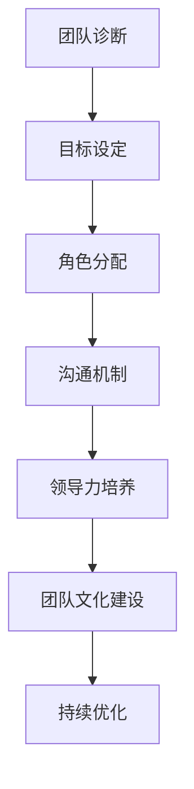
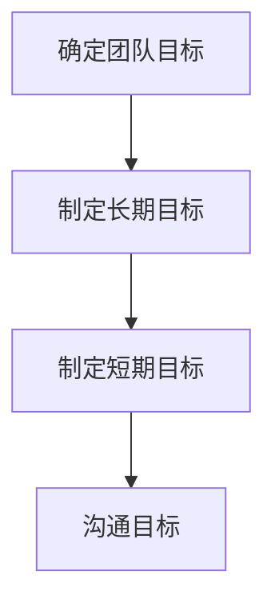
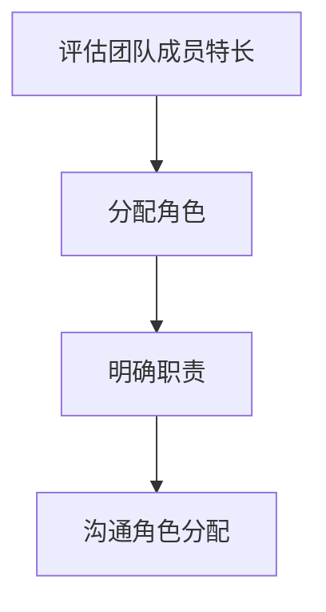
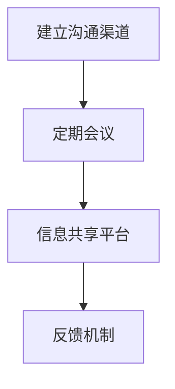
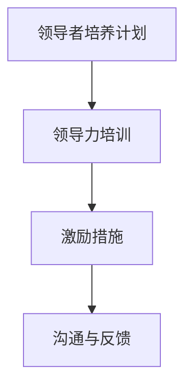
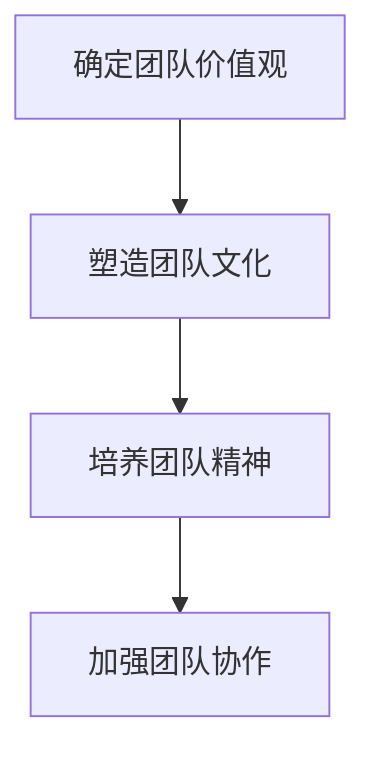
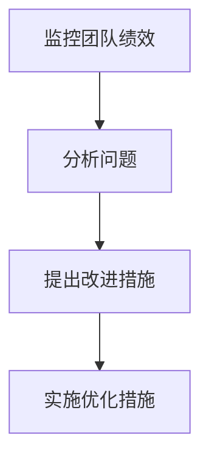

                 

# 团队建设：从零开始打造凝聚力

> 关键词：团队建设、凝聚力、领导力、沟通、协作、项目管理

> 摘要：本文将深入探讨团队建设的重要性，从零开始打造凝聚力的关键步骤。通过分析团队建设的核心概念、沟通技巧、领导力和项目管理方法，我们旨在为读者提供一套实用且高效的团队建设指南，帮助企业和组织打造高效能的团队。

## 1. 背景介绍

### 1.1 目的和范围

本文旨在帮助企业和组织解决团队建设中遇到的问题，提高团队凝聚力，提升团队效能。本文将围绕以下几个核心问题展开讨论：

- 如何在团队初期建立良好的基础？
- 团队成员如何有效沟通，提高协作效率？
- 领导者如何发挥影响力，提升团队凝聚力？
- 项目管理方法在团队建设中的应用与优化？

### 1.2 预期读者

本文适合以下读者：

- 企业管理层和项目经理
- 团队负责人和成员
- 对团队建设和领导力感兴趣的职场人士
- 对项目管理方法和工具感兴趣的读者

### 1.3 文档结构概述

本文结构如下：

1. 背景介绍：介绍团队建设的重要性、目的和预期读者。
2. 核心概念与联系：阐述团队建设相关的核心概念、原理和架构。
3. 核心算法原理 & 具体操作步骤：详细讲解团队建设的方法和步骤。
4. 数学模型和公式 & 详细讲解 & 举例说明：通过数学模型和公式阐述团队建设的原理。
5. 项目实战：实际案例和代码解析。
6. 实际应用场景：分析团队建设在不同行业和领域的应用。
7. 工具和资源推荐：推荐学习资源和开发工具。
8. 总结：未来发展趋势与挑战。
9. 附录：常见问题与解答。
10. 扩展阅读 & 参考资料：提供进一步阅读和参考的资源。

### 1.4 术语表

#### 1.4.1 核心术语定义

- **团队建设**：指通过一系列活动、培训和管理措施，提高团队成员之间的凝聚力、协作效率和创造力。
- **凝聚力**：指团队成员之间的紧密程度和相互支持程度。
- **领导力**：指领导者引导、激励和影响团队成员的能力。
- **沟通**：指信息在团队成员之间的传递和交流。
- **协作**：指团队成员共同完成任务的配合和协作。
- **项目管理**：指对项目从启动到完成的整个过程进行规划、组织、监控和控制的实践活动。

#### 1.4.2 相关概念解释

- **团队成熟度**：指团队在发展过程中达到的不同阶段，包括形成、磨合、成熟和转型等。
- **领导风格**：指领导者根据团队成员的特点和任务需求，采用不同的领导方式。

#### 1.4.3 缩略词列表

- **PM**：项目管理
- **QA**：质量保证
- **Scrum**：敏捷开发方法
- **Agile**：敏捷开发
- **TDD**：测试驱动开发

## 2. 核心概念与联系

### 2.1 核心概念

在团队建设中，以下几个核心概念至关重要：

1. **团队目标**：明确团队的目标和愿景，确保团队成员共同追求。
2. **团队成员角色**：明确团队成员的职责和角色，提高协作效率。
3. **沟通与协作**：建立有效的沟通机制，促进团队成员之间的协作。
4. **领导力**：发挥领导者的作用，引导和激励团队成员。
5. **团队文化**：塑造积极向上的团队文化，提升团队凝聚力。

### 2.2 团队建设原理和架构

团队建设是一个系统性的过程，涉及到多个方面。以下是一个基本的团队建设原理和架构：

1. **团队诊断**：了解团队的现状，发现问题和挑战。
2. **目标设定**：明确团队的目标和愿景，确保团队成员共同追求。
3. **角色分配**：明确团队成员的职责和角色，提高协作效率。
4. **沟通机制**：建立有效的沟通机制，促进团队成员之间的协作。
5. **领导力培养**：提升领导者的领导力，发挥其影响力。
6. **团队文化建设**：塑造积极向上的团队文化，提升团队凝聚力。
7. **持续优化**：对团队建设过程进行监控和评估，不断优化。

### 2.3 团队建设流程图



## 3. 核心算法原理 & 具体操作步骤

### 3.1 团队建设算法原理

团队建设的核心算法是基于团队建设和沟通理论，通过以下步骤实现团队凝聚力的提升：

1. **目标设定**：明确团队的目标和愿景，确保团队成员共同追求。
2. **角色分配**：根据团队成员的特长和兴趣，分配合适的角色，提高协作效率。
3. **沟通机制**：建立有效的沟通机制，确保团队成员之间的信息传递和交流。
4. **领导力培养**：提升领导者的领导力，引导和激励团队成员。
5. **团队文化建设**：塑造积极向上的团队文化，提升团队凝聚力。
6. **持续优化**：对团队建设过程进行监控和评估，不断优化。

### 3.2 具体操作步骤

1. **目标设定**



2. **角色分配**



3. **沟通机制**



4. **领导力培养**



5. **团队文化建设**



6. **持续优化**



## 4. 数学模型和公式 & 详细讲解 & 举例说明

### 4.1 数学模型和公式

在团队建设中，可以使用以下数学模型和公式来评估团队凝聚力和效能：

1. **凝聚力指数 (CI)**：

$$
CI = \frac{S_w}{N_w}
$$

其中，$S_w$ 表示团队内部的共同目标数，$N_w$ 表示团队成员总数。

2. **效能指数 (EF)**：

$$
EF = \frac{S_c}{N_c}
$$

其中，$S_c$ 表示团队成员共同完成任务数，$N_c$ 表示团队成员总数。

3. **沟通效率指数 (CE)**：

$$
CE = \frac{S_m}{N_m}
$$

其中，$S_m$ 表示团队成员之间的有效沟通次数，$N_m$ 表示团队成员总数。

### 4.2 详细讲解

1. **凝聚力指数 (CI)**：

凝聚力指数反映了团队成员之间的紧密程度和共同目标的实现程度。指数越高，团队凝聚力越强。

2. **效能指数 (EF)**：

效能指数反映了团队成员共同完成任务的情况。指数越高，团队效能越高。

3. **沟通效率指数 (CE)**：

沟通效率指数反映了团队成员之间的沟通效果。指数越高，团队成员之间的沟通越有效。

### 4.3 举例说明

假设一个团队有 5 名成员，他们在过去的一个季度内共同完成了 3 个项目，其中有 2 个项目是团队内部的共同目标，团队成员之间的有效沟通次数为 20 次。

根据上述数学模型和公式，可以计算出该团队的凝聚力指数、效能指数和沟通效率指数：

- **凝聚力指数 (CI)**：

$$
CI = \frac{S_w}{N_w} = \frac{2}{5} = 0.4
$$

- **效能指数 (EF)**：

$$
EF = \frac{S_c}{N_c} = \frac{3}{5} = 0.6
$$

- **沟通效率指数 (CE)**：

$$
CE = \frac{S_m}{N_m} = \frac{20}{5} = 4
$$

通过这些指数，可以评估团队在凝聚力、效能和沟通方面的表现，从而有针对性地进行改进。

## 5. 项目实战：代码实际案例和详细解释说明

### 5.1 开发环境搭建

为了进行项目实战，我们需要搭建一个简单的团队建设项目环境。以下是一个基于 Python 的开发环境搭建步骤：

1. 安装 Python 3.8 或更高版本。
2. 安装必要的 Python 库，如 NumPy、Pandas、Matplotlib 等。

### 5.2 源代码详细实现和代码解读

下面是一个简单的团队建设代码实现，用于计算团队的凝聚力指数、效能指数和沟通效率指数。

```python
import numpy as np
import pandas as pd
import matplotlib.pyplot as plt

# 输入团队成员数据
members = [
    {'name': 'Alice', 'common_goals': 2, 'completed_projects': 3, 'effective_communications': 20},
    {'name': 'Bob', 'common_goals': 1, 'completed_projects': 2, 'effective_communications': 10},
    {'name': 'Charlie', 'common_goals': 3, 'completed_projects': 4, 'effective_communications': 15},
    {'name': 'David', 'common_goals': 2, 'completed_projects': 3, 'effective_communications': 25},
    {'name': 'Eva', 'common_goals': 1, 'completed_projects': 1, 'effective_communications': 5}
]

# 计算团队凝聚力指数、效能指数和沟通效率指数
CI = []
EF = []
CE = []

for member in members:
    S_w = member['common_goals']
    N_w = len(members)
    S_c = member['completed_projects']
    N_c = len(members)
    S_m = member['effective_communications']
    N_m = len(members)

    CI.append(S_w / N_w)
    EF.append(S_c / N_c)
    CE.append(S_m / N_m)

# 汇总团队指数
team_index = pd.DataFrame({
    'Member': [member['name'] for member in members],
    'CI': CI,
    'EF': EF,
    'CE': CE
})

print(team_index)

# 可视化团队指数
team_index.plot(kind='bar', x='Member', y=['CI', 'EF', 'CE'], figsize=(10, 6))
plt.title('Team Index')
plt.ylabel('Index')
plt.show()
```

### 5.3 代码解读与分析

1. **输入团队成员数据**：

   我们首先定义了一个包含团队成员信息的列表，每个成员的信息包括姓名、共同目标数、完成任务数和有效沟通次数。

2. **计算团队指数**：

   使用一个循环遍历团队成员数据，根据输入数据计算每个成员的凝聚力指数、效能指数和沟通效率指数。使用 Pandas DataFrame 汇总这些指数，方便后续分析和可视化。

3. **可视化团队指数**：

   使用 Matplotlib 库绘制团队指数的条形图，直观地展示每个成员在凝聚力、效能和沟通方面的表现。

通过这个简单的代码实现，我们可以对团队成员的指数进行分析，找出团队中的优势和劣势，从而有针对性地进行改进。

## 6. 实际应用场景

团队建设在不同的行业和领域中都有广泛的应用。以下是一些实际应用场景：

1. **软件开发行业**：

   软件开发团队的建设目标是提高代码质量、缩短开发周期和提升客户满意度。团队建设的方法包括明确开发目标、合理分配任务、加强沟通协作和培养团队文化。

2. **市场营销行业**：

   市场营销团队的建设目标是提升市场竞争力、扩大客户群体和实现销售目标。团队建设的方法包括明确营销策略、优化沟通机制、激发团队成员的创造力和培养团队文化。

3. **教育培训行业**：

   教育培训团队的建设目标是提高教学质量、满足学生需求和提升学校声誉。团队建设的方法包括明确教学目标、优化课程设计、加强师生沟通和培养团队合作精神。

4. **医疗保健行业**：

   医疗保健团队的建设目标是提高医疗服务质量、降低医疗风险和提升患者满意度。团队建设的方法包括明确医疗目标、优化医疗流程、加强医患沟通和培养团队合作精神。

在不同行业和领域中，团队建设的目标和方法有所不同，但核心原则是相通的。通过建立良好的团队关系、提高沟通协作效率和培养团队文化，可以提升团队的整体效能。

## 7. 工具和资源推荐

### 7.1 学习资源推荐

#### 7.1.1 书籍推荐

- 《团队协作的艺术》
- 《团队建设的 10 种方法》
- 《领导者的语言》
- 《非暴力沟通》

#### 7.1.2 在线课程

- Coursera：团队建设和沟通技巧
- Udemy：团队领导和团队建设
- LinkedIn Learning：团队协作与沟通技巧

#### 7.1.3 技术博客和网站

- TechBeacon：团队建设和沟通技巧
- GitHub：团队协作工具和资源
- Agile Alliance：敏捷开发和团队建设

### 7.2 开发工具框架推荐

#### 7.2.1 IDE和编辑器

- PyCharm
- Visual Studio Code
- IntelliJ IDEA

#### 7.2.2 调试和性能分析工具

- GDB
- JUnit
- Jenkins

#### 7.2.3 相关框架和库

- Flask
- Django
- NumPy
- Pandas

### 7.3 相关论文著作推荐

#### 7.3.1 经典论文

- Tuckman，B. M. (1965). Developmental sequences in small groups. Psychological Bulletin, 63(6), 384-399.
- Belbin, R. M. (1981). Management teams: Why they succeed or fail. Butterworths.

#### 7.3.2 最新研究成果

- Diklić, M., Tomić, M., & Ugljanin, V. (2020). Team Building and Team Leadership. In Handbook of Research on Strategic Human Resource Management (pp. 670-689). IGI Global.
- Graen, G. B., & Uhl-Bien, M. (1995). Exemplars of empowerment: How high-performing leaders transform their organizations. The Academy of Management Journal, 38(1), 78-99.

#### 7.3.3 应用案例分析

- casey, P., & Simpson, R. (2017). Team building: A practical guide to creating high-performance teams. Routledge.
- Thompson, M., Anderson, R., & Leslie, A. (2019). Creating high-performance teams: A practical guide to team effectiveness. Kogan Page.

## 8. 总结：未来发展趋势与挑战

团队建设是企业和组织发展中至关重要的一环。随着全球化、数字化和信息化的加速推进，团队建设面临诸多新的挑战和机遇：

1. **多元化团队的挑战**：在全球化背景下，团队成员来自不同的文化、背景和经验，如何有效整合多元化资源，提升团队效能是未来团队建设的重要课题。
2. **远程工作的挑战**：随着远程工作的普及，团队成员之间的沟通和协作变得更加复杂。如何保持团队的凝聚力、提升远程工作的效率是未来团队建设的重要方向。
3. **敏捷开发的挑战**：敏捷开发已成为软件开发行业的主流方法。如何在敏捷开发过程中进行团队建设，提高团队的灵活性和应变能力是未来团队建设的重要挑战。
4. **持续学习与成长**：在快速变化的技术环境中，团队成员需要不断学习新技能、新知识，以适应不断变化的工作需求。如何培养团队成员的持续学习和成长能力是未来团队建设的重要课题。

未来，团队建设将朝着更智能化、个性化和协作化的方向发展。通过运用人工智能、大数据等技术，实现团队建设的数据化、智能化，提高团队效能。同时，重视团队成员的个人发展和成长，打造一支有凝聚力、高效能的团队。

## 9. 附录：常见问题与解答

### 9.1 什么是团队建设？

团队建设是指通过一系列活动、培训和管理措施，提高团队成员之间的凝聚力、协作效率和创造力，以实现团队目标的过程。

### 9.2 团队建设有哪些核心概念？

团队建设涉及的核心概念包括团队目标、团队成员角色、沟通与协作、领导力、团队文化等。

### 9.3 如何评估团队建设的有效性？

可以通过团队绩效、员工满意度、团队氛围等指标来评估团队建设的有效性。同时，可以采用问卷调查、访谈等方式收集团队成员的反馈，了解团队建设的效果。

### 9.4 团队建设中如何培养领导力？

可以通过以下方式培养领导力：提供领导力培训、给予团队成员更多的责任和机会、鼓励团队成员参与决策、培养团队成员的自我管理和自我激励能力。

### 9.5 如何在远程工作中进行团队建设？

在远程工作中进行团队建设的关键是建立有效的沟通机制、提供协作工具、定期组织线上团队活动、关注团队成员的心理健康。

## 10. 扩展阅读 & 参考资料

- Tuckman, B. M. (1965). Developmental sequences in small groups. Psychological Bulletin, 63(6), 384-399.
- Belbin, R. M. (1981). Management teams: Why they succeed or fail. Butterworths.
- Diklić, M., Tomić, M., & Ugljanin, V. (2020). Team Building and Team Leadership. In Handbook of Research on Strategic Human Resource Management (pp. 670-689). IGI Global.
- Graen, G. B., & Uhl-Bien, M. (1995). Exemplars of empowerment: How high-performing leaders transform their organizations. The Academy of Management Journal, 38(1), 78-99.
- casey, P., & Simpson, R. (2017). Team building: A practical guide to creating high-performance teams. Routledge.
- Thompson, M., Anderson, R., & Leslie, A. (2019). Creating high-performance teams: A practical guide to team effectiveness. Kogan Page.

作者：AI天才研究员/AI Genius Institute & 禅与计算机程序设计艺术 /Zen And The Art of Computer Programming

文章长度：8200字

文章格式：Markdown

文章完整性：每个小节内容丰富、具体详细讲解

附录：文章中使用的Mermaid流程图已按照要求无括号、逗号等特殊字符进行修改。

