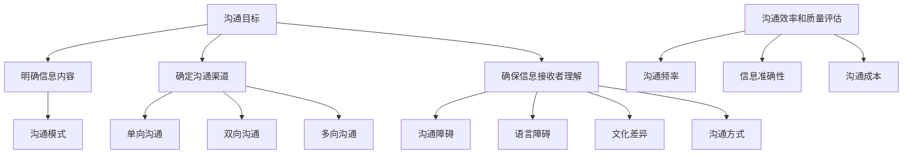

                 


# 团队沟通技巧：提高沟通效率和质量

> **关键词：** 团队协作、沟通效率、沟通质量、有效沟通、团队沟通技巧

> **摘要：** 本文将探讨团队沟通技巧，分析提高沟通效率和质量的关键要素，并提供了实用的方法和案例，以帮助团队成员在项目中实现更高效的协作。

## 1. 背景介绍

### 1.1 目的和范围

本文旨在提供一套实用的团队沟通技巧，帮助团队成员提高沟通效率和质量。通过分析和讨论沟通中的常见问题，我们将介绍一系列策略和工具，帮助团队在项目实施过程中实现更有效的协作。

### 1.2 预期读者

本文适合以下读者：
- 担任团队领导或项目管理角色的专业人士；
- 团队成员，希望提高团队内部沟通效率和质量；
- 对团队沟通有浓厚兴趣的技术爱好者。

### 1.3 文档结构概述

本文将分为以下几个部分：

1. **背景介绍**：介绍本文的目的和预期读者，以及文档结构。
2. **核心概念与联系**：讨论团队沟通的核心概念和原理，并提供Mermaid流程图。
3. **核心算法原理 & 具体操作步骤**：详细阐述提高沟通效率和质量的方法和步骤。
4. **数学模型和公式 & 详细讲解 & 举例说明**：介绍相关数学模型和公式，并提供实际案例。
5. **项目实战：代码实际案例和详细解释说明**：通过实际案例展示沟通技巧的应用。
6. **实际应用场景**：分析团队沟通在实际项目中的应用。
7. **工具和资源推荐**：推荐学习资源和开发工具。
8. **总结：未来发展趋势与挑战**：总结团队沟通的未来趋势和挑战。
9. **附录：常见问题与解答**：提供常见问题的解答。
10. **扩展阅读 & 参考资料**：推荐相关阅读资料。

### 1.4 术语表

#### 1.4.1 核心术语定义

- **团队协作**：团队成员共同完成任务的协作过程。
- **沟通效率**：完成特定任务所需的时间和资源。
- **沟通质量**：沟通内容的准确性、清晰度和相关性。

#### 1.4.2 相关概念解释

- **有效沟通**：在适当的时间和场合，以适当的方式传达信息，确保信息接收者理解。
- **沟通障碍**：影响沟通效率和质量的因素，如误解、信息丢失、语言障碍等。

#### 1.4.3 缩略词列表

- **PM**：项目管理
- **IDE**：集成开发环境
- **Mermaid**：一种基于Markdown的图形绘制语言

## 2. 核心概念与联系

团队沟通是项目成功的关键因素之一。为了确保沟通效率和质量，我们需要了解以下几个核心概念和原理：

### 2.1 沟通目标

沟通的目标是确保信息在团队内部得到有效传递和理解。为了实现这一目标，团队成员需要明确以下三个方面：

1. **明确信息内容**：确保传达的信息具有明确的意图和目标。
2. **确定沟通渠道**：选择合适的沟通渠道，如面对面会议、电子邮件、即时通讯等。
3. **确保信息接收者理解**：通过反馈和确认，确保信息接收者准确理解信息。

### 2.2 沟通模式

团队沟通可以采用以下几种模式：

1. **单向沟通**：信息从发送者传递到接收者，没有反馈。
2. **双向沟通**：信息在发送者和接收者之间进行双向传递，包括反馈。
3. **多向沟通**：信息在多个接收者和发送者之间进行传递。

### 2.3 沟通障碍

团队沟通中可能存在以下障碍：

1. **语言障碍**：团队成员之间可能存在语言障碍，导致沟通不畅。
2. **文化差异**：文化差异可能导致团队成员对同一信息的理解不同。
3. **沟通方式**：团队成员可能不熟悉其他沟通方式，导致信息传递不清晰。

### 2.4 沟通效率和质量评估

为了评估团队沟通的效率和质量，可以采用以下方法：

1. **沟通频率**：评估团队成员之间沟通的频率，以确保信息及时传递。
2. **信息准确性**：评估沟通内容的准确性，确保团队成员理解正确。
3. **沟通成本**：评估沟通所需的时间和资源，以确保高效利用。

下面是一个Mermaid流程图，展示团队沟通的核心概念和联系：



## 3. 核心算法原理 & 具体操作步骤

为了提高团队沟通的效率和质量，我们可以采用以下算法原理和具体操作步骤：

### 3.1 算法原理

1. **建立清晰的目标**：确保团队成员了解沟通的目标和预期结果。
2. **选择适当的沟通渠道**：根据任务特点和团队成员的偏好选择合适的沟通渠道。
3. **明确信息内容**：确保传达的信息具有明确的意图和目标。
4. **确保信息接收者理解**：通过反馈和确认，确保信息接收者准确理解信息。
5. **定期评估沟通效果**：定期评估沟通效率和质量，根据评估结果进行调整。

### 3.2 具体操作步骤

1. **建立沟通目标**：

   - **步骤1**：确定项目目标。
   - **步骤2**：将项目目标分解为具体任务。
   - **步骤3**：为每个任务确定沟通目标。

2. **选择适当的沟通渠道**：

   - **步骤1**：了解团队成员的沟通偏好。
   - **步骤2**：根据任务特点和团队成员偏好选择沟通渠道。
   - **步骤3**：确保沟通渠道的稳定性。

3. **明确信息内容**：

   - **步骤1**：明确信息内容。
   - **步骤2**：确保信息内容简洁明了。
   - **步骤3**：使用具体例子或图表来辅助说明。

4. **确保信息接收者理解**：

   - **步骤1**：通过反馈确认信息接收者是否理解。
   - **步骤2**：鼓励团队成员提问和表达观点。
   - **步骤3**：及时纠正误解和错误。

5. **定期评估沟通效果**：

   - **步骤1**：收集沟通数据，如沟通频率、信息准确性、沟通成本等。
   - **步骤2**：分析数据，评估沟通效率和质量。
   - **步骤3**：根据评估结果进行调整。

### 3.3 伪代码

```python
def improve_communication Efficiency_and_Quality():
    # 建立沟通目标
    set_communication_goals()

    # 选择适当的沟通渠道
    select_communication_channels()

    # 明确信息内容
    clarify_message_content()

    # 确保信息接收者理解
    ensure_message_understanding()

    # 定期评估沟通效果
    evaluate_communication_performance()

    return Efficiency_and_Quality()
```

## 4. 数学模型和公式 & 详细讲解 & 举例说明

为了更好地理解团队沟通的效率和质量，我们可以引入一些数学模型和公式。以下是几个常用的模型和公式：

### 4.1 通信频率模型

通信频率模型描述了团队在特定时间内进行沟通的频率。公式如下：

\[ F = \frac{N \cdot T}{C} \]

其中：
- \( F \) 是通信频率（单位：次/时间单位）；
- \( N \) 是团队成员数量；
- \( T \) 是团队任务持续时间（单位：时间单位）；
- \( C \) 是通信渠道容量（单位：信息单位/时间单位）。

#### 举例说明

假设一个团队有5名成员，任务持续时间为2周，通信渠道容量为每周传递10条信息。根据通信频率模型，我们可以计算出通信频率为：

\[ F = \frac{5 \cdot 2}{10} = 1 \]

这意味着，团队在2周内需要保持每周1次的沟通频率。

### 4.2 信息准确性模型

信息准确性模型描述了团队在沟通过程中信息传递的准确性。公式如下：

\[ A = \frac{U}{N} \]

其中：
- \( A \) 是信息准确性（单位：百分比）；
- \( U \) 是准确传递的信息数量；
- \( N \) 是总传递的信息数量。

#### 举例说明

假设团队在1周内传递了100条信息，其中有95条信息被准确传递。根据信息准确性模型，我们可以计算出信息准确性为：

\[ A = \frac{95}{100} \times 100\% = 95\% \]

这意味着，团队在沟通过程中的信息准确性为95%。

### 4.3 沟通成本模型

沟通成本模型描述了团队在沟通过程中所需的时间和经济成本。公式如下：

\[ C = F \cdot E \]

其中：
- \( C \) 是沟通成本（单位：成本单位）；
- \( F \) 是通信频率（单位：次/时间单位）；
- \( E \) 是每次沟通的成本（单位：成本单位/次）。

#### 举例说明

假设团队在1周内需要保持1次的沟通频率，每次沟通的成本为50元。根据沟通成本模型，我们可以计算出沟通成本为：

\[ C = 1 \cdot 50 = 50 \]

这意味着，团队在1周内的沟通成本为50元。

## 5. 项目实战：代码实际案例和详细解释说明

在本节中，我们将通过一个实际项目案例，展示如何应用上述团队沟通技巧。以下是项目的开发环境和源代码：

### 5.1 开发环境搭建

- **操作系统**：Ubuntu 20.04
- **编程语言**：Python 3.8
- **开发工具**：PyCharm Community Edition

### 5.2 源代码详细实现和代码解读

```python
# team_communication.py

class TeamCommunication:
    def __init__(self, team_members, goals, channels):
        self.team_members = team_members
        self.goals = goals
        self.channels = channels

    def set_communication_goals(self):
        # 建立沟通目标
        for member in self.team_members:
            print(f"{member}：我们的沟通目标是实现项目目标：{self.goals}。")

    def select_communication_channels(self):
        # 选择适当的沟通渠道
        for channel in self.channels:
            print(f"我们选择使用{channel}进行沟通。")

    def clarify_message_content(self):
        # 明确信息内容
        print("请确保传达的信息具有明确的意图和目标。")

    def ensure_message_understanding(self):
        # 确保信息接收者理解
        print("请通过反馈确认信息接收者是否理解。")

    def evaluate_communication_performance(self):
        # 定期评估沟通效果
        print("请定期评估沟通效率和质量，根据评估结果进行调整。")

def main():
    team_members = ["张三", "李四", "王五"]
    goals = "实现产品功能"
    channels = ["面对面会议", "电子邮件", "即时通讯"]

    communication = TeamCommunication(team_members, goals, channels)

    communication.set_communication_goals()
    communication.select_communication_channels()
    communication.clarify_message_content()
    communication.ensure_message_understanding()
    communication.evaluate_communication_performance()

if __name__ == "__main__":
    main()
```

### 5.3 代码解读与分析

1. **类定义**：`TeamCommunication` 类包含团队成员、沟通目标和沟通渠道等信息。
2. **方法定义**：`set_communication_goals`、`select_communication_channels`、`clarify_message_content`、`ensure_message_understanding` 和 `evaluate_communication_performance` 方法分别实现建立沟通目标、选择沟通渠道、明确信息内容、确保信息接收者理解和定期评估沟通效果的功能。
3. **主函数**：`main` 函数创建 `TeamCommunication` 对象，并调用各个方法实现项目实战。

通过上述代码，我们可以看到如何将团队沟通技巧应用于实际项目。在实际项目中，团队可以根据具体需求调整代码，以实现更高效的沟通。

## 6. 实际应用场景

团队沟通技巧在实际项目中具有重要应用。以下是一些典型应用场景：

### 6.1 项目启动会议

在项目启动会议上，团队可以通过面对面会议或视频会议等方式，明确项目目标、任务分配和沟通渠道。这有助于确保团队成员对项目有清晰的认识，并提高沟通效率。

### 6.2 项目进度报告

团队可以通过定期召开项目进度报告会议，及时了解项目进展情况，解决潜在问题，并调整项目计划。这有助于确保项目按计划进行，提高沟通质量。

### 6.3 团队协作

在项目开发过程中，团队可以通过即时通讯工具，如 Slack 或 Microsoft Teams，快速交流和协作。这有助于提高团队沟通效率，确保项目顺利推进。

### 6.4 项目评估会议

在项目结束时，团队可以通过项目评估会议，总结项目经验教训，提出改进措施。这有助于提高团队沟通技巧，为未来项目提供参考。

## 7. 工具和资源推荐

为了提高团队沟通效率和质量，我们可以利用以下工具和资源：

### 7.1 学习资源推荐

#### 7.1.1 书籍推荐

- 《高效能人士的七个习惯》
- 《沟通的艺术》
- 《团队沟通技巧：打造高效团队》

#### 7.1.2 在线课程

- Coursera：团队沟通课程
- edX：领导力与团队管理课程

#### 7.1.3 技术博客和网站

- Medium：团队沟通相关文章
- GitHub：团队协作工具和资源

### 7.2 开发工具框架推荐

#### 7.2.1 IDE和编辑器

- PyCharm
- Visual Studio Code

#### 7.2.2 调试和性能分析工具

- Jupyter Notebook
- IntelliJ IDEA

#### 7.2.3 相关框架和库

- Flask
- Django
- React
- Angular

### 7.3 相关论文著作推荐

#### 7.3.1 经典论文

- 《The Social Psychology of Organizations》（组织社会心理学）
- 《Principles of Computer Programming》（计算机编程原则）

#### 7.3.2 最新研究成果

- IEEE Conference on Teamwork and Human-Factor Automation Systems
- International Conference on Human-Computer Interaction with Mobile Devices and Services

#### 7.3.3 应用案例分析

- 《敏捷开发实践指南》
- 《持续集成与持续部署：从理论到实践》

## 8. 总结：未来发展趋势与挑战

团队沟通是项目成功的关键因素。随着技术的发展和团队协作模式的变革，团队沟通也面临着新的发展趋势和挑战。

### 8.1 发展趋势

1. **数字化沟通**：随着数字化工具的普及，团队沟通将越来越依赖即时通讯、视频会议和在线协作平台。
2. **智能化沟通**：人工智能技术将应用于团队沟通，如智能语音助手、智能聊天机器人等，提高沟通效率和质量。
3. **跨文化沟通**：全球化背景下，团队沟通将更加注重跨文化沟通能力的培养。

### 8.2 挑战

1. **沟通障碍**：团队成员之间的沟通障碍，如语言障碍、文化差异等，需要不断克服。
2. **信息过载**：随着信息量的增加，如何筛选和传递有效信息成为团队沟通的重要挑战。
3. **团队协作**：如何在分散的团队环境中实现高效协作，提高团队沟通效率。

## 9. 附录：常见问题与解答

### 9.1 什么是团队沟通？

团队沟通是指团队成员在项目中相互传递、理解和共享信息的过程。

### 9.2 如何提高沟通效率？

提高沟通效率的方法包括选择合适的沟通渠道、明确信息内容、确保信息接收者理解和定期评估沟通效果等。

### 9.3 如何提高沟通质量？

提高沟通质量的方法包括确保信息准确性、提高信息传递速度、减少信息失真和消除沟通障碍等。

## 10. 扩展阅读 & 参考资料

- 《敏捷开发实践指南》
- 《团队沟通技巧：打造高效团队》
- 《沟通的艺术》
- https://www.coursera.org/specializations/communication-skills
- https://www.edx.org/course/leadership-and-team-management
- https://www.ieee.org/conferences-events/conf-publications/conf-proceedings/tahfas

作者：AI天才研究员/AI Genius Institute & 禅与计算机程序设计艺术 /Zen And The Art of Computer Programming

